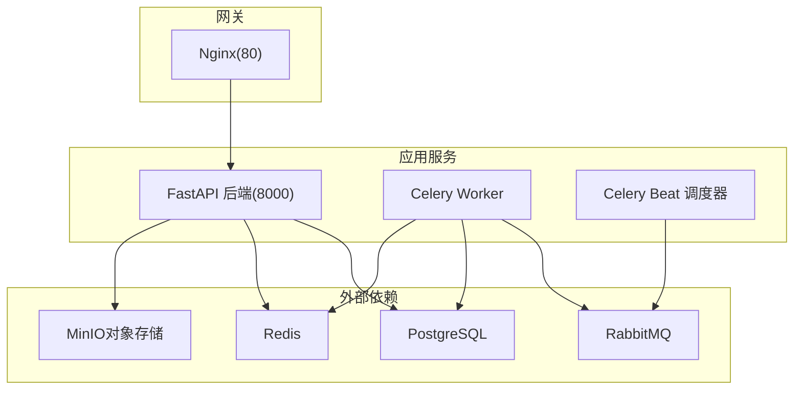
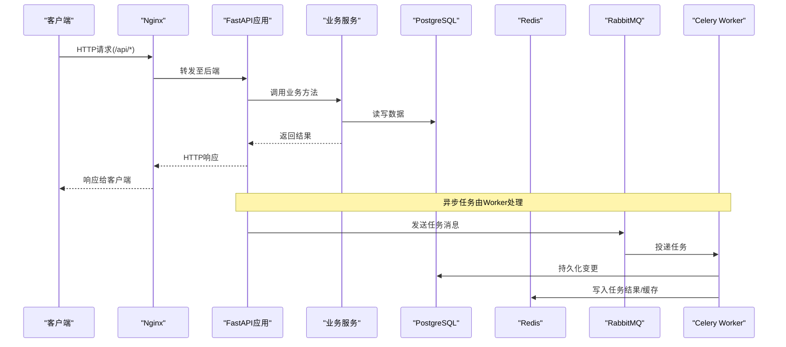
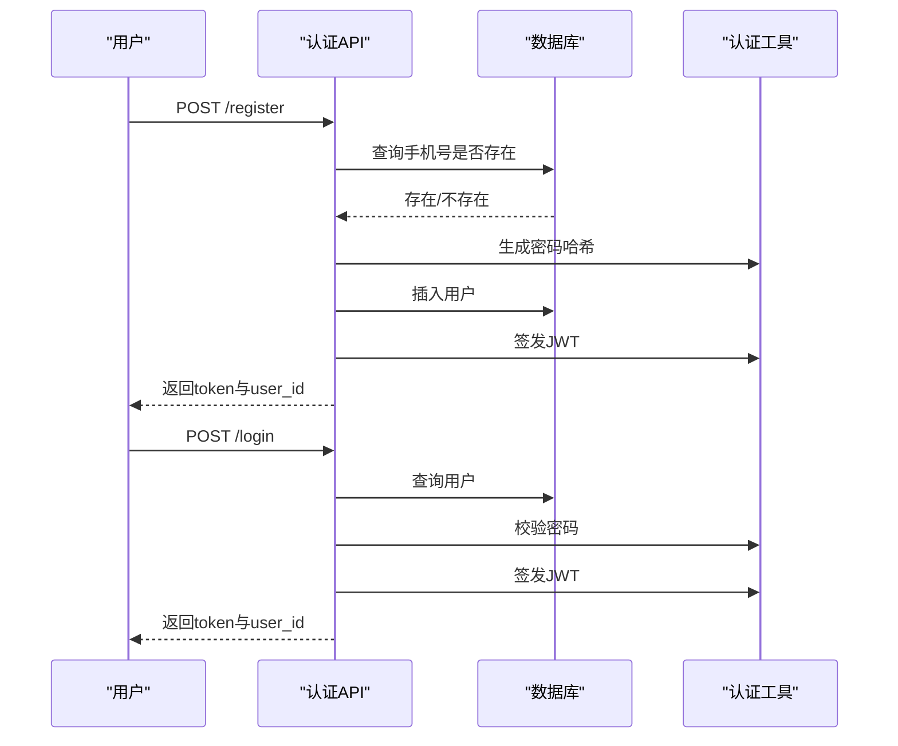
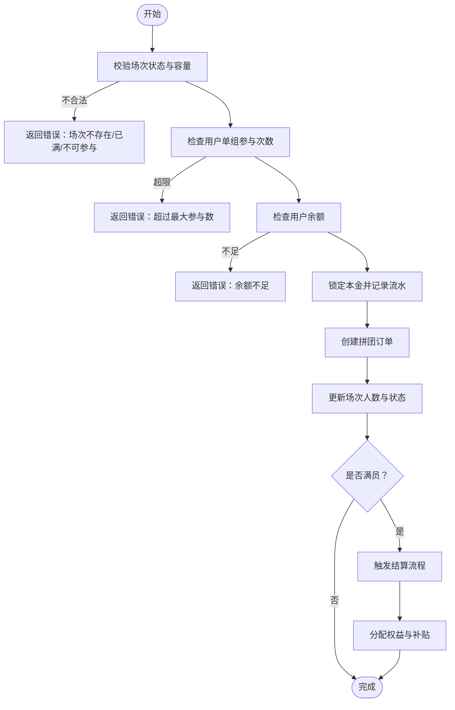
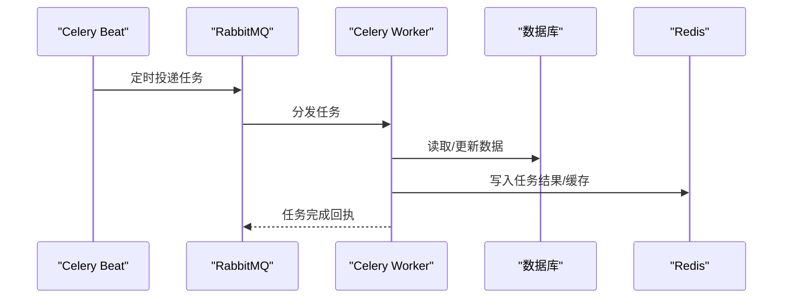
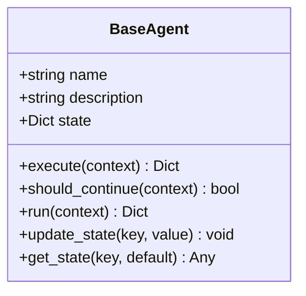
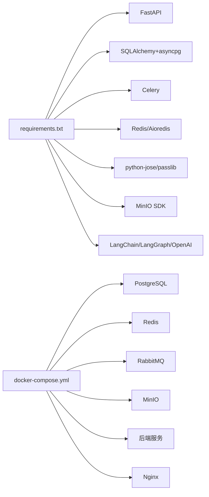

# 故障排查与FAQ

<cite>
**本文引用的文件**   
- [backend/app/config.py](file://backend/app/config.py)
- [backend/app/database.py](file://backend/app/database.py)
- [backend/app/main.py](file://backend/app/main.py)
- [docker-compose.yml](file://docker-compose.yml)
- [nginx.conf](file://nginx.conf)
- [backend/requirements.txt](file://backend/requirements.txt)
- [backend/app/api/v1/auth.py](file://backend/app/api/v1/auth.py)
- [backend/app/api/v1/group_buy.py](file://backend/app/api/v1/group_buy.py)
- [backend/app/services/group_buy_service.py](file://backend/app/services/group_buy_service.py)
- [backend/app/models/user.py](file://backend/app/models/user.py)
- [backend/app/utils/auth.py](file://backend/app/utils/auth.py)
- [backend/app/tasks/celery_app.py](file://backend/app/tasks/celery_app.py)
- [backend/app/tasks/group_buy_tasks.py](file://backend/app/tasks/group_buy_tasks.py)
- [backend/app/agents/base_agent.py](file://backend/app/agents/base_agent.py)
</cite>

## 目录
1. [简介](#简介)
2. [项目结构](#项目结构)
3. [核心组件](#核心组件)
4. [架构总览](#架构总览)
5. [详细组件分析](#详细组件分析)
6. [依赖关系分析](#依赖关系分析)
7. [性能考虑](#性能考虑)
8. [故障排查指南](#故障排查指南)
9. [监控与告警](#监控与告警)
10. [升级与维护](#升级与维护)
11. [结论](#结论)
12. [附录：常见问题FAQ](#附录常见问题faq)

## 简介
本文件面向AIxingmu项目的开发、测试与生产环境，提供系统化的故障排查方法与常见问题解答。内容覆盖数据库连接、Redis缓存、Celery任务、API接口错误等典型场景，并给出日志分析技巧、性能瓶颈定位、内存泄漏检测思路、监控指标解读与告警规则制定建议，以及升级维护注意事项与回滚策略，帮助团队持续完善故障知识库。

## 项目结构
后端采用FastAPI + SQLAlchemy异步ORM + Celery异步任务 + RabbitMQ消息中间件 + Redis结果存储的架构；通过Docker Compose编排PostgreSQL、Redis、RabbitMQ、MinIO、Nginx与后端服务。

图示来源
- [docker-compose.yml:1-111](file://docker-compose.yml#L1-L111)
- [nginx.conf:1-39](file://nginx.conf#L1-L39)
- [backend/app/main.py:1-59](file://backend/app/main.py#L1-L59)
- [backend/app/tasks/celery_app.py:1-56](file://backend/app/tasks/celery_app.py#L1-L56)

章节来源
- [docker-compose.yml:1-111](file://docker-compose.yml#L1-L111)
- [nginx.conf:1-39](file://nginx.conf#L1-L39)
- [backend/app/main.py:1-59](file://backend/app/main.py#L1-L59)

## 核心组件
- 配置中心：集中管理数据库、Redis、Celery、JWT、CORS、MinIO及业务参数。
- 数据访问：基于SQLAlchemy异步引擎与会话工厂，统一会话生命周期管理。
- API层：认证、用户、商品、拼团、贡献值、积分、消费券、门店、管理等路由。
- 业务服务：以GroupBuyService为代表的核心业务逻辑封装。
- 任务系统：Celery Worker执行异步任务，Beat负责定时调度。
- 网关：Nginx反向代理API与静态资源。

章节来源
- [backend/app/config.py:1-136](file://backend/app/config.py#L1-L136)
- [backend/app/database.py:1-40](file://backend/app/database.py#L1-L40)
- [backend/app/api/v1/auth.py:1-43](file://backend/app/api/v1/auth.py#L1-L43)
- [backend/app/api/v1/group_buy.py:1-65](file://backend/app/api/v1/group_buy.py#L1-L65)
- [backend/app/services/group_buy_service.py:1-348](file://backend/app/services/group_buy_service.py#L1-L348)
- [backend/app/tasks/celery_app.py:1-56](file://backend/app/tasks/celery_app.py#L1-L56)
- [backend/app/tasks/group_buy_tasks.py:1-54](file://backend/app/tasks/group_buy_tasks.py#L1-L54)
- [nginx.conf:1-39](file://nginx.conf#L1-L39)

## 架构总览
下图展示了从客户端到后端、再到中间件与数据库的关键交互路径，便于快速定位问题链路。

图示来源
- [nginx.conf:1-39](file://nginx.conf#L1-L39)
- [backend/app/main.py:1-59](file://backend/app/main.py#L1-L59)
- [backend/app/services/group_buy_service.py:1-348](file://backend/app/services/group_buy_service.py#L1-L348)
- [backend/app/tasks/celery_app.py:1-56](file://backend/app/tasks/celery_app.py#L1-L56)
- [backend/app/tasks/group_buy_tasks.py:1-54](file://backend/app/tasks/group_buy_tasks.py#L1-L54)

## 详细组件分析

### 认证与鉴权（登录/注册）
- 流程要点
  - 注册：校验手机号唯一性，创建用户并生成JWT。
  - 登录：校验手机号与密码，签发JWT。
  - 鉴权：从请求头Bearer Token解析用户ID。
- 常见异常
  - 400：手机号已注册。
  - 401：手机号或密码错误、无效Token。
- 排查建议
  - 确认SECRET_KEY与ALGORITHM一致。
  - 检查JWT过期时间配置是否合理。
  - 核对密码哈希算法与验证逻辑一致性。

图示来源
- [backend/app/api/v1/auth.py:1-43](file://backend/app/api/v1/auth.py#L1-L43)
- [backend/app/utils/auth.py:1-50](file://backend/app/utils/auth.py#L1-L50)

章节来源
- [backend/app/api/v1/auth.py:1-43](file://backend/app/api/v1/auth.py#L1-L43)
- [backend/app/utils/auth.py:1-50](file://backend/app/utils/auth.py#L1-L50)

### 拼团参与与结算
- 关键规则
  - 单ID单组最多参与固定数量订单。
  - 余额不足则拒绝参团。
  - 场次满员后触发结算：随机抽取1人拼中，其余退回本金并发放补贴。
- 状态流转
  - PENDING → ACTIVE → FULL → COMPLETED
- 风险点
  - 并发参团导致超卖或重复锁定。
  - 结算时订单数与场次人数不一致。
  - 权益发放金额计算精度与四舍五入。

图示来源
- [backend/app/api/v1/group_buy.py:1-65](file://backend/app/api/v1/group_buy.py#L1-L65)
- [backend/app/services/group_buy_service.py:1-348](file://backend/app/services/group_buy_service.py#L1-L348)

章节来源
- [backend/app/api/v1/group_buy.py:1-65](file://backend/app/api/v1/group_buy.py#L1-L65)
- [backend/app/services/group_buy_service.py:1-348](file://backend/app/services/group_buy_service.py#L1-L348)

### Celery任务与定时调度
- 任务类型
  - 每日创建场次、每小时检查并结算、每日检查过期、每周贡献值分红、每日贡献值递减核算、月度门店排名与分红。
- 运行方式
  - Worker执行具体任务，Beat按crontab调度。
- 常见问题
  - Broker/Backend连接失败。
  - 任务未执行或重复执行。
  - 异步代码在同步任务中的事件循环使用不当。

图示来源
- [backend/app/tasks/celery_app.py:1-56](file://backend/app/tasks/celery_app.py#L1-L56)
- [backend/app/tasks/group_buy_tasks.py:1-54](file://backend/app/tasks/group_buy_tasks.py#L1-L54)

章节来源
- [backend/app/tasks/celery_app.py:1-56](file://backend/app/tasks/celery_app.py#L1-L56)
- [backend/app/tasks/group_buy_tasks.py:1-54](file://backend/app/tasks/group_buy_tasks.py#L1-L54)

### AI Agent基类
- 职责
  - 定义Agent抽象接口，提供统一的run流程与日志记录。
- 扩展点
  - 实现execute与should_continue以定制业务逻辑。
- 排错要点
  - 关注Agent内部日志输出，捕获异常并返回结构化错误信息。

图示来源
- [backend/app/agents/base_agent.py:1-47](file://backend/app/agents/base_agent.py#L1-L47)

章节来源
- [backend/app/agents/base_agent.py:1-47](file://backend/app/agents/base_agent.py#L1-L47)

## 依赖关系分析
- 运行时依赖
  - FastAPI、uvicorn、SQLAlchemy(asyncpg)、Alembic、Pydantic v2、pydantic-settings。
  - 认证：python-jose、passlib(bcrypt)。
  - 异步任务：celery、rabbitmq-client。
  - Redis：redis、aioredis。
  - 对象存储：minio。
  - AI Agent：langchain、langgraph、openai。
  - 工具：httpx、python-dotenv。
- 容器编排
  - PostgreSQL、Redis、RabbitMQ、MinIO、Nginx与后端服务通过docker-compose关联，设置健康检查与端口映射。

图示来源
- [backend/requirements.txt:1-34](file://backend/requirements.txt#L1-L34)
- [docker-compose.yml:1-111](file://docker-compose.yml#L1-L111)

章节来源
- [backend/requirements.txt:1-34](file://backend/requirements.txt#L1-L34)
- [docker-compose.yml:1-111](file://docker-compose.yml#L1-L111)

## 性能考虑
- 数据库连接池
  - 根据并发量调整pool_size与max_overflow，避免连接耗尽或频繁创建销毁。
- 异步I/O
  - 确保所有数据库与外部依赖调用均为异步，避免阻塞事件循环。
- 任务批处理
  - 对批量结算与统计类任务进行分批处理，降低单次事务压力。
- 索引优化
  - 针对高频查询字段建立合适索引，减少全表扫描。
- 缓存策略
  - 热点数据（如活跃场次列表）可引入Redis缓存，注意失效与一致性策略。

[本节为通用指导，无需特定文件引用]

## 故障排查指南

### 一、数据库连接问题
- 症状
  - 启动时报连接失败、超时或连接池耗尽。
- 可能原因
  - DATABASE_URL配置错误（主机、端口、用户名、密码、库名）。
  - 网络不通或防火墙限制。
  - 连接池参数过小导致高并发下连接不足。
- 诊断步骤
  - 检查环境变量与配置文件中的DATABASE_URL。
  - 使用pg_isready或客户端直连验证连通性。
  - 查看数据库日志与慢查询日志。
  - 评估并发峰值并调优pool_size/max_overflow。
- 参考位置
  - [backend/app/config.py:16-20](file://backend/app/config.py#L16-L20)
  - [backend/app/database.py:10-21](file://backend/app/database.py#L10-L21)
  - [docker-compose.yml:4-20](file://docker-compose.yml#L4-L20)

章节来源
- [backend/app/config.py:16-20](file://backend/app/config.py#L16-L20)
- [backend/app/database.py:10-21](file://backend/app/database.py#L10-L21)
- [docker-compose.yml:4-20](file://docker-compose.yml#L4-L20)

### 二、Redis缓存异常
- 症状
  - 任务结果无法获取、缓存读写报错、连接超时。
- 可能原因
  - REDIS_URL配置错误或网络不通。
  - Redis实例内存不足或键空间冲突。
  - aioredis版本与Python环境不兼容。
- 诊断步骤
  - 验证REDIS_URL与端口可达。
  - 使用redis-cli检查键分布与内存占用。
  - 核对requirements中redis与aioredis版本。
- 参考位置
  - [backend/app/config.py:21-22](file://backend/app/config.py#L21-L22)
  - [backend/requirements.txt:19-21](file://backend/requirements.txt#L19-L21)
  - [docker-compose.yml:21-28](file://docker-compose.yml#L21-L28)

章节来源
- [backend/app/config.py:21-22](file://backend/app/config.py#L21-L22)
- [backend/requirements.txt:19-21](file://backend/requirements.txt#L19-L21)
- [docker-compose.yml:21-28](file://docker-compose.yml#L21-L28)

### 三、Celery任务失败
- 症状
  - 任务未执行、执行报错、结果丢失、重复执行。
- 可能原因
  - Broker(RabbitMQ)或Backend(Redis)连接失败。
  - 任务模块导入失败或函数签名不匹配。
  - 在同步任务中错误地运行异步代码。
- 诊断步骤
  - 检查CELERY_BROKER_URL与CELERY_RESULT_BACKEND配置。
  - 查看Worker与Beat日志，确认任务注册与调度。
  - 验证任务函数名称与beat_schedule一致。
  - 避免在同步任务中直接await异步代码，必要时使用事件循环包装。
- 参考位置
  - [backend/app/config.py:24-26](file://backend/app/config.py#L24-L26)
  - [backend/app/tasks/celery_app.py:9-21](file://backend/app/tasks/celery_app.py#L9-L21)
  - [backend/app/tasks/group_buy_tasks.py:1-54](file://backend/app/tasks/group_buy_tasks.py#L1-L54)
  - [docker-compose.yml:72-96](file://docker-compose.yml#L72-L96)

章节来源
- [backend/app/config.py:24-26](file://backend/app/config.py#L24-L26)
- [backend/app/tasks/celery_app.py:9-21](file://backend/app/tasks/celery_app.py#L9-L21)
- [backend/app/tasks/group_buy_tasks.py:1-54](file://backend/app/tasks/group_buy_tasks.py#L1-L54)
- [docker-compose.yml:72-96](file://docker-compose.yml#L72-L96)

### 四、API接口错误
- 症状
  - 401未授权、400业务校验失败、500服务器异常。
- 可能原因
  - JWT密钥或算法不一致、Token过期或缺失。
  - 业务参数校验失败（如手机号已注册、余额不足）。
  - 数据库或外部依赖异常未妥善处理。
- 诊断步骤
  - 检查请求头Authorization是否正确携带Bearer Token。
  - 核对SECRET_KEY与ALGORITHM配置。
  - 查看API日志与HTTP状态码，结合业务错误信息定位。
- 参考位置
  - [backend/app/utils/auth.py:24-49](file://backend/app/utils/auth.py#L24-L49)
  - [backend/app/api/v1/auth.py:14-42](file://backend/app/api/v1/auth.py#L14-L42)
  - [backend/app/api/v1/group_buy.py:26-38](file://backend/app/api/v1/group_buy.py#L26-L38)

章节来源
- [backend/app/utils/auth.py:24-49](file://backend/app/utils/auth.py#L24-L49)
- [backend/app/api/v1/auth.py:14-42](file://backend/app/api/v1/auth.py#L14-L42)
- [backend/app/api/v1/group_buy.py:26-38](file://backend/app/api/v1/group_buy.py#L26-L38)

### 五、Nginx反向代理问题
- 症状
  - 前端无法访问API、WebSocket升级失败、静态资源404。
- 可能原因
  - upstream配置错误、proxy_pass路径不匹配。
  - WebSocket升级头未正确传递。
  - 静态资源根目录未挂载或权限不足。
- 诊断步骤
  - 检查nginx.conf中upstream与location配置。
  - 确认后端服务端口与容器网络可达。
  - 查看Nginx错误日志与访问日志。
- 参考位置
  - [nginx.conf:1-39](file://nginx.conf#L1-L39)

章节来源
- [nginx.conf:1-39](file://nginx.conf#L1-L39)

### 六、日志分析与定位技巧
- 应用日志
  - 关注Agent与业务服务的info/error日志，快速定位异常上下文。
- 任务日志
  - 查看Worker与Beat日志，确认任务注册、调度与执行结果。
- 数据库日志
  - 开启慢查询日志，识别耗时SQL与锁等待。
- 网关日志
  - 分析Nginx访问与错误日志，定位上游超时与5xx错误。

章节来源
- [backend/app/agents/base_agent.py:31-40](file://backend/app/agents/base_agent.py#L31-L40)
- [backend/app/tasks/celery_app.py:15-21](file://backend/app/tasks/celery_app.py#L15-L21)

### 七、性能瓶颈定位
- 数据库层面
  - 使用EXPLAIN分析慢查询，补充缺失索引。
  - 评估连接池大小与事务粒度，避免长事务。
- 任务层面
  - 将大批量操作拆分为小批次，降低单次负载。
  - 使用幂等设计防止重复执行造成副作用。
- 缓存层面
  - 热点数据加缓存，注意缓存穿透与雪崩防护。

[本节为通用指导，无需特定文件引用]

### 八、内存泄漏检测
- 现象
  - 进程内存持续增长、GC回收效果不佳。
- 排查方法
  - 使用tracemalloc或memory_profiler定位大对象。
  - 检查是否有全局缓存无限增长或未释放的资源。
  - 审查异步任务中事件循环与临时对象的引用链。
- 建议
  - 避免在任务中持有大对象引用，及时释放数据库连接与文件句柄。

[本节为通用指导，无需特定文件引用]

## 监控与告警
- 关键指标
  - API：QPS、P95/P99延迟、错误率、健康检查通过率。
  - 数据库：连接数、慢查询数、锁等待、复制延迟。
  - Redis：命中率、内存使用、键数量、命令延迟。
  - Celery：队列长度、任务成功率、平均执行时长、重试次数。
  - Nginx：上游响应时间、5xx比例、带宽利用率。
- 告警规则建议
  - API错误率超过阈值（如5%）持续5分钟。
  - 数据库连接池使用率超过80%。
  - Redis内存使用超过80%或命中率低于85%。
  - Celery队列积压超过设定阈值且任务失败率上升。
  - Nginx上游超时比例升高。
- 采集与可视化
  - 使用Prometheus抓取指标，Grafana展示面板，结合Alertmanager告警。

[本节为通用指导，无需特定文件引用]

## 升级与维护
- 升级前准备
  - 备份数据库与对象存储数据。
  - 冻结写操作或切换到只读模式。
  - 准备回滚镜像与迁移脚本。
- 发布流程
  - 灰度发布：先扩容新实例，逐步切换流量。
  - 数据库迁移：使用Alembic增量迁移，确保向后兼容。
  - 任务兼容：确保新旧版本任务签名与处理逻辑兼容。
- 回滚策略
  - 快速切回旧镜像，恢复数据库到稳定快照。
  - 清理任务队列中不兼容的任务，避免重复执行。
- 注意事项
  - 配置项变更需同步更新docker-compose与环境变量。
  - 第三方依赖版本升级后进行兼容性测试。

章节来源
- [docker-compose.yml:52-96](file://docker-compose.yml#L52-L96)
- [backend/requirements.txt:1-34](file://backend/requirements.txt#L1-34)

## 结论
通过系统化梳理配置、依赖、API、任务与网关各层的潜在故障点，并结合日志分析、性能调优与监控告警机制，可有效提升AIxingmu平台的稳定性与可观测性。建议持续完善故障知识库，沉淀问题案例与最佳实践，形成闭环改进。

[本节为总结性内容，无需特定文件引用]

## 附录：常见问题FAQ
- 问：登录后立即报401未授权？
  - 答：检查SECRET_KEY与ALGORITHM是否一致，确认Token未过期且请求头携带正确的Bearer Token。
  - 参考：[backend/app/utils/auth.py:24-49](file://backend/app/utils/auth.py#L24-L49)
- 问：参团提示余额不足？
  - 答：确认用户钱包余额与参团价格，检查是否被其他订单锁定。
  - 参考：[backend/app/services/group_buy_service.py:130-136](file://backend/app/services/group_buy_service.py#L130-L136)
- 问：场次满员但未结算？
  - 答：检查定时任务是否正常运行，确认check_and_settle_sessions任务已注册并被调度。
  - 参考：[backend/app/tasks/celery_app.py:30-34](file://backend/app/tasks/celery_app.py#L30-L34)
- 问：Nginx代理API返回502？
  - 答：检查upstream指向的后端服务是否存活，查看Nginx错误日志与后端健康检查。
  - 参考：[nginx.conf:6-21](file://nginx.conf#L6-L21)
- 问：Celery任务未执行？
  - 答：确认Broker与Backend配置正确，Worker与Beat已启动，任务名称与调度配置一致。
  - 参考：[backend/app/tasks/celery_app.py:9-21](file://backend/app/tasks/celery_app.py#L9-L21)

章节来源
- [backend/app/utils/auth.py:24-49](file://backend/app/utils/auth.py#L24-L49)
- [backend/app/services/group_buy_service.py:130-136](file://backend/app/services/group_buy_service.py#L130-L136)
- [backend/app/tasks/celery_app.py:30-34](file://backend/app/tasks/celery_app.py#L30-L34)
- [nginx.conf:6-21](file://nginx.conf#L6-L21)
- [backend/app/tasks/celery_app.py:9-21](file://backend/app/tasks/celery_app.py#L9-L21)