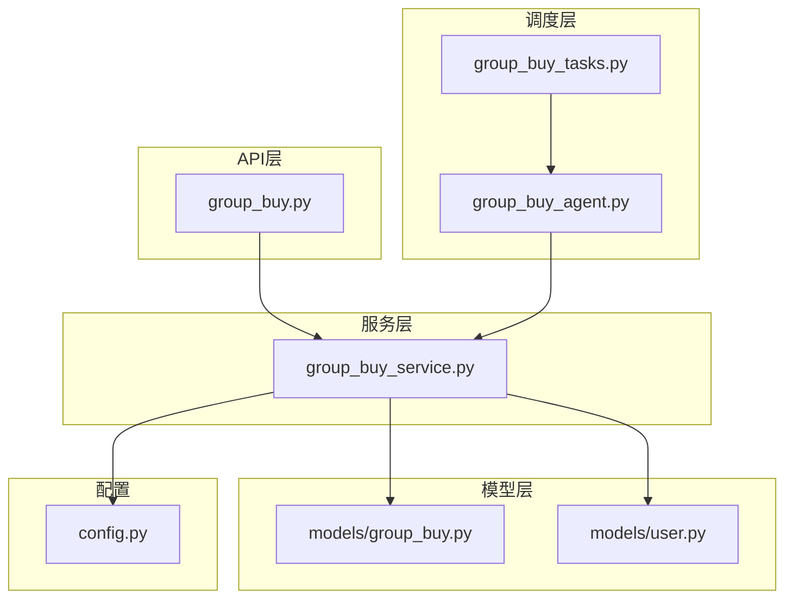
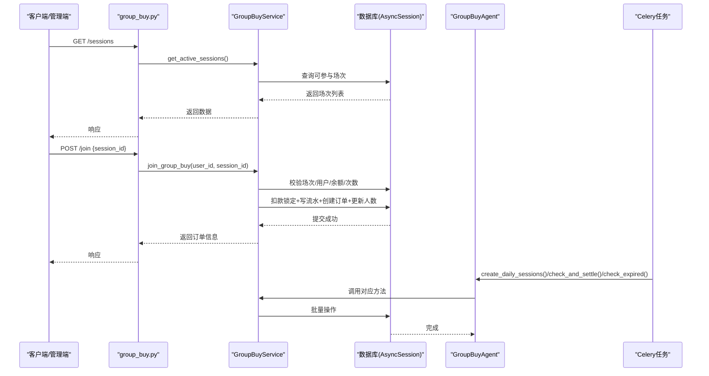
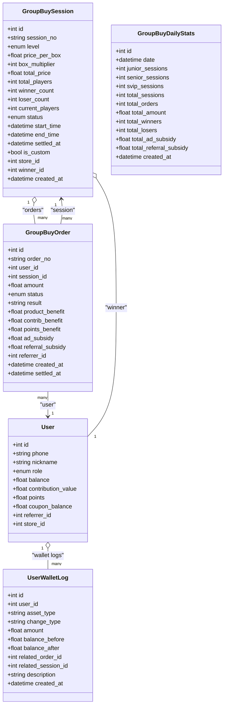
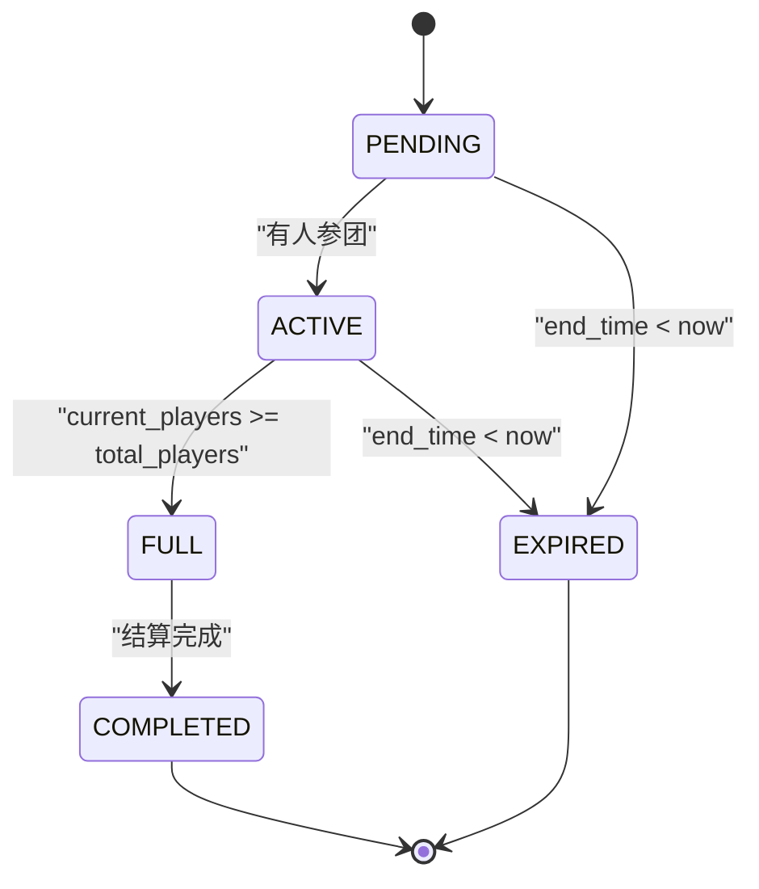
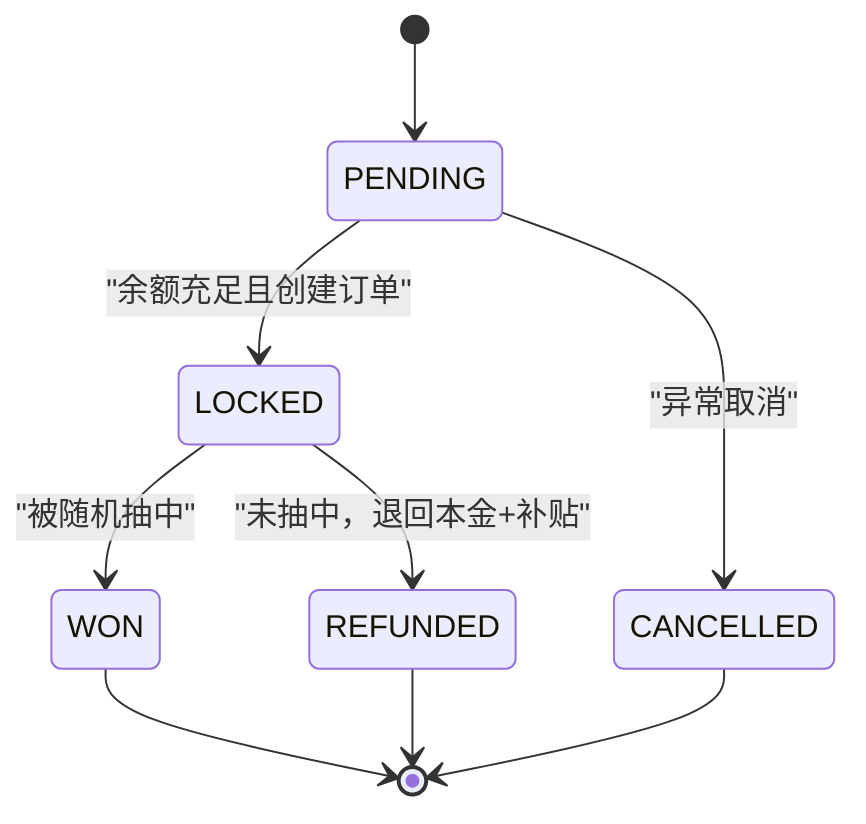
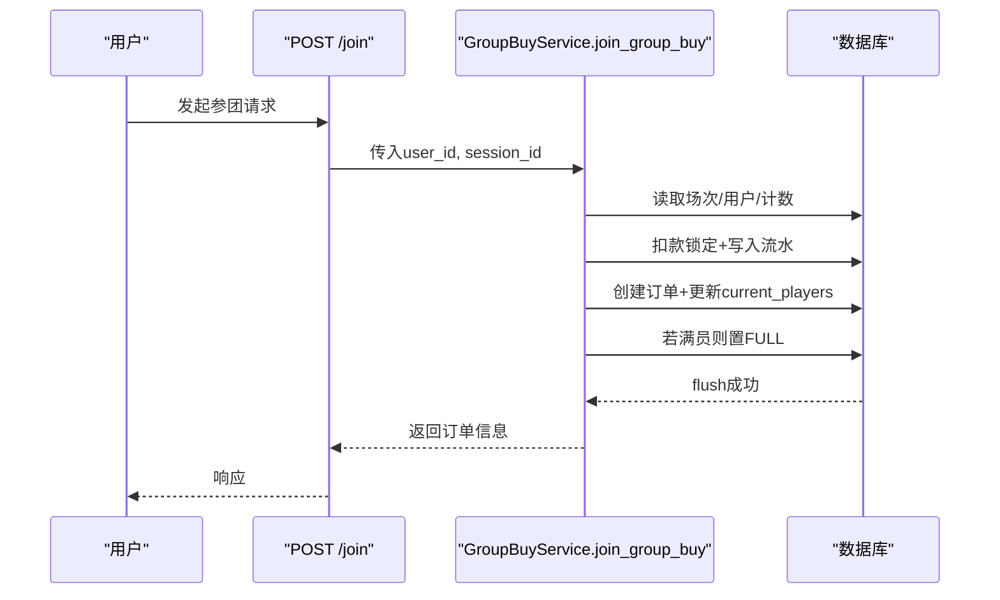
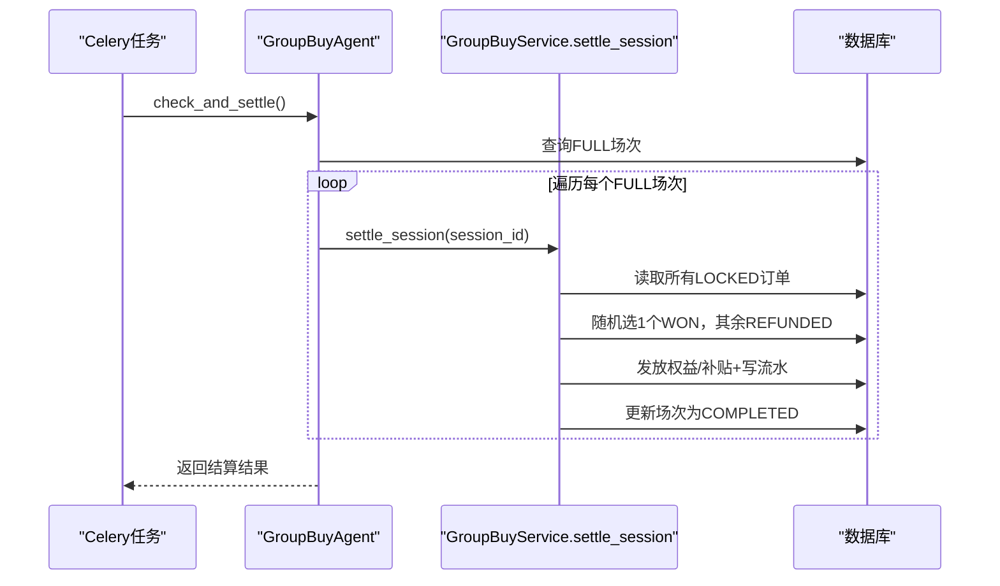
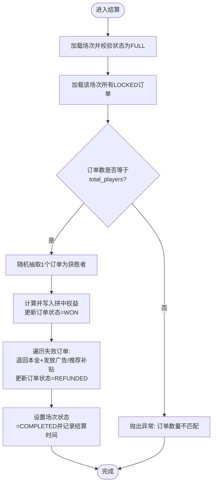
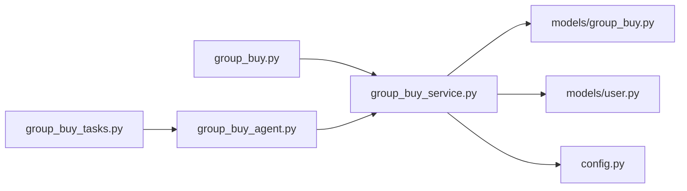

# 拼团数据模型

<cite>
**本文引用的文件**
- [backend/app/models/group_buy.py](file://backend/app/models/group_buy.py)
- [backend/app/models/user.py](file://backend/app/models/user.py)
- [backend/app/services/group_buy_service.py](file://backend/app/services/group_buy_service.py)
- [backend/app/api/v1/group_buy.py](file://backend/app/api/v1/group_buy.py)
- [backend/app/tasks/group_buy_tasks.py](file://backend/app/tasks/group_buy_tasks.py)
- [backend/app/agents/group_buy_agent.py](file://backend/app/agents/group_buy_agent.py)
- [backend/app/config.py](file://backend/app/config.py)
</cite>

## 目录
1. [引言](#引言)
2. [项目结构](#项目结构)
3. [核心组件](#核心组件)
4. [架构总览](#架构总览)
5. [详细组件分析](#详细组件分析)
6. [依赖关系分析](#依赖关系分析)
7. [性能与一致性](#性能与一致性)
8. [故障排查指南](#故障排查指南)
9. [结论](#结论)
10. [附录](#附录)

## 引言
本文件围绕AIxingmu项目的拼团业务，系统化梳理并深入解析拼团数据模型与相关流程。重点覆盖：
- GroupBuySession（拼团场次）的核心字段：商品关联、参与人数限制、开始结束时间、状态管理
- GroupBuyOrder（参团订单）的用户关联、参团时间、支付状态
- 拼团结果判定逻辑的数据结构设计及订单关联关系
- 拼团业务流程的状态机设计、并发控制机制与数据一致性保证
- 拼团数据的查询优化、统计分析与缓存策略建议

## 项目结构
后端采用分层架构：API层暴露REST接口，Service层实现核心业务逻辑，Agent与Celery任务负责定时调度，Model层定义数据模型与关系。

图表来源
- [backend/app/api/v1/group_buy.py:1-65](file://backend/app/api/v1/group_buy.py#L1-L65)
- [backend/app/services/group_buy_service.py:1-348](file://backend/app/services/group_buy_service.py#L1-L348)
- [backend/app/agents/group_buy_agent.py:1-67](file://backend/app/agents/group_buy_agent.py#L1-L67)
- [backend/app/tasks/group_buy_tasks.py:1-54](file://backend/app/tasks/group_buy_tasks.py#L1-L54)
- [backend/app/models/group_buy.py:1-158](file://backend/app/models/group_buy.py#L1-L158)
- [backend/app/models/user.py:1-93](file://backend/app/models/user.py#L1-L93)
- [backend/app/config.py:1-136](file://backend/app/config.py#L1-L136)

章节来源
- [backend/app/api/v1/group_buy.py:1-65](file://backend/app/api/v1/group_buy.py#L1-L65)
- [backend/app/services/group_buy_service.py:1-348](file://backend/app/services/group_buy_service.py#L1-L348)
- [backend/app/agents/group_buy_agent.py:1-67](file://backend/app/agents/group_buy_agent.py#L1-L67)
- [backend/app/tasks/group_buy_tasks.py:1-54](file://backend/app/tasks/group_buy_tasks.py#L1-L54)
- [backend/app/models/group_buy.py:1-158](file://backend/app/models/group_buy.py#L1-L158)
- [backend/app/models/user.py:1-93](file://backend/app/models/user.py#L1-L93)
- [backend/app/config.py:1-136](file://backend/app/config.py#L1-L136)

## 核心组件
- 拼团场次模型：GroupBuySession
- 参团订单模型：GroupBuyOrder
- 用户资产流水：UserWalletLog
- 每日统计表：GroupBuyDailyStats
- 业务服务：GroupBuyService
- 调度Agent：GroupBuyAgent
- 定时任务：group_buy_tasks
- 配置项：config.Settings

章节来源
- [backend/app/models/group_buy.py:1-158](file://backend/app/models/group_buy.py#L1-L158)
- [backend/app/models/user.py:1-93](file://backend/app/models/user.py#L1-L93)
- [backend/app/services/group_buy_service.py:1-348](file://backend/app/services/group_buy_service.py#L1-L348)
- [backend/app/agents/group_buy_agent.py:1-67](file://backend/app/agents/group_buy_agent.py#L1-L67)
- [backend/app/tasks/group_buy_tasks.py:1-54](file://backend/app/tasks/group_buy_tasks.py#L1-L54)
- [backend/app/config.py:1-136](file://backend/app/config.py#L1-L136)

## 架构总览
拼团系统的关键交互如下：
- 前端或管理端通过API调用创建场次、参与拼团、查询订单等
- Service层封装业务规则，执行余额锁定、订单创建、满员判定、结算发放
- Celery任务驱动Agent周期性创建场次、检查已满场次并结算、处理过期场次
- 模型层维护场次、订单、用户资产流水与统计数据

图表来源
- [backend/app/api/v1/group_buy.py:15-65](file://backend/app/api/v1/group_buy.py#L15-L65)
- [backend/app/services/group_buy_service.py:27-181](file://backend/app/services/group_buy_service.py#L27-L181)
- [backend/app/agents/group_buy_agent.py:21-63](file://backend/app/agents/group_buy_agent.py#L21-L63)
- [backend/app/tasks/group_buy_tasks.py:17-53](file://backend/app/tasks/group_buy_tasks.py#L17-L53)

## 详细组件分析

### 数据模型与关系图

图表来源
- [backend/app/models/group_buy.py:42-157](file://backend/app/models/group_buy.py#L42-L157)
- [backend/app/models/user.py:26-93](file://backend/app/models/user.py#L26-L93)

#### GroupBuySession（拼团场次）
- 商品关联：通过level、price_per_box、box_multiplier、total_price表达“法库啤酒”不同板块的定价与金额；同时支持门店自定义开团（is_custom、store_id）。
- 参与人数限制：total_players固定为31，winner_count=1，loser_count=30，current_players记录当前参与人数。
- 开始结束时间：start_time、end_time用于控制开团窗口；settled_at记录结算时间。
- 状态管理：PENDING→ACTIVE→FULL→COMPLETED/CANCELLED/EXPIRED，由Service与Agent协同推进。

章节来源
- [backend/app/models/group_buy.py:42-86](file://backend/app/models/group_buy.py#L42-L86)
- [backend/app/services/group_buy_service.py:27-90](file://backend/app/services/group_buy_service.py#L27-L90)
- [backend/app/agents/group_buy_agent.py:48-61](file://backend/app/agents/group_buy_agent.py#L48-L61)

#### GroupBuyOrder（参团订单）
- 用户关联：user_id指向用户表，referrer_id记录推荐人ID。
- 参团时间：created_at记录下单时间，settled_at记录结算时间。
- 支付状态：status使用LOCKED表示本金已锁定；WON/REFUNDED分别表示拼中与失败退款；result字段标记won/lost。
- 权益与补贴：product_benefit、contrib_benefit、points_benefit记录拼中权益；ad_subsidy、referral_subsidy记录失败补贴。

章节来源
- [backend/app/models/group_buy.py:89-131](file://backend/app/models/group_buy.py#L89-L131)
- [backend/app/services/group_buy_service.py:153-181](file://backend/app/services/group_buy_service.py#L153-L181)
- [backend/app/services/group_buy_service.py:226-306](file://backend/app/services/group_buy_service.py#L226-L306)

#### 用户资产流水（UserWalletLog）
- 记录balance/contribution/points/coupon四类资产的变动，包含before/after快照，便于审计与对账。
- 与订单和场次建立关联（related_order_id、related_session_id），支撑追溯。

章节来源
- [backend/app/models/user.py:74-93](file://backend/app/models/user.py#L74-L93)
- [backend/app/services/group_buy_service.py:138-151](file://backend/app/services/group_buy_service.py#L138-L151)
- [backend/app/services/group_buy_service.py:234-301](file://backend/app/services/group_buy_service.py#L234-L301)

#### 每日统计（GroupBuyDailyStats）
- 按日期聚合各级别场次数量、总订单数、总金额、赢/输人次、广告与推荐补贴支出，便于运营看板与财务核算。

章节来源
- [backend/app/models/group_buy.py:134-157](file://backend/app/models/group_buy.py#L134-L157)

### 业务流程与状态机

#### 场次状态机

图表来源
- [backend/app/models/group_buy.py:22-29](file://backend/app/models/group_buy.py#L22-L29)
- [backend/app/services/group_buy_service.py:164-171](file://backend/app/services/group_buy_service.py#L164-L171)
- [backend/app/agents/group_buy_agent.py:48-61](file://backend/app/agents/group_buy_agent.py#L48-L61)

#### 订单状态机

图表来源
- [backend/app/models/group_buy.py:32-39](file://backend/app/models/group_buy.py#L32-L39)
- [backend/app/services/group_buy_service.py:153-181](file://backend/app/services/group_buy_service.py#L153-L181)
- [backend/app/services/group_buy_service.py:226-306](file://backend/app/services/group_buy_service.py#L226-L306)

#### 参团流程时序

图表来源
- [backend/app/api/v1/group_buy.py:26-37](file://backend/app/api/v1/group_buy.py#L26-37)
- [backend/app/services/group_buy_service.py:93-181](file://backend/app/services/group_buy_service.py#L93-L181)

#### 结算流程时序

图表来源
- [backend/app/tasks/group_buy_tasks.py:30-40](file://backend/app/tasks/group_buy_tasks.py#L30-L40)
- [backend/app/agents/group_buy_agent.py:31-46](file://backend/app/agents/group_buy_agent.py#L31-L46)
- [backend/app/services/group_buy_service.py:183-321](file://backend/app/services/group_buy_service.py#L183-L321)

### 关键算法与判定逻辑

#### 满员判定与结算流程

图表来源
- [backend/app/services/group_buy_service.py:183-321](file://backend/app/services/group_buy_service.py#L183-L321)

## 依赖关系分析
- API层依赖Service层进行业务编排
- Service层依赖Model层进行数据持久化与关系操作
- Agent与Task作为调度入口，统一调用Service
- 配置集中管理拼团规则与比例参数

图表来源
- [backend/app/api/v1/group_buy.py:1-65](file://backend/app/api/v1/group_buy.py#L1-L65)
- [backend/app/services/group_buy_service.py:1-348](file://backend/app/services/group_buy_service.py#L1-L348)
- [backend/app/models/group_buy.py:1-158](file://backend/app/models/group_buy.py#L1-L158)
- [backend/app/models/user.py:1-93](file://backend/app/models/user.py#L1-L93)
- [backend/app/config.py:1-136](file://backend/app/config.py#L1-L136)
- [backend/app/tasks/group_buy_tasks.py:1-54](file://backend/app/tasks/group_buy_tasks.py#L1-L54)
- [backend/app/agents/group_buy_agent.py:1-67](file://backend/app/agents/group_buy_agent.py#L1-L67)

章节来源
- [backend/app/api/v1/group_buy.py:1-65](file://backend/app/api/v1/group_buy.py#L1-L65)
- [backend/app/services/group_buy_service.py:1-348](file://backend/app/services/group_buy_service.py#L1-L348)
- [backend/app/models/group_buy.py:1-158](file://backend/app/models/group_buy.py#L1-L158)
- [backend/app/models/user.py:1-93](file://backend/app/models/user.py#L1-L93)
- [backend/app/config.py:1-136](file://backend/app/config.py#L1-L136)
- [backend/app/tasks/group_buy_tasks.py:1-54](file://backend/app/tasks/group_buy_tasks.py#L1-L54)
- [backend/app/agents/group_buy_agent.py:1-67](file://backend/app/agents/group_buy_agent.py#L1-L67)

## 性能与一致性

### 并发控制与一致性
- 事务边界：参团与结算均在同一数据库会话内flush，确保原子性。
- 竞争条件风险：
  - 场次人数更新与状态切换存在TOCTOU风险（先读后写），在高并发下可能出现超卖。
  - 用户单组参与次数校验与余额检查同样存在竞态。
- 建议改进：
  - 在数据库层面增加唯一约束或行级锁（如SELECT ... FOR UPDATE）保护场次与用户计数。
  - 使用乐观锁版本号字段避免重复提交。
  - 将“扣款锁定+创建订单+更新人数”合并为一条原子SQL或使用数据库事务隔离级别串行化关键路径。

章节来源
- [backend/app/services/group_buy_service.py:104-181](file://backend/app/services/group_buy_service.py#L104-L181)
- [backend/app/services/group_buy_service.py:183-321](file://backend/app/services/group_buy_service.py#L183-L321)

### 查询优化
- 索引利用：
  - 场次：idx_session_level_status、idx_session_time
  - 订单：idx_gb_order_user_session、idx_gb_order_status
  - 钱包流水：idx_wallet_log_user_asset
- 分页与过滤：
  - 用户订单查询提供page/size分页，减少单次IO。
  - 场次查询支持按level过滤，结合索引提升效率。

章节来源
- [backend/app/models/group_buy.py:83-86](file://backend/app/models/group_buy.py#L83-L86)
- [backend/app/models/group_buy.py:128-131](file://backend/app/models/group_buy.py#L128-L131)
- [backend/app/models/user.py:90-92](file://backend/app/models/user.py#L90-L92)
- [backend/app/services/group_buy_service.py:324-347](file://backend/app/services/group_buy_service.py#L324-L347)

### 统计分析
- 使用GroupBuyDailyStats预聚合日维度指标，降低实时聚合压力。
- 建议在结算完成后异步更新统计表，避免阻塞主流程。

章节来源
- [backend/app/models/group_buy.py:134-157](file://backend/app/models/group_buy.py#L134-L157)

### 缓存策略（建议）
- 热点数据缓存：
  - 活跃场次列表（按level过滤）可缓存至Redis，设置短TTL并在满员时失效。
  - 用户订单分页结果可按用户ID+页码缓存短时数据。
- 一致性保障：
  - 写路径（参团、结算）后主动失效相关缓存键。
  - 使用缓存穿透防护（布隆过滤器或空值缓存）。

[本节为通用建议，不直接分析具体文件，故无章节来源]

## 故障排查指南
- 常见错误定位：
  - “场次不存在/已截止参与/已满员”：检查场次状态与current_players。
  - “单ID单组最多参与N单”：核对用户在该场次的PENDING/LOCKED订单计数。
  - “余额不足”：确认用户balance与total_price。
  - “订单数量不匹配”：结算前校验LOCKED订单数是否等于total_players。
- 日志与追踪：
  - 使用UserWalletLog的description字段快速定位资金变动原因。
  - 关注Agent日志中的“结算失败”记录，结合session_id回溯。

章节来源
- [backend/app/services/group_buy_service.py:104-181](file://backend/app/services/group_buy_service.py#L104-L181)
- [backend/app/services/group_buy_service.py:183-321](file://backend/app/services/group_buy_service.py#L183-L321)
- [backend/app/agents/group_buy_agent.py:41-46](file://backend/app/agents/group_buy_agent.py#L41-L46)

## 结论
本方案以清晰的模型设计与分层架构实现了拼团业务的开团、参团、结算与统计闭环。通过枚举状态机与Agent调度，保证了流程的可控性与可观测性。为保障高并发下的正确性，建议引入行级锁/乐观锁与更严格的原子事务边界；同时结合索引与预聚合统计，提升查询与报表性能。

## 附录

### 配置要点（节选）
- 每场人数与名额：GROUP_BUY_TOTAL_PLAYERS=31，GROUP_BUY_WINNERS=1，GROUP_BUY_LOSERS=30
- 时间段：GROUP_BUY_START_HOUR=10，GROUP_BUY_END_HOUR=22
- 单用户单组上限：GROUP_BUY_MAX_ORDERS_PER_USER=5
- 权益与补贴比例：WIN_*、LOSE_*系列比率

章节来源
- [backend/app/config.py:42-100](file://backend/app/config.py#L42-L100)