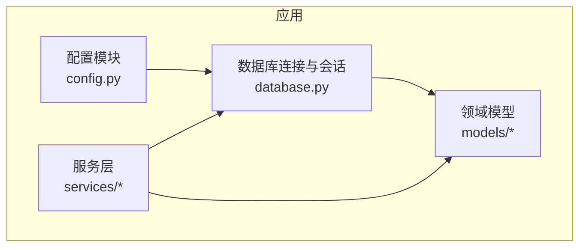
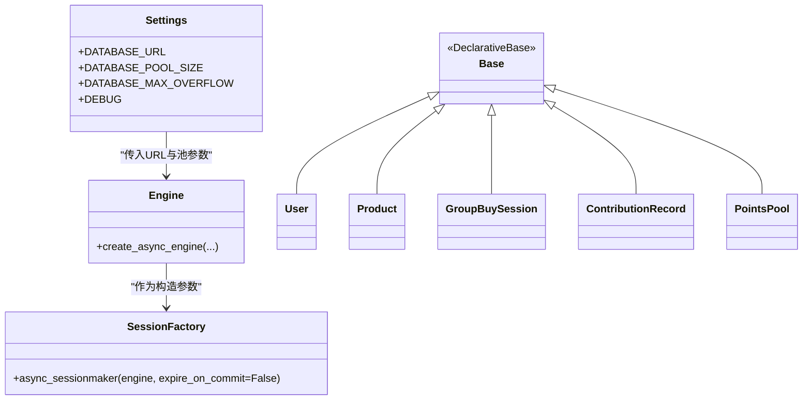
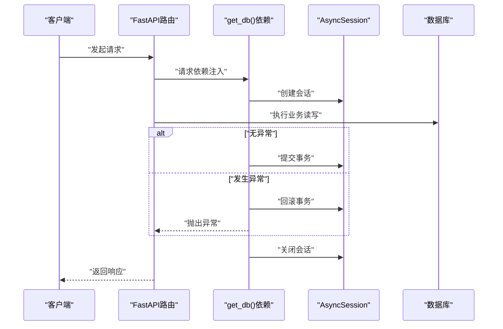
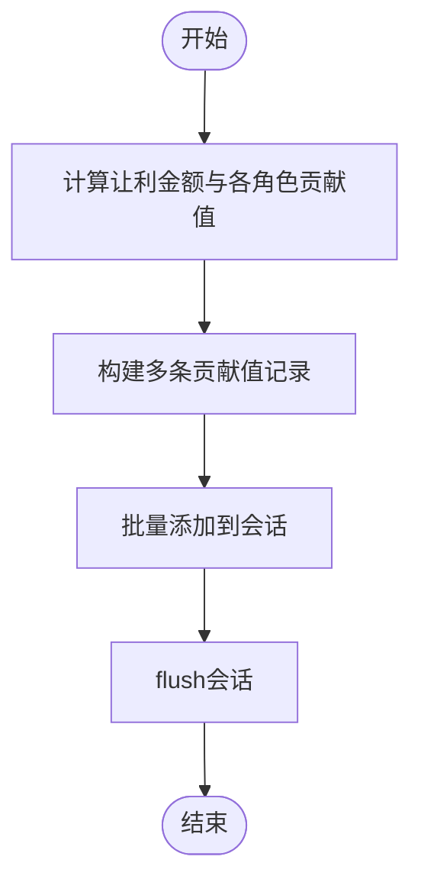
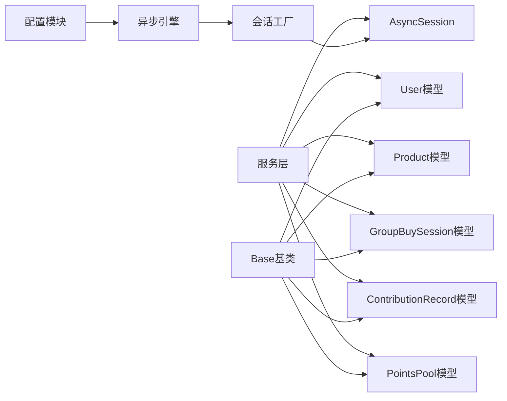

# 数据库架构设计

<cite>
**本文引用的文件**   
- [backend/app/database.py](file://backend/app/database.py)
- [backend/app/config.py](file://backend/app/config.py)
- [backend/app/models/__init__.py](file://backend/app/models/__init__.py)
- [backend/app/models/user.py](file://backend/app/models/user.py)
- [backend/app/models/product.py](file://backend/app/models/product.py)
- [backend/app/models/group_buy.py](file://backend/app/models/group_buy.py)
- [backend/app/models/contribution.py](file://backend/app/models/contribution.py)
- [backend/app/models/points.py](file://backend/app/models/points.py)
- [backend/app/services/contribution_service.py](file://backend/app/services/contribution_service.py)
</cite>

## 目录
1. [引言](#引言)
2. [项目结构](#项目结构)
3. [核心组件](#核心组件)
4. [架构总览](#架构总览)
5. [详细组件分析](#详细组件分析)
6. [依赖关系分析](#依赖关系分析)
7. [性能与容量规划](#性能与容量规划)
8. [故障恢复与监控](#故障恢复与监控)
9. [结论](#结论)
10. [附录：关键数据模型概览](#附录关键数据模型概览)

## 引言
本文件面向AIxingmu项目的数据库架构设计与实现，聚焦于基于SQLAlchemy Async的异步数据库连接架构。内容涵盖engine配置、连接池管理策略（pool_size、max_overflow）、会话工厂模式实现、AsyncSession生命周期管理、事务处理机制与错误回滚策略；同时说明Base基类的设计模式与ORM映射基础，并提供连接优化、性能调优建议、慢查询分析与容量规划指导。

## 项目结构
后端采用分层组织：配置集中于配置模块，数据库连接与会话管理集中在数据库模块，领域模型按业务域拆分到models子包，服务层封装复杂业务逻辑并调用数据库会话。

图表来源
- [backend/app/config.py:1-47](file://backend/app/config.py#L1-L47)
- [backend/app/database.py:1-40](file://backend/app/database.py#L1-L40)
- [backend/app/models/__init__.py:1-37](file://backend/app/models/__init__.py#L1-L37)

章节来源
- [backend/app/config.py:1-47](file://backend/app/config.py#L1-L47)
- [backend/app/database.py:1-40](file://backend/app/database.py#L1-L40)
- [backend/app/models/__init__.py:1-37](file://backend/app/models/__init__.py#L1-L37)

## 核心组件
- 异步引擎与连接池：通过异步引擎创建器初始化数据库连接，使用连接池参数控制并发与溢出能力。
- 会话工厂：基于会话工厂创建异步会话，统一设置提交后失效行为。
- Base基类：声明式ORM基类，所有模型继承该基类以完成表映射注册。
- 依赖注入与会话生命周期：提供FastAPI依赖函数，自动开启事务、提交或回滚，并在finally中关闭会话。

章节来源
- [backend/app/database.py:10-40](file://backend/app/database.py#L10-L40)
- [backend/app/config.py:16-19](file://backend/app/config.py#L16-L19)

## 架构总览
下图展示了从配置到引擎、会话工厂、Base基类以及各业务模型的依赖关系，体现“配置驱动 + 会话工厂 + 声明式ORM”的整体架构。

图表来源
- [backend/app/config.py:16-19](file://backend/app/config.py#L16-L19)
- [backend/app/database.py:10-26](file://backend/app/database.py#L10-L26)
- [backend/app/models/user.py:26-72](file://backend/app/models/user.py#L26-L72)
- [backend/app/models/product.py:30-73](file://backend/app/models/product.py#L30-L73)
- [backend/app/models/group_buy.py:42-87](file://backend/app/models/group_buy.py#L42-L87)
- [backend/app/models/contribution.py:32-69](file://backend/app/models/contribution.py#L32-L69)
- [backend/app/models/points.py:14-27](file://backend/app/models/points.py#L14-L27)

## 详细组件分析

### 异步引擎与连接池配置
- 引擎创建：使用异步引擎创建器，传入数据库URL与连接池大小、最大溢出数，并根据调试开关决定是否输出SQL日志。
- 连接池策略：
  - pool_size：常驻连接数，决定默认并发处理能力。
  - max_overflow：在请求峰值时临时扩展的连接上限，避免阻塞等待。
- 调试开关：echo参数可打印SQL语句，便于开发与慢查询定位。

章节来源
- [backend/app/database.py:10-15](file://backend/app/database.py#L10-L15)
- [backend/app/config.py:16-19](file://backend/app/config.py#L16-L19)

### 会话工厂与Base基类
- 会话工厂：基于引擎创建异步会话工厂，设置expire_on_commit为False，使已加载对象在提交后仍可用，减少重复查询。
- Base基类：使用声明式基类，所有模型继承该基类完成表映射与元数据注册。

章节来源
- [backend/app/database.py:17-26](file://backend/app/database.py#L17-L26)

### 会话生命周期与事务处理
- 依赖注入函数：在请求上下文中获取会话，使用上下文管理器确保资源释放。
- 事务语义：
  - 正常路径：yield会话供业务使用，随后提交事务。
  - 异常路径：捕获异常后执行回滚，并重新抛出异常。
  - finally路径：无论成功或失败均关闭会话，防止连接泄漏。
- 适用场景：适用于大多数写操作；对于只读查询，可在上层显式控制是否提交或仅flush。

图表来源
- [backend/app/database.py:29-40](file://backend/app/database.py#L29-L40)

章节来源
- [backend/app/database.py:29-40](file://backend/app/database.py#L29-L40)

### ORM映射与索引设计
- 用户域：包含用户基本信息、角色、推荐关系、钱包余额字段及代理/门店关联，定义常用查询索引以提升筛选与关联性能。
- 商品域：商品主表与SKU表分离，订单与订单明细表记录交易信息，针对品类、状态、门店等高频过滤条件建立索引。
- 拼团域：场次与订单表围绕时间窗口与状态进行索引设计，支持按级别、状态、时间范围的高效检索。
- 贡献值域：记录多角色分配与剩余价值，按用户与来源建立复合索引，提升统计与结算查询效率。
- 积分域：积分池与变动记录表，按用户与变更类型建立索引，支撑动态单价计算与兑换流程。

章节来源
- [backend/app/models/user.py:26-72](file://backend/app/models/user.py#L26-L72)
- [backend/app/models/product.py:30-73](file://backend/app/models/product.py#L30-L73)
- [backend/app/models/group_buy.py:42-87](file://backend/app/models/group_buy.py#L42-L87)
- [backend/app/models/contribution.py:32-69](file://backend/app/models/contribution.py#L32-L69)
- [backend/app/models/points.py:14-27](file://backend/app/models/points.py#L14-L27)

### 典型业务写入流程（贡献值生成）
贡献值服务根据交易金额与全局让利比例计算各方贡献值，批量写入记录并刷新会话，最终由外层事务提交或回滚。

图表来源
- [backend/app/services/contribution_service.py:39-143](file://backend/app/services/contribution_service.py#L39-L143)

章节来源
- [backend/app/services/contribution_service.py:39-143](file://backend/app/services/contribution_service.py#L39-L143)

## 依赖关系分析
- 配置到引擎：数据库URL与池参数来自配置模块，引擎创建直接依赖这些参数。
- 引擎到会话工厂：会话工厂以引擎为唯一依赖，负责会话实例化。
- 模型到Base：所有模型继承Base，完成ORM映射注册。
- 服务到会话与模型：服务层通过依赖注入获取会话，并使用模型进行CRUD与聚合计算。

图表来源
- [backend/app/config.py:16-19](file://backend/app/config.py#L16-L19)
- [backend/app/database.py:10-26](file://backend/app/database.py#L10-L26)
- [backend/app/models/user.py:26-72](file://backend/app/models/user.py#L26-L72)
- [backend/app/models/product.py:30-73](file://backend/app/models/product.py#L30-L73)
- [backend/app/models/group_buy.py:42-87](file://backend/app/models/group_buy.py#L42-L87)
- [backend/app/models/contribution.py:32-69](file://backend/app/models/contribution.py#L32-L69)
- [backend/app/models/points.py:14-27](file://backend/app/models/points.py#L14-L27)
- [backend/app/services/contribution_service.py:39-143](file://backend/app/services/contribution_service.py#L39-L143)

## 性能与容量规划

### 连接池参数调优
- pool_size：建议根据CPU核数与数据库服务器资源设定，通常设置为CPU核数的2-4倍，结合业务并发量评估。
- max_overflow：用于应对突发流量，建议为pool_size的30%-50%，避免过大导致数据库过载。
- echo：生产环境建议关闭，仅在开发或问题排查时开启。

章节来源
- [backend/app/config.py:16-19](file://backend/app/config.py#L16-L19)
- [backend/app/database.py:10-15](file://backend/app/database.py#L10-L15)

### 会话与事务优化
- expire_on_commit=False：减少提交后的重复加载，提高读取性能。
- 批量写入：在服务层集中add并flush，减少多次往返。
- 只读查询：若不需要持久化变更，可在上层明确不提交，避免不必要的开销。

章节来源
- [backend/app/database.py:17-21](file://backend/app/database.py#L17-L21)
- [backend/app/services/contribution_service.py:138-143](file://backend/app/services/contribution_service.py#L138-L143)

### 索引与查询优化
- 高频过滤字段建立单列或复合索引，如用户角色、推荐人ID、门店ID、拼团级别与状态、时间范围等。
- 统计类查询尽量利用已有索引，避免全表扫描。
- 对大表分页查询建议使用游标或基于主键的分页策略。

章节来源
- [backend/app/models/user.py:67-71](file://backend/app/models/user.py#L67-L71)
- [backend/app/models/product.py:68-72](file://backend/app/models/product.py#L68-L72)
- [backend/app/models/group_buy.py:83-86](file://backend/app/models/group_buy.py#L83-L86)
- [backend/app/models/contribution.py:66-69](file://backend/app/models/contribution.py#L66-L69)

### 容量规划建议
- 预估QPS与平均事务时长，结合连接池参数估算最大并发会话数。
- 关注数据库服务器的CPU、内存、磁盘I/O与网络带宽，确保连接池不会成为瓶颈。
- 定期评估热点表的数据增长趋势，必要时进行分库分表或归档策略。

[本节为通用指导，无需特定文件引用]

## 故障恢复与监控

### 错误回滚策略
- 依赖注入函数在异常分支执行回滚，保证数据一致性。
- 建议在业务层对关键事务增加重试与幂等保护，避免重复写入。

章节来源
- [backend/app/database.py:32-37](file://backend/app/database.py#L32-L37)

### 连接监控与慢查询分析
- 启用echo参数输出SQL语句，配合数据库慢查询日志进行分析。
- 监控连接池使用率与溢出次数，识别潜在的资源争用。
- 对热点查询添加合适索引，优化执行计划。

章节来源
- [backend/app/database.py:10-15](file://backend/app/database.py#L10-L15)

### 健康检查与重启恢复
- 在应用启动时尝试建立一次连接，验证数据库可用性。
- 遇到连接失败时，实施指数退避重试，避免雪崩效应。
- 定期清理空闲连接，防止连接泄漏。

[本节为通用指导，无需特定文件引用]

## 结论
本项目采用基于SQLAlchemy Async的异步数据库架构，通过配置驱动的引擎与连接池管理、统一的会话工厂与依赖注入，实现了高并发下的稳定读写能力。模型层遵循声明式ORM规范，合理设计索引与关系，满足业务复杂度与性能要求。在生产环境中，应持续监控连接池与慢查询，结合容量规划进行参数调优与架构演进。

[本节为总结性内容，无需特定文件引用]

## 附录：关键数据模型概览
- 用户域：用户、推荐关系、钱包流水、角色与区域信息。
- 商品域：商品、SKU、订单与订单明细。
- 拼团域：场次、订单、每日统计。
- 贡献值域：贡献记录、每周结算、全网统计。
- 积分域：积分池、变动记录、兑换记录。

章节来源
- [backend/app/models/__init__.py:1-37](file://backend/app/models/__init__.py#L1-L37)
- [backend/app/models/user.py:26-93](file://backend/app/models/user.py#L26-L93)
- [backend/app/models/product.py:30-135](file://backend/app/models/product.py#L30-L135)
- [backend/app/models/group_buy.py:42-158](file://backend/app/models/group_buy.py#L42-L158)
- [backend/app/models/contribution.py:32-115](file://backend/app/models/contribution.py#L32-L115)
- [backend/app/models/points.py:14-68](file://backend/app/models/points.py#L14-L68)