# 数据库设计

<cite>
**本文引用的文件**   
- [backend/app/database.py](file://backend/app/database.py)
- [backend/app/config.py](file://backend/app/config.py)
- [backend/app/main.py](file://backend/app/main.py)
- [backend/requirements.txt](file://backend/requirements.txt)
- [backend/app/models/__init__.py](file://backend/app/models/__init__.py)
- [backend/app/models/user.py](file://backend/app/models/user.py)
- [backend/app/models/group_buy.py](file://backend/app/models/group_buy.py)
- [backend/app/models/contribution.py](file://backend/app/models/contribution.py)
- [backend/app/models/points.py](file://backend/app/models/points.py)
- [backend/app/models/store.py](file://backend/app/models/store.py)
- [backend/app/models/product.py](file://backend/app/models/product.py)
- [backend/app/models/settlement.py](file://backend/app/models/settlement.py)
- [backend/app/models/coupon.py](file://backend/app/models/coupon.py)
- [backend/app/models/risk_control.py](file://backend/app/models/risk_control.py)
</cite>

## 目录
1. [引言](#引言)
2. [项目结构](#项目结构)
3. [核心组件](#核心组件)
4. [架构总览](#架构总览)
5. [详细组件分析](#详细组件分析)
6. [依赖关系分析](#依赖关系分析)
7. [性能考虑](#性能考虑)
8. [故障排查指南](#故障排查指南)
9. [结论](#结论)
10. [附录](#附录)

## 引言
本文件为AIxingmu项目的数据库设计文档，聚焦于基于SQLAlchemy ORM的异步数据库架构与数据模型。内容涵盖：
- 异步连接配置、连接池管理、事务处理策略
- 核心数据模型（用户、拼团场次、贡献值记录、门店、积分等）
- ER关系图与表结构设计说明（主外键、索引、约束）
- 数据迁移管理机制（Alembic版本控制）、备份恢复策略
- 数据访问模式、缓存策略与性能优化技巧
- 数据安全、隐私保护与合规性要求

## 项目结构
后端采用FastAPI + SQLAlchemy异步ORM + asyncpg驱动，使用Pydantic Settings进行配置管理；模型按业务域拆分至models子模块，统一在__init__.py中导出。应用启动时通过lifespan创建表（开发阶段），生产环境建议使用Alembic迁移。

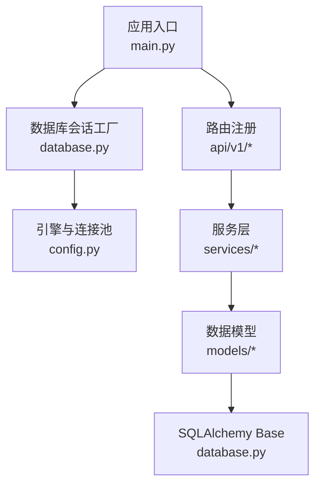

图表来源
- [backend/app/main.py:14-22](file://backend/app/main.py#L14-L22)
- [backend/app/database.py:10-21](file://backend/app/database.py#L10-L21)
- [backend/app/config.py:16-19](file://backend/app/config.py#L16-L19)

章节来源
- [backend/app/main.py:1-59](file://backend/app/main.py#L1-L59)
- [backend/app/database.py:1-40](file://backend/app/database.py#L1-L40)
- [backend/app/config.py:1-136](file://backend/app/config.py#L1-L136)

## 核心组件
- 异步引擎与会话工厂：基于asyncpg创建异步引擎，暴露AsyncSession工厂，提供FastAPI依赖注入的get_db会话获取器，自动提交/回滚与关闭。
- 配置中心：集中管理数据库URL、连接池大小、溢出上限、调试开关等。
- 模型基类：DeclarativeBase作为所有模型的基类，便于统一元数据管理与建表。
- 模型聚合：models/__init__.py统一导出各业务域模型，供上层引用。

章节来源
- [backend/app/database.py:10-40](file://backend/app/database.py#L10-L40)
- [backend/app/config.py:16-19](file://backend/app/config.py#L16-L19)
- [backend/app/models/__init__.py:1-37](file://backend/app/models/__init__.py#L1-L37)

## 架构总览
下图展示从请求到数据库的核心路径：FastAPI路由→服务层→依赖注入的AsyncSession→异步引擎→PostgreSQL。

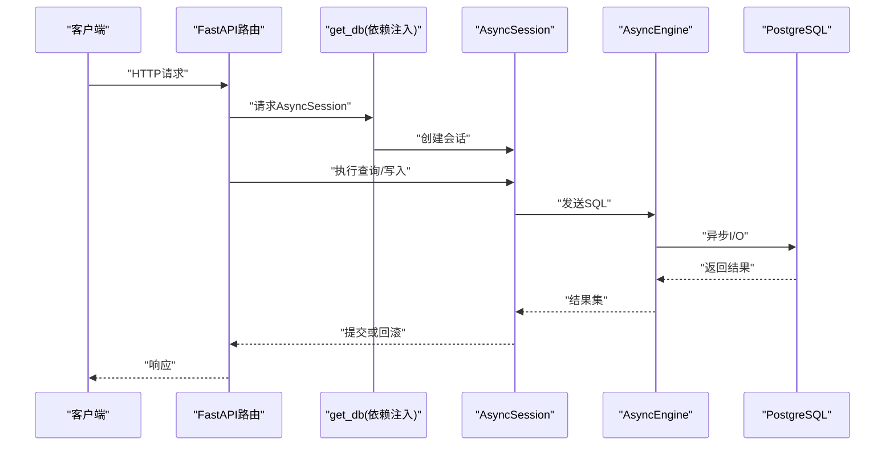

图表来源
- [backend/app/main.py:14-22](file://backend/app/main.py#L14-L22)
- [backend/app/database.py:29-40](file://backend/app/database.py#L29-L40)
- [backend/app/database.py:10-21](file://backend/app/database.py#L10-L21)

## 详细组件分析

### 用户与钱包流水
- 用户表：包含手机号、密码哈希、角色、推荐人、代理区域、所属门店、四大资产余额（余额、贡献值、积分、消费券）。
- 钱包流水表：记录余额/贡献值/积分/消费券的变动明细，含前后余额快照与关联订单/场次ID。
- 索引：手机号唯一索引；角色、推荐人、门店索引；钱包流水按用户+资产类型复合索引。

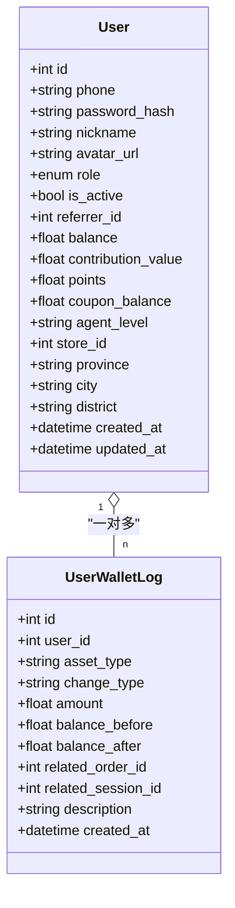

图表来源
- [backend/app/models/user.py:26-71](file://backend/app/models/user.py#L26-L71)
- [backend/app/models/user.py:74-93](file://backend/app/models/user.py#L74-L93)

章节来源
- [backend/app/models/user.py:1-93](file://backend/app/models/user.py#L1-L93)

### 拼团场次与订单
- 场次表：定义级别（初级/高级/SVIP）、价格与倍数、人数规则、状态机（等待/进行中/已满/已完成/已取消/已过期）、开团来源与结算时间。
- 订单表：绑定用户与场次，记录金额、状态、结果及权益/补贴明细，支持推荐人信息。
- 每日统计表：汇总各级别场次数、交易规模、收益与补贴支出。
- 索引：场次编号唯一；级别+状态复合索引；开始/结束时间索引；订单按用户+场次、状态索引。

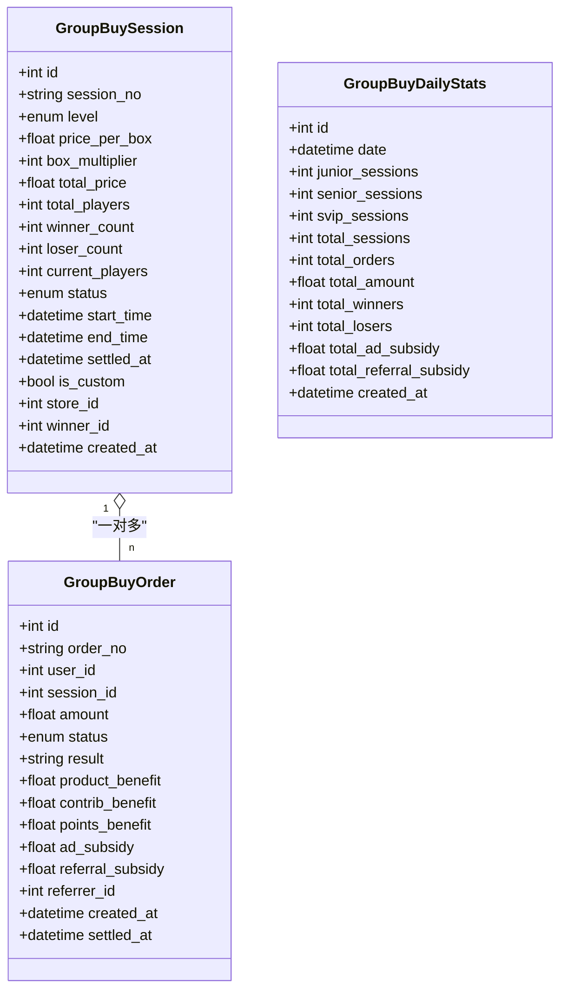

图表来源
- [backend/app/models/group_buy.py:42-86](file://backend/app/models/group_buy.py#L42-L86)
- [backend/app/models/group_buy.py:89-131](file://backend/app/models/group_buy.py#L89-L131)
- [backend/app/models/group_buy.py:134-158](file://backend/app/models/group_buy.py#L134-L158)

章节来源
- [backend/app/models/group_buy.py:1-158](file://backend/app/models/group_buy.py#L1-L158)

### 贡献值体系
- 贡献值记录：按来源场景（线上零售、拼团成功让利、线下门店消费）与归属角色（消费者、商家、推荐商家、推荐消费者、代理、平台）分别记录，并计算让利金额、分配比例与贡献值。
- 每周结算：统计有效贡献值、适用日利率、本周兑换消费券与分红数据，并记录剩余贡献值。
- 全网统计：用于分红计算的总贡献值、平台收益与池化金额。
- 索引：用户+来源、角色、周级唯一索引。

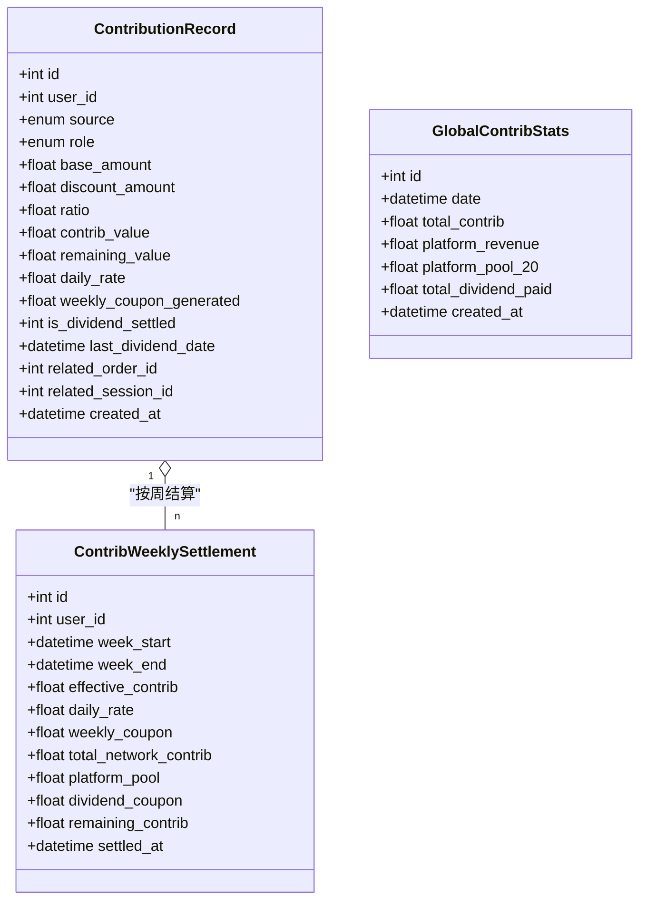

图表来源
- [backend/app/models/contribution.py:32-69](file://backend/app/models/contribution.py#L32-L69)
- [backend/app/models/contribution.py:72-100](file://backend/app/models/contribution.py#L72-L100)
- [backend/app/models/contribution.py:103-115](file://backend/app/models/contribution.py#L103-L115)

章节来源
- [backend/app/models/contribution.py:1-115](file://backend/app/models/contribution.py#L1-L115)

### 积分增值系统
- 积分总池：全局单例，维护总发行量、已发放、已通缩、已兑换与当前单价。
- 积分记录：每次消费新增利润值积分并触发通缩，记录当时单价与对应金额。
- 兑换记录：积分兑换消费券，按兑换时单价折算。
- 索引：用户+变动类型复合索引。

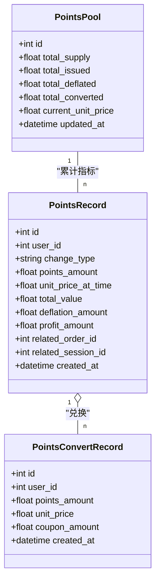

图表来源
- [backend/app/models/points.py:14-27](file://backend/app/models/points.py#L14-L27)
- [backend/app/models/points.py:29-59](file://backend/app/models/points.py#L29-L59)
- [backend/app/models/points.py:62-76](file://backend/app/models/points.py#L62-L76)

章节来源
- [backend/app/models/points.py:1-76](file://backend/app/models/points.py#L1-L76)

### 门店与团队
- 门店表：编号、名称、状态、区域、代理归属、推荐人、业绩统计、联系方式。
- 团队成员关系：四级团队层级与上下级关系，支持门店维度。
- 月度业绩：按月聚合新增业绩、会员、客户、订单数与排名等级。
- 索引：状态、区域复合索引；团队父级+层级；门店+年月唯一。

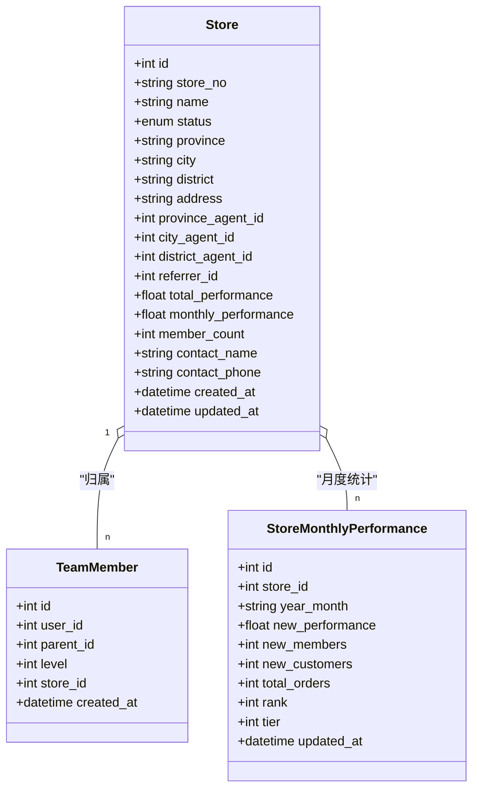

图表来源
- [backend/app/models/store.py:22-63](file://backend/app/models/store.py#L22-L63)
- [backend/app/models/store.py:66-80](file://backend/app/models/store.py#L66-L80)
- [backend/app/models/store.py:83-103](file://backend/app/models/store.py#L83-L103)

章节来源
- [backend/app/models/store.py:1-104](file://backend/app/models/store.py#L1-L104)

### 商品与订单
- 商品表：品类、状态、描述、图片、价格体系、库存销量、门店关联、排序与推荐。
- SKU表：规格名称、编码、价格、库存、属性JSON。
- 商城订单：订单号、用户、门店、金额、抵扣与实际支付、让利与贡献值生成、状态与时间戳。
- 订单明细：商品、SKU、数量、单价、小计。
- 索引：品类、状态、门店；订单号唯一；用户索引。

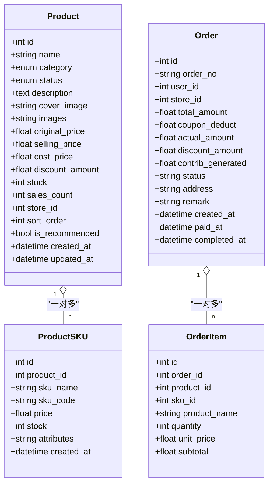

图表来源
- [backend/app/models/product.py:30-72](file://backend/app/models/product.py#L30-L72)
- [backend/app/models/product.py:75-89](file://backend/app/models/product.py#L75-L89)
- [backend/app/models/product.py:92-118](file://backend/app/models/product.py#L92-L118)
- [backend/app/models/product.py:120-135](file://backend/app/models/product.py#L120-L135)

章节来源
- [backend/app/models/product.py:1-135](file://backend/app/models/product.py#L1-L135)

### 分润结算
- 结算记录：按结算类型（拼团成功/失败、线上/线下订单、门店阶梯分红）记录接收方、比例与金额，支持关联订单/场次。
- 门店月度分红：按业绩区间确定阶梯与比例，记录分红金额与排名。
- 平台每日财务：汇总收入与各项支出，确保100%分配平衡校验。
- 索引：类型+状态、接收方；门店+年月唯一；日期索引。

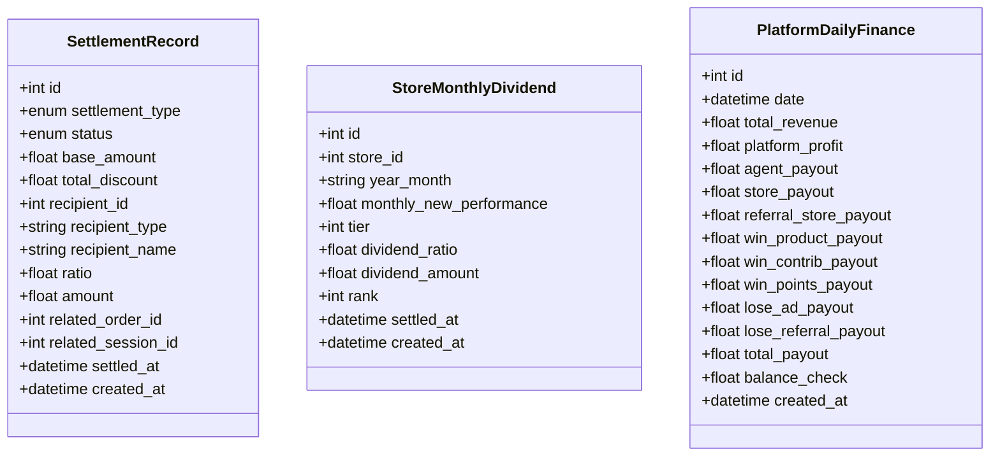

图表来源
- [backend/app/models/settlement.py:30-63](file://backend/app/models/settlement.py#L30-L63)
- [backend/app/models/settlement.py:66-93](file://backend/app/models/settlement.py#L66-L93)
- [backend/app/models/settlement.py:96-123](file://backend/app/models/settlement.py#L96-L123)

章节来源
- [backend/app/models/settlement.py:1-123](file://backend/app/models/settlement.py#L1-L123)

### 消费券
- 消费券记录：来源类型（拼失败广告/推荐补贴、贡献值兑换、分红发放）、金额、使用与剩余、是否用完、过期时间。
- 使用明细：记录每次使用的券ID、订单ID与金额。
- 索引：用户+来源类型。

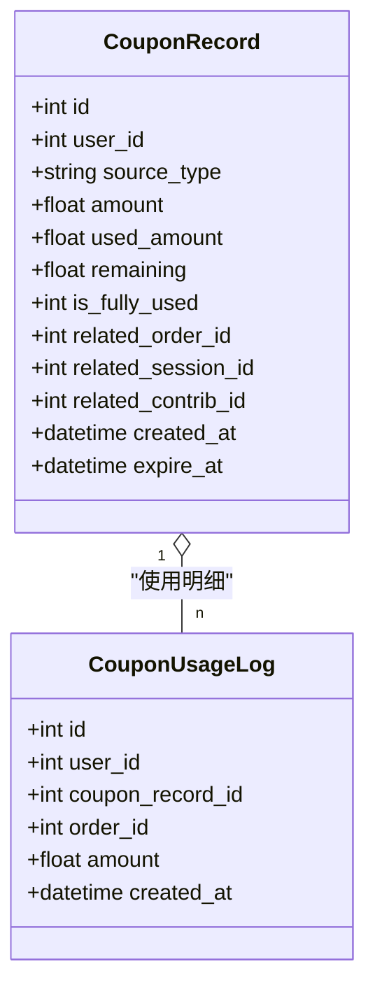

图表来源
- [backend/app/models/coupon.py:14-42](file://backend/app/models/coupon.py#L14-L42)
- [backend/app/models/coupon.py:45-55](file://backend/app/models/coupon.py#L45-L55)

章节来源
- [backend/app/models/coupon.py:1-55](file://backend/app/models/coupon.py#L1-L55)

### 风控日志与评分
- 风控日志：规则类型（限购、频率异常、金额异常、违规开团等）、风险等级、动作（放行/警告/拦截/冻结）、详情、IP/设备、处理状态与关联对象。
- 用户风险评分：评分、警告/拦截次数、黑名单标记、最近事件时间。
- 索引：用户+时间、风险等级。

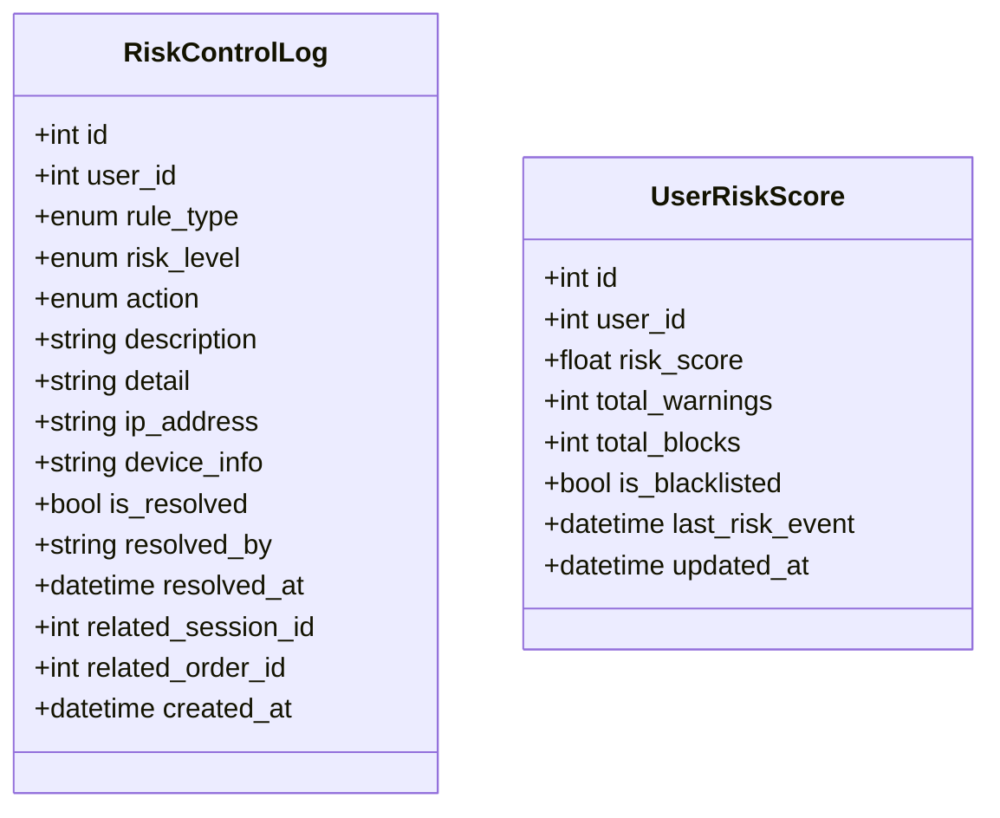

图表来源
- [backend/app/models/risk_control.py:40-70](file://backend/app/models/risk_control.py#L40-L70)
- [backend/app/models/risk_control.py:73-85](file://backend/app/models/risk_control.py#L73-L85)

章节来源
- [backend/app/models/risk_control.py:1-85](file://backend/app/models/risk_control.py#L1-L85)

## 依赖关系分析
- 运行时依赖：FastAPI、uvicorn、SQLAlchemy(asyncio)、asyncpg、Alembic、Pydantic v2、Redis/Celery、MinIO、LangChain/OpenAI等。
- 模型聚合：models/__init__.py集中导出，避免循环导入，提升可维护性。
- 应用生命周期：启动时创建表（开发），关闭时释放引擎资源。

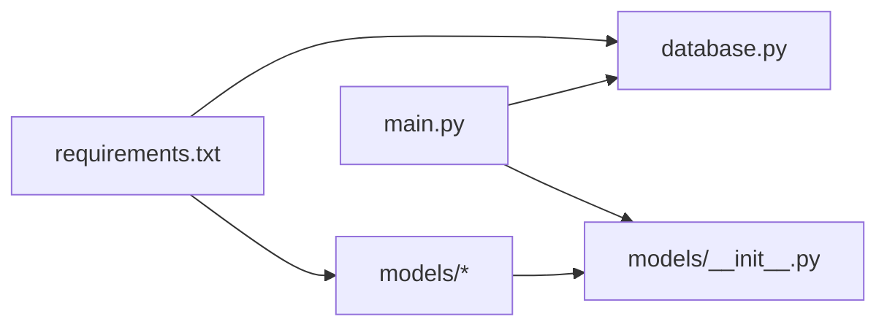

图表来源
- [backend/requirements.txt:1-34](file://backend/requirements.txt#L1-L34)
- [backend/app/models/__init__.py:1-37](file://backend/app/models/__init__.py#L1-L37)
- [backend/app/main.py:14-22](file://backend/app/main.py#L14-L22)

章节来源
- [backend/requirements.txt:1-34](file://backend/requirements.txt#L1-L34)
- [backend/app/models/__init__.py:1-37](file://backend/app/models/__init__.py#L1-L37)
- [backend/app/main.py:1-59](file://backend/app/main.py#L1-L59)

## 性能考虑
- 连接池与并发
  - 合理设置pool_size与max_overflow以匹配并发峰值，避免频繁创建/销毁连接。
  - 开启echo仅用于开发，生产关闭以减少日志开销。
- 索引优化
  - 高频查询字段建立单列或复合索引（如用户角色、推荐人、门店、拼团级别+状态、时间范围、订单状态等）。
  - 对大表（订单、贡献值、风控日志）建议分区或归档历史数据。
- 读写分离与缓存
  - 读多写少场景引入Redis缓存热点数据（如商品详情、场次列表、排行榜）。
  - 使用幂等键与短TTL降低缓存穿透与雪崩风险。
- 批量操作
  - 批量插入/更新减少往返，结合事务边界控制一致性。
- 慢查询治理
  - 定期分析慢查询，补充缺失索引，避免SELECT *，只取必要字段。
- 任务队列
  - 将耗时任务（结算、统计、风控评估）下沉至Celery，避免阻塞请求线程。

[本节为通用指导，不直接分析具体文件]

## 故障排查指南
- 会话与事务
  - 检查get_db是否正确yield并在异常时回滚，确认finally中关闭会话。
  - 长事务可能导致锁竞争，尽量缩短事务范围。
- 连接池耗尽
  - 监控pool_size与max_overflow，观察连接泄漏（未关闭会话）与超时错误。
- Alembic迁移
  - 若出现“表不存在”或“列冲突”，先核对alembic版本与目标库schema一致。
- 幂等与重复提交
  - 订单/场次参与需保证幂等，防止重复扣款与重复入账。
- 风控误判
  - 核查风控规则阈值与日志详情，必要时调整白名单或放宽限制。

章节来源
- [backend/app/database.py:29-40](file://backend/app/database.py#L29-L40)
- [backend/app/main.py:14-22](file://backend/app/main.py#L14-L22)

## 结论
本项目采用异步SQLAlchemy ORM与asyncpg驱动，配合FastAPI依赖注入实现高并发数据访问。数据模型围绕用户、拼团、贡献值、积分、门店、商品、结算、消费券与风控展开，具备清晰的ER关系与完善的索引策略。建议在生产环境启用Alembic迁移、完善备份恢复流程，并结合Redis与Celery构建高性能、可扩展的数据访问与任务处理体系。

[本节为总结性内容，不直接分析具体文件]

## 附录

### ER关系图（核心实体）
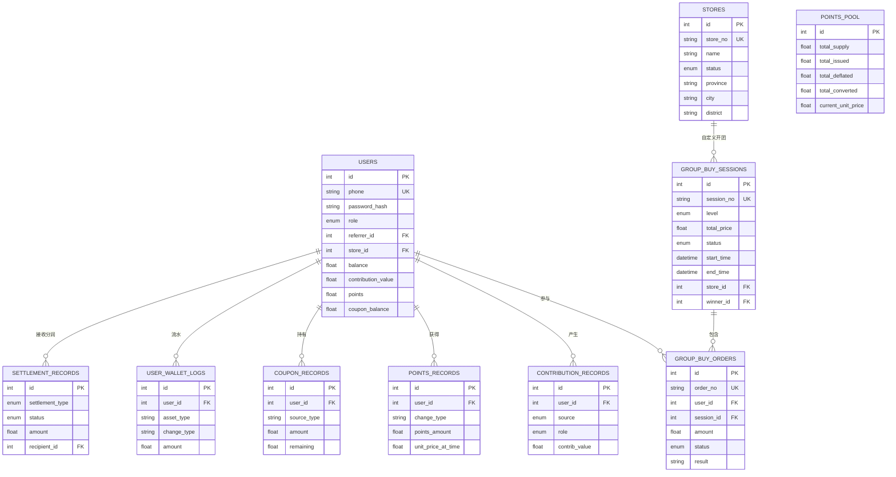

图表来源
- [backend/app/models/user.py:26-71](file://backend/app/models/user.py#L26-L71)
- [backend/app/models/group_buy.py:42-86](file://backend/app/models/group_buy.py#L42-L86)
- [backend/app/models/group_buy.py:89-131](file://backend/app/models/group_buy.py#L89-L131)
- [backend/app/models/contribution.py:32-69](file://backend/app/models/contribution.py#L32-L69)
- [backend/app/models/points.py:14-27](file://backend/app/models/points.py#L14-L27)
- [backend/app/models/points.py:29-59](file://backend/app/models/points.py#L29-L59)
- [backend/app/models/coupon.py:14-42](file://backend/app/models/coupon.py#L14-L42)
- [backend/app/models/settlement.py:30-63](file://backend/app/models/settlement.py#L30-L63)
- [backend/app/models/user.py:74-93](file://backend/app/models/user.py#L74-L93)

### 数据迁移与版本控制（Alembic）
- 现状：requirements包含alembic；应用启动时通过Base.metadata.create_all建表（开发阶段）。
- 建议：
  - 初始化Alembic环境，生成初始迁移脚本，锁定schema版本。
  - 在CI/CD中执行alembic upgrade head，禁止在生产环境使用create_all。
  - 针对大表变更使用分批DDL与在线迁移工具，避免长时间锁表。

章节来源
- [backend/requirements.txt:6](file://backend/requirements.txt#L6)
- [backend/app/main.py:17-22](file://backend/app/main.py#L17-L22)

### 备份与恢复策略
- 全量备份：每日定时逻辑/物理备份（如pg_dump或云厂商快照）。
- 增量备份：基于WAL的连续归档，支持时间点恢复（PITR）。
- 演练与验证：定期在隔离环境恢复演练，验证RTO/RPO达标。
- 敏感数据脱敏：测试环境使用脱敏数据，避免泄露。

[本节为通用指导，不直接分析具体文件]

### 安全与合规
- 密码存储：使用bcrypt等强哈希算法，禁止明文存储。
- 传输加密：全站HTTPS，数据库连接启用TLS。
- 最小权限：数据库账号遵循最小权限原则，读写分离时区分账号。
- 审计与留痕：关键账务与风控操作落库留痕，不可篡改。
- 隐私合规：手机号等敏感字段脱敏展示，遵循个人信息保护法与数据安全法要求。

[本节为通用指导，不直接分析具体文件]