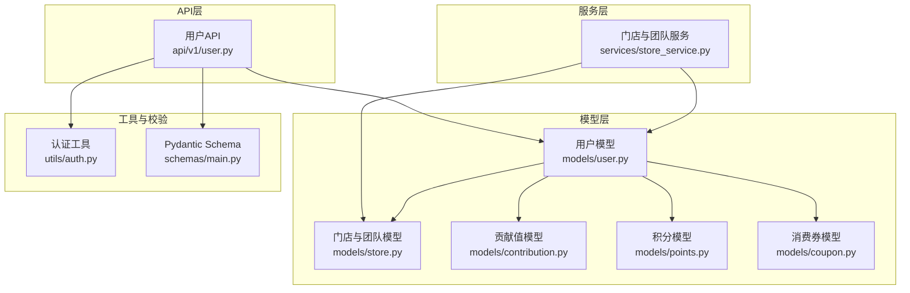
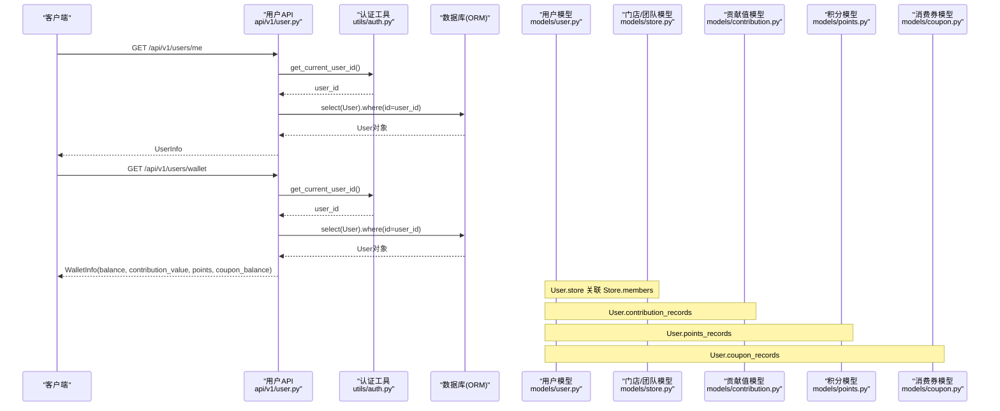
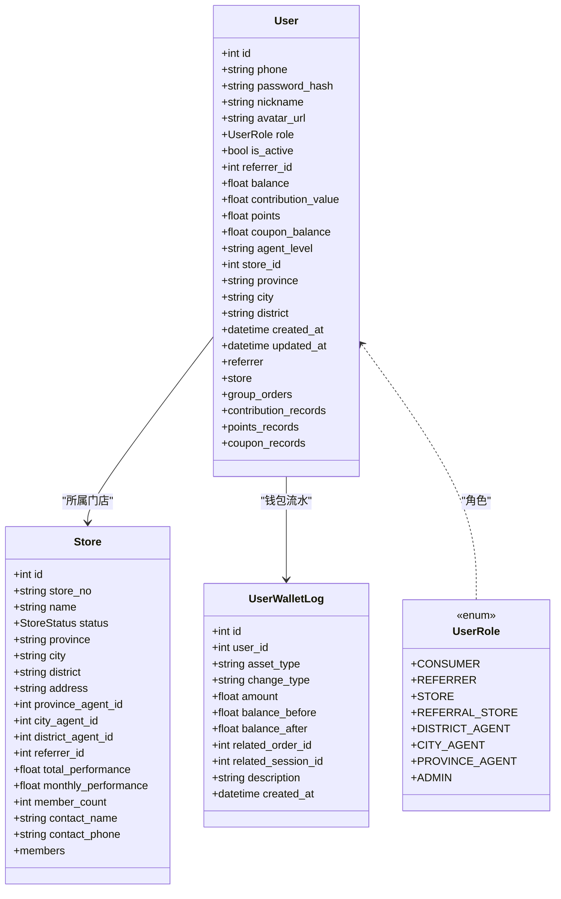
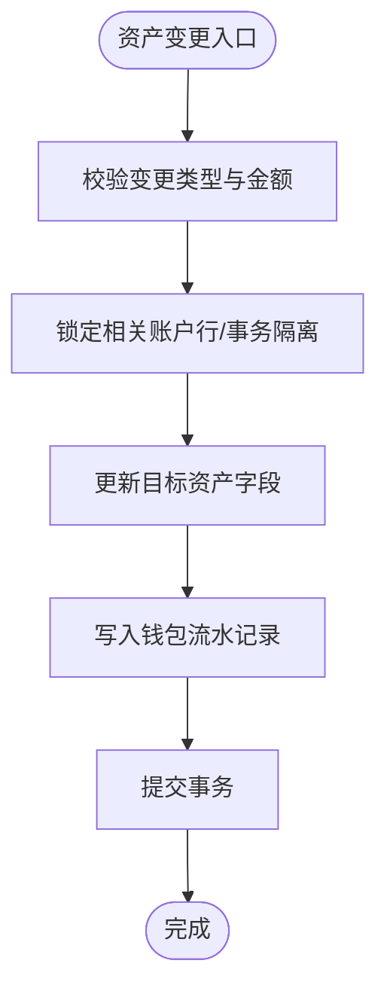
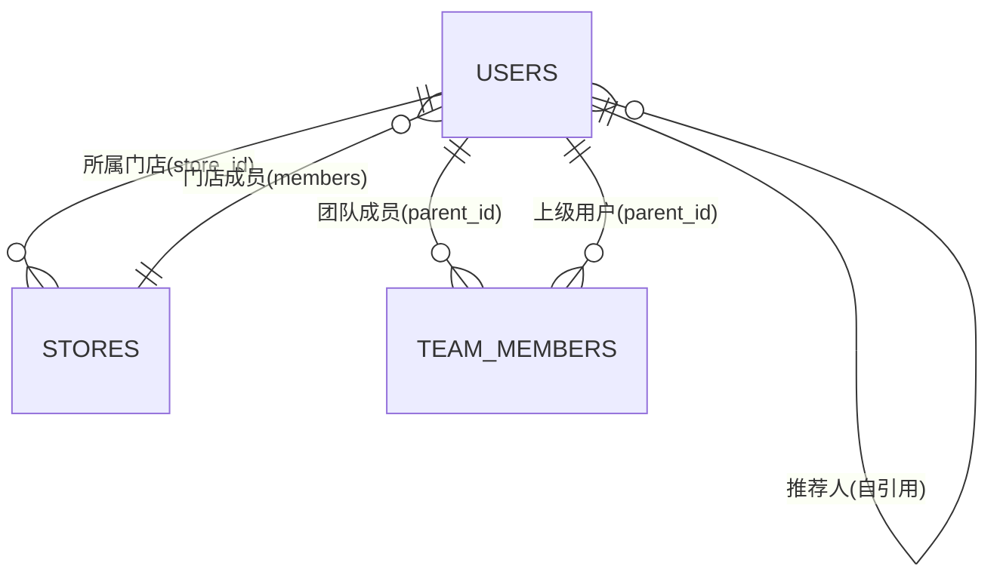
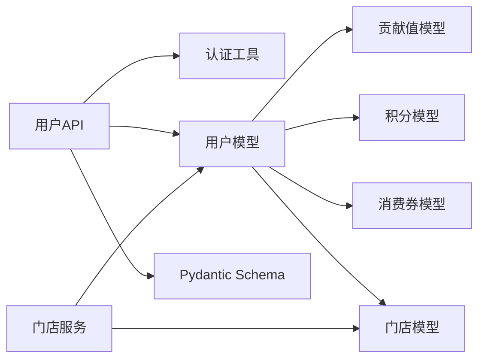

# 用户数据模型

<cite>
**本文引用的文件列表**
- [backend/app/models/user.py](file://backend/app/models/user.py)
- [backend/app/models/store.py](file://backend/app/models/store.py)
- [backend/app/api/v1/user.py](file://backend/app/api/v1/user.py)
- [backend/app/schemas/main.py](file://backend/app/schemas/main.py)
- [backend/app/utils/auth.py](file://backend/app/utils/auth.py)
- [backend/app/services/store_service.py](file://backend/app/services/store_service.py)
- [backend/app/models/contribution.py](file://backend/app/models/contribution.py)
- [backend/app/models/points.py](file://backend/app/models/points.py)
- [backend/app/models/coupon.py](file://backend/app/models/coupon.py)
</cite>

## 目录
1. [简介](#简介)
2. [项目结构](#项目结构)
3. [核心组件](#核心组件)
4. [架构总览](#架构总览)
5. [详细组件分析](#详细组件分析)
6. [依赖关系分析](#依赖关系分析)
7. [性能与索引优化](#性能与索引优化)
8. [隐私与安全保护](#隐私与安全保护)
9. [迁移与版本管理方案](#迁移与版本管理方案)
10. [故障排查指南](#故障排查指南)
11. [结论](#结论)

## 简介
本文件聚焦于AIxingmu项目的“用户数据模型”，围绕User模型的字段设计、角色权限体系、钱包资产（余额、贡献值、积分、消费券）、邀请关系链、代理层级与门店关联进行系统化说明。同时给出状态管理、安全机制、数据验证规则、索引与查询优化策略、隐私保护措施，以及数据迁移与版本管理的落地建议。

## 项目结构
与用户数据模型直接相关的后端代码主要位于以下模块：
- 数据模型定义：models/user.py、models/store.py、models/contribution.py、models/points.py、models/coupon.py
- API层：api/v1/user.py
- 请求/响应校验：schemas/main.py
- 认证工具：utils/auth.py
- 服务层（团队/门店）：services/store_service.py

图表来源
- [backend/app/api/v1/user.py:1-37](file://backend/app/api/v1/user.py#L1-L37)
- [backend/app/services/store_service.py:1-161](file://backend/app/services/store_service.py#L1-L161)
- [backend/app/models/user.py:1-93](file://backend/app/models/user.py#L1-L93)
- [backend/app/models/store.py:1-104](file://backend/app/models/store.py#L1-L104)
- [backend/app/models/contribution.py:1-115](file://backend/app/models/contribution.py#L1-L115)
- [backend/app/models/points.py:1-76](file://backend/app/models/points.py#L1-L76)
- [backend/app/models/coupon.py:1-55](file://backend/app/models/coupon.py#L1-L55)
- [backend/app/utils/auth.py:1-50](file://backend/app/utils/auth.py#L1-L50)
- [backend/app/schemas/main.py:1-176](file://backend/app/schemas/main.py#L1-L176)

章节来源
- [backend/app/api/v1/user.py:1-37](file://backend/app/api/v1/user.py#L1-L37)
- [backend/app/models/user.py:1-93](file://backend/app/models/user.py#L1-L93)
- [backend/app/models/store.py:1-104](file://backend/app/models/store.py#L1-L104)
- [backend/app/schemas/main.py:1-176](file://backend/app/schemas/main.py#L1-L176)
- [backend/app/utils/auth.py:1-50](file://backend/app/utils/auth.py#L1-L50)
- [backend/app/services/store_service.py:1-161](file://backend/app/services/store_service.py#L1-L161)

## 核心组件
- 用户模型 User：承载用户基本信息、角色、活跃状态、推荐人、四大资产、代理级别、所属门店、区域信息、时间戳及多表关系。
- 用户钱包流水 UserWalletLog：记录余额、贡献值、积分、消费券的变动明细，支持审计与对账。
- 门店 Store 与团队 TeamMember：支撑四级线下体系（省→市→区县→门店），并维护团队成员上下级关系。
- 贡献值 ContributionRecord：统一核算线上零售、拼团成功让利、线下门店消费三大场景的贡献值分配。
- 积分 PointsPool/PointsRecord：固定发行量、动态单价、通缩与利润值机制。
- 消费券 CouponRecord/CouponUsageLog：不可提现，仅用于抵扣，来源包括拼失败补贴、贡献值兑换、分红发放等。

章节来源
- [backend/app/models/user.py:1-93](file://backend/app/models/user.py#L1-L93)
- [backend/app/models/store.py:1-104](file://backend/app/models/store.py#L1-L104)
- [backend/app/models/contribution.py:1-115](file://backend/app/models/contribution.py#L1-L115)
- [backend/app/models/points.py:1-76](file://backend/app/models/points.py#L1-L76)
- [backend/app/models/coupon.py:1-55](file://backend/app/models/coupon.py#L1-L55)

## 架构总览
下图展示用户数据模型在系统中的位置与交互关系，涵盖用户注册登录、个人信息与钱包查询、门店与团队管理等关键路径。

图表来源
- [backend/app/api/v1/user.py:14-36](file://backend/app/api/v1/user.py#L14-L36)
- [backend/app/utils/auth.py:39-49](file://backend/app/utils/auth.py#L39-L49)
- [backend/app/models/user.py:26-71](file://backend/app/models/user.py#L26-L71)
- [backend/app/models/store.py:22-63](file://backend/app/models/store.py#L22-L63)
- [backend/app/models/contribution.py:32-69](file://backend/app/models/contribution.py#L32-L69)
- [backend/app/models/points.py:29-59](file://backend/app/models/points.py#L29-L59)
- [backend/app/models/coupon.py:14-42](file://backend/app/models/coupon.py#L14-L42)

## 详细组件分析

### 用户模型 User 字段设计与语义
- 身份与基础信息
  - id：主键自增
  - phone：手机号，唯一且非空，带索引
  - nickname：昵称
  - avatar_url：头像URL
- 安全与状态
  - password_hash：密码哈希存储
  - is_active：是否活跃
- 角色与权限
  - role：枚举类型，包含消费者、推荐消费者、门店、推荐门店、区县代理、市级代理、省级代理、平台管理员等
- 邀请关系链
  - referrer_id：指向users.id的外键，形成自引用树状邀请关系
- 钱包资产（四大资产）
  - balance：拼团本金余额
  - contribution_value：贡献值
  - points：增值积分
  - coupon_balance：消费券余额
- 代理与门店关联
  - agent_level：代理级别（province/city/district）
  - store_id：所属门店ID，外键关联stores.id
- 区域信息
  - province、city、district：代理或门店所在区域
- 时间戳
  - created_at、updated_at：创建与更新时间
- 关系映射
  - referrer：自引用上级用户
  - store：所属门店
  - group_orders、contribution_records、points_records、coupon_records：与订单、贡献值、积分、消费券的多对一关系

图表来源
- [backend/app/models/user.py:14-71](file://backend/app/models/user.py#L14-L71)
- [backend/app/models/store.py:22-63](file://backend/app/models/store.py#L22-L63)
- [backend/app/models/user.py:74-93](file://backend/app/models/user.py#L74-L93)

章节来源
- [backend/app/models/user.py:14-71](file://backend/app/models/user.py#L14-L71)
- [backend/app/models/user.py:74-93](file://backend/app/models/user.py#L74-L93)

### 角色权限系统（role）
- 角色枚举覆盖消费者、推荐消费者、门店、推荐门店、区县代理、市级代理、省级代理、平台管理员。
- 通过role字段控制业务分支与权限判断，例如贡献值分配比例、分红资格、门店归属等。
- 建议在API与服务层基于role进行访问控制与功能开关。

章节来源
- [backend/app/models/user.py:14-24](file://backend/app/models/user.py#L14-24)

### 钱包余额管理与资产模型
- 四大资产：balance、contribution_value、points、coupon_balance。
- 钱包流水表 UserWalletLog：记录每次资产变动的before/after、类型、金额、关联订单/场次、描述等，确保可追溯与对账。
- 贡献值、积分、消费券分别有独立模型与结算/使用记录，便于分账与统计。

图表来源
- [backend/app/models/user.py:74-93](file://backend/app/models/user.py#L74-L93)

章节来源
- [backend/app/models/user.py:41-45](file://backend/app/models/user.py#L41-L45)
- [backend/app/models/user.py:74-93](file://backend/app/models/user.py#L74-L93)

### 邀请关系链与代理层级结构
- 邀请关系：referrers_id自引用，形成树状邀请链；配合TeamMember表实现四级团队（直推/间推/间间推/间间间推）。
- 代理层级：agent_level标识省/市/区县代理；Store表通过province_agent_id、city_agent_id、district_agent_id绑定到对应代理。
- 门店成员：User.store_id与Store.members双向关系，体现门店会员归属。

图表来源
- [backend/app/models/user.py:38-61](file://backend/app/models/user.py#L38-L61)
- [backend/app/models/store.py:37-58](file://backend/app/models/store.py#L37-L58)
- [backend/app/models/store.py:66-80](file://backend/app/models/store.py#L66-L80)

章节来源
- [backend/app/models/user.py:38-61](file://backend/app/models/user.py#L38-L61)
- [backend/app/models/store.py:37-58](file://backend/app/models/store.py#L37-L58)
- [backend/app/models/store.py:66-80](file://backend/app/models/store.py#L66-L80)

### 用户状态管理
- is_active布尔字段表示账户是否活跃，可用于登录拦截、功能限制、风控策略。
- 建议结合审计日志与定时任务进行异常状态恢复与清理。

章节来源
- [backend/app/models/user.py:36](file://backend/app/models/user.py#L36)

### 账户安全机制
- 密码采用bcrypt哈希存储，提供hash_password与verify_password工具函数。
- JWT令牌生成与解析，HTTPBearer鉴权，get_current_user_id从Token中解析当前用户ID。
- 建议：定期轮换密钥、设置合理的过期时间、启用HTTPS、最小化敏感字段返回。

章节来源
- [backend/app/utils/auth.py:12-21](file://backend/app/utils/auth.py#L12-21)
- [backend/app/utils/auth.py:24-36](file://backend/app/utils/auth.py#L24-36)
- [backend/app/utils/auth.py:39-49](file://backend/app/utils/auth.py#L39-L49)

### 数据验证规则
- Pydantic Schema对用户输入进行校验，如RegisterRequest要求phone必填、password长度至少6位。
- 建议：在API层增加手机号格式校验、密码复杂度校验、防重入与幂等处理。

章节来源
- [backend/app/schemas/main.py:10-19](file://backend/app/schemas/main.py#L10-L19)

### 用户与门店的关联关系
- User.store_id外键关联Store.id，Store.members反向关系。
- Store按省市区划分，并通过三个代理ID字段绑定到对应代理用户。
- 服务层提供门店创建、月度业绩更新、团队查询、排名与分页列表等功能。

章节来源
- [backend/app/models/user.py:48-61](file://backend/app/models/user.py#L48-L61)
- [backend/app/models/store.py:22-63](file://backend/app/models/store.py#L22-L63)
- [backend/app/services/store_service.py:18-52](file://backend/app/services/store_service.py#L18-L52)
- [backend/app/services/store_service.py:54-99](file://backend/app/services/store_service.py#L54-L99)
- [backend/app/services/store_service.py:101-161](file://backend/app/services/store_service.py#L101-L161)

## 依赖关系分析
- API层依赖认证工具与Schema，读取用户模型并返回UserInfo/WalletInfo。
- 用户模型与贡献值、积分、消费券、门店模型存在一对多或多对一关系。
- 服务层通过SQLAlchemy执行复杂查询与聚合，支撑门店与团队管理。

图表来源
- [backend/app/api/v1/user.py:1-37](file://backend/app/api/v1/user.py#L1-L37)
- [backend/app/utils/auth.py:1-50](file://backend/app/utils/auth.py#L1-L50)
- [backend/app/models/user.py:1-93](file://backend/app/models/user.py#L1-L93)
- [backend/app/models/contribution.py:1-115](file://backend/app/models/contribution.py#L1-L115)
- [backend/app/models/points.py:1-76](file://backend/app/models/points.py#L1-L76)
- [backend/app/models/coupon.py:1-55](file://backend/app/models/coupon.py#L1-L55)
- [backend/app/models/store.py:1-104](file://backend/app/models/store.py#L1-L104)
- [backend/app/services/store_service.py:1-161](file://backend/app/services/store_service.py#L1-L161)

章节来源
- [backend/app/api/v1/user.py:1-37](file://backend/app/api/v1/user.py#L1-L37)
- [backend/app/services/store_service.py:1-161](file://backend/app/services/store_service.py#L1-L161)

## 性能与索引优化
- 现有索引
  - users.phone：唯一索引，加速登录与注册查重
  - users.role：角色过滤与权限判断
  - users.referrer_id：邀请链查询
  - users.store_id：门店成员筛选
  - user_wallet_logs.user_id、asset_type：钱包流水按用户与资产类型查询
  - stores.status、stores.province/city/district：门店状态与区域检索
  - team_members.parent_id、level：团队层级查询
  - store_monthly_performance.store_id/year_month：月度业绩统计
- 建议优化
  - 组合索引：根据高频查询条件建立复合索引，如(role, is_active)、(store_id, role)、(referrer_id, level)等
  - 分区与归档：user_wallet_logs按created_at按月分区，历史数据归档至冷存储
  - 读写分离：读多写少场景下，将排行榜、列表查询路由至只读副本
  - 缓存热点：用户信息与钱包余额可使用Redis缓存，注意一致性策略与失效时机
  - 批量操作：团队统计与业绩汇总采用批量插入/更新，减少事务开销

章节来源
- [backend/app/models/user.py:67-71](file://backend/app/models/user.py#L67-L71)
- [backend/app/models/user.py:90-92](file://backend/app/models/user.py#L90-L92)
- [backend/app/models/store.py:60-63](file://backend/app/models/store.py#L60-L63)
- [backend/app/models/store.py:78-80](file://backend/app/models/store.py#L78-L80)
- [backend/app/models/store.py:101-103](file://backend/app/models/store.py#L101-L103)

## 隐私与安全保护
- 密码安全：bcrypt哈希存储，避免明文密码泄露风险
- Token安全：JWT签名与过期控制，HTTPBearer传输，服务端校验子字段sub为用户ID
- 数据脱敏：对外接口返回时避免暴露敏感字段（如password_hash），仅返回必要信息
- 访问控制：基于role与is_active进行细粒度权限控制，防止越权访问
- 审计追踪：钱包流水与重要操作留痕，支持事后审计与合规检查

章节来源
- [backend/app/utils/auth.py:12-21](file://backend/app/utils/auth.py#L12-21)
- [backend/app/utils/auth.py:39-49](file://backend/app/utils/auth.py#L39-L49)
- [backend/app/models/user.py:32](file://backend/app/models/user.py#L32)
- [backend/app/models/user.py:36](file://backend/app/models/user.py#L36)
- [backend/app/models/user.py:74-93](file://backend/app/models/user.py#L74-L93)

## 迁移与版本管理方案
- 使用Alembic进行数据库迁移管理，为每个模型变更创建独立迁移脚本
- 迁移最佳实践
  - 新增字段：默认值与非空约束需考虑存量数据填充策略
  - 修改字段类型：先添加新列，再迁移数据，最后切换列名
  - 删除字段：先标记废弃，灰度下线后在后续版本删除
  - 索引变更：在低峰期执行，必要时加锁或分批重建
- 版本回滚
  - 保留向下兼容的迁移脚本，确保回滚不丢失数据
  - 对破坏性变更提供回退数据修复脚本
- 数据校验与一致性
  - 迁移前后运行数据校验任务，确保资产总额与流水一致
  - 引入幂等迁移脚本，避免重复执行导致的数据不一致

章节来源
- [backend/app/models/user.py:1-93](file://backend/app/models/user.py#L1-L93)
- [backend/app/models/store.py:1-104](file://backend/app/models/store.py#L1-L104)
- [backend/app/models/contribution.py:1-115](file://backend/app/models/contribution.py#L1-L115)
- [backend/app/models/points.py:1-76](file://backend/app/models/points.py#L1-L76)
- [backend/app/models/coupon.py:1-55](file://backend/app/models/coupon.py#L1-L55)

## 故障排查指南
- 常见问题定位
  - 登录失败：检查JWT解析与密码校验逻辑，确认token有效性与过期时间
  - 钱包余额不一致：核对钱包流水记录，比对before/after与amount的一致性
  - 邀请链异常：检查referrer_id与team_members层级关系，确认无环引用
  - 门店成员归属错误：校验store_id与Store.members关系，确认代理绑定正确
- 诊断步骤
  - 查看API日志与数据库慢查询，定位瓶颈
  - 使用钱包流水与贡献值/积分/消费券记录进行交叉验证
  - 针对团队与门店统计，检查月度业绩表的增量更新逻辑

章节来源
- [backend/app/utils/auth.py:39-49](file://backend/app/utils/auth.py#L39-L49)
- [backend/app/models/user.py:74-93](file://backend/app/models/user.py#L74-L93)
- [backend/app/models/contribution.py:32-69](file://backend/app/models/contribution.py#L32-L69)
- [backend/app/models/points.py:29-59](file://backend/app/models/points.py#L29-L59)
- [backend/app/models/coupon.py:14-42](file://backend/app/models/coupon.py#L14-L42)
- [backend/app/services/store_service.py:54-99](file://backend/app/services/store_service.py#L54-L99)

## 结论
用户数据模型以User为核心，围绕角色权限、钱包资产、邀请关系与代理层级构建完整业务闭环。通过完善的索引策略、安全机制与审计流水，保障系统在高性能与高可靠的前提下稳定运行。建议持续优化查询路径、完善数据校验与迁移流程，以提升整体数据质量与用户体验。