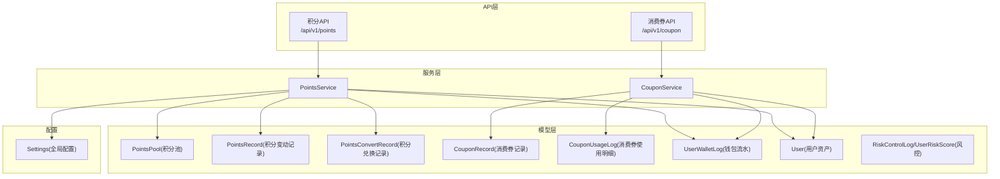
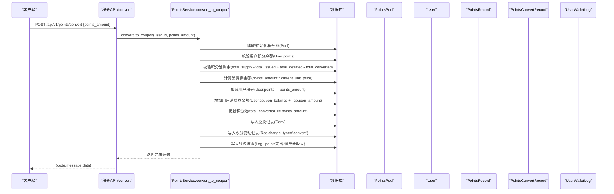
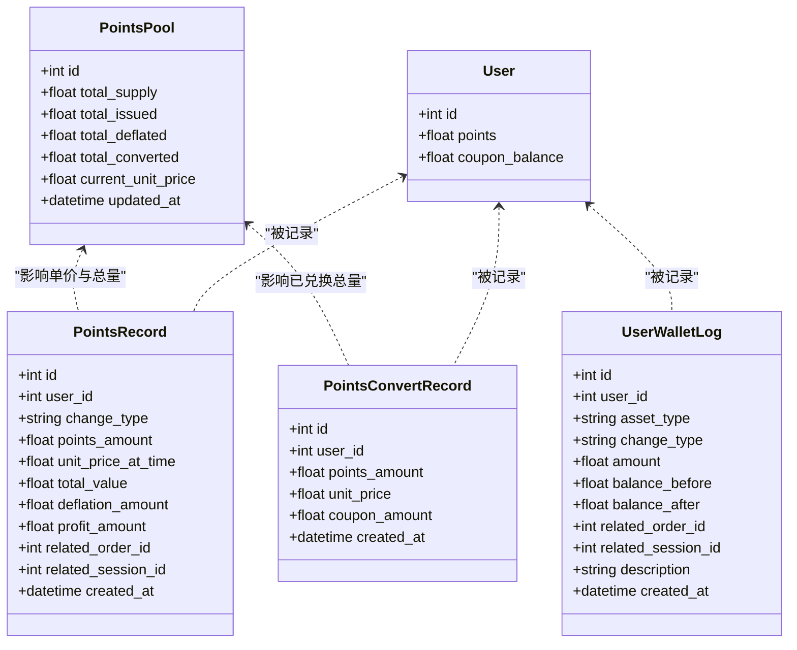
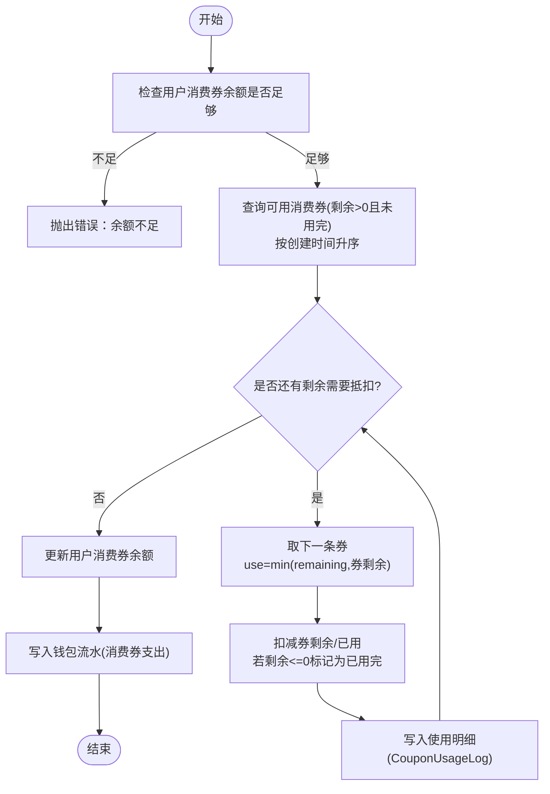
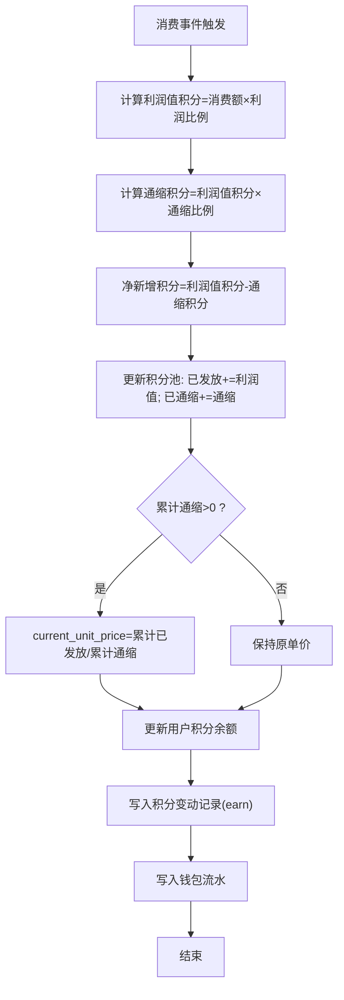
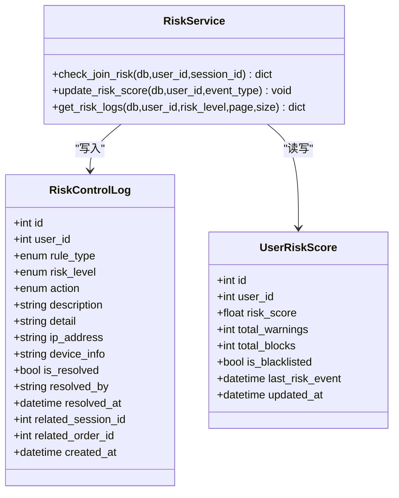
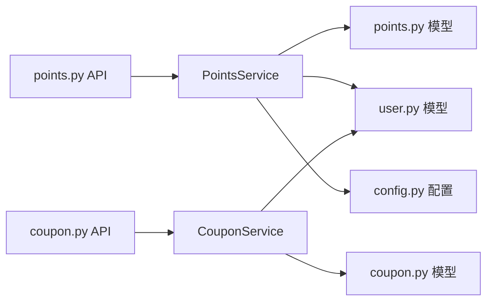

# 积分与优惠券数据模型

<cite>
**本文引用的文件列表**
- [backend/app/models/points.py](file://backend/app/models/points.py)
- [backend/app/models/coupon.py](file://backend/app/models/coupon.py)
- [backend/app/models/user.py](file://backend/app/models/user.py)
- [backend/app/models/risk_control.py](file://backend/app/models/risk_control.py)
- [backend/app/services/points_service.py](file://backend/app/services/points_service.py)
- [backend/app/services/coupon_service.py](file://backend/app/services/coupon_service.py)
- [backend/app/api/v1/points.py](file://backend/app/api/v1/points.py)
- [backend/app/api/v1/coupon.py](file://backend/app/api/v1/coupon.py)
- [backend/app/schemas/main.py](file://backend/app/schemas/main.py)
- [backend/app/config.py](file://backend/app/config.py)
</cite>

## 目录
1. [引言](#引言)
2. [项目结构](#项目结构)
3. [核心组件](#核心组件)
4. [架构总览](#架构总览)
5. [详细组件分析](#详细组件分析)
6. [依赖关系分析](#依赖关系分析)
7. [性能考虑](#性能考虑)
8. [故障排查指南](#故障排查指南)
9. [结论](#结论)
10. [附录](#附录)

## 引言
本文件聚焦AIxingmu项目的“积分与消费券”数据模型与业务流程，围绕以下目标展开：
- 深入解析积分池模型设计：总发行量、动态单价、通缩机制与兑换流程。
- 详细说明消费券模型：来源类型、使用规则、余额与明细记录。
- 解释积分流转的数据结构设计及“积分→消费券”的兑换业务流。
- 提供风控规则与防刷机制的数据支持方案。
- 给出性能优化、批量操作处理与财务对账的数据方案建议。

说明：当前代码未实现“消费积分池/冻结积分池”的分池表结构，也未在消费券模型中体现“使用条件/有效期”字段；本文在尊重现有实现的基础上，补充了扩展建议与落地路径。

## 项目结构
与积分和消费券相关的后端模块主要分布在 models、services、api、schemas 与 config 五个层次：
- models：定义积分池、积分变动记录、积分兑换记录、消费券记录、消费券使用明细、用户钱包流水、风控日志等持久化实体。
- services：封装积分发放、兑换、消费券使用等业务逻辑。
- api：暴露获取积分池状态、积分兑换、查询我的消费券等接口。
- schemas：定义请求/响应数据结构（如积分兑换请求、积分池信息、消费券信息等）。
- config：集中配置积分相关参数（总发行量、利润值比例、通缩比例等）。

图表来源
- [backend/app/api/v1/points.py:1-31](file://backend/app/api/v1/points.py#L1-L31)
- [backend/app/api/v1/coupon.py:1-20](file://backend/app/api/v1/coupon.py#L1-L20)
- [backend/app/services/points_service.py:1-180](file://backend/app/services/points_service.py#L1-L180)
- [backend/app/services/coupon_service.py:1-86](file://backend/app/services/coupon_service.py#L1-L86)
- [backend/app/models/points.py:1-76](file://backend/app/models/points.py#L1-L76)
- [backend/app/models/coupon.py:1-55](file://backend/app/models/coupon.py#L1-L55)
- [backend/app/models/user.py:1-93](file://backend/app/models/user.py#L1-L93)
- [backend/app/config.py:107-111](file://backend/app/config.py#L107-L111)

章节来源
- [backend/app/api/v1/points.py:1-31](file://backend/app/api/v1/points.py#L1-L31)
- [backend/app/api/v1/coupon.py:1-20](file://backend/app/api/v1/coupon.py#L1-L20)
- [backend/app/services/points_service.py:1-180](file://backend/app/services/points_service.py#L1-L180)
- [backend/app/services/coupon_service.py:1-86](file://backend/app/services/coupon_service.py#L1-L86)
- [backend/app/models/points.py:1-76](file://backend/app/models/points.py#L1-L76)
- [backend/app/models/coupon.py:1-55](file://backend/app/models/coupon.py#L1-L55)
- [backend/app/models/user.py:1-93](file://backend/app/models/user.py#L1-L93)
- [backend/app/config.py:107-111](file://backend/app/config.py#L107-L111)

## 核心组件
本节从数据模型与服务逻辑两个维度，梳理积分与消费券的核心能力。

- 积分池与动态单价
  - 全局单例积分池维护总发行量、已发放、已通缩、已兑换、当前单价等指标。
  - 每次消费按固定比例产生“利润值积分”，同时按比例进行“通缩”，并据此更新动态单价。
  - 动态单价计算基于累计已发放与累计通缩数量，体现价值递增趋势。

- 积分变动与兑换
  - 积分变动通过 PointsRecord 记录，包含变动类型、金额、当时单价、对应金额、通缩与利润值拆分等。
  - 积分兑换为消费券时，按当前单价折算，生成兑换记录与钱包流水，并同步更新用户资产。

- 消费券管理与使用
  - 消费券以 CouponRecord 记录来源类型、总额、已用、剩余、是否用完、过期时间等。
  - 使用遵循先进先出原则，逐条扣减可用券，生成使用明细 CouponUsageLog，并更新用户余额与钱包流水。

- 用户资产与钱包流水
  - 用户在 User 表中持有积分与消费券余额。
  - 所有资产变动均写入 UserWalletLog，形成可审计的流水账。

- 风控与防刷
  - 风控模型提供风险等级、动作、规则类型枚举，以及风控日志与用户风险评分表，用于限制异常行为与黑名单管理。

章节来源
- [backend/app/models/points.py:14-76](file://backend/app/models/points.py#L14-L76)
- [backend/app/models/coupon.py:14-55](file://backend/app/models/coupon.py#L14-L55)
- [backend/app/models/user.py:26-93](file://backend/app/models/user.py#L26-L93)
- [backend/app/models/risk_control.py:40-85](file://backend/app/models/risk_control.py#L40-L85)
- [backend/app/services/points_service.py:15-180](file://backend/app/services/points_service.py#L15-L180)
- [backend/app/services/coupon_service.py:13-86](file://backend/app/services/coupon_service.py#L13-L86)

## 架构总览
下图展示“积分→消费券”兑换的关键调用链与数据落盘点。

图表来源
- [backend/app/api/v1/points.py:19-31](file://backend/app/api/v1/points.py#L19-L31)
- [backend/app/services/points_service.py:94-166](file://backend/app/services/points_service.py#L94-L166)
- [backend/app/models/points.py:62-76](file://backend/app/models/points.py#L62-L76)
- [backend/app/models/user.py:74-93](file://backend/app/models/user.py#L74-L93)

## 详细组件分析

### 积分池与积分变动模型
- 积分池（PointsPool）
  - 字段要点：总发行量、已发放、已通缩、已兑换、当前单价、更新时间。
  - 约束与语义：全局单例，永不超发；动态单价随通缩与发放变化而调整。
- 积分变动记录（PointsRecord）
  - 字段要点：用户ID、变动类型（earn/deflate/convert）、积分变动数量、当时单价、对应金额、本次通缩与利润值拆分、关联订单/场次、创建时间。
  - 索引：按用户+变动类型建立复合索引，便于统计与对账。
- 积分兑换记录（PointsConvertRecord）
  - 字段要点：用户ID、兑换积分数量、兑换时单价、获得消费券金额、创建时间。

图表来源
- [backend/app/models/points.py:14-76](file://backend/app/models/points.py#L14-L76)
- [backend/app/models/user.py:26-93](file://backend/app/models/user.py#L26-L93)

章节来源
- [backend/app/models/points.py:14-76](file://backend/app/models/points.py#L14-L76)
- [backend/app/models/user.py:26-93](file://backend/app/models/user.py#L26-L93)

### 消费券模型与使用流程
- 消费券记录（CouponRecord）
  - 字段要点：用户ID、来源类型（拼失败补贴/贡献值兑换/分红等）、总额、已用、剩余、是否用完、关联订单/场次/贡献值记录、创建时间、过期时间。
  - 索引：按用户+来源类型建立复合索引，便于查询与统计。
- 消费券使用明细（CouponUsageLog）
  - 字段要点：用户ID、关联消费券记录ID、订单ID、使用金额、创建时间。
- 使用策略
  - 先进先出：按创建时间排序，优先使用较早获得的券。
  - 分条扣减：当单笔抵扣超过单张券剩余时，跨多张券继续扣减，直至满足需求或无可用券。

图表来源
- [backend/app/services/coupon_service.py:17-75](file://backend/app/services/coupon_service.py#L17-L75)
- [backend/app/models/coupon.py:14-55](file://backend/app/models/coupon.py#L14-L55)
- [backend/app/models/user.py:74-93](file://backend/app/models/user.py#L74-L93)

章节来源
- [backend/app/models/coupon.py:14-55](file://backend/app/models/coupon.py#L14-L55)
- [backend/app/services/coupon_service.py:17-75](file://backend/app/services/coupon_service.py#L17-L75)

### 积分发放与通缩机制
- 发放规则
  - 每次消费按固定比例产生“利润值积分”，同时按比例进行“通缩”。
  - 净新增积分 = 利润值积分 - 通缩积分。
- 动态单价
  - 动态单价 = 累计已发放 / 累计通缩数量（当累计通缩>0时）。
- 数据落盘
  - 更新积分池指标（已发放、已通缩、当前单价）。
  - 写入积分变动记录（含利润值与通缩拆分）。
  - 写入钱包流水（资产变动前后快照）。

图表来源
- [backend/app/services/points_service.py:30-92](file://backend/app/services/points_service.py#L30-L92)
- [backend/app/config.py:107-111](file://backend/app/config.py#L107-L111)

章节来源
- [backend/app/services/points_service.py:30-92](file://backend/app/services/points_service.py#L30-L92)
- [backend/app/config.py:107-111](file://backend/app/config.py#L107-L111)

### 风控与防刷机制的数据支持
- 风险等级与动作
  - 风险等级：低/中/高/严重。
  - 动作：放行/警告/拦截/冻结账号。
- 规则类型
  - 单日参与上限、单场参与上限、单ID单组最多N单、异常操作检测、违规开团检测、金额异常、频率异常。
- 用户风险评分
  - 维护用户风险评分、累计警告/拦截次数、是否黑名单、最近风控事件时间。
- 风控日志
  - 记录触发规则、风险等级、执行动作、描述、详情JSON、IP/设备信息、处理状态与处理人、关联会话/订单。

图表来源
- [backend/app/models/risk_control.py:40-85](file://backend/app/models/risk_control.py#L40-L85)
- [backend/app/services/risk_service.py:14-135](file://backend/app/services/risk_service.py#L14-L135)

章节来源
- [backend/app/models/risk_control.py:40-85](file://backend/app/models/risk_control.py#L40-L85)
- [backend/app/services/risk_service.py:14-135](file://backend/app/services/risk_service.py#L14-L135)

### 接口与Schema
- 积分接口
  - GET /api/v1/points/pool：获取积分池状态。
  - POST /api/v1/points/convert：提交积分兑换请求（PointsConvertRequest）。
- 消费券接口
  - GET /api/v1/coupon/my：获取当前用户的消费券列表。
- Schema
  - PointsConvertRequest：包含兑换积分数量。
  - PointsPoolInfo/CouponInfo：用于对外展示的积分池信息与消费券信息。

章节来源
- [backend/app/api/v1/points.py:13-31](file://backend/app/api/v1/points.py#L13-L31)
- [backend/app/api/v1/coupon.py:12-20](file://backend/app/api/v1/coupon.py#L12-L20)
- [backend/app/schemas/main.py:122-143](file://backend/app/schemas/main.py#L122-L143)

## 依赖关系分析
- 模型依赖
  - PointsRecord、PointsConvertRecord、CouponRecord、CouponUsageLog、UserWalletLog 均通过外键关联到 users 表。
  - CouponUsageLog 还关联 orders 表（当前模型存在外键声明，但订单模型不在本文件范围）。
- 服务依赖
  - PointsService 依赖 Settings 中的积分参数（总发行量、利润比例、通缩比例）。
  - CouponService 依赖用户与消费券模型进行余额校验与扣减。
- 外部集成
  - 认证中间件注入当前用户ID。
  - 异步数据库会话由 get_db 提供。

图表来源
- [backend/app/services/points_service.py:1-180](file://backend/app/services/points_service.py#L1-180)
- [backend/app/services/coupon_service.py:1-86](file://backend/app/services/coupon_service.py#L1-86)
- [backend/app/models/points.py:1-76](file://backend/app/models/points.py#L1-76)
- [backend/app/models/coupon.py:1-55](file://backend/app/models/coupon.py#L1-55)
- [backend/app/models/user.py:1-93](file://backend/app/models/user.py#L1-93)
- [backend/app/config.py:107-111](file://backend/app/config.py#L107-L111)
- [backend/app/api/v1/points.py:1-31](file://backend/app/api/v1/points.py#L1-31)
- [backend/app/api/v1/coupon.py:1-20](file://backend/app/api/v1/coupon.py#L1-20)

章节来源
- [同上]

## 性能考虑
- 并发与事务
  - 积分池为全局单例，在高并发兑换场景下需保证事务隔离与行级锁，避免竞态导致余额不一致。建议在关键路径使用数据库事务与悲观锁（SELECT ... FOR UPDATE）或在应用层加分布式锁。
- 索引与查询
  - 已有索引覆盖高频查询：用户+变动类型、用户+来源类型、用户+资产类型等。建议为消费券使用明细增加 (user_id, order_id) 复合索引，提升对账与查询效率。
- 批量操作
  - 消费券使用采用逐条扣减，适合小额高频；若出现大额合并抵扣，可在服务层聚合后再批量写库，减少往返。
- 缓存与一致性
  - 积分池状态可引入Redis缓存热点读，但写路径必须回源数据库以保证强一致。
- 异步任务
  - 对账、报表、过期券清理等耗时任务可通过消息队列异步执行，降低主链路延迟。

[本节为通用性能建议，不直接分析具体文件]

## 故障排查指南
- 常见问题定位
  - 兑换失败：检查用户积分余额、积分池剩余、当前单价是否正确；查看钱包流水与兑换记录是否成对写入。
  - 消费券使用失败：检查用户消费券余额、是否存在可用券（剩余>0且未用完），核对使用明细是否完整。
  - 风控拦截：查看风控日志与用户风险评分，确认是否触发黑名单或阈值。
- 关键日志与数据
  - UserWalletLog：资产变动的权威流水，可用于对账与回溯。
  - PointsRecord/PointsConvertRecord：积分变动与兑换的明细。
  - CouponUsageLog：消费券使用的明细。
  - RiskControlLog/UserRiskScore：风控事件与评分。

章节来源
- [backend/app/models/user.py:74-93](file://backend/app/models/user.py#L74-L93)
- [backend/app/models/points.py:29-76](file://backend/app/models/points.py#L29-L76)
- [backend/app/models/coupon.py:45-55](file://backend/app/models/coupon.py#L45-L55)
- [backend/app/models/risk_control.py:40-85](file://backend/app/models/risk_control.py#L40-L85)

## 结论
- 当前实现提供了完整的“积分→消费券”兑换闭环与消费券使用流程，具备完善的流水与明细记录，便于审计与对账。
- 动态单价与通缩机制使积分具备增值属性，有利于长期生态激励。
- 风控体系已具备基础能力，可扩展至积分与消费券的高频操作场景。
- 尚未实现“消费积分池/冻结积分池”的分池表结构，也未在消费券模型中显式表达“使用条件/有效期”；建议后续按需扩展以满足更复杂的业务治理需求。

[本节为总结性内容，不直接分析具体文件]

## 附录

### 扩展建议一：分池管理（消费积分池/冻结积分池）
- 目标
  - 将用户积分拆分为“可用积分”“冻结积分”“消费积分池”等子池，支持锁定、解冻、分期释放等复杂场景。
- 数据方案
  - 新增 PointsSubPool 表：记录用户维度的各子池余额（available/frozen/consumable）。
  - 变更 User.points 为只读汇总字段，实际余额来源于子池求和。
  - 在兑换/使用/退款等流程中，明确子池间的转移与冻结/解冻逻辑。
- 影响面
  - 服务层需重构余额校验与扣减逻辑，确保原子性与一致性。
  - 对账与报表需适配子池维度。

[本节为概念性扩展建议，不直接分析具体文件]

### 扩展建议二：消费券使用条件与有效期
- 现状
  - 模型中存在 expire_at 字段，但未在服务层强制校验；source_type 已区分来源类型。
- 建议
  - 在使用前校验 expire_at 与剩余金额，过期券不可用。
  - 根据 source_type 附加使用条件（如适用商品类目、最低消费门槛、门店限定等），可在扩展表中维护条件规则。
  - 定时任务清理过期券或将其置为不可用状态。

[本节为概念性扩展建议，不直接分析具体文件]

### 扩展建议三：批量操作与财务对账
- 批量操作
  - 针对大批量发放/兑换/使用，采用分批提交与幂等键（如批次号+序号）避免重复。
  - 使用数据库事务包裹整批操作，失败则整体回滚。
- 对账方案
  - 日终对账：汇总 UserWalletLog 与 PointsRecord/PointsConvertRecord/CouponUsageLog，核对各资产变动平衡。
  - 差异处理：生成差异报告，人工复核后补录或冲正。

[本节为概念性扩展建议，不直接分析具体文件]