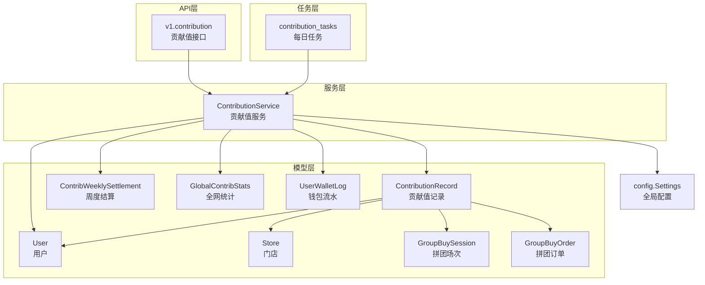
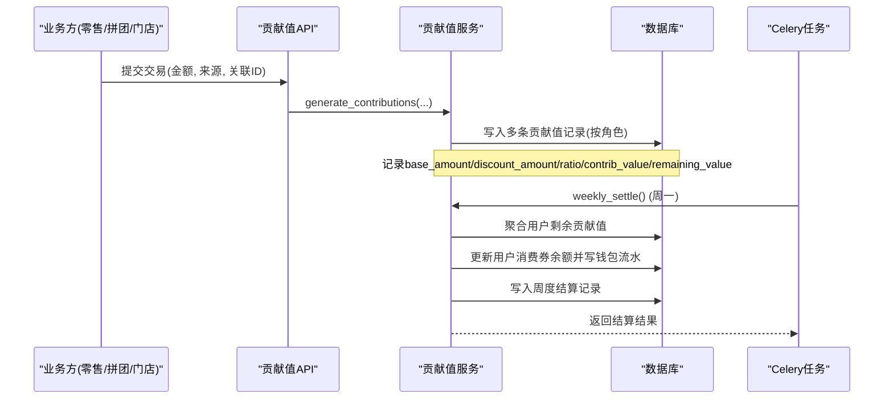
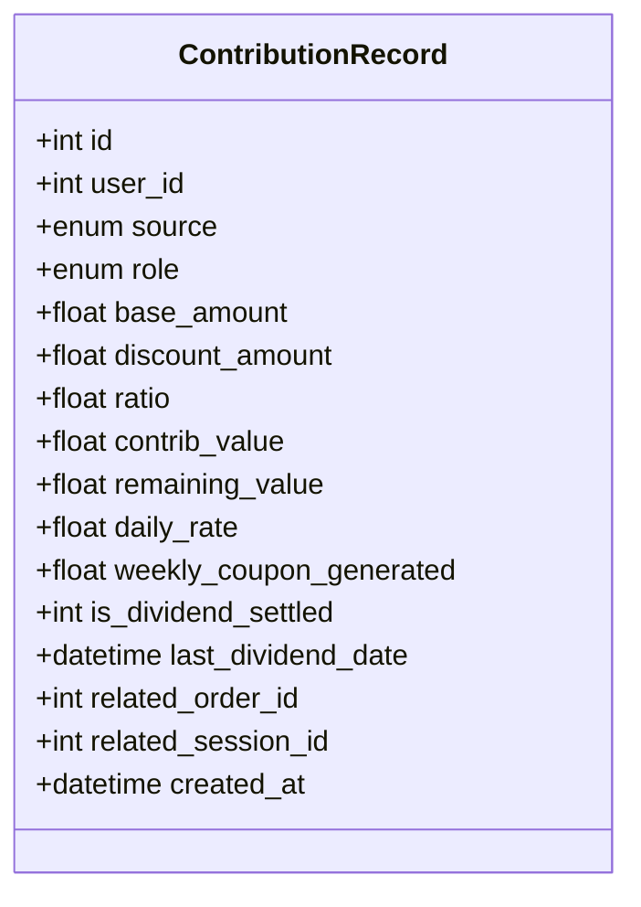
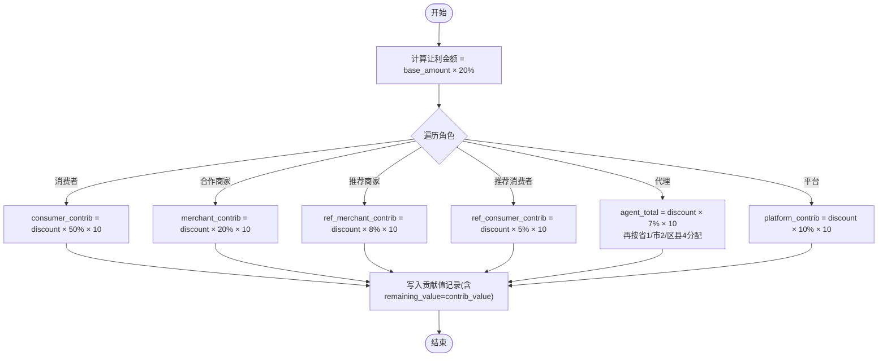
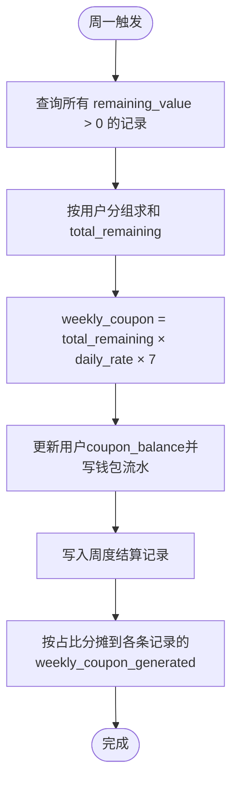
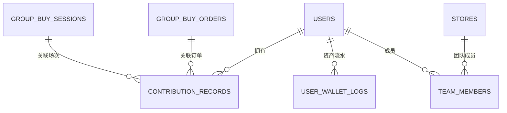
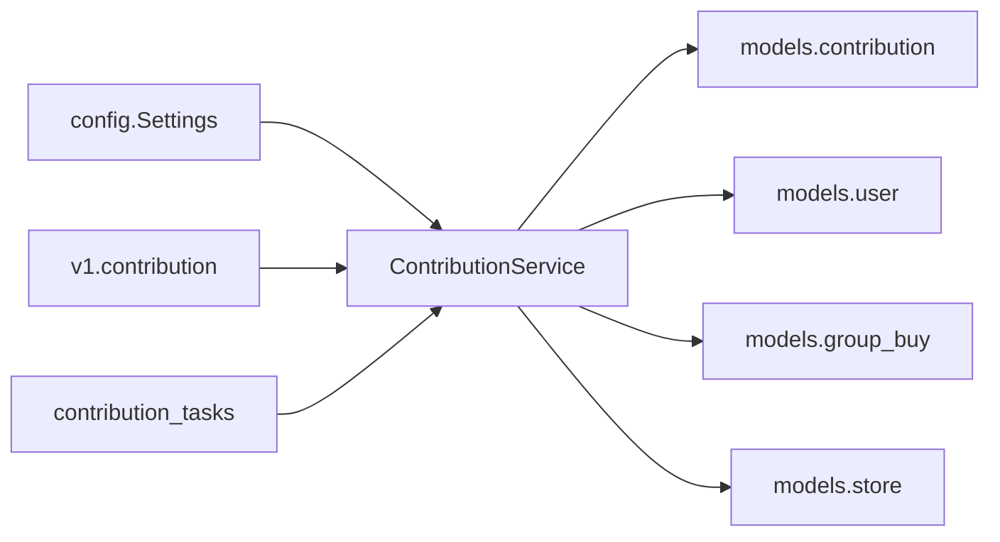

# 贡献值数据模型

<cite>
**本文引用的文件列表**
- [backend/app/models/contribution.py](file://backend/app/models/contribution.py)
- [backend/app/services/contribution_service.py](file://backend/app/services/contribution_service.py)
- [backend/app/tasks/contribution_tasks.py](file://backend/app/tasks/contribution_tasks.py)
- [backend/app/api/v1/contribution.py](file://backend/app/api/v1/contribution.py)
- [backend/app/models/user.py](file://backend/app/models/user.py)
- [backend/app/models/store.py](file://backend/app/models/store.py)
- [backend/app/models/group_buy.py](file://backend/app/models/group_buy.py)
- [backend/app/config.py](file://backend/app/config.py)
</cite>

## 目录
1. [引言](#引言)
2. [项目结构](#项目结构)
3. [核心组件](#核心组件)
4. [架构总览](#架构总览)
5. [详细组件分析](#详细组件分析)
6. [依赖关系分析](#依赖关系分析)
7. [性能与扩展性](#性能与扩展性)
8. [故障排查指南](#故障排查指南)
9. [结论](#结论)
10. [附录](#附录)

## 引言
本文件围绕 AIxingmu 项目的“贡献值经济系统”，对贡献值数据模型进行系统化、可落地的技术文档化。重点覆盖：
- 贡献值记录模型的业务字段：来源类型、金额计算、有效期管理、状态流转
- 贡献值生成规则与递减兑换机制的数据结构设计
- 贡献值与用户、订单、门店的多对多关系映射
- 贡献值流水账的审计追踪、分红计算的临时表设计
- 贡献值经济系统的性能优化、批量处理策略与数据归档方案

## 项目结构
贡献值相关代码主要分布在以下模块：
- 数据模型层：贡献值主表、周度结算表、全网统计表；用户钱包流水表；拼团场次/订单；门店与团队
- 服务层：贡献值核算、周度结算、统计查询
- 任务层：定时任务触发周度结算
- API 层：查询我的贡献值、全网总贡献值
- 配置层：贡献值分配比例、让利比例、日利率等全局参数

图表来源
- [backend/app/models/contribution.py:32-115](file://backend/app/models/contribution.py#L32-L115)
- [backend/app/services/contribution_service.py:16-261](file://backend/app/services/contribution_service.py#L16-L261)
- [backend/app/tasks/contribution_tasks.py:1-29](file://backend/app/tasks/contribution_tasks.py#L1-L29)
- [backend/app/api/v1/contribution.py:1-27](file://backend/app/api/v1/contribution.py#L1-L27)
- [backend/app/models/user.py:26-93](file://backend/app/models/user.py#L26-L93)
- [backend/app/models/store.py:22-104](file://backend/app/models/store.py#L22-L104)
- [backend/app/models/group_buy.py:42-158](file://backend/app/models/group_buy.py#L42-L158)
- [backend/app/config.py:60-106](file://backend/app/config.py#L60-L106)

章节来源
- [backend/app/models/contribution.py:1-115](file://backend/app/models/contribution.py#L1-L115)
- [backend/app/services/contribution_service.py:1-261](file://backend/app/services/contribution_service.py#L1-L261)
- [backend/app/tasks/contribution_tasks.py:1-29](file://backend/app/tasks/contribution_tasks.py#L1-L29)
- [backend/app/api/v1/contribution.py:1-27](file://backend/app/api/v1/contribution.py#L1-L27)
- [backend/app/models/user.py:1-93](file://backend/app/models/user.py#L1-L93)
- [backend/app/models/store.py:1-104](file://backend/app/models/store.py#L1-L104)
- [backend/app/models/group_buy.py:1-158](file://backend/app/models/group_buy.py#L1-L158)
- [backend/app/config.py:1-136](file://backend/app/config.py#L1-L136)

## 核心组件
- 贡献值记录模型 ContributionRecord：承载每笔交易按角色拆分后的贡献值明细，包含来源场景、归属角色、金额计算明细、剩余可兑换值、周度兑换累计、分红标记、关联订单/场次等。
- 周度结算模型 ContribWeeklySettlement：记录每周一次的用户维度贡献值结算结果（有效贡献值、适用日利率、本周消费券、平台池、分红券、结算后剩余贡献值）。
- 全网统计模型 GlobalContribStats：用于分红计算的全网汇总指标（总贡献值、平台收益、平台20%收益池、已发放分红总额）。
- 用户钱包流水 UserWalletLog：资产变动审计日志，记录消费券等资产的增减及前后余额。
- 配置 Settings：贡献值分配比例、让利比例、乘数、日利率等关键业务参数集中管理。

章节来源
- [backend/app/models/contribution.py:32-115](file://backend/app/models/contribution.py#L32-L115)
- [backend/app/models/user.py:74-93](file://backend/app/models/user.py#L74-L93)
- [backend/app/config.py:60-106](file://backend/app/config.py#L60-L106)

## 架构总览
贡献值体系由“交易事件 -> 贡献值生成 -> 周度递减兑换 -> 分红汇总”构成闭环。

图表来源
- [backend/app/api/v1/contribution.py:12-26](file://backend/app/api/v1/contribution.py#L12-L26)
- [backend/app/services/contribution_service.py:39-143](file://backend/app/services/contribution_service.py#L39-L143)
- [backend/app/services/contribution_service.py:163-240](file://backend/app/services/contribution_service.py#L163-L240)
- [backend/app/tasks/contribution_tasks.py:15-28](file://backend/app/tasks/contribution_tasks.py#L15-L28)

## 详细组件分析

### 贡献值记录模型 ContributionRecord
- 来源类型 source：线上零售消费、拼团成功让利、线下门店消费三类统一入口。
- 归属角色 role：消费者、合作商家/门店、推荐商家、推荐消费者、代理、平台六类角色分别记账。
- 金额计算字段：
  - base_amount：原始交易金额
  - discount_amount：让利金额 = base_amount × 全局让利比例
  - ratio：该角色的分配比例
  - contrib_value：贡献值 = discount_amount × ratio × 贡献值乘数
- 递减兑换字段：
  - remaining_value：剩余可兑换贡献值（初始等于contrib_value）
  - daily_rate：当期日利率（默认来自配置）
  - weekly_coupon_generated：本周已兑换消费券（按记录分摊）
- 分红相关字段：
  - is_dividend_settled：是否参与本期分红
  - last_dividend_date：上次分红日期
- 关联字段：
  - related_order_id：关联订单ID
  - related_session_id：关联拼团场次ID
- 索引：user_id+source、role，便于按用户与来源快速检索与按角色聚合。

图表来源
- [backend/app/models/contribution.py:32-70](file://backend/app/models/contribution.py#L32-L70)

章节来源
- [backend/app/models/contribution.py:32-70](file://backend/app/models/contribution.py#L32-L70)

### 贡献值生成规则与计算流程
- 公式：各方贡献值 = 让利金额 × 分配比例 × 10
- 让利金额 = 消费金额 × 20%
- 六大角色分配比例在配置中集中定义，生成时按角色分别计算并写入记录。
- 代理贡献值按比例进一步拆分为省/市/区县三级份额。

图表来源
- [backend/app/services/contribution_service.py:30-143](file://backend/app/services/contribution_service.py#L30-L143)
- [backend/app/config.py:60-70](file://backend/app/config.py#L60-L70)

章节来源
- [backend/app/services/contribution_service.py:30-143](file://backend/app/services/contribution_service.py#L30-L143)
- [backend/app/config.py:60-70](file://backend/app/config.py#L60-L70)

### 递减兑换机制与周度结算
- 结算周期：每周一执行一次。
- 计算公式：当周消费券 = 有效贡献值 × 日利率 × 7
- 有效贡献值：用户所有 remaining_value > 0 的贡献值记录之和
- 消费券发放：累加到用户 coupon_balance，并写入钱包流水
- 周度结算记录：记录 effective_contrib、daily_rate、weekly_coupon、remaining_contrib（不扣减，继续参与下期）
- 记录级分摊：每条记录的 weekly_coupon_generated 按其在用户总剩余中的占比分摊

图表来源
- [backend/app/services/contribution_service.py:163-240](file://backend/app/services/contribution_service.py#L163-L240)
- [backend/app/models/user.py:74-93](file://backend/app/models/user.py#L74-L93)
- [backend/app/models/contribution.py:72-101](file://backend/app/models/contribution.py#L72-L101)

章节来源
- [backend/app/services/contribution_service.py:163-240](file://backend/app/services/contribution_service.py#L163-L240)
- [backend/app/models/contribution.py:72-101](file://backend/app/models/contribution.py#L72-L101)
- [backend/app/models/user.py:74-93](file://backend/app/models/user.py#L74-L93)

### 贡献值与用户、订单、门店的关系映射
- 用户维度：
  - 一对一：用户表 users 与贡献值记录通过 user_id 外键关联
  - 一对多：用户钱包流水 user_wallet_logs 记录消费券等资产变动
- 订单维度：
  - 贡献值记录通过 related_order_id 关联订单（通用订单或拼团订单）
  - 拼团场景下，还可通过 related_session_id 关联场次
- 门店维度：
  - 门店作为贡献值接收方之一（role=merchant），同时门店信息用于代理层级与区域归因
  - 团队关系 team_members 支持四级团队分润（与贡献值角色协同）

图表来源
- [backend/app/models/contribution.py:32-70](file://backend/app/models/contribution.py#L32-L70)
- [backend/app/models/user.py:26-93](file://backend/app/models/user.py#L26-L93)
- [backend/app/models/group_buy.py:42-158](file://backend/app/models/group_buy.py#L42-L158)
- [backend/app/models/store.py:66-82](file://backend/app/models/store.py#L66-L82)

章节来源
- [backend/app/models/contribution.py:32-70](file://backend/app/models/contribution.py#L32-L70)
- [backend/app/models/user.py:26-93](file://backend/app/models/user.py#L26-L93)
- [backend/app/models/group_buy.py:42-158](file://backend/app/models/group_buy.py#L42-L158)
- [backend/app/models/store.py:66-82](file://backend/app/models/store.py#L66-L82)

### 分红计算与临时表设计
- 全网统计 GlobalContribStats：维护 date、total_contrib、platform_revenue、platform_pool_20、total_dividend_paid 等指标，为分红计算提供基础数据。
- 周度结算 ContribWeeklySettlement：除消费券外，预留 total_network_contrib、platform_pool、dividend_coupon 字段，可用于后续分红计算与分摊。
- 建议的临时表设计（概念性说明）：
  - 分红快照表：以周为单位，记录全网总贡献值、平台收益池、个人分红券额度、结算批次号等，便于审计与回滚
  - 分红明细表：记录每个用户在该期的分红基数、权重、分红券发放量、结算时间戳
  - 注意：当前仓库未实现具体分红任务，上述为基于现有字段的扩展建议

章节来源
- [backend/app/models/contribution.py:103-115](file://backend/app/models/contribution.py#L103-L115)
- [backend/app/models/contribution.py:72-101](file://backend/app/models/contribution.py#L72-L101)

### 贡献值流水账与审计追踪
- 钱包流水 UserWalletLog：记录 asset_type、change_type、amount、balance_before、balance_after、description 等，确保每次资产变动可追溯
- 贡献值记录本身具备来源、角色、金额明细、创建时间等，形成贡献值层面的“准流水”
- 周度结算记录 ContribWeeklySettlement：沉淀每期结算结果，便于对账与审计

章节来源
- [backend/app/models/user.py:74-93](file://backend/app/models/user.py#L74-L93)
- [backend/app/models/contribution.py:32-115](file://backend/app/models/contribution.py#L32-L115)

### 状态流转与有效期管理
- 贡献值记录无显式状态字段，但通过 remaining_value 控制可兑换额度；当 remaining_value 降为 0 时视为失效
- 周度结算不扣减 remaining_value，仅累计发放消费券，因此贡献值具有“长期有效、持续参与”的特性
- 若未来引入有效期策略，可在记录上增加 expire_at 字段并在结算前过滤过期记录

章节来源
- [backend/app/models/contribution.py:32-70](file://backend/app/models/contribution.py#L32-L70)
- [backend/app/services/contribution_service.py:163-240](file://backend/app/services/contribution_service.py#L163-L240)

## 依赖关系分析
- 配置依赖：贡献值分配比例、让利比例、乘数、日利率等全部来自 Settings
- 服务依赖：ContributionService 依赖 models 与 settings，负责计算与持久化
- 任务依赖：celery 任务在周一调用服务执行周度结算
- API 依赖：对外暴露查询接口，内部调用服务获取数据

图表来源
- [backend/app/config.py:60-106](file://backend/app/config.py#L60-L106)
- [backend/app/services/contribution_service.py:16-261](file://backend/app/services/contribution_service.py#L16-L261)
- [backend/app/api/v1/contribution.py:1-27](file://backend/app/api/v1/contribution.py#L1-L27)
- [backend/app/tasks/contribution_tasks.py:1-29](file://backend/app/tasks/contribution_tasks.py#L1-L29)
- [backend/app/models/contribution.py:32-115](file://backend/app/models/contribution.py#L32-L115)
- [backend/app/models/user.py:26-93](file://backend/app/models/user.py#L26-L93)
- [backend/app/models/group_buy.py:42-158](file://backend/app/models/group_buy.py#L42-L158)
- [backend/app/models/store.py:22-104](file://backend/app/models/store.py#L22-L104)

章节来源
- [backend/app/config.py:60-106](file://backend/app/config.py#L60-L106)
- [backend/app/services/contribution_service.py:16-261](file://backend/app/services/contribution_service.py#L16-L261)
- [backend/app/api/v1/contribution.py:1-27](file://backend/app/api/v1/contribution.py#L1-L27)
- [backend/app/tasks/contribution_tasks.py:1-29](file://backend/app/tasks/contribution_tasks.py#L1-L29)

## 性能与扩展性
- 批量写入：generate_contributions 使用 db.add 批量添加后 flush，减少往返开销
- 索引优化：
  - contribution_records(user_id, source)、contribution_records(role) 提升按用户与来源查询、按角色聚合效率
  - contrib_weekly_settlements(user_id, week_start) 唯一索引避免重复结算
  - global_contrib_stats(date) 加速按日统计
- 异步会话：服务层使用 AsyncSession，配合 Celery 异步任务，降低阻塞
- 批处理策略：
  - 周度结算按用户聚合后再更新，避免逐条更新带来的锁竞争
  - 可按用户分片并行结算（需保证幂等与去重）
- 数据归档方案（建议）：
  - 将历史周度结算与旧贡献值记录迁移至归档库或分区表，保留最近 N 周热数据
  - 对 global_contrib_stats 按月/年归档，保持在线表轻量
- 监控与告警：
  - 记录结算耗时、失败重试次数、异常堆栈
  - 对 remaining_value 异常（负数、超发）设置阈值告警

[本节为通用性能建议，无需特定源码引用]

## 故障排查指南
- 贡献值未生成：
  - 检查交易事件是否调用 generate_contributions
  - 核对配置中的让利比例与分配比例是否正确
- 周度消费券未到账：
  - 确认 Celery 任务是否正常调度（周一凌晨）
  - 检查 weekly_settle 是否执行成功，查看钱包流水是否存在
- 数据不一致：
  - 对比 contribution_records.remaining_value 与用户 coupon_balance 变化
  - 核查 ContribWeeklySettlement 记录是否重复写入
- 性能问题：
  - 关注 contribution_records 大表扫描，确认索引命中
  - 评估周度结算并发与锁等待情况

章节来源
- [backend/app/services/contribution_service.py:163-240](file://backend/app/services/contribution_service.py#L163-L240)
- [backend/app/tasks/contribution_tasks.py:15-28](file://backend/app/tasks/contribution_tasks.py#L15-L28)
- [backend/app/models/contribution.py:66-70](file://backend/app/models/contribution.py#L66-L70)
- [backend/app/models/contribution.py:98-101](file://backend/app/models/contribution.py#L98-L101)

## 结论
贡献值数据模型以“统一来源、多角色分配、长期有效、周度递减兑换”为核心设计理念，结合完善的流水审计与统计支撑，形成了可扩展的经济系统骨架。通过合理的索引设计与批处理策略，可满足高并发与大规模数据下的稳定运行需求。后续可在分红计算、有效期策略、数据归档等方面进一步完善。

## 附录
- 关键配置项参考：
  - 贡献值分配比例：消费者、商家、推荐商家、推荐消费者、代理、平台
  - 让利比例与贡献值乘数
  - 日利率上下限与结算日
- 接口能力：
  - 查询我的贡献值记录
  - 查询全网总贡献值

章节来源
- [backend/app/config.py:60-106](file://backend/app/config.py#L60-L106)
- [backend/app/api/v1/contribution.py:12-26](file://backend/app/api/v1/contribution.py#L12-L26)