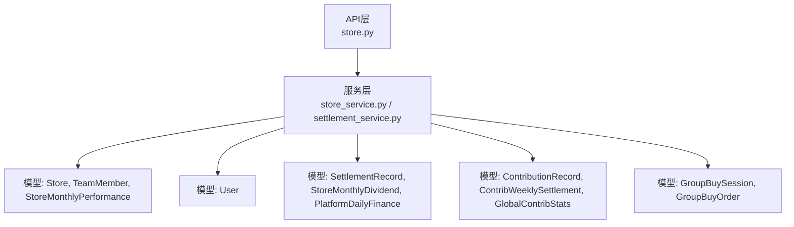
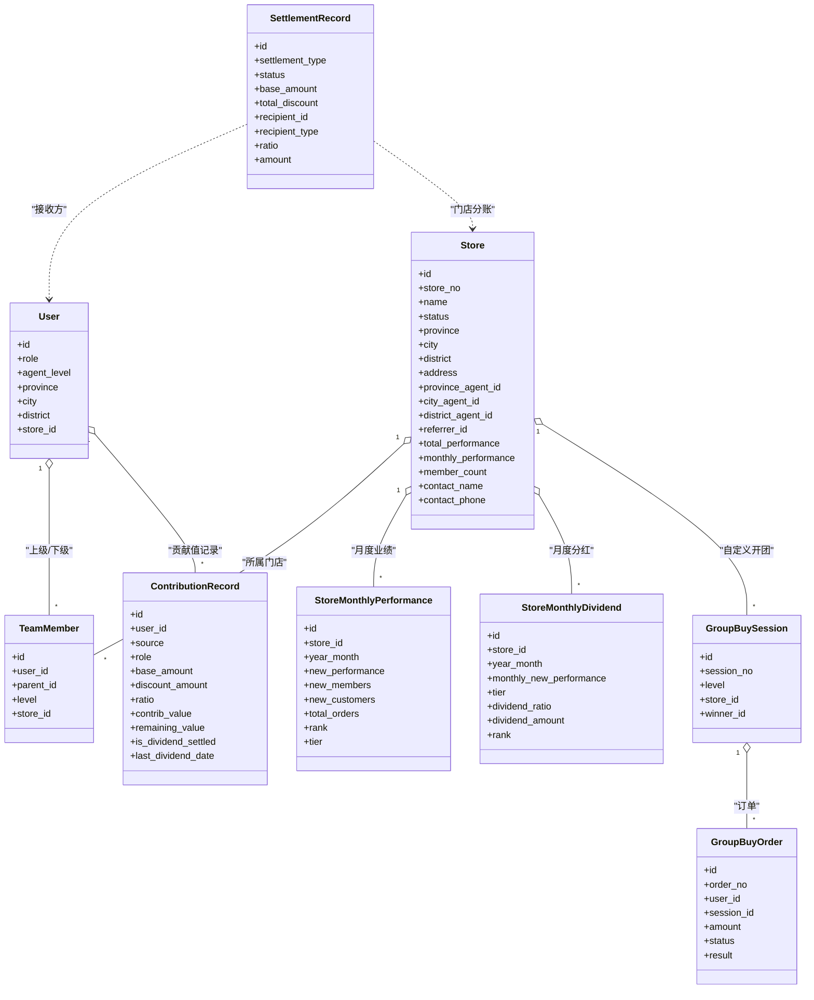
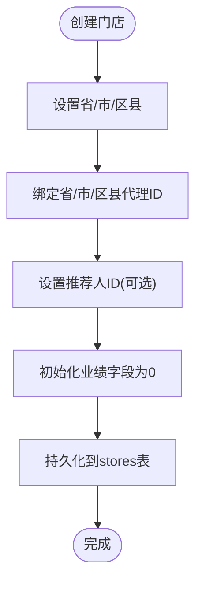
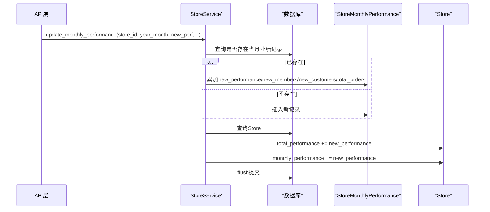
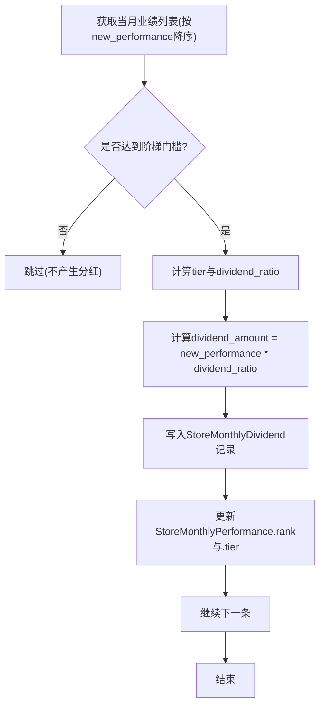
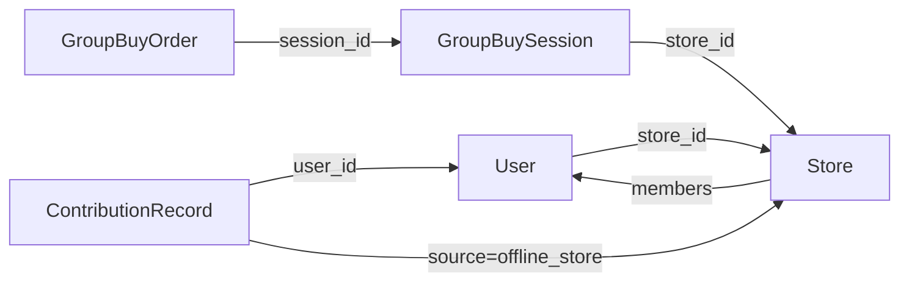
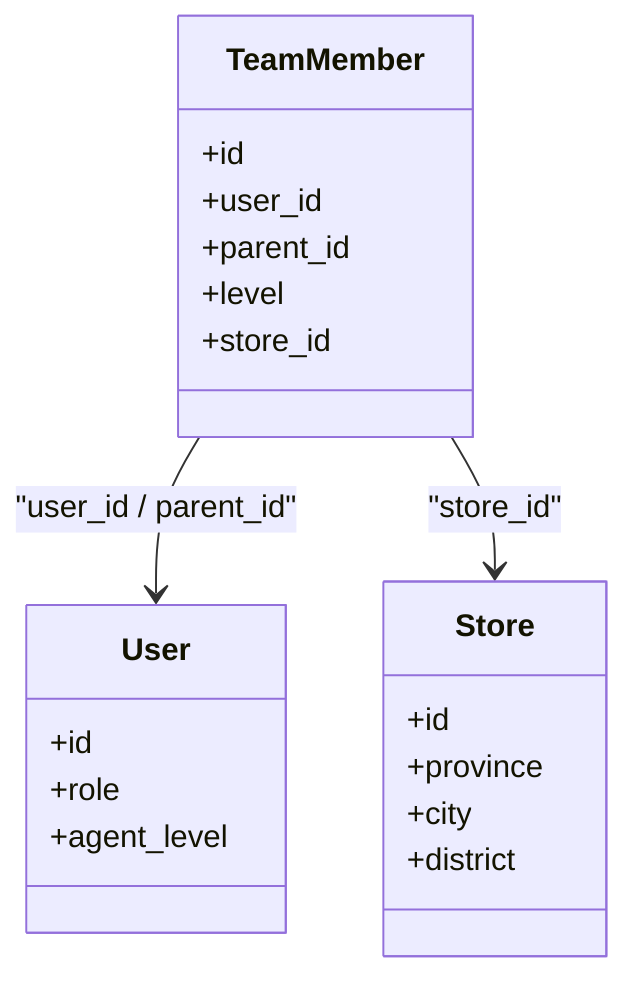
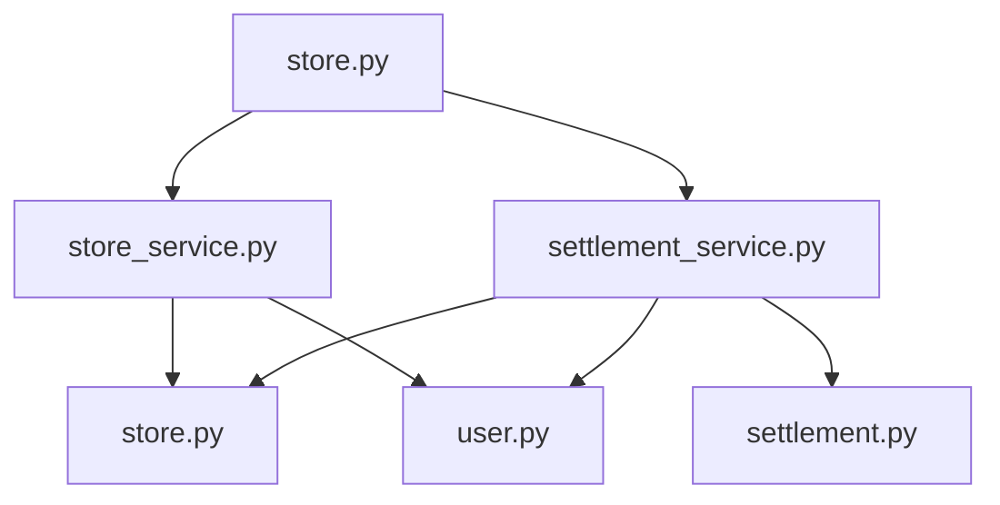

# 门店数据模型

<cite>
**本文引用的文件**   
- [backend/app/models/store.py](file://backend/app/models/store.py)
- [backend/app/services/store_service.py](file://backend/app/services/store_service.py)
- [backend/app/api/v1/store.py](file://backend/app/api/v1/store.py)
- [backend/app/models/user.py](file://backend/app/models/user.py)
- [backend/app/models/contribution.py](file://backend/app/models/contribution.py)
- [backend/app/models/settlement.py](file://backend/app/models/settlement.py)
- [backend/app/services/settlement_service.py](file://backend/app/services/settlement_service.py)
- [backend/app/models/group_buy.py](file://backend/app/models/group_buy.py)
</cite>

## 目录
1. [引言](#引言)
2. [项目结构](#项目结构)
3. [核心组件](#核心组件)
4. [架构总览](#架构总览)
5. [详细组件分析](#详细组件分析)
6. [依赖关系分析](#依赖关系分析)
7. [性能与优化](#性能与优化)
8. [故障排查指南](#故障排查指南)
9. [结论](#结论)
10. [附录](#附录)

## 引言
本文件聚焦AIxingmu项目的“门店数据模型”，围绕Store门店的四級代理体系（省/市/区县/门店）进行系统化解析，包括：
- 层级关系与上级关联设计
- 区域字段与编码规则建议
- 门店业绩统计字段与月度聚合表
- 阶梯分红计算的数据结构与流程
- 门店与用户、订单、贡献值的关联关系
- 门店网络拓扑建模与地理信息存储方案
- 层级查询优化、业绩统计聚合与报表生成的数据支持

## 项目结构
后端采用分层架构：API层暴露接口，Service层封装业务逻辑，Model层定义数据模型。门店相关能力分布在store模型与服务、结算服务、以及用户/贡献值/拼团等模型中。

图表来源
- [backend/app/api/v1/store.py:1-48](file://backend/app/api/v1/store.py#L1-L48)
- [backend/app/services/store_service.py:1-161](file://backend/app/services/store_service.py#L1-L161)
- [backend/app/services/settlement_service.py:1-166](file://backend/app/services/settlement_service.py#L1-L166)
- [backend/app/models/store.py:1-104](file://backend/app/models/store.py#L1-L104)
- [backend/app/models/user.py:1-93](file://backend/app/models/user.py#L1-L93)
- [backend/app/models/settlement.py:1-123](file://backend/app/models/settlement.py#L1-L123)
- [backend/app/models/contribution.py:1-115](file://backend/app/models/contribution.py#L1-L115)
- [backend/app/models/group_buy.py:1-158](file://backend/app/models/group_buy.py#L1-L158)

章节来源
- [backend/app/api/v1/store.py:1-48](file://backend/app/api/v1/store.py#L1-L48)
- [backend/app/services/store_service.py:1-161](file://backend/app/services/store_service.py#L1-L161)
- [backend/app/services/settlement_service.py:1-166](file://backend/app/services/settlement_service.py#L1-L166)
- [backend/app/models/store.py:1-104](file://backend/app/models/store.py#L1-L104)
- [backend/app/models/user.py:1-93](file://backend/app/models/user.py#L1-L93)
- [backend/app/models/settlement.py:1-123](file://backend/app/models/settlement.py#L1-L123)
- [backend/app/models/contribution.py:1-115](file://backend/app/models/contribution.py#L1-L115)
- [backend/app/models/group_buy.py:1-158](file://backend/app/models/group_buy.py#L1-L158)

## 核心组件
- Store门店模型：承载四级线下体系的门店实体，包含区域字段、代理归属、推荐人、基础业绩统计与索引。
- TeamMember团队成员关系表：记录四级团队上下级关系与层级深度。
- StoreMonthlyPerformance门店月度业绩统计表：按月聚合门店新增业绩、会员、客户、订单数及排名、阶梯等级。
- StoreMonthlyDividend门店月度阶梯分红记录表：按当月新增业绩确定阶梯与分红金额，并记录排名。
- User用户模型：与门店双向关联，具备代理级别与区域信息，作为代理与门店的承载主体。
- Contribution贡献值模型：贡献值记录与周度结算、全网统计，支撑平台收益池与分红。
- Settlement分润结算模型：记录交易分润明细与平台每日财务汇总，确保100%分配对账。
- GroupBuy拼团模型：场次与订单，与门店存在开团来源关联，驱动分润与贡献值生成。

章节来源
- [backend/app/models/store.py:22-63](file://backend/app/models/store.py#L22-L63)
- [backend/app/models/store.py:66-81](file://backend/app/models/store.py#L66-L81)
- [backend/app/models/store.py:83-104](file://backend/app/models/store.py#L83-L104)
- [backend/app/models/user.py:26-71](file://backend/app/models/user.py#L26-L71)
- [backend/app/models/contribution.py:32-69](file://backend/app/models/contribution.py#L32-L69)
- [backend/app/models/contribution.py:72-100](file://backend/app/models/contribution.py#L72-L100)
- [backend/app/models/contribution.py:103-115](file://backend/app/models/contribution.py#L103-L115)
- [backend/app/models/settlement.py:30-63](file://backend/app/models/settlement.py#L30-L63)
- [backend/app/models/settlement.py:66-93](file://backend/app/models/settlement.py#L66-L93)
- [backend/app/models/settlement.py:96-123](file://backend/app/models/settlement.py#L96-L123)
- [backend/app/models/group_buy.py:42-86](file://backend/app/models/group_buy.py#L42-L86)
- [backend/app/models/group_buy.py:89-131](file://backend/app/models/group_buy.py#L89-L131)

## 架构总览
门店数据模型在系统中的角色如下：
- 门店作为线下节点，承载区域信息与代理归属，参与业绩统计与阶梯分红。
- 用户作为代理与门店的载体，通过角色与区域字段体现四级代理体系。
- 团队关系表维护上下级链路，用于团队管理与业绩归因。
- 月度业绩表与分红表提供报表与结算所需聚合数据。
- 贡献值与分润模型将线上/线下消费与平台收益池打通，形成闭环。

图表来源
- [backend/app/models/store.py:22-63](file://backend/app/models/store.py#L22-L63)
- [backend/app/models/store.py:66-81](file://backend/app/models/store.py#L66-L81)
- [backend/app/models/store.py:83-104](file://backend/app/models/store.py#L83-L104)
- [backend/app/models/user.py:26-71](file://backend/app/models/user.py#L26-L71)
- [backend/app/models/settlement.py:30-63](file://backend/app/models/settlement.py#L30-L63)
- [backend/app/models/settlement.py:66-93](file://backend/app/models/settlement.py#L66-L93)
- [backend/app/models/contribution.py:32-69](file://backend/app/models/contribution.py#L32-L69)
- [backend/app/models/group_buy.py:42-86](file://backend/app/models/group_buy.py#L42-L86)
- [backend/app/models/group_buy.py:89-131](file://backend/app/models/group_buy.py#L89-L131)

## 详细组件分析

### 门店Store模型与四级代理体系
- 四级线下体系：省→市→区县→门店。Store表以province/city/district描述门店所在区域，并通过province_agent_id、city_agent_id、district_agent_id分别指向对应级别的代理用户。
- 推荐关系：referrer_id指向推荐该门店的用户，便于推荐链路与分润归因。
- 业绩字段：total_performance累计总业绩、monthly_performance当月新增业绩、member_count门店会员数。
- 索引优化：针对status与area组合建立索引，提升列表与筛选查询效率。

图表来源
- [backend/app/services/store_service.py:18-52](file://backend/app/services/store_service.py#L18-L52)
- [backend/app/models/store.py:22-63](file://backend/app/models/store.py#L22-L63)

章节来源
- [backend/app/models/store.py:22-63](file://backend/app/models/store.py#L22-L63)
- [backend/app/services/store_service.py:18-52](file://backend/app/services/store_service.py#L18-L52)

### 区域编码规则与上级关联关系
- 当前实现使用字符串字段province/city/district表示区域名称，未强制统一编码。建议在数据治理层面引入标准行政区划编码（如国家或省级标准码），并在应用层增加校验与转换逻辑。
- 上级关联通过外键直接指向users表的代理用户，避免冗余冗余表，简化查询路径。
- 代理级别由User.agent_level标识，结合Store的三级代理ID共同构成完整的四级体系映射。

章节来源
- [backend/app/models/store.py:31-43](file://backend/app/models/store.py#L31-L43)
- [backend/app/models/user.py:47-54](file://backend/app/models/user.py#L47-L54)

### 门店业绩统计字段与月度聚合
- StoreMonthlyPerformance按月聚合门店的新增业绩、新增会员、新增客户、总订单数，并提供rank与tier字段用于排名与阶梯等级。
- 更新策略：update_monthly_performance方法根据store_id与year_month进行upsert式累加，同时同步更新Store.total_performance与Store.monthly_performance。

图表来源
- [backend/app/services/store_service.py:54-99](file://backend/app/services/store_service.py#L54-L99)
- [backend/app/models/store.py:83-104](file://backend/app/models/store.py#L83-L104)

章节来源
- [backend/app/services/store_service.py:54-99](file://backend/app/services/store_service.py#L54-L99)
- [backend/app/models/store.py:83-104](file://backend/app/models/store.py#L83-L104)

### 门店阶梯分红计算数据结构与流程
- 阶梯规则：依据当月新增业绩划分四个阶梯，不同阶梯对应不同分红比例；具体阈值与比例来自配置项（STORE_TIER*_MIN与STORE_TIER*_DIVIDEND）。
- 结算流程：settle_store_monthly_dividend按月读取StoreMonthlyPerformance并按new_performance降序排序，逐条计算tier与dividend_amount，写入StoreMonthlyDividend，并回写perf.rank与perf.tier。

图表来源
- [backend/app/services/settlement_service.py:87-146](file://backend/app/services/settlement_service.py#L87-L146)
- [backend/app/models/settlement.py:66-93](file://backend/app/models/settlement.py#L66-L93)

章节来源
- [backend/app/services/settlement_service.py:87-146](file://backend/app/services/settlement_service.py#L87-L146)
- [backend/app/models/settlement.py:66-93](file://backend/app/models/settlement.py#L66-L93)

### 门店与用户、订单、贡献值的关联关系
- 用户与门店：User.store_id指向Store.id，表示用户所属门店；Store.members反向关联User，便于查询门店会员。
- 订单与门店：GroupBuySession.store_id可标记自定义开团门店，GroupBuyOrder通过session间接关联门店；分润结算时根据store_id向门店与代理发放分润。
- 贡献值与门店：ContributionRecord按场景记录贡献值，其中OFFLINE_STORE场景与线下门店消费相关；贡献值参与平台收益池与周度分红。

图表来源
- [backend/app/models/user.py:47-61](file://backend/app/models/user.py#L47-L61)
- [backend/app/models/group_buy.py:42-86](file://backend/app/models/group_buy.py#L42-L86)
- [backend/app/models/group_buy.py:89-131](file://backend/app/models/group_buy.py#L89-L131)
- [backend/app/models/contribution.py:32-69](file://backend/app/models/contribution.py#L32-L69)

章节来源
- [backend/app/models/user.py:47-61](file://backend/app/models/user.py#L47-L61)
- [backend/app/models/group_buy.py:42-86](file://backend/app/models/group_buy.py#L42-L86)
- [backend/app/models/group_buy.py:89-131](file://backend/app/models/group_buy.py#L89-L131)
- [backend/app/models/contribution.py:32-69](file://backend/app/models/contribution.py#L32-L69)

### 门店网络拓扑的数据建模
- 团队关系：TeamMember表以parent_id与level构建四级团队树，level限定为1-4，支持直推、间推、间间推、间间间推。
- 门店归属：TeamMember.store_id可将成员与门店关联，便于按门店维度统计团队规模与业绩。
- 查询优化：idx_team_parent索引(parent_id, level)加速按上级与层级检索。

图表来源
- [backend/app/models/store.py:66-81](file://backend/app/models/store.py#L66-L81)
- [backend/app/models/user.py:26-71](file://backend/app/models/user.py#L26-L71)

章节来源
- [backend/app/models/store.py:66-81](file://backend/app/models/store.py#L66-L81)
- [backend/app/models/user.py:26-71](file://backend/app/models/user.py#L26-L71)

### 地理信息存储方案
- 现状：Store.address为详细地址字符串，province/city/district为文本字段，未存储经纬度坐标。
- 建议：
  - 引入标准化区域编码（如国标区划码），在应用层做校验与转换，保证跨系统一致性。
  - 扩展Store表增加经纬度字段（如latitude/longitude），以便地图展示、距离计算与附近门店推荐。
  - 若需空间查询，可考虑引入PostGIS或类似空间数据库扩展，或使用外部地理信息服务进行坐标转换与距离估算。

章节来源
- [backend/app/models/store.py:31-35](file://backend/app/models/store.py#L31-L35)

### 层级查询优化、业绩统计聚合与报表生成
- 层级查询优化：
  - 使用TeamMember.parent_id与level进行快速检索，配合索引idx_team_parent。
  - 门店列表查询支持按province、city过滤，并基于idx_store_area提升复合条件查询性能。
- 业绩统计聚合：
  - StoreMonthlyPerformance按月聚合，update_monthly_performance采用upsert式累加，减少重复计算。
  - get_store_ranking按new_performance降序返回TopN，便于排行榜与报表。
- 报表生成：
  - 结合StoreMonthlyPerformance与StoreMonthlyDividend，输出门店月度业绩、排名、阶梯与分红金额。
  - 结合PlatformDailyFinance与SettlementRecord，输出平台收支对账报表，确保100%分配平衡。

章节来源
- [backend/app/services/store_service.py:120-161](file://backend/app/services/store_service.py#L120-L161)
- [backend/app/models/store.py:60-63](file://backend/app/models/store.py#L60-L63)
- [backend/app/models/settlement.py:96-123](file://backend/app/models/settlement.py#L96-L123)

## 依赖关系分析
- API层依赖StoreService与认证工具，暴露门店列表、排名、团队查询接口。
- Service层依赖各模型进行读写操作，并调用配置项（如分润比例、阶梯阈值）。
- 模型之间通过外键与关系属性建立强耦合，但职责清晰：Store负责门店主数据，TeamMember负责团队关系，StoreMonthlyPerformance负责业绩聚合，StoreMonthlyDividend负责分红结果，User承载代理与门店关联，ContributionRecord与SettlementRecord支撑贡献值与分润。

图表来源
- [backend/app/api/v1/store.py:1-48](file://backend/app/api/v1/store.py#L1-L48)
- [backend/app/services/store_service.py:1-161](file://backend/app/services/store_service.py#L1-L161)
- [backend/app/services/settlement_service.py:1-166](file://backend/app/services/settlement_service.py#L1-L166)
- [backend/app/models/store.py:1-104](file://backend/app/models/store.py#L1-L104)
- [backend/app/models/user.py:1-93](file://backend/app/models/user.py#L1-L93)
- [backend/app/models/settlement.py:1-123](file://backend/app/models/settlement.py#L1-L123)

章节来源
- [backend/app/api/v1/store.py:1-48](file://backend/app/api/v1/store.py#L1-L48)
- [backend/app/services/store_service.py:1-161](file://backend/app/services/store_service.py#L1-L161)
- [backend/app/services/settlement_service.py:1-166](file://backend/app/services/settlement_service.py#L1-L166)
- [backend/app/models/store.py:1-104](file://backend/app/models/store.py#L1-L104)
- [backend/app/models/user.py:1-93](file://backend/app/models/user.py#L1-L93)
- [backend/app/models/settlement.py:1-123](file://backend/app/models/settlement.py#L1-L123)

## 性能与优化
- 索引策略：
  - idx_store_status与idx_store_area提升门店状态与区域筛选性能。
  - idx_team_parent(parent_id, level)加速团队层级查询。
  - idx_store_perf_month(store_id, year_month)唯一索引保障月度业绩upsert幂等性。
- 聚合与分页：
  - get_store_list使用count与offset/limit分页，避免一次性加载全量数据。
  - get_store_ranking按new_performance排序取TopN，适合排行榜场景。
- 建议优化：
  - 对于高频区域筛选，可考虑引入区域编码表与外键约束，减少字符串匹配开销。
  - 对大表（如contribution_records、settlement_records）定期归档历史数据，保持热点数据集中。
  - 报表查询可使用物化视图或定时任务预聚合，降低实时计算压力。

[本节为通用性能建议，无需特定文件引用]

## 故障排查指南
- 业绩更新异常：
  - 检查update_monthly_performance是否正确执行upsert逻辑，确认year_month格式与store_id有效性。
  - 核对Store.total_performance与monthly_performance同步更新是否成功。
- 分红结算失败：
  - 确认settle_store_monthly_dividend读取的StoreMonthlyPerformance数据完整且排序正确。
  - 核查配置项STORE_TIER*_MIN与STORE_TIER*_DIVIDEND是否合理，避免无阶梯命中。
- 团队查询为空：
  - 检查TeamMember.parent_id与level是否正确设置，确认idx_team_parent索引生效。
- 分润记录缺失：
  - 核对settle_group_buy_win的分润比例与接收方类型，确保store_id与代理ID有效。

章节来源
- [backend/app/services/store_service.py:54-99](file://backend/app/services/store_service.py#L54-L99)
- [backend/app/services/settlement_service.py:87-146](file://backend/app/services/settlement_service.py#L87-L146)
- [backend/app/services/settlement_service.py:20-85](file://backend/app/services/settlement_service.py#L20-L85)

## 结论
门店数据模型围绕Store及其周边模型构建了完整的四级代理体系与业绩/分红闭环。通过合理的索引设计与聚合策略，系统在层级查询、业绩统计与报表生成方面具备良好的可扩展性与性能基础。后续可在区域编码标准化、地理信息增强与报表预聚合方面进一步优化，以提升整体数据一致性与查询效率。

[本节为总结性内容，无需特定文件引用]

## 附录
- 关键接口路径参考：
  - 门店列表：GET /api/v1/store/list
  - 门店排名：GET /api/v1/store/ranking
  - 我的团队：GET /api/v1/store/team?level=1..4

章节来源
- [backend/app/api/v1/store.py:13-47](file://backend/app/api/v1/store.py#L13-L47)