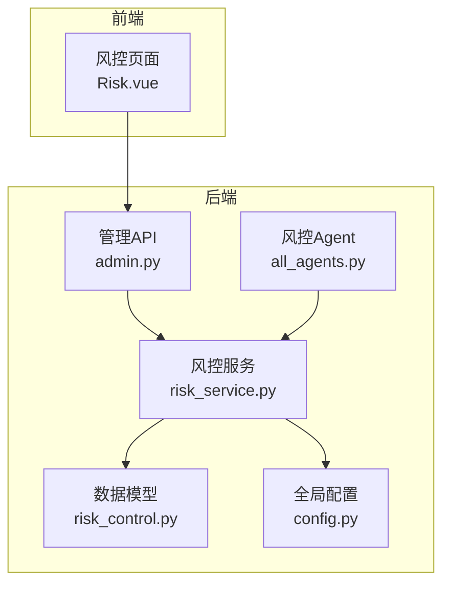
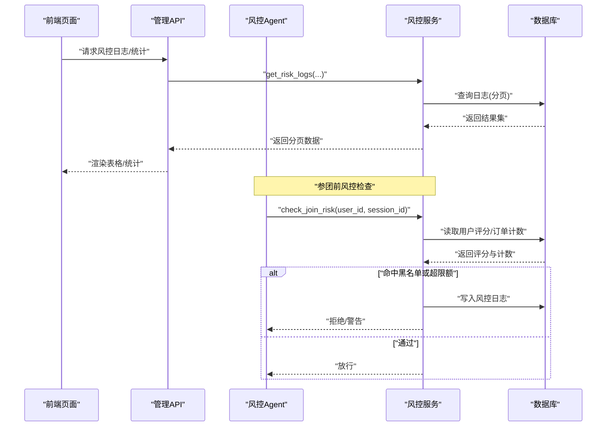
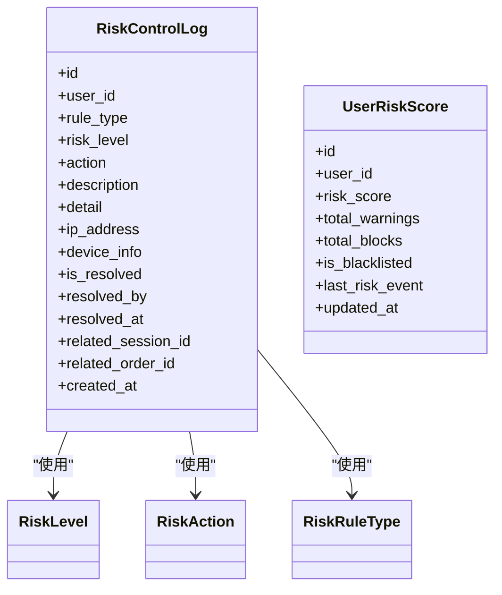
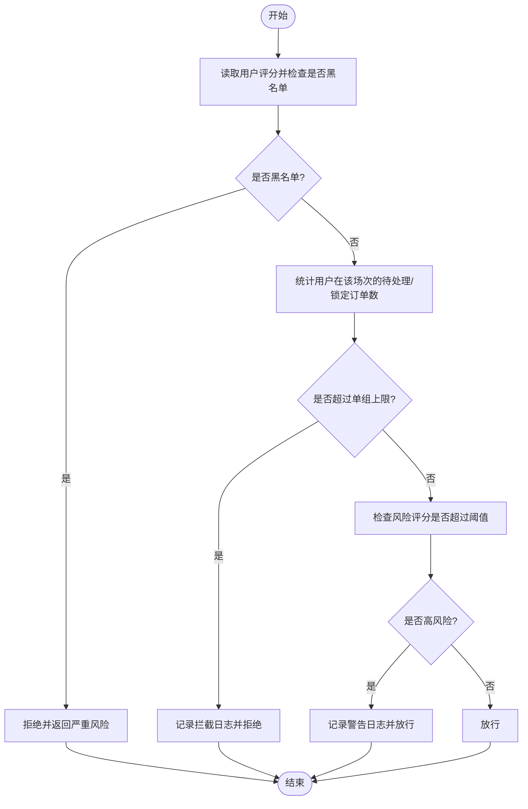
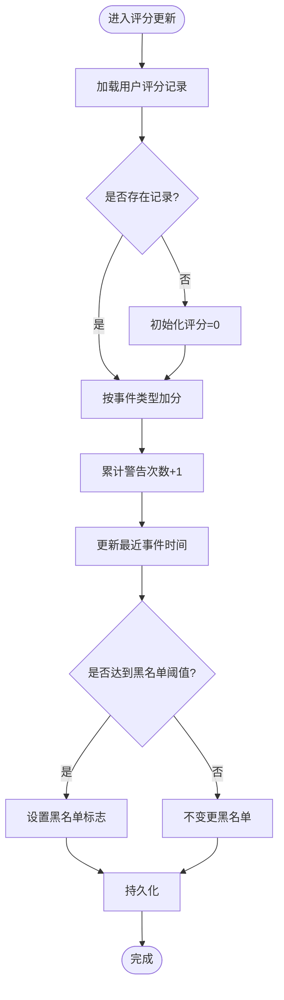
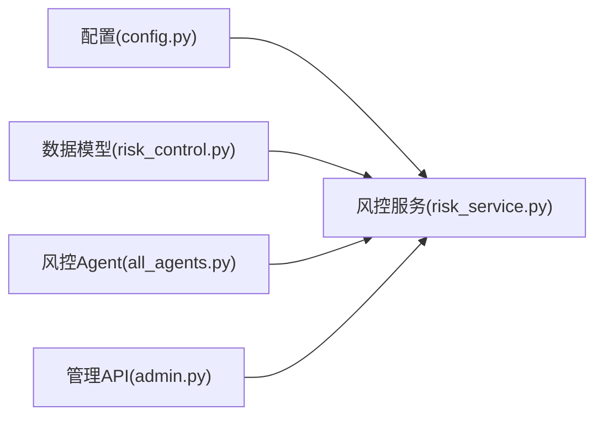

# 风控数据模型

<cite>
**本文引用的文件列表**
- [backend/app/models/risk_control.py](file://backend/app/models/risk_control.py)
- [backend/app/services/risk_service.py](file://backend/app/services/risk_service.py)
- [backend/app/agents/all_agents.py](file://backend/app/agents/all_agents.py)
- [backend/app/api/v1/admin.py](file://backend/app/api/v1/admin.py)
- [backend/app/config.py](file://backend/app/config.py)
- [frontend/web-admin/src/views/Risk.vue](file://frontend/web-admin/src/views/Risk.vue)
</cite>

## 目录
1. [引言](#引言)
2. [项目结构](#项目结构)
3. [核心组件](#核心组件)
4. [架构总览](#架构总览)
5. [详细组件分析](#详细组件分析)
6. [依赖关系分析](#依赖关系分析)
7. [性能与大数据处理建议](#性能与大数据处理建议)
8. [故障排查指南](#故障排查指南)
9. [结论](#结论)
10. [附录](#附录)

## 引言
本文件面向AIxingmu项目的风控子系统，聚焦于“风控数据模型”的设计与实现。围绕异常行为记录、限购规则配置、黑名单管理三大主题，系统梳理了风险事件的时间序列存储、历史追溯机制、评分与拦截策略的数据结构，并结合现有代码给出实时分析与机器学习特征工程的数据准备建议，以及面向高并发与大数据量的架构优化方案。

## 项目结构
风控相关代码主要分布在以下位置：
- 数据模型定义：后端模型层
- 风控服务逻辑：业务服务层
- Agent编排：Agent执行入口
- 管理端API：日志查询等管理接口
- 前端页面：风控概览与日志展示、黑名单管理交互

图表来源
- [backend/app/models/risk_control.py:1-84](file://backend/app/models/risk_control.py#L1-L84)
- [backend/app/services/risk_service.py:1-134](file://backend/app/services/risk_service.py#L1-L134)
- [backend/app/agents/all_agents.py:97-114](file://backend/app/agents/all_agents.py#L97-L114)
- [backend/app/api/v1/admin.py:71-79](file://backend/app/api/v1/admin.py#L71-L79)
- [backend/app/config.py:42-58](file://backend/app/config.py#L42-L58)
- [frontend/web-admin/src/views/Risk.vue:1-131](file://frontend/web-admin/src/views/Risk.vue#L1-L131)

章节来源
- [backend/app/models/risk_control.py:1-84](file://backend/app/models/risk_control.py#L1-L84)
- [backend/app/services/risk_service.py:1-134](file://backend/app/services/risk_service.py#L1-L134)
- [backend/app/agents/all_agents.py:97-114](file://backend/app/agents/all_agents.py#L97-L114)
- [backend/app/api/v1/admin.py:71-79](file://backend/app/api/v1/admin.py#L71-L79)
- [backend/app/config.py:42-58](file://backend/app/config.py#L42-L58)
- [frontend/web-admin/src/views/Risk.vue:1-131](file://frontend/web-admin/src/views/Risk.vue#L1-L131)

## 核心组件
- 风险等级与动作枚举：用于统一描述风险级别与处置动作（放行、警告、拦截、冻结）。
- 规则类型枚举：覆盖单日/单场参与上限、单ID单组订单上限、异常操作、违规开团、金额异常、频率异常等。
- 风控日志实体：记录每次风控事件的触发详情、关联会话/订单、处理状态与时间戳，并建立用户+时间的复合索引以支持高效检索。
- 用户风险评分实体：维护用户维度的累计风险分、警告/拦截次数、是否拉黑、最近事件时间与更新时间。

章节来源
- [backend/app/models/risk_control.py:13-37](file://backend/app/models/risk_control.py#L13-L37)
- [backend/app/models/risk_control.py:40-84](file://backend/app/models/risk_control.py#L40-L84)

## 架构总览
风控在参团流程中的关键路径如下：
- 风控Agent作为统一入口，调用风控服务进行校验。
- 风控服务读取用户风险评分与订单计数，结合配置阈值判断是否放行、警告或拦截。
- 命中规则时写入风控日志；当评分超过阈值自动加入黑名单。
- 管理端提供日志分页查询能力，前端展示统计与明细。

图表来源
- [backend/app/agents/all_agents.py:100-110](file://backend/app/agents/all_agents.py#L100-L110)
- [backend/app/services/risk_service.py:17-74](file://backend/app/services/risk_service.py#L17-L74)
- [backend/app/api/v1/admin.py:71-79](file://backend/app/api/v1/admin.py#L71-L79)

## 详细组件分析

### 实体设计与数据结构
- 风险等级与动作
  - 风险等级：低、中、高、严重。
  - 动作：放行、警告、拦截、冻结。
- 规则类型
  - 单日参与上限、单场参与上限、单ID单组最多N单、异常操作检测、违规开团检测、金额异常检测、频率异常检测。
- 风控日志表
  - 关键字段：用户ID、规则类型、风险等级、动作、描述、详情JSON、IP、设备信息、是否已处理、处理人、处理时间、关联会话ID、关联订单ID、创建时间。
  - 索引：用户+时间复合索引、风险等级索引，便于按用户回溯与按等级筛选。
- 用户风险评分表
  - 关键字段：用户ID（唯一）、风险评分、累计警告次数、累计拦截次数、是否黑名单、最近风控事件时间、更新时间。

图表来源
- [backend/app/models/risk_control.py:13-37](file://backend/app/models/risk_control.py#L13-L37)
- [backend/app/models/risk_control.py:40-84](file://backend/app/models/risk_control.py#L40-L84)

章节来源
- [backend/app/models/risk_control.py:13-37](file://backend/app/models/risk_control.py#L13-L37)
- [backend/app/models/risk_control.py:40-84](file://backend/app/models/risk_control.py#L40-L84)

### 风控规则与触发条件
- 单ID单组订单上限
  - 触发条件：同一用户在同一场次内，处于待处理/锁定状态的订单数达到配置上限即拦截。
  - 数据来源：拼团订单表的状态聚合计数。
  - 动作：拦截，并记录风控日志。
- 用户风险评分阈值
  - 触发条件：用户当前风险评分超过阈值（例如80）则发出警告，允许继续但标记高风险。
  - 动作：警告，并记录风控日志。
- 黑名单前置拦截
  - 触发条件：用户被标记为黑名单。
  - 动作：直接拒绝。

图表来源
- [backend/app/services/risk_service.py:17-74](file://backend/app/services/risk_service.py#L17-L74)
- [backend/app/config.py:58](file://backend/app/config.py#L58)

章节来源
- [backend/app/services/risk_service.py:17-74](file://backend/app/services/risk_service.py#L17-L74)
- [backend/app/config.py:58](file://backend/app/config.py#L58)

### 评分机制与黑名单管理
- 评分更新
  - 根据事件类型加权加分（如超限、频率异常、违规开团、金额异常等），默认事件加基础分值。
  - 累计警告次数与最近事件时间同步更新。
  - 当评分达到阈值（例如100）自动将用户加入黑名单。
- 黑名单判定
  - 基于用户评分表中的标志位进行快速判断，前置拦截高风险用户。

图表来源
- [backend/app/services/risk_service.py:76-107](file://backend/app/services/risk_service.py#L76-L107)

章节来源
- [backend/app/services/risk_service.py:76-107](file://backend/app/services/risk_service.py#L76-L107)

### 风控事件时间序列与历史追溯
- 时间序列存储
  - 每条风控事件均包含创建时间，配合用户+时间复合索引，可高效按用户维度回溯其历史事件序列。
- 历史追溯
  - 通过用户ID过滤并按时间倒序分页获取，便于运营人员查看某用户的完整风控轨迹。
- 关联上下文
  - 通过关联会话ID与订单ID，可将风控事件与具体业务上下文串联，形成完整的审计链路。

章节来源
- [backend/app/models/risk_control.py:40-70](file://backend/app/models/risk_control.py#L40-L70)
- [backend/app/services/risk_service.py:109-134](file://backend/app/services/risk_service.py#L109-L134)

### 实时分析支持与机器学习特征工程数据准备
- 实时分析
  - 利用用户评分表的累计指标（评分、警告/拦截次数、最近事件时间）作为实时风险画像的基础字段。
  - 结合风控日志的IP、设备信息、规则类型与风险等级，构建短期窗口内的频次与分布特征。
- 特征工程数据准备
  - 用户级静态特征：注册时长、认证状态、历史订单总量等（可从用户与订单主表扩展）。
  - 用户级动态特征：近N分钟/小时/天的下单次数、失败率、平均订单金额、设备/IP变化频率等。
  - 场景级特征：场次容量、剩余名额、价格梯度、活动时段等。
  - 标签构造：以最终是否造成损失或违规为标签，结合风控日志与订单结算结果对齐。
- 数据管道建议
  - 将风控日志与用户评分表增量抽取至分析库或流式平台，提供离线训练与在线推理双通道。
  - 对高频字段（用户ID、规则类型、风险等级、时间）建立物化视图或预聚合表，降低查询延迟。

[本节为概念性说明，无需列出具体文件来源]

### 管理端与前端集成
- 管理API
  - 提供风控日志的分页查询接口，支持按用户ID与风险等级过滤。
- 前端页面
  - 展示今日拦截、黑名单用户、高风险用户数量与平均风险评分等统计卡片。
  - 提供风控日志表格与分页，支持黑名单弹窗管理与增删操作。

章节来源
- [backend/app/api/v1/admin.py:71-79](file://backend/app/api/v1/admin.py#L71-L79)
- [frontend/web-admin/src/views/Risk.vue:1-131](file://frontend/web-admin/src/views/Risk.vue#L1-L131)

## 依赖关系分析
- 模块耦合
  - 风控服务依赖数据模型与全局配置，Agent仅作为编排入口，保持职责单一。
  - 管理API与服务解耦，通过异步会话访问数据库。
- 外部依赖
  - 数据库连接池大小与溢出参数由配置控制，影响并发处理能力。
  - Redis与Celery已在配置中预留，可用于后续缓存与异步任务扩展。

图表来源
- [backend/app/config.py:16-26](file://backend/app/config.py#L16-L26)
- [backend/app/services/risk_service.py:1-12](file://backend/app/services/risk_service.py#L1-L12)
- [backend/app/agents/all_agents.py:97-114](file://backend/app/agents/all_agents.py#L97-L114)
- [backend/app/api/v1/admin.py:71-79](file://backend/app/api/v1/admin.py#L71-L79)

章节来源
- [backend/app/config.py:16-26](file://backend/app/config.py#L16-L26)
- [backend/app/services/risk_service.py:1-12](file://backend/app/services/risk_service.py#L1-L12)
- [backend/app/agents/all_agents.py:97-114](file://backend/app/agents/all_agents.py#L97-L114)
- [backend/app/api/v1/admin.py:71-79](file://backend/app/api/v1/admin.py#L71-L79)

## 性能与大数据处理建议
- 数据库层面
  - 针对风控日志的用户+时间复合索引已存在，建议在热点查询上增加覆盖索引以减少回表。
  - 对风控日志表实施分区策略（按天/周），提升历史归档与范围扫描效率。
  - 对频繁读写的用户评分表考虑引入Redis缓存，减少热点键竞争。
- 计算与缓存
  - 将“单场订单计数”等高频统计迁移至Redis计数器，结合TTL与原子自增，降低数据库压力。
  - 对评分更新采用批量合并与去抖策略，避免频繁写放大。
- 异步与批处理
  - 借助Celery将非实时的风控统计与报表生成异步化，保障主流程低延迟。
  - 对风控日志的导出与分析任务采用流式消费，保证端到端时效性。
- 监控与告警
  - 对拦截率、评分分布、黑名单增长速率建立实时监控看板，设定阈值告警。
  - 对慢查询与锁等待进行追踪，持续优化SQL与索引。

[本节为通用性能建议，无需列出具体文件来源]

## 故障排查指南
- 常见问题定位
  - 若出现大量拦截，优先检查配置中的单组上限阈值与订单状态集合是否正确。
  - 若评分未更新或黑名单未生效，确认评分更新逻辑的事件映射与阈值判断是否被正确调用。
  - 若日志查询缓慢，检查索引命中情况与分页参数是否合理。
- 诊断步骤
  - 通过管理API按用户ID与风险等级过滤，定位特定用户的风控轨迹。
  - 核对用户评分表中的最近事件时间与累计次数，评估评分更新是否及时。
  - 观察数据库连接池与溢出参数，必要时扩容以提升并发吞吐。

章节来源
- [backend/app/services/risk_service.py:17-74](file://backend/app/services/risk_service.py#L17-L74)
- [backend/app/services/risk_service.py:76-107](file://backend/app/services/risk_service.py#L76-L107)
- [backend/app/services/risk_service.py:109-134](file://backend/app/services/risk_service.py#L109-L134)
- [backend/app/config.py:16-26](file://backend/app/config.py#L16-L26)

## 结论
本项目风控数据模型以“日志+评分”的双表结构为核心，支撑了黑名单前置拦截、限购规则校验与风险评分的动态演进。通过合理的索引设计与分页查询，实现了良好的历史追溯与管理端可视能力。面向未来，建议引入缓存与异步任务体系，完善实时分析与机器学习特征工程的数据管道，进一步提升风控系统的实时性与可扩展性。

## 附录
- 关键配置项参考
  - 单ID单组最大订单数：用于限购规则阈值。
  - 数据库连接池大小与溢出：影响并发读写能力。
  - Redis与Celery地址：为后续缓存与异步任务预留。

章节来源
- [backend/app/config.py:42-58](file://backend/app/config.py#L42-L58)
- [backend/app/config.py:16-26](file://backend/app/config.py#L16-L26)