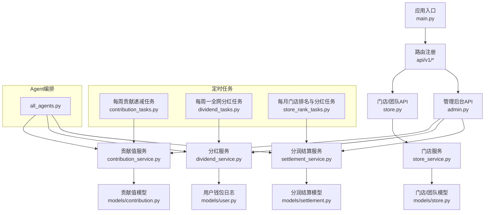
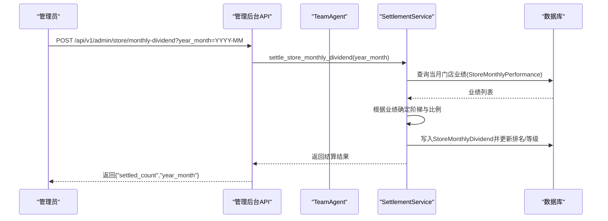
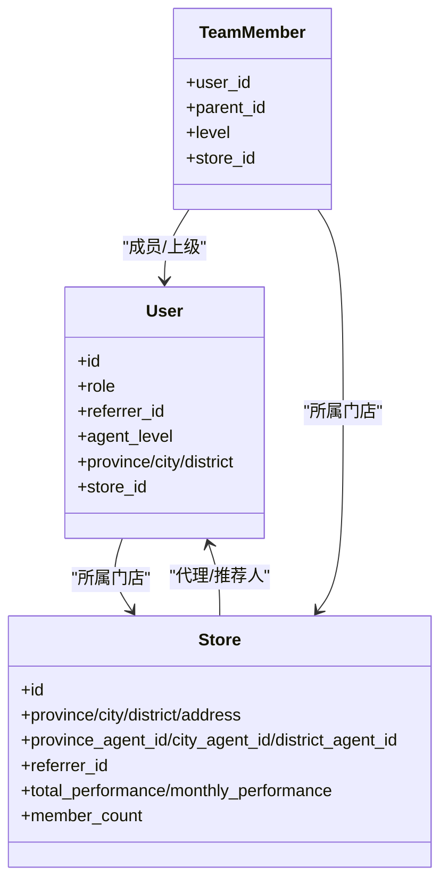
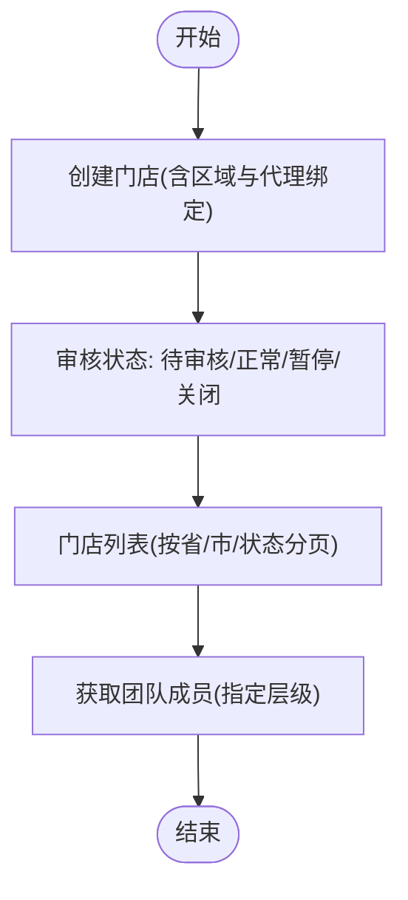
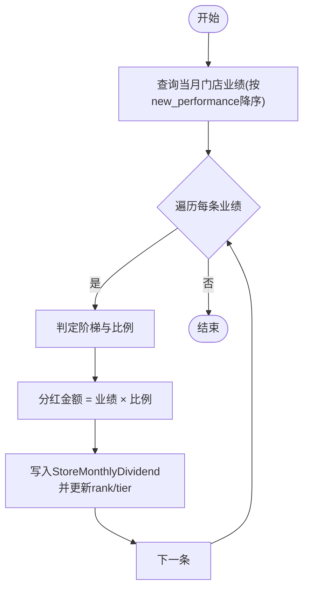
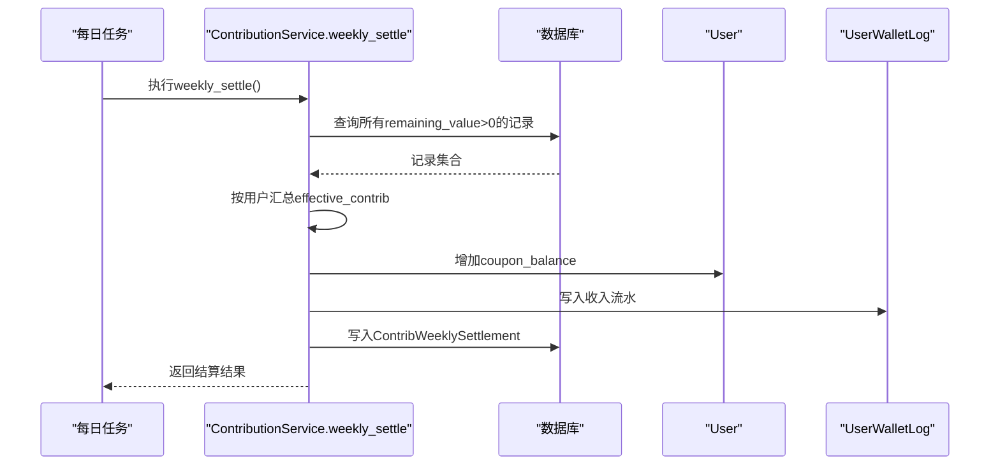
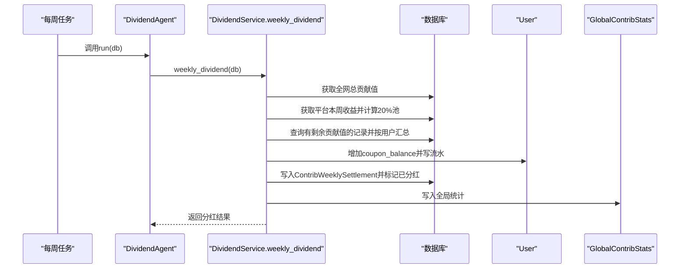
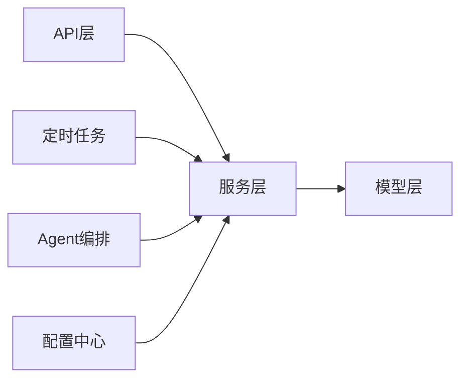

# 多层级分销体系

<cite>
**本文引用的文件**
- [backend/app/main.py](file://backend/app/main.py)
- [backend/app/config.py](file://backend/app/config.py)
- [backend/app/models/user.py](file://backend/app/models/user.py)
- [backend/app/models/store.py](file://backend/app/models/store.py)
- [backend/app/models/contribution.py](file://backend/app/models/contribution.py)
- [backend/app/models/settlement.py](file://backend/app/models/settlement.py)
- [backend/app/services/contribution_service.py](file://backend/app/services/contribution_service.py)
- [backend/app/services/dividend_service.py](file://backend/app/services/dividend_service.py)
- [backend/app/services/settlement_service.py](file://backend/app/services/settlement_service.py)
- [backend/app/services/store_service.py](file://backend/app/services/store_service.py)
- [backend/app/api/v1/store.py](file://backend/app/api/v1/store.py)
- [backend/app/api/v1/admin.py](file://backend/app/api/v1/admin.py)
- [backend/app/tasks/dividend_tasks.py](file://backend/app/tasks/dividend_tasks.py)
- [backend/app/tasks/contribution_tasks.py](file://backend/app/tasks/contribution_tasks.py)
- [backend/app/tasks/store_rank_tasks.py](file://backend/app/tasks/store_rank_tasks.py)
- [backend/app/agents/all_agents.py](file://backend/app/agents/all_agents.py)
</cite>

## 目录
1. [引言](#引言)
2. [项目结构](#项目结构)
3. [核心组件](#核心组件)
4. [架构总览](#架构总览)
5. [详细组件分析](#详细组件分析)
6. [依赖关系分析](#依赖关系分析)
7. [性能与扩展性](#性能与扩展性)
8. [故障排查指南](#故障排查指南)
9. [合规与风控](#合规与风控)
10. [操作指南与收益计算示例](#操作指南与收益计算示例)
11. [结论](#结论)

## 引言
本文件面向AIxingmu多层级分销体系的代理商、门店管理员与平台运营人员，系统性阐述省/市/区县/门店四级代理的组织架构与利益分配机制，解释门店网络管理流程（申请入驻、区域划分、代理绑定）、月度阶梯分红算法、业绩统计指标追踪、门店等级评定与升级条件，并提供API接口文档、合规与风控建议以及实操指南。

## 项目结构
后端采用FastAPI分层架构：路由层（API）→服务层（业务逻辑）→模型层（数据持久化），配合Celery定时任务与AI Agent编排完成自动化结算与分红。

图表来源
- [backend/app/main.py:1-73](file://backend/app/main.py#L1-L73)
- [backend/app/api/v1/store.py:1-48](file://backend/app/api/v1/store.py#L1-L48)
- [backend/app/api/v1/admin.py:1-86](file://backend/app/api/v1/admin.py#L1-L86)
- [backend/app/services/store_service.py:1-161](file://backend/app/services/store_service.py#L1-L161)
- [backend/app/services/contribution_service.py:1-261](file://backend/app/services/contribution_service.py#L1-L261)
- [backend/app/services/dividend_service.py:1-136](file://backend/app/services/dividend_service.py#L1-L136)
- [backend/app/services/settlement_service.py:1-166](file://backend/app/services/settlement_service.py#L1-L166)
- [backend/app/models/store.py:1-104](file://backend/app/models/store.py#L1-L104)
- [backend/app/models/contribution.py:1-115](file://backend/app/models/contribution.py#L1-L115)
- [backend/app/models/settlement.py:1-123](file://backend/app/models/settlement.py#L1-L123)
- [backend/app/tasks/contribution_tasks.py:1-29](file://backend/app/tasks/contribution_tasks.py#L1-L29)
- [backend/app/tasks/dividend_tasks.py:1-26](file://backend/app/tasks/dividend_tasks.py#L1-L26)
- [backend/app/tasks/store_rank_tasks.py:1-29](file://backend/app/tasks/store_rank_tasks.py#L1-L29)
- [backend/app/agents/all_agents.py:1-114](file://backend/app/agents/all_agents.py#L1-L114)

章节来源
- [backend/app/main.py:1-73](file://backend/app/main.py#L1-L73)

## 核心组件
- 用户与角色
  - 支持消费者、推荐消费者、线下门店、推荐门店、区县代理、市级代理、省级代理、平台管理员等角色，并维护推荐关系与门店归属。
- 门店与团队
  - 四级线下体系：省→市→区县→门店；团队成员关系表记录直推/间推层级；门店月度业绩表记录新增业绩、会员数、订单数及排名/等级。
- 贡献值系统
  - 统一公式：各方贡献值=让利金额×分配比例×乘数；三大场景通用（线上零售、拼团成功、线下门店消费）。
- 分润结算系统
  - 线下四级分润：省1%、市2%、区县4%、门店8%、推荐门店1%；平台100%分配对账。
- 分红与兑换
  - 周度递减兑换：有效贡献值×日利率×7生成消费券；每周一全网分红：个人贡献值占比×平台20%收益池发放消费券。
- 门店月度阶梯分红
  - 按当月新增业绩落入阶梯区间确定等级与比例，自动计算分红金额并更新排名。

章节来源
- [backend/app/models/user.py:1-93](file://backend/app/models/user.py#L1-L93)
- [backend/app/models/store.py:1-104](file://backend/app/models/store.py#L1-L104)
- [backend/app/models/contribution.py:1-115](file://backend/app/models/contribution.py#L1-L115)
- [backend/app/models/settlement.py:1-123](file://backend/app/models/settlement.py#L1-L123)
- [backend/app/services/contribution_service.py:1-261](file://backend/app/services/contribution_service.py#L1-L261)
- [backend/app/services/dividend_service.py:1-136](file://backend/app/services/dividend_service.py#L1-L136)
- [backend/app/services/settlement_service.py:1-166](file://backend/app/services/settlement_service.py#L1-L166)
- [backend/app/services/store_service.py:1-161](file://backend/app/services/store_service.py#L1-L161)

## 架构总览
系统通过API暴露能力，服务层封装业务规则，模型层负责持久化；定时任务驱动周期性结算与分红；Agent用于串联多步骤流程。

图表来源
- [backend/app/api/v1/admin.py:59-68](file://backend/app/api/v1/admin.py#L59-L68)
- [backend/app/agents/all_agents.py:83-94](file://backend/app/agents/all_agents.py#L83-L94)
- [backend/app/services/settlement_service.py:88-133](file://backend/app/services/settlement_service.py#L88-L133)
- [backend/app/models/settlement.py:66-93](file://backend/app/models/settlement.py#L66-L93)
- [backend/app/models/store.py:83-104](file://backend/app/models/store.py#L83-L104)

## 详细组件分析

### 组织架构与利益分配（省/市/区县/门店）
- 组织关系
  - 门店关联省/市/区县代理ID与推荐人ID；团队成员表记录上下级与层级。
- 分润比例
  - 线下四级分润：省1%、市2%、区县4%、门店8%、推荐门店1%；合计16%来自让利池。
- 贡献值分配
  - 六大角色：消费者50%、合作商家/门店20%、推荐商家8%、推荐消费者5%、代理合计7%（省1%+市2%+区县4%）、平台10%。

图表来源
- [backend/app/models/user.py:26-71](file://backend/app/models/user.py#L26-L71)
- [backend/app/models/store.py:22-63](file://backend/app/models/store.py#L22-L63)
- [backend/app/models/store.py:66-81](file://backend/app/models/store.py#L66-L81)

章节来源
- [backend/app/models/user.py:1-93](file://backend/app/models/user.py#L1-L93)
- [backend/app/models/store.py:1-104](file://backend/app/models/store.py#L1-L104)
- [backend/app/services/settlement_service.py:20-85](file://backend/app/services/settlement_service.py#L20-L85)
- [backend/app/services/contribution_service.py:19-143](file://backend/app/services/contribution_service.py#L19-L143)

### 门店网络管理（申请入驻、区域划分、代理绑定）
- 门店创建
  - 提供门店编号、名称、省市区地址、联系人信息，并可选绑定省/市/区县代理与推荐人。
- 门店列表与筛选
  - 支持按省份、城市、状态分页查询。
- 团队管理
  - 按层级获取我的团队成员（直推/间推/间间推/间间间推）。

图表来源
- [backend/app/services/store_service.py:18-52](file://backend/app/services/store_service.py#L18-L52)
- [backend/app/services/store_service.py:136-161](file://backend/app/services/store_service.py#L136-L161)
- [backend/app/services/store_service.py:101-118](file://backend/app/services/store_service.py#L101-L118)
- [backend/app/api/v1/store.py:13-47](file://backend/app/api/v1/store.py#L13-L47)

章节来源
- [backend/app/services/store_service.py:1-161](file://backend/app/services/store_service.py#L1-L161)
- [backend/app/api/v1/store.py:1-48](file://backend/app/api/v1/store.py#L1-L48)

### 月度阶梯分红算法
- 阶梯定义
  - 阶梯一：3万~5万 → 0.5%
  - 阶梯二：5万~10万 → 0.5%
  - 阶梯三：10万~50万 → 0.5%
  - 阶梯四：50万以上 → 1%
- 计算流程
  - 按月聚合门店新增业绩，排序后逐条判定阶梯与比例，计算分红金额并写入记录，同时更新门店排名与等级。

图表来源
- [backend/app/services/settlement_service.py:88-133](file://backend/app/services/settlement_service.py#L88-L133)
- [backend/app/models/settlement.py:66-93](file://backend/app/models/settlement.py#L66-L93)
- [backend/app/models/store.py:83-104](file://backend/app/models/store.py#L83-L104)

章节来源
- [backend/app/services/settlement_service.py:88-146](file://backend/app/services/settlement_service.py#L88-L146)
- [backend/app/models/settlement.py:66-93](file://backend/app/models/settlement.py#L66-L93)

### 贡献值与周度递减兑换
- 贡献值生成
  - 单笔交易按六大角色分别生成贡献值记录，初始remaining_value等于contrib_value。
- 周度递减兑换
  - 每周一：有效贡献值×日利率×7生成消费券，计入用户余额并记录流水；贡献值不扣减，继续参与下期。

图表来源
- [backend/app/services/contribution_service.py:162-240](file://backend/app/services/contribution_service.py#L162-L240)
- [backend/app/models/contribution.py:72-100](file://backend/app/models/contribution.py#L72-L100)
- [backend/app/models/user.py:74-92](file://backend/app/models/user.py#L74-L92)
- [backend/app/tasks/contribution_tasks.py:15-28](file://backend/app/tasks/contribution_tasks.py#L15-L28)

章节来源
- [backend/app/services/contribution_service.py:1-261](file://backend/app/services/contribution_service.py#L1-L261)
- [backend/app/models/contribution.py:1-115](file://backend/app/models/contribution.py#L1-L115)
- [backend/app/models/user.py:74-92](file://backend/app/models/user.py#L74-L92)
- [backend/app/tasks/contribution_tasks.py:1-29](file://backend/app/tasks/contribution_tasks.py#L1-L29)

### 全网贡献值周度分红
- 分红池
  - 平台20%收益池来源于平台本周总收入汇总。
- 计算公式
  - 个人消费券分红 = (个人剩余贡献值 / 全网总贡献值) × 平台20%收益池。
- 执行流程
  - 每周一由Agent触发，计算并标记已分红记录，写入GlobalContribStats。

图表来源
- [backend/app/tasks/dividend_tasks.py:15-25](file://backend/app/tasks/dividend_tasks.py#L15-L25)
- [backend/app/agents/all_agents.py:52-62](file://backend/app/agents/all_agents.py#L52-L62)
- [backend/app/services/dividend_service.py:19-123](file://backend/app/services/dividend_service.py#L19-L123)
- [backend/app/models/contribution.py:103-115](file://backend/app/models/contribution.py#L103-L115)

章节来源
- [backend/app/services/dividend_service.py:1-136](file://backend/app/services/dividend_service.py#L1-L136)
- [backend/app/tasks/dividend_tasks.py:1-26](file://backend/app/tasks/dividend_tasks.py#L1-L26)
- [backend/app/agents/all_agents.py:48-62](file://backend/app/agents/all_agents.py#L48-L62)

### 业绩统计与关键指标
- 门店维度
  - 累计总业绩、当月新增业绩、会员数、订单数、排名与等级。
- 团队维度
  - 按层级统计团队成员数量与活跃度。
- 平台维度
  - 平台每日财务汇总，确保收支100%分配与平衡校验。

章节来源
- [backend/app/models/store.py:83-104](file://backend/app/models/store.py#L83-L104)
- [backend/app/models/settlement.py:96-123](file://backend/app/models/settlement.py#L96-L123)
- [backend/app/services/store_service.py:54-99](file://backend/app/services/store_service.py#L54-L99)

## 依赖关系分析
- 模块耦合
  - API层依赖服务层；服务层依赖模型层；定时任务通过Agent或服务直接调用服务层；配置集中管理。
- 外部依赖
  - 数据库（异步SQLAlchemy）、Redis/Celery（消息队列与结果存储）、对象存储（MinIO，未在本节展开）。

图表来源
- [backend/app/main.py:57-67](file://backend/app/main.py#L57-L67)
- [backend/app/config.py:1-136](file://backend/app/config.py#L1-L136)

章节来源
- [backend/app/main.py:1-73](file://backend/app/main.py#L1-L73)
- [backend/app/config.py:1-136](file://backend/app/config.py#L1-L136)

## 性能与扩展性
- 索引优化
  - 门店区域索引、团队上下级索引、月度业绩复合索引、贡献值用户/角色索引、结算记录类型/状态索引等，提升查询与统计效率。
- 批处理与事务
  - 周度/月度批量结算使用flush与批量写入，减少往返开销；必要时可引入分批提交策略。
- 可扩展点
  - 贡献值日利率、阶梯阈值与比例均通过配置项管理，便于灰度与A/B测试。

章节来源
- [backend/app/models/store.py:60-63](file://backend/app/models/store.py#L60-L63)
- [backend/app/models/store.py:78-80](file://backend/app/models/store.py#L78-L80)
- [backend/app/models/store.py:101-103](file://backend/app/models/store.py#L101-L103)
- [backend/app/models/contribution.py:66-69](file://backend/app/models/contribution.py#L66-L69)
- [backend/app/models/settlement.py:60-63](file://backend/app/models/settlement.py#L60-L63)

## 故障排查指南
- 常见问题定位
  - 门店列表为空：检查是否按省/市过滤或状态筛选导致无结果。
  - 团队人数为0：确认团队成员是否已建立且层级匹配。
  - 分红结果为0：检查是否有剩余贡献值或平台收益池是否为空。
  - 月度分红未生效：确认是否已执行月度任务或手动触发接口。
- 调试手段
  - 使用管理后台接口手动触发周度/月度结算，观察返回数据与数据库记录。
  - 查看用户钱包流水与贡献值记录，核对计算路径。

章节来源
- [backend/app/api/v1/store.py:13-47](file://backend/app/api/v1/store.py#L13-L47)
- [backend/app/api/v1/admin.py:45-68](file://backend/app/api/v1/admin.py#L45-L68)
- [backend/app/services/dividend_service.py:19-123](file://backend/app/services/dividend_service.py#L19-L123)
- [backend/app/services/contribution_service.py:162-240](file://backend/app/services/contribution_service.py#L162-L240)

## 合规与风控
- 合规要点
  - 明确各级代理与门店的资质审核与备案；留存完整分润与贡献值流水，确保可审计。
  - 控制层级深度与返利上限，避免多级传销风险；遵循当地法律法规关于分销与营销的规定。
- 风险控制措施
  - 限购与异常行为检测（如频繁开团、刷单、异常转化）；实时拦截高风险操作。
  - 平台收支100%分配对账，定期复核平台每日财务汇总，确保资金安全与透明。
  - 数据脱敏与权限隔离，仅授权角色访问敏感数据。

章节来源
- [backend/app/models/settlement.py:96-123](file://backend/app/models/settlement.py#L96-L123)
- [backend/app/agents/all_agents.py:97-113](file://backend/app/agents/all_agents.py#L97-L113)

## 操作指南与收益计算示例

### 门店管理员操作指南
- 申请入驻
  - 准备门店编号、名称、省市区详细地址、联系人信息；选择或等待平台分配省/市/区县代理；提交后进入“待审核”。
- 区域划分与代理绑定
  - 在创建门店时填写省市区字段并传入对应代理ID；若暂无代理，可由平台后续补录。
- 查看团队
  - 使用“我的团队”接口按层级查看直推/间推成员，了解团队规模与活跃度。
- 业绩上报
  - 通过月度业绩更新接口录入当月新增业绩、新增会员与客户数、订单数，系统将同步更新门店总业绩与排名。

章节来源
- [backend/app/services/store_service.py:18-52](file://backend/app/services/store_service.py#L18-L52)
- [backend/app/services/store_service.py:54-99](file://backend/app/services/store_service.py#L54-L99)
- [backend/app/api/v1/store.py:39-47](file://backend/app/api/v1/store.py#L39-L47)

### 代理商操作指南
- 查看团队业绩
  - 通过门店排名接口获取上月/本月门店业绩与排名，评估自身区域表现。
- 收益明细
  - 关注分润结算记录与贡献值流水，理解各角色收益构成。

章节来源
- [backend/app/api/v1/store.py:26-36](file://backend/app/api/v1/store.py#L26-L36)
- [backend/app/models/settlement.py:30-63](file://backend/app/models/settlement.py#L30-L63)
- [backend/app/models/contribution.py:32-69](file://backend/app/models/contribution.py#L32-L69)

### 收益计算示例（说明性）
- 门店月度阶梯分红
  - 假设某门店当月新增业绩为6万元，落入阶梯二（5万~10万），比例为0.5%，则分红金额为60,000×0.5%=300元。
- 贡献值周度递减兑换
  - 假设用户有效贡献值为10,000，日利率为0.0005，则当周消费券=10,000×0.0005×7=35元。
- 全网贡献值周度分红
  - 假设平台本周收益为100,000元，20%收益池为20,000元；全网总贡献值为2,000,000；用户剩余贡献值为20,000，则个人分红=20,000/2,000,000×20,000=200元。

[本节为概念性说明，不涉及具体代码片段]

## 结论
AIxingmu多层级分销体系以清晰的四级代理架构、统一的贡献值核算与透明的分润结算为核心，结合周度递减兑换与全网分红机制，形成可持续的利益分配闭环。通过门店月度阶梯分红与严格的合规风控措施，保障平台生态健康与参与者权益。建议在上线前完善风控策略与审计报表，持续优化性能与用户体验。