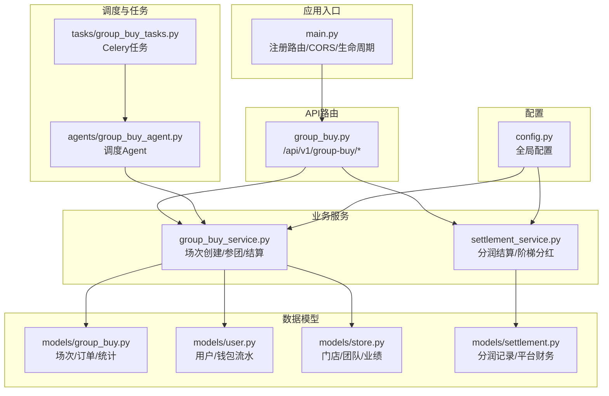
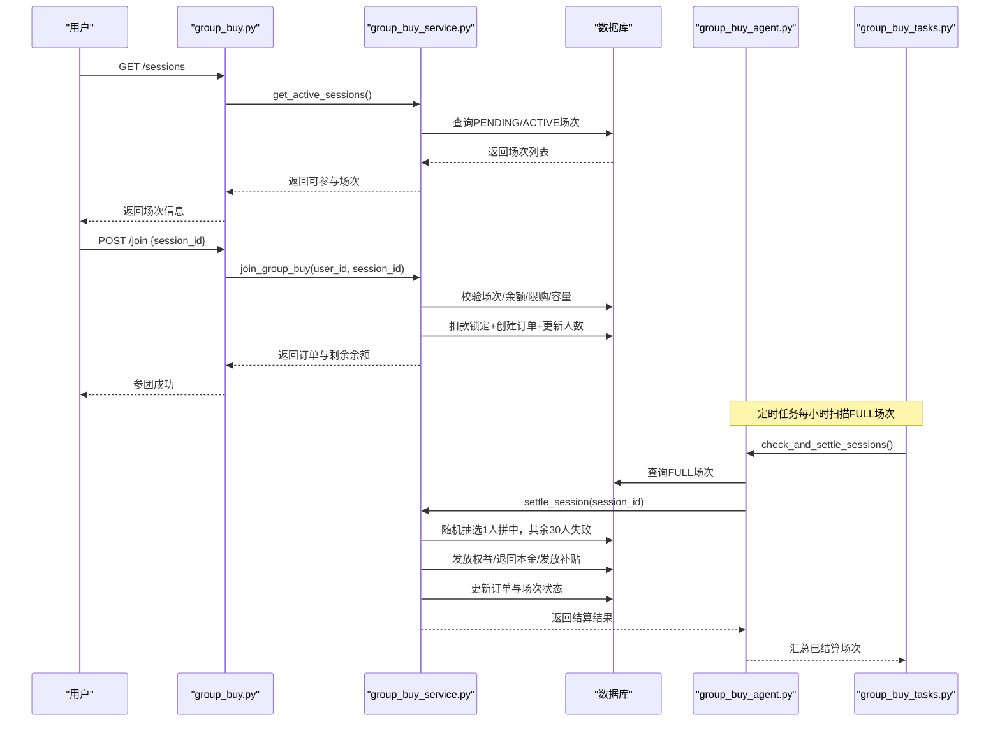
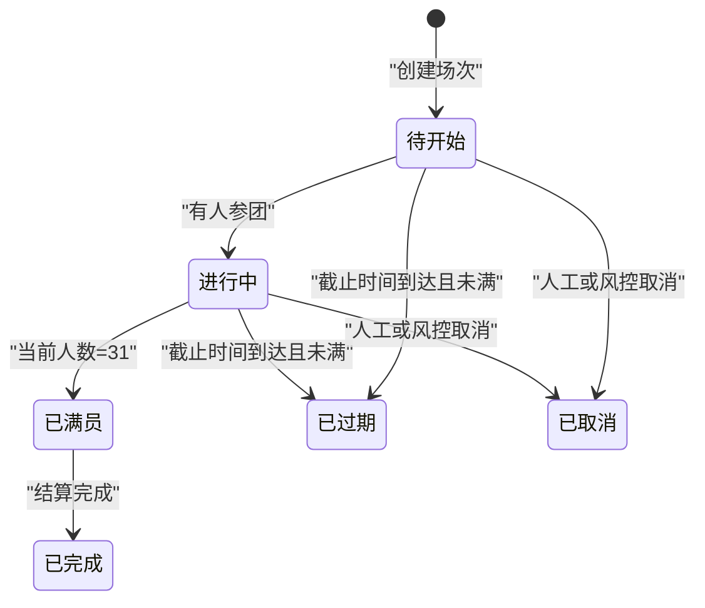
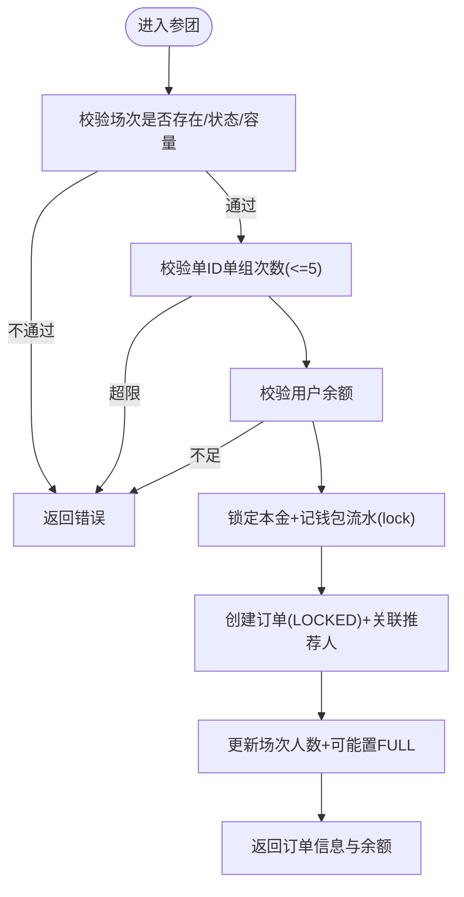
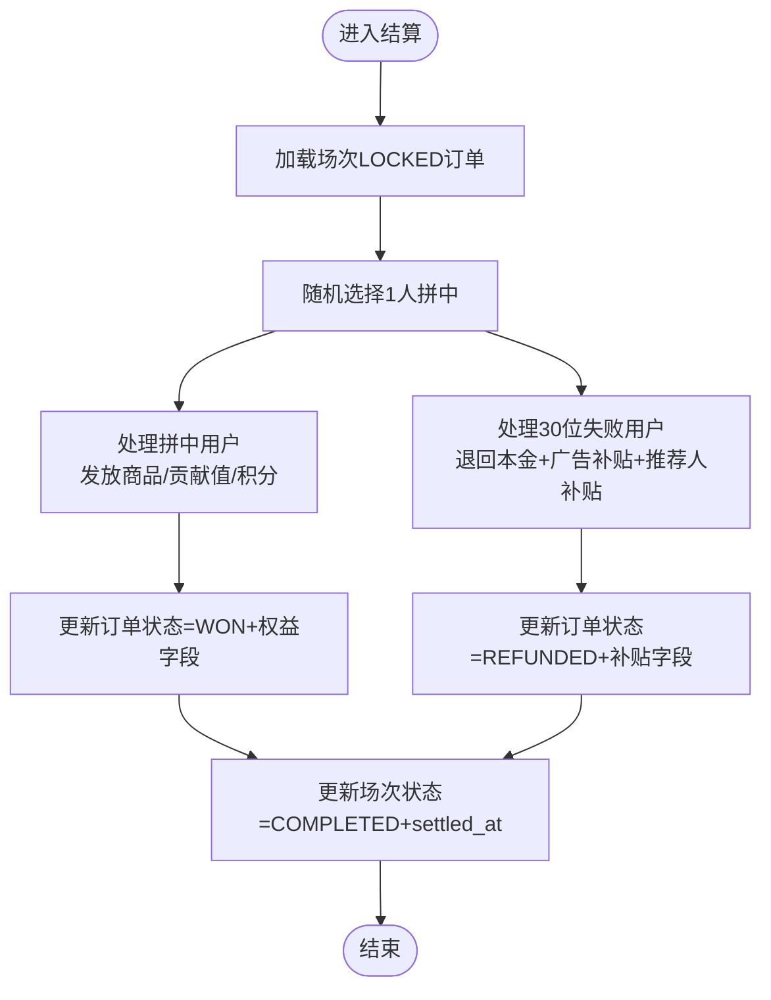
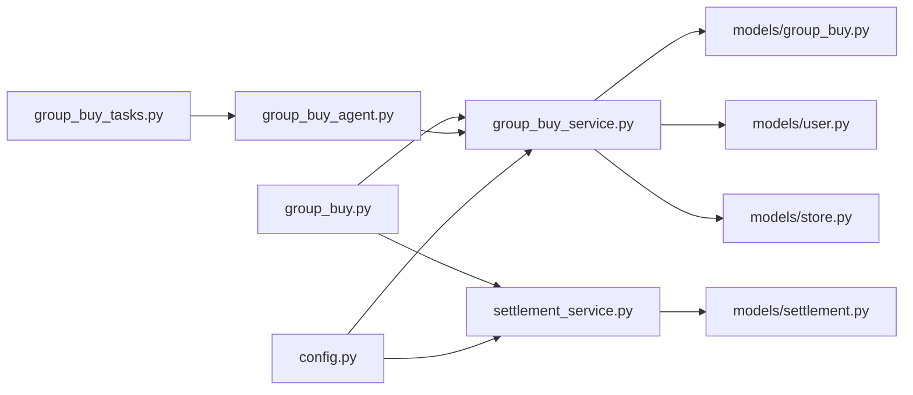

# 拼团电商系统

<cite>
**本文引用的文件**   
- [backend/app/main.py](file://backend/app/main.py)
- [backend/app/config.py](file://backend/app/config.py)
- [backend/app/models/group_buy.py](file://backend/app/models/group_buy.py)
- [backend/app/models/user.py](file://backend/app/models/user.py)
- [backend/app/models/store.py](file://backend/app/models/store.py)
- [backend/app/models/settlement.py](file://backend/app/models/settlement.py)
- [backend/app/services/group_buy_service.py](file://backend/app/services/group_buy_service.py)
- [backend/app/services/settlement_service.py](file://backend/app/services/settlement_service.py)
- [backend/app/agents/group_buy_agent.py](file://backend/app/agents/group_buy_agent.py)
- [backend/app/tasks/group_buy_tasks.py](file://backend/app/tasks/group_buy_tasks.py)
- [backend/app/api/v1/group_buy.py](file://backend/app/api/v1/group_buy.py)
- [backend/app/schemas/main.py](file://backend/app/schemas/main.py)
</cite>

## 目录
1. [引言](#引言)
2. [项目结构](#项目结构)
3. [核心组件](#核心组件)
4. [架构总览](#架构总览)
5. [详细组件分析](#详细组件分析)
6. [依赖关系分析](#依赖关系分析)
7. [性能与扩展性](#性能与扩展性)
8. [故障排查指南](#故障排查指南)
9. [结论](#结论)
10. [附录：API接口文档](#附录api接口文档)

## 引言
本文件面向AIxingmu拼团电商系统的产品、研发与运营人员，系统性阐述“1人拼中、30人失败”的商业模式与经济学原理，并给出场次管理、参团流程、结果判定算法、权益发放与补贴计算、状态流转与自动结算触发机制等实现细节。同时覆盖三大板块（初级/高级/SVIP）的价格配置与权益分配规则，以及门店自定义开团与平台固定场次的差异。文末提供完整的拼团API接口说明与最佳实践示例路径。

## 项目结构
后端采用FastAPI分层架构：路由层→服务层→数据模型层；定时任务通过Celery调度Agent执行批量操作；配置集中管理业务参数。前端包含移动端与管理后台，用于展示场次、参与拼团、查看订单与结果。

图表来源
- [backend/app/main.py:1-59](file://backend/app/main.py#L1-L59)
- [backend/app/api/v1/group_buy.py:1-65](file://backend/app/api/v1/group_buy.py#L1-L65)
- [backend/app/services/group_buy_service.py:1-348](file://backend/app/services/group_buy_service.py#L1-L348)
- [backend/app/services/settlement_service.py:1-166](file://backend/app/services/settlement_service.py#L1-L166)
- [backend/app/models/group_buy.py:1-158](file://backend/app/models/group_buy.py#L1-L158)
- [backend/app/models/user.py:1-93](file://backend/app/models/user.py#L1-L93)
- [backend/app/models/store.py:1-104](file://backend/app/models/store.py#L1-L104)
- [backend/app/models/settlement.py:1-123](file://backend/app/models/settlement.py#L1-L123)
- [backend/app/tasks/group_buy_tasks.py:1-54](file://backend/app/tasks/group_buy_tasks.py#L1-L54)
- [backend/app/agents/group_buy_agent.py:1-67](file://backend/app/agents/group_buy_agent.py#L1-L67)
- [backend/app/config.py:1-136](file://backend/app/config.py#L1-L136)

章节来源
- [backend/app/main.py:1-59](file://backend/app/main.py#L1-L59)
- [backend/app/config.py:1-136](file://backend/app/config.py#L1-L136)

## 核心组件
- 场次与订单模型：定义拼团级别、人数规则、状态机、订单字段及权益/补贴记录。
- 拼团服务：负责每日固定场次创建、门店自定义开团、用户参团校验与锁定、满员后随机抽选与结算、权益与补贴发放。
- 分润结算服务：按平台100%分配模型生成分润记录，支持门店月度阶梯分红。
- 调度Agent与任务：定时创建场次、检查已满场次并结算、处理过期场次。
- API路由：对外暴露查询场次、参团、查询订单、获取场次详情等接口。
- 配置中心：集中管理价格、倍数、比例、时间窗口等关键业务参数。

章节来源
- [backend/app/models/group_buy.py:1-158](file://backend/app/models/group_buy.py#L1-L158)
- [backend/app/services/group_buy_service.py:1-348](file://backend/app/services/group_buy_service.py#L1-L348)
- [backend/app/services/settlement_service.py:1-166](file://backend/app/services/settlement_service.py#L1-L166)
- [backend/app/agents/group_buy_agent.py:1-67](file://backend/app/agents/group_buy_agent.py#L1-L67)
- [backend/app/tasks/group_buy_tasks.py:1-54](file://backend/app/tasks/group_buy_tasks.py#L1-L54)
- [backend/app/api/v1/group_buy.py:1-65](file://backend/app/api/v1/group_buy.py#L1-L65)
- [backend/app/config.py:1-136](file://backend/app/config.py#L1-L136)

## 架构总览
系统围绕“场次驱动+事件结算”的架构展开：
- 定时任务在每日指定时间创建当日各时段、各级别的固定场次。
- 用户通过API参团，系统校验余额、限购与场次容量，锁定本金并创建订单。
- 当场次达到31人时，标记为已满，由调度Agent触发结算：随机抽取1名拼中者，其余30名为失败者。
- 结算过程中完成权益与补贴发放，更新订单与场次状态，并生成平台收支对账记录。

图表来源
- [backend/app/api/v1/group_buy.py:1-65](file://backend/app/api/v1/group_buy.py#L1-L65)
- [backend/app/services/group_buy_service.py:1-348](file://backend/app/services/group_buy_service.py#L1-L348)
- [backend/app/agents/group_buy_agent.py:1-67](file://backend/app/agents/group_buy_agent.py#L1-L67)
- [backend/app/tasks/group_buy_tasks.py:1-54](file://backend/app/tasks/group_buy_tasks.py#L1-L54)

## 详细组件分析

### 商业模式与经济学原理（1人拼中、30人失败）
- 资金池与分配模型
  - 每场31人，每人支付参团金额（三级不同），形成资金池。
  - 平台按100%分配模型进行收支平衡：代理支出、门店分账、推荐门店、拼中商品权益、拼中贡献值、拼中积分、拼失败广告补贴、拼失败推荐人补贴、平台利润合计为100%。
- 用户侧收益与风险
  - 拼中用户获得：商品权益（10%）、贡献值（20%）、增值积分（20%）。
  - 拼失败用户获得：本金全额退回、广告补贴（0.7%/人）、推荐人补贴（0.1%/人）。
- 平台侧激励与留存
  - 通过贡献值与积分体系引导消费与复购，结合线下四级分润与门店阶梯分红，构建生态闭环。
- 公平性与随机性
  - 每场仅1人拼中，采用随机选择保证概率均等；30人失败保障降低参与风险，提升参与意愿。

章节来源
- [backend/app/config.py:42-100](file://backend/app/config.py#L42-L100)
- [backend/app/models/group_buy.py:15-61](file://backend/app/models/group_buy.py#L15-L61)
- [backend/app/services/group_buy_service.py:183-321](file://backend/app/services/group_buy_service.py#L183-L321)
- [backend/app/models/settlement.py:1-123](file://backend/app/models/settlement.py#L1-L123)

### 三大板块价格配置与权益分配
- 板块与价格
  - 初级团：单箱倍数1，参团金额=288×1
  - 高级团：单箱倍数5，参团金额=288×5
  - SVIP团：单箱倍数40，参团金额=288×40
- 权益分配（基于参团金额）
  - 拼中用户：商品权益10%、贡献值20%、积分20%
  - 拼失败用户：广告补贴0.7%、推荐人补贴0.1%（合计每人0.8%，30人合计24%）
- 平台收支分配（100%）
  - 代理7%、门店8%、推荐门店1%、拼中商品10%、拼中贡献值20%、拼中积分20%、拼失败广告21%、拼失败推荐人3%、平台利润10%

章节来源
- [backend/app/config.py:42-100](file://backend/app/config.py#L42-L100)
- [backend/app/services/group_buy_service.py:20-25](file://backend/app/services/group_buy_service.py#L20-L25)
- [backend/app/services/group_buy_service.py:219-306](file://backend/app/services/group_buy_service.py#L219-L306)

### 场次管理机制
- 场次类型
  - 平台固定场次：每日10:00-22:00，每小时1场，初级/高级/SVIP三块并行，每场31人。
  - 门店自定义开团：线下门店可自主发起，遵循相同人数与规则，但时间与来源不同。
- 场次状态流转
  - 待开始（PENDING）→ 进行中（ACTIVE）→ 已满员（FULL）→ 已完成（COMPLETED）
  - 异常分支：已取消（CANCELLED）、已过期（EXPIRED）
- 自动结算触发
  - 当current_players达到total_players（31）时，状态置为FULL。
  - Celery任务每小时扫描FULL场次，调用Agent执行结算。
  - 每日23:00扫描未完成的PENDING/ACTIVE且已过截止时间的场次，置为EXPIRED。

图表来源
- [backend/app/models/group_buy.py:22-30](file://backend/app/models/group_buy.py#L22-L30)
- [backend/app/services/group_buy_service.py:164-172](file://backend/app/services/group_buy_service.py#L164-L172)
- [backend/app/agents/group_buy_agent.py:31-61](file://backend/app/agents/group_buy_agent.py#L31-L61)
- [backend/app/tasks/group_buy_tasks.py:30-53](file://backend/app/tasks/group_buy_tasks.py#L30-L53)

### 参团业务流程
- 前置校验
  - 场次存在且状态允许参与（PENDING/ACTIVE）
  - 场次未满（current_players < 31）
  - 用户在该场次未重复参团（单ID单组最多5单）
  - 用户余额充足（扣除参团本金）
- 锁定与下单
  - 扣减用户余额并记录钱包流水（lock）
  - 创建拼团订单（LOCKED），关联推荐人
  - 更新场次人数，若达到31则置为FULL
- 返回结果
  - 返回订单号、参团金额、剩余余额、是否已满

图表来源
- [backend/app/services/group_buy_service.py:92-181](file://backend/app/services/group_buy_service.py#L92-L181)
- [backend/app/models/user.py:74-93](file://backend/app/models/user.py#L74-L93)

### 结果判定算法与结算逻辑
- 判定算法
  - 从该场次所有LOCKED订单中随机选择1个作为拼中者，其余30个为失败者。
- 拼中用户权益发放
  - 商品权益：参团金额×10%（以消费券形式发放）
  - 贡献值权益：参团金额×20%
  - 积分权益：参团金额×20%
- 拼失败用户保障
  - 本金全额退回（unlock）
  - 广告补贴：参团金额×0.7%
  - 推荐人补贴：参团金额×0.1%
- 订单与场次更新
  - 拼中订单状态WON，记录各项权益
  - 失败订单状态REFUNDED，记录补贴金额
  - 场次状态COMPLETED，记录结算时间与拼中用户

图表来源
- [backend/app/services/group_buy_service.py:183-321](file://backend/app/services/group_buy_service.py#L183-L321)
- [backend/app/models/group_buy.py:89-132](file://backend/app/models/group_buy.py#L89-L132)

### 门店自定义开团与平台固定场次区别
- 平台固定场次
  - 由定时任务在每日10:00-22:00每小时创建，初级/高级/SVIP三块并行，is_custom=False。
- 门店自定义开团
  - 由门店主动发起，is_custom=True，store_id绑定，start_time由门店指定，end_time=start_time+1小时。
- 共同点
  - 统一遵循31人成团、1人拼中、30人失败的规则与权益/补贴分配。

章节来源
- [backend/app/services/group_buy_service.py:27-90](file://backend/app/services/group_buy_service.py#L27-L90)
- [backend/app/models/group_buy.py:42-86](file://backend/app/models/group_buy.py#L42-L86)

### 分润结算与平台财务对账
- 分润记录
  - 每笔交易产生分润时，按角色分别记录（代理、门店、推荐门店、平台等）。
- 平台每日财务汇总
  - 记录总收入、总支出与平台利润，确保收支平衡校验为0。
- 门店月度阶梯分红
  - 根据当月新增业绩落入阶梯区间，按比例计算分红金额并排名。

章节来源
- [backend/app/models/settlement.py:1-123](file://backend/app/models/settlement.py#L1-L123)
- [backend/app/services/settlement_service.py:1-166](file://backend/app/services/settlement_service.py#L1-L166)

## 依赖关系分析
- 模块耦合
  - API路由依赖服务层；服务层依赖数据模型与配置；Agent与任务依赖服务层与数据库会话。
- 外部依赖
  - FastAPI、SQLAlchemy异步引擎、Celery任务队列、Redis消息中间件。
- 潜在循环依赖
  - 当前结构清晰，未见直接循环导入；Agent与Task通过服务层间接交互。

图表来源
- [backend/app/api/v1/group_buy.py:1-65](file://backend/app/api/v1/group_buy.py#L1-L65)
- [backend/app/services/group_buy_service.py:1-348](file://backend/app/services/group_buy_service.py#L1-L348)
- [backend/app/services/settlement_service.py:1-166](file://backend/app/services/settlement_service.py#L1-L166)
- [backend/app/models/group_buy.py:1-158](file://backend/app/models/group_buy.py#L1-L158)
- [backend/app/models/user.py:1-93](file://backend/app/models/user.py#L1-L93)
- [backend/app/models/store.py:1-104](file://backend/app/models/store.py#L1-L104)
- [backend/app/models/settlement.py:1-123](file://backend/app/models/settlement.py#L1-L123)
- [backend/app/tasks/group_buy_tasks.py:1-54](file://backend/app/tasks/group_buy_tasks.py#L1-L54)
- [backend/app/agents/group_buy_agent.py:1-67](file://backend/app/agents/group_buy_agent.py#L1-L67)
- [backend/app/config.py:1-136](file://backend/app/config.py#L1-L136)

## 性能与扩展性
- 并发与锁
  - 参团需防止超卖与重复参团，建议在高并发场景引入分布式锁或数据库唯一约束（如user_id+session_id去重）。
- 事务与一致性
  - 结算涉及多表更新，应使用事务包裹，确保订单、用户资产、场次状态原子性变更。
- 批处理优化
  - 结算时批量更新订单与用户资产，减少往返IO；分页查询订单与统计聚合加索引。
- 可扩展性
  - 将Agent与任务解耦，支持水平扩展；配置项集中便于灰度调整比例与规则。

[本节为通用指导，无需源码引用]

## 故障排查指南
- 常见错误
  - 场次不存在或状态不允许参与：检查场次ID与状态是否为PENDING/ACTIVE。
  - 场次已满员：确认current_players是否已达31。
  - 单ID单组次数超限：确认是否超过5单限制。
  - 余额不足：检查用户balance是否足够。
  - 结算失败：核对FULL场次订单数量是否等于total_players。
- 日志与追踪
  - 钱包流水表记录每次资产变动，便于定位问题。
  - Agent与任务执行结果可输出到日志系统，便于监控。

章节来源
- [backend/app/services/group_buy_service.py:92-181](file://backend/app/services/group_buy_service.py#L92-L181)
- [backend/app/services/group_buy_service.py:183-321](file://backend/app/services/group_buy_service.py#L183-L321)
- [backend/app/models/user.py:74-93](file://backend/app/models/user.py#L74-L93)

## 结论
AIxingmu拼团系统以“1人拼中、30人失败”为核心机制，通过严格的场次管理与自动化结算，实现了高透明度的权益与补贴发放。平台100%分配模型保障了生态内各方利益均衡，配合贡献值与积分体系促进长期活跃与复购。建议在上线前完善并发控制、事务一致性与监控告警，确保系统稳定运行。

[本节为总结，无需源码引用]

## 附录：API接口文档

### 基础信息
- 基础路径：/api/v1
- 认证方式：JWT（通过get_current_user_id依赖注入）
- 内容类型：application/json

### 接口列表
- 获取可参与场次
  - 方法：GET
  - 路径：/api/v1/group-buy/sessions
  - 查询参数：level（可选，junior/senior/svip）
  - 响应：{ items: [场次对象] }
  - 参考实现路径：[backend/app/api/v1/group_buy.py:15-23](file://backend/app/api/v1/group_buy.py#L15-L23)

- 参与拼团
  - 方法：POST
  - 路径：/api/v1/group-buy/join
  - 请求体：JoinGroupBuyRequest { session_id: int }
  - 响应：{ code: 0, message: "参团成功", data: { order_id, order_no, session_id, amount, remaining_balance, session_full } }
  - 参考实现路径：[backend/app/api/v1/group_buy.py:26-37](file://backend/app/api/v1/group_buy.py#L26-L37)

- 查询我的拼团订单
  - 方法：GET
  - 路径：/api/v1/group-buy/orders
  - 查询参数：page(int), size(int)
  - 响应：{ total, page, size, items: [订单对象] }
  - 参考实现路径：[backend/app/api/v1/group_buy.py:40-49](file://backend/app/api/v1/group_buy.py#L40-L49)

- 获取场次详情
  - 方法：GET
  - 路径：/api/v1/group-buy/sessions/{session_id}
  - 响应：场次对象
  - 参考实现路径：[backend/app/api/v1/group_buy.py:52-64](file://backend/app/api/v1/group_buy.py#L52-L64)

### 请求/响应模型
- JoinGroupBuyRequest
  - 字段：session_id (int)
  - 参考路径：[backend/app/schemas/main.py:73-75](file://backend/app/schemas/main.py#L73-L75)
- GroupBuySessionInfo
  - 字段：id, session_no, level, total_price, total_players, current_players, status, start_time, end_time
  - 参考路径：[backend/app/schemas/main.py:76-88](file://backend/app/schemas/main.py#L76-L88)
- GroupBuyOrderInfo
  - 字段：id, order_no, session_id, amount, status, result, product_benefit, contrib_benefit, points_benefit, ad_subsidy, referral_subsidy, created_at
  - 参考路径：[backend/app/schemas/main.py:90-105](file://backend/app/schemas/main.py#L90-L105)

### 使用示例与最佳实践
- 获取可参与场次
  - 示例：GET /api/v1/group-buy/sessions?level=junior
  - 最佳实践：前端缓存可用场次，避免频繁请求；按时间段过滤显示。
  - 参考路径：[backend/app/api/v1/group_buy.py:15-23](file://backend/app/api/v1/group_buy.py#L15-L23)

- 参与拼团
  - 示例：POST /api/v1/group-buy/join { "session_id": 123 }
  - 最佳实践：提交前再次校验余额与场次容量；幂等处理防止重复提交。
  - 参考路径：[backend/app/api/v1/group_buy.py:26-37](file://backend/app/api/v1/group_buy.py#L26-L37)

- 查询订单与结果
  - 示例：GET /api/v1/group-buy/orders?page=1&size=20
  - 最佳实践：分页加载；根据status与result展示拼中/失败状态与权益/补贴明细。
  - 参考路径：[backend/app/api/v1/group_buy.py:40-49](file://backend/app/api/v1/group_buy.py#L40-L49)

- 查看场次详情
  - 示例：GET /api/v1/group-buy/sessions/123
  - 最佳实践：展示进度条（当前人数/总人数）、倒计时、规则说明。
  - 参考路径：[backend/app/api/v1/group_buy.py:52-64](file://backend/app/api/v1/group_buy.py#L52-L64)

章节来源
- [backend/app/api/v1/group_buy.py:1-65](file://backend/app/api/v1/group_buy.py#L1-L65)
- [backend/app/schemas/main.py:73-105](file://backend/app/schemas/main.py#L73-L105)