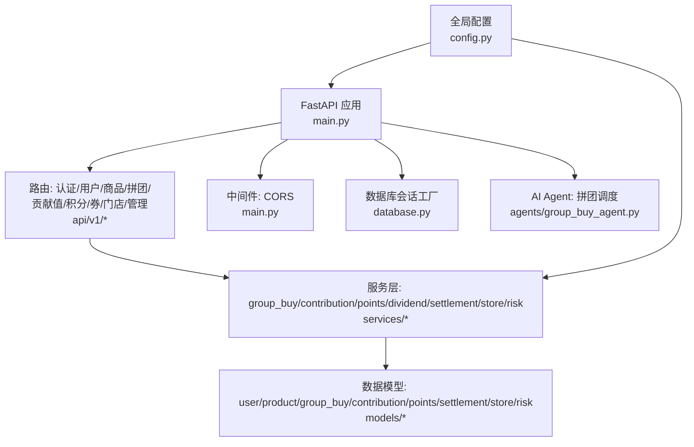
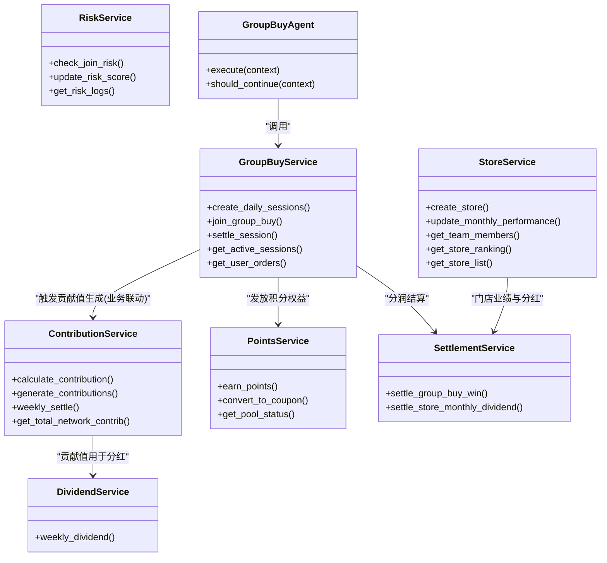
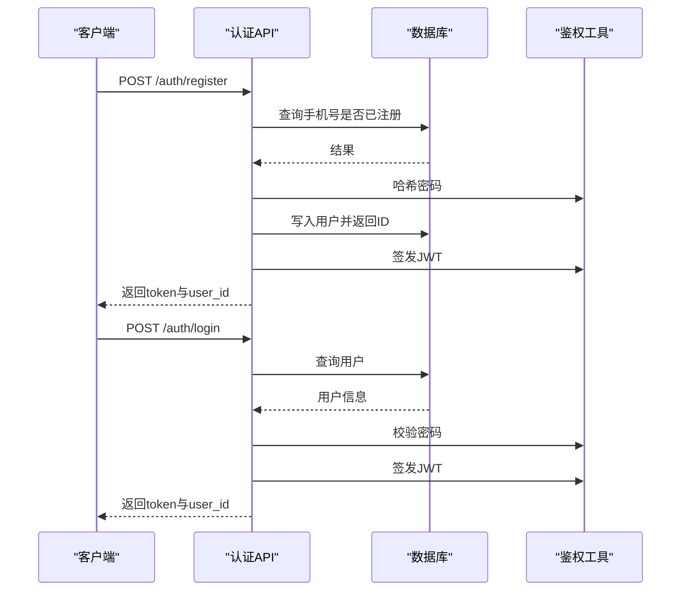
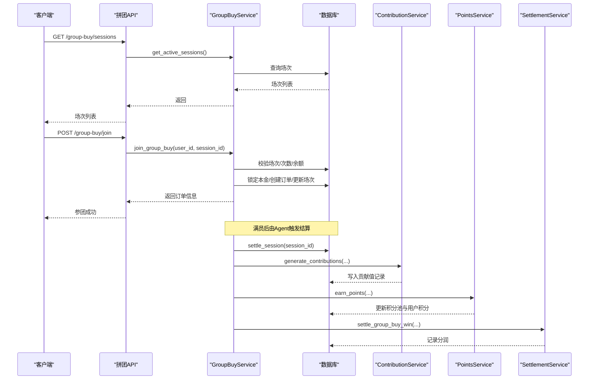
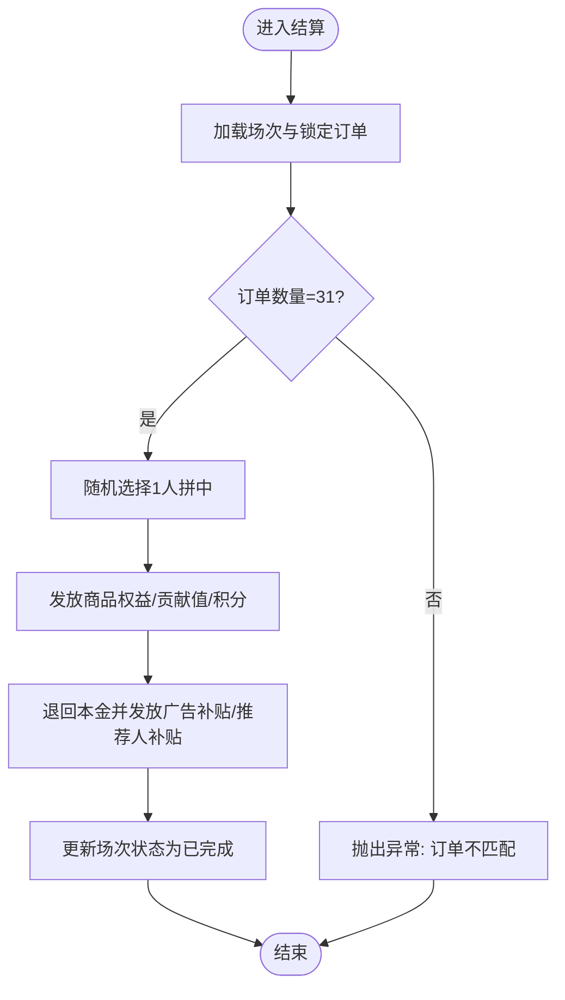
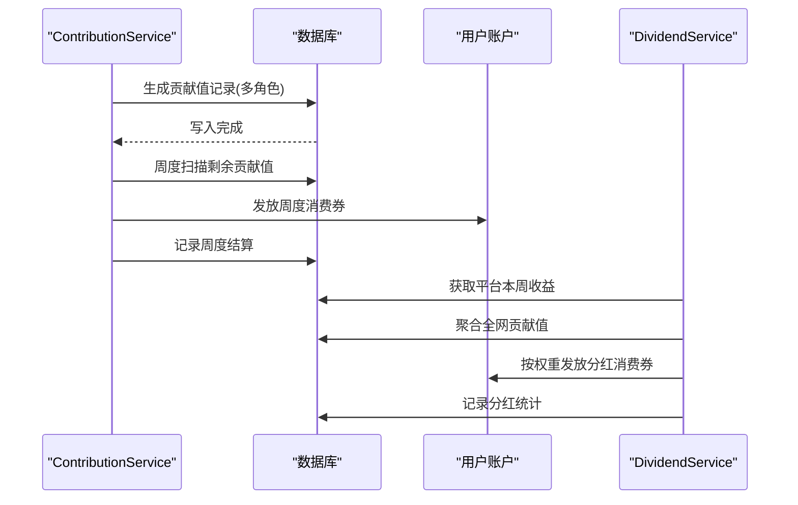
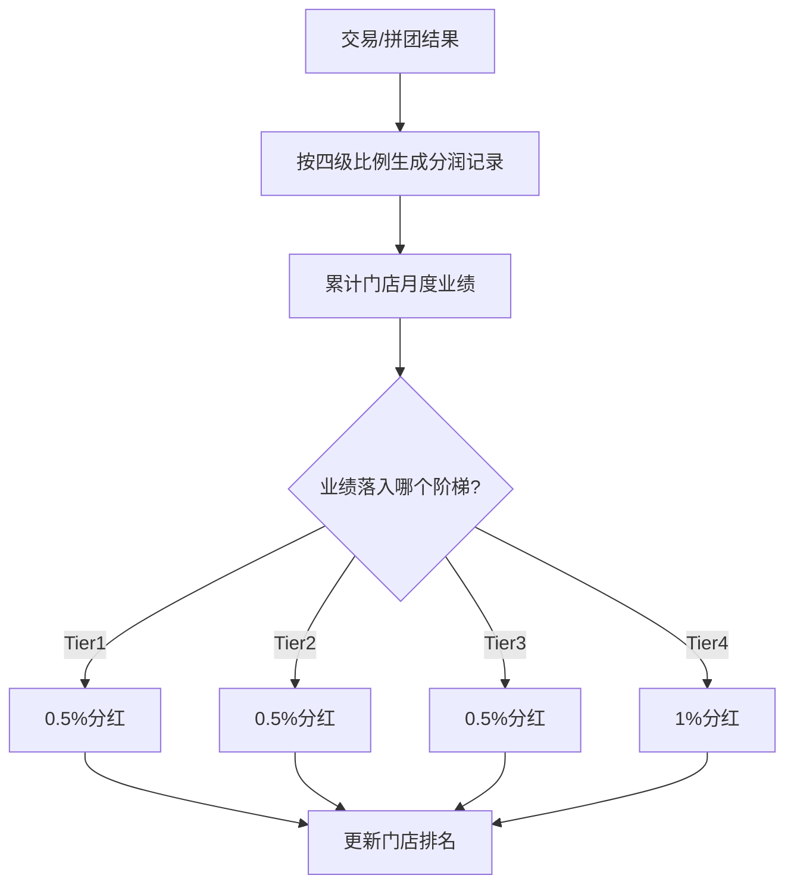
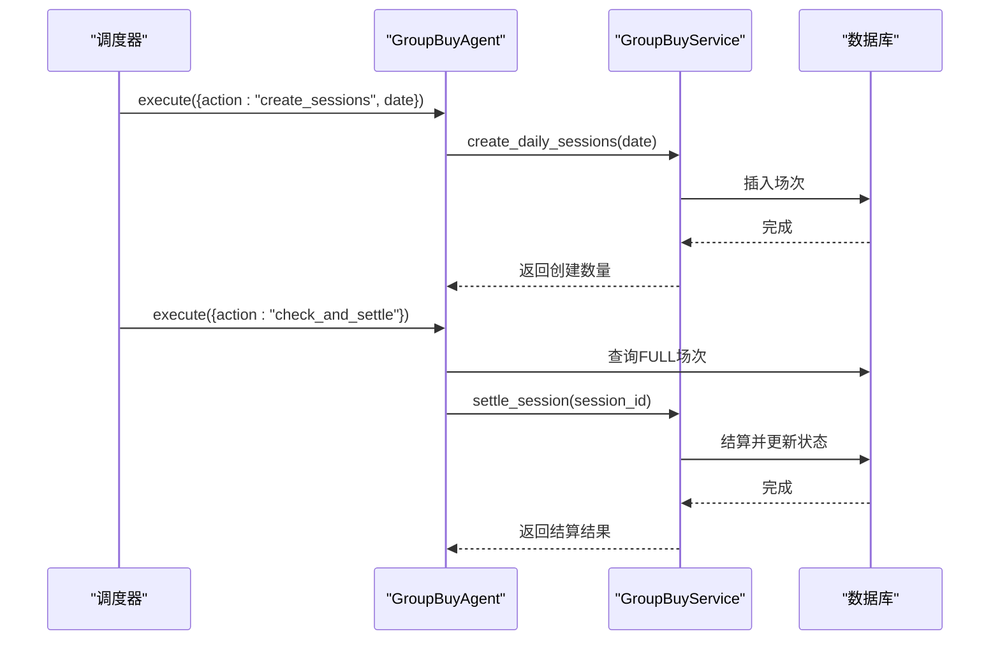
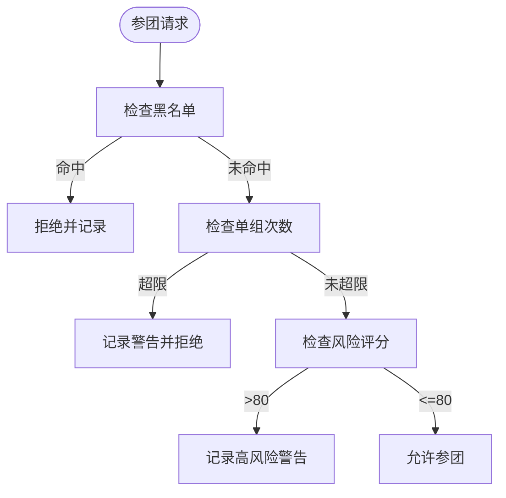
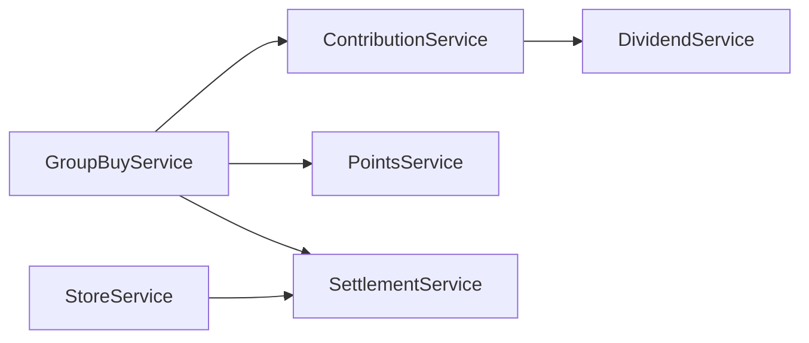

# 核心功能模块

<cite>
**本文引用的文件**   
- [backend/app/main.py](file://backend/app/main.py)
- [backend/app/config.py](file://backend/app/config.py)
- [backend/app/database.py](file://backend/app/database.py)
- [backend/app/models/__init__.py](file://backend/app/models/__init__.py)
- [backend/app/api/v1/auth.py](file://backend/app/api/v1/auth.py)
- [backend/app/api/v1/group_buy.py](file://backend/app/api/v1/group_buy.py)
- [backend/app/api/v1/contribution.py](file://backend/app/api/v1/contribution.py)
- [backend/app/api/v1/points.py](file://backend/app/api/v1/points.py)
- [backend/app/services/group_buy_service.py](file://backend/app/services/group_buy_service.py)
- [backend/app/services/contribution_service.py](file://backend/app/services/contribution_service.py)
- [backend/app/services/points_service.py](file://backend/app/services/points_service.py)
- [backend/app/services/dividend_service.py](file://backend/app/services/dividend_service.py)
- [backend/app/services/settlement_service.py](file://backend/app/services/settlement_service.py)
- [backend/app/services/store_service.py](file://backend/app/services/store_service.py)
- [backend/app/services/risk_service.py](file://backend/app/services/risk_service.py)
- [backend/app/agents/group_buy_agent.py](file://backend/app/agents/group_buy_agent.py)
</cite>

## 目录
1. [引言](#引言)
2. [项目结构](#项目结构)
3. [核心组件](#核心组件)
4. [架构总览](#架构总览)
5. [详细组件分析](#详细组件分析)
6. [依赖关系分析](#依赖关系分析)
7. [性能与扩展性](#性能与扩展性)
8. [故障排查指南](#故障排查指南)
9. [结论](#结论)
10. [附录：配置项与扩展点](#附录配置项与扩展点)

## 引言
本文件面向开发者，系统性梳理 AIxingmu 平台的六大核心业务模块：用户认证系统、拼团电商系统、贡献值经济系统、多层级分销体系、AI智能系统、风控安全系统。文档覆盖各模块的业务规则、实现逻辑与技术架构，阐明模块间依赖与数据流转（如拼团结果如何触发贡献值计算、贡献值分红如何影响门店收益等），并提供关键流程的时序图与状态转换图、配置选项、扩展点与自定义方法，以及性能考虑与最佳实践，帮助快速理解与二次开发。

## 项目结构
后端采用 FastAPI + SQLAlchemy 异步 ORM，服务层按领域拆分，模型集中导出，Agent 负责定时调度任务。入口应用注册路由、CORS、生命周期管理；配置中心统一承载业务参数（拼团倍数、贡献值比例、积分池策略、门店阶梯分红等）。

图示来源
- [backend/app/main.py:1-59](file://backend/app/main.py#L1-L59)
- [backend/app/config.py:1-136](file://backend/app/config.py#L1-L136)
- [backend/app/database.py:1-40](file://backend/app/database.py#L1-L40)
- [backend/app/agents/group_buy_agent.py:1-67](file://backend/app/agents/group_buy_agent.py#L1-L67)

章节来源
- [backend/app/main.py:1-59](file://backend/app/main.py#L1-L59)
- [backend/app/config.py:1-136](file://backend/app/config.py#L1-L136)
- [backend/app/database.py:1-40](file://backend/app/database.py#L1-L40)
- [backend/app/models/__init__.py:1-37](file://backend/app/models/__init__.py#L1-L37)

## 核心组件
- 用户认证系统：提供注册/登录，基于手机号+密码，签发JWT令牌，支持后续接口鉴权。
- 拼团电商系统：每日固定场次（初级/高级/SVIP）并行开团，满员自动结算，随机抽中1人，其余退回本金并发放补贴权益。
- 贡献值经济系统：全网统一公式将让利金额按比例分配至消费者、商家、推荐方、代理、平台六角色，形成贡献值记录并参与周度递减兑换与分红。
- 多层级分销体系：线下四级分润（省/市/区县/门店）及推荐门店分润；门店月度业绩阶梯分红。
- AI智能系统：以Agent形式编排拼团调度（创建场次、检查满员、结算、过期处理），为后续扩展更多AI能力预留框架。
- 风控安全系统：参团前风控校验（黑名单、单组限购、异常频率）、风险评分与日志审计。

章节来源
- [backend/app/api/v1/auth.py:1-43](file://backend/app/api/v1/auth.py#L1-L43)
- [backend/app/api/v1/group_buy.py:1-65](file://backend/app/api/v1/group_buy.py#L1-L65)
- [backend/app/api/v1/contribution.py:1-27](file://backend/app/api/v1/contribution.py#L1-L27)
- [backend/app/api/v1/points.py:1-31](file://backend/app/api/v1/points.py#L1-L31)
- [backend/app/services/group_buy_service.py:1-348](file://backend/app/services/group_buy_service.py#L1-L348)
- [backend/app/services/contribution_service.py:1-261](file://backend/app/services/contribution_service.py#L1-L261)
- [backend/app/services/points_service.py:1-180](file://backend/app/services/points_service.py#L1-L180)
- [backend/app/services/dividend_service.py:1-136](file://backend/app/services/dividend_service.py#L1-L136)
- [backend/app/services/settlement_service.py:1-166](file://backend/app/services/settlement_service.py#L1-L166)
- [backend/app/services/store_service.py:1-161](file://backend/app/services/store_service.py#L1-L161)
- [backend/app/services/risk_service.py:1-135](file://backend/app/services/risk_service.py#L1-L135)
- [backend/app/agents/group_buy_agent.py:1-67](file://backend/app/agents/group_buy_agent.py#L1-L67)

## 架构总览
整体分层清晰：API 层暴露REST接口，服务层封装业务规则，模型层定义持久化结构，Agent 驱动周期性任务，配置中心统一管理业务常量。

图示来源
- [backend/app/services/group_buy_service.py:1-348](file://backend/app/services/group_buy_service.py#L1-L348)
- [backend/app/services/contribution_service.py:1-261](file://backend/app/services/contribution_service.py#L1-L261)
- [backend/app/services/points_service.py:1-180](file://backend/app/services/points_service.py#L1-L180)
- [backend/app/services/dividend_service.py:1-136](file://backend/app/services/dividend_service.py#L1-L136)
- [backend/app/services/settlement_service.py:1-166](file://backend/app/services/settlement_service.py#L1-L166)
- [backend/app/services/store_service.py:1-161](file://backend/app/services/store_service.py#L1-L161)
- [backend/app/agents/group_buy_agent.py:1-67](file://backend/app/agents/group_buy_agent.py#L1-L67)

## 详细组件分析

### 用户认证系统
- 业务规则
  - 注册：手机号唯一，支持昵称与推荐人ID；返回JWT与用户ID。
  - 登录：校验手机号与密码，返回JWT与用户ID。
- 实现要点
  - 使用哈希密码存储与验证；JWT签发包含用户标识。
  - 通过依赖注入获取数据库会话，保证事务一致性。
- 扩展建议
  - 增加多端登录态管理、刷新令牌机制、短信验证码登录。
  - 接入第三方身份源（微信/支付宝）时，可新增映射表与统一用户实体。

图示来源
- [backend/app/api/v1/auth.py:1-43](file://backend/app/api/v1/auth.py#L1-L43)

章节来源
- [backend/app/api/v1/auth.py:1-43](file://backend/app/api/v1/auth.py#L1-L43)

### 拼团电商系统
- 业务规则
  - 每日10:00-22:00每小时开3个板块（初级/高级/SVIP），每场31人，1人拼中，30人失败。
  - 参团限制：单ID单组最多5单；余额需足够锁定本金。
  - 结算：随机抽取1人拼中，获得商品权益、贡献值、积分；其余退回本金并发放广告补贴与推荐人补贴。
- 实现要点
  - 场次创建：根据配置生成固定场次或门店自定义场次。
  - 参团流程：校验场次状态、人数上限、用户次数与余额，锁定本金并创建订单。
  - 结算流程：读取锁定订单，判定胜负，更新用户资产与流水，更新场次状态。
- 数据流转
  - 参团→锁定本金→创建订单→满员→结算→权益发放→贡献值生成（联动）→积分发放→分润记录。

图示来源
- [backend/app/api/v1/group_buy.py:1-65](file://backend/app/api/v1/group_buy.py#L1-L65)
- [backend/app/services/group_buy_service.py:1-348](file://backend/app/services/group_buy_service.py#L1-L348)
- [backend/app/services/contribution_service.py:1-261](file://backend/app/services/contribution_service.py#L1-L261)
- [backend/app/services/points_service.py:1-180](file://backend/app/services/points_service.py#L1-L180)
- [backend/app/services/settlement_service.py:1-166](file://backend/app/services/settlement_service.py#L1-L166)
- [backend/app/agents/group_buy_agent.py:1-67](file://backend/app/agents/group_buy_agent.py#L1-L67)

图示来源
- [backend/app/services/group_buy_service.py:183-321](file://backend/app/services/group_buy_service.py#L183-L321)

章节来源
- [backend/app/api/v1/group_buy.py:1-65](file://backend/app/api/v1/group_buy.py#L1-L65)
- [backend/app/services/group_buy_service.py:1-348](file://backend/app/services/group_buy_service.py#L1-L348)
- [backend/app/agents/group_buy_agent.py:1-67](file://backend/app/agents/group_buy_agent.py#L1-L67)

### 贡献值经济系统
- 业务规则
  - 统一公式：贡献值 = 让利金额 × 分配比例 × 乘数；让利金额 = 消费金额 × 20%。
  - 六角色分配：消费者50%、合作商家20%、推荐商家8%、推荐消费者5%、代理合计7%、平台10%。
  - 周度递减兑换：当周消费券 = 有效贡献值 × 日利率 × 7；贡献值不扣减，继续参与下期。
  - 周度分红：个人消费券分红 = 个人贡献值 / 全网总贡献值 × 平台20%收益池。
- 实现要点
  - 生成贡献值：按交易场景（线上零售/拼团成功/线下消费）传入基础金额与相关主体，批量写入记录。
  - 周度结算：汇总用户剩余贡献值，计算周度消费券并发放；记录统计。
  - 分红结算：聚合全网贡献值，计算平台收益池并按比例发放消费券。
- 数据流转
  - 交易/拼团结果 → 贡献值记录 → 周度递减兑换 → 周度分红 → 消费券余额增长。

图示来源
- [backend/app/services/contribution_service.py:1-261](file://backend/app/services/contribution_service.py#L1-L261)
- [backend/app/services/dividend_service.py:1-136](file://backend/app/services/dividend_service.py#L1-L136)

章节来源
- [backend/app/api/v1/contribution.py:1-27](file://backend/app/api/v1/contribution.py#L1-L27)
- [backend/app/services/contribution_service.py:1-261](file://backend/app/services/contribution_service.py#L1-L261)
- [backend/app/services/dividend_service.py:1-136](file://backend/app/services/dividend_service.py#L1-L136)

### 多层级分销体系
- 业务规则
  - 线下四级分润：省级1%、市级2%、区县4%、门店8%、推荐门店1%。
  - 门店月度阶梯分红：按新业绩区间确定等级与比例（0.5%/0.5%/0.5%/1%）。
- 实现要点
  - 分润结算：依据交易金额与配置比例，生成分润记录并关联场次/订单。
  - 门店排名与分红：按月聚合业绩，计算等级与分红金额，更新排名。
- 数据流转
  - 交易/拼团结果 → 分润记录 → 门店月度业绩 → 阶梯分红 → 门店收益。

图示来源
- [backend/app/services/settlement_service.py:1-166](file://backend/app/services/settlement_service.py#L1-L166)
- [backend/app/services/store_service.py:1-161](file://backend/app/services/store_service.py#L1-L161)

章节来源
- [backend/app/services/settlement_service.py:1-166](file://backend/app/services/settlement_service.py#L1-L166)
- [backend/app/services/store_service.py:1-161](file://backend/app/services/store_service.py#L1-L161)

### AI智能系统
- 业务规则
  - 拼团调度Agent：定时创建场次、检查满员并结算、处理过期场次。
- 实现要点
  - 基于BaseAgent抽象，执行上下文携带数据库会话与动作类型。
  - 与GroupBuyService协作，完成开团、结算、过期清理。
- 扩展建议
  - 引入更多Agent（如风控Agent、营销Agent），统一调度器编排。
  - 结合外部LLM进行动态定价、智能选品、个性化推荐。

图示来源
- [backend/app/agents/group_buy_agent.py:1-67](file://backend/app/agents/group_buy_agent.py#L1-L67)
- [backend/app/services/group_buy_service.py:1-348](file://backend/app/services/group_buy_service.py#L1-L348)

章节来源
- [backend/app/agents/group_buy_agent.py:1-67](file://backend/app/agents/group_buy_agent.py#L1-L67)

### 风控安全系统
- 业务规则
  - 参团风控：黑名单拦截、单组限购、高风险警告。
  - 风险评分：事件累积加分，超过阈值加入黑名单。
- 实现要点
  - 在参团前调用check_join_risk，记录风控日志与风险级别。
  - 提供风险日志分页查询，便于审计与运营干预。
- 扩展建议
  - 接入行为序列模型、设备指纹、IP画像，提升异常检测精度。
  - 建立自动化处置流水线（限流、冻结、人工复核）。

图示来源
- [backend/app/services/risk_service.py:1-135](file://backend/app/services/risk_service.py#L1-L135)

章节来源
- [backend/app/services/risk_service.py:1-135](file://backend/app/services/risk_service.py#L1-L135)

## 依赖关系分析
- 模块耦合
  - 拼团服务强依赖贡献值与积分服务（权益发放），并与分润服务协同。
  - 贡献值服务与分红服务存在数据联动（全网贡献值与平台收益池）。
  - 门店服务与分润服务共同维护门店业绩与分红。
- 外部依赖
  - 数据库：PostgreSQL（异步连接池）。
  - 缓存/消息队列：Redis、RabbitMQ（Celery配置预留）。
  - 对象存储：MinIO（配置项预留）。
- 潜在循环依赖
  - 当前服务层无直接循环导入；若新增跨服务调用，建议使用事件总线或消息队列解耦。

图示来源
- [backend/app/services/group_buy_service.py:1-348](file://backend/app/services/group_buy_service.py#L1-L348)
- [backend/app/services/contribution_service.py:1-261](file://backend/app/services/contribution_service.py#L1-L261)
- [backend/app/services/points_service.py:1-180](file://backend/app/services/points_service.py#L1-L180)
- [backend/app/services/dividend_service.py:1-136](file://backend/app/services/dividend_service.py#L1-L136)
- [backend/app/services/settlement_service.py:1-166](file://backend/app/services/settlement_service.py#L1-L166)
- [backend/app/services/store_service.py:1-161](file://backend/app/services/store_service.py#L1-L161)

章节来源
- [backend/app/services/group_buy_service.py:1-348](file://backend/app/services/group_buy_service.py#L1-L348)
- [backend/app/services/contribution_service.py:1-261](file://backend/app/services/contribution_service.py#L1-L261)
- [backend/app/services/points_service.py:1-180](file://backend/app/services/points_service.py#L1-L180)
- [backend/app/services/dividend_service.py:1-136](file://backend/app/services/dividend_service.py#L1-L136)
- [backend/app/services/settlement_service.py:1-166](file://backend/app/services/settlement_service.py#L1-L166)
- [backend/app/services/store_service.py:1-161](file://backend/app/services/store_service.py#L1-L161)

## 性能与扩展性
- 数据库连接池
  - 使用异步引擎与连接池，合理设置pool_size与max_overflow，避免高并发下连接耗尽。
- 事务与锁
  - 参团锁定本金与订单创建在同一事务内，确保一致性；结算阶段批量更新，注意长事务风险。
- 并发与幂等
  - 参团接口应支持幂等键（如order_no），防止重复提交；结算任务具备重试与去重机制。
- 索引与查询优化
  - 对session_id、user_id、status等高频过滤字段建立索引；分页查询使用offset/limit。
- 异步与任务队列
  - 利用Celery异步执行贡献值生成、分红结算、门店排名等耗时任务，降低主线程阻塞。
- 可扩展点
  - 配置中心集中管理业务参数，便于灰度与A/B测试。
  - Agent框架支持新增调度任务，无需修改核心API。

[本节为通用指导，不直接分析具体文件]

## 故障排查指南
- 常见错误
  - 场次不存在/已满员/状态异常：检查场次状态机与时间窗口。
  - 余额不足：确认充值与钱包流水是否正确。
  - 单组次数超限：核对风控规则与历史订单计数。
  - 贡献值/分红计算异常：核查全网贡献值与平台收益池数据完整性。
- 定位步骤
  - 查看钱包流水（asset_type、change_type、amount）追踪资金变动。
  - 查看风控日志（risk_level、action、description）判断拦截原因。
  - 查看分润记录（recipient_type、ratio、amount）核对分配比例。
- 恢复建议
  - 对异常场次进行回滚或补偿（解锁本金、修正订单状态）。
  - 对缺失的贡献值记录进行补算与回放。
  - 对风控误判进行白名单放行与评分重置。

章节来源
- [backend/app/services/group_buy_service.py:1-348](file://backend/app/services/group_buy_service.py#L1-L348)
- [backend/app/services/contribution_service.py:1-261](file://backend/app/services/contribution_service.py#L1-L261)
- [backend/app/services/dividend_service.py:1-136](file://backend/app/services/dividend_service.py#L1-L136)
- [backend/app/services/risk_service.py:1-135](file://backend/app/services/risk_service.py#L1-L135)

## 结论
AIxingmu平台围绕“拼团电商+贡献值经济+多级分销”的核心闭环，结合AI调度与风控保障，构建了高一致性与高扩展性的业务架构。通过配置化参数与模块化服务，平台可在不同区域与渠道灵活落地。建议在后续迭代中强化异步任务编排、完善风控模型与数据审计，持续提升用户体验与平台稳定性。

[本节为总结，不直接分析具体文件]

## 附录：配置项与扩展点
- 全局配置（示例）
  - 应用基础：APP_NAME、DEBUG、API_V1_PREFIX
  - 数据库：DATABASE_URL、DATABASE_POOL_SIZE、DATABASE_MAX_OVERFLOW
  - Redis/Celery：REDIS_URL、CELERY_BROKER_URL、CELERY_RESULT_BACKEND
  - JWT：SECRET_KEY、ALGORITHM、ACCESS_TOKEN_EXPIRE_MINUTES
  - CORS：CORS_ORIGINS
  - MinIO：MINIO_ENDPOINT、MINIO_ACCESS_KEY、MINIO_SECRET_KEY、MINIO_BUCKET
  - 拼团：BEER_PRICE_PER_BOX、GROUP_BUY_* 系列（倍数、人数、时段、限购）
  - 贡献值：CONTRIB_* 系列（分配比例、乘数、日利率、结算周期）
  - 积分：POINTS_TOTAL_SUPPLY、POINTS_PROFIT_RATIO、POINTS_DEFLATION_RATIO
  - 门店阶梯：STORE_TIER*_MIN/MAX、STORE_TIER*_DIVIDEND
  - AI Agent：LLM_API_KEY、LLM_API_BASE、LLM_MODEL
- 扩展点
  - 新增Agent：继承BaseAgent，实现execute与should_continue，注册到调度器。
  - 新增业务规则：在对应服务类中添加静态方法，保持幂等与事务边界。
  - 新增分润角色：在SettlementService中扩展recipient_type与比例计算。
  - 新增风控规则：在RiskService中增加规则类型与评分策略。

章节来源
- [backend/app/config.py:1-136](file://backend/app/config.py#L1-L136)
- [backend/app/agents/group_buy_agent.py:1-67](file://backend/app/agents/group_buy_agent.py#L1-L67)
- [backend/app/services/settlement_service.py:1-166](file://backend/app/services/settlement_service.py#L1-L166)
- [backend/app/services/risk_service.py:1-135](file://backend/app/services/risk_service.py#L1-L135)