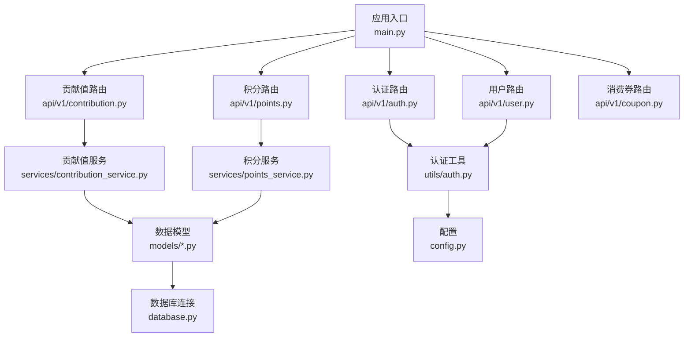
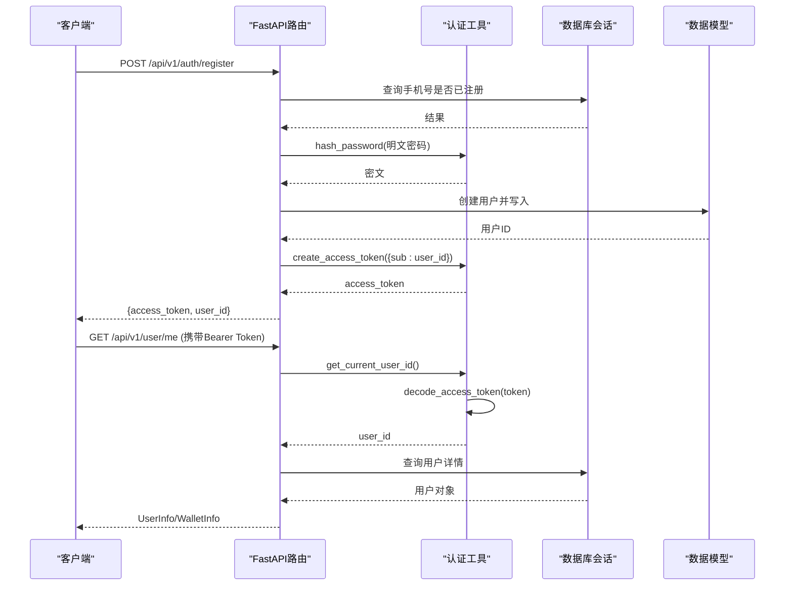
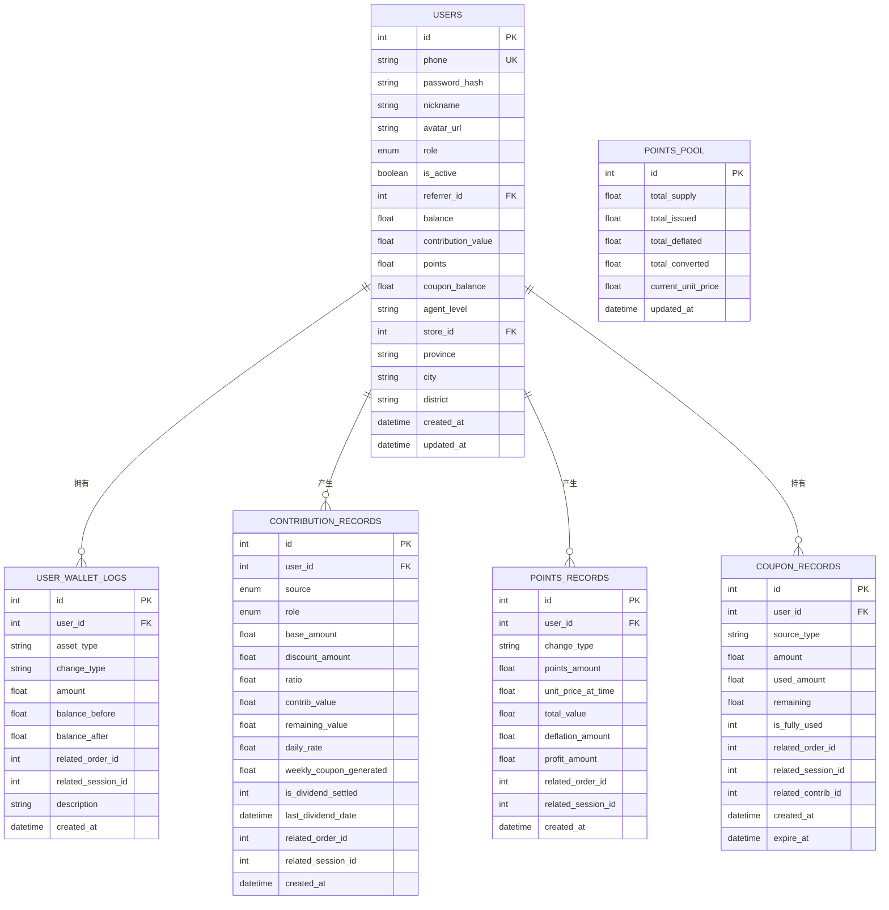
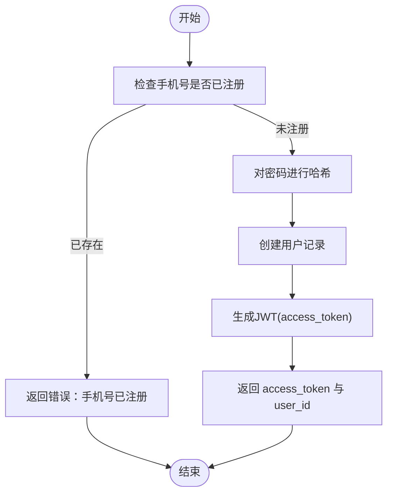
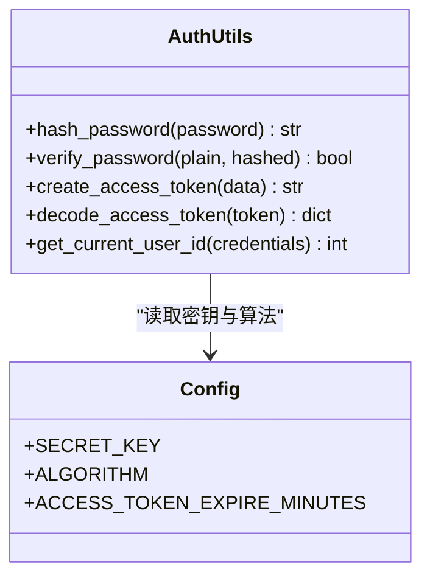
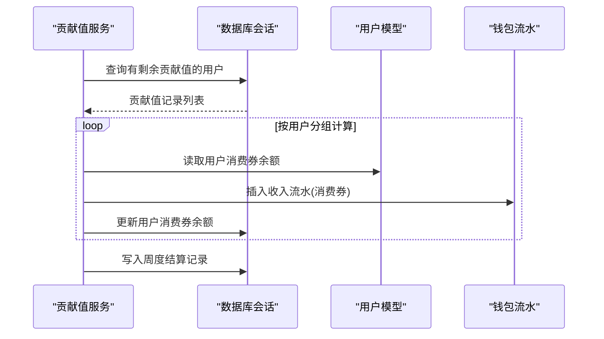
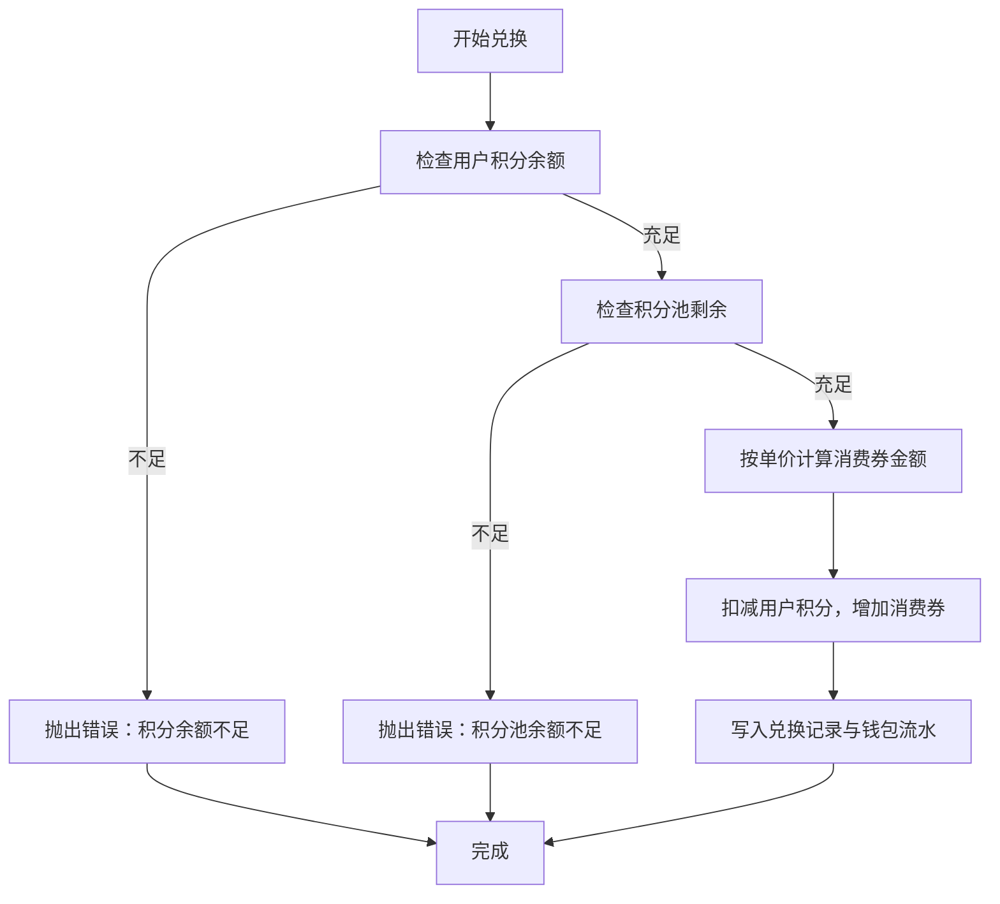
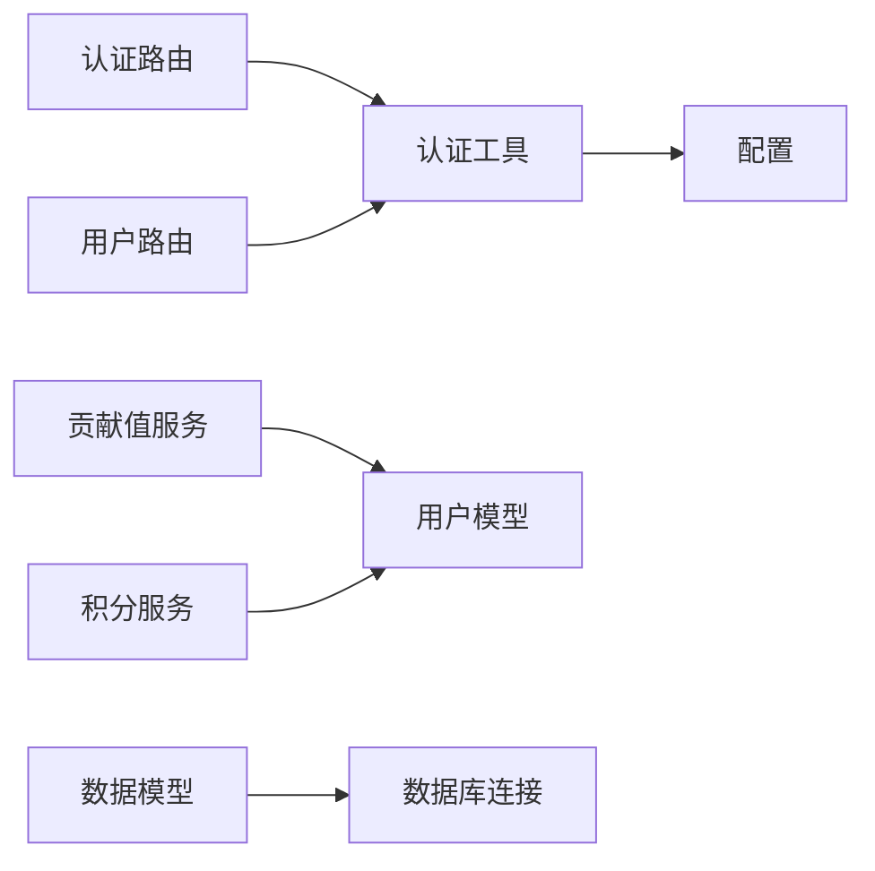

# 用户认证系统

<cite>
**本文引用的文件**   
- [backend/app/main.py](file://backend/app/main.py)
- [backend/app/config.py](file://backend/app/config.py)
- [backend/app/database.py](file://backend/app/database.py)
- [backend/app/utils/auth.py](file://backend/app/utils/auth.py)
- [backend/app/api/v1/auth.py](file://backend/app/api/v1/auth.py)
- [backend/app/api/v1/user.py](file://backend/app/api/v1/user.py)
- [backend/app/schemas/main.py](file://backend/app/schemas/main.py)
- [backend/app/models/user.py](file://backend/app/models/user.py)
- [backend/app/models/contribution.py](file://backend/app/models/contribution.py)
- [backend/app/models/points.py](file://backend/app/models/points.py)
- [backend/app/models/coupon.py](file://backend/app/models/coupon.py)
- [backend/app/services/contribution_service.py](file://backend/app/services/contribution_service.py)
- [backend/app/services/points_service.py](file://backend/app/services/points_service.py)
</cite>

## 目录
1. [简介](#简介)
2. [项目结构](#项目结构)
3. [核心组件](#核心组件)
4. [架构总览](#架构总览)
5. [详细组件分析](#详细组件分析)
6. [依赖关系分析](#依赖关系分析)
7. [性能与安全考量](#性能与安全考量)
8. [故障排查指南](#故障排查指南)
9. [结论](#结论)
10. [附录：接口与扩展指南](#附录接口与扩展指南)

## 简介
本文件为 AIxingmu 用户认证系统的权威技术文档，覆盖以下主题：
- 用户注册、登录流程与错误处理
- JWT 令牌生成、验证与刷新策略建议
- 权限控制实现与扩展方法
- 用户模型设计（基础信息、角色、钱包四大资产）
- 用户钱包资产类型管理（余额、贡献值、积分、消费券）与交易流水追踪
- 安全实现细节（密码加密、会话管理、风控集成点）
- 核心接口使用示例与常见问题定位

## 项目结构
后端采用 FastAPI + SQLAlchemy 异步 ORM 的分层架构：
- API 路由层：按业务域划分（auth、user、contribution、points、coupon 等）
- 服务层：封装复杂业务逻辑（贡献值核算、积分池计算等）
- 数据模型层：SQLAlchemy 模型定义（用户、贡献值、积分、消费券等）
- 工具与配置：JWT/密码工具、全局配置、数据库连接与会话管理
- 应用入口：中间件、路由挂载、生命周期管理

图表来源
- [backend/app/main.py:1-59](file://backend/app/main.py#L1-L59)
- [backend/app/api/v1/auth.py:1-43](file://backend/app/api/v1/auth.py#L1-L43)
- [backend/app/api/v1/user.py:1-37](file://backend/app/api/v1/user.py#L1-L37)
- [backend/app/utils/auth.py:1-50](file://backend/app/utils/auth.py#L1-L50)
- [backend/app/services/contribution_service.py:1-261](file://backend/app/services/contribution_service.py#L1-L261)
- [backend/app/services/points_service.py:1-180](file://backend/app/services/points_service.py#L1-L180)
- [backend/app/models/user.py:1-93](file://backend/app/models/user.py#L1-L93)
- [backend/app/models/contribution.py:1-115](file://backend/app/models/contribution.py#L1-L115)
- [backend/app/models/points.py:1-76](file://backend/app/models/points.py#L1-L76)
- [backend/app/models/coupon.py:1-55](file://backend/app/models/coupon.py#L1-L55)
- [backend/app/config.py:1-136](file://backend/app/config.py#L1-L136)
- [backend/app/database.py:1-40](file://backend/app/database.py#L1-L40)

章节来源
- [backend/app/main.py:1-59](file://backend/app/main.py#L1-L59)
- [backend/app/config.py:1-136](file://backend/app/config.py#L1-L136)
- [backend/app/database.py:1-40](file://backend/app/database.py#L1-L40)

## 核心组件
- 认证与鉴权
  - 注册/登录：校验手机号唯一性、密码哈希比对、签发 JWT
  - 鉴权：从请求头提取 Bearer Token，解码并获取当前用户ID
- 用户与钱包
  - 用户模型：基础信息、角色、推荐关系、代理/门店关联、区域信息
  - 钱包四大资产：余额、贡献值、积分、消费券；统一流水表记录变动
- 贡献值系统
  - 全网统一公式：让利金额 × 分配比例 × 乘数
  - 周度结算：有效贡献值 × 日利率 × 7 → 发放消费券
- 积分增值系统
  - 固定发行量、利润值+通缩机制、动态单价递增
  - 仅可兑换消费券，不可直接消费
- 消费券体系
  - 多来源（拼失败补贴、贡献值递减兑换、分红发放）
  - 使用明细与剩余金额追踪

章节来源
- [backend/app/api/v1/auth.py:1-43](file://backend/app/api/v1/auth.py#L1-L43)
- [backend/app/utils/auth.py:1-50](file://backend/app/utils/auth.py#L1-L50)
- [backend/app/models/user.py:1-93](file://backend/app/models/user.py#L1-L93)
- [backend/app/models/contribution.py:1-115](file://backend/app/models/contribution.py#L1-L115)
- [backend/app/models/points.py:1-76](file://backend/app/models/points.py#L1-L76)
- [backend/app/models/coupon.py:1-55](file://backend/app/models/coupon.py#L1-L55)
- [backend/app/services/contribution_service.py:1-261](file://backend/app/services/contribution_service.py#L1-L261)
- [backend/app/services/points_service.py:1-180](file://backend/app/services/points_service.py#L1-L180)

## 架构总览
整体调用链：客户端 → FastAPI 路由 → 依赖注入（DB会话、鉴权）→ 服务层 → 数据模型 → 数据库。

图表来源
- [backend/app/api/v1/auth.py:14-42](file://backend/app/api/v1/auth.py#L14-L42)
- [backend/app/utils/auth.py:24-49](file://backend/app/utils/auth.py#L24-L49)
- [backend/app/api/v1/user.py:14-36](file://backend/app/api/v1/user.py#L14-L36)
- [backend/app/database.py:29-39](file://backend/app/database.py#L29-L39)
- [backend/app/models/user.py:26-66](file://backend/app/models/user.py#L26-L66)

## 详细组件分析

### 用户模型与钱包设计
- 用户表字段要点
  - 基础信息：phone、password_hash、nickname、avatar_url
  - 角色：consumer/referrer/store/referral_store/district_agent/city_agent/province_agent/admin
  - 状态：is_active
  - 推荐关系：referrer_id
  - 代理/门店：agent_level、store_id、province/city/district
  - 钱包四大资产：balance、contribution_value、points、coupon_balance
- 钱包流水表
  - 字段：user_id、asset_type、change_type、amount、balance_before、balance_after、related_order/session、description
  - 索引：user_id + asset_type 组合索引，便于查询

图表来源
- [backend/app/models/user.py:26-93](file://backend/app/models/user.py#L26-L93)
- [backend/app/models/contribution.py:32-115](file://backend/app/models/contribution.py#L32-L115)
- [backend/app/models/points.py:14-76](file://backend/app/models/points.py#L14-L76)
- [backend/app/models/coupon.py:14-55](file://backend/app/models/coupon.py#L14-L55)

章节来源
- [backend/app/models/user.py:1-93](file://backend/app/models/user.py#L1-L93)
- [backend/app/models/contribution.py:1-115](file://backend/app/models/contribution.py#L1-L115)
- [backend/app/models/points.py:1-76](file://backend/app/models/points.py#L1-L76)
- [backend/app/models/coupon.py:1-55](file://backend/app/models/coupon.py#L1-L55)

### 注册与登录流程
- 注册
  - 校验手机号唯一性
  - 密码哈希存储
  - 可选昵称与推荐人ID
  - 返回 access_token 与 user_id
- 登录
  - 根据手机号查询用户
  - 校验密码哈希
  - 返回 access_token 与 user_id

图表来源
- [backend/app/api/v1/auth.py:14-31](file://backend/app/api/v1/auth.py#L14-L31)
- [backend/app/utils/auth.py:16-28](file://backend/app/utils/auth.py#L16-L28)

章节来源
- [backend/app/api/v1/auth.py:14-42](file://backend/app/api/v1/auth.py#L14-L42)
- [backend/app/schemas/main.py:10-24](file://backend/app/schemas/main.py#L10-L24)

### JWT 认证机制与刷新策略
- 生成与解码
  - 使用 HS256 算法与配置密钥
  - 载荷包含 sub(user_id) 与 exp(过期时间)
- 鉴权依赖
  - 从请求头解析 Bearer Token
  - 解码失败或无 sub 时返回 401
- 刷新策略建议（当前未实现）
  - 引入 refresh_token 与短期 access_token
  - 提供 /refresh 端点，服务端维护 refresh_token 黑名单/过期集合
  - 前端在 access_token 即将过期前主动刷新

图表来源
- [backend/app/utils/auth.py:1-50](file://backend/app/utils/auth.py#L1-L50)
- [backend/app/config.py:28-31](file://backend/app/config.py#L28-L31)

章节来源
- [backend/app/utils/auth.py:1-50](file://backend/app/utils/auth.py#L1-L50)
- [backend/app/config.py:28-31](file://backend/app/config.py#L28-L31)

### 权限控制实现与扩展
- 当前实现
  - 基于 Bearer Token 的通用鉴权依赖 get_current_user_id
  - 路由通过 Depends 注入 user_id，用于后续业务校验
- 扩展建议
  - 增加角色/资源级权限校验中间件或装饰器
  - 结合用户角色枚举与资源访问矩阵进行细粒度控制
  - 将权限判断下沉至服务层，避免在路由中散落逻辑

章节来源
- [backend/app/utils/auth.py:39-49](file://backend/app/utils/auth.py#L39-L49)
- [backend/app/api/v1/user.py:14-21](file://backend/app/api/v1/user.py#L14-L21)

### 用户钱包与交易流水
- 资产类型
  - 余额（拼团本金）、贡献值、积分、消费券
- 流水记录
  - 所有资产变动均写入 user_wallet_logs，含变动前后余额与说明
- 贡献值周度结算
  - 每周按有效贡献值 × 日利率 × 7 发放消费券，并更新用户余额与流水
- 积分兑换
  - 按当前单价将积分兑换为消费券，扣减用户积分并增加消费券余额，同时记录流水

图表来源
- [backend/app/services/contribution_service.py:163-240](file://backend/app/services/contribution_service.py#L163-L240)
- [backend/app/models/user.py:74-93](file://backend/app/models/user.py#L74-L93)

章节来源
- [backend/app/services/contribution_service.py:163-240](file://backend/app/services/contribution_service.py#L163-L240)
- [backend/app/models/user.py:74-93](file://backend/app/models/user.py#L74-L93)

### 积分增值系统与兑换
- 积分池
  - 固定总发行量，累计发放与通缩统计，动态单价 = 累计总金额 / 累计通缩数量
- 赚取与通缩
  - 每次消费新增利润值积分，同时按比例通缩，净增积分计入用户
- 兑换规则
  - 积分 → 消费券，按当前单价折算，扣减用户积分并增加消费券余额

图表来源
- [backend/app/services/points_service.py:95-166](file://backend/app/services/points_service.py#L95-L166)
- [backend/app/models/points.py:14-76](file://backend/app/models/points.py#L14-L76)

章节来源
- [backend/app/services/points_service.py:30-92](file://backend/app/services/points_service.py#L30-L92)
- [backend/app/services/points_service.py:95-166](file://backend/app/services/points_service.py#L95-L166)
- [backend/app/models/points.py:14-76](file://backend/app/models/points.py#L14-L76)

### 核心接口使用示例与错误处理
- 注册
  - 路径：POST /api/v1/auth/register
  - 请求体：手机号、密码、可选昵称、可选推荐人ID
  - 成功响应：access_token、token_type、user_id
  - 常见错误：手机号已注册（400）
- 登录
  - 路径：POST /api/v1/auth/login
  - 请求体：手机号、密码
  - 成功响应：access_token、token_type、user_id
  - 常见错误：手机号或密码错误（401）
- 查看个人信息
  - 路径：GET /api/v1/user/me
  - 鉴权：需携带 Bearer Token
  - 响应：UserInfo（含角色、钱包四大资产等）
- 查看钱包
  - 路径：GET /api/v1/user/wallet
  - 鉴权：需携带 Bearer Token
  - 响应：WalletInfo（余额、贡献值、积分、消费券）

章节来源
- [backend/app/api/v1/auth.py:14-42](file://backend/app/api/v1/auth.py#L14-L42)
- [backend/app/api/v1/user.py:14-36](file://backend/app/api/v1/user.py#L14-L36)
- [backend/app/schemas/main.py:10-46](file://backend/app/schemas/main.py#L10-L46)

## 依赖关系分析
- 模块耦合
  - 路由层依赖认证工具与数据库会话
  - 服务层依赖配置与数据模型
  - 数据模型依赖数据库基类与外键关系
- 外部依赖
  - JWT 库、密码哈希库、FastAPI 安全组件
  - 异步数据库引擎与会话工厂

图表来源
- [backend/app/api/v1/auth.py:1-43](file://backend/app/api/v1/auth.py#L1-L43)
- [backend/app/api/v1/user.py:1-37](file://backend/app/api/v1/user.py#L1-L37)
- [backend/app/utils/auth.py:1-50](file://backend/app/utils/auth.py#L1-L50)
- [backend/app/services/contribution_service.py:1-261](file://backend/app/services/contribution_service.py#L1-L261)
- [backend/app/services/points_service.py:1-180](file://backend/app/services/points_service.py#L1-L180)
- [backend/app/models/user.py:1-93](file://backend/app/models/user.py#L1-L93)
- [backend/app/config.py:1-136](file://backend/app/config.py#L1-L136)
- [backend/app/database.py:1-40](file://backend/app/database.py#L1-L40)

章节来源
- [backend/app/main.py:44-53](file://backend/app/main.py#L44-L53)
- [backend/app/config.py:1-136](file://backend/app/config.py#L1-L136)
- [backend/app/database.py:1-40](file://backend/app/database.py#L1-L40)

## 性能与安全考量
- 性能
  - 异步数据库会话与连接池配置，减少阻塞
  - 关键查询建立复合索引（如 user_id + asset_type）
  - 批量写入与 flush 控制，降低事务开销
- 安全
  - 密码使用 bcrypt 哈希，避免明文存储
  - JWT 使用强密钥与合理过期时间
  - 建议引入 refresh_token 与黑名单机制，防止重放攻击
  - 敏感配置通过环境变量加载，生产环境更换默认密钥
  - 结合风控服务对用户行为进行实时监控与拦截

[本节为通用指导，不直接分析具体文件]

## 故障排查指南
- 注册失败
  - 现象：返回“手机号已注册”
  - 排查：确认手机号唯一性与重复提交防护
- 登录失败
  - 现象：返回“手机号或密码错误”
  - 排查：核对密码哈希比对逻辑与输入格式
- 鉴权失败
  - 现象：401 无效凭据/无效Token
  - 排查：检查请求头 Authorization 是否为 Bearer Token，Token 是否过期
- 钱包余额不一致
  - 现象：余额与流水不符
  - 排查：核对流水记录的 balance_before/balance_after 与变更顺序，确保原子事务

章节来源
- [backend/app/api/v1/auth.py:14-42](file://backend/app/api/v1/auth.py#L14-L42)
- [backend/app/utils/auth.py:39-49](file://backend/app/utils/auth.py#L39-L49)
- [backend/app/models/user.py:74-93](file://backend/app/models/user.py#L74-L93)

## 结论
本系统以清晰的层次化设计与完善的钱包流水机制，实现了用户认证、权限控制与资产管理的闭环。贡献值与积分体系提供了可扩展的激励与兑换通道。建议在后续迭代中完善 token 刷新机制、细粒度权限控制与更丰富的风控策略，以提升安全性与用户体验。

[本节为总结，不直接分析具体文件]

## 附录：接口与扩展指南
- 接口清单
  - 认证：/api/v1/auth/register、/api/v1/auth/login
  - 用户：/api/v1/user/me、/api/v1/user/wallet
- 扩展方法
  - 自定义权限：在服务层增加角色/资源校验函数，并在路由中通过 Depends 注入
  - 新增资产类型：在用户模型与服务层同步扩展，并确保写入统一流水表
  - 刷新令牌：新增 /refresh 端点，维护 refresh_token 存储与过期策略
- 最佳实践
  - 所有资产变动必须落盘流水，保证可审计与可追溯
  - 对外暴露最小必要字段，敏感信息不在响应中返回
  - 使用配置中心管理密钥与阈值参数，支持灰度与热更新

章节来源
- [backend/app/api/v1/auth.py:14-42](file://backend/app/api/v1/auth.py#L14-L42)
- [backend/app/api/v1/user.py:14-36](file://backend/app/api/v1/user.py#L14-L36)
- [backend/app/models/user.py:26-66](file://backend/app/models/user.py#L26-L66)
- [backend/app/models/user.py:74-93](file://backend/app/models/user.py#L74-L93)