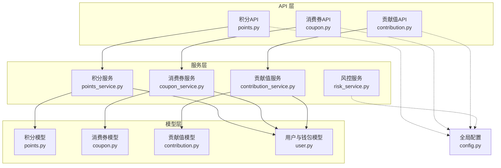
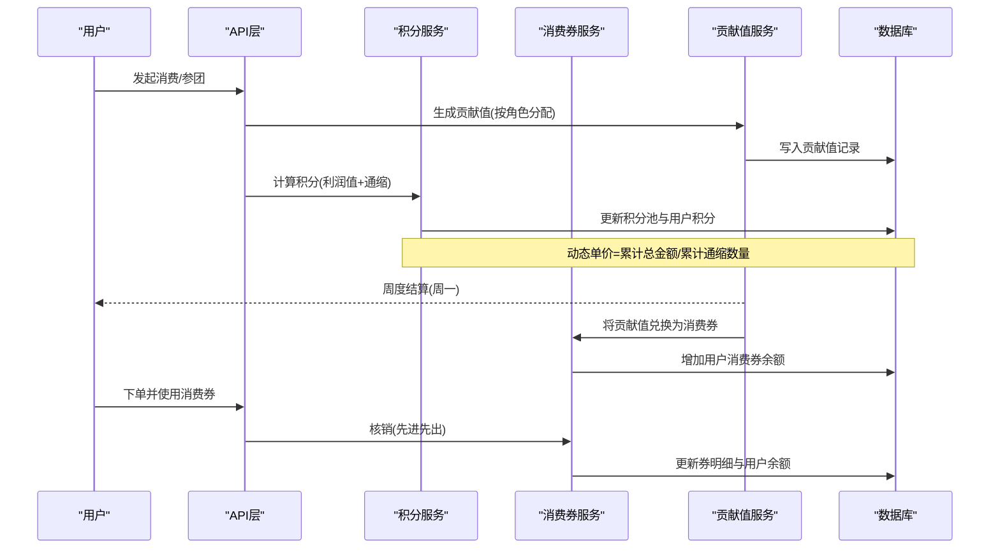
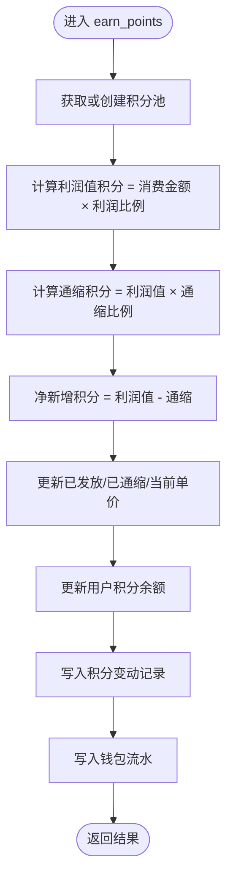
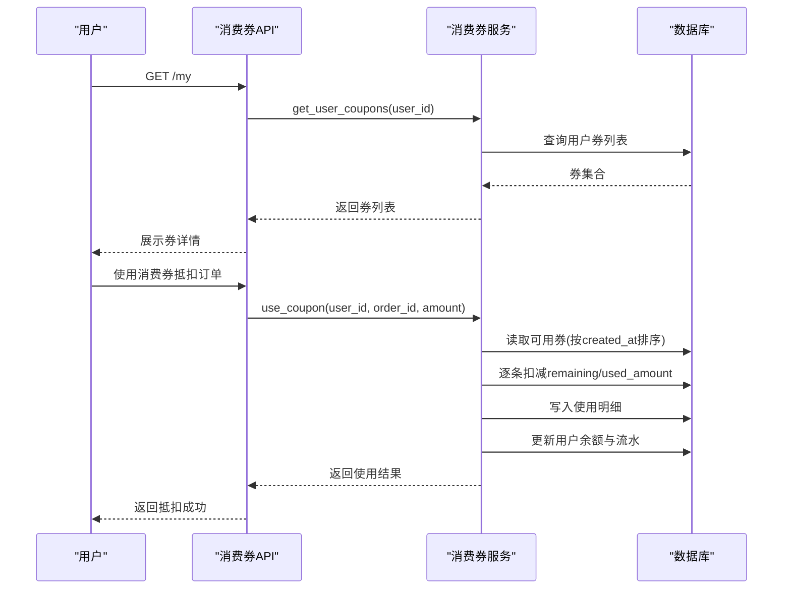
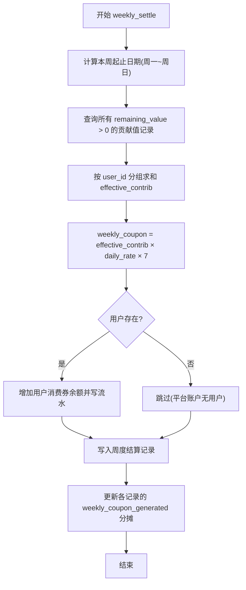
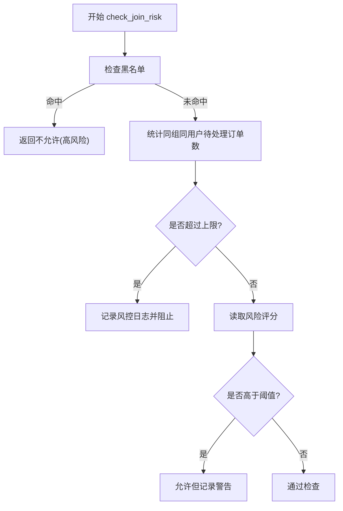
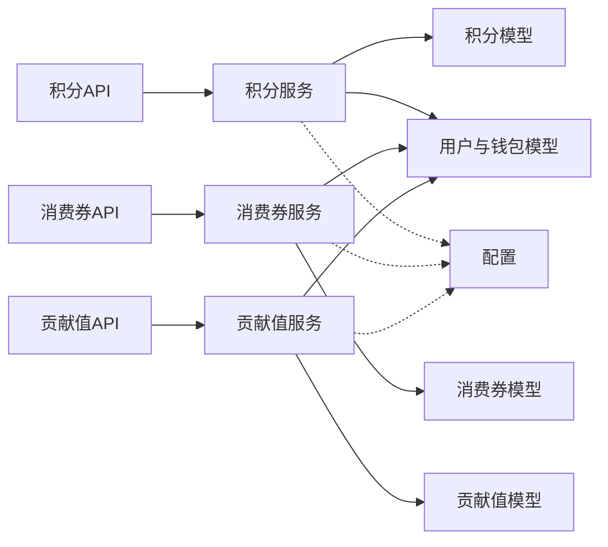

# 积分和消费券系统

<cite>
**本文引用的文件**   
- [points.py](file://backend/app/models/points.py)
- [coupon.py](file://backend/app/models/coupon.py)
- [contribution.py](file://backend/app/models/contribution.py)
- [user.py](file://backend/app/models/user.py)
- [points_service.py](file://backend/app/services/points_service.py)
- [coupon_service.py](file://backend/app/services/coupon_service.py)
- [contribution_service.py](file://backend/app/services/contribution_service.py)
- [points_api.py](file://backend/app/api/v1/points.py)
- [coupon_api.py](file://backend/app/api/v1/coupon.py)
- [contribution_api.py](file://backend/app/api/v1/contribution.py)
- [config.py](file://backend/app/config.py)
- [risk_service.py](file://backend/app/services/risk_service.py)
</cite>

## 目录
1. [简介](#简介)
2. [项目结构](#项目结构)
3. [核心组件](#核心组件)
4. [架构总览](#架构总览)
5. [详细组件分析](#详细组件分析)
6. [依赖关系分析](#依赖关系分析)
7. [性能与并发特性](#性能与并发特性)
8. [故障排查指南](#故障排查指南)
9. [结论](#结论)
10. [附录：API 参考](#附录api-参考)

## 简介
本系统围绕“积分”“消费券”“贡献值”三大资产构建，形成短期激励与长期价值并重的经济模型。积分池采用固定总量与动态单价机制，配合通缩调节；消费券作为消费抵扣媒介，不可提现；贡献值用于长期权益与分红核算。三者协同驱动拼团、零售、线下门店等多场景的激励与分配。

## 项目结构
后端采用分层架构：API 层（FastRouter）→ 服务层（业务逻辑）→ 数据模型层（SQLAlchemy ORM）。配置集中管理，风控独立服务。

图表来源
- [points_api.py:1-31](file://backend/app/api/v1/points.py#L1-L31)
- [coupon_api.py:1-20](file://backend/app/api/v1/coupon.py#L1-L20)
- [contribution_api.py:1-27](file://backend/app/api/v1/contribution.py#L1-L27)
- [points_service.py:1-180](file://backend/app/services/points_service.py#L1-L180)
- [coupon_service.py:1-86](file://backend/app/services/coupon_service.py#L1-L86)
- [contribution_service.py:1-261](file://backend/app/services/contribution_service.py#L1-L261)
- [points.py:1-76](file://backend/app/models/points.py#L1-L76)
- [coupon.py:1-55](file://backend/app/models/coupon.py#L1-L55)
- [contribution.py:1-115](file://backend/app/models/contribution.py#L1-L115)
- [user.py:1-93](file://backend/app/models/user.py#L1-L93)
- [config.py:1-136](file://backend/app/config.py#L1-L136)

章节来源
- [points_api.py:1-31](file://backend/app/api/v1/points.py#L1-L31)
- [coupon_api.py:1-20](file://backend/app/api/v1/coupon.py#L1-L20)
- [contribution_api.py:1-27](file://backend/app/api/v1/contribution.py#L1-L27)
- [points_service.py:1-180](file://backend/app/services/points_service.py#L1-L180)
- [coupon_service.py:1-86](file://backend/app/services/coupon_service.py#L1-L86)
- [contribution_service.py:1-261](file://backend/app/services/contribution_service.py#L1-L261)
- [points.py:1-76](file://backend/app/models/points.py#L1-L76)
- [coupon.py:1-55](file://backend/app/models/coupon.py#L1-L55)
- [contribution.py:1-115](file://backend/app/models/contribution.py#L1-L115)
- [user.py:1-93](file://backend/app/models/user.py#L1-L93)
- [config.py:1-136](file://backend/app/config.py#L1-L136)

## 核心组件
- 积分池与增值机制：固定发行量、利润值发放、通缩扣减、动态单价递增，积分仅可兑换消费券。
- 消费券体系：多来源发放、先进先出核销、使用明细记录、余额统一管控。
- 贡献值体系：全网统一公式、六大角色分配、周度递减兑换、分红统计基础。
- 用户钱包：四大资产（余额、贡献值、积分、消费券）及流水审计。
- 风控能力：参团风控、黑名单、风险评分与拦截策略。

章节来源
- [points.py:1-76](file://backend/app/models/points.py#L1-L76)
- [coupon.py:1-55](file://backend/app/models/coupon.py#L1-L55)
- [contribution.py:1-115](file://backend/app/models/contribution.py#L1-L115)
- [user.py:1-93](file://backend/app/models/user.py#L1-L93)
- [points_service.py:1-180](file://backend/app/services/points_service.py#L1-L180)
- [coupon_service.py:1-86](file://backend/app/services/coupon_service.py#L1-L86)
- [contribution_service.py:1-261](file://backend/app/services/contribution_service.py#L1-L261)
- [risk_service.py:1-106](file://backend/app/services/risk_service.py#L1-L106)

## 架构总览
积分、消费券、贡献值在交易与结算链路中协同工作：消费或拼团成功触发贡献值与积分生成；贡献值按周递减兑换为消费券；积分可按当前单价兑换消费券；消费券用于订单抵扣。

图表来源
- [contribution_service.py:39-143](file://backend/app/services/contribution_service.py#L39-L143)
- [points_service.py:30-92](file://backend/app/services/points_service.py#L30-L92)
- [contribution_service.py:163-240](file://backend/app/services/contribution_service.py#L163-L240)
- [coupon_service.py:17-75](file://backend/app/services/coupon_service.py#L17-L75)

## 详细组件分析

### 积分池与增值机制
- 设计要点
  - 固定发行量：总发行量恒定，永不超发。
  - 利润值与通缩：每次消费新增利润值积分，同时按比例通缩扣减，净增=利润值-通缩。
  - 动态单价：累计总金额/累计通缩数量，随通缩递增。
  - 兑换规则：积分仅可兑换消费券，按当前单价折算。
- 关键流程
  - 获取/创建积分池单例。
  - 计算利润值与通缩，更新池指标与用户积分。
  - 记录变动与钱包流水。
  - 兑换时校验余额与池剩余，按单价折算消费券金额。

图表来源
- [points_service.py:30-92](file://backend/app/services/points_service.py#L30-L92)
- [points.py:14-59](file://backend/app/models/points.py#L14-L59)

章节来源
- [points_service.py:1-180](file://backend/app/services/points_service.py#L1-L180)
- [points.py:1-76](file://backend/app/models/points.py#L1-L76)
- [config.py:107-110](file://backend/app/config.py#L107-L110)

### 消费券系统
- 设计要点
  - 多来源：拼失败补贴、贡献值周度兑换、分红等。
  - 使用限制：不可提现，仅用于商城消费抵扣。
  - 核销策略：先进先出，支持部分使用与多次核销。
  - 使用明细：每条使用记录关联订单与券ID。
- 关键流程
  - 查询可用券（未用完且未过期），按创建时间排序。
  - 逐条扣减至满足订单抵扣金额。
  - 更新用户余额与流水。

图表来源
- [coupon_api.py:12-19](file://backend/app/api/v1/coupon.py#L12-L19)
- [coupon_service.py:17-75](file://backend/app/services/coupon_service.py#L17-L75)
- [coupon.py:14-55](file://backend/app/models/coupon.py#L14-L55)

章节来源
- [coupon_service.py:1-86](file://backend/app/services/coupon_service.py#L1-L86)
- [coupon.py:1-55](file://backend/app/models/coupon.py#L1-L55)

### 贡献值体系与周度递减兑换
- 设计要点
  - 统一公式：贡献值 = 让利金额 × 分配比例 × 乘数。
  - 六大角色：消费者、合作商家、推荐商家、推荐消费者、代理（省/市/区县）、平台。
  - 周度结算：每周一按有效贡献值×日利率×7兑换消费券，剩余贡献值继续参与下期。
  - 全网统计：汇总全网贡献值与平台收益池，支撑分红。
- 关键流程
  - 根据交易金额与角色比例生成多条贡献值记录。
  - 定时任务聚合用户剩余贡献值，计算本周消费券并发放。
  - 更新周度结算表与用户券余额。

图表来源
- [contribution_service.py:163-240](file://backend/app/services/contribution_service.py#L163-L240)
- [contribution.py:72-100](file://backend/app/models/contribution.py#L72-L100)

章节来源
- [contribution_service.py:1-261](file://backend/app/services/contribution_service.py#L1-L261)
- [contribution.py:1-115](file://backend/app/models/contribution.py#L1-L115)
- [config.py:60-105](file://backend/app/config.py#L60-L105)

### 积分等级与会员特权（概念性说明）
- 定位建议
  - 积分偏向短期激励与消费引导，适合与活动、兑换、拉新挂钩。
  - 贡献值偏向长期价值与分红权益，适合绑定持续消费与生态贡献。
- 等级体系（建议）
  - 基于累计贡献值或活跃天数划分等级，不同等级享有更高兑换效率、优先兑换权、专属券包等。
- 会员特权（建议）
  - 高等级用户享受更低手续费、更高贡献值倍率、专属客服与活动优先权。

[本节为概念性内容，不直接分析具体代码文件]

### 风控与防刷机制
- 参团风控
  - 黑名单校验、单组参与次数上限、异常频率与风险评分阈值。
- 行为评分
  - 事件类型加权加分，超过阈值加入黑名单。
- 应用点
  - 在参团入口前置风控检查，必要时警告或阻断。

图表来源
- [risk_service.py:17-74](file://backend/app/services/risk_service.py#L17-L74)

章节来源
- [risk_service.py:1-106](file://backend/app/services/risk_service.py#L1-L106)

## 依赖关系分析
- 模块耦合
  - API 层仅依赖对应 Service，Service 依赖 Model 与配置。
  - 用户钱包模型被积分、消费券、贡献值服务共同引用，形成统一资产视图。
- 外部依赖
  - 异步数据库会话、Redis/Celery（配置项预留）、对象存储（配置项预留）。
- 循环依赖
  - 未发现显式循环导入，依赖方向清晰。

图表来源
- [points_api.py:1-31](file://backend/app/api/v1/points.py#L1-L31)
- [coupon_api.py:1-20](file://backend/app/api/v1/coupon.py#L1-L20)
- [contribution_api.py:1-27](file://backend/app/api/v1/contribution.py#L1-L27)
- [points_service.py:1-180](file://backend/app/services/points_service.py#L1-L180)
- [coupon_service.py:1-86](file://backend/app/services/coupon_service.py#L1-L86)
- [contribution_service.py:1-261](file://backend/app/services/contribution_service.py#L1-L261)
- [points.py:1-76](file://backend/app/models/points.py#L1-L76)
- [coupon.py:1-55](file://backend/app/models/coupon.py#L1-L55)
- [contribution.py:1-115](file://backend/app/models/contribution.py#L1-L115)
- [user.py:1-93](file://backend/app/models/user.py#L1-L93)
- [config.py:1-136](file://backend/app/config.py#L1-L136)

章节来源
- [points_api.py:1-31](file://backend/app/api/v1/points.py#L1-L31)
- [coupon_api.py:1-20](file://backend/app/api/v1/coupon.py#L1-L20)
- [contribution_api.py:1-27](file://backend/app/api/v1/contribution.py#L1-L27)
- [points_service.py:1-180](file://backend/app/services/points_service.py#L1-L180)
- [coupon_service.py:1-86](file://backend/app/services/coupon_service.py#L1-L86)
- [contribution_service.py:1-261](file://backend/app/services/contribution_service.py#L1-L261)
- [points.py:1-76](file://backend/app/models/points.py#L1-L76)
- [coupon.py:1-55](file://backend/app/models/coupon.py#L1-L55)
- [contribution.py:1-115](file://backend/app/models/contribution.py#L1-L115)
- [user.py:1-93](file://backend/app/models/user.py#L1-L93)
- [config.py:1-136](file://backend/app/config.py#L1-L136)

## 性能与并发特性
- 并发安全
  - 积分池更新与用户余额变更在同一事务内提交，避免竞态导致的不一致。
  - 消费券核销按创建时间顺序遍历，建议在热点路径引入行级锁或分布式锁保障一致性。
- 索引优化
  - 用户维度索引：用户积分/券/贡献值查询频繁，已有复合索引提升性能。
  - 时间范围查询：券列表按 created_at 排序，建议对高频过滤条件建立覆盖索引。
- 批量与异步
  - 周度结算涉及全量扫描，建议分片/分页处理并结合 Celery 异步执行。
- 缓存策略
  - 积分池状态与用户余额可考虑 Redis 缓存，注意失效策略与一致性校验。

[本节提供通用指导，不直接分析具体代码文件]

## 故障排查指南
- 常见问题
  - 积分兑换失败：余额不足或积分池余额不足。
  - 消费券核销失败：余额不足或券已过期/已用完。
  - 贡献值周度结算异常：用户不存在或数据不一致。
- 定位方法
  - 查看钱包流水表，核对资产变动前后余额与描述。
  - 检查对应记录表（积分变动、券明细、贡献值记录）的时间戳与关联ID。
  - 结合风控日志确认是否被拦截或标记。

章节来源
- [points_service.py:94-166](file://backend/app/services/points_service.py#L94-L166)
- [coupon_service.py:17-75](file://backend/app/services/coupon_service.py#L17-L75)
- [contribution_service.py:163-240](file://backend/app/services/contribution_service.py#L163-L240)
- [risk_service.py:17-74](file://backend/app/services/risk_service.py#L17-L74)

## 结论
本系统以“固定总量+动态单价”的积分池为核心，结合贡献值周度递减兑换与消费券核销闭环，构建了兼顾短期激励与长期价值的经济模型。通过完善的风控与审计流水，确保资产流转的可追溯性与安全性。后续可在等级体系、会员特权、运营策略等方面进一步扩展，以提升用户粘性与平台生态活力。

[本节为总结性内容，不直接分析具体代码文件]

## 附录：API 参考
- 积分相关
  - 获取积分池状态
    - 方法：GET
    - 路径：/api/v1/points/pool
    - 鉴权：无需
    - 响应：包含总发行量、已发放、已通缩、已兑换、当前单价、剩余等字段
  - 积分兑换消费券
    - 方法：POST
    - 路径：/api/v1/points/convert
    - 请求体：points_amount（兑换积分数量）
    - 鉴权：需要
    - 响应：包含消耗积分、获得消费券金额、兑换单价、剩余积分等
- 消费券相关
  - 获取我的消费券列表
    - 方法：GET
    - 路径：/api/v1/coupon/my
    - 鉴权：需要
    - 响应：items 数组，包含券来源、金额、剩余、创建时间等
- 贡献值相关
  - 获取我的贡献值记录
    - 方法：GET
    - 路径：/api/v1/contribution/my
    - 鉴权：需要
    - 响应：items 数组，包含来源、角色、基数金额、让利金额、比例、贡献值、剩余等
  - 获取全网总贡献值
    - 方法：GET
    - 路径：/api/v1/contribution/total
    - 鉴权：无需
    - 响应：total_network_contribution

章节来源
- [points_api.py:13-30](file://backend/app/api/v1/points.py#L13-L30)
- [coupon_api.py:12-19](file://backend/app/api/v1/coupon.py#L12-L19)
- [contribution_api.py:12-26](file://backend/app/api/v1/contribution.py#L12-L26)
- [schemas/main.py:122-143](file://backend/app/schemas/main.py#L122-L143)