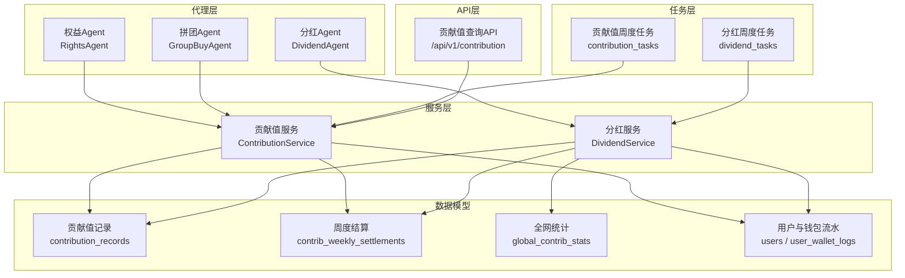
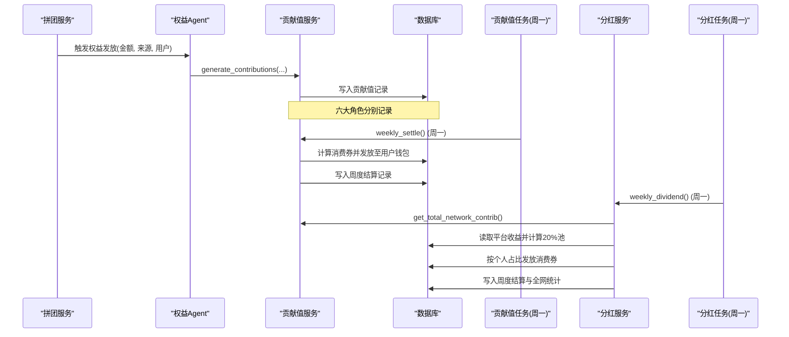
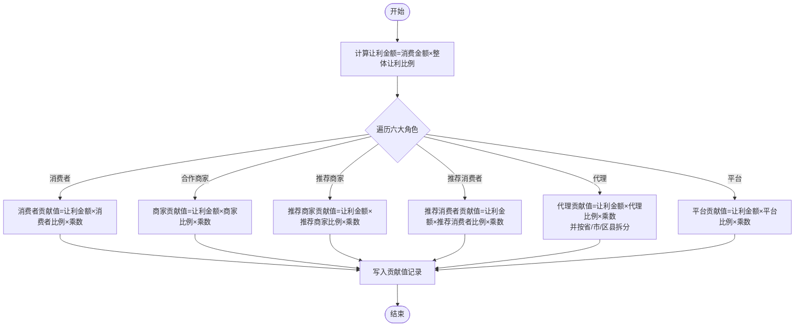
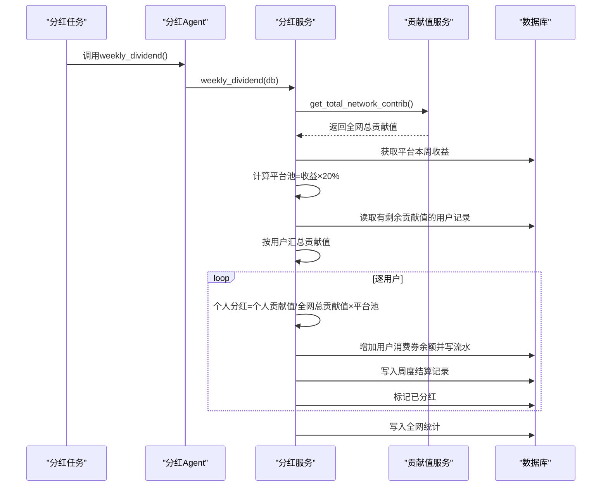
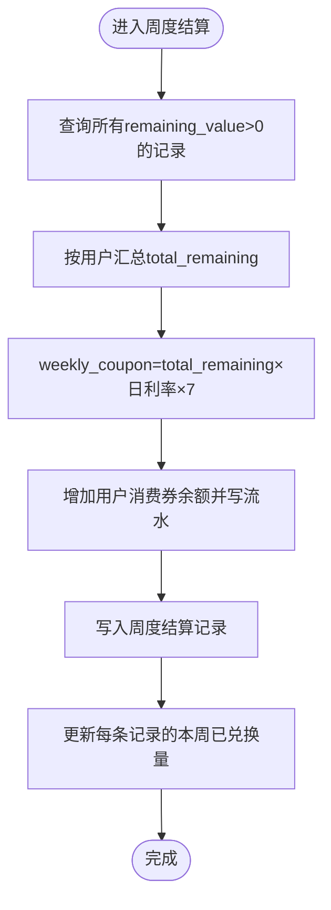
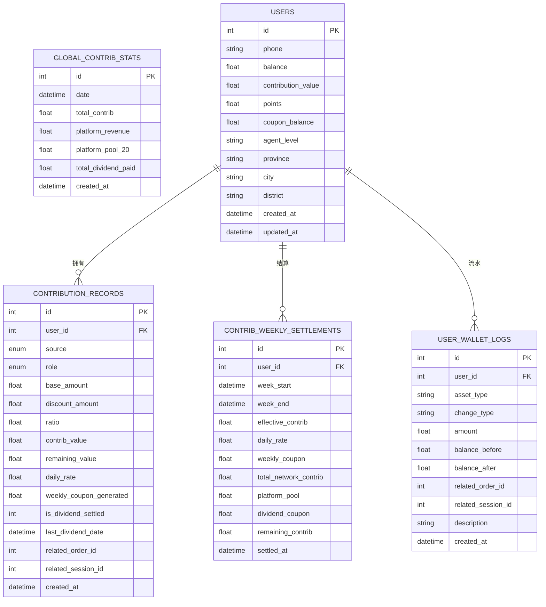
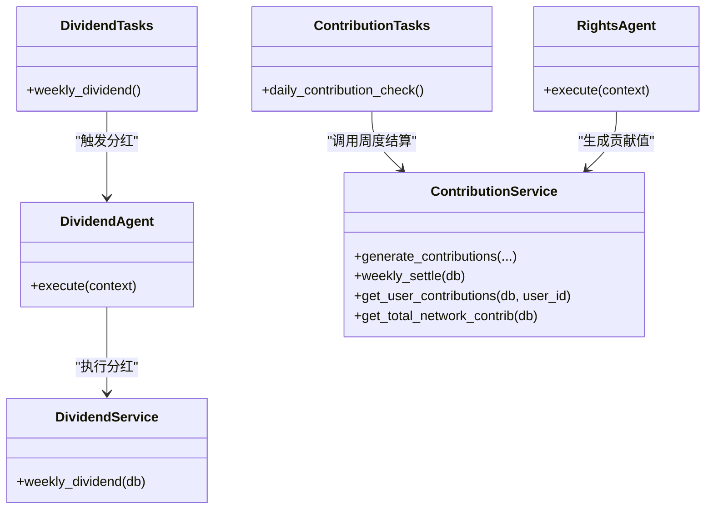
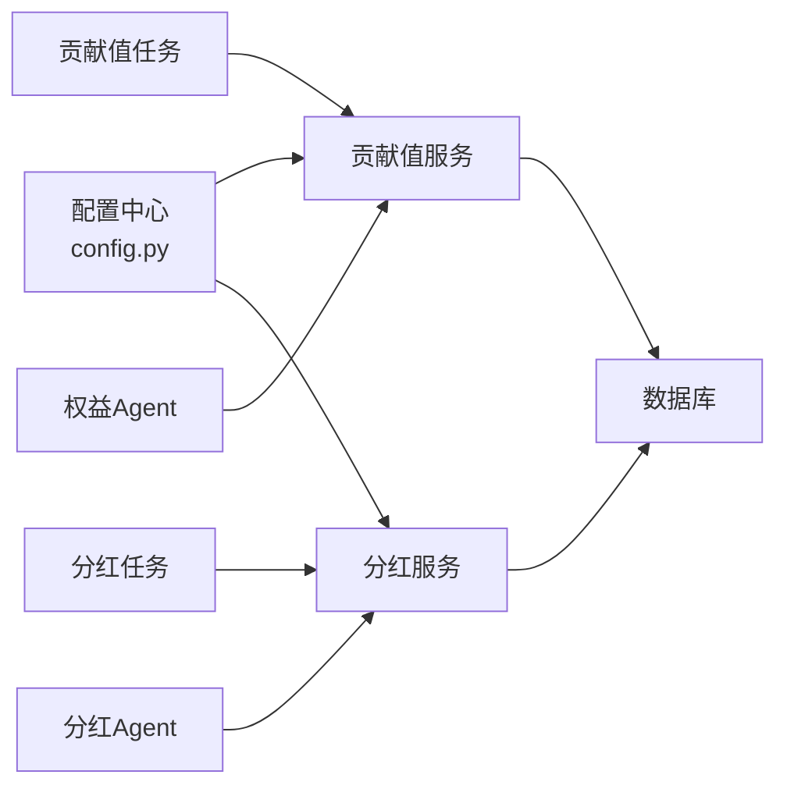

# 贡献值经济系统

<cite>
**本文引用的文件列表**
- [backend/app/models/contribution.py](file://backend/app/models/contribution.py)
- [backend/app/services/contribution_service.py](file://backend/app/services/contribution_service.py)
- [backend/app/services/dividend_service.py](file://backend/app/services/dividend_service.py)
- [backend/app/api/v1/contribution.py](file://backend/app/api/v1/contribution.py)
- [backend/app/tasks/contribution_tasks.py](file://backend/app/tasks/contribution_tasks.py)
- [backend/app/tasks/dividend_tasks.py](file://backend/app/tasks/dividend_tasks.py)
- [backend/app/config.py](file://backend/app/config.py)
- [backend/app/agents/all_agents.py](file://backend/app/agents/all_agents.py)
- [backend/app/agents/group_buy_agent.py](file://backend/app/agents/group_buy_agent.py)
- [backend/app/services/group_buy_service.py](file://backend/app/services/group_buy_service.py)
- [backend/app/models/user.py](file://backend/app/models/user.py)
</cite>

## 目录
1. [引言](#引言)
2. [项目结构](#项目结构)
3. [核心组件](#核心组件)
4. [架构总览](#架构总览)
5. [详细组件分析](#详细组件分析)
6. [依赖关系分析](#依赖关系分析)
7. [性能与可扩展性](#性能与可扩展性)
8. [故障排查指南](#故障排查指南)
9. [结论](#结论)
10. [附录：API与数据模型参考](#附录api与数据模型参考)

## 引言
本文件面向开发者与产品运营，系统性阐述AIxingmu“贡献值经济系统”的设计与实现。重点覆盖以下方面：
- 贡献值的生成机制与来源（拼团中奖、消费行为、活动奖励等）
- 周度分红算法（全网贡献值占比分配平台收益池）
- 递减兑换规则（基于日利率的周度消费券发放与剩余贡献值滚动）
- 数据结构设计、历史追溯与审计能力
- 相关API接口说明
- 经济模型平衡性分析与调整建议

## 项目结构
贡献值经济系统位于后端服务中，围绕“模型-服务-任务-代理-接口”分层组织：
- 数据模型层：定义贡献值记录、周度结算、全网统计以及用户钱包流水
- 服务层：贡献值核算、周度递减兑换、周度分红计算
- 任务层：Celery定时任务触发周度结算与分红
- 代理层：AI Agent编排业务动作（如权益发放、分红执行）
- API层：对外暴露查询接口

图表来源
- [backend/app/models/contribution.py:1-115](file://backend/app/models/contribution.py#L1-L115)
- [backend/app/services/contribution_service.py:1-261](file://backend/app/services/contribution_service.py#L1-L261)
- [backend/app/services/dividend_service.py:1-136](file://backend/app/services/dividend_service.py#L1-L136)
- [backend/app/tasks/contribution_tasks.py:1-29](file://backend/app/tasks/contribution_tasks.py#L1-L29)
- [backend/app/tasks/dividend_tasks.py:1-26](file://backend/app/tasks/dividend_tasks.py#L1-L26)
- [backend/app/agents/all_agents.py:1-114](file://backend/app/agents/all_agents.py#L1-L114)
- [backend/app/api/v1/contribution.py:1-27](file://backend/app/api/v1/contribution.py#L1-L27)

章节来源
- [backend/app/models/contribution.py:1-115](file://backend/app/models/contribution.py#L1-L115)
- [backend/app/services/contribution_service.py:1-261](file://backend/app/services/contribution_service.py#L1-L261)
- [backend/app/services/dividend_service.py:1-136](file://backend/app/services/dividend_service.py#L1-L136)
- [backend/app/tasks/contribution_tasks.py:1-29](file://backend/app/tasks/contribution_tasks.py#L1-L29)
- [backend/app/tasks/dividend_tasks.py:1-26](file://backend/app/tasks/dividend_tasks.py#L1-L26)
- [backend/app/agents/all_agents.py:1-114](file://backend/app/agents/all_agents.py#L1-L114)
- [backend/app/api/v1/contribution.py:1-27](file://backend/app/api/v1/contribution.py#L1-L27)

## 核心组件
- 贡献值生成与服务：统一公式、多角色分配、三大场景通用
- 周度递减兑换：按日利率累计，周一结算并发放消费券
- 周度分红：按个人贡献值占全网比例分配平台20%收益池
- 数据模型与审计：明细记录、周度结算、全网统计、钱包流水
- 定时任务与Agent：自动化调度与编排

章节来源
- [backend/app/services/contribution_service.py:1-261](file://backend/app/services/contribution_service.py#L1-L261)
- [backend/app/services/dividend_service.py:1-136](file://backend/app/services/dividend_service.py#L1-L136)
- [backend/app/models/contribution.py:1-115](file://backend/app/models/contribution.py#L1-L115)
- [backend/app/models/user.py:1-93](file://backend/app/models/user.py#L1-L93)

## 架构总览
贡献值经济系统的关键流程包括：
- 交易或拼团结果产生后，通过权益Agent调用贡献值服务生成全角色贡献值记录
- 每日凌晨进行数据累计；每周一由任务触发周度递减兑换与周度分红
- 分红时汇总全网有效贡献值，按个人占比分配平台收益池，并记录全网统计
- 所有资产变动写入用户钱包流水，支持审计与追溯

图表来源
- [backend/app/agents/all_agents.py:24-46](file://backend/app/agents/all_agents.py#L24-L46)
- [backend/app/services/contribution_service.py:38-143](file://backend/app/services/contribution_service.py#L38-L143)
- [backend/app/tasks/contribution_tasks.py:15-28](file://backend/app/tasks/contribution_tasks.py#L15-L28)
- [backend/app/tasks/dividend_tasks.py:15-25](file://backend/app/tasks/dividend_tasks.py#L15-L25)
- [backend/app/services/dividend_service.py:19-123](file://backend/app/services/dividend_service.py#L19-L123)

## 详细组件分析

### 贡献值生成机制与来源
- 统一公式：各方贡献值 = 让利金额 × 分配比例 × 乘数
  - 让利金额 = 消费金额 × 整体让利比例
  - 分配比例按角色固定：消费者、合作商家、推荐商家、推荐消费者、代理、平台
  - 乘数为配置项，用于放大贡献值规模
- 来源场景：
  - 线上零售消费
  - 拼团成功让利（中奖者获得“贡献值权益”，来源于订单金额×贡献值权益比例）
  - 线下门店消费
- 代理层级分配：省/市/区县合计代理比例，内部再按比例拆分
- 平台留存：平台角色单独记录，作为后续分红池的来源之一

图表来源
- [backend/app/services/contribution_service.py:29-143](file://backend/app/services/contribution_service.py#L29-L143)
- [backend/app/config.py:60-70](file://backend/app/config.py#L60-L70)

章节来源
- [backend/app/services/contribution_service.py:29-143](file://backend/app/services/contribution_service.py#L29-L143)
- [backend/app/config.py:60-70](file://backend/app/config.py#L60-L70)
- [backend/app/models/contribution.py:15-30](file://backend/app/models/contribution.py#L15-L30)

### 周度分红算法
- 触发时间：每周一
- 分红池构成：平台本周收益 × 20%
- 个人分红计算：个人贡献值 ÷ 全网总贡献值 × 平台20%收益池
- 结果处理：
  - 向用户发放消费券
  - 记录周度结算（含个人贡献值、全网总贡献值、平台池、个人分红）
  - 标记已参与本期分红
  - 记录全网统计（总贡献值、平台收益、平台池、已发放总额）

图表来源
- [backend/app/tasks/dividend_tasks.py:15-25](file://backend/app/tasks/dividend_tasks.py#L15-L25)
- [backend/app/agents/all_agents.py:48-62](file://backend/app/agents/all_agents.py#L48-L62)
- [backend/app/services/dividend_service.py:19-123](file://backend/app/services/dividend_service.py#L19-L123)
- [backend/app/services/contribution_service.py:252-261](file://backend/app/services/contribution_service.py#L252-L261)

章节来源
- [backend/app/services/dividend_service.py:19-123](file://backend/app/services/dividend_service.py#L19-L123)
- [backend/app/services/contribution_service.py:252-261](file://backend/app/services/contribution_service.py#L252-L261)
- [backend/app/tasks/dividend_tasks.py:15-25](file://backend/app/tasks/dividend_tasks.py#L15-L25)

### 递减兑换规则
- 设计原理：贡献值不直接扣减，而是以“日利率”为基准，每周按“有效贡献值×日利率×7”发放消费券，剩余贡献值继续参与下期，形成“递减式”价值释放
- 关键参数：
  - 默认日利率、最低/最高日利率区间
  - 结算周期：每周一
- 结算逻辑：
  - 每日累计数据，仅周一实际发放消费券
  - 按用户维度汇总剩余贡献值，计算当周消费券并发放
  - 更新各条记录的“本周已兑换消费券”字段，便于审计

图表来源
- [backend/app/services/contribution_service.py:162-240](file://backend/app/services/contribution_service.py#L162-L240)
- [backend/app/config.py:101-106](file://backend/app/config.py#L101-L106)

章节来源
- [backend/app/services/contribution_service.py:162-240](file://backend/app/services/contribution_service.py#L162-L240)
- [backend/app/config.py:101-106](file://backend/app/config.py#L101-L106)

### 数据来源与拼团中奖贡献值
- 拼团中奖贡献值来源：
  - 中奖者获得“贡献值权益”，金额为订单金额×贡献值权益比例
  - 该金额作为“base_amount”输入贡献值服务，按统一公式生成全角色贡献值记录
- 其他来源：
  - 线上零售消费、线下门店消费均走同一生成路径

章节来源
- [backend/app/services/group_buy_service.py:219-254](file://backend/app/services/group_buy_service.py#L219-L254)
- [backend/app/agents/all_agents.py:29-46](file://backend/app/agents/all_agents.py#L29-L46)
- [backend/app/services/contribution_service.py:38-143](file://backend/app/services/contribution_service.py#L38-L143)

### 数据结构设计与审计
- 贡献值记录表：
  - 关键字段：来源场景、归属角色、基础金额、让利金额、分配比例、贡献值、剩余可兑换贡献值、当期日利率、本周已兑换消费券、是否已参与分红、上次分红日期、关联订单/场次ID
- 周度结算表：
  - 关键字段：用户ID、周起止、有效贡献值、适用日利率、本周兑换消费券、全网总贡献值、平台20%收益池、个人分红消费券、结算后剩余贡献值、结算时间
- 全网统计表：
  - 关键字段：统计日期、全网总贡献值、平台总收益、平台20%收益池、已发放分红总额
- 用户钱包流水：
  - 关键字段：资产类型、变动类型、变动金额、变动前后余额、描述、关联订单/场次ID

图表来源
- [backend/app/models/contribution.py:32-115](file://backend/app/models/contribution.py#L32-L115)
- [backend/app/models/user.py:26-93](file://backend/app/models/user.py#L26-L93)

章节来源
- [backend/app/models/contribution.py:32-115](file://backend/app/models/contribution.py#L32-L115)
- [backend/app/models/user.py:26-93](file://backend/app/models/user.py#L26-L93)

### 定时任务与Agent编排
- 贡献值周度任务：
  - 每日凌晨运行，仅在周一执行周度递减兑换结算
- 分红周度任务：
  - 每周一凌晨运行，调用分红Agent执行全网分红
- 权益Agent：
  - 在拼团结算后触发，调用贡献值服务生成全角色贡献值记录

图表来源
- [backend/app/tasks/contribution_tasks.py:15-28](file://backend/app/tasks/contribution_tasks.py#L15-L28)
- [backend/app/tasks/dividend_tasks.py:15-25](file://backend/app/tasks/dividend_tasks.py#L15-L25)
- [backend/app/agents/all_agents.py:24-62](file://backend/app/agents/all_agents.py#L24-L62)
- [backend/app/services/contribution_service.py:162-261](file://backend/app/services/contribution_service.py#L162-L261)
- [backend/app/services/dividend_service.py:19-123](file://backend/app/services/dividend_service.py#L19-L123)

章节来源
- [backend/app/tasks/contribution_tasks.py:15-28](file://backend/app/tasks/contribution_tasks.py#L15-L28)
- [backend/app/tasks/dividend_tasks.py:15-25](file://backend/app/tasks/dividend_tasks.py#L15-L25)
- [backend/app/agents/all_agents.py:24-62](file://backend/app/agents/all_agents.py#L24-L62)

## 依赖关系分析
- 配置依赖：
  - 贡献值分配比例、乘数、整体让利比例、日利率区间、结算日等均在配置中心集中管理
- 服务耦合：
  - 分红服务依赖贡献值服务获取全网总贡献值
  - 任务层通过Agent间接调用服务，降低硬耦合
- 外部依赖：
  - Celery消息队列与Redis结果存储
  - PostgreSQL异步驱动

图表来源
- [backend/app/config.py:60-106](file://backend/app/config.py#L60-L106)
- [backend/app/services/contribution_service.py:1-261](file://backend/app/services/contribution_service.py#L1-261)
- [backend/app/services/dividend_service.py:1-136](file://backend/app/services/dividend_service.py#L1-136)
- [backend/app/tasks/contribution_tasks.py:1-29](file://backend/app/tasks/contribution_tasks.py#L1-29)
- [backend/app/tasks/dividend_tasks.py:1-26](file://backend/app/tasks/dividend_tasks.py#L1-26)
- [backend/app/agents/all_agents.py:1-114](file://backend/app/agents/all_agents.py#L1-L114)

章节来源
- [backend/app/config.py:60-106](file://backend/app/config.py#L60-L106)
- [backend/app/services/contribution_service.py:1-261](file://backend/app/services/contribution_service.py#L1-261)
- [backend/app/services/dividend_service.py:1-136](file://backend/app/services/dividend_service.py#L1-136)
- [backend/app/tasks/contribution_tasks.py:1-29](file://backend/app/tasks/contribution_tasks.py#L1-L29)
- [backend/app/tasks/dividend_tasks.py:1-26](file://backend/app/tasks/dividend_tasks.py#L1-L26)
- [backend/app/agents/all_agents.py:1-114](file://backend/app/agents/all_agents.py#L1-L114)

## 性能与可扩展性
- 批量聚合优化：
  - 周度结算与分红均采用“按用户汇总贡献值”的方式减少重复查询与计算
- 索引策略：
  - 贡献值记录表对user_id+source、role建立索引，提升查询效率
  - 周度结算表对用户ID+周起始唯一索引，避免重复结算
- 异步与任务化：
  - 使用Celery将耗时操作异步化，避免阻塞主线程
- 可扩展点：
  - 日利率可动态调整，支持不同用户等级或贡献值区间的差异化利率
  - 平台收益池来源可接入更精细的财务模块，提高准确性

[本节为通用指导，无需具体文件引用]

## 故障排查指南
- 常见问题定位：
  - 未发放消费券：检查是否为周一且任务正常执行；确认贡献值记录存在且remaining_value>0
  - 分红金额为0：检查全网总贡献值是否大于0；确认平台收益统计是否正确
  - 重复结算：检查周度结算表的唯一索引约束是否生效
- 日志与审计：
  - 通过用户钱包流水表查看每次资产变动的详情
  - 通过周度结算表核对每周的计算结果
  - 通过全网统计表追踪平台池与已发放总额

章节来源
- [backend/app/models/contribution.py:72-115](file://backend/app/models/contribution.py#L72-L115)
- [backend/app/models/user.py:74-93](file://backend/app/models/user.py#L74-L93)

## 结论
贡献值经济系统通过统一的生成公式、清晰的分红与兑换机制、完善的数据结构与审计能力，实现了多方利益共享与可持续的经济循环。建议在后续迭代中：
- 引入更细粒度的日利率模型，结合用户贡献值规模与活跃度动态调整
- 强化平台收益池来源的精确性与透明度
- 扩展更多查询与分析API，支撑运营决策与风控

[本节为总结性内容，无需具体文件引用]

## 附录：API与数据模型参考

### API接口
- 获取我的贡献值记录
  - 方法：GET
  - 路径：/api/v1/contribution/my
  - 鉴权：需要当前用户ID
  - 响应：包含贡献值记录列表
- 获取全网总贡献值
  - 方法：GET
  - 路径：/api/v1/contribution/total
  - 响应：全网总贡献值

章节来源
- [backend/app/api/v1/contribution.py:12-26](file://backend/app/api/v1/contribution.py#L12-L26)

### 数据模型要点
- 贡献值记录：
  - 关键字段：来源场景、归属角色、基础金额、让利金额、分配比例、贡献值、剩余可兑换贡献值、当期日利率、本周已兑换消费券、是否已参与分红、上次分红日期、关联订单/场次ID
- 周度结算：
  - 关键字段：用户ID、周起止、有效贡献值、适用日利率、本周兑换消费券、全网总贡献值、平台20%收益池、个人分红消费券、结算后剩余贡献值、结算时间
- 全网统计：
  - 关键字段：统计日期、全网总贡献值、平台总收益、平台20%收益池、已发放分红总额
- 用户钱包流水：
  - 关键字段：资产类型、变动类型、变动金额、变动前后余额、描述、关联订单/场次ID

章节来源
- [backend/app/models/contribution.py:32-115](file://backend/app/models/contribution.py#L32-L115)
- [backend/app/models/user.py:74-93](file://backend/app/models/user.py#L74-L93)