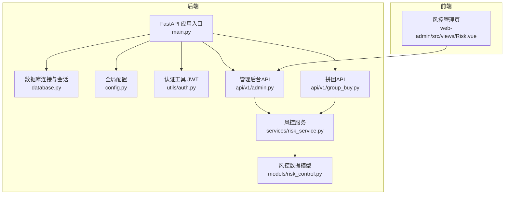
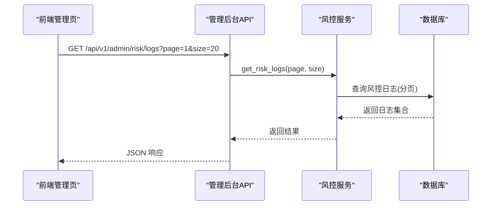
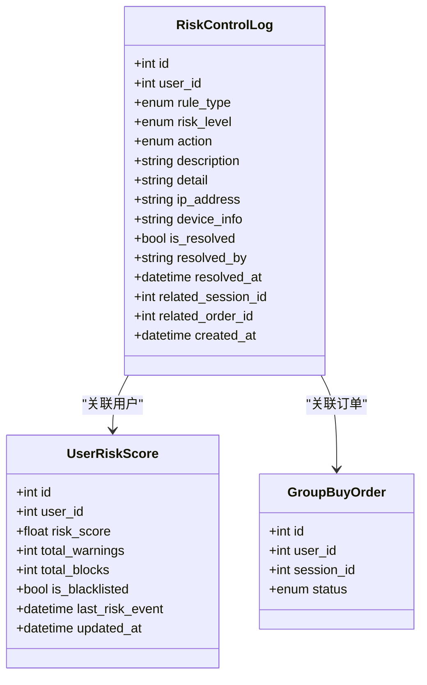
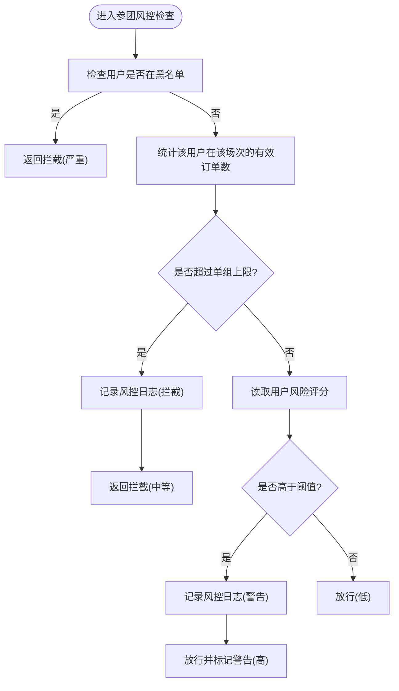
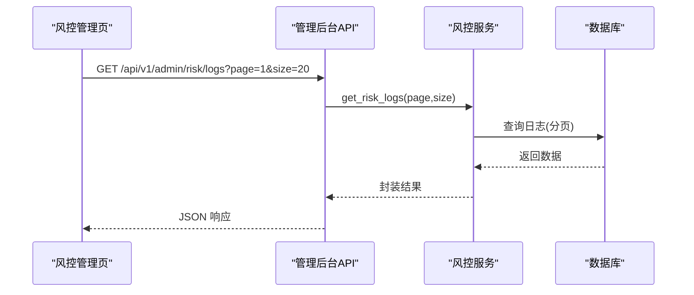
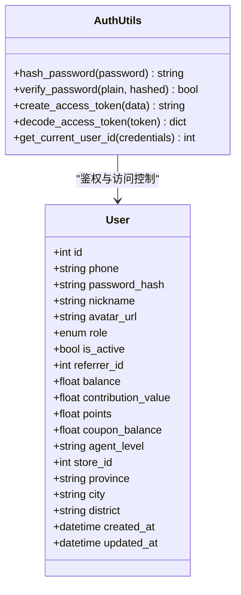
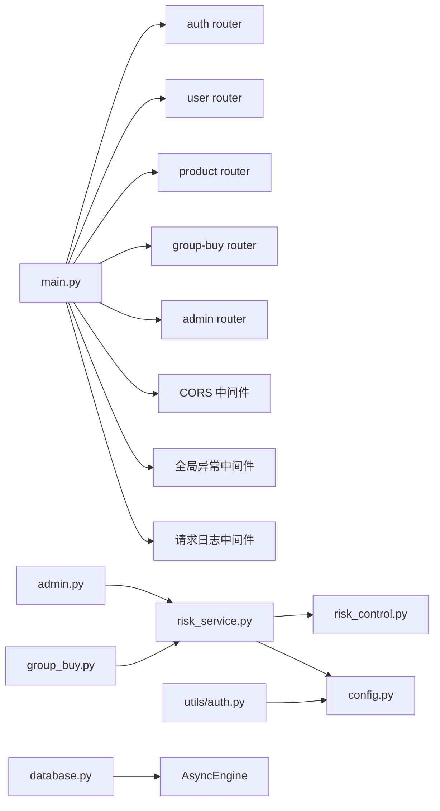

# 风控和安全系统

<cite>
**本文引用的文件**   
- [backend/app/models/risk_control.py](file://backend/app/models/risk_control.py)
- [backend/app/services/risk_service.py](file://backend/app/services/risk_service.py)
- [backend/app/api/v1/admin.py](file://backend/app/api/v1/admin.py)
- [backend/app/config.py](file://backend/app/config.py)
- [backend/app/api/v1/group_buy.py](file://backend/app/api/v1/group_buy.py)
- [frontend/web-admin/src/views/Risk.vue](file://frontend/web-admin/src/views/Risk.vue)
- [backend/app/utils/auth.py](file://backend/app/utils/auth.py)
- [backend/app/models/user.py](file://backend/app/models/user.py)
- [backend/app/main.py](file://backend/app/main.py)
- [backend/app/database.py](file://backend/app/database.py)
</cite>

## 目录
1. [简介](#简介)
2. [项目结构](#项目结构)
3. [核心组件](#核心组件)
4. [架构总览](#架构总览)
5. [详细组件分析](#详细组件分析)
6. [依赖关系分析](#依赖关系分析)
7. [性能与扩展性](#性能与扩展性)
8. [故障排查指南](#故障排查指南)
9. [结论](#结论)
10. [附录：API 参考](#附录api-参考)

## 简介
本文件为 AIxingmu 风控与安全系统的综合性文档，聚焦以下目标：
- 异常检测机制：用户行为分析、交易模式识别、设备指纹等风控手段（结合现有实现与可扩展建议）
- 限购规则：单用户参与次数限制、同一设备/IP 的限制策略、时间窗口内的频次控制（基于配置与模型扩展）
- 自动拦截机制：高风险操作实时阻断、可疑行为标记与人工审核流程
- 数据安全防护：敏感信息加密、SQL 注入防护、XSS/CSRF 防护等安全策略
- 风控规则动态配置与管理界面：后台管理面板与 API
- 监控与评分：风控事件监控、风险评分计算、黑名单管理等核心功能
- 常见风控场景处理方案与最佳实践
- 管理员实操指南：策略配置与风险事件处置

## 项目结构
后端采用 FastAPI + SQLAlchemy 异步 ORM，按领域分层组织：models（数据模型）、services（业务服务）、api（路由接口）、utils（工具）。前端提供 web-admin 管理端页面。

图表来源
- [backend/app/main.py:1-73](file://backend/app/main.py#L1-L73)
- [backend/app/database.py:1-40](file://backend/app/database.py#L1-L40)
- [backend/app/config.py:1-136](file://backend/app/config.py#L1-L136)
- [backend/app/utils/auth.py:1-50](file://backend/app/utils/auth.py#L1-L50)
- [backend/app/models/risk_control.py:1-85](file://backend/app/models/risk_control.py#L1-L85)
- [backend/app/services/risk_service.py:1-135](file://backend/app/services/risk_service.py#L1-L135)
- [backend/app/api/v1/admin.py:1-86](file://backend/app/api/v1/admin.py#L1-L86)
- [backend/app/api/v1/group_buy.py:1-65](file://backend/app/api/v1/group_buy.py#L1-L65)
- [frontend/web-admin/src/views/Risk.vue:1-202](file://frontend/web-admin/src/views/Risk.vue#L1-L202)

章节来源
- [backend/app/main.py:1-73](file://backend/app/main.py#L1-L73)
- [backend/app/database.py:1-40](file://backend/app/database.py#L1-L40)
- [backend/app/config.py:1-136](file://backend/app/config.py#L1-L136)

## 核心组件
- 风控数据模型
  - 风险等级、动作、规则类型枚举
  - 风控日志表：记录触发规则、风险等级、执行动作、详情、IP、设备信息、关联会话/订单、处理状态
  - 用户风险评分表：累计评分、警告/拦截次数、是否黑名单、最近事件时间
- 风控服务
  - 参团风控检查：黑名单校验、单组参与次数上限、风险评分阈值告警
  - 风险评分更新：根据事件类型加权累加，超过阈值加入黑名单
  - 风控日志查询：分页、按用户/等级筛选
- 管理后台 API
  - 获取风控日志（分页）
- 前端风控管理页
  - 统计概览、日志列表、黑名单管理（添加/移除）

章节来源
- [backend/app/models/risk_control.py:1-85](file://backend/app/models/risk_control.py#L1-L85)
- [backend/app/services/risk_service.py:1-135](file://backend/app/services/risk_service.py#L1-L135)
- [backend/app/api/v1/admin.py:1-86](file://backend/app/api/v1/admin.py#L1-L86)
- [frontend/web-admin/src/views/Risk.vue:1-202](file://frontend/web-admin/src/views/Risk.vue#L1-L202)

## 架构总览
风控在“业务接入层”通过服务进行规则判定与记录，管理端通过 API 查看日志与操作黑名单；前端展示统计与列表。

图表来源
- [backend/app/api/v1/admin.py:71-79](file://backend/app/api/v1/admin.py#L71-L79)
- [backend/app/services/risk_service.py:109-135](file://backend/app/services/risk_service.py#L109-L135)
- [backend/app/models/risk_control.py:40-71](file://backend/app/models/risk_control.py#L40-L71)

## 详细组件分析

### 风控数据模型与评分体系
- 风险等级：低、中、高、严重
- 风控动作：放行、警告、拦截、冻结账号
- 规则类型：单日/单场/单ID单组上限、异常行为、违规开团、金额异常、频率异常
- 风控日志：包含用户、规则、等级、动作、描述、详情JSON、IP、设备信息、处理状态、关联会话/订单、时间戳
- 用户风险评分：评分、警告/拦截计数、黑名单标志、最近事件时间

图表来源
- [backend/app/models/risk_control.py:40-85](file://backend/app/models/risk_control.py#L40-L85)
- [backend/app/models/risk_control.py:13-38](file://backend/app/models/risk_control.py#L13-L38)

章节来源
- [backend/app/models/risk_control.py:1-85](file://backend/app/models/risk_control.py#L1-L85)

### 风控服务与限购规则
- 参团风控检查流程
  - 黑名单优先判断
  - 单组参与次数上限（配置项）
  - 风险评分阈值告警（不阻断但记录警告）
- 风险评分更新
  - 事件类型映射权重
  - 超过阈值自动加入黑名单
- 风控日志查询
  - 支持按用户、风险等级过滤，分页返回

图表来源
- [backend/app/services/risk_service.py:17-74](file://backend/app/services/risk_service.py#L17-L74)
- [backend/app/services/risk_service.py:76-108](file://backend/app/services/risk_service.py#L76-L108)
- [backend/app/config.py:58](file://backend/app/config.py#L58)

章节来源
- [backend/app/services/risk_service.py:1-135](file://backend/app/services/risk_service.py#L1-L135)
- [backend/app/config.py:42-58](file://backend/app/config.py#L42-L58)

### 管理后台 API 与前端界面
- 管理后台 API
  - 获取风控日志：GET /api/v1/admin/risk/logs?page=&size=
- 前端风控管理页
  - 统计卡片：今日拦截、黑名单用户、高风险用户、平均风险评分
  - 日志表格：规则类型、动作、风险评分、详情、时间
  - 黑名单弹窗：添加/移除用户

图表来源
- [backend/app/api/v1/admin.py:71-79](file://backend/app/api/v1/admin.py#L71-L79)
- [frontend/web-admin/src/views/Risk.vue:138-146](file://frontend/web-admin/src/views/Risk.vue#L138-L146)

章节来源
- [backend/app/api/v1/admin.py:1-86](file://backend/app/api/v1/admin.py#L1-L86)
- [frontend/web-admin/src/views/Risk.vue:1-202](file://frontend/web-admin/src/views/Risk.vue#L1-L202)

### 认证与安全基础
- JWT 认证
  - 密码哈希与验证
  - Token 生成与解码
  - 从请求头提取当前用户 ID
- 用户模型
  - 角色、推荐关系、钱包资产、代理/门店关联
  - 钱包流水记录

图表来源
- [backend/app/utils/auth.py:1-50](file://backend/app/utils/auth.py#L1-L50)
- [backend/app/models/user.py:1-93](file://backend/app/models/user.py#L1-L93)

章节来源
- [backend/app/utils/auth.py:1-50](file://backend/app/utils/auth.py#L1-L50)
- [backend/app/models/user.py:1-93](file://backend/app/models/user.py#L1-L93)

### 拼团业务接入点
- 获取活跃场次、参与拼团、我的订单、场次详情
- 参与流程中可集成风控检查（当前服务已提供通用方法）

章节来源
- [backend/app/api/v1/group_buy.py:1-65](file://backend/app/api/v1/group_buy.py#L1-L65)

## 依赖关系分析
- 应用入口注册路由与中间件（CORS、全局异常、请求日志）
- 数据库引擎与会话工厂由配置驱动
- 认证工具依赖配置中的密钥与算法
- 风控服务依赖配置中的业务参数（如单组最大订单数）

图表来源
- [backend/app/main.py:34-67](file://backend/app/main.py#L34-L67)
- [backend/app/api/v1/admin.py:1-86](file://backend/app/api/v1/admin.py#L1-L86)
- [backend/app/api/v1/group_buy.py:1-65](file://backend/app/api/v1/group_buy.py#L1-L65)
- [backend/app/services/risk_service.py:1-135](file://backend/app/services/risk_service.py#L1-L135)
- [backend/app/models/risk_control.py:1-85](file://backend/app/models/risk_control.py#L1-L85)
- [backend/app/utils/auth.py:1-50](file://backend/app/utils/auth.py#L1-L50)
- [backend/app/config.py:1-136](file://backend/app/config.py#L1-L136)
- [backend/app/database.py:1-40](file://backend/app/database.py#L1-L40)

章节来源
- [backend/app/main.py:1-73](file://backend/app/main.py#L1-L73)
- [backend/app/database.py:1-40](file://backend/app/database.py#L1-L40)
- [backend/app/config.py:1-136](file://backend/app/config.py#L1-L136)

## 性能与扩展性
- 数据库索引
  - 风控日志按用户+时间、风险等级建立索引，提升查询效率
- 异步会话与连接池
  - 使用 asyncpg 引擎与连接池，提高并发能力
- 可扩展点
  - 将高频限流与设备指纹缓存至 Redis（配置项已预留 REDIS_URL）
  - 增加 IP/设备维度风控规则与时间窗口计数
  - 引入外部风控服务或规则引擎以支持动态规则热更新

章节来源
- [backend/app/models/risk_control.py:67-71](file://backend/app/models/risk_control.py#L67-L71)
- [backend/app/database.py:10-21](file://backend/app/database.py#L10-L21)
- [backend/app/config.py:21-26](file://backend/app/config.py#L21-L26)

## 故障排查指南
- 常见问题定位
  - 登录失败：检查 JWT 密钥与算法配置、Token 过期时间
  - 风控拦截误判：核对单组上限配置、用户风险评分与事件权重
  - 日志缺失：确认事务提交与异常回滚路径
- 关键断点
  - 参团风控检查：黑名单、订单计数、评分阈值
  - 评分更新：事件类型映射、黑名单阈值
  - 日志查询：分页参数、过滤条件

章节来源
- [backend/app/utils/auth.py:24-49](file://backend/app/utils/auth.py#L24-L49)
- [backend/app/services/risk_service.py:17-108](file://backend/app/services/risk_service.py#L17-L108)
- [backend/app/services/risk_service.py:109-135](file://backend/app/services/risk_service.py#L109-L135)

## 结论
当前风控系统已具备基础的黑名单、单组限购、风险评分与日志管理能力，并通过管理后台提供可视化运维能力。建议在后续迭代中增强设备指纹、IP/频次限流、动态规则管理与更细粒度的异常检测能力，同时完善安全加固措施（输入校验、输出编码、CSRF/XSS 防护），以提升整体风控效果与安全性。

## 附录：API 参考

### 管理后台
- 获取风控日志
  - 方法：GET
  - 路径：/api/v1/admin/risk/logs
  - 查询参数：page(int), size(int)
  - 返回：分页对象，包含 total、page、size、items（风控日志列表）
  - 说明：支持按用户与风险等级过滤（服务层已实现）

章节来源
- [backend/app/api/v1/admin.py:71-79](file://backend/app/api/v1/admin.py#L71-L79)
- [backend/app/services/risk_service.py:109-135](file://backend/app/services/risk_service.py#L109-L135)

### 拼团业务
- 获取活跃场次
  - 方法：GET
  - 路径：/api/v1/group-buy/sessions
  - 查询参数：level(string, 可选)
- 参与拼团
  - 方法：POST
  - 路径：/api/v1/group-buy/join
  - 请求体：JoinGroupBuyRequest（包含 session_id）
  - 说明：可在业务服务中调用风控检查
- 我的订单
  - 方法：GET
  - 路径：/api/v1/group-buy/orders
  - 查询参数：page(int), size(int)
- 场次详情
  - 方法：GET
  - 路径：/api/v1/group-buy/sessions/{session_id}

章节来源
- [backend/app/api/v1/group_buy.py:15-65](file://backend/app/api/v1/group_buy.py#L15-L65)

### 认证与安全
- 密码哈希与验证、JWT 生成与解码、获取当前用户 ID
- 用户模型字段与关系定义

章节来源
- [backend/app/utils/auth.py:1-50](file://backend/app/utils/auth.py#L1-L50)
- [backend/app/models/user.py:1-93](file://backend/app/models/user.py#L1-L93)