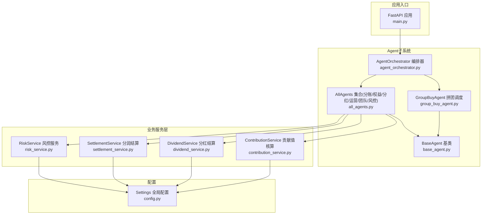
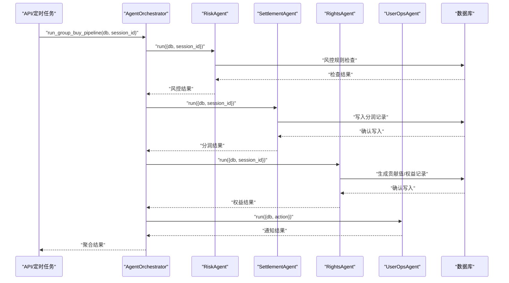
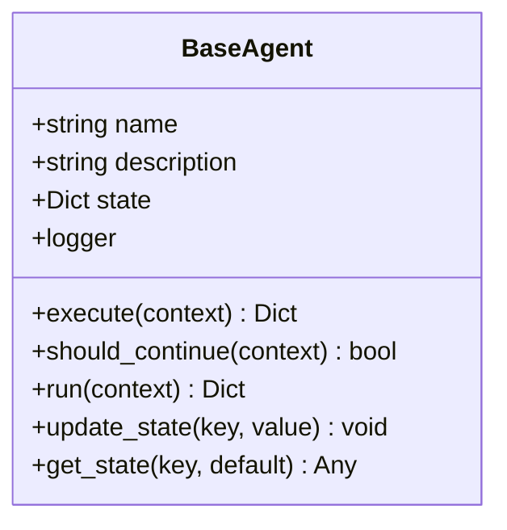
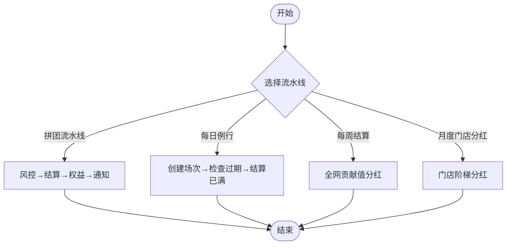
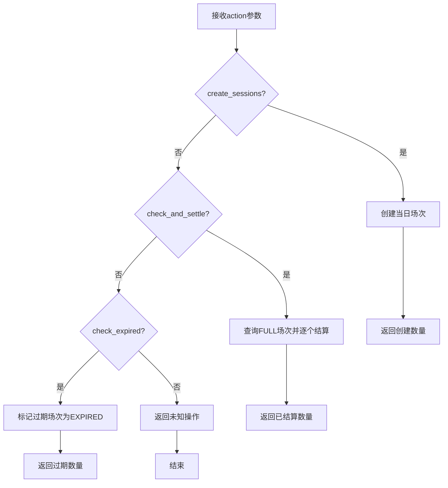
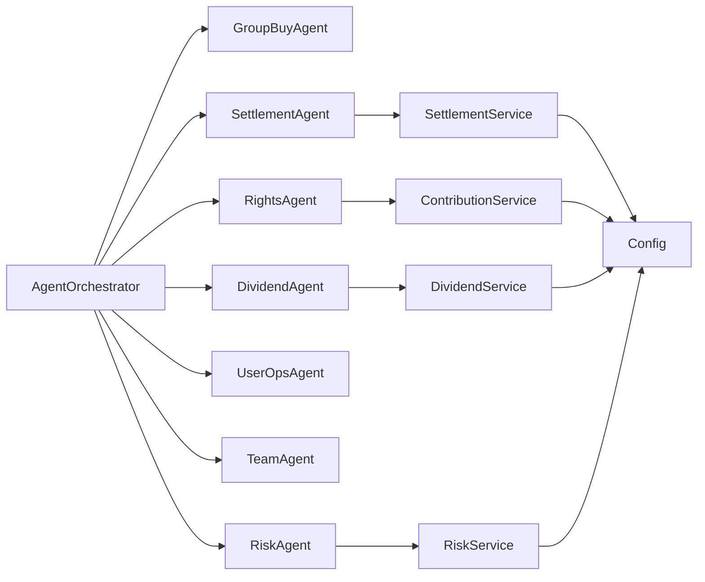

# AI Agent架构设计

<cite>
**本文引用的文件列表**
- [base_agent.py](file://backend/app/agents/base_agent.py)
- [agent_orchestrator.py](file://backend/app/agents/agent_orchestrator.py)
- [all_agents.py](file://backend/app/agents/all_agents.py)
- [group_buy_agent.py](file://backend/app/agents/group_buy_agent.py)
- [risk_service.py](file://backend/app/services/risk_service.py)
- [settlement_service.py](file://backend/app/services/settlement_service.py)
- [dividend_service.py](file://backend/app/services/dividend_service.py)
- [contribution_service.py](file://backend/app/services/contribution_service.py)
- [config.py](file://backend/app/config.py)
- [main.py](file://backend/app/main.py)
</cite>

## 目录
1. [引言](#引言)
2. [项目结构](#项目结构)
3. [核心组件](#核心组件)
4. [架构总览](#架构总览)
5. [详细组件分析](#详细组件分析)
6. [依赖关系分析](#依赖关系分析)
7. [性能与可扩展性](#性能与可扩展性)
8. [故障排查指南](#故障排查指南)
9. [结论](#结论)
10. [附录：扩展开发指南](#附录扩展开发指南)

## 引言
本设计文档面向AIxingmu系统的AI Agent体系，围绕基于LangGraph思想的Agent状态机、编排器调度算法、工作流管理以及七大专业Agent的职责划分与协作模式展开。文档提供架构图、执行流程图、数据共享与上下文传递策略、错误处理与回滚建议、监控与调试方法，并给出新Agent接入规范与扩展开发指南，帮助读者快速理解与落地实现。

## 项目结构
后端采用分层组织：API层、服务层、模型层、任务层与工具层；Agent子系统位于app/agents下，包含基类、编排器与各具体Agent实现。业务服务集中在app/services下，配置集中于app/config.py，应用入口在app/main.py。

图表来源
- [main.py:1-73](file://backend/app/main.py#L1-L73)
- [agent_orchestrator.py:1-94](file://backend/app/agents/agent_orchestrator.py#L1-L94)
- [base_agent.py:1-47](file://backend/app/agents/base_agent.py#L1-L47)
- [group_buy_agent.py:1-67](file://backend/app/agents/group_buy_agent.py#L1-L67)
- [all_agents.py:1-114](file://backend/app/agents/all_agents.py#L1-L114)
- [risk_service.py:1-135](file://backend/app/services/risk_service.py#L1-L135)
- [settlement_service.py:1-166](file://backend/app/services/settlement_service.py#L1-L166)
- [dividend_service.py:1-136](file://backend/app/services/dividend_service.py#L1-L136)
- [contribution_service.py:1-261](file://backend/app/services/contribution_service.py#L1-L261)
- [config.py:1-136](file://backend/app/config.py#L1-L136)

章节来源
- [main.py:1-73](file://backend/app/main.py#L1-L73)
- [config.py:1-136](file://backend/app/config.py#L1-L136)

## 核心组件
- BaseAgent：定义Agent抽象接口与生命周期（run/execute/should_continue），封装日志、异常捕获与状态存取。
- AgentOrchestrator：集中注册与管理7大Agent，提供流水线与定时任务编排能力，负责执行顺序控制与结果聚合。
- 专业Agent：
  - GroupBuyAgent：拼团场次创建、过期处理、满员结算触发。
  - SettlementAgent：按固定比例记录各方分润。
  - RightsAgent：根据拼团结果发放贡献值/积分/消费券等权益。
  - DividendAgent：每周一全网贡献值分红结算。
  - UserOpsAgent：用户运营通知与互动（预留LLM集成点）。
  - TeamAgent：门店月度阶梯分红统计与结算。
  - RiskAgent：实时风控校验与拦截。

章节来源
- [base_agent.py:12-47](file://backend/app/agents/base_agent.py#L12-L47)
- [agent_orchestrator.py:18-94](file://backend/app/agents/agent_orchestrator.py#L18-L94)
- [group_buy_agent.py:15-67](file://backend/app/agents/group_buy_agent.py#L15-L67)
- [all_agents.py:7-114](file://backend/app/agents/all_agents.py#L7-L114)

## 架构总览
系统以“编排器驱动的多Agent协作”为核心：API或定时任务触发编排器，编排器按既定流程调用各Agent，各Agent通过服务层访问数据库与外部资源，最终汇总结果返回给上层。

图表来源
- [agent_orchestrator.py:32-52](file://backend/app/agents/agent_orchestrator.py#L32-L52)
- [all_agents.py:101-114](file://backend/app/agents/all_agents.py#L101-L114)
- [all_agents.py:7-22](file://backend/app/agents/all_agents.py#L7-L22)
- [all_agents.py:29-46](file://backend/app/agents/all_agents.py#L29-L46)
- [all_agents.py:66-77](file://backend/app/agents/all_agents.py#L66-L77)

## 详细组件分析

### BaseAgent 基类与状态机语义
- 职责：统一Agent生命周期、日志、异常处理、状态存取。
- 状态机语义：
  - run：入口，负责开始/结束日志与异常兜底。
  - execute：子类实现的核心逻辑。
  - should_continue：决定是否需要继续流转（当前实现多为False，表示单次执行）。
  - update_state/get_state：用于保存Agent内部状态，便于后续阶段读取。

图表来源
- [base_agent.py:12-47](file://backend/app/agents/base_agent.py#L12-L47)

章节来源
- [base_agent.py:12-47](file://backend/app/agents/base_agent.py#L12-L47)

### AgentOrchestrator 编排器与工作流
- 职责：注册与管理7大Agent；提供多类流水线与定时任务编排；聚合结果。
- 关键工作流：
  - 拼团流水线：风控→结算→权益→用户运营通知。
  - 每日例行：创建场次→检查过期→结算已满场次。
  - 每周结算：全网贡献值分红。
  - 月度门店分红：按业绩阶梯计算。
- 调度算法：顺序串行执行，失败由单个Agent的run兜底返回error，编排器可据此进行重试/补偿（当前未内置自动回滚，但提供了结构化结果以便上层实现）。

图表来源
- [agent_orchestrator.py:32-85](file://backend/app/agents/agent_orchestrator.py#L32-L85)

章节来源
- [agent_orchestrator.py:18-94](file://backend/app/agents/agent_orchestrator.py#L18-L94)

### 专业Agent详解

#### GroupBuyAgent 拼团调度Agent
- 职责：定时触发开团、人数监控、结果判定、触发分账。
- 动作：
  - create_sessions：创建每日场次。
  - check_and_settle：扫描FULL状态场次并结算。
  - check_expired：将过期场次标记为EXPIRED。
- 数据交互：直接查询GroupBuySession表，调用GroupBuyService完成结算。

图表来源
- [group_buy_agent.py:21-63](file://backend/app/agents/group_buy_agent.py#L21-L63)

章节来源
- [group_buy_agent.py:15-67](file://backend/app/agents/group_buy_agent.py#L15-L67)

#### SettlementAgent 分账Agent
- 职责：订单完成后按固定比例计算各方收益并写入结算记录。
- 输入：session_id、amount、winner_id、store_id等。
- 输出：settled_records数量。

章节来源
- [all_agents.py:7-22](file://backend/app/agents/all_agents.py#L7-L22)
- [settlement_service.py:20-85](file://backend/app/services/settlement_service.py#L20-L85)

#### RightsAgent 权益核算Agent
- 职责：根据拼团结果计算并发放贡献值/积分/消费券等权益。
- 输入：amount、consumer_id、source、session_id等。
- 输出：generated_records数量。

章节来源
- [all_agents.py:29-46](file://backend/app/agents/all_agents.py#L29-L46)
- [contribution_service.py:39-143](file://backend/app/services/contribution_service.py#L39-L143)

#### DividendAgent 分红结算Agent
- 职责：每周一触发，计算全网分红，递减贡献值并发放消费券。
- 输入：db会话。
- 输出：分红统计信息。

章节来源
- [all_agents.py:52-63](file://backend/app/agents/all_agents.py#L52-L63)
- [dividend_service.py:19-123](file://backend/app/services/dividend_service.py#L19-L123)

#### UserOpsAgent 用户运营Agent
- 职责：推送开团信息、解答规则、激活用户（预留LLM对话与推送逻辑）。
- 输入：action等上下文。
- 输出：执行结果。

章节来源
- [all_agents.py:66-77](file://backend/app/agents/all_agents.py#L66-L77)

#### TeamAgent 团队管理Agent
- 职责：统计四级团队业绩、排名、核算阶梯分红。
- 输入：year_month。
- 输出：月度分红结算结果。

章节来源
- [all_agents.py:83-94](file://backend/app/agents/all_agents.py#L83-L94)
- [settlement_service.py:87-133](file://backend/app/services/settlement_service.py#L87-L133)

#### RiskAgent 风控检测Agent
- 职责：实时监控限购、异常操作、违规开团，自动拦截。
- 输入：user_id、session_id等。
- 输出：是否允许及风险等级。

章节来源
- [all_agents.py:101-114](file://backend/app/agents/all_agents.py#L101-L114)
- [risk_service.py:17-74](file://backend/app/services/risk_service.py#L17-L74)

## 依赖关系分析
- Agent与服务层解耦：Agent仅负责流程编排与上下文组装，具体业务逻辑下沉至服务层。
- 配置集中化：所有业务常量与比例均从配置模块加载，便于环境切换与灰度调整。
- 数据库访问：通过异步SQLAlchemy会话在各服务中执行读写。

图表来源
- [agent_orchestrator.py:21-30](file://backend/app/agents/agent_orchestrator.py#L21-L30)
- [all_agents.py:7-114](file://backend/app/agents/all_agents.py#L7-L114)
- [settlement_service.py:1-166](file://backend/app/services/settlement_service.py#L1-L166)
- [contribution_service.py:1-261](file://backend/app/services/contribution_service.py#L1-L261)
- [dividend_service.py:1-136](file://backend/app/services/dividend_service.py#L1-L136)
- [risk_service.py:1-135](file://backend/app/services/risk_service.py#L1-L135)
- [config.py:1-136](file://backend/app/config.py#L1-L136)

章节来源
- [agent_orchestrator.py:18-94](file://backend/app/agents/agent_orchestrator.py#L18-L94)
- [all_agents.py:1-114](file://backend/app/agents/all_agents.py#L1-114)
- [config.py:1-136](file://backend/app/config.py#L1-L136)

## 性能与可扩展性
- 异步执行：Agent与服务层均采用异步IO，提升并发处理能力。
- 批量处理：如月度分红与周度分红在服务层对数据进行分组聚合，减少多次往返。
- 可扩展点：
  - 新增Agent：继承BaseAgent，实现execute与should_continue，并在编排器中注册。
  - 并行化：对于无依赖的Agent可考虑并行执行（需引入并发控制与结果合并机制）。
  - 幂等与重试：在关键写路径增加幂等键与重试策略，避免重复结算。
  - 缓存与限流：热点查询（如风控评分）可引入Redis缓存与限流保护。

[本节为通用指导，不直接分析具体文件]

## 故障排查指南
- 日志定位：
  - BaseAgent.run统一记录开始/结束与异常堆栈，可按agent.{name}命名空间检索。
  - 服务层关键路径应补充结构化日志（如用户ID、会话ID、金额、结果码）。
- 常见错误：
  - 数据库连接池耗尽：检查DATABASE_POOL_SIZE与并发量，必要时扩容。
  - 风控误拦截：核对黑名单与阈值配置，查看风控日志明细。
  - 分润不一致：核对配置中的分配比例与让利比例，确保与财务对账一致。
- 诊断步骤：
  - 使用健康检查端点验证服务可用性。
  - 拉取最近一次流水线的结果字典，定位失败Agent与错误信息。
  - 针对高风险事件，查询风控日志与用户风险评分。

章节来源
- [base_agent.py:31-40](file://backend/app/agents/base_agent.py#L31-L40)
- [main.py:70-73](file://backend/app/main.py#L70-L73)
- [risk_service.py:110-135](file://backend/app/services/risk_service.py#L110-L135)

## 结论
AIxingmu的Agent体系以BaseAgent为抽象基础，通过AgentOrchestrator实现清晰的工作流编排与结果聚合。七大专业Agent覆盖风控、结算、权益、分红、运营与团队管理等核心场景，配合服务层与配置中心形成高内聚、低耦合的可扩展架构。建议在后续迭代中完善并行执行、事务补偿与监控指标，进一步提升稳定性与可观测性。

[本节为总结性内容，不直接分析具体文件]

## 附录：扩展开发指南

### 新Agent接入规范
- 继承BaseAgent，实现execute与should_continue。
- 在AgentOrchestrator中注册新Agent实例。
- 如需加入流水线，在对应编排方法中插入调用位置，并确保上下文字段完备。
- 为关键路径添加日志与异常处理，保证可观测性与可恢复性。

章节来源
- [base_agent.py:21-40](file://backend/app/agents/base_agent.py#L21-L40)
- [agent_orchestrator.py:21-30](file://backend/app/agents/agent_orchestrator.py#L21-L30)

### Agent间通信协议与数据共享
- 上下文传递：通过context字典在各Agent间传递必要参数（如db、session_id、amount等）。
- 数据共享：优先通过数据库持久化共享状态，避免内存共享带来的并发问题。
- 事件驱动：可在服务层发布领域事件（如“拼团成功”、“分红完成”），供其他Agent订阅处理。

章节来源
- [agent_orchestrator.py:32-52](file://backend/app/agents/agent_orchestrator.py#L32-L52)
- [all_agents.py:11-18](file://backend/app/agents/all_agents.py#L11-L18)

### 状态转换机制（LangGraph风格）
- 状态节点：每个Agent视为一个状态节点，execute为节点处理函数。
- 边与条件：should_continue作为边判断条件，决定是否继续流转。
- 状态存储：BaseAgent.state用于保存中间态，支持跨阶段读取。

章节来源
- [base_agent.py:18-46](file://backend/app/agents/base_agent.py#L18-L46)

### 错误处理与回滚机制
- 单Agent异常：BaseAgent.run捕获异常并返回error结构，编排器可据此决策重试或终止。
- 事务边界：服务层应在关键写路径使用事务，失败时回滚。
- 补偿策略：对幂等写操作，可通过唯一键去重；对非幂等操作，引入补偿任务与人工干预通道。

章节来源
- [base_agent.py:34-40](file://backend/app/agents/base_agent.py#L34-L40)
- [settlement_service.py:84-85](file://backend/app/services/settlement_service.py#L84-L85)
- [dividend_service.py:117-118](file://backend/app/services/dividend_service.py#L117-L118)

### 性能监控与调试工具
- 指标采集：在BaseAgent.run前后埋点耗时与成功率，在服务层记录关键SQL耗时。
- 链路追踪：为每次流水线生成trace_id，贯穿API→编排器→Agent→服务层。
- 可视化：结合日志系统与APM工具，展示流水线执行时序与瓶颈。

[本节为通用指导，不直接分析具体文件]