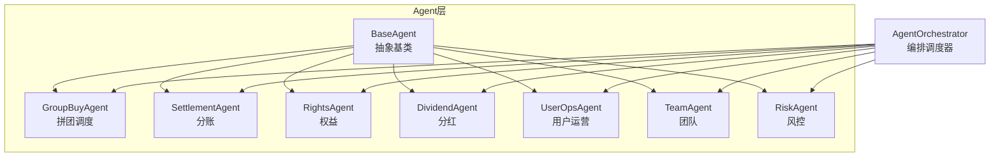
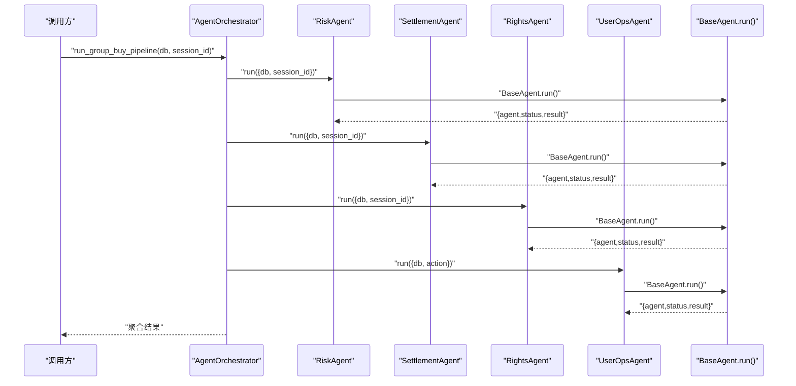
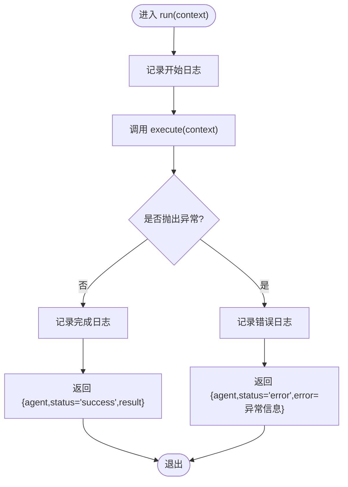
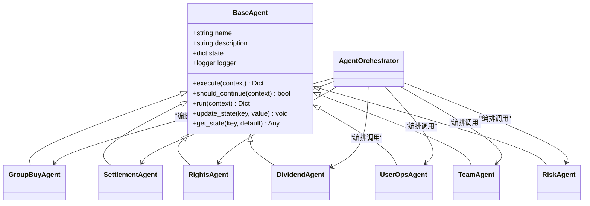

# Agent基类设计

<cite>
**本文引用的文件**
- [backend/app/agents/base_agent.py](file://backend/app/agents/base_agent.py)
- [backend/app/agents/group_buy_agent.py](file://backend/app/agents/group_buy_agent.py)
- [backend/app/agents/all_agents.py](file://backend/app/agents/all_agents.py)
- [backend/app/agents/agent_orchestrator.py](file://backend/app/agents/agent_orchestrator.py)
- [backend/app/config.py](file://backend/app/config.py)
</cite>

## 目录
1. [引言](#引言)
2. [项目结构](#项目结构)
3. [核心组件](#核心组件)
4. [架构总览](#架构总览)
5. [详细组件分析](#详细组件分析)
6. [依赖关系分析](#依赖关系分析)
7. [性能与并发特性](#性能与并发特性)
8. [故障排查指南](#故障排查指南)
9. [结论](#结论)
10. [附录：最佳实践与示例](#附录最佳实践与示例)

## 引言
本设计文档面向AIxingmu系统的Agent体系，聚焦BaseAgent抽象类的核心设计理念与实现规范。内容涵盖：
- Agent生命周期管理、状态机模式思想、异步执行框架
- execute()与should_continue()的职责划分
- run()的完整执行流程（异常处理、日志记录、状态管理）
- state字典的状态管理机制及update_state()/get_state()使用模式
- 自定义Agent开发的最佳实践与代码示例路径
- Agent命名规范、日志格式标准、错误处理策略

## 项目结构
Agent相关代码位于后端模块的agents子包中，采用“基类+具体Agent+编排器”的分层组织方式：
- base_agent.py：定义BaseAgent抽象基类，提供统一的生命周期、状态管理与执行外壳
- all_agents.py：集中注册若干领域Agent（分账、权益、分红、用户运营、团队、风控等）
- group_buy_agent.py：拼团调度Agent的具体实现
- agent_orchestrator.py：多Agent编排调度器，串联业务流水线

图表来源
- [backend/app/agents/base_agent.py:12-47](file://backend/app/agents/base_agent.py#L12-L47)
- [backend/app/agents/all_agents.py:6-114](file://backend/app/agents/all_agents.py#L6-L114)
- [backend/app/agents/group_buy_agent.py:14-67](file://backend/app/agents/group_buy_agent.py#L14-L67)
- [backend/app/agents/agent_orchestrator.py:18-94](file://backend/app/agents/agent_orchestrator.py#L18-L94)

章节来源
- [backend/app/agents/base_agent.py:12-47](file://backend/app/agents/base_agent.py#L12-L47)
- [backend/app/agents/all_agents.py:6-114](file://backend/app/agents/all_agents.py#L6-L114)
- [backend/app/agents/group_buy_agent.py:14-67](file://backend/app/agents/group_buy_agent.py#L14-L67)
- [backend/app/agents/agent_orchestrator.py:18-94](file://backend/app/agents/agent_orchestrator.py#L18-L94)

## 核心组件
- BaseAgent抽象基类
  - 职责：定义Agent通用接口与执行外壳；维护name/description/state/logger；提供run()统一入口；提供state读写方法
  - 关键抽象方法：execute(context)、should_continue(context)
  - 运行外壳：run(context)负责日志、异常捕获与结果包装
- 具体Agent
  - GroupBuyAgent：拼团场次创建、过期处理、满员结算触发
  - SettlementAgent/RightsAgent/DividendAgent/UserOpsAgent/TeamAgent/RiskAgent：分别承担分账、权益发放、分红、用户运营、团队统计、风控校验等职责
- AgentOrchestrator编排器
  - 职责：按业务流水线顺序调用各Agent.run()，聚合结果并返回

章节来源
- [backend/app/agents/base_agent.py:12-47](file://backend/app/agents/base_agent.py#L12-L47)
- [backend/app/agents/all_agents.py:6-114](file://backend/app/agents/all_agents.py#L6-L114)
- [backend/app/agents/group_buy_agent.py:14-67](file://backend/app/agents/group_buy_agent.py#L14-L67)
- [backend/app/agents/agent_orchestrator.py:18-94](file://backend/app/agents/agent_orchestrator.py#L18-L94)

## 架构总览
下图展示了从编排器到具体Agent的执行链路，以及BaseAgent提供的统一外壳能力。

图表来源
- [backend/app/agents/agent_orchestrator.py:32-52](file://backend/app/agents/agent_orchestrator.py#L32-L52)
- [backend/app/agents/base_agent.py:31-41](file://backend/app/agents/base_agent.py#L31-L41)

## 详细组件分析

### BaseAgent抽象类
- 设计理念
  - 单一职责：将“执行外壳”与“业务逻辑”解耦，具体Agent只需关注execute()和should_continue()
  - 状态机思想：通过state字典承载Agent内部状态，配合update_state()/get_state()进行状态读写；should_continue()可基于state决定是否需要继续执行（当前默认返回False，表示单次执行）
  - 异步执行框架：所有对外接口均为async，便于在事件循环中并发调度多个Agent
  - 统一日志与异常：run()统一记录开始/结束/失败日志，并将异常转换为结构化错误响应
- 关键成员与方法
  - __init__(name, description)：初始化名称、描述、state字典、logger实例
  - execute(context)：抽象方法，由子类实现核心业务逻辑
  - should_continue(context)：抽象方法，由子类决定是否继续执行（如轮询、重试、迭代）
  - run(context)：统一执行外壳，包含日志、异常捕获、结果包装
  - update_state(key, value)/get_state(key, default)：状态读写工具
- 状态管理机制
  - state为Dict[str, Any]，用于保存Agent运行期上下文（例如中间结果、标志位、计数器等）
  - 建议：仅保存轻量数据；复杂对象尽量通过context传递或持久化存储
- 执行流程（run）
  - 记录开始日志
  - 调用execute(context)
  - 成功：记录完成日志，返回{agent, status="success", result}
  - 异常：记录错误日志，返回{agent, status="error", error=异常信息}

图表来源
- [backend/app/agents/base_agent.py:31-41](file://backend/app/agents/base_agent.py#L31-L41)

章节来源
- [backend/app/agents/base_agent.py:12-47](file://backend/app/agents/base_agent.py#L12-L47)

### 具体Agent实现要点
- GroupBuyAgent
  - 职责：定时开团、检查过期、满员结算触发
  - 典型动作：根据action分支执行不同任务；对异常进行局部记录与容错
  - should_continue：返回False，表示单次执行
- 其他Agent（Settlement/Rights/Dividend/UserOps/Team/Risk）
  - 均继承BaseAgent，实现execute()与should_continue()
  - 通常should_continue返回False，表示一次性任务
  - execute()内调用对应Service层完成业务计算与持久化

章节来源
- [backend/app/agents/group_buy_agent.py:14-67](file://backend/app/agents/group_buy_agent.py#L14-L67)
- [backend/app/agents/all_agents.py:6-114](file://backend/app/agents/all_agents.py#L6-L114)

### AgentOrchestrator编排器
- 职责：按业务流水线顺序调用各Agent.run()，收集并返回结果
- 典型流水线：风控→结算→权益→通知
- 扩展点：新增Agent后，在__init__中注册并在相应流水线方法中编排调用

章节来源
- [backend/app/agents/agent_orchestrator.py:18-94](file://backend/app/agents/agent_orchestrator.py#L18-L94)

## 依赖关系分析
- BaseAgent无外部依赖，仅使用logging与typing
- 具体Agent依赖各自服务层（如GroupBuyService、SettlementService等）
- Orchestrator依赖所有已注册的Agent实例，形成松耦合的“组合式”架构

图表来源
- [backend/app/agents/base_agent.py:12-47](file://backend/app/agents/base_agent.py#L12-L47)
- [backend/app/agents/all_agents.py:6-114](file://backend/app/agents/all_agents.py#L6-L114)
- [backend/app/agents/group_buy_agent.py:14-67](file://backend/app/agents/group_buy_agent.py#L14-L67)
- [backend/app/agents/agent_orchestrator.py:18-94](file://backend/app/agents/agent_orchestrator.py#L18-L94)

章节来源
- [backend/app/agents/base_agent.py:12-47](file://backend/app/agents/base_agent.py#L12-L47)
- [backend/app/agents/all_agents.py:6-114](file://backend/app/agents/all_agents.py#L6-L114)
- [backend/app/agents/group_buy_agent.py:14-67](file://backend/app/agents/group_buy_agent.py#L14-L67)
- [backend/app/agents/agent_orchestrator.py:18-94](file://backend/app/agents/agent_orchestrator.py#L18-L94)

## 性能与并发特性
- 异步执行：所有Agent接口均为async，可在事件循环中并发调度，提升吞吐
- 数据库会话：通过context传入AsyncSession，避免在Agent内部持有连接，降低资源占用
- 状态最小化：state仅保存轻量数据，避免大对象驻留内存
- 幂等性：建议Agent的execute()具备幂等性，便于重试与恢复
- 限流与退避：若涉及外部API（如LLM），应在Service层实现重试与退避策略

[本节为通用指导，不直接分析具体文件]

## 故障排查指南
- 常见错误定位
  - 查看run()返回的status字段是否为error，并结合日志中的错误信息进行定位
  - 确认context中必需参数是否存在（如db、session_id等）
  - 检查should_continue()逻辑是否导致提前终止
- 日志规范
  - 使用logger.getLogger(f"agent.{self.name}")获取独立logger，便于过滤与追踪
  - 建议在execute()内部对关键步骤打点日志，结合上下文ID（如session_id）关联追踪
- 异常处理
  - BaseAgent.run()会捕获异常并返回结构化错误，上层可根据status判断
  - 对于可恢复错误，可在Service层实现重试；不可恢复错误应明确记录并快速失败

章节来源
- [backend/app/agents/base_agent.py:31-41](file://backend/app/agents/base_agent.py#L31-L41)
- [backend/app/agents/group_buy_agent.py:40-46](file://backend/app/agents/group_buy_agent.py#L40-L46)

## 结论
BaseAgent以简洁而强大的抽象封装了Agent的通用能力：统一的执行外壳、状态管理、日志与异常处理。具体Agent仅需专注业务逻辑（execute）与继续条件（should_continue）。配合AgentOrchestrator的编排，系统实现了高内聚、低耦合的Agent生态，易于扩展与维护。

[本节为总结性内容，不直接分析具体文件]

## 附录：最佳实践与示例

### 自定义Agent开发步骤
- 新建Agent类并继承BaseAgent
- 实现execute(context)：读取context参数，调用Service层完成业务逻辑，返回结果字典
- 实现should_continue(context)：根据业务需要返回True/False（多数场景返回False）
- 在all_agents.py中注册新Agent类
- 在agent_orchestrator.py中编排调用（如需纳入流水线）

参考路径
- [backend/app/agents/all_agents.py:6-114](file://backend/app/agents/all_agents.py#L6-L114)
- [backend/app/agents/agent_orchestrator.py:18-94](file://backend/app/agents/agent_orchestrator.py#L18-L94)

### 命名规范
- Agent类名：语义清晰，动词+名词形式（如SettlementAgent、RiskAgent）
- 实例name：小写下划线风格，带后缀_agent（如settlement_agent）
- 描述description：简明扼要说明职责范围

参考路径
- [backend/app/agents/all_agents.py:6-114](file://backend/app/agents/all_agents.py#L6-L114)
- [backend/app/agents/group_buy_agent.py:14-20](file://backend/app/agents/group_buy_agent.py#L14-L20)

### 日志格式标准
- Logger命名：agent.{agent_name}
- 关键日志点：
  - run()开始/结束/失败
  - execute()内部关键步骤（如查询、写入、外部调用）
- 上下文关联：在日志中包含session_id、user_id等业务标识

参考路径
- [backend/app/agents/base_agent.py:15-20](file://backend/app/agents/base_agent.py#L15-L20)
- [backend/app/agents/base_agent.py:31-41](file://backend/app/agents/base_agent.py#L31-L41)

### 错误处理策略
- 统一外壳：BaseAgent.run()捕获异常并返回结构化错误
- 局部容错：在execute()中对可恢复错误进行try/except并记录日志
- 快速失败：不可恢复错误立即返回，避免级联失败

参考路径
- [backend/app/agents/base_agent.py:31-41](file://backend/app/agents/base_agent.py#L31-L41)
- [backend/app/agents/group_buy_agent.py:40-46](file://backend/app/agents/group_buy_agent.py#L40-L46)

### 状态管理使用模式
- 更新状态：update_state(key, value)
- 读取状态：get_state(key, default=None)
- 适用场景：保存中间结果、计数器、标志位等轻量数据

参考路径
- [backend/app/agents/base_agent.py:42-47](file://backend/app/agents/base_agent.py#L42-L47)

### 配置与环境
- AI Agent相关配置（如LLM API Key/Model）位于全局配置模块，可按需注入至Agent或Service层

参考路径
- [backend/app/config.py:125-129](file://backend/app/config.py#L125-L129)