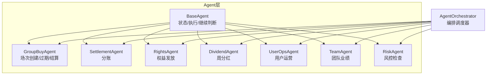
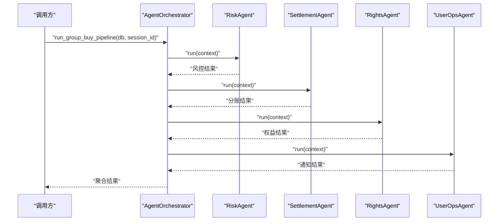
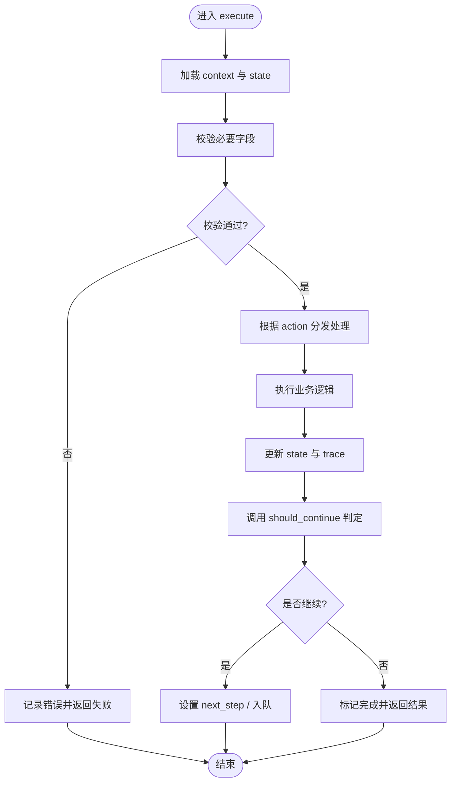
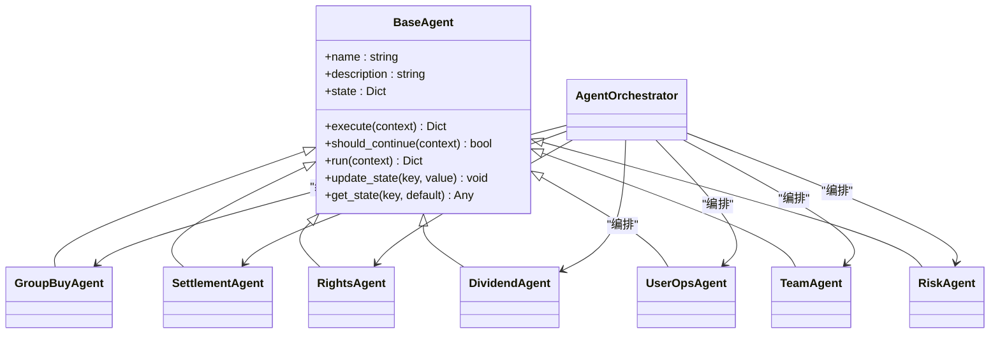

# Agent状态机机制

<cite>
**本文引用的文件**   
- [backend/app/agents/base_agent.py](file://backend/app/agents/base_agent.py)
- [backend/app/agents/all_agents.py](file://backend/app/agents/all_agents.py)
- [backend/app/agents/group_buy_agent.py](file://backend/app/agents/group_buy_agent.py)
- [backend/app/agents/agent_orchestrator.py](file://backend/app/agents/agent_orchestrator.py)
- [backend/app/models/user_agent.py](file://backend/app/models/user_agent.py)
</cite>

## 目录
1. [简介](#简介)
2. [项目结构](#项目结构)
3. [核心组件](#核心组件)
4. [架构总览](#架构总览)
5. [详细组件分析](#详细组件分析)
6. [依赖关系分析](#依赖关系分析)
7. [性能与内存管理](#性能与内存管理)
8. [故障排查指南](#故障排查指南)
9. [结论](#结论)
10. [附录](#附录)

## 简介
本文件面向AIxingmu系统的Agent状态机机制，结合现有代码实现，系统化阐述：
- 基于LangGraph思想的状态机设计原理（状态定义、转换规则、事件驱动）
- 状态持久化机制（序列化、恢复策略、版本兼容）
- 复杂状态管理（嵌套状态、继承、校验）
- 条件判断逻辑（should_continue模式）
- 调试工具与方法（快照、轨迹、诊断）
- 性能优化与内存管理策略

说明：当前仓库中未直接引入LangGraph库，但Agent基类与编排器已体现“状态+执行+继续判断”的通用模式。本文在尊重现有实现的基础上，给出可落地的扩展方案与最佳实践。

## 项目结构
后端Agent相关代码集中在 backend/app/agents 目录，包含：
- BaseAgent抽象基类：定义状态、执行入口、继续判断接口
- 具体Agent：分账、权益、分红、用户运营、团队、风控、拼团调度等
- 编排器：串联多Agent流水线与定时任务

图表来源
- [backend/app/agents/base_agent.py:12-46](file://backend/app/agents/base_agent.py#L12-L46)
- [backend/app/agents/group_buy_agent.py:15-66](file://backend/app/agents/group_buy_agent.py#L15-L66)
- [backend/app/agents/all_agents.py:7-113](file://backend/app/agents/all_agents.py#L7-L113)
- [backend/app/agents/agent_orchestrator.py:18-93](file://backend/app/agents/agent_orchestrator.py#L18-L93)

章节来源
- [backend/app/agents/base_agent.py:12-46](file://backend/app/agents/base_agent.py#L12-L46)
- [backend/app/agents/all_agents.py:7-113](file://backend/app/agents/all_agents.py#L7-L113)
- [backend/app/agents/group_buy_agent.py:15-66](file://backend/app/agents/group_buy_agent.py#L15-L66)
- [backend/app/agents/agent_orchestrator.py:18-93](file://backend/app/agents/agent_orchestrator.py#L18-L93)

## 核心组件
- BaseAgent
  - 职责：统一状态容器、日志、执行生命周期封装、状态读写API
  - 关键方法：execute（子类实现）、should_continue（子类实现）、run（统一包装）
- 具体Agent
  - GroupBuyAgent：场次创建、过期处理、满员结算
  - SettlementAgent：按固定比例计算收益并写入结算记录
  - RightsAgent：贡献值/积分/消费券发放
  - DividendAgent：每周全网分红
  - UserOpsAgent：用户通知与互动
  - TeamAgent：团队业绩统计与阶梯分红
  - RiskAgent：风控拦截与合规校验
- AgentOrchestrator
  - 职责：编排多Agent流水线、定时任务、结果聚合

章节来源
- [backend/app/agents/base_agent.py:12-46](file://backend/app/agents/base_agent.py#L12-L46)
- [backend/app/agents/all_agents.py:7-113](file://backend/app/agents/all_agents.py#L7-L113)
- [backend/app/agents/group_buy_agent.py:15-66](file://backend/app/agents/group_buy_agent.py#L15-L66)
- [backend/app/agents/agent_orchestrator.py:18-93](file://backend/app/agents/agent_orchestrator.py#L18-L93)

## 架构总览
从“状态机视角”看，每个Agent是一个有状态节点；编排器是控制流中心；数据库与服务是外部依赖。

图表来源
- [backend/app/agents/agent_orchestrator.py:32-52](file://backend/app/agents/agent_orchestrator.py#L32-L52)
- [backend/app/agents/all_agents.py:100-113](file://backend/app/agents/all_agents.py#L100-L113)
- [backend/app/agents/all_agents.py:7-21](file://backend/app/agents/all_agents.py#L7-L21)
- [backend/app/agents/all_agents.py:29-45](file://backend/app/agents/all_agents.py#L29-L45)
- [backend/app/agents/all_agents.py:65-76](file://backend/app/agents/all_agents.py#L65-L76)

## 详细组件分析

### 状态机设计与状态定义
- 状态容器
  - 每个Agent实例持有state字典，用于保存上下文与中间结果
  - 提供update_state/get_state进行状态读写
- 状态语义
  - 建议将state划分为：输入上下文、中间产物、输出结果、元数据（如trace、metrics）
- 状态版本
  - 建议在state中增加version字段，便于迁移与兼容性校验

章节来源
- [backend/app/agents/base_agent.py:15-19](file://backend/app/agents/base_agent.py#L15-L19)
- [backend/app/agents/base_agent.py:42-46](file://backend/app/agents/base_agent.py#L42-L46)

### 状态转换规则与事件驱动模型
- 事件驱动
  - 通过context传入action、业务参数等事件信息，Agent内部根据action分支处理
  - 示例：GroupBuyAgent根据action区分“创建场次/检查过期/结算”
- 转换规则
  - 单次执行型：should_continue返回False，表示一次完成
  - 循环推进型：should_continue返回True时，由上层编排器或状态机引擎决定下一步节点
- 建议
  - 将“是否继续”的判断依据显式化到state中（例如next_step、continue_flag），便于追踪与回放

章节来源
- [backend/app/agents/group_buy_agent.py:21-63](file://backend/app/agents/group_buy_agent.py#L21-L63)
- [backend/app/agents/all_agents.py:20-21](file://backend/app/agents/all_agents.py#L20-L21)
- [backend/app/agents/all_agents.py:44-45](file://backend/app/agents/all_agents.py#L44-L45)
- [backend/app/agents/all_agents.py:61-62](file://backend/app/agents/all_agents.py#L61-L62)
- [backend/app/agents/all_agents.py:75-76](file://backend/app/agents/all_agents.py#L75-L76)
- [backend/app/agents/all_agents.py:93-94](file://backend/app/agents/all_agents.py#L93-L94)
- [backend/app/agents/all_agents.py:112-113](file://backend/app/agents/all_agents.py#L112-L113)
- [backend/app/agents/group_buy_agent.py:65-66](file://backend/app/agents/group_buy_agent.py#L65-L66)

### should_continue()方法的实现模式
- 现状
  - 多数Agent的should_continue直接返回False，表明为一次性任务
  - 可在需要循环的场景下改为读取state中的“下一步”或“重试次数”，动态决策
- 推荐模式
  - 基于业务条件：如存在待处理批次、仍有未消费消息
  - 基于资源水位：如队列长度、错误率阈值
  - 基于时间窗口：如轮询间隔、冷却期

章节来源
- [backend/app/agents/all_agents.py:20-21](file://backend/app/agents/all_agents.py#L20-L21)
- [backend/app/agents/all_agents.py:44-45](file://backend/app/agents/all_agents.py#L44-L45)
- [backend/app/agents/all_agents.py:61-62](file://backend/app/agents/all_agents.py#L61-L62)
- [backend/app/agents/all_agents.py:75-76](file://backend/app/agents/all_agents.py#L75-L76)
- [backend/app/agents/all_agents.py:93-94](file://backend/app/agents/all_agents.py#L93-L94)
- [backend/app/agents/all_agents.py:112-113](file://backend/app/agents/all_agents.py#L112-L113)
- [backend/app/agents/group_buy_agent.py:65-66](file://backend/app/agents/group_buy_agent.py#L65-L66)

### 状态持久化机制（序列化、恢复、版本兼容）
- 目标
  - 支持进程重启后恢复Agent运行态
  - 支持跨版本升级时的状态迁移
- 建议方案
  - 序列化：将state转为JSON/MessagePack，附带schema_version
  - 存储：使用独立表或KV存储（如Redis/DB），以session_id或task_id为键
  - 恢复：启动时加载最近一次快照，校验schema_version并执行迁移脚本
  - 一致性：在事务边界内更新快照，避免脏读
- 参考模型
  - user_agent_memories可用于对话记忆持久化的范式，可作为Agent状态持久化的参考

章节来源
- [backend/app/models/user_agent.py:37-54](file://backend/app/models/user_agent.py#L37-L54)

### 复杂状态管理（嵌套状态、继承、验证）
- 嵌套状态
  - 将state拆分为子对象：input_ctx、work_items、output、meta
  - 便于局部更新与增量序列化
- 继承
  - 通过BaseAgent统一能力，子类按需覆盖execute/should_continue
  - 可扩展出“带重试/带超时/带限流”的中间基类
- 验证
  - 在进入execute前对state进行必填字段校验
  - 在should_continue中对“下一步”合法性进行断言

章节来源
- [backend/app/agents/base_agent.py:12-29](file://backend/app/agents/base_agent.py#L12-L29)

### 状态转换的条件判断流程（算法级）

[本图为概念性流程图，不直接映射具体源码文件]

## 依赖关系分析
- 组件耦合
  - AgentOrchestrator强依赖各Agent实例，负责顺序编排
  - 各Agent依赖对应Service与ORM模型
- 外部依赖
  - 数据库会话AsyncSession在各Agent间传递
  - 业务服务（分账、权益、风控、团队等）

图表来源
- [backend/app/agents/base_agent.py:12-46](file://backend/app/agents/base_agent.py#L12-L46)
- [backend/app/agents/group_buy_agent.py:15-66](file://backend/app/agents/group_buy_agent.py#L15-L66)
- [backend/app/agents/all_agents.py:7-113](file://backend/app/agents/all_agents.py#L7-L113)
- [backend/app/agents/agent_orchestrator.py:18-93](file://backend/app/agents/agent_orchestrator.py#L18-L93)

章节来源
- [backend/app/agents/agent_orchestrator.py:18-93](file://backend/app/agents/agent_orchestrator.py#L18-L93)
- [backend/app/agents/all_agents.py:7-113](file://backend/app/agents/all_agents.py#L7-L113)
- [backend/app/agents/group_buy_agent.py:15-66](file://backend/app/agents/group_buy_agent.py#L15-L66)
- [backend/app/agents/base_agent.py:12-46](file://backend/app/agents/base_agent.py#L12-L46)

## 性能与内存管理
- 状态体积控制
  - 仅保留必要字段，避免大对象常驻内存
  - 对历史trace采用分页/滚动归档
- 并发与批处理
  - 批量查询与批量写，减少DB往返
  - 对长耗时操作拆分微任务，配合should_continue做推进
- 资源限制
  - 增加超时、重试退避、熔断降级
- 序列化成本
  - 选择高效格式（MessagePack/Protobuf），必要时压缩
- 监控指标
  - 记录执行时长、吞吐、错误率、状态大小分布

[本节为通用指导，无需源码引用]

## 故障排查指南
- 日志定位
  - 利用BaseAgent内置logger，统一输出开始/结束/异常
- 状态快照
  - 在执行前后序列化state，存入独立表或KV，便于回放
- 执行轨迹
  - 在state.meta.trace中追加步骤、耗时、错误堆栈摘要
- 常见问题
  - should_continue误判导致死循环：检查next_step与continue_flag
  - 状态不一致：确保在事务边界内更新状态与业务数据
  - 版本不兼容：通过schema_version与迁移脚本保障平滑升级

章节来源
- [backend/app/agents/base_agent.py:31-40](file://backend/app/agents/base_agent.py#L31-L40)

## 结论
当前Agent体系已具备“状态+执行+继续判断”的基础形态，并通过编排器实现了多Agent协作。建议在此基础上：
- 引入明确的状态机引擎（如LangGraph）以实现可视化图与自动调度
- 完善状态持久化与恢复机制，提升鲁棒性与可观测性
- 强化状态校验与版本管理，支撑长期演进

[本节为总结性内容，无需源码引用]

## 附录
- 术语
  - 状态机：以状态和转移为核心的计算模型
  - 事件驱动：以事件触发状态转移与处理
  - 编排器：协调多个组件的执行顺序与数据流转

[本节为概念性内容，无需源码引用]