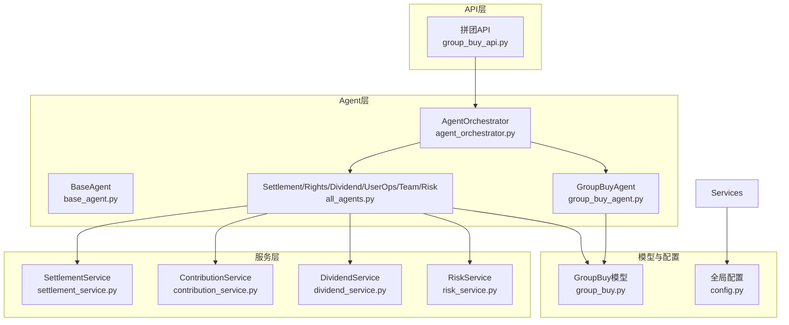
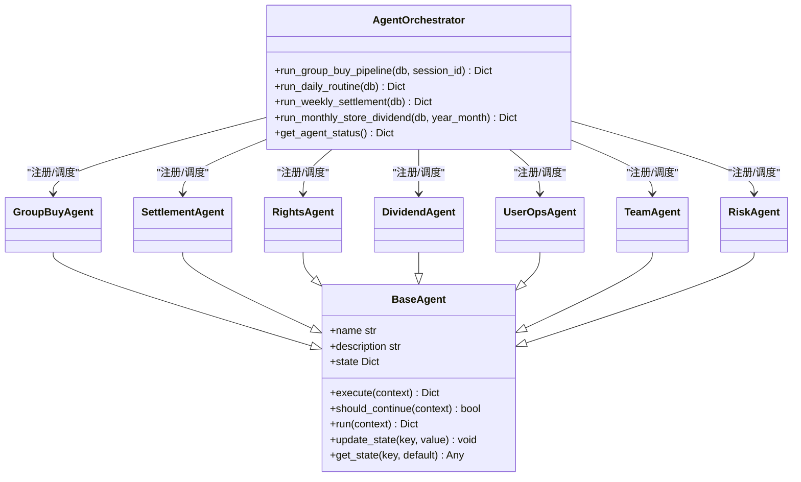
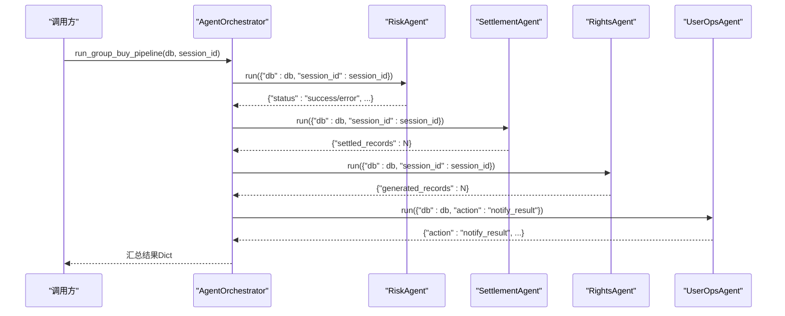
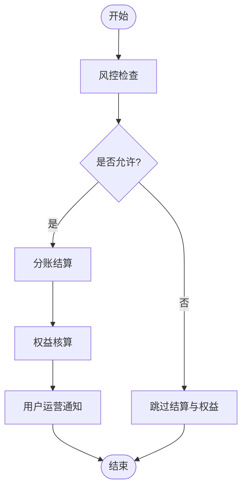
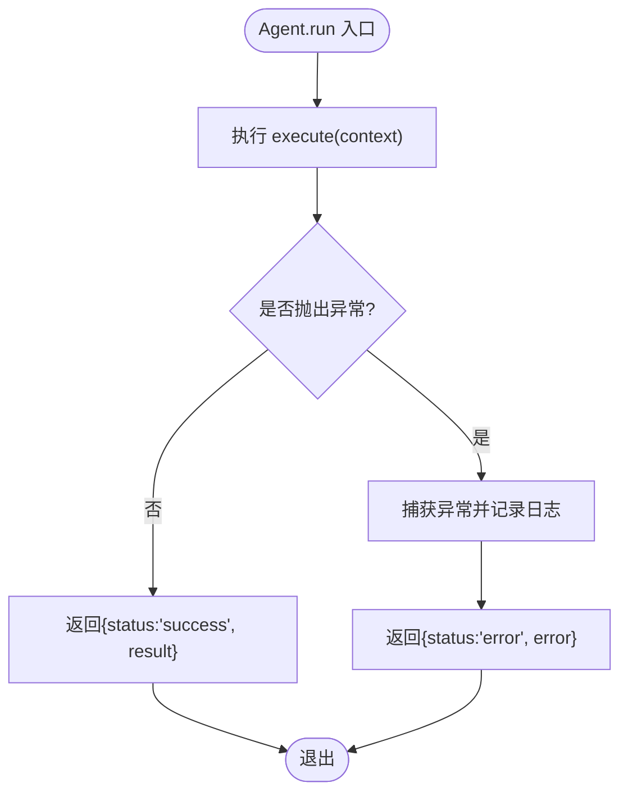
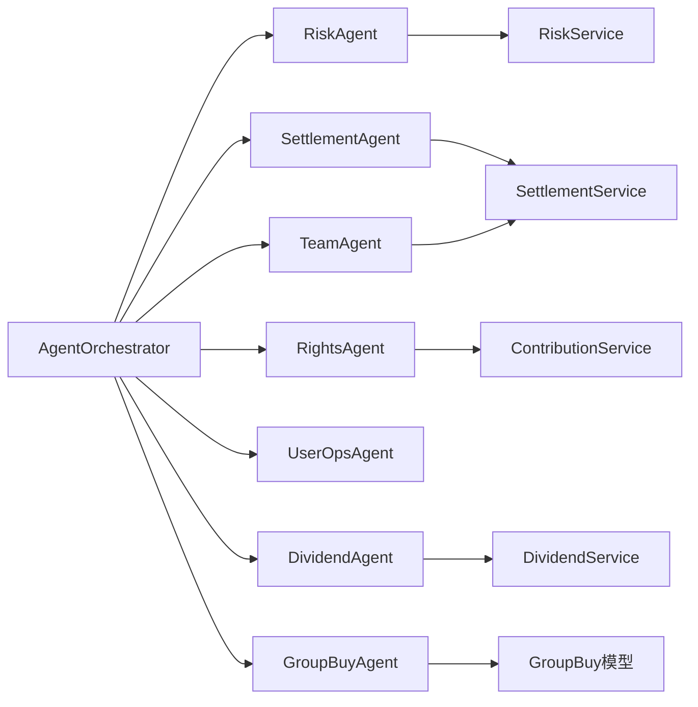
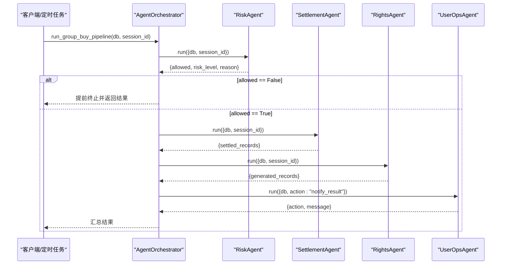

# Agent编排调度器

<cite>
**本文引用的文件列表**
- [agent_orchestrator.py](file://backend/app/agents/agent_orchestrator.py)
- [base_agent.py](file://backend/app/agents/base_agent.py)
- [all_agents.py](file://backend/app/agents/all_agents.py)
- [group_buy_agent.py](file://backend/app/agents/group_buy_agent.py)
- [settlement_service.py](file://backend/app/services/settlement_service.py)
- [contribution_service.py](file://backend/app/services/contribution_service.py)
- [dividend_service.py](file://backend/app/services/dividend_service.py)
- [risk_service.py](file://backend/app/services/risk_service.py)
- [config.py](file://backend/app/config.py)
- [group_buy.py](file://backend/app/models/group_buy.py)
- [group_buy_api.py](file://backend/app/api/v1/group_buy.py)
</cite>

## 目录
1. [引言](#引言)
2. [项目结构](#项目结构)
3. [核心组件](#核心组件)
4. [架构总览](#架构总览)
5. [详细组件分析](#详细组件分析)
6. [依赖关系分析](#依赖关系分析)
7. [性能与监控](#性能与监控)
8. [故障排查指南](#故障排查指南)
9. [结论](#结论)
10. [附录：编排配置与执行流程示例](#附录编排配置与执行流程示例)

## 引言
本文件面向AIxingmu系统的Agent编排调度器，聚焦于AgentOrchestrator的调度算法与工作流管理机制。文档将系统阐述以下要点：
- Agent动态创建、执行顺序控制、依赖关系解析
- 多Agent协作模式（串行、并行、条件分支）
- 上下文传递机制（共享状态管理、数据流转、参数传递）
- 错误处理与回滚策略（异常捕获、重试策略、事务回滚）
- 编排配置示例与复杂业务逻辑工作流定义
- 性能监控、执行时间统计、资源使用监控

## 项目结构
后端采用分层设计：API层调用服务层，服务层封装领域逻辑；Agent层以统一基类抽象各业务智能体；编排器负责组合与调度多个Agent完成端到端业务流程。

图表来源
- [agent_orchestrator.py:1-94](file://backend/app/agents/agent_orchestrator.py#L1-L94)
- [base_agent.py:1-47](file://backend/app/agents/base_agent.py#L1-L47)
- [all_agents.py:1-114](file://backend/app/agents/all_agents.py#L1-L114)
- [group_buy_agent.py:1-67](file://backend/app/agents/group_buy_agent.py#L1-L67)
- [settlement_service.py:1-166](file://backend/app/services/settlement_service.py#L1-L166)
- [contribution_service.py:1-261](file://backend/app/services/contribution_service.py#L1-L261)
- [dividend_service.py:1-136](file://backend/app/services/dividend_service.py#L1-L136)
- [risk_service.py:1-135](file://backend/app/services/risk_service.py#L1-L135)
- [group_buy.py:1-158](file://backend/app/models/group_buy.py#L1-L158)
- [config.py:1-136](file://backend/app/config.py#L1-L136)

章节来源
- [agent_orchestrator.py:1-94](file://backend/app/agents/agent_orchestrator.py#L1-L94)
- [base_agent.py:1-47](file://backend/app/agents/base_agent.py#L1-L47)
- [all_agents.py:1-114](file://backend/app/agents/all_agents.py#L1-L114)
- [group_buy_agent.py:1-67](file://backend/app/agents/group_buy_agent.py#L1-L67)
- [settlement_service.py:1-166](file://backend/app/services/settlement_service.py#L1-L166)
- [contribution_service.py:1-261](file://backend/app/services/contribution_service.py#L1-L261)
- [dividend_service.py:1-136](file://backend/app/services/dividend_service.py#L1-L136)
- [risk_service.py:1-135](file://backend/app/services/risk_service.py#L1-L135)
- [group_buy.py:1-158](file://backend/app/models/group_buy.py#L1-L158)
- [config.py:1-136](file://backend/app/config.py#L1-L136)

## 核心组件
- AgentOrchestrator：集中注册并调度7个Agent，提供多种流水线入口（拼团结算、每日例行、每周结算、月度门店分红）。
- BaseAgent：统一抽象，定义execute/should_continue/run生命周期，内置日志与异常包装。
- 具体Agent：
  - GroupBuyAgent：场次创建、过期处理、满员结算等定时任务。
  - SettlementAgent：按固定比例计算各方收益并写入结算记录。
  - RightsAgent：根据结果生成贡献值/积分/消费券等权益。
  - DividendAgent：每周一全网贡献值分红。
  - UserOpsAgent：用户运营通知与交互。
  - TeamAgent：团队业绩统计与阶梯分红。
  - RiskAgent：风控检查（黑名单、限购、异常行为）。

章节来源
- [agent_orchestrator.py:18-93](file://backend/app/agents/agent_orchestrator.py#L18-L93)
- [base_agent.py:12-47](file://backend/app/agents/base_agent.py#L12-L47)
- [all_agents.py:7-114](file://backend/app/agents/all_agents.py#L7-L114)
- [group_buy_agent.py:15-67](file://backend/app/agents/group_buy_agent.py#L15-L67)

## 架构总览
AgentOrchestrator作为编排中枢，通过字典注册所有Agent实例，并在不同流水线中按依赖顺序串行调用。每个Agent内部通过服务层访问数据库与业务规则，遵循单一职责原则。

图表来源
- [agent_orchestrator.py:18-93](file://backend/app/agents/agent_orchestrator.py#L18-L93)
- [base_agent.py:12-47](file://backend/app/agents/base_agent.py#L12-L47)
- [all_agents.py:7-114](file://backend/app/agents/all_agents.py#L7-L114)
- [group_buy_agent.py:15-67](file://backend/app/agents/group_buy_agent.py#L15-L67)

## 详细组件分析

### 调度算法与工作流管理
- 动态创建：AgentOrchestrator在构造时即实例化全部Agent，并通过名称映射进行注册，便于扩展新Agent。
- 执行顺序控制：流水线方法内按依赖顺序依次await调用，确保前置步骤完成后才进入下一步。
- 依赖关系解析：当前实现为显式顺序调用，未引入图拓扑或DAG解析；如需复杂依赖，可在编排器中增加依赖声明与解析逻辑。

图表来源
- [agent_orchestrator.py:32-52](file://backend/app/agents/agent_orchestrator.py#L32-L52)
- [all_agents.py:7-114](file://backend/app/agents/all_agents.py#L7-L114)

章节来源
- [agent_orchestrator.py:32-52](file://backend/app/agents/agent_orchestrator.py#L32-L52)

### 多Agent协作模式
- 串行调用：默认流水线均为串行await，保证强一致性与可观测性。
- 并行执行：可通过并发原语对无依赖的Agent进行并发调用（例如独立的通知与统计），但需考虑事务边界与幂等性。
- 条件分支：基于上游返回结果决定后续路径（如风控不通过则跳过结算与权益发放）。

图表来源
- [agent_orchestrator.py:32-52](file://backend/app/agents/agent_orchestrator.py#L32-L52)
- [all_agents.py:101-114](file://backend/app/agents/all_agents.py#L101-L114)

章节来源
- [agent_orchestrator.py:32-52](file://backend/app/agents/agent_orchestrator.py#L32-L52)
- [all_agents.py:101-114](file://backend/app/agents/all_agents.py#L101-L114)

### 上下文传递机制
- 共享状态：BaseAgent维护实例级state字典，支持update_state/get_state跨阶段传递轻量状态。
- 数据流转：每个Agent的run接收context字典，包含db会话、业务ID、动作标识等；上层编排器组装上下文并传递给下游。
- 参数传递：通过context键值对传递必要参数（如session_id、amount、user_id等），避免硬编码。

章节来源
- [base_agent.py:15-47](file://backend/app/agents/base_agent.py#L15-L47)
- [agent_orchestrator.py:32-52](file://backend/app/agents/agent_orchestrator.py#L32-L52)

### 错误处理与回滚机制
- 异常捕获：BaseAgent.run统一try/except包装，返回标准成功/失败结构，便于上层聚合。
- 重试策略：当前未实现自动重试；可在编排器中对特定Agent添加指数退避重试逻辑。
- 事务回滚：服务层普遍使用AsyncSession.flush提交变更；若需要强一致性，应在编排器层面开启事务，任一Agent失败则整体回滚。

图表来源
- [base_agent.py:31-41](file://backend/app/agents/base_agent.py#L31-L41)

章节来源
- [base_agent.py:31-41](file://backend/app/agents/base_agent.py#L31-L41)

### 关键Agent与服务详解

#### 风控Agent（RiskAgent）
- 功能：检查黑名单、单组参与次数上限、风险评分阈值，必要时记录风控日志与警告。
- 输入：db、user_id、session_id
- 输出：allowed布尔、reason、risk_level、可选warning标志

章节来源
- [all_agents.py:101-114](file://backend/app/agents/all_agents.py#L101-L114)
- [risk_service.py:17-74](file://backend/app/services/risk_service.py#L17-L74)

#### 分账结算Agent（SettlementAgent）
- 功能：按固定比例计算省/市/区县代理、门店、推荐门店的分润，写入结算记录。
- 输入：db、session_id、amount、winner_id、store_id
- 输出：settled_records数量

章节来源
- [all_agents.py:7-22](file://backend/app/agents/all_agents.py#L7-L22)
- [settlement_service.py:20-85](file://backend/app/services/settlement_service.py#L20-L85)

#### 权益核算Agent（RightsAgent）
- 功能：根据交易金额与角色分配比例生成贡献值记录，支持关联订单/场次。
- 输入：db、amount、consumer_id、source、related_session_id
- 输出：generated_records数量

章节来源
- [all_agents.py:29-46](file://backend/app/agents/all_agents.py#L29-L46)
- [contribution_service.py:39-143](file://backend/app/services/contribution_service.py#L39-L143)

#### 分红结算Agent（DividendAgent）
- 功能：每周一按个人贡献值占比分配平台收益池的20%至用户消费券。
- 输入：db
- 输出：dividend_count、total_dividend_paid、platform_pool等

章节来源
- [all_agents.py:52-62](file://backend/app/agents/all_agents.py#L52-L62)
- [dividend_service.py:19-123](file://backend/app/services/dividend_service.py#L19-L123)

#### 用户运营Agent（UserOpsAgent）
- 功能：基于动作类型推送信息、解答规则、激活用户。
- 输入：db、action
- 输出：action与消息摘要

章节来源
- [all_agents.py:66-76](file://backend/app/agents/all_agents.py#L66-L76)

#### 团队管理Agent（TeamAgent）
- 功能：统计四级团队业绩，排名并核算阶梯分红。
- 输入：db、year_month
- 输出：月度分红结算结果

章节来源
- [all_agents.py:83-94](file://backend/app/agents/all_agents.py#L83-L94)
- [settlement_service.py:87-133](file://backend/app/services/settlement_service.py#L87-L133)

#### 拼团调度Agent（GroupBuyAgent）
- 功能：创建每日场次、检查过期场次、结算已满场次。
- 输入：db、action、date等
- 输出：对应操作的结果计数

章节来源
- [group_buy_agent.py:15-67](file://backend/app/agents/group_buy_agent.py#L15-L67)
- [group_buy.py:42-86](file://backend/app/models/group_buy.py#L42-L86)

## 依赖关系分析
- 直接依赖：
  - AgentOrchestrator依赖所有具体Agent实例。
  - 具体Agent依赖各自的服务层模块。
  - 服务层依赖配置与模型。
- 间接依赖：
  - API层通过服务层间接使用Agent能力（当前API主要走服务层，Agent用于后台流水线）。
- 潜在循环：
  - 当前未见循环导入；服务层之间相互引用较少，保持松耦合。

图表来源
- [agent_orchestrator.py:18-30](file://backend/app/agents/agent_orchestrator.py#L18-L30)
- [all_agents.py:7-114](file://backend/app/agents/all_agents.py#L7-L114)
- [group_buy_agent.py:15-20](file://backend/app/agents/group_buy_agent.py#L15-L20)

章节来源
- [agent_orchestrator.py:18-30](file://backend/app/agents/agent_orchestrator.py#L18-L30)
- [all_agents.py:7-114](file://backend/app/agents/all_agents.py#L7-L114)
- [group_buy_agent.py:15-20](file://backend/app/agents/group_buy_agent.py#L15-L20)

## 性能与监控
- 执行时间统计：建议在BaseAgent.run前后记录耗时，或在编排器中为每个Agent调用计时，汇总到结果中。
- 资源使用监控：结合数据库连接池大小、Redis缓存命中率、异步任务队列长度进行监控。
- 指标采集：建议暴露Prometheus指标（如agent_exec_total、agent_error_total、agent_duration_seconds）。
- 限流与背压：对高频Agent（如风控）增加令牌桶限流，防止雪崩。
- 批量优化：对于大批量结算场景，尽量使用批量插入与分批flush，减少IO开销。

[本节为通用指导，无需代码来源]

## 故障排查指南
- 常见问题定位：
  - 风控拦截：查看RiskService返回的risk_level与reason，确认是否触发黑名单或限购规则。
  - 分账失败：核对SettlementService中的比例配置与Store关联信息是否正确。
  - 权益未发放：检查ContribSource与消费者ID是否存在，以及数据库写入是否成功。
  - 分红异常：确认平台收益池计算与全网贡献值统计是否有效。
- 日志与追踪：
  - 利用BaseAgent.logger输出结构化日志，包含agent名、上下文摘要、耗时与异常堆栈。
  - 在编排器中聚合各Agent返回结果，标记失败节点以便快速定位。
- 回滚与补偿：
  - 对关键流水（如风控→结算→权益）启用事务包裹，任一失败整体回滚。
  - 对幂等操作（如通知）可加入重试与死信队列。

章节来源
- [base_agent.py:31-41](file://backend/app/agents/base_agent.py#L31-L41)
- [risk_service.py:17-74](file://backend/app/services/risk_service.py#L17-L74)
- [settlement_service.py:20-85](file://backend/app/services/settlement_service.py#L20-L85)
- [contribution_service.py:39-143](file://backend/app/services/contribution_service.py#L39-L143)
- [dividend_service.py:19-123](file://backend/app/services/dividend_service.py#L19-L123)

## 结论
AgentOrchestrator以简洁的串行流水线实现了多Agent协作的核心能力，配合BaseAgent的统一生命周期与异常包装，具备良好的可扩展性与可观测性。未来可在依赖解析、并行执行、重试与事务回滚方面进一步增强，以满足更复杂的业务编排需求。

[本节为总结，无需代码来源]

## 附录：编排配置与执行流程示例

### 编排配置示例
- 全局配置项（来自Settings）：
  - 让利比例、贡献值乘数、各级分润比例、门店阶梯分红阈值与比例、日利率范围、LLM相关配置等。
- 流水线开关与参数：
  - 通过context传入action、session_id、year_month等参数控制不同流水线与分支。

章节来源
- [config.py:42-136](file://backend/app/config.py#L42-L136)

### 执行流程图（拼团完整流水线）

图表来源
- [agent_orchestrator.py:32-52](file://backend/app/agents/agent_orchestrator.py#L32-L52)
- [all_agents.py:101-114](file://backend/app/agents/all_agents.py#L101-L114)

### 复杂业务逻辑工作流定义建议
- 依赖声明：为每个Agent声明输入/输出契约，编排器据此构建DAG。
- 条件路由：基于风控结果、库存状态、用户等级等条件选择不同分支。
- 并行与隔离：对无依赖步骤并发执行，并对写操作设置独立事务边界。
- 幂等与重试：对通知、统计等幂等操作增加重试与去重机制。
- 监控埋点：在每个Agent入口/出口记录耗时、状态码、错误码，汇聚到统一看板。

[本节为概念性指导，无需代码来源]