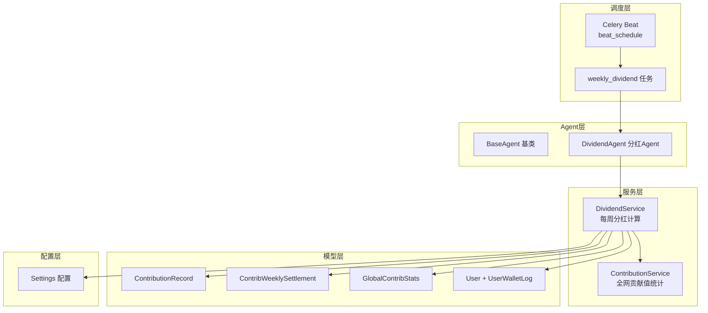
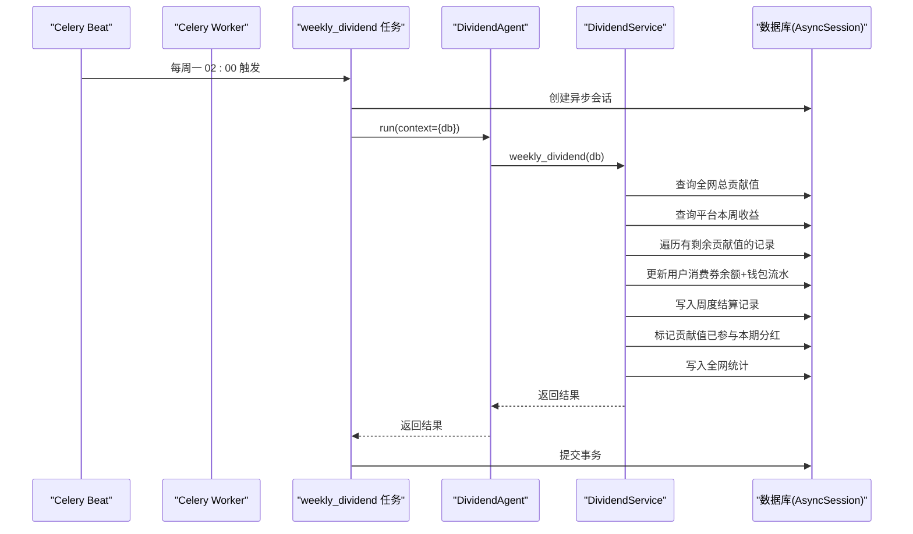
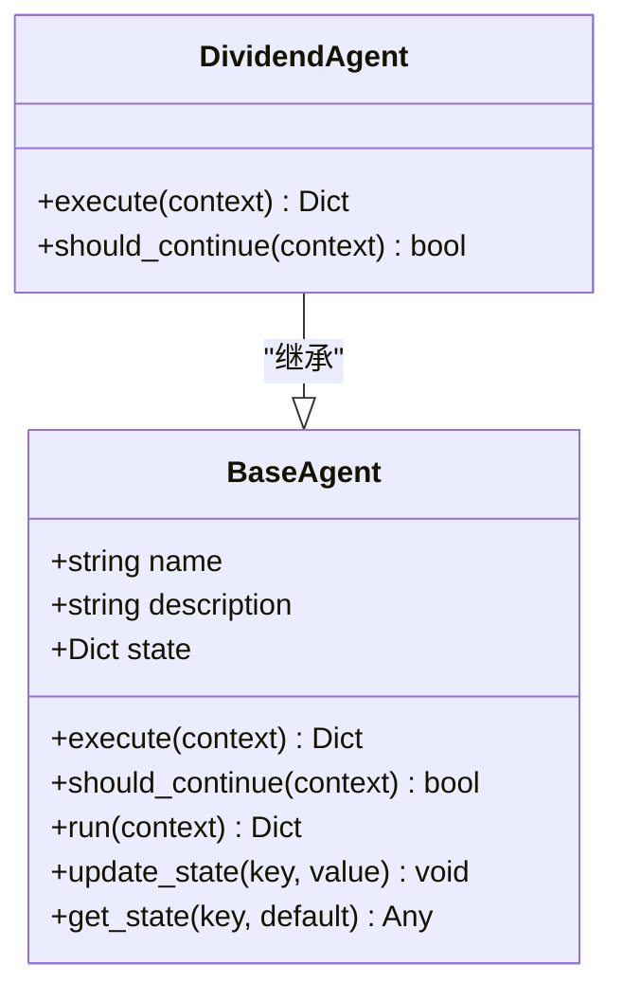
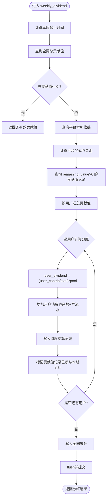
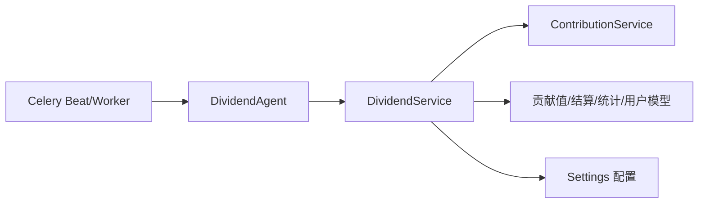

# AI分红结算Agent

<cite>
**本文引用的文件列表**
- [backend/app/agents/base_agent.py](file://backend/app/agents/base_agent.py)
- [backend/app/agents/all_agents.py](file://backend/app/agents/all_agents.py)
- [backend/app/services/dividend_service.py](file://backend/app/services/dividend_service.py)
- [backend/app/services/contribution_service.py](file://backend/app/services/contribution_service.py)
- [backend/app/tasks/dividend_tasks.py](file://backend/app/tasks/dividend_tasks.py)
- [backend/app/tasks/celery_app.py](file://backend/app/tasks/celery_app.py)
- [backend/app/models/contribution.py](file://backend/app/models/contribution.py)
- [backend/app/models/user.py](file://backend/app/models/user.py)
- [backend/app/config.py](file://backend/app/config.py)
</cite>

## 目录
1. [简介](#简介)
2. [项目结构](#项目结构)
3. [核心组件](#核心组件)
4. [架构总览](#架构总览)
5. [详细组件分析](#详细组件分析)
6. [依赖关系分析](#依赖关系分析)
7. [性能与高并发优化](#性能与高并发优化)
8. [故障排查指南](#故障排查指南)
9. [结论](#结论)
10. [附录：配置与调用示例](#附录配置与调用示例)

## 简介
本文件面向AIxingmu系统的“AI分红结算Agent”，聚焦于每周一自动触发的全网贡献值分红计算、递减贡献值兑换与消费券发放。文档从系统架构、数据流、算法实现、错误处理、监控告警、性能优化到配置与调用示例，提供完整的技术说明，帮助读者快速理解并落地该能力。

## 项目结构
围绕分红结算的核心代码分布在以下模块：
- Agent层：定义通用Agent基类与具体DividendAgent
- 任务调度层：Celery定时任务与调度配置
- 服务层：分红结算逻辑（DividendService）与贡献值统计（ContributionService）
- 模型层：贡献值记录、周度结算、全局统计、用户钱包流水等
- 配置层：全局参数（如日利率、结算周期、Celery等）



图表来源
- [backend/app/tasks/celery_app.py:24-44](file://backend/app/tasks/celery_app.py#L24-L44)
- [backend/app/tasks/dividend_tasks.py:15-25](file://backend/app/tasks/dividend_tasks.py#L15-L25)
- [backend/app/agents/all_agents.py:48-62](file://backend/app/agents/all_agents.py#L48-L62)
- [backend/app/agents/base_agent.py:12-46](file://backend/app/agents/base_agent.py#L12-L46)
- [backend/app/services/dividend_service.py:16-123](file://backend/app/services/dividend_service.py#L16-L123)
- [backend/app/services/contribution_service.py:252-260](file://backend/app/services/contribution_service.py#L252-L260)
- [backend/app/models/contribution.py:32-115](file://backend/app/models/contribution.py#L32-L115)
- [backend/app/models/user.py:26-93](file://backend/app/models/user.py#L26-L93)
- [backend/app/config.py:101-105](file://backend/app/config.py#L101-L105)

章节来源
- [backend/app/tasks/celery_app.py:24-44](file://backend/app/tasks/celery_app.py#L24-L44)
- [backend/app/tasks/dividend_tasks.py:15-25](file://backend/app/tasks/dividend_tasks.py#L15-L25)
- [backend/app/agents/all_agents.py:48-62](file://backend/app/agents/all_agents.py#L48-L62)
- [backend/app/agents/base_agent.py:12-46](file://backend/app/agents/base_agent.py#L12-L46)
- [backend/app/services/dividend_service.py:16-123](file://backend/app/services/dividend_service.py#L16-L123)
- [backend/app/services/contribution_service.py:252-260](file://backend/app/services/contribution_service.py#L252-L260)
- [backend/app/models/contribution.py:32-115](file://backend/app/models/contribution.py#L32-L115)
- [backend/app/models/user.py:26-93](file://backend/app/models/user.py#L26-L93)
- [backend/app/config.py:101-105](file://backend/app/config.py#L101-L105)

## 核心组件
- BaseAgent：统一Agent生命周期管理（执行、状态、日志、异常封装）。
- DividendAgent：将数据库会话注入上下文，委托给DividendService完成分红计算。
- DividendService：实现“全网贡献值分红”的完整流程，包括获取平台收益池、汇总用户贡献值、按比例发放消费券、写入结算与统计记录。
- ContributionService：提供全网贡献值聚合查询，支撑分红比例计算。
- Celery任务与调度：通过Beat在每周一凌晨2点触发分红任务。
- 数据模型：贡献值记录、周度结算表、全局统计表、用户及钱包流水。

章节来源
- [backend/app/agents/base_agent.py:12-46](file://backend/app/agents/base_agent.py#L12-L46)
- [backend/app/agents/all_agents.py:48-62](file://backend/app/agents/all_agents.py#L48-L62)
- [backend/app/services/dividend_service.py:16-123](file://backend/app/services/dividend_service.py#L16-L123)
- [backend/app/services/contribution_service.py:252-260](file://backend/app/services/contribution_service.py#L252-L260)
- [backend/app/tasks/dividend_tasks.py:15-25](file://backend/app/tasks/dividend_tasks.py#L15-L25)
- [backend/app/tasks/celery_app.py:24-44](file://backend/app/tasks/celery_app.py#L24-L44)
- [backend/app/models/contribution.py:32-115](file://backend/app/models/contribution.py#L32-L115)
- [backend/app/models/user.py:26-93](file://backend/app/models/user.py#L26-L93)

## 架构总览
下图展示了从Celery调度到数据库落库的端到端流程，以及关键对象之间的交互关系。



图表来源
- [backend/app/tasks/celery_app.py:24-44](file://backend/app/tasks/celery_app.py#L24-L44)
- [backend/app/tasks/dividend_tasks.py:15-25](file://backend/app/tasks/dividend_tasks.py#L15-L25)
- [backend/app/agents/all_agents.py:48-62](file://backend/app/agents/all_agents.py#L48-L62)
- [backend/app/services/dividend_service.py:16-123](file://backend/app/services/dividend_service.py#L16-L123)
- [backend/app/models/contribution.py:32-115](file://backend/app/models/contribution.py#L32-L115)
- [backend/app/models/user.py:26-93](file://backend/app/models/user.py#L26-L93)

## 详细组件分析

### DividendAgent 与 BaseAgent
- BaseAgent提供统一的run流程：记录开始/结束日志、捕获异常并返回标准结果结构；维护state字典用于跨步骤传递上下文。
- DividendAgent仅负责组装上下文（注入db），并调用DividendService.weekly_dividend完成业务。



图表来源
- [backend/app/agents/base_agent.py:12-46](file://backend/app/agents/base_agent.py#L12-L46)
- [backend/app/agents/all_agents.py:48-62](file://backend/app/agents/all_agents.py#L48-L62)

章节来源
- [backend/app/agents/base_agent.py:12-46](file://backend/app/agents/base_agent.py#L12-L46)
- [backend/app/agents/all_agents.py:48-62](file://backend/app/agents/all_agents.py#L48-L62)

### DividendService 分红算法与数据流
- 输入：当前时间、数据库会话。
- 步骤：
  1) 计算本周起始日期。
  2) 获取全网总贡献值（仅统计remaining_value > 0的记录）。
  3) 计算平台本周收益，取20%作为收益池。
  4) 查询所有有剩余贡献值的记录，按用户汇总。
  5) 对每个用户计算个人分红 = 个人贡献值 / 全网总贡献值 × 平台收益池。
  6) 增加用户消费券余额，写入钱包流水。
  7) 写入周度结算记录（包含有效贡献值、适用日利率、全网总贡献值、平台收益池、个人分红金额等）。
  8) 标记相关贡献值记录为“已参与本期分红”。
  9) 写入全网统计记录。
  10) flush后返回本次分红的数量与总额等指标。



图表来源
- [backend/app/services/dividend_service.py:16-123](file://backend/app/services/dividend_service.py#L16-L123)
- [backend/app/services/contribution_service.py:252-260](file://backend/app/services/contribution_service.py#L252-L260)
- [backend/app/models/contribution.py:32-115](file://backend/app/models/contribution.py#L32-L115)
- [backend/app/models/user.py:26-93](file://backend/app/models/user.py#L26-L93)

章节来源
- [backend/app/services/dividend_service.py:16-123](file://backend/app/services/dividend_service.py#L16-L123)
- [backend/app/services/contribution_service.py:252-260](file://backend/app/services/contribution_service.py#L252-L260)
- [backend/app/models/contribution.py:32-115](file://backend/app/models/contribution.py#L32-L115)
- [backend/app/models/user.py:26-93](file://backend/app/models/user.py#L26-L93)

### 定时任务机制与执行周期
- Celery Beat在每周一凌晨2:00触发“app.tasks.dividend_tasks.weekly_dividend”任务。
- 任务内部使用事件循环运行异步函数，创建异步数据库会话，构造DividendAgent并执行run，最后提交事务。

```mermaid
sequenceDiagram
participant Beat as "Celery Beat"
participant Task as "weekly_dividend"
participant Loop as "asyncio事件循环"
participant Agent as "DividendAgent"
participant DB as "AsyncSession"
Beat->>Task : crontab(hour=2, minute=0, day_of_week=1)
Task->>Loop : 创建新事件循环
Loop->>DB : async_session_factory()
Loop->>Agent : run({db})
Agent-->>Loop : 返回结果
Loop->>DB : commit()
```

图表来源
- [backend/app/tasks/celery_app.py:24-44](file://backend/app/tasks/celery_app.py#L24-L44)
- [backend/app/tasks/dividend_tasks.py:15-25](file://backend/app/tasks/dividend_tasks.py#L15-L25)

章节来源
- [backend/app/tasks/celery_app.py:24-44](file://backend/app/tasks/celery_app.py#L24-L44)
- [backend/app/tasks/dividend_tasks.py:15-25](file://backend/app/tasks/dividend_tasks.py#L15-L25)

### 与DividendService的集成方式
- DividendAgent仅做上下文装配与调用，不承载复杂业务逻辑，符合单一职责原则。
- DividendService集中实现分红算法与数据落库，便于测试与复用。

章节来源
- [backend/app/agents/all_agents.py:48-62](file://backend/app/agents/all_agents.py#L48-L62)
- [backend/app/services/dividend_service.py:16-123](file://backend/app/services/dividend_service.py#L16-L123)

### 全网分红算法原理
- 贡献值统计：基于ContributionRecord中remaining_value > 0的记录进行求和，得到全网总贡献值。
- 分红比例：个人分红 = 个人贡献值 / 全网总贡献值 × 平台20%收益池。
- 递减规则应用：当前分红流程不扣减贡献值，仅标记“已参与本期分红”，剩余贡献值继续参与下期；递减兑换由另一套周度结算流程负责（见贡献值服务中的周度结算方法）。

章节来源
- [backend/app/services/contribution_service.py:252-260](file://backend/app/services/contribution_service.py#L252-L260)
- [backend/app/services/dividend_service.py:16-123](file://backend/app/services/dividend_service.py#L16-L123)
- [backend/app/models/contribution.py:32-115](file://backend/app/models/contribution.py#L32-L115)

### 错误处理机制
- Agent层：run方法捕获异常，返回包含错误信息的标准结构，便于上层统一处理与观测。
- 任务层：若异步执行或数据库操作抛出异常，将被Celery捕获，默认会重试（取决于Worker配置）。
- 建议增强：
  - 在DividendService中对关键步骤增加try/except，记录失败明细与上下文（如用户ID、贡献值、平台收益池等）。
  - 引入幂等性保护：例如以“周起始日期+用户ID”为键去重，避免重复结算。
  - 对平台收益池为空或负数场景增加明确分支与告警。

章节来源
- [backend/app/agents/base_agent.py:31-46](file://backend/app/agents/base_agent.py#L31-L46)
- [backend/app/tasks/dividend_tasks.py:15-25](file://backend/app/tasks/dividend_tasks.py#L15-L25)

### 监控与告警配置
- 日志：BaseAgent在每个阶段输出结构化日志（开始、完成、错误），可接入ELK或云日志平台。
- 指标：建议在DividendService返回结果中暴露关键指标（dividend_count、total_dividend_paid、platform_pool、total_network_contrib），并通过Prometheus导出。
- 告警：当total_dividend_paid为0或平台收益池为0时触发告警；当任务失败次数超过阈值时告警。

章节来源
- [backend/app/agents/base_agent.py:31-46](file://backend/app/agents/base_agent.py#L31-L46)
- [backend/app/services/dividend_service.py:118-123](file://backend/app/services/dividend_service.py#L118-L123)

## 依赖关系分析
- 组件耦合：
  - DividendAgent 低耦合，仅依赖DividendService接口。
  - DividendService 依赖ContributionService（全网贡献值）、模型层（贡献值、结算、统计、用户钱包流水）。
- 外部依赖：
  - Celery（任务队列与调度）
  - SQLAlchemy AsyncSession（异步数据库访问）
  - Settings（全局配置）



图表来源
- [backend/app/agents/all_agents.py:48-62](file://backend/app/agents/all_agents.py#L48-L62)
- [backend/app/services/dividend_service.py:16-123](file://backend/app/services/dividend_service.py#L16-L123)
- [backend/app/services/contribution_service.py:252-260](file://backend/app/services/contribution_service.py#L252-L260)
- [backend/app/tasks/celery_app.py:24-44](file://backend/app/tasks/celery_app.py#L24-L44)
- [backend/app/config.py:101-105](file://backend/app/config.py#L101-L105)

章节来源
- [backend/app/agents/all_agents.py:48-62](file://backend/app/agents/all_agents.py#L48-L62)
- [backend/app/services/dividend_service.py:16-123](file://backend/app/services/dividend_service.py#L16-L123)
- [backend/app/services/contribution_service.py:252-260](file://backend/app/services/contribution_service.py#L252-L260)
- [backend/app/tasks/celery_app.py:24-44](file://backend/app/tasks/celery_app.py#L24-L44)
- [backend/app/config.py:101-105](file://backend/app/config.py#L101-L105)

## 性能与高并发优化
- 数据库层面：
  - 索引优化：确保contribution_records.user_id、source、role、remaining_value等字段具备合适索引，减少扫描成本。
  - 批量写入：在DividendService中尽量合并插入（flush一次），避免频繁提交。
  - 分页/分批处理：当用户量极大时，可按批次拉取与处理，降低单次事务大小。
- 计算层面：
  - 预聚合：在全网总贡献值计算上，使用SQL聚合函数一次性求和，避免Python侧循环累加。
  - 平台收益池缓存：可将平台本周收益池结果缓存至Redis，设置合理过期时间，减少重复查询。
- 任务层面：
  - Celery Worker并发：根据CPU与IO特性调整worker并发度，避免争用数据库连接池。
  - 幂等与去重：结合周起始日期与用户ID建立唯一约束，防止重复结算导致的数据不一致。
- 监控与降级：
  - 对耗时较长的步骤增加计时埋点，定位瓶颈。
  - 当平台收益池异常时，快速失败并告警，避免无效计算。

[本节为通用性能建议，不直接分析具体文件]

## 故障排查指南
- 常见问题
  - 任务未触发：检查Celery Beat是否启动、时区是否正确、crontab表达式是否符合预期。
  - 数据库连接失败：确认DATABASE_URL、连接池大小、网络连通性。
  - 分红结果为0：检查全网总贡献值是否为0、平台收益池是否为0、是否存在remaining_value>0的记录。
  - 重复结算：检查周度结算表的唯一索引是否生效，确认幂等逻辑。
- 定位手段
  - 查看Agent日志：确认执行开始、结束与错误信息。
  - 查看任务执行结果：通过Celery后端查看任务状态与返回值。
  - 核对数据一致性：对比用户消费券余额变动与钱包流水、周度结算记录与全网统计。

章节来源
- [backend/app/tasks/celery_app.py:24-44](file://backend/app/tasks/celery_app.py#L24-L44)
- [backend/app/agents/base_agent.py:31-46](file://backend/app/agents/base_agent.py#L31-L46)
- [backend/app/services/dividend_service.py:118-123](file://backend/app/services/dividend_service.py#L118-L123)

## 结论
AI分红结算Agent通过清晰的Agent分层、稳定的Celery调度与集中的服务实现，完成了“每周一全网贡献值分红”的核心目标。算法简洁透明，数据落库完备，具备较好的可观测性与扩展性。在高并发场景下，可通过索引优化、批处理、缓存与幂等设计进一步提升稳定性与吞吐。

[本节为总结性内容，不直接分析具体文件]

## 附录：配置与调用示例

### 环境变量与配置项
- Celery相关
  - CELERY_BROKER_URL：消息代理地址
  - CELERY_RESULT_BACKEND：结果后端地址
- 数据库相关
  - DATABASE_URL：PostgreSQL异步连接串
  - DATABASE_POOL_SIZE、DATABASE_MAX_OVERFLOW：连接池参数
- 贡献值与分红
  - CONTRIB_DAILY_RATE_DEFAULT：默认日利率
  - CONTRIB_SETTLE_DAY：结算周期（每周一）
- LLM与Dify（与分红无关，供其他Agent使用）
  - LLM_API_KEY、LLM_API_BASE、LLM_MODEL
  - DIFY_API_URL、DIFY_API_KEY、DIFY_DEFAULT_MODEL

章节来源
- [backend/app/config.py:16-26](file://backend/app/config.py#L16-L26)
- [backend/app/config.py:101-105](file://backend/app/config.py#L101-L105)
- [backend/app/config.py:125-133](file://backend/app/config.py#L125-L133)

### 任务调度配置
- 每周一凌晨2:00执行分红任务
  - 调度表达式：hour=2, minute=0, day_of_week=1
- 每日凌晨3:00执行贡献值递减兑换核算
  - 调度表达式：hour=3, minute=0

章节来源
- [backend/app/tasks/celery_app.py:40-49](file://backend/app/tasks/celery_app.py#L40-L49)

### 调用示例（概念性）
- 手动触发（开发/调试）
  - 通过Celery命令或API调用 app.tasks.dividend_tasks.weekly_dividend
- 运行时上下文
  - context={"db": AsyncSession实例}
- 返回结果关键字段
  - dividend_count：参与分红用户数
  - total_dividend_paid：发放消费券总额
  - total_network_contrib：全网总贡献值
  - platform_pool：平台20%收益池

章节来源
- [backend/app/tasks/dividend_tasks.py:15-25](file://backend/app/tasks/dividend_tasks.py#L15-L25)
- [backend/app/services/dividend_service.py:118-123](file://backend/app/services/dividend_service.py#L118-L123)