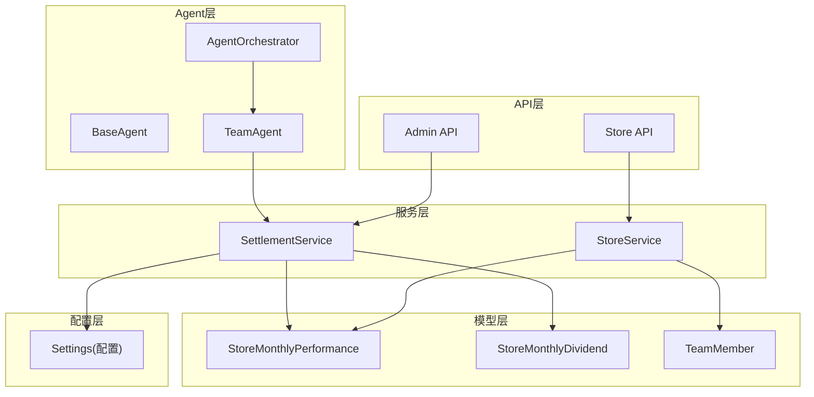
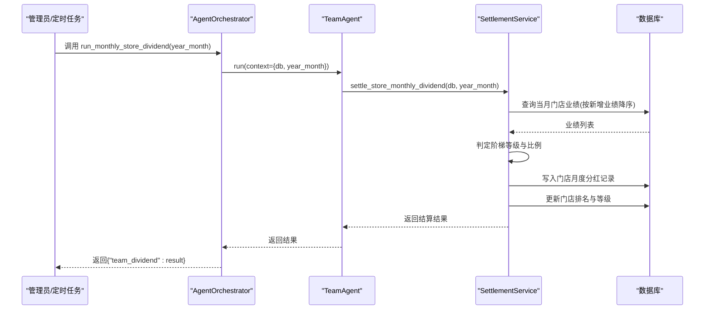
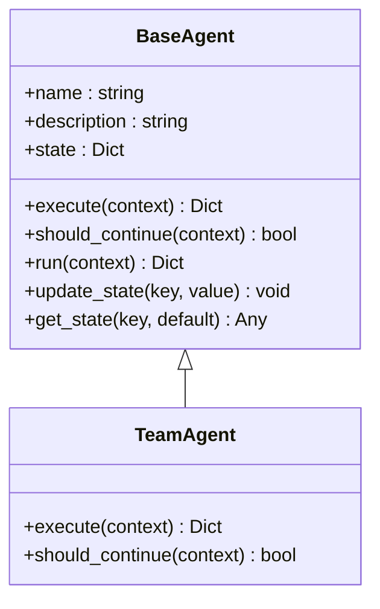
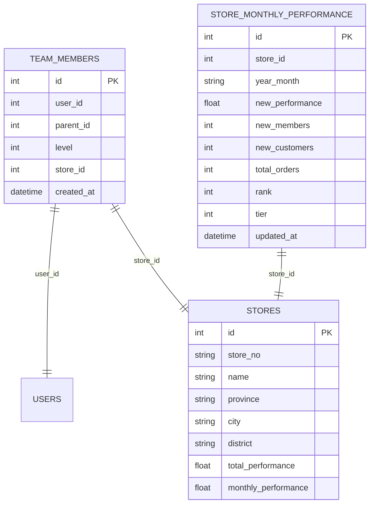
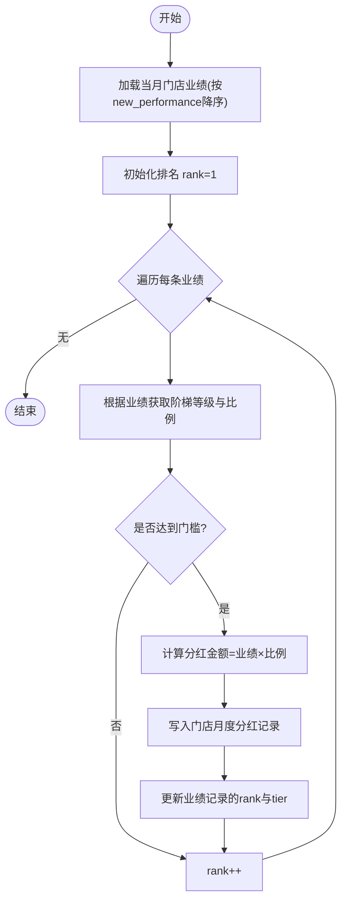
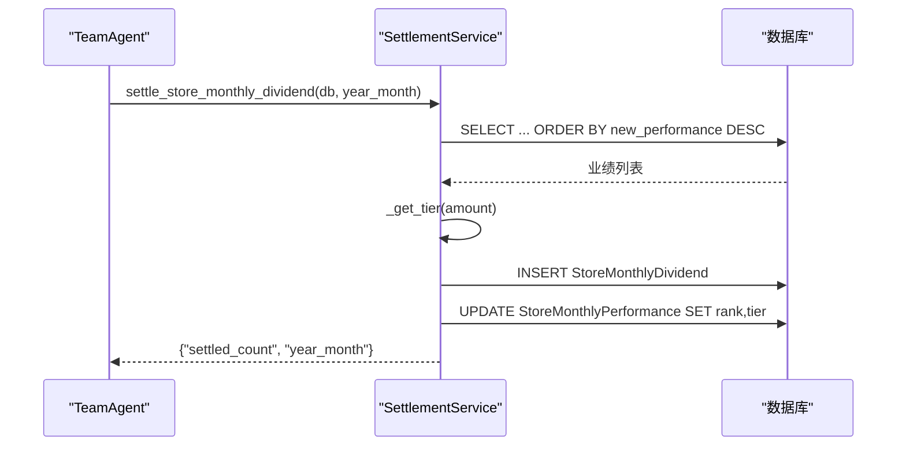
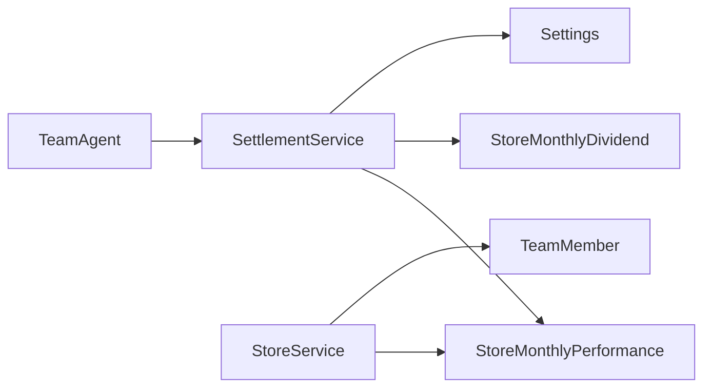

# AI团队管理Agent

<cite>
**本文引用的文件**   
- [base_agent.py](file://backend/app/agents/base_agent.py)
- [agent_orchestrator.py](file://backend/app/agents/agent_orchestrator.py)
- [all_agents.py](file://backend/app/agents/all_agents.py)
- [settlement_service.py](file://backend/app/services/settlement_service.py)
- [store_service.py](file://backend/app/services/store_service.py)
- [dividend_service.py](file://backend/app/services/dividend_service.py)
- [contribution_service.py](file://backend/app/services/contribution_service.py)
- [store.py](file://backend/app/models/store.py)
- [settlement.py](file://backend/app/models/settlement.py)
- [user.py](file://backend/app/models/user.py)
- [config.py](file://backend/app/config.py)
- [admin.py](file://backend/app/api/v1/admin.py)
- [store.py](file://backend/app/api/v1/store.py)
</cite>

## 目录
1. [简介](#简介)
2. [项目结构](#项目结构)
3. [核心组件](#核心组件)
4. [架构总览](#架构总览)
5. [详细组件分析](#详细组件分析)
6. [依赖关系分析](#依赖关系分析)
7. [性能考虑](#性能考虑)
8. [故障排查指南](#故障排查指南)
9. [结论](#结论)
10. [附录：API接口规范](#附录api接口规范)

## 简介
本文件面向AIxingmu系统的“AI团队管理Agent”（TeamAgent），聚焦其核心职责：统计四级团队业绩、计算排名、核算门店阶梯分红，并说明与SettlementService的协作方式、数据聚合逻辑、结算周期管理与异常恢复策略。同时提供完整API接口说明与大数据量下的性能优化建议。

## 项目结构
围绕TeamAgent的关键代码分布在以下模块：
- Agent层：BaseAgent抽象基类、AgentOrchestrator编排器、AllAgents中TeamAgent实现
- 服务层：SettlementService（门店月度阶梯分红）、StoreService（团队与门店数据聚合）
- 模型层：StoreMonthlyPerformance、StoreMonthlyDividend、TeamMember等
- 配置层：门店阶梯门槛与比例、分润比例等全局参数
- API层：管理员触发月度分红、门店列表/排名/团队成员查询

图表来源
- [agent_orchestrator.py:18-93](file://backend/app/agents/agent_orchestrator.py#L18-L93)
- [all_agents.py:79-94](file://backend/app/agents/all_agents.py#L79-L94)
- [settlement_service.py:87-133](file://backend/app/services/settlement_service.py#L87-L133)
- [store_service.py:101-133](file://backend/app/services/store_service.py#L101-L133)
- [store.py:83-103](file://backend/app/models/store.py#L83-L103)
- [settlement.py:66-93](file://backend/app/models/settlement.py#L66-L93)
- [config.py:112-123](file://backend/app/config.py#L112-L123)
- [admin.py:59-68](file://backend/app/api/v1/admin.py#L59-L68)
- [store.py:26-36](file://backend/app/api/v1/store.py#L26-L36)

章节来源
- [agent_orchestrator.py:18-93](file://backend/app/agents/agent_orchestrator.py#L18-L93)
- [all_agents.py:79-94](file://backend/app/agents/all_agents.py#L79-L94)
- [settlement_service.py:87-133](file://backend/app/services/settlement_service.py#L87-L133)
- [store_service.py:101-133](file://backend/app/services/store_service.py#L101-L133)
- [store.py:83-103](file://backend/app/models/store.py#L83-L103)
- [settlement.py:66-93](file://backend/app/models/settlement.py#L66-L93)
- [config.py:112-123](file://backend/app/config.py#L112-L123)
- [admin.py:59-68](file://backend/app/api/v1/admin.py#L59-L68)
- [store.py:26-36](file://backend/app/api/v1/store.py#L26-L36)

## 核心组件
- BaseAgent：定义Agent生命周期run/execute/should_continue及状态存取，统一日志与异常包装。
- TeamAgent：负责月度门店阶梯分红执行入口，委托SettlementService完成数据聚合与结算。
- SettlementService.settle_store_monthly_dividend：读取当月门店业绩、排序、判定阶梯等级与比例、生成分红记录、更新排名与等级。
- StoreService：提供门店月度业绩更新、团队层级成员查询、门店排名查询等能力。
- 配置项：门店阶梯门槛与比例、分润比例等集中管理。

章节来源
- [base_agent.py:12-46](file://backend/app/agents/base_agent.py#L12-L46)
- [all_agents.py:79-94](file://backend/app/agents/all_agents.py#L79-L94)
- [settlement_service.py:87-133](file://backend/app/services/settlement_service.py#L87-L133)
- [store_service.py:54-133](file://backend/app/services/store_service.py#L54-L133)
- [config.py:112-123](file://backend/app/config.py#L112-L123)

## 架构总览
TeamAgent在月度任务中被编排调度器调用，进入SettlementService进行数据聚合与分红结算；StoreService为业绩与团队关系提供支撑；配置中心决定阶梯门槛与比例；API层暴露手动触发与查询接口。

图表来源
- [agent_orchestrator.py:82-85](file://backend/app/agents/agent_orchestrator.py#L82-L85)
- [all_agents.py:87-91](file://backend/app/agents/all_agents.py#L87-L91)
- [settlement_service.py:87-133](file://backend/app/services/settlement_service.py#L87-L133)

## 详细组件分析

### TeamAgent 实现与职责
- 职责边界：作为“团队管理”领域入口，仅负责接收上下文（db、year_month），委派SettlementService完成具体业务。
- 执行流程：execute中直接调用月度分红结算方法，返回结算计数与年月。
- 生命周期：继承BaseAgent.run，自动处理日志与异常封装。

图表来源
- [base_agent.py:12-46](file://backend/app/agents/base_agent.py#L12-L46)
- [all_agents.py:79-94](file://backend/app/agents/all_agents.py#L79-L94)

章节来源
- [base_agent.py:12-46](file://backend/app/agents/base_agent.py#L12-L46)
- [all_agents.py:79-94](file://backend/app/agents/all_agents.py#L79-L94)

### 数据聚合与层级关系
- 团队层级关系：通过TeamMember表维护用户间上下级关系，支持level=1~4直推/间推/间间推/间间间推查询。
- 门店业绩聚合：StoreMonthlyPerformance按月累计门店新增业绩、会员数、客户数、订单数，并提供排名字段rank与等级tier。
- 门店列表与筛选：StoreService.get_store_list支持按省/市/状态分页查询。

图表来源
- [store.py:66-81](file://backend/app/models/store.py#L66-L81)
- [store.py:83-103](file://backend/app/models/store.py#L83-L103)
- [store.py:22-63](file://backend/app/models/store.py#L22-L63)

章节来源
- [store_service.py:101-133](file://backend/app/services/store_service.py#L101-L133)
- [store.py:66-103](file://backend/app/models/store.py#L66-L103)

### 排名算法与阶梯分红核算
- 排名算法：按当月新增业绩new_performance降序排列，逐条赋予rank=1,2,...。
- 阶梯判定：依据配置中的STORE_TIERx_MIN阈值判断等级与对应比例，未达门槛则不参与分红。
- 分红金额：dividend_amount = monthly_new_performance × dividend_ratio。
- 持久化：写入StoreMonthlyDividend记录，并在StoreMonthlyPerformance上同步rank与tier。

图表来源
- [settlement_service.py:87-133](file://backend/app/services/settlement_service.py#L87-L133)
- [config.py:112-123](file://backend/app/config.py#L112-L123)

章节来源
- [settlement_service.py:87-133](file://backend/app/services/settlement_service.py#L87-L133)
- [config.py:112-123](file://backend/app/config.py#L112-L123)

### 与SettlementService的协作
- 调用路径：TeamAgent.execute → SettlementService.settle_store_monthly_dividend。
- 事务边界：使用AsyncSession.flush批量提交，保证同一批次写入的一致性。
- 异常恢复：BaseAgent.run捕获异常并返回错误信息；上层可结合重试或补偿任务。

图表来源
- [all_agents.py:87-91](file://backend/app/agents/all_agents.py#L87-L91)
- [settlement_service.py:87-133](file://backend/app/services/settlement_service.py#L87-L133)

章节来源
- [all_agents.py:87-91](file://backend/app/agents/all_agents.py#L87-L91)
- [settlement_service.py:87-133](file://backend/app/services/settlement_service.py#L87-L133)

### 结算周期管理
- 月度周期：以year_month（如“2024-01”）为维度进行聚合与结算。
- 触发方式：
  - 编排器：AgentOrchestrator.run_monthly_store_dividend
  - 管理员API：POST /api/v1/store/monthly-dividend
- 幂等性：当前实现按year_month插入分红记录，若需重复执行应增加去重校验（例如唯一索引或幂等键）。

章节来源
- [agent_orchestrator.py:82-85](file://backend/app/agents/agent_orchestrator.py#L82-L85)
- [admin.py:59-68](file://backend/app/api/v1/admin.py#L59-L68)
- [settlement.py:66-93](file://backend/app/models/settlement.py#L66-L93)

### 相关服务对比：全网贡献值周度分红
- DividendService.weekly_dividend用于全网贡献值周度分红，与TeamAgent的门店月度阶梯分红不同，避免概念混淆。
- 该服务涉及平台收益池、全网贡献值汇总、消费券发放等，属于另一套结算体系。

章节来源
- [dividend_service.py:19-123](file://backend/app/services/dividend_service.py#L19-L123)
- [contribution_service.py:162-240](file://backend/app/services/contribution_service.py#L162-L240)

## 依赖关系分析
- TeamAgent依赖SettlementService完成核心计算；SettlementService依赖StoreMonthlyPerformance与StoreMonthlyDividend模型；StoreService提供团队与门店数据访问；配置由Settings集中管理。
- 外部集成点：数据库（PostgreSQL+asyncpg）、可选Redis/Celery（用于异步任务与缓存）。

图表来源
- [all_agents.py:79-94](file://backend/app/agents/all_agents.py#L79-L94)
- [settlement_service.py:87-133](file://backend/app/services/settlement_service.py#L87-L133)
- [store_service.py:101-133](file://backend/app/services/store_service.py#L101-L133)
- [config.py:112-123](file://backend/app/config.py#L112-L123)

章节来源
- [all_agents.py:79-94](file://backend/app/agents/all_agents.py#L79-L94)
- [settlement_service.py:87-133](file://backend/app/services/settlement_service.py#L87-L133)
- [store_service.py:101-133](file://backend/app/services/store_service.py#L101-L133)
- [config.py:112-123](file://backend/app/config.py#L112-L123)

## 性能考虑
- 数据聚合优化
  - 对StoreMonthlyPerformance.year_month建立索引，确保按月过滤高效。
  - 按new_performance降序排序时利用索引或物化视图减少全表扫描。
- 批处理与分批写入
  - 将分红记录分批INSERT，避免单次flush过大导致锁竞争。
  - 对排名与等级更新采用批量UPDATE。
- 并发与幂等
  - 为StoreMonthlyDividend.store_id+year_month添加唯一约束，防止重复结算。
  - 引入分布式锁或幂等键，避免多实例重复执行月度任务。
- 缓存设计
  - 热点数据（如当月排名TopN）可缓存至Redis，缩短查询延迟。
  - 配置项（阶梯门槛与比例）变更时刷新缓存。
- 监控与告警
  - 记录每批次结算耗时、失败率、数据一致性校验结果。
  - 对长时间未完成的结算任务设置超时与重试策略。

[本节为通用性能建议，不直接分析具体文件]

## 故障排查指南
- 常见问题定位
  - 未达门槛：检查配置STORE_TIERx_MIN与当月业绩是否正确累计。
  - 重复结算：确认StoreMonthlyDividend唯一约束是否生效，或幂等键是否一致。
  - 排名异常：核对排序字段new_performance是否为最新值，是否存在并发更新未提交。
- 日志与追踪
  - 使用BaseAgent.run的日志输出，定位异常堆栈与上下文。
  - 在SettlementService关键步骤增加结构化日志（输入、中间结果、影响行数）。
- 恢复策略
  - 基于失败记录的重放：从StoreMonthlyPerformance中筛选未生成StoreMonthlyDividend的记录重新结算。
  - 事务回滚：若某批次写入失败，整体回滚后重试。

章节来源
- [base_agent.py:31-40](file://backend/app/agents/base_agent.py#L31-L40)
- [settlement_service.py:87-133](file://backend/app/services/settlement_service.py#L87-L133)
- [settlement.py:66-93](file://backend/app/models/settlement.py#L66-L93)

## 结论
TeamAgent作为团队管理领域的统一入口，依托SettlementService完成门店月度阶梯分红的全链路处理：数据聚合→排名→阶梯判定→分红记录→排名更新。配合StoreService的团队与门店数据能力以及配置中心的规则管理，形成清晰、可扩展的结算体系。建议在生产环境完善幂等性、批处理与缓存机制，并通过监控与告警保障稳定性。

[本节为总结性内容，不直接分析具体文件]

## 附录：API接口规范

- 门店列表
  - 方法：GET
  - 路径：/api/v1/store/list
  - 查询参数：province, city, page, size
  - 响应：包含total、page、size、items

- 门店排名
  - 方法：GET
  - 路径：/api/v1/store/ranking
  - 查询参数：year_month（可选，默认当月）
  - 响应：{ items, year_month }

- 我的团队成员
  - 方法：GET
  - 路径：/api/v1/store/team
  - 查询参数：level（1~4），认证头携带当前用户ID
  - 响应：{ items, level }

- 手动触发门店月度阶梯分红
  - 方法：POST
  - 路径：/api/v1/store/monthly-dividend
  - 查询参数：year_month（可选，默认当月）
  - 响应：{ code, message, data: { settled_count, year_month } }

章节来源
- [store.py:13-23](file://backend/app/api/v1/store.py#L13-L23)
- [store.py:26-36](file://backend/app/api/v1/store.py#L26-L36)
- [store.py:39-47](file://backend/app/api/v1/store.py#L39-L47)
- [admin.py:59-68](file://backend/app/api/v1/admin.py#L59-L68)