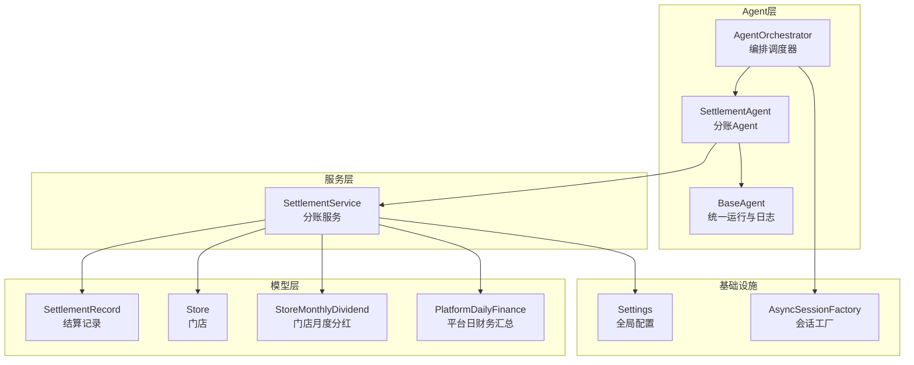
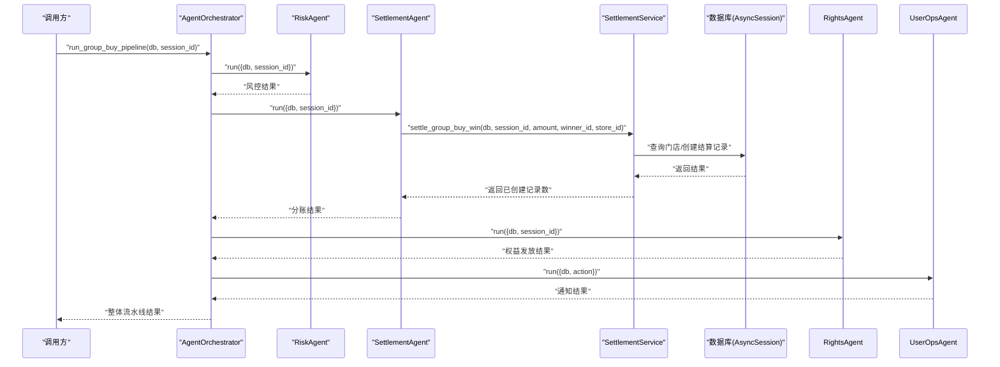
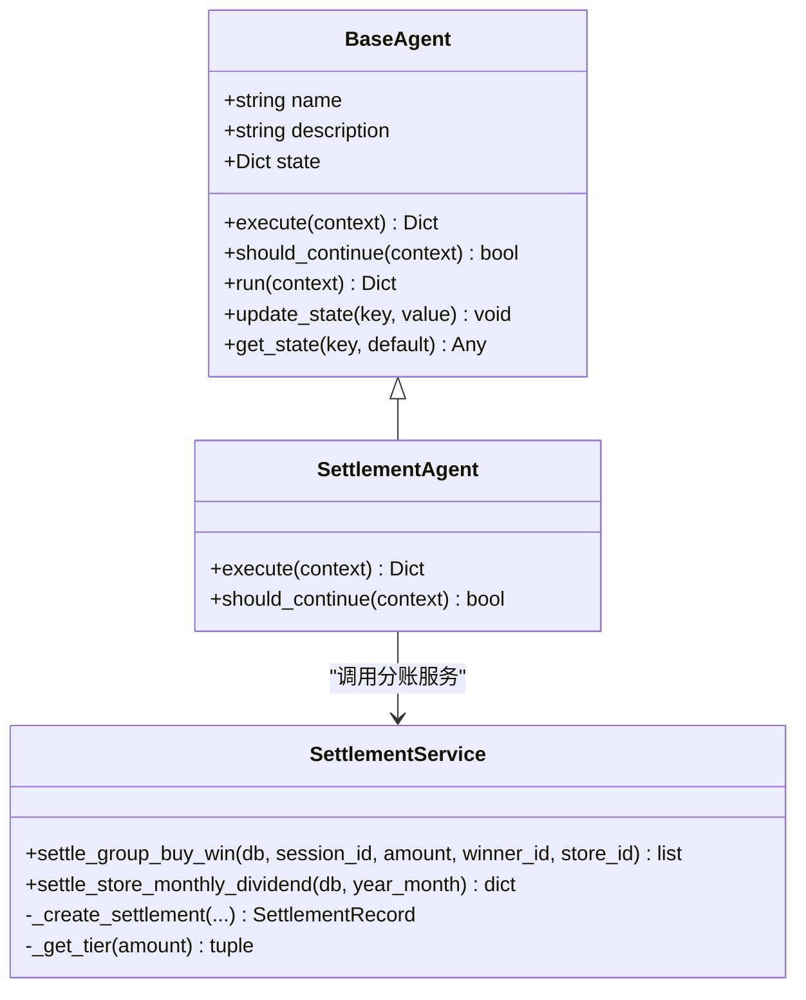
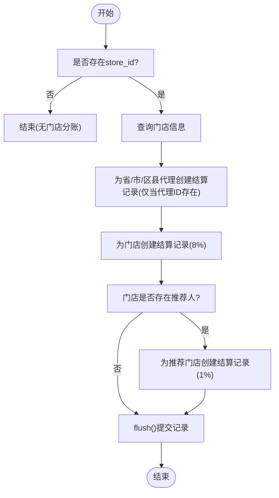
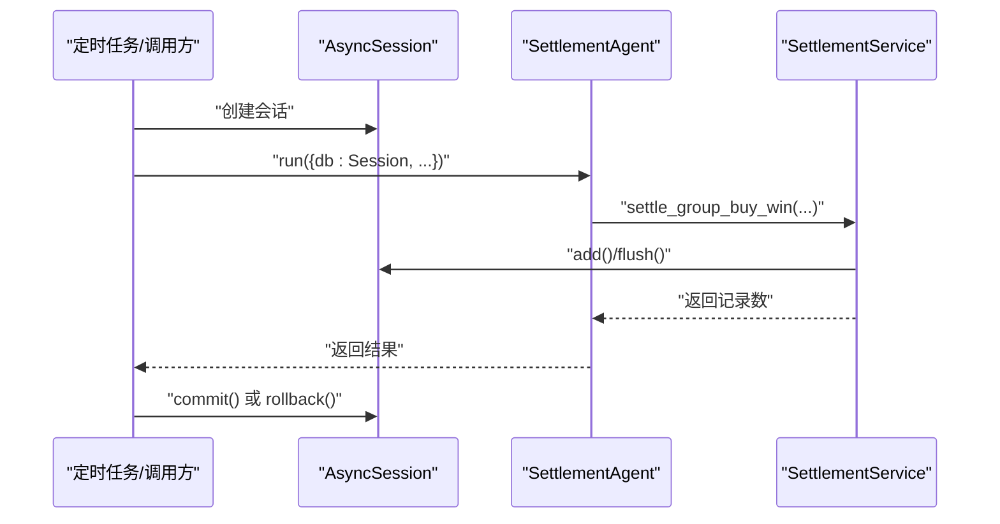
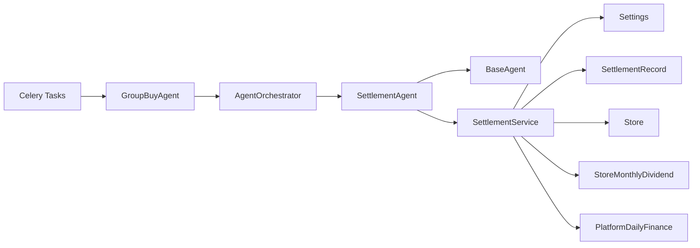

# AI智能分账Agent

<cite>
**本文引用的文件列表**
- [base_agent.py](file://backend/app/agents/base_agent.py)
- [all_agents.py](file://backend/app/agents/all_agents.py)
- [agent_orchestrator.py](file://backend/app/agents/agent_orchestrator.py)
- [settlement_service.py](file://backend/app/services/settlement_service.py)
- [settlement.py](file://backend/app/models/settlement.py)
- [store.py](file://backend/app/models/store.py)
- [config.py](file://backend/app/config.py)
- [database.py](file://backend/app/database.py)
- [group_buy_tasks.py](file://backend/app/tasks/group_buy_tasks.py)
</cite>

## 目录
1. [简介](#简介)
2. [项目结构](#项目结构)
3. [核心组件](#核心组件)
4. [架构总览](#架构总览)
5. [详细组件分析](#详细组件分析)
6. [依赖关系分析](#依赖关系分析)
7. [性能与精度考量](#性能与精度考量)
8. [故障排查指南](#故障排查指南)
9. [结论](#结论)
10. [附录：调用示例与最佳实践](#附录调用示例与最佳实践)

## 简介
本文件面向AIxingmu系统的“AI智能分账Agent”，聚焦SettlementAgent在订单完成后的自动分账能力。其核心职责是：当拼团场次结算完成后，按固定比例计算各方收益并写入结算记录，确保平台收支分配模型（100%）可追溯、可审计。文档将深入解析执行流程、输入参数、业务逻辑、与SettlementService的交互方式、分账算法原理、异常处理机制、状态管理与事务一致性保障，并提供调用示例与排错建议。

## 项目结构
围绕分账能力的代码主要分布在以下模块：
- Agent层：定义Agent基类与具体Agent实现，提供统一运行入口与状态管理
- Service层：封装分账业务逻辑与数据落库
- Model层：定义结算记录、门店及月度分红等数据模型
- 配置层：集中管理分账比例、让利比例、阶梯分红阈值等全局常量
- 数据库层：异步会话工厂与事务边界管理
- 任务层：定时任务驱动场次检查与结算流水线

图表来源
- [all_agents.py:7-21](file://backend/app/agents/all_agents.py#L7-L21)
- [settlement_service.py:17-85](file://backend/app/services/settlement_service.py#L17-L85)
- [settlement.py:30-63](file://backend/app/models/settlement.py#L30-L63)
- [store.py:22-63](file://backend/app/models/store.py#L22-L63)
- [config.py:69-99](file://backend/app/config.py#L69-L99)
- [database.py:17-21](file://backend/app/database.py#L17-L21)

章节来源
- [all_agents.py:1-22](file://backend/app/agents/all_agents.py#L1-L22)
- [settlement_service.py:1-85](file://backend/app/services/settlement_service.py#L1-L85)
- [settlement.py:1-63](file://backend/app/models/settlement.py#L1-L63)
- [store.py:1-63](file://backend/app/models/store.py#L1-L63)
- [config.py:69-99](file://backend/app/config.py#L69-L99)
- [database.py:17-21](file://backend/app/database.py#L17-L21)

## 核心组件
- SettlementAgent：对外暴露的分账Agent，负责从上下文提取参数并委托SettlementService完成分账计算与落库。
- SettlementService：实现分账算法与数据持久化，包括代理、门店、推荐门店的收益分配，以及门店月度阶梯分红。
- BaseAgent：为所有Agent提供统一的执行生命周期、日志与状态管理能力。
- AgentOrchestrator：编排风控→结算→权益→通知等Agent顺序执行。
- 数据模型：SettlementRecord、Store、StoreMonthlyDividend、PlatformDailyFinance等用于记录分账结果与平台财务对账。
- 配置：全局分账比例、让利比例、阶梯阈值等。

章节来源
- [all_agents.py:7-21](file://backend/app/agents/all_agents.py#L7-L21)
- [settlement_service.py:17-85](file://backend/app/services/settlement_service.py#L17-L85)
- [base_agent.py:12-47](file://backend/app/agents/base_agent.py#L12-L47)
- [agent_orchestrator.py:18-52](file://backend/app/agents/agent_orchestrator.py#L18-L52)
- [settlement.py:30-63](file://backend/app/models/settlement.py#L30-L63)
- [store.py:22-63](file://backend/app/models/store.py#L22-L63)
- [config.py:69-99](file://backend/app/config.py#L69-L99)

## 架构总览
下图展示了订单完成后，由编排器触发风控→结算→权益→通知的完整链路，其中结算阶段由SettlementAgent驱动，内部调用SettlementService进行分账计算与落库。

图表来源
- [agent_orchestrator.py:32-52](file://backend/app/agents/agent_orchestrator.py#L32-L52)
- [all_agents.py:7-21](file://backend/app/agents/all_agents.py#L7-L21)
- [settlement_service.py:21-85](file://backend/app/services/settlement_service.py#L21-L85)
- [database.py:29-39](file://backend/app/database.py#L29-L39)

## 详细组件分析

### SettlementAgent 分析与实现要点
- 职责：从上下文中读取db、session_id、amount、winner_id、store_id，调用SettlementService完成分账。
- 输入参数说明：
  - db：异步数据库会话（由上层注入或任务中创建）
  - session_id：场次ID，用于关联结算记录
  - amount：交易金额（通常为订单实付金额）
  - winner_id：拼中用户ID（当前实现未直接参与分账计算，但作为上下文保留）
  - store_id：门店ID，决定线下四级代理与门店分账是否生效
- 输出：返回本次分账创建的结算记录数量。

图表来源
- [base_agent.py:12-47](file://backend/app/agents/base_agent.py#L12-L47)
- [all_agents.py:7-21](file://backend/app/agents/all_agents.py#L7-L21)
- [settlement_service.py:17-85](file://backend/app/services/settlement_service.py#L17-L85)

章节来源
- [all_agents.py:7-21](file://backend/app/agents/all_agents.py#L7-L21)
- [base_agent.py:12-47](file://backend/app/agents/base_agent.py#L12-L47)

### SettlementService 分账算法与数据流
- 分账规则（线下四级分润+推荐门店）：
  - 省级代理：1%
  - 市级代理：2%
  - 区县代理：4%
  - 门店：8%
  - 推荐门店：1%
  - 以上合计14%，其余部分进入平台侧其他权益与利润池（详见配置层的100%分配模型）。
- 让利计算：
  - 总让利 = 交易金额 × GLOBAL_DISCOUNT_RATIO
- 计算流程：
  - 若存在store_id，则查询门店信息，获取省/市/区县代理ID；为每个有值的代理创建一条结算记录。
  - 为门店创建一条结算记录。
  - 若门店存在referrer_id，则为推荐门店创建一条结算记录。
  - 使用db.flush()批量提交到数据库，保证同一批次记录的原子性。
- 数据模型：
  - SettlementRecord：记录每笔分润的接收方、比例、金额、关联字段等。
  - Store：包含代理归属与推荐人信息。
  - PlatformDailyFinance：平台每日财务汇总，用于100%分配模型的平衡校验。

图表来源
- [settlement_service.py:21-85](file://backend/app/services/settlement_service.py#L21-L85)
- [store.py:22-63](file://backend/app/models/store.py#L22-L63)
- [settlement.py:30-63](file://backend/app/models/settlement.py#L30-L63)

章节来源
- [settlement_service.py:21-85](file://backend/app/services/settlement_service.py#L21-L85)
- [store.py:22-63](file://backend/app/models/store.py#L22-L63)
- [settlement.py:30-63](file://backend/app/models/settlement.py#L30-L63)

### 配置与分账比例
- 关键配置项：
  - GLOBAL_DISCOUNT_RATIO：整体让利比例
  - PROFIT_PROVINCE_RATIO / PROFIT_CITY_RATIO / PROFIT_DISTRICT_RATIO / PROFIT_STORE_RATIO / PROFIT_REFERRAL_STORE_RATIO：线下四级分润比例
  - DIST_*：平台100%分配模型中的各项支出与利润占比
- 这些配置被SettlementService在计算时引用，确保全系统分账规则一致且可配置。

章节来源
- [config.py:69-99](file://backend/app/config.py#L69-L99)

### 状态管理与事务一致性
- 状态管理：
  - SettlementAgent继承BaseAgent，具备state字典与logger，便于扩展后续复杂状态机。
  - 当前实现中should_continue返回False，表示单次执行即完成。
- 事务一致性：
  - 通过AsyncSession在调用方（如编排器或定时任务）中创建，并在外层commit/rollback。
  - SettlementService内部使用db.add()和db.flush()，确保同一次flush前所有记录在同一事务内。
  - 若上层发生异常，数据库会话会回滚，避免部分落库导致的数据不一致。

图表来源
- [database.py:29-39](file://backend/app/database.py#L29-L39)
- [settlement_service.py:84-85](file://backend/app/services/settlement_service.py#L84-L85)
- [all_agents.py:11-18](file://backend/app/agents/all_agents.py#L11-L18)

章节来源
- [base_agent.py:12-47](file://backend/app/agents/base_agent.py#L12-L47)
- [database.py:29-39](file://backend/app/database.py#L29-L39)
- [settlement_service.py:84-85](file://backend/app/services/settlement_service.py#L84-L85)
- [all_agents.py:11-18](file://backend/app/agents/all_agents.py#L11-L18)

## 依赖关系分析
- SettlementAgent依赖：
  - BaseAgent：统一运行与日志
  - SettlementService：分账计算与落库
- SettlementService依赖：
  - 配置（Settings）：分账比例与让利比例
  - 模型（SettlementRecord、Store、StoreMonthlyDividend、PlatformDailyFinance）：数据持久化
- 编排器（AgentOrchestrator）依赖：
  - 多个Agent实例，按顺序执行，形成流水线
- 任务（Celery）依赖：
  - 在同步任务中运行异步代码，创建AsyncSession并调用GroupBuyAgent，间接触发结算流程

图表来源
- [all_agents.py:7-21](file://backend/app/agents/all_agents.py#L7-L21)
- [settlement_service.py:17-85](file://backend/app/services/settlement_service.py#L17-L85)
- [agent_orchestrator.py:18-52](file://backend/app/agents/agent_orchestrator.py#L18-L52)
- [group_buy_tasks.py:17-53](file://backend/app/tasks/group_buy_tasks.py#L17-L53)

章节来源
- [all_agents.py:7-21](file://backend/app/agents/all_agents.py#L7-L21)
- [settlement_service.py:17-85](file://backend/app/services/settlement_service.py#L17-L85)
- [agent_orchestrator.py:18-52](file://backend/app/agents/agent_orchestrator.py#L18-L52)
- [group_buy_tasks.py:17-53](file://backend/app/tasks/group_buy_tasks.py#L17-L53)

## 性能与精度考量
- 性能特性：
  - 使用AsyncSession与异步SQLAlchemy，减少阻塞I/O
  - 批量add与flush，降低多次提交开销
  - 索引设计：结算记录表针对类型/状态与接收方建立索引，提升查询效率
- 精度控制：
  - 当前使用Float存储金额与比例，需注意浮点误差问题
  - 建议在关键财务场景引入Decimal类型或统一四舍五入策略，确保分账金额精确到分
- 可扩展性：
  - 分账比例集中在配置层，便于调整与灰度发布
  - Agent模式支持未来接入更复杂的规则引擎或LLM决策

[本节为通用指导，不直接分析具体文件]

## 故障排查指南
- 常见问题定位：
  - 缺少store_id：不会生成代理与门店分账记录，需确认上游传入参数
  - 代理ID为空：对应代理不会生成结算记录，需检查门店代理归属
  - 推荐门店为空：不会生成推荐门店分账记录，需检查门店referrer_id
  - 数据库异常：外层事务会回滚，检查日志与数据库连接池配置
- 日志与监控：
  - BaseAgent在run方法中记录执行开始、成功与失败日志，便于追踪
  - 可在SettlementService中增加关键步骤日志，辅助定位计算错误
- 重试与补偿：
  - 对于外部依赖失败，建议在上层加入重试与幂等校验
  - 基于related_session_id进行去重与补偿

章节来源
- [base_agent.py:31-41](file://backend/app/agents/base_agent.py#L31-L41)
- [settlement_service.py:21-85](file://backend/app/services/settlement_service.py#L21-L85)

## 结论
SettlementAgent以简洁清晰的职责划分，结合SettlementService的分账算法与配置化的比例规则，实现了订单完成后按固定比例计算各方收益并写入结算记录的核心能力。通过BaseAgent提供的统一运行与日志机制，以及AsyncSession的事务一致性保障，系统在正确配置与规范调用下能够稳定地支撑线下四级分润与平台100%分配模型的可追溯与可审计。

[本节为总结性内容，不直接分析具体文件]

## 附录：调用示例与最佳实践

### 调用示例（概念性描述）
- 在FastAPI路由或任务中创建AsyncSession，构造上下文并调用SettlementAgent.run：
  - 上下文包含：db、session_id、amount、winner_id、store_id
  - 调用后返回settled_records数量
- 在Celery定时任务中：
  - 创建AsyncSession，调用GroupBuyAgent的check_and_settle动作，内部会触发风控→结算→权益→通知流水线

章节来源
- [all_agents.py:11-18](file://backend/app/agents/all_agents.py#L11-L18)
- [agent_orchestrator.py:32-52](file://backend/app/agents/agent_orchestrator.py#L32-L52)
- [group_buy_tasks.py:30-40](file://backend/app/tasks/group_buy_tasks.py#L30-L40)

### 错误处理与日志记录
- 在Agent.run中捕获异常并记录错误日志，返回error字段
- 在Service层对关键分支添加日志，便于追踪分账计算过程
- 在外层事务中确保异常时回滚，避免部分落库

章节来源
- [base_agent.py:31-41](file://backend/app/agents/base_agent.py#L31-L41)
- [database.py:29-39](file://backend/app/database.py#L29-L39)

### 状态管理与事务处理
- 使用BaseAgent.state保存中间状态，便于后续扩展复杂流程
- 使用AsyncSession在调用方管理事务边界，Service层只做add与flush
- 通过related_session_id关联结算记录，便于对账与补偿

章节来源
- [base_agent.py:12-47](file://backend/app/agents/base_agent.py#L12-L47)
- [settlement_service.py:84-85](file://backend/app/services/settlement_service.py#L84-L85)
- [database.py:29-39](file://backend/app/database.py#L29-L39)