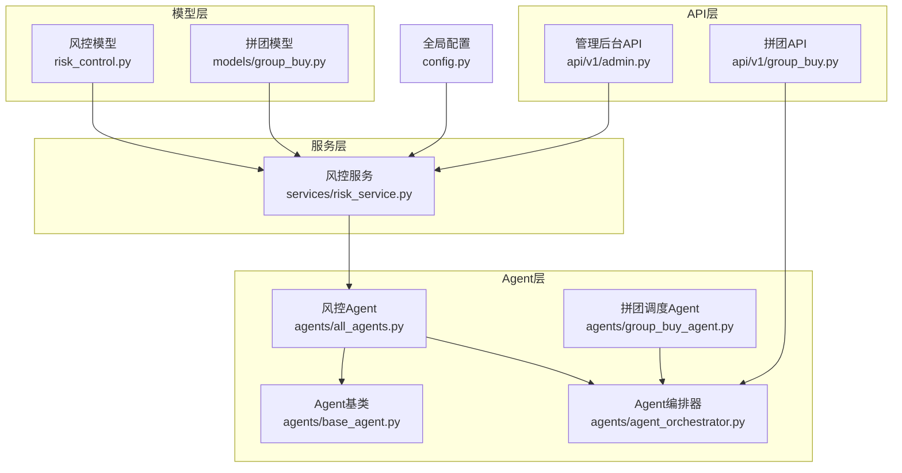
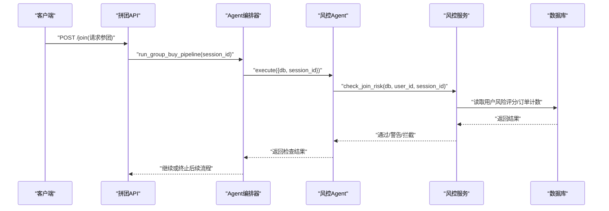
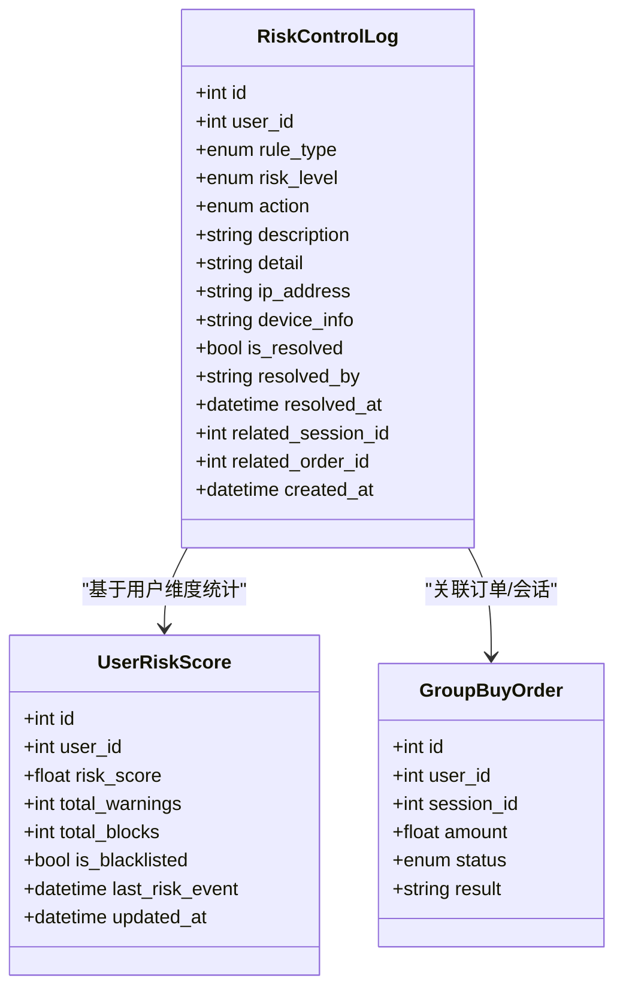
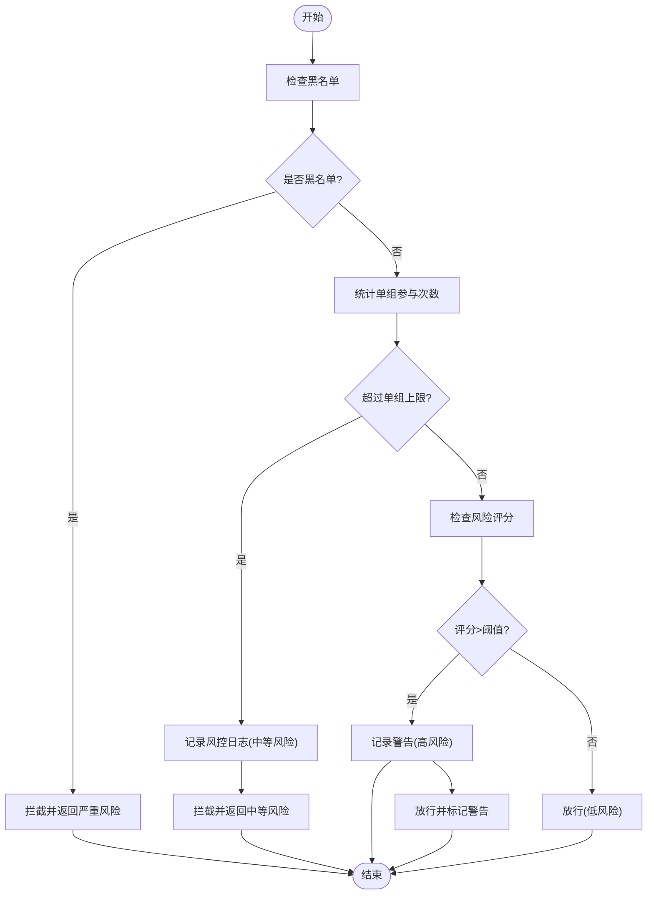
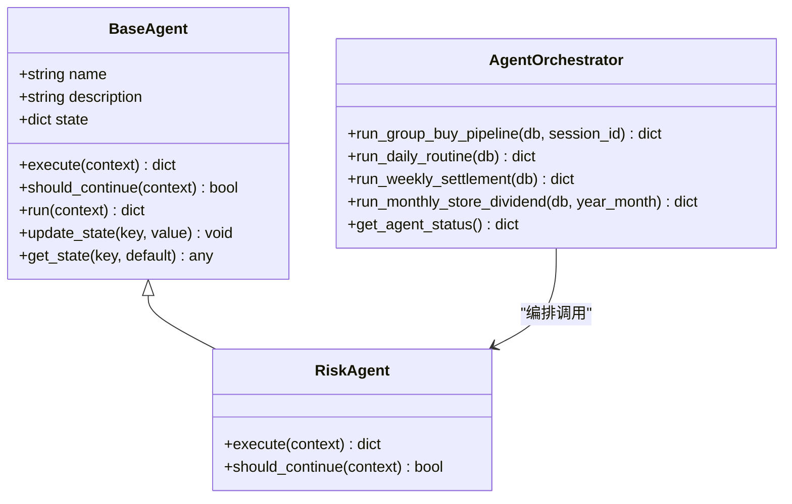
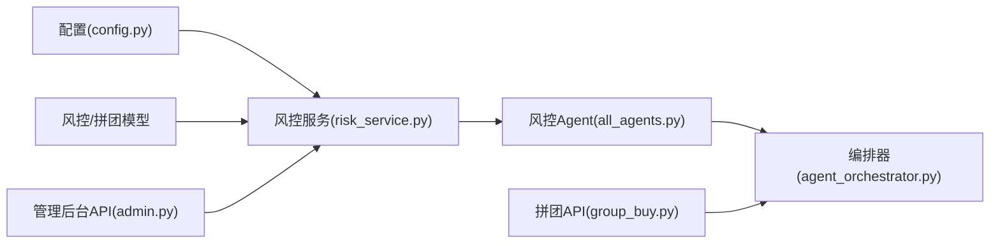

# AI智能风控Agent

<cite>
**本文引用的文件**   
- [risk_control.py](file://backend/app/models/risk_control.py)
- [risk_service.py](file://backend/app/services/risk_service.py)
- [all_agents.py](file://backend/app/agents/all_agents.py)
- [agent_orchestrator.py](file://backend/app/agents/agent_orchestrator.py)
- [group_buy_agent.py](file://backend/app/agents/group_buy_agent.py)
- [base_agent.py](file://backend/app/agents/base_agent.py)
- [admin.py](file://backend/app/api/v1/admin.py)
- [group_buy.py](file://backend/app/api/v1/group_buy.py)
- [config.py](file://backend/app/config.py)
- [group_buy.py](file://backend/app/models/group_buy.py)
</cite>

## 目录
1. [简介](#简介)
2. [项目结构](#项目结构)
3. [核心组件](#核心组件)
4. [架构总览](#架构总览)
5. [详细组件分析](#详细组件分析)
6. [依赖关系分析](#依赖关系分析)
7. [性能与高并发](#性能与高并发)
8. [故障排查指南](#故障排查指南)
9. [结论](#结论)
10. [附录：API接口文档](#附录api接口文档)

## 简介
本文件面向AIxingmu系统的“AI智能风控Agent”，聚焦于实时监控与违规拦截能力，覆盖限购规则校验、异常操作检测、违规开团识别等场景。文档从系统架构、数据模型、服务实现、Agent编排、API接口、性能与高并发策略、误报控制机制、以及风控数据的收集存储与分析流程等方面进行全面说明，帮助读者快速理解并落地使用。

## 项目结构
围绕风控相关代码，主要涉及以下模块：
- 数据模型层：风控日志与用户风险评分表定义
- 服务层：风控检查、评分更新、日志查询
- Agent层：风控Agent封装与统一编排器
- API层：管理后台的风控日志查询接口；拼团参与入口（在业务流中触发风控）
- 配置层：全局参数（如单组最大订单数）
- 业务模型层：拼团场次与订单状态枚举，供风控逻辑引用

图表来源
- [risk_control.py:1-85](file://backend/app/models/risk_control.py#L1-L85)
- [risk_service.py:1-135](file://backend/app/services/risk_service.py#L1-L135)
- [all_agents.py:96-114](file://backend/app/agents/all_agents.py#L96-L114)
- [agent_orchestrator.py:1-94](file://backend/app/agents/agent_orchestrator.py#L1-L94)
- [group_buy_agent.py:1-67](file://backend/app/agents/group_buy_agent.py#L1-L67)
- [base_agent.py:1-47](file://backend/app/agents/base_agent.py#L1-L47)
- [admin.py:1-86](file://backend/app/api/v1/admin.py#L1-L86)
- [group_buy.py:1-65](file://backend/app/api/v1/group_buy.py#L1-L65)
- [config.py:1-145](file://backend/app/config.py#L1-L145)
- [group_buy.py:1-158](file://backend/app/models/group_buy.py#L1-L158)

章节来源
- [risk_control.py:1-85](file://backend/app/models/risk_control.py#L1-L85)
- [risk_service.py:1-135](file://backend/app/services/risk_service.py#L1-L135)
- [all_agents.py:96-114](file://backend/app/agents/all_agents.py#L96-L114)
- [agent_orchestrator.py:1-94](file://backend/app/agents/agent_orchestrator.py#L1-L94)
- [group_buy_agent.py:1-67](file://backend/app/agents/group_buy_agent.py#L1-L67)
- [base_agent.py:1-47](file://backend/app/agents/base_agent.py#L1-L47)
- [admin.py:1-86](file://backend/app/api/v1/admin.py#L1-L86)
- [group_buy.py:1-65](file://backend/app/api/v1/group_buy.py#L1-L65)
- [config.py:1-145](file://backend/app/config.py#L1-L145)
- [group_buy.py:1-158](file://backend/app/models/group_buy.py#L1-L158)

## 核心组件
- 风控数据模型
  - 风控日志表：记录每次风控事件的用户、规则类型、风险等级、执行动作、描述、关联会话/订单、处理状态等，并提供按用户+时间、风险等级的索引。
  - 用户风险评分表：维护用户风险评分、累计警告/拦截次数、是否黑名单、最近风控事件时间等。
- 风控服务
  - 参团风控检查：黑名单判定、单组参与上限、风险评分阈值告警等。
  - 风险评分更新：根据事件类型加权加分，超过阈值自动加入黑名单。
  - 风控日志分页查询：支持按用户、风险等级过滤。
- 风控Agent
  - 将风控检查封装为Agent，便于纳入统一编排流水线。
- 编排器
  - 提供“风控→结算→权益→通知”的完整流水线，确保风控前置拦截。
- 配置项
  - 单ID单组最多订单数等关键风控阈值由配置集中管理。

章节来源
- [risk_control.py:1-85](file://backend/app/models/risk_control.py#L1-L85)
- [risk_service.py:1-135](file://backend/app/services/risk_service.py#L1-L135)
- [all_agents.py:96-114](file://backend/app/agents/all_agents.py#L96-L114)
- [agent_orchestrator.py:1-94](file://backend/app/agents/agent_orchestrator.py#L1-L94)
- [config.py:42-58](file://backend/app/config.py#L42-L58)

## 架构总览
风控体系采用“模型-服务-Agent-编排器-API”的分层设计，结合全局配置与业务模型，形成可插拔、可扩展的实时风控能力。

图表来源
- [group_buy.py:26-38](file://backend/app/api/v1/group_buy.py#L26-L38)
- [agent_orchestrator.py:32-52](file://backend/app/agents/agent_orchestrator.py#L32-L52)
- [all_agents.py:101-114](file://backend/app/agents/all_agents.py#L101-L114)
- [risk_service.py:17-74](file://backend/app/services/risk_service.py#L17-L74)

## 详细组件分析

### 风控数据模型
- 风险等级与动作
  - 风险等级：低、中、高、严重
  - 风控动作：放行、警告、拦截、冻结账号
- 规则类型
  - 单日参与上限、单场参与上限、单ID单组最多5单、异常操作检测、违规开团检测、金额异常检测、频率异常检测
- 风控日志表
  - 关键字段：用户ID、规则类型、风险等级、动作、描述、详情JSON、IP、设备信息、是否已处理、处理人、处理时间、关联会话/订单、创建时间
  - 索引：用户+时间、风险等级
- 用户风险评分表
  - 关键字段：用户ID、风险评分、累计警告次数、累计拦截次数、是否黑名单、最近风控事件时间、更新时间

图表来源
- [risk_control.py:13-85](file://backend/app/models/risk_control.py#L13-L85)
- [group_buy.py:89-131](file://backend/app/models/group_buy.py#L89-L131)

章节来源
- [risk_control.py:13-85](file://backend/app/models/risk_control.py#L13-L85)
- [group_buy.py:89-131](file://backend/app/models/group_buy.py#L89-L131)

### 风控服务（规则引擎与评分模型）
- 参团风控检查流程
  - 黑名单优先拦截
  - 单组参与次数限制（参考配置中的单组最大订单数）
  - 风险评分阈值告警（高于阈值则放行但标记警告）
- 风险评分更新
  - 根据事件类型加权加分（如超限、频率异常、违规开团、金额异常等）
  - 超过阈值自动加入黑名单
- 风控日志查询
  - 支持分页与条件过滤（用户、风险等级）

图表来源
- [risk_service.py:17-74](file://backend/app/services/risk_service.py#L17-L74)
- [config.py:58](file://backend/app/config.py#L58)

章节来源
- [risk_service.py:17-74](file://backend/app/services/risk_service.py#L17-L74)
- [config.py:58](file://backend/app/config.py#L58)

### 风控Agent与编排器
- 风控Agent
  - 封装风控检查调用，作为独立Agent参与统一编排
- 编排器
  - 提供“风控→结算→权益→通知”的流水线，确保风控前置
  - 提供每日例行任务与每周结算任务

图表来源
- [base_agent.py:12-47](file://backend/app/agents/base_agent.py#L12-L47)
- [all_agents.py:101-114](file://backend/app/agents/all_agents.py#L101-L114)
- [agent_orchestrator.py:18-94](file://backend/app/agents/agent_orchestrator.py#L18-L94)

章节来源
- [base_agent.py:12-47](file://backend/app/agents/base_agent.py#L12-L47)
- [all_agents.py:101-114](file://backend/app/agents/all_agents.py#L101-L114)
- [agent_orchestrator.py:18-94](file://backend/app/agents/agent_orchestrator.py#L18-L94)

### 风控场景处理逻辑
- 用户限购检查
  - 单ID单组最多N单（N来自配置），超限直接拦截并记录日志
- 会话参与限制
  - 仅统计当前会话内有效订单（待确认/已锁定）数量
- 异常行为识别
  - 风险评分超过阈值时放行但标记警告，用于后续人工审核或策略调整
- 违规开团检测
  - 规则类型包含“违规开团检测”，可在扩展中接入更复杂的检测算法（例如多会话聚合、跨用户关联等）

章节来源
- [risk_service.py:17-74](file://backend/app/services/risk_service.py#L17-L74)
- [risk_control.py:29-38](file://backend/app/models/risk_control.py#L29-L38)
- [config.py:58](file://backend/app/config.py#L58)

## 依赖关系分析
- 模型依赖
  - 风控服务依赖风控模型与拼团模型（订单状态、会话状态）
- 服务依赖
  - 风控服务依赖配置（阈值）、数据库异步会话
- Agent依赖
  - 风控Agent依赖风控服务
  - 编排器依赖所有Agent实例
- API依赖
  - 管理后台API依赖风控服务进行日志查询
  - 拼团API在业务流程中触发编排器，进而调用风控Agent

图表来源
- [config.py:1-145](file://backend/app/config.py#L1-L145)
- [risk_service.py:1-135](file://backend/app/services/risk_service.py#L1-L135)
- [all_agents.py:96-114](file://backend/app/agents/all_agents.py#L96-L114)
- [agent_orchestrator.py:1-94](file://backend/app/agents/agent_orchestrator.py#L1-L94)
- [admin.py:1-86](file://backend/app/api/v1/admin.py#L1-L86)
- [group_buy.py:1-65](file://backend/app/api/v1/group_buy.py#L1-L65)

章节来源
- [config.py:1-145](file://backend/app/config.py#L1-L145)
- [risk_service.py:1-135](file://backend/app/services/risk_service.py#L1-L135)
- [all_agents.py:96-114](file://backend/app/agents/all_agents.py#L96-L114)
- [agent_orchestrator.py:1-94](file://backend/app/agents/agent_orchestrator.py#L1-L94)
- [admin.py:1-86](file://backend/app/api/v1/admin.py#L1-L86)
- [group_buy.py:1-65](file://backend/app/api/v1/group_buy.py#L1-L65)

## 性能与高并发
- 实时处理能力
  - 风控检查以轻量SQL为主（计数、评分读取），适合高并发场景
- 高并发支持建议
  - 使用连接池与异步会话（已在配置中体现）
  - 对高频读路径引入缓存（如Redis）以降低数据库压力
  - 对风控日志写入采用批量写入或消息队列削峰
- 误报率控制机制
  - 动态阈值：通过配置项调整风险评分阈值与单组上限
  - 白名单机制：可在评分表中增加白名单字段或在检查前跳过特定用户
  - 灰度策略：对新规则先小流量验证，逐步放量
- 监控与观测
  - 利用风控日志的索引进行快速检索与统计
  - 对拦截率、警告率、平均响应时间建立看板

[本节为通用指导，不直接分析具体文件]

## 故障排查指南
- 常见问题定位
  - 拦截过多：检查黑名单与风险评分阈值配置，核对单组上限设置
  - 漏放风险：查看风控日志，确认规则类型与风险等级是否符合预期
  - 性能问题：关注数据库慢查询与连接池配置，必要时引入缓存
- 排查步骤
  - 通过管理后台API获取风控日志，筛选高风险与拦截事件
  - 针对特定用户，查看其风险评分变化轨迹与最近风控事件时间
  - 结合会话与订单信息，复现问题链路

章节来源
- [admin.py:70-79](file://backend/app/api/v1/admin.py#L70-L79)
- [risk_service.py:109-135](file://backend/app/services/risk_service.py#L109-L135)
- [risk_control.py:67-70](file://backend/app/models/risk_control.py#L67-L70)

## 结论
AI智能风控Agent通过“模型-服务-Agent-编排器”的分层设计与配置化阈值，实现了参团场景下的实时风控与违规拦截。当前版本已具备黑名单拦截、单组限购、风险评分告警等核心能力，并可通过扩展规则类型与评分模型进一步提升检测精度与覆盖面。建议在后续迭代中引入缓存与批处理优化、完善白名单与灰度策略，并建立完善的监控与审计体系。

[本节为总结性内容，不直接分析具体文件]

## 附录：API接口文档

### 风控日志查询（管理后台）
- 接口路径
  - GET /api/v1/risk/logs
- 功能说明
  - 获取风控日志列表，支持分页
- 请求参数
  - page: 页码（默认1）
  - size: 每页条数（默认20）
- 响应示例
  - 返回总条数、页码、每页大小与日志条目列表

章节来源
- [admin.py:70-79](file://backend/app/api/v1/admin.py#L70-L79)

### 参与拼团（业务入口，内部触发风控）
- 接口路径
  - POST /api/v1/join
- 功能说明
  - 用户参与拼团，内部会进入编排器并触发风控检查
- 请求体
  - session_id: 场次ID
- 响应
  - 成功：返回参团结果
  - 失败：抛出HTTP错误（如风控拦截）

章节来源
- [group_buy.py:26-38](file://backend/app/api/v1/group_buy.py#L26-L38)
- [agent_orchestrator.py:32-52](file://backend/app/agents/agent_orchestrator.py#L32-L52)

### 风控检查（内部服务方法）
- 方法签名
  - check_join_risk(db, user_id, session_id) -> dict
- 功能说明
  - 执行黑名单、单组限购、风险评分检查，返回允许/警告/拦截及风险等级
- 返回值字段
  - allowed: 是否允许
  - reason: 原因描述
  - risk_level: 风险等级
  - warning: 是否标记警告（可选）

章节来源
- [risk_service.py:17-74](file://backend/app/services/risk_service.py#L17-L74)

### 风险评分更新（内部服务方法）
- 方法签名
  - update_risk_score(db, user_id, event_type) -> None
- 功能说明
  - 根据事件类型为用户增加风险分，超过阈值加入黑名单

章节来源
- [risk_service.py:76-108](file://backend/app/services/risk_service.py#L76-L108)

### 风控日志分页查询（内部服务方法）
- 方法签名
  - get_risk_logs(db, user_id=None, risk_level=None, page=1, size=20) -> dict
- 功能说明
  - 按用户与风险等级过滤，返回分页结果

章节来源
- [risk_service.py:109-135](file://backend/app/services/risk_service.py#L109-L135)