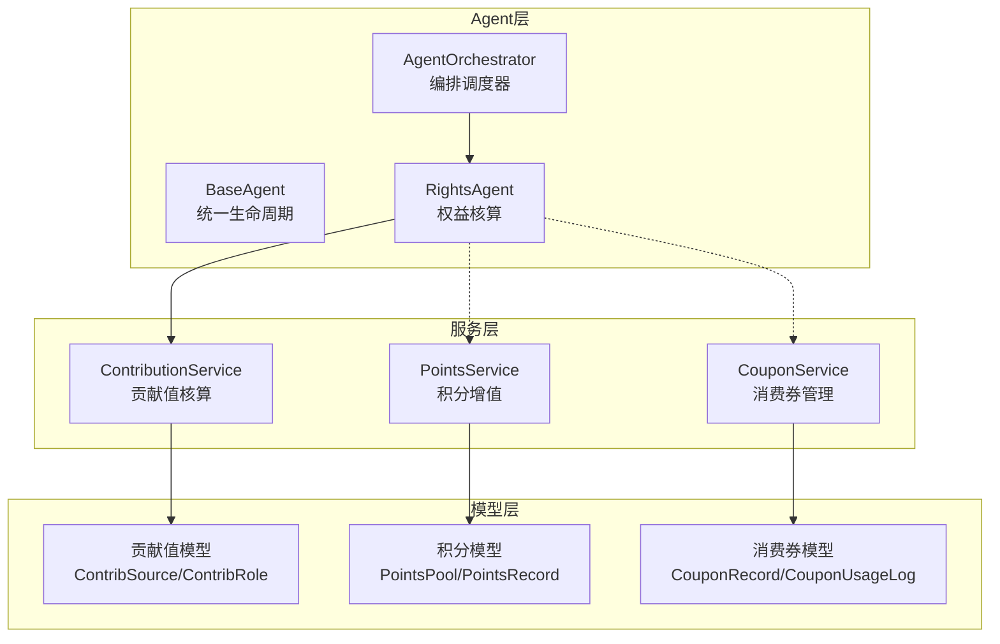
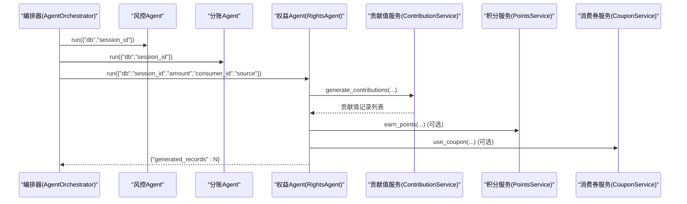
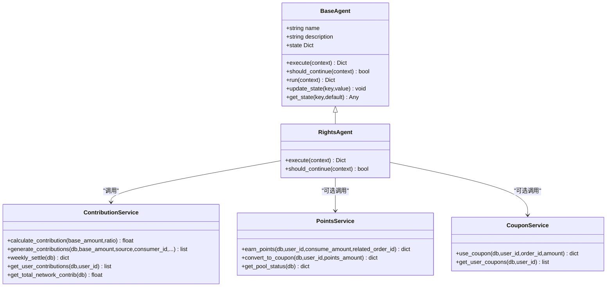
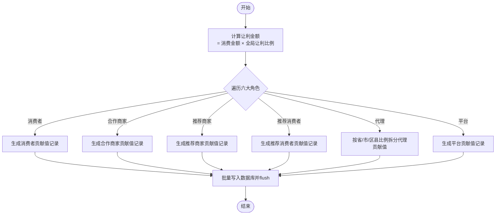
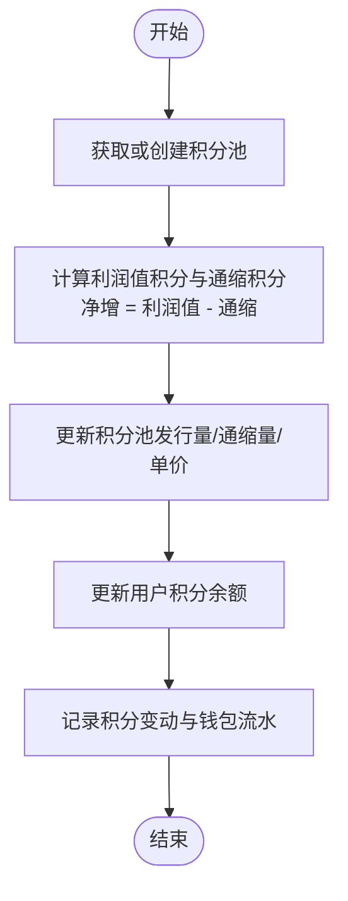
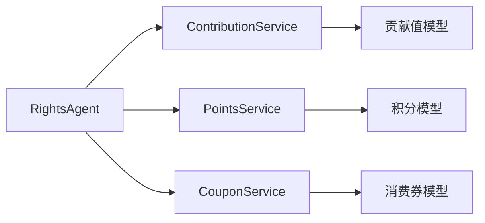
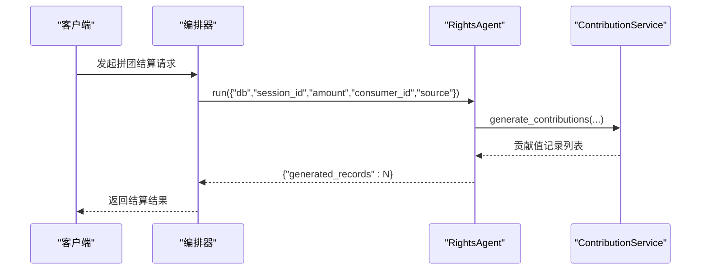

# AI权益核算Agent

<cite>
**本文引用的文件列表**
- [base_agent.py](file://backend/app/agents/base_agent.py)
- [all_agents.py](file://backend/app/agents/all_agents.py)
- [agent_orchestrator.py](file://backend/app/agents/agent_orchestrator.py)
- [contribution_service.py](file://backend/app/services/contribution_service.py)
- [points_service.py](file://backend/app/services/points_service.py)
- [coupon_service.py](file://backend/app/services/coupon_service.py)
- [contribution.py](file://backend/app/models/contribution.py)
- [points.py](file://backend/app/models/points.py)
- [coupon.py](file://backend/app/models/coupon.py)
</cite>

## 目录
1. [简介](#简介)
2. [项目结构](#项目结构)
3. [核心组件](#核心组件)
4. [架构总览](#架构总览)
5. [详细组件分析](#详细组件分析)
6. [依赖关系分析](#依赖关系分析)
7. [性能与并发安全](#性能与并发安全)
8. [故障排查指南](#故障排查指南)
9. [结论](#结论)
10. [附录：调用示例与最佳实践](#附录调用示例与最佳实践)

## 简介
本文件面向AIxingmu系统的“AI权益核算Agent”（RightsAgent），聚焦其核心职责与实现细节：在拼团成功后，依据交易金额、来源场景等输入参数，计算并生成贡献值、积分与消费券，并将其发放到用户账户。文档将系统阐述：
- RightsAgent的职责边界与执行流程
- 与ContributionService的协作方式及ContribSource枚举的使用
- 贡献值生成算法、积分计算规则、消费券发放策略
- 数据校验、批量处理与事务回滚机制
- 性能优化策略与并发安全保障

## 项目结构
围绕RightsAgent的相关代码分布在agents、services与models三层：
- agents层：定义BaseAgent抽象基类与具体Agent（含RightsAgent）
- services层：提供贡献值、积分、消费券的业务服务
- models层：定义贡献值、积分、消费券的数据模型与枚举

图表来源
- [agent_orchestrator.py:18-52](file://backend/app/agents/agent_orchestrator.py#L18-L52)
- [all_agents.py:29-46](file://backend/app/agents/all_agents.py#L29-L46)
- [contribution_service.py:16-143](file://backend/app/services/contribution_service.py#L16-L143)
- [points_service.py:15-92](file://backend/app/services/points_service.py#L15-L92)
- [coupon_service.py:13-75](file://backend/app/services/coupon_service.py#L13-L75)
- [contribution.py:15-69](file://backend/app/models/contribution.py#L15-L69)
- [points.py:14-59](file://backend/app/models/points.py#L14-L59)
- [coupon.py:14-42](file://backend/app/models/coupon.py#L14-L42)

章节来源
- [agent_orchestrator.py:18-52](file://backend/app/agents/agent_orchestrator.py#L18-L52)
- [all_agents.py:29-46](file://backend/app/agents/all_agents.py#L29-L46)

## 核心组件
- BaseAgent：提供统一的Agent生命周期（run/execute/should_continue）、状态管理与日志记录。
- RightsAgent：基于BaseAgent，负责根据上下文参数触发贡献值生成，并可扩展积分与消费券发放逻辑。
- ContributionService：提供贡献值计算与写入能力，支持多角色分配与周度结算。
- PointsService：提供积分获取、通缩与兑换为消费券的能力。
- CouponService：提供消费券使用与查询能力。

章节来源
- [base_agent.py:12-47](file://backend/app/agents/base_agent.py#L12-L47)
- [all_agents.py:29-46](file://backend/app/agents/all_agents.py#L29-L46)
- [contribution_service.py:16-143](file://backend/app/services/contribution_service.py#L16-L143)
- [points_service.py:15-92](file://backend/app/services/points_service.py#L15-L92)
- [coupon_service.py:13-75](file://backend/app/services/coupon_service.py#L13-L75)

## 架构总览
RightsAgent在拼团成功后的完整流水线中处于“分账→权益→通知”的关键环节。它通过ContributionService按六大角色生成贡献值记录；同时可联动PointsService与CouponService完成积分与消费券的发放或兑换。

图表来源
- [agent_orchestrator.py:32-52](file://backend/app/agents/agent_orchestrator.py#L32-L52)
- [all_agents.py:29-46](file://backend/app/agents/all_agents.py#L29-L46)
- [contribution_service.py:39-143](file://backend/app/services/contribution_service.py#L39-L143)
- [points_service.py:30-92](file://backend/app/services/points_service.py#L30-L92)
- [coupon_service.py:17-75](file://backend/app/services/coupon_service.py#L17-L75)

## 详细组件分析

### RightsAgent：职责与执行逻辑
- 职责边界
  - 解析上下文参数：amount、consumer_id、source（默认GROUP_BUY_WIN）、session_id等
  - 调用ContributionService.generate_contributions生成贡献值记录
  - 可扩展：在此处集成积分发放与消费券发放逻辑
- 输入参数处理
  - amount：交易金额，用于贡献值与积分计算的基础
  - consumer_id：消费者ID，作为贡献值归属主体之一
  - source：贡献值来源场景，使用ContribSource枚举（如GROUP_BUY_WIN）
  - session_id：关联拼团场次ID，便于溯源
- 与ContributionService协作
  - 直接调用generate_contributions(db, amount, source, consumer_id, related_session_id=...)
  - 返回生成的贡献值记录数量，供上层编排器汇总
- 业务规则接入点
  - 贡献值：由ContributionService按六大角色比例分配
  - 积分：可在RightsAgent.execute中调用PointsService.earn_points
  - 消费券：可在RightsAgent.execute中调用CouponService.use_coupon或直接增加余额（视业务策略）

图表来源
- [base_agent.py:12-47](file://backend/app/agents/base_agent.py#L12-L47)
- [all_agents.py:29-46](file://backend/app/agents/all_agents.py#L29-L46)
- [contribution_service.py:16-143](file://backend/app/services/contribution_service.py#L16-L143)
- [points_service.py:15-92](file://backend/app/services/points_service.py#L15-L92)
- [coupon_service.py:13-75](file://backend/app/services/coupon_service.py#L13-L75)

章节来源
- [all_agents.py:29-46](file://backend/app/agents/all_agents.py#L29-L46)
- [contribution_service.py:39-143](file://backend/app/services/contribution_service.py#L39-L143)

### ContributionService：贡献值生成算法与周度结算
- 贡献值计算公式
  - 让利金额 = 消费金额 × 全局让利比例
  - 贡献值 = 让利金额 × 角色分配比例 × 贡献乘数
- 六大角色分配
  - 消费者、合作商家、推荐商家、推荐消费者、代理（省/市/区县合计）、平台
  - 代理份额按比例进一步拆分至省、市、区县
- 生成流程
  - 根据传入参数构造各角色的贡献值记录对象
  - 批量写入数据库并flush
- 周度结算
  - 每周一对有效贡献值进行递减兑换，按日利率×7计算当周消费券
  - 更新用户消费券余额并记录结算明细

图表来源
- [contribution_service.py:29-143](file://backend/app/services/contribution_service.py#L29-L143)
- [contribution.py:15-69](file://backend/app/models/contribution.py#L15-L69)

章节来源
- [contribution_service.py:29-143](file://backend/app/services/contribution_service.py#L29-L143)
- [contribution.py:15-69](file://backend/app/models/contribution.py#L15-L69)

### PointsService：积分计算与兑换策略
- 积分获取
  - 每次消费新增利润值积分（固定比例）
  - 同步进行通缩（固定比例），净增积分 = 利润值 - 通缩
  - 动态单价 = 累计总金额 / 累计通缩数量
- 积分兑换消费券
  - 检查用户积分余额与积分池剩余
  - 按当前单价折算为消费券金额，扣减用户积分并增加消费券余额
  - 记录积分变动与钱包流水

图表来源
- [points_service.py:30-92](file://backend/app/services/points_service.py#L30-L92)
- [points.py:14-59](file://backend/app/models/points.py#L14-L59)

章节来源
- [points_service.py:30-92](file://backend/app/services/points_service.py#L30-L92)
- [points.py:14-59](file://backend/app/models/points.py#L14-L59)

### CouponService：消费券使用与查询
- 使用规则
  - 先进先出原则，按创建时间顺序抵扣
  - 更新每条券的已用与剩余金额，标记是否用完
  - 记录使用明细与钱包流水
- 查询接口
  - 按用户维度获取消费券列表

章节来源
- [coupon_service.py:17-75](file://backend/app/services/coupon_service.py#L17-L75)
- [coupon.py:14-42](file://backend/app/models/coupon.py#L14-L42)

## 依赖关系分析
- RightsAgent依赖ContributionService完成贡献值生成；可选依赖PointsService与CouponService完成积分与消费券处理。
- ContributionService依赖配置项（让利比例、角色比例、贡献乘数、日利率等）与贡献值模型。
- PointsService依赖积分池单例与用户钱包流水。
- CouponService依赖消费券记录与使用明细。

图表来源
- [all_agents.py:29-46](file://backend/app/agents/all_agents.py#L29-L46)
- [contribution_service.py:16-143](file://backend/app/services/contribution_service.py#L16-L143)
- [points_service.py:15-92](file://backend/app/services/points_service.py#L15-L92)
- [coupon_service.py:13-75](file://backend/app/services/coupon_service.py#L13-L75)
- [contribution.py:15-69](file://backend/app/models/contribution.py#L15-L69)
- [points.py:14-59](file://backend/app/models/points.py#L14-L59)
- [coupon.py:14-42](file://backend/app/models/coupon.py#L14-L42)

章节来源
- [all_agents.py:29-46](file://backend/app/agents/all_agents.py#L29-L46)
- [contribution_service.py:16-143](file://backend/app/services/contribution_service.py#L16-L143)
- [points_service.py:15-92](file://backend/app/services/points_service.py#L15-L92)
- [coupon_service.py:13-75](file://backend/app/services/coupon_service.py#L13-L75)

## 性能与并发安全
- 批量写入与flush
  - ContributionService在生成多条贡献值记录后统一flush，减少多次提交开销
- 异步会话
  - 所有服务方法均基于AsyncSession，避免阻塞I/O
- 并发安全建议
  - 在RightsAgent执行路径中，确保同一session_id的事务边界一致，避免重复发放
  - 对于积分池与用户余额更新，建议在应用层加锁或使用数据库行级锁保证一致性
  - 周度结算任务应串行化执行，避免并发导致重复结算
- 索引与查询优化
  - 贡献值、积分、消费券模型均已建立常用索引，提升查询效率

[本节为通用性能指导，不直接分析具体文件]

## 故障排查指南
- 常见错误
  - 参数缺失：amount、consumer_id为空或未传递
  - 来源场景非法：source未使用ContribSource枚举值
  - 积分不足：兑换时抛出余额不足异常
  - 消费券不足：使用时抛出余额不足异常
- 定位步骤
  - 检查RightsAgent.execute上下文参数完整性
  - 查看ContributionService.generate_contributions返回值与数据库记录
  - 核对PointsService与CouponService的钱包流水记录
- 日志与监控
  - BaseAgent.run会捕获异常并记录错误信息，便于快速定位

章节来源
- [base_agent.py:31-47](file://backend/app/agents/base_agent.py#L31-L47)
- [points_service.py:105-115](file://backend/app/services/points_service.py#L105-L115)
- [coupon_service.py:26-31](file://backend/app/services/coupon_service.py#L26-L31)

## 结论
RightsAgent作为AIxingmu系统中“权益核算”的核心入口，通过与ContributionService的深度协作，实现了贡献值的精准生成与多角色分配；同时具备扩展积分与消费券发放的能力。结合AgentOrchestrator的编排，RightsAgent在拼团成功后的关键链路中承担重要职责。通过合理的批量写入、异步I/O与索引优化，系统在性能与并发安全方面具备良好的基础。

[本节为总结性内容，不直接分析具体文件]

## 附录：调用示例与最佳实践

### 调用流程示例（概念性）
- 输入参数
  - amount：交易金额
  - consumer_id：消费者ID
  - source：贡献值来源场景（默认GROUP_BUY_WIN）
  - session_id：拼团场次ID
- 调用步骤
  - 编排器调用RightsAgent.run，传入上述上下文
  - RightsAgent.execute调用ContributionService.generate_contributions生成贡献值记录
  - 可选：调用PointsService.earn_points发放积分；调用CouponService.use_coupon使用消费券
  - 返回结果包含生成的贡献值记录数量

图表来源
- [agent_orchestrator.py:32-52](file://backend/app/agents/agent_orchestrator.py#L32-L52)
- [all_agents.py:29-46](file://backend/app/agents/all_agents.py#L29-L46)
- [contribution_service.py:39-143](file://backend/app/services/contribution_service.py#L39-L143)

### 数据验证与事务回滚
- 数据验证
  - 在RightsAgent.execute中对amount、consumer_id、source进行前置校验
  - 对积分兑换与消费券使用进行余额校验
- 事务回滚
  - 若任一环节失败，应在应用层回滚当前事务，确保贡献值、积分、消费券的一致性
  - 建议使用数据库事务包裹整个RightsAgent执行路径

### 批量处理与并发控制
- 批量处理
  - 对同一批次订单的贡献值生成采用批量写入，减少数据库交互次数
- 并发控制
  - 对同一用户的积分与消费券更新加锁，避免竞态条件
  - 对周度结算任务进行串行化执行

[本节为通用实践指导，不直接分析具体文件]