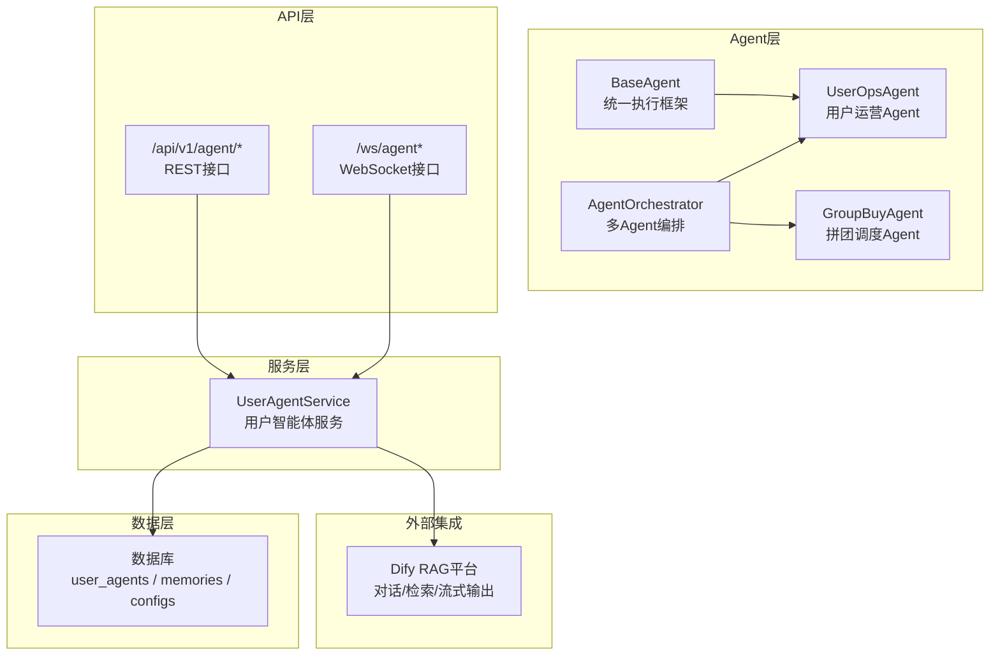
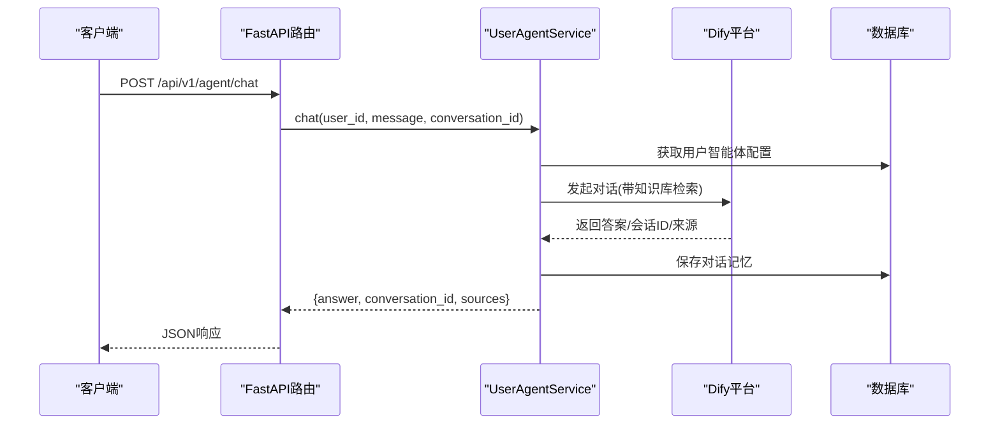
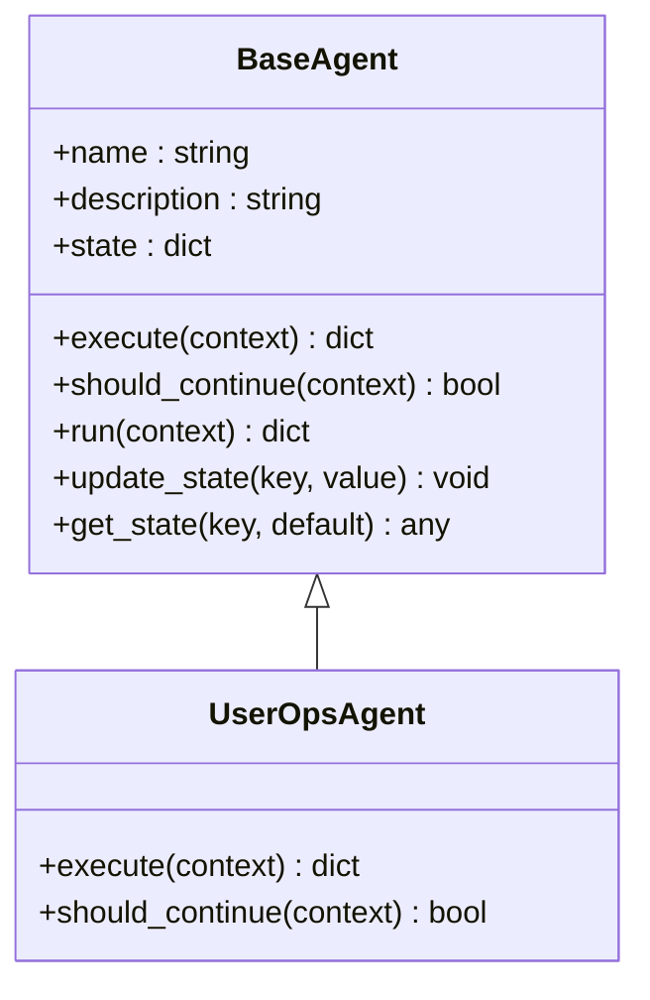
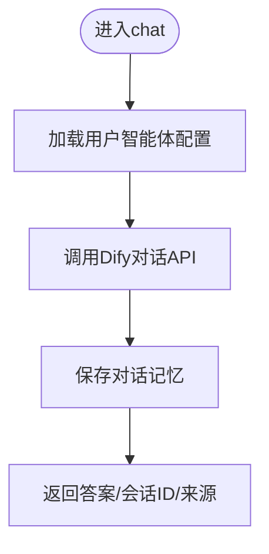
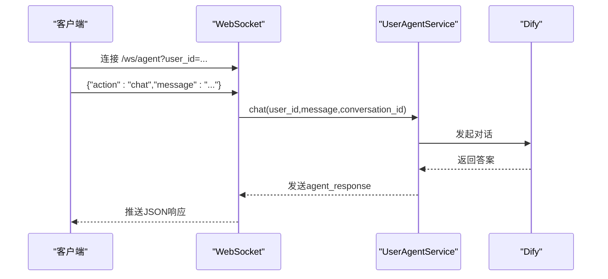
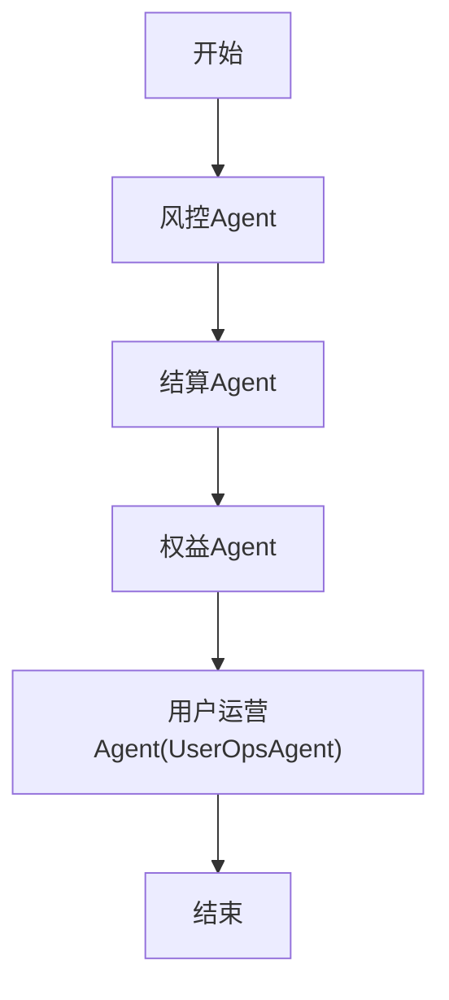
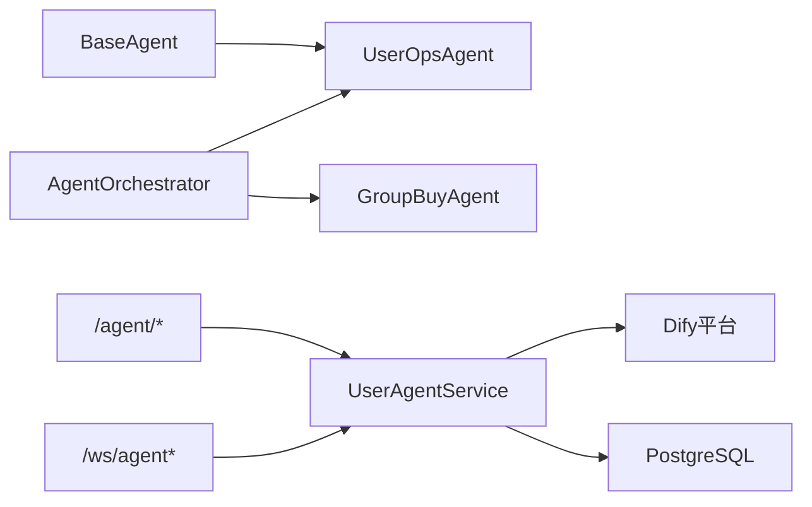

# AI用户运营Agent

<cite>
**本文引用的文件**   
- [backend/app/agents/base_agent.py](file://backend/app/agents/base_agent.py)
- [backend/app/agents/all_agents.py](file://backend/app/agents/all_agents.py)
- [backend/app/agents/agent_orchestrator.py](file://backend/app/agents/agent_orchestrator.py)
- [backend/app/agents/group_buy_agent.py](file://backend/app/agents/group_buy_agent.py)
- [backend/app/services/user_agent_service.py](file://backend/app/services/user_agent_service.py)
- [backend/app/models/user_agent.py](file://backend/app/models/user_agent.py)
- [backend/app/api/v1/user_agent.py](file://backend/app/api/v1/user_agent.py)
- [backend/app/api/v1/agent_ws.py](file://backend/app/api/v1/agent_ws.py)
- [backend/app/config.py](file://backend/app/config.py)
- [backend/app/models/user.py](file://backend/app/models/user.py)
- [backend/app/schemas/main.py](file://backend/app/schemas/main.py)
</cite>

## 目录
1. [简介](#简介)
2. [项目结构](#项目结构)
3. [核心组件](#核心组件)
4. [架构总览](#架构总览)
5. [详细组件分析](#详细组件分析)
6. [依赖关系分析](#依赖关系分析)
7. [性能与可扩展性](#性能与可扩展性)
8. [安全与合规](#安全与合规)
9. [故障排查指南](#故障排查指南)
10. [结论](#结论)
11. [附录：API接口文档](#附录api接口文档)

## 简介
本文件面向AIxingmu系统的“AI用户运营Agent”（UserOpsAgent），全面阐述其智能运营能力与实现细节。该Agent基于LLM（通过Dify平台）提供用户对话、开团信息推送、规则解答、用户激活等运营动作，并与拼团、结算、权益、风控等Agent协同工作。文档覆盖系统架构、状态管理、消息模板、用户画像与个性化推荐思路、行为预测模型建议、API接口、配置项与安全合规要求。

## 项目结构
围绕UserOpsAgent的相关代码主要分布在以下模块：
- Agent基类与编排器：定义统一执行框架与多Agent协作流程
- 用户智能体服务：封装与Dify的交互、知识库与记忆管理
- API层：REST与WebSocket双通道暴露对话与配置能力
- 数据模型：用户智能体、记忆、知识来源与个性化配置
- 全局配置：LLM/Dify/向量库参数



图示来源
- [backend/app/agents/base_agent.py:12-47](file://backend/app/agents/base_agent.py#L12-L47)
- [backend/app/agents/agent_orchestrator.py:18-94](file://backend/app/agents/agent_orchestrator.py#L18-L94)
- [backend/app/agents/all_agents.py:65-77](file://backend/app/agents/all_agents.py#L65-L77)
- [backend/app/agents/group_buy_agent.py:15-67](file://backend/app/agents/group_buy_agent.py#L15-L67)
- [backend/app/services/user_agent_service.py:61-318](file://backend/app/services/user_agent_service.py#L61-L318)
- [backend/app/api/v1/user_agent.py:1-145](file://backend/app/api/v1/user_agent.py#L1-L145)
- [backend/app/api/v1/agent_ws.py:1-228](file://backend/app/api/v1/agent_ws.py#L1-L228)

章节来源
- [backend/app/agents/base_agent.py:12-47](file://backend/app/agents/base_agent.py#L12-L47)
- [backend/app/agents/agent_orchestrator.py:18-94](file://backend/app/agents/agent_orchestrator.py#L18-L94)
- [backend/app/agents/all_agents.py:65-77](file://backend/app/agents/all_agents.py#L65-L77)
- [backend/app/agents/group_buy_agent.py:15-67](file://backend/app/agents/group_buy_agent.py#L15-L67)
- [backend/app/services/user_agent_service.py:61-318](file://backend/app/services/user_agent_service.py#L61-L318)
- [backend/app/api/v1/user_agent.py:1-145](file://backend/app/api/v1/user_agent.py#L1-L145)
- [backend/app/api/v1/agent_ws.py:1-228](file://backend/app/api/v1/agent_ws.py#L1-L228)

## 核心组件
- BaseAgent：定义统一的execute/should_continue/run生命周期与状态存取，为所有Agent提供一致的执行与错误处理语义。
- AgentOrchestrator：编排多Agent流水线（如风控→结算→权益→通知），在关键业务节点触发UserOpsAgent进行通知或运营动作。
- UserOpsAgent：用户运营Agent，当前作为占位实现，预留action分支以接入LLM驱动的对话、推送与激活策略。
- UserAgentService：用户智能体服务，负责：
  - 为新用户创建独立Dify应用与知识库
  - 上传平台共享知识与用户私有知识
  - 调用Dify完成对话（同步/流式）
  - 维护对话记忆与上下文更新
- API层：
  - REST：/agent/chat、/agent/chat/stream、/agent/conversations、/agent/knowledge、/agent/config
  - WebSocket：/ws/agent、/ws/agent/stream，支持实时与逐字输出
- 数据模型：
  - user_agents：每个用户的智能体实例与Dify绑定信息
  - user_agent_memories：对话记忆
  - agent_knowledge_sources：知识来源记录
  - user_agent_configs：个性化配置（回复风格、语言、通知开关等）

章节来源
- [backend/app/agents/base_agent.py:12-47](file://backend/app/agents/base_agent.py#L12-L47)
- [backend/app/agents/agent_orchestrator.py:18-94](file://backend/app/agents/agent_orchestrator.py#L18-L94)
- [backend/app/agents/all_agents.py:65-77](file://backend/app/agents/all_agents.py#L65-L77)
- [backend/app/services/user_agent_service.py:61-318](file://backend/app/services/user_agent_service.py#L61-L318)
- [backend/app/models/user_agent.py:10-96](file://backend/app/models/user_agent.py#L10-L96)
- [backend/app/api/v1/user_agent.py:1-145](file://backend/app/api/v1/user_agent.py#L1-L145)
- [backend/app/api/v1/agent_ws.py:1-228](file://backend/app/api/v1/agent_ws.py#L1-L228)

## 架构总览
下图展示从客户端到Dify的完整调用链路，以及UserOpsAgent在多Agent流水线中的位置。



图示来源
- [backend/app/api/v1/user_agent.py:57-74](file://backend/app/api/v1/user_agent.py#L57-L74)
- [backend/app/services/user_agent_service.py:137-167](file://backend/app/services/user_agent_service.py#L137-L167)
- [backend/app/models/user_agent.py:10-35](file://backend/app/models/user_agent.py#L10-L35)

## 详细组件分析

### UserOpsAgent（用户运营Agent）
- 职责定位：在拼团结果、结算、权益发放后，由编排器触发进行通知与运营动作；同时可作为独立入口承载对话、规则解答与用户激活。
- 当前实现：占位execute逻辑，按action分发，便于后续接入LLM驱动的策略。
- 与编排器联动：在run_group_buy_pipeline中，作为“通知”环节被调用。



图示来源
- [backend/app/agents/base_agent.py:12-47](file://backend/app/agents/base_agent.py#L12-L47)
- [backend/app/agents/all_agents.py:65-77](file://backend/app/agents/all_agents.py#L65-L77)

章节来源
- [backend/app/agents/all_agents.py:65-77](file://backend/app/agents/all_agents.py#L65-L77)
- [backend/app/agents/agent_orchestrator.py:32-52](file://backend/app/agents/agent_orchestrator.py#L32-L52)

### 用户智能体服务（UserAgentService）
- 功能要点：
  - 注册时为用户创建Dify数据集与应用，并注入平台共享知识
  - 支持添加用户私有知识，持久化知识来源
  - 同步/流式对话，自动保存对话记忆
  - 动态更新用户上下文至知识库，支撑个性化回答
- 提示词工程：
  - 构建系统提示词，明确角色、职责、注意事项，并嵌入用户标识以便上下文关联



图示来源
- [backend/app/services/user_agent_service.py:137-167](file://backend/app/services/user_agent_service.py#L137-L167)
- [backend/app/services/user_agent_service.py:268-292](file://backend/app/services/user_agent_service.py#L268-L292)
- [backend/app/services/user_agent_service.py:293-313](file://backend/app/services/user_agent_service.py#L293-L313)

章节来源
- [backend/app/services/user_agent_service.py:61-318](file://backend/app/services/user_agent_service.py#L61-L318)

### 数据模型（用户智能体相关）
- user_agents：存储Dify应用ID、API Key、知识库ID、系统提示词、活跃状态、对话统计等
- user_agent_memories：记录每轮对话的角色与内容，支持conversation_id与token消耗统计
- agent_knowledge_sources：记录知识来源类型（平台/个人/订单/贡献值等）及对应文档ID
- user_agent_configs：个性化配置（回复风格、语言、通知开关、关注话题、自动摘要等）

```mermaid
erDiagram
USER_AGENTS {
int id PK
int user_id UK
string dify_app_id
string dify_api_key
string dify_dataset_id
string agent_name
text system_prompt
boolean is_active
int total_chats
datetime last_chat_at
}
USER_AGENT_MEMORIES {
int id PK
int agent_id FK
string role
text content
string conversation_id
int tokens_used
}
AGENT_KNOWLEDGE_SOURCES {
int id PK
int agent_id FK
string source_type
string title
text content
string dify_document_id
}
USER_AGENT_CONFIGS {
int id PK
int agent_id UK FK
string response_style
string language
boolean enable_notifications
string notification_types
string preferred_topics
boolean auto_summary
}
USER_AGENTS ||--o{ USER_AGENT_MEMORIES : "拥有"
USER_AGENTS ||--o{ AGENT_KNOWLEDGE_SOURCES : "包含"
USER_AGENTS ||--|| USER_AGENT_CONFIGS : "配置"
```

图示来源
- [backend/app/models/user_agent.py:10-96](file://backend/app/models/user_agent.py#L10-L96)

章节来源
- [backend/app/models/user_agent.py:10-96](file://backend/app/models/user_agent.py#L10-L96)

### API层（REST与WebSocket）
- REST端点：
  - GET /agent/status：查询智能体状态
  - POST /agent/chat：普通对话
  - POST /agent/chat/stream：SSE流式对话
  - GET /agent/conversations：历史对话列表
  - POST /agent/knowledge：添加私有知识
  - GET /agent/config：获取智能体配置
- WebSocket端点：
  - /ws/agent：双向聊天、订阅频道、状态查询、心跳
  - /ws/agent/stream：逐字流式输出



图示来源
- [backend/app/api/v1/agent_ws.py:19-147](file://backend/app/api/v1/agent_ws.py#L19-L147)
- [backend/app/api/v1/user_agent.py:57-97](file://backend/app/api/v1/user_agent.py#L57-L97)

章节来源
- [backend/app/api/v1/user_agent.py:1-145](file://backend/app/api/v1/user_agent.py#L1-L145)
- [backend/app/api/v1/agent_ws.py:1-228](file://backend/app/api/v1/agent_ws.py#L1-L228)

### 多Agent编排与UserOpsAgent联动
- 拼团流水线：风控→结算→权益→用户运营（通知）
- 每日例行：创建场次→检查过期→结算已满场次
- 周/月任务：分红结算、门店阶梯分红



图示来源
- [backend/app/agents/agent_orchestrator.py:32-52](file://backend/app/agents/agent_orchestrator.py#L32-L52)
- [backend/app/agents/all_agents.py:65-77](file://backend/app/agents/all_agents.py#L65-L77)

章节来源
- [backend/app/agents/agent_orchestrator.py:32-94](file://backend/app/agents/agent_orchestrator.py#L32-L94)
- [backend/app/agents/all_agents.py:65-77](file://backend/app/agents/all_agents.py#L65-L77)

## 依赖关系分析
- 内部依赖
  - UserOpsAgent继承自BaseAgent，复用统一执行与日志机制
  - AgentOrchestrator聚合多个Agent，按业务阶段顺序调用
  - UserAgentService依赖Dify客户端与数据库会话
- 外部依赖
  - Dify平台：提供RAG对话、知识库检索与流式输出
  - PostgreSQL：持久化智能体配置、记忆与知识来源
  - Redis/Celery：用于异步任务与缓存（与UserOpsAgent间接相关）



图示来源
- [backend/app/agents/base_agent.py:12-47](file://backend/app/agents/base_agent.py#L12-L47)
- [backend/app/agents/agent_orchestrator.py:18-94](file://backend/app/agents/agent_orchestrator.py#L18-L94)
- [backend/app/services/user_agent_service.py:61-318](file://backend/app/services/user_agent_service.py#L61-L318)

章节来源
- [backend/app/agents/base_agent.py:12-47](file://backend/app/agents/base_agent.py#L12-L47)
- [backend/app/agents/agent_orchestrator.py:18-94](file://backend/app/agents/agent_orchestrator.py#L18-L94)
- [backend/app/services/user_agent_service.py:61-318](file://backend/app/services/user_agent_service.py#L61-L318)

## 性能与可扩展性
- 流式输出：通过SSE/WebSocket将大模型响应分块推送，降低首字节延迟，提升用户体验
- 异步IO：服务层使用异步数据库会话与异步HTTP调用，提高并发吞吐
- 知识库分层：平台共享知识+用户私有知识，减少重复推理成本，提升检索命中率
- 扩展建议：
  - 引入缓存层（Redis）缓存热点问答与用户上下文快照
  - 对长对话进行摘要压缩，控制上下文长度与Token成本
  - 增加重试与熔断机制，保障Dify服务异常时的稳定性

[本节为通用指导，不直接分析具体文件]

## 安全与合规
- 认证鉴权：API端点通过JWT中间件校验用户身份，确保仅本人访问自身智能体与对话数据
- 隐私保护：
  - 用户私有知识隔离于各自Dify数据集
  - 系统提示词不包含敏感个人信息
- 数据安全：
  - Dify API Key与数据库凭证通过环境变量管理
  - 对话记忆仅保留必要字段，避免泄露敏感交易细节
- 合规建议：
  - 对用户输入进行敏感词过滤与内容审核
  - 对模型输出进行二次校验，防止不当引导
  - 保留审计日志，满足可追溯要求

章节来源
- [backend/app/api/v1/user_agent.py:57-74](file://backend/app/api/v1/user_agent.py#L57-L74)
- [backend/app/services/user_agent_service.py:293-313](file://backend/app/services/user_agent_service.py#L293-L313)

## 故障排查指南
- 常见问题
  - 智能体未创建：返回“智能体不存在”，需先完成注册流程以初始化Dify应用与知识库
  - JSON解析失败：WebSocket消息格式不正确，检查客户端协议
  - 网络异常：Dify不可达或服务限流，需重试或降级
- 定位方法
  - 查看服务日志中“智能体对话错误”堆栈
  - 核对user_agents表是否存在有效记录
  - 验证Dify应用ID与API Key是否匹配
- 恢复步骤
  - 重新创建用户智能体（调用create_agent_for_user）
  - 清理无效会话或重置conversation_id
  - 调整超时与重试策略

章节来源
- [backend/app/api/v1/agent_ws.py:139-147](file://backend/app/api/v1/agent_ws.py#L139-L147)
- [backend/app/services/user_agent_service.py:148-151](file://backend/app/services/user_agent_service.py#L148-L151)

## 结论
UserOpsAgent在AIxingmu系统中承担“用户运营”的关键角色，既可在多Agent流水线中承接通知与激活动作，也可作为独立入口提供基于LLM的智能对话与个性化服务。通过Dify的RAG能力与用户私有知识库，系统实现了“懂规则、懂用户、能行动”的运营闭环。后续可进一步引入用户画像、个性化推荐与行为预测模型，增强主动运营与转化效果。

[本节为总结性内容，不直接分析具体文件]

## 附录：API接口文档

### 通用说明
- 基础路径：/api/v1
- 认证方式：Bearer Token（JWT）
- 请求/响应模型参考：schemas.main

章节来源
- [backend/app/schemas/main.py:1-176](file://backend/app/schemas/main.py#L1-L176)

### 用户智能体（REST）
- GET /agent/status
  - 描述：获取用户智能体状态
  - 成功返回：has_agent、agent_name、total_chats、last_chat_at、created_at
- POST /agent/chat
  - 描述：与智能体对话
  - 请求体：ChatRequest(message, conversation_id?)
  - 响应体：ChatResponse(answer, conversation_id, sources[])
- POST /agent/chat/stream
  - 描述：SSE流式对话
  - 响应：text/event-stream，data: JSON片段
- GET /agent/conversations
  - 描述：获取历史对话列表
- POST /agent/knowledge
  - 描述：添加用户私有知识
  - 请求体：KnowledgeRequest(title, content)
- GET /agent/config
  - 描述：获取智能体配置

章节来源
- [backend/app/api/v1/user_agent.py:36-145](file://backend/app/api/v1/user_agent.py#L36-L145)

### 用户智能体（WebSocket）
- /ws/agent
  - 客户端消息示例：{"action":"chat","message":"...","conversation_id":"可选"}
  - 服务端响应示例：{"type":"agent_response","content":"...","conversation_id":"...","sources":[]}
  - 其他action：subscribe、get_status、ping
- /ws/agent/stream
  - 客户端消息示例：{"action":"chat_stream","message":"...","conversation_id":"可选"}
  - 服务端事件：stream_start、stream_chunk、stream_end、error

章节来源
- [backend/app/api/v1/agent_ws.py:19-228](file://backend/app/api/v1/agent_ws.py#L19-L228)

### 配置选项（LLM/Dify/向量库）
- LLM_API_KEY、LLM_API_BASE、LLM_MODEL
- DIFY_API_URL、DIFY_API_KEY、DIFY_DEFAULT_MODEL
- VECTOR_DIMENSION、VECTOR_INDEX_TYPE

章节来源
- [backend/app/config.py:125-138](file://backend/app/config.py#L125-L138)

### 用户画像与个性化（概念设计）
- 画像维度：角色、地区、消费层级、团队规模、资产余额、活跃度
- 个性化推荐：基于历史参与偏好与收益目标，推荐合适场次与策略
- 行为预测：结合时间序列与特征工程，预测用户下次参与概率与流失风险
- 落地建议：在UserAgentService.update_user_context中定期写入最新画像快照至知识库，供Dify检索引用

[本节为概念性内容，不直接分析具体文件]