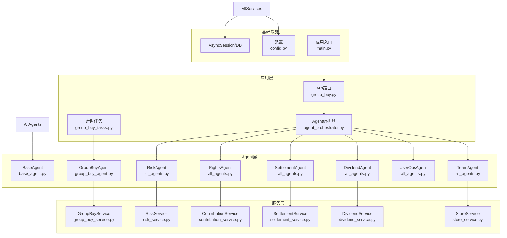
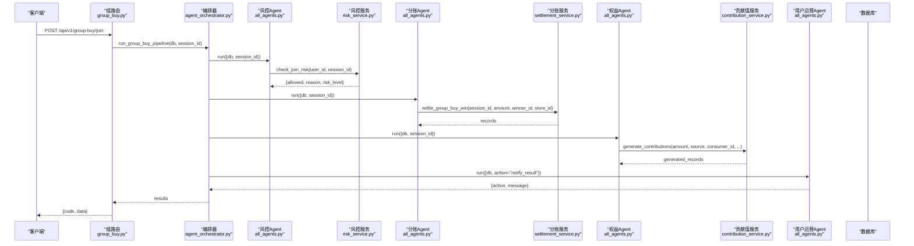
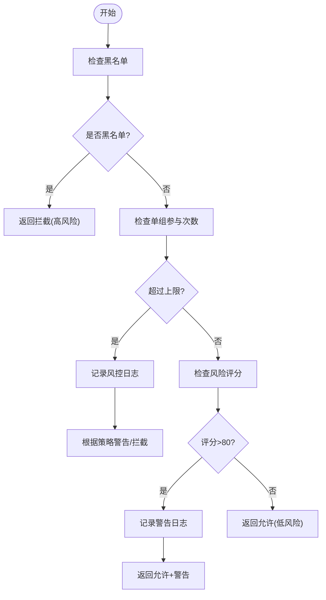
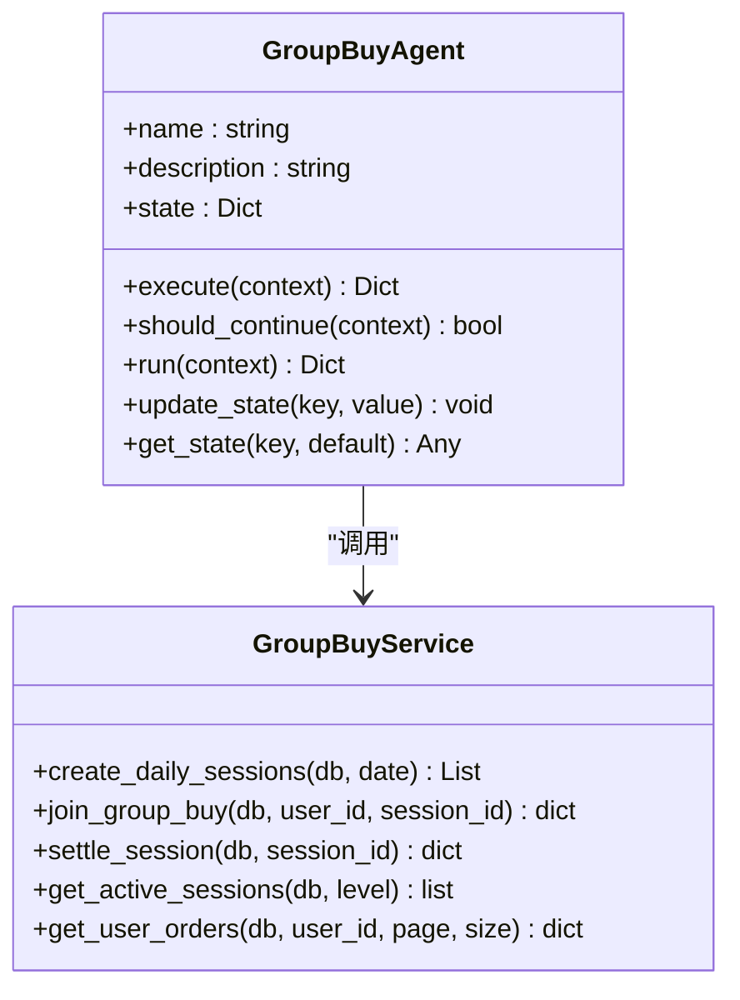
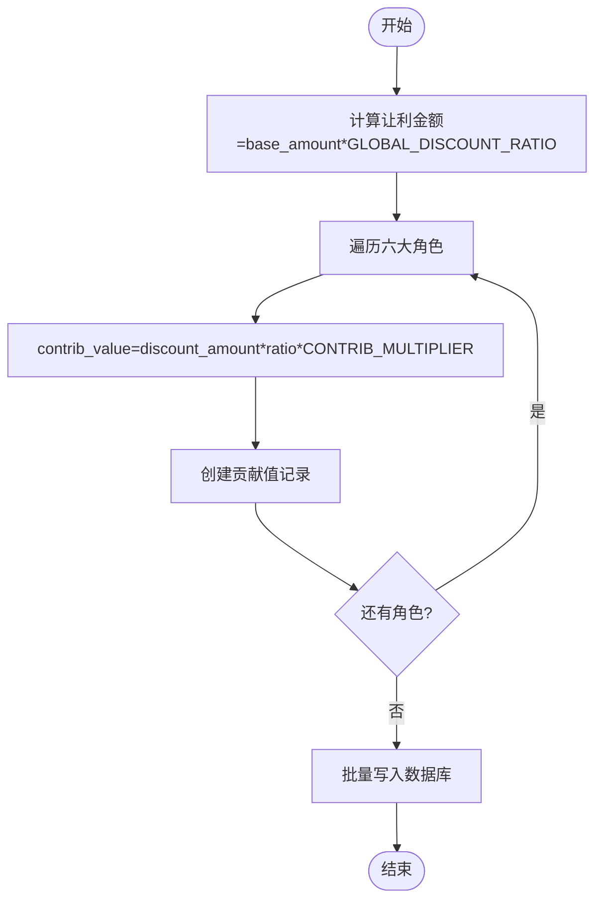
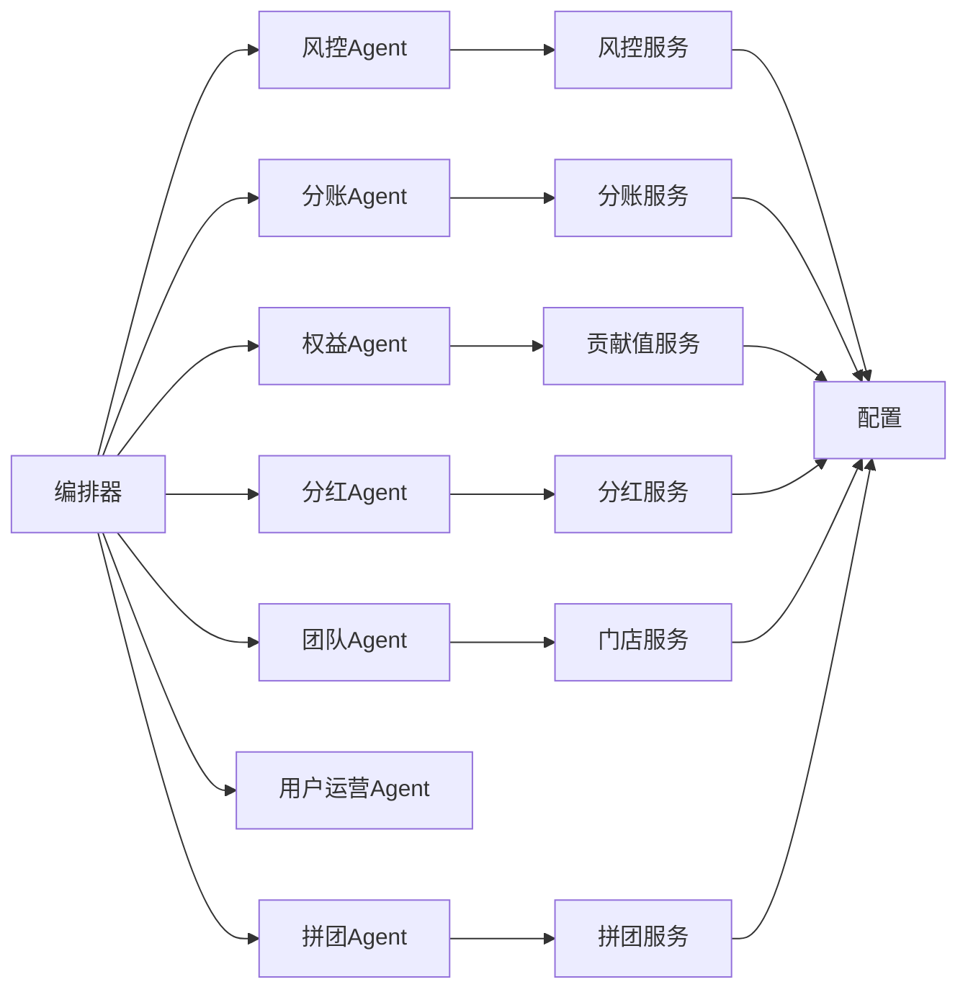

# 专业Agent实现

<cite>
**本文引用的文件**   
- [base_agent.py](file://backend/app/agents/base_agent.py)
- [group_buy_agent.py](file://backend/app/agents/group_buy_agent.py)
- [all_agents.py](file://backend/app/agents/all_agents.py)
- [agent_orchestrator.py](file://backend/app/agents/agent_orchestrator.py)
- [group_buy_service.py](file://backend/app/services/group_buy_service.py)
- [risk_service.py](file://backend/app/services/risk_service.py)
- [contribution_service.py](file://backend/app/services/contribution_service.py)
- [settlement_service.py](file://backend/app/services/settlement_service.py)
- [dividend_service.py](file://backend/app/services/dividend_service.py)
- [store_service.py](file://backend/app/services/store_service.py)
- [group_buy.py](file://backend/app/api/v1/group_buy.py)
- [group_buy_tasks.py](file://backend/app/tasks/group_buy_tasks.py)
- [config.py](file://backend/app/config.py)
- [main.py](file://backend/app/main.py)
</cite>

## 目录
1. [引言](#引言)
2. [项目结构](#项目结构)
3. [核心组件](#核心组件)
4. [架构总览](#架构总览)
5. [详细组件分析](#详细组件分析)
6. [依赖关系分析](#依赖关系分析)
7. [性能与并发优化](#性能与并发优化)
8. [故障排查指南](#故障排查指南)
9. [结论](#结论)
10. [附录：新Agent开发指南](#附录新agent开发指南)

## 引言
本文件面向AIxingmu系统的“专业Agent”体系，围绕7大专业Agent的职责划分、核心算法与业务逻辑、输入输出格式、状态转换规则、决策依据进行系统化说明；同时给出Agent间通信协议与数据共享机制、新Agent开发规范、以及性能优化策略。系统采用FastAPI作为入口，基于异步SQLAlchemy访问数据库，使用Celery执行定时任务，并通过统一的Agent编排器协调多Agent协作。

## 项目结构
后端采用分层组织：
- agents：定义Agent基类与各专业Agent（拼团调度、风控、分账、权益核算、分红结算、用户运营、团队管理）
- services：封装各业务领域服务（拼团、风控、贡献值、分润、分红、门店等）
- api/v1：对外REST接口（含拼团、贡献值、积分、消费券、门店、管理等）
- tasks：Celery定时任务（每日开团、满员结算、过期处理等）
- models：数据库模型（场次、订单、贡献值、风控、门店、结算等）
- config：全局配置（拼团参数、分配比例、利率、阶梯分红阈值等）
- main：应用启动、中间件、路由注册

图表来源
- [main.py:35-75](file://backend/app/main.py#L35-L75)
- [agent_orchestrator.py:18-94](file://backend/app/agents/agent_orchestrator.py#L18-L94)
- [group_buy_agent.py:15-67](file://backend/app/agents/group_buy_agent.py#L15-L67)
- [all_agents.py:7-114](file://backend/app/agents/all_agents.py#L7-L114)
- [group_buy_service.py:17-348](file://backend/app/services/group_buy_service.py#L17-L348)
- [risk_service.py:14-135](file://backend/app/services/risk_service.py#L14-L135)
- [contribution_service.py:16-261](file://backend/app/services/contribution_service.py#L16-L261)
- [settlement_service.py:17-166](file://backend/app/services/settlement_service.py#L17-L166)
- [dividend_service.py:16-136](file://backend/app/services/dividend_service.py#L16-L136)
- [store_service.py:15-161](file://backend/app/services/store_service.py#L15-L161)
- [config.py:8-136](file://backend/app/config.py#L8-L136)

章节来源
- [main.py:35-75](file://backend/app/main.py#L35-L75)
- [config.py:8-136](file://backend/app/config.py#L8-L136)

## 核心组件
- Agent基类：提供统一生命周期run、execute、should_continue、状态存取与日志记录
- 编排器：集中注册并串行/批处理调用各Agent，维护上下文传递
- 专业Agent：按职责拆分，分别对接服务层完成具体业务计算与持久化
- 服务层：纯业务逻辑与数据访问，无UI/HTTP耦合，便于测试与复用
- 定时任务：通过Celery触发周期性Agent流程（如创建场次、检查过期、结算）

章节来源
- [base_agent.py:12-47](file://backend/app/agents/base_agent.py#L12-L47)
- [agent_orchestrator.py:18-94](file://backend/app/agents/agent_orchestrator.py#L18-L94)
- [group_buy_tasks.py:17-54](file://backend/app/tasks/group_buy_tasks.py#L17-L54)

## 架构总览
下图展示一次“参团→风控→结算→权益→通知”的端到端调用链，体现Agent间的顺序协作与数据流转。

图表来源
- [group_buy.py:26-38](file://backend/app/api/v1/group_buy.py#L26-L38)
- [agent_orchestrator.py:32-52](file://backend/app/agents/agent_orchestrator.py#L32-L52)
- [all_agents.py:101-114](file://backend/app/agents/all_agents.py#L101-L114)
- [risk_service.py:17-74](file://backend/app/services/risk_service.py#L17-L74)
- [all_agents.py:7-22](file://backend/app/agents/all_agents.py#L7-L22)
- [settlement_service.py:20-85](file://backend/app/services/settlement_service.py#L20-L85)
- [all_agents.py:29-46](file://backend/app/agents/all_agents.py#L29-L46)
- [contribution_service.py:39-143](file://backend/app/services/contribution_service.py#L39-L143)
- [all_agents.py:66-77](file://backend/app/agents/all_agents.py#L66-L77)

## 详细组件分析

### 1) 用户分析Agent（概念性）
- 职责：对用户画像、行为序列、风险评分、贡献值趋势进行分析，为推荐与风控提供特征输入
- 输入：用户ID、会话ID、时间窗口、事件流（可选）
- 输出：用户画像摘要、风险等级、偏好标签、建议动作
- 决策依据：历史交易、参与频次、违规记录、贡献值变化率
- 状态转换：Idle → Analyzing → Ready/Blocked
- 备注：当前仓库未提供独立实现，可在编排器中新增节点接入

[本节不直接分析具体文件]

### 2) 商品推荐Agent（概念性）
- 职责：基于用户画像与实时场景生成个性化商品/券包推荐
- 输入：用户ID、偏好标签、可用库存、活动规则
- 输出：推荐列表及权重
- 决策依据：协同过滤/规则引擎/价格敏感度
- 状态转换：Idle → Computing → Recommended
- 备注：可结合用户运营Agent推送

[本节不直接分析具体文件]

### 3) 风控检测Agent
- 职责：实时监控限购、异常操作、违规开团，自动拦截或预警
- 核心算法：
  - 黑名单校验
  - 单组参与次数上限检查
  - 风险评分阈值判定
- 输入：user_id, session_id
- 输出：{allowed: bool, reason: str, risk_level: str, warning?: bool}
- 状态转换：Check → Pass/Warn/Block
- 决策依据：配置项GROUP_BUY_MAX_ORDERS_PER_USER、风险评分阈值
- 关键路径：
  - 参团前风控：check_join_risk
  - 风险评分更新：update_risk_score
  - 风控日志查询：get_risk_logs

图表来源
- [risk_service.py:17-74](file://backend/app/services/risk_service.py#L17-L74)
- [risk_service.py:76-107](file://backend/app/services/risk_service.py#L76-L107)
- [risk_service.py:109-135](file://backend/app/services/risk_service.py#L109-L135)

章节来源
- [all_agents.py:97-114](file://backend/app/agents/all_agents.py#L97-L114)
- [risk_service.py:14-135](file://backend/app/services/risk_service.py#L14-L135)

### 4) 拼团决策Agent（即GroupBuyAgent）
- 职责：定时开团、人数监控、结果判定、触发后续分账与权益发放
- 核心算法：
  - 创建每日固定场次（每小时1场×3个板块）
  - 满员判定与随机抽中1人
  - 失败用户本金退回+补贴发放
  - 过期场次状态更新
- 输入：db, action(create_sessions/check_and_settle/check_expired), date/session_id
- 输出：各action对应的统计结果
- 状态转换：PENDING → ACTIVE → FULL → COMPLETED/CANCELLED/EXPIRED
- 决策依据：配置项（每场人数、起止时间、中奖/失败比例）、随机抽取
- 关键路径：
  - create_daily_sessions
  - join_group_buy（由API触发）
  - settle_session（满员后结算）
  - 过期处理

图表来源
- [group_buy_agent.py:15-67](file://backend/app/agents/group_buy_agent.py#L15-L67)
- [group_buy_service.py:27-348](file://backend/app/services/group_buy_service.py#L27-L348)

章节来源
- [group_buy_agent.py:15-67](file://backend/app/agents/group_buy_agent.py#L15-L67)
- [group_buy_service.py:17-348](file://backend/app/services/group_buy_service.py#L17-L348)
- [group_buy_tasks.py:17-54](file://backend/app/tasks/group_buy_tasks.py#L17-L54)

### 5) 贡献值计算Agent（即RightsAgent）
- 职责：根据拼团结果或其他交易事件，按六大角色分配贡献值并写入记录
- 核心算法：
  - 通用公式：贡献值 = 让利金额 × 分配比例 × 乘数
  - 六角色分配：消费者50%、合作商家20%、推荐商家8%、推荐消费者5%、代理合计7%、平台10%
  - 周度递减兑换：当周消费券 = 有效贡献值 × 日利率 × 7
- 输入：amount, source, consumer_id, merchant_id, referrer_merchant_id, referrer_consumer_id, agent_ids, related_order_id, related_session_id
- 输出：生成的贡献值记录列表
- 状态转换：Generated → Settled(周度)
- 决策依据：配置项GLOBAL_DISCOUNT_RATIO、CONTRIB_*_RATIO、CONTRIB_MULTIPLIER、CONTRIB_DAILY_RATE_DEFAULT

图表来源
- [contribution_service.py:29-143](file://backend/app/services/contribution_service.py#L29-L143)
- [contribution_service.py:162-240](file://backend/app/services/contribution_service.py#L162-L240)

章节来源
- [all_agents.py:24-46](file://backend/app/agents/all_agents.py#L24-L46)
- [contribution_service.py:16-261](file://backend/app/services/contribution_service.py#L16-L261)

### 6) 门店管理Agent（即TeamAgent）
- 职责：统计四级团队业绩、排名、核算门店月度阶梯分红
- 核心算法：
  - 门店月度业绩累计与排名
  - 阶梯分红：3-5万→0.5%，5-10万→0.5%，10-50万→0.5%，50万+→1%
- 输入：year_month
- 输出：settled_count, year_month
- 状态转换：Pending → Ranked → DividendSettled
- 决策依据：STORE_TIER*_MIN/MAX、STORE_TIER*_DIVIDEND

章节来源
- [all_agents.py:79-95](file://backend/app/agents/all_agents.py#L79-L95)
- [settlement_service.py:87-146](file://backend/app/services/settlement_service.py#L87-L146)
- [store_service.py:54-133](file://backend/app/services/store_service.py#L54-L133)

### 7) 订单处理Agent（概念性）
- 职责：聚合订单生命周期事件（创建、锁定、结算、退款），驱动风控与权益发放
- 输入：order_id, event_type, payload
- 输出：处理结果与副作用（如更新状态、触发下游Agent）
- 状态转换：Created → Locked → Won/Lost → Refunded/Completed
- 决策依据：订单状态机、业务规则
- 备注：当前仓库将订单处理内嵌于GroupBuyService，可按需拆分为独立Agent

[本节不直接分析具体文件]

## 依赖关系分析
- Agent对服务的单向依赖：Agent仅负责流程编排与上下文组装，具体计算在Service层
- 服务对配置与模型的依赖：所有比例、阈值、利率均从配置读取；数据读写通过SQLAlchemy
- 编排器集中注册Agent，避免循环依赖
- 定时任务通过Celery触发Agent，解耦Web请求与长耗时任务

图表来源
- [agent_orchestrator.py:21-30](file://backend/app/agents/agent_orchestrator.py#L21-L30)
- [all_agents.py:7-114](file://backend/app/agents/all_agents.py#L7-L114)
- [config.py:8-136](file://backend/app/config.py#L8-L136)

章节来源
- [agent_orchestrator.py:18-94](file://backend/app/agents/agent_orchestrator.py#L18-L94)
- [config.py:8-136](file://backend/app/config.py#L8-L136)

## 性能与并发优化
- 异步I/O：API与服务层均采用async/await与异步数据库会话，提升吞吐
- 事务边界：每个任务在独立会话中提交，降低锁竞争
- 索引设计：场次编号、级别/状态、时间范围、用户/场次组合索引，加速查询
- 批量写入：贡献值记录批量flush，减少往返
- 定时任务：Celery异步执行，避免阻塞主进程
- 缓存建议：
  - 热点场次信息（剩余名额、状态）可缓存至Redis，缩短读路径
  - 风控评分与黑名单可短期缓存，降低重复查询
- 并发方案：
  - 高并发参团时，使用行级锁或乐观锁防止超卖
  - 结算批次化，按小时分区处理，避免全表扫描
- 监控与限流：
  - 对高频接口增加令牌桶限流
  - 关键指标埋点（QPS、延迟、错误率）

[本节为通用指导，不直接分析具体文件]

## 故障排查指南
- 常见错误定位：
  - 场次不存在/状态异常：检查场次查询条件与状态机转换
  - 余额不足：核对用户钱包流水与锁定/解锁记录
  - 风控拦截：查看风控日志与风险评分更新记录
  - 结算不一致：核对订单数量与场次人数匹配
- 日志与追踪：
  - Agent运行日志包含名称、状态、错误堆栈
  - 风控日志记录规则类型、风险等级、处置动作
- 回滚与补偿：
  - 失败用户本金退回与补贴发放需幂等
  - 周度结算应支持重试与去重

章节来源
- [group_buy_service.py:183-321](file://backend/app/services/group_buy_service.py#L183-L321)
- [risk_service.py:109-135](file://backend/app/services/risk_service.py#L109-L135)
- [base_agent.py:31-41](file://backend/app/agents/base_agent.py#L31-L41)

## 结论
AIxingmu的专业Agent体系以“编排器+Agent+服务”的分层架构实现清晰职责分离，配合配置化规则与异步化执行，满足高并发与可扩展需求。未来可在用户分析与商品推荐两个方向补充Agent实现，完善闭环生态。

[本节为总结，不直接分析具体文件]

## 附录：新Agent开发指南
- 注册机制：
  - 在编排器的初始化字典中注册新Agent实例
  - 在对应流水线方法中插入步骤，传入必要上下文
- 接口规范：
  - 继承BaseAgent，实现execute与should_continue
  - execute接收context字典，返回结构化结果
  - should_continue用于控制是否继续执行（通常为False）
- 数据共享：
  - 通过context传递db、session_id、业务对象等
  - 服务层负责持久化，Agent只负责流程编排
- 消息格式：
  - 入参：{db, session_id, user_id, amount, ...}
  - 出参：{status, result/error, metrics}
- 事件订阅与回调：
  - 可通过Celery任务发布/订阅事件（如session_full、order_refunded）
  - 回调处理在对应Agent的execute中实现
- 测试方法：
  - 单元测试：构造Mock db与会话，验证服务层计算正确性
  - 集成测试：编排器串联多个Agent，断言最终状态与数据一致性
  - 压测：模拟高并发参团与结算，观察延迟与错误率

章节来源
- [base_agent.py:12-47](file://backend/app/agents/base_agent.py#L12-L47)
- [agent_orchestrator.py:21-30](file://backend/app/agents/agent_orchestrator.py#L21-L30)
- [group_buy_tasks.py:17-54](file://backend/app/tasks/group_buy_tasks.py#L17-L54)