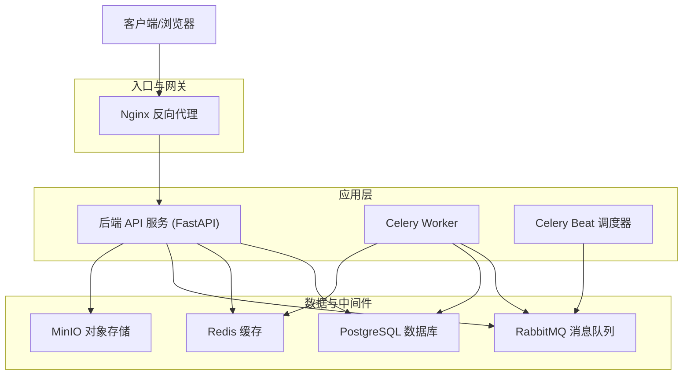
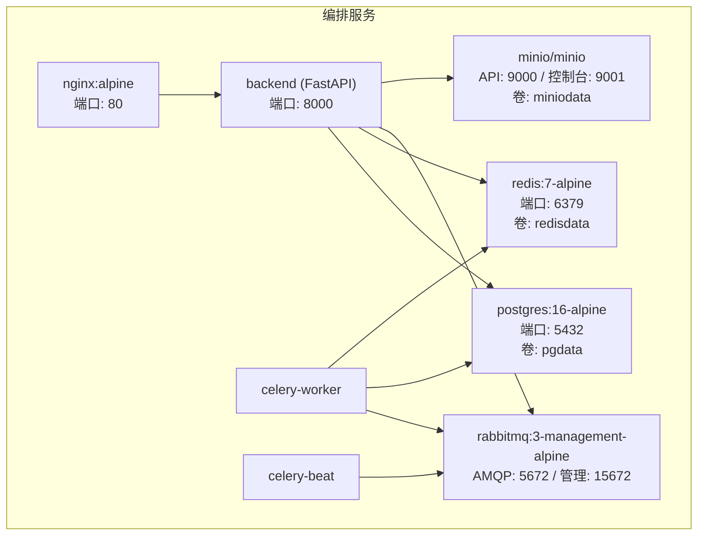
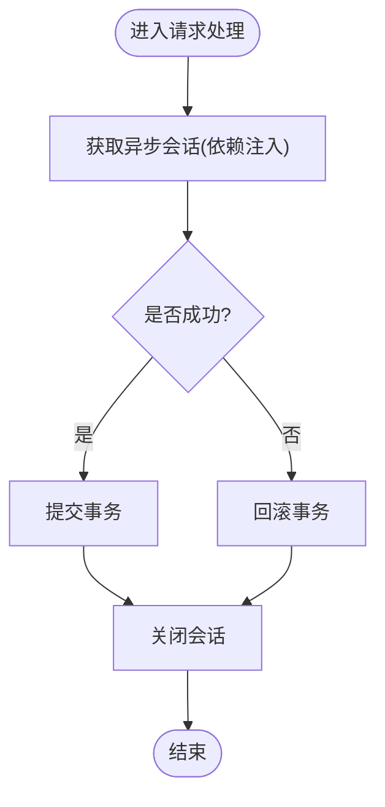
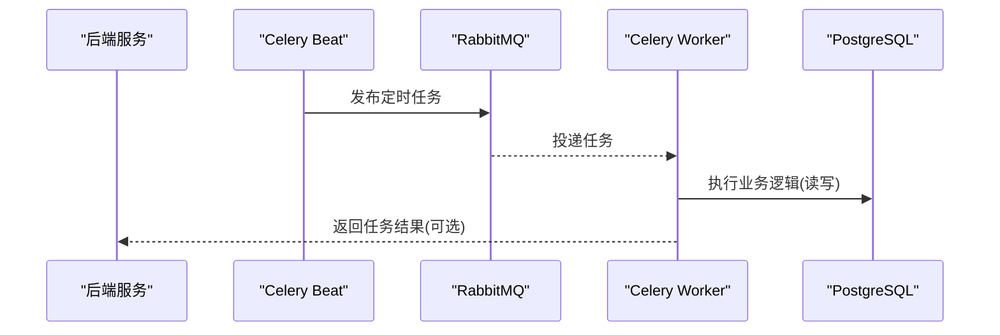
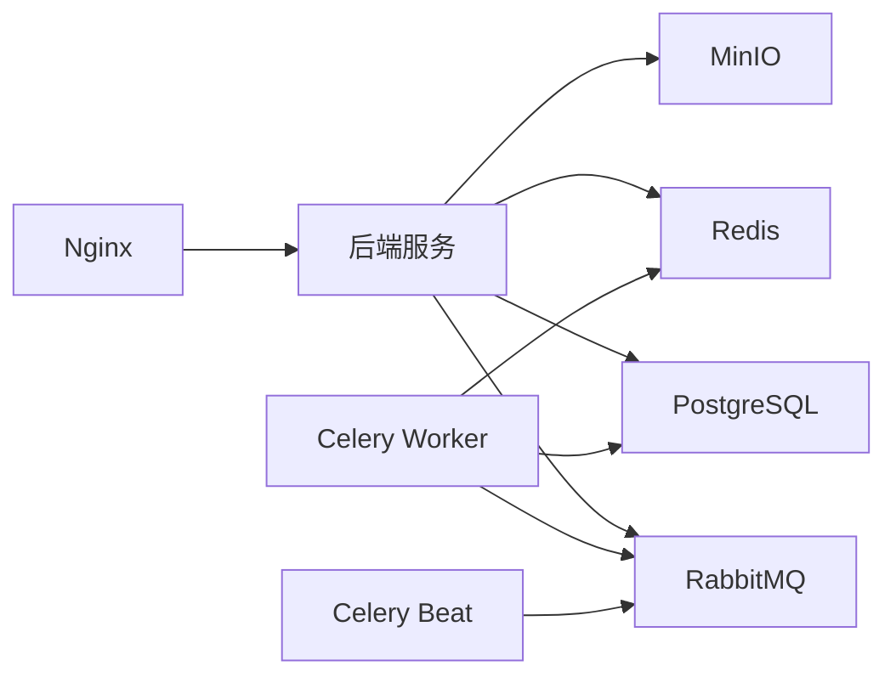

# 基础设施设计

<cite>
**本文引用的文件**   
- [docker-compose.yml](file://docker-compose.yml)
- [nginx.conf](file://nginx.conf)
- [backend/app/config.py](file://backend/app/config.py)
- [backend/app/database.py](file://backend/app/database.py)
- [backend/app/tasks/celery_app.py](file://backend/app/tasks/celery_app.py)
- [backend/app/tasks/group_buy_tasks.py](file://backend/app/tasks/group_buy_tasks.py)
- [backend/app/tasks/dividend_tasks.py](file://backend/app/tasks/dividend_tasks.py)
- [backend/app/tasks/store_rank_tasks.py](file://backend/app/tasks/store_rank_tasks.py)
- [backend/app/models/risk_control.py](file://backend/app/models/risk_control.py)
- [backend/app/services/risk_service.py](file://backend/app/services/risk_service.py)
- [backend/app/api/v1/admin.py](file://backend/app/api/v1/admin.py)
</cite>

## 目录
1. [引言](#引言)
2. [项目结构](#项目结构)
3. [核心组件](#核心组件)
4. [架构总览](#架构总览)
5. [详细组件分析](#详细组件分析)
6. [依赖关系分析](#依赖关系分析)
7. [性能考虑](#性能考虑)
8. [故障排查指南](#故障排查指南)
9. [结论](#结论)
10. [附录](#附录)

## 引言
本设计文档面向AIxingmu系统的基础设施层，围绕数据库、缓存、消息队列、对象存储与监控安全等维度进行系统化规划。当前仓库提供了容器化编排（Docker Compose）、Nginx反向代理、后端配置与异步数据库会话管理、Celery定时任务调度等关键实现。本文在现有实现基础上，给出生产级扩展建议：PostgreSQL主从复制与连接池优化、Redis集群与持久化策略、RabbitMQ高可用与可靠性保障、MinIO部署与CDN加速、应用与业务指标监控、以及防火墙/SSL/访问控制等安全基线。

## 项目结构
仓库采用前后端分离与多服务编排的形态：
- 后端服务：FastAPI + SQLAlchemy异步引擎 + Celery任务
- 数据与中间件：PostgreSQL、Redis、RabbitMQ、MinIO
- 网关与静态资源：Nginx反向代理
- 编排与运行：Docker Compose

**图表来源** 
- [docker-compose.yml:1-111](file://docker-compose.yml#L1-L111)
- [nginx.conf:1-39](file://nginx.conf#L1-L39)

**章节来源**
- [docker-compose.yml:1-111](file://docker-compose.yml#L1-L111)
- [nginx.conf:1-39](file://nginx.conf#L1-L39)

## 核心组件
- 数据库连接与会话：基于SQLAlchemy异步引擎创建连接池，提供FastAPI依赖注入的会话获取与事务提交/回滚。
- 全局配置：集中管理数据库、Redis、Celery、MinIO等外部依赖的连接参数与业务常量。
- 任务调度：Celery Beat定义定时任务，Worker执行异步任务，Beat通过RabbitMQ作为Broker，结果存于Redis。
- 网关：Nginx将HTTP请求转发至后端，预留WebSocket与静态资源路径。

**章节来源**
- [backend/app/database.py:1-40](file://backend/app/database.py#L1-L40)
- [backend/app/config.py:1-136](file://backend/app/config.py#L1-L136)
- [backend/app/tasks/celery_app.py:1-56](file://backend/app/tasks/celery_app.py#L1-L56)
- [nginx.conf:1-39](file://nginx.conf#L1-L39)

## 架构总览
下图展示当前容器编排中的服务拓扑与依赖关系，并标注了关键端口与卷挂载位置，便于理解生产环境扩展点。

**图表来源** 
- [docker-compose.yml:1-111](file://docker-compose.yml#L1-L111)

**章节来源**
- [docker-compose.yml:1-111](file://docker-compose.yml#L1-L111)

## 详细组件分析

### 数据库架构（PostgreSQL）
- 当前实现
  - 使用asyncpg驱动与SQLAlchemy异步引擎，连接池大小与溢出上限由配置项控制。
  - FastAPI通过依赖注入获取AsyncSession，自动提交或回滚并在finally中关闭会话。
- 连接池配置
  - 基础参数：DATABASE_POOL_SIZE、DATABASE_MAX_OVERFLOW。
  - 建议：根据并发QPS与慢查询情况调优；结合数据库最大连接数限制设置合理上限。
- 索引优化策略
  - 示例：风控日志表已定义复合索引以支持按用户+时间范围查询与按风险等级筛选。
  - 建议：对高频过滤字段建立B-tree索引；对范围查询与排序字段组合建复合索引；定期分析慢查询并评估覆盖索引。
- 分库分表方案
  - 现状：单库单实例。
  - 演进：当单表超千万级时，可按业务域拆分（如订单、积分、贡献值），或使用分区表（按时间/用户ID哈希）。读写分离可通过主从复制实现，读流量走从库，写流量走主库。
- 主从复制与高可用
  - 建议：启用流复制，至少一主两从；配合Pgbouncer做连接复用；引入健康检查与自动切换（如Patroni/Keepalived）。
- 迁移与版本管理
  - 使用Alembic进行DDL变更管理，建议在CI/CD流水线中自动化执行迁移与回滚脚本。

**图表来源** 
- [backend/app/database.py:29-40](file://backend/app/database.py#L29-L40)

**章节来源**
- [backend/app/config.py:16-20](file://backend/app/config.py#L16-L20)
- [backend/app/database.py:10-21](file://backend/app/database.py#L10-L21)
- [backend/app/models/risk_control.py:40-70](file://backend/app/models/risk_control.py#L40-L70)

### 缓存架构（Redis）
- 当前实现
  - 单节点Redis，用于Celery结果后端与通用缓存。
  - 配置项：REDIS_URL、CELERY_RESULT_BACKEND。
- 集群部署
  - 建议：生产环境采用Redis Cluster或哨兵模式，提升可用性与水平扩展能力。
- 持久化策略
  - 建议：开启AOF（每秒同步）+ RDB快照，结合磁盘容量与恢复目标制定保留策略。
- 缓存穿透防护
  - 建议：布隆过滤器拦截不存在键；空值短TTL缓存；热点Key加互斥锁避免击穿；限流与熔断保护下游。
- 内存与淘汰策略
  - 建议：设置maxmemory与淘汰策略（如allkeys-lru），监控命中率与内存增长趋势。

**章节来源**
- [backend/app/config.py:21-26](file://backend/app/config.py#L21-L26)
- [docker-compose.yml:21-28](file://docker-compose.yml#L21-L28)

### 消息队列架构（RabbitMQ）
- 当前实现
  - 使用RabbitMQ作为Celery Broker，默认账号guest/guest，暴露管理界面15672。
  - Celery应用配置时区、序列化方式与定时任务调度。
- 集群配置
  - 建议：三节点以上集群，镜像队列或Quorum Queue保证一致性；统一命名规范与权限隔离。
- 可靠性保证
  - 建议：生产者确认（publisher confirm）、消费者手动ACK、死信队列（DLX）兜底异常消息；幂等消费与去重表。
- 死信队列处理
  - 建议：为关键任务队列配置DLX与重试策略，监控死信堆积与告警。

**图表来源** 
- [backend/app/tasks/celery_app.py:1-56](file://backend/app/tasks/celery_app.py#L1-L56)
- [docker-compose.yml:29-38](file://docker-compose.yml#L29-L38)

**章节来源**
- [backend/app/tasks/celery_app.py:1-56](file://backend/app/tasks/celery_app.py#L1-L56)
- [docker-compose.yml:29-38](file://docker-compose.yml#L29-L38)

### 对象存储服务（MinIO）
- 当前实现
  - 单节点MinIO，API端口9000，控制台9001，根账号minioadmin。
  - 后端配置包含MINIO_ENDPOINT、ACCESS_KEY、SECRET_KEY、BUCKET。
- 部署建议
  - 建议：分布式MinIO（多盘多节点）提升吞吐与容错；独立网络与存储卷；备份与跨区域复制。
- 上传下载与权限控制
  - 建议：使用预签名URL直传直下；Bucket级别Policy与IAM用户最小权限原则；敏感文件加密存储。
- CDN加速
  - 建议：前端域名经Nginx/CDN分发静态资源与图片；MinIO对象通过CDN边缘缓存降低源站压力。

**章节来源**
- [backend/app/config.py:36-40](file://backend/app/config.py#L36-L40)
- [docker-compose.yml:39-50](file://docker-compose.yml#L39-L50)

### 监控系统设计
- 应用性能监控
  - 建议：采集JVM/Python运行时指标（CPU、内存、GC、线程）、HTTP接口耗时与错误率；集成Prometheus + Grafana可视化。
- 业务指标采集
  - 建议：拼团场次状态、结算成功率、贡献值结算量、门店月度业绩、风控拦截率等埋点上报。
- 告警规则配置
  - 建议：阈值告警（错误率>1%、延迟P99>500ms、队列积压>1万）、事件告警（任务失败、死信堆积）、容量告警（磁盘>80%）。
- 日志与追踪
  - 建议：结构化日志（JSON）+ 统一收集（ELK/Loki）；分布式追踪（OpenTelemetry）串联请求链路。

[本节为通用指导，不直接分析具体文件]

### 安全基础设施
- 防火墙与网络隔离
  - 建议：仅开放必要端口（80/443对外，其余内网）；数据库与中间件绑定内网地址；最小化暴露面。
- SSL证书管理
  - 建议：Nginx终止TLS，使用Let's Encrypt或企业CA；证书自动续期；强制HTTPS与HSTS。
- 访问控制策略
  - 建议：JWT鉴权与RBAC；CORS白名单；管理后台IP白名单；MinIO控制台与API密钥轮换。
- 合规与审计
  - 建议：敏感操作审计日志；数据脱敏与最小化采集；定期安全扫描与漏洞修复。

[本节为通用指导，不直接分析具体文件]

## 依赖关系分析
- 服务间依赖
  - backend依赖postgres、redis、rabbitmq、minio；worker与beat依赖rabbitmq与postgres；nginx代理到backend。
- 配置依赖
  - 后端通过环境变量注入各中间件连接信息；Celery使用相同Broker/Backend配置确保一致。
- 潜在风险
  - 单点故障：当前均为单实例；需在生产环境升级为集群与多副本。
  - 密码硬编码：建议使用Secrets管理（Kubernetes Secret/HashiCorp Vault）。

**图表来源** 
- [docker-compose.yml:1-111](file://docker-compose.yml#L1-L111)

**章节来源**
- [docker-compose.yml:1-111](file://docker-compose.yml#L1-L111)

## 性能考虑
- 数据库
  - 连接池大小与溢出上限需与并发和慢查询匹配；读写分离与只读副本分担查询压力；热点表索引优化与分页游标替代offset。
- 缓存
  - 提高命中率与减少大对象缓存；合理设置TTL与淘汰策略；热点Key防击穿。
- 消息队列
  - 批量消费与限流；合理分区与路由键；死信与重试机制避免雪崩。
- 对象存储
  - 预签名直传直下；CDN缓存热点资源；压缩与格式转换（WebP/AVIF）。
- 网关
  - 开启Gzip压缩、HTTP/2、连接复用；静态资源缓存头优化。

[本节为通用指导，不直接分析具体文件]

## 故障排查指南
- 数据库连接问题
  - 现象：连接超时或拒绝连接。
  - 排查：检查DATABASE_URL、端口映射、健康检查；查看连接池耗尽与慢查询。
- Redis不可用
  - 现象：任务结果无法写入或读取。
  - 排查：检查REDIS_URL与端口；查看内存与持久化状态；重启后验证。
- RabbitMQ异常
  - 现象：任务堆积或消费者无响应。
  - 排查：检查AMQP端口与管理界面；查看队列深度与死信；确认消费者ACK。
- MinIO访问失败
  - 现象：上传/下载报错。
  - 排查：检查MINIO_ENDPOINT与凭据；确认Bucket存在与权限；控制台验证。
- 定时任务未触发
  - 现象：Beat未发布任务或Worker未消费。
  - 排查：检查beat_schedule配置、时区、Broker连通性；查看任务日志。

**章节来源**
- [backend/app/config.py:16-40](file://backend/app/config.py#L16-L40)
- [backend/app/tasks/celery_app.py:1-56](file://backend/app/tasks/celery_app.py#L1-L56)
- [docker-compose.yml:1-111](file://docker-compose.yml#L1-L111)

## 结论
当前仓库提供了完整的基础设施骨架：容器编排、反向代理、异步数据库会话、任务调度与对象存储。生产落地需重点补齐高可用与可观测性：数据库主从与连接复用、Redis集群与持久化、RabbitMQ集群与可靠性、MinIO分布式与CDN、全面监控与告警、以及完善的安全基线。通过渐进式升级与标准化配置，可在保障稳定性的同时获得良好的扩展性与运维效率。

[本节为总结性内容，不直接分析具体文件]

## 附录

### 部署清单（建议）
- 计算与网络
  - 负载均衡/Nginx：2节点，开启TLS与HTTP/2
  - 后端服务：按QPS弹性扩缩容，最少2副本
  - Worker/Beat：按任务负载扩容，独立资源池
- 数据与中间件
  - PostgreSQL：1主2从，Pgbouncer连接池，每日备份
  - Redis：Cluster或哨兵，AOF+RDB，内存上限与淘汰策略
  - RabbitMQ：3节点集群，镜像队列或Quorum Queue，监控队列深度
  - MinIO：分布式多节点多盘，跨地域复制，CDN接入
- 监控与安全
  - Prometheus + Grafana + Alertmanager
  - ELK/Loki日志收集，OpenTelemetry追踪
  - 防火墙策略、TLS证书、RBAC与最小权限

[本节为通用指导，不直接分析具体文件]