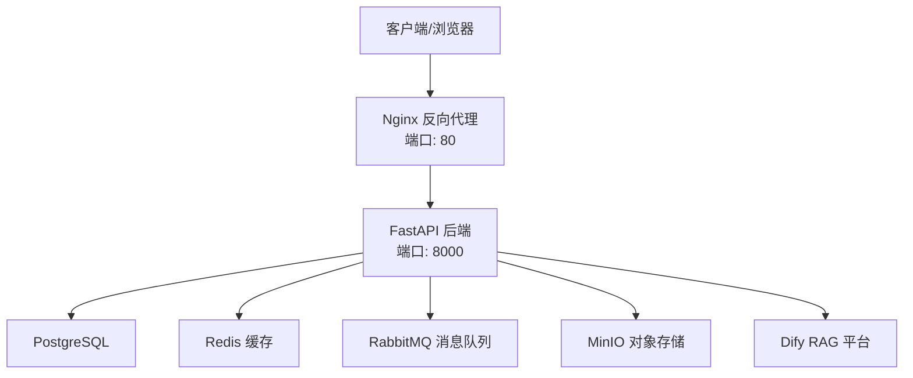
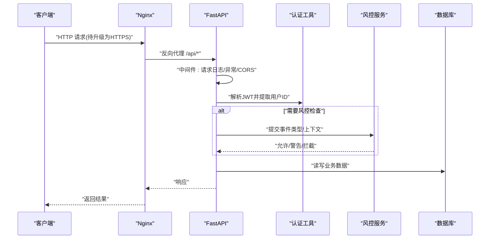
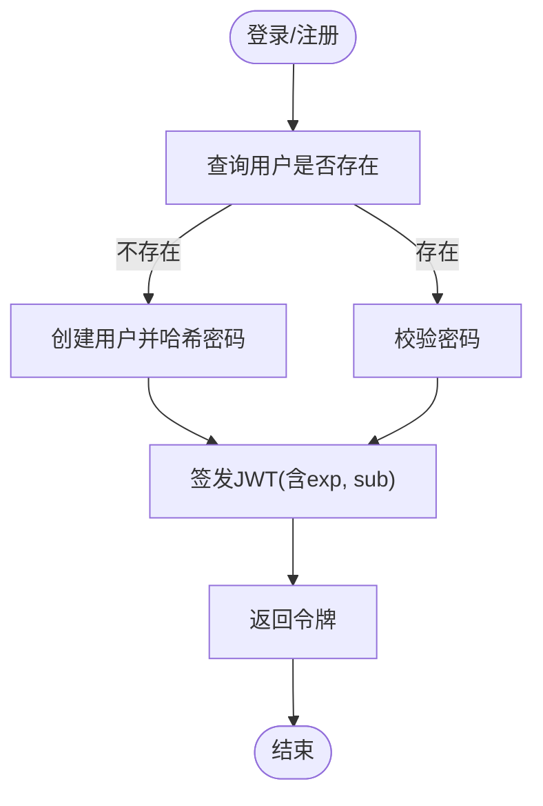
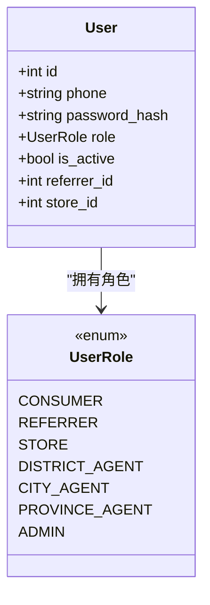
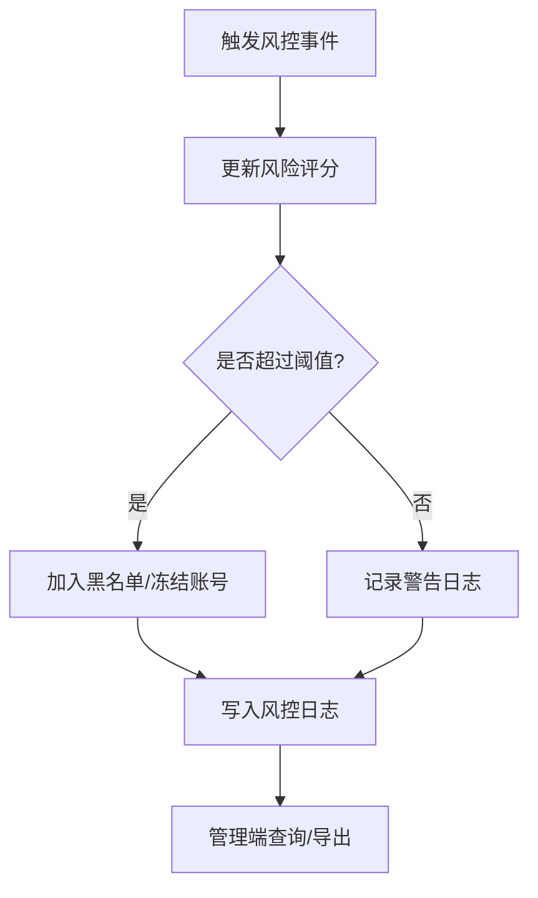
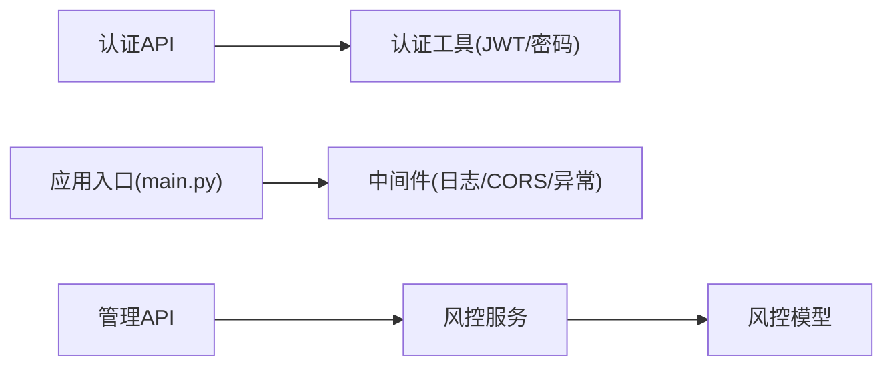

# 安全基础设施

<cite>
**本文引用的文件**   
- [backend/app/main.py](file://backend/app/main.py)
- [backend/app/config.py](file://backend/app/config.py)
- [backend/app/utils/auth.py](file://backend/app/utils/auth.py)
- [backend/app/api/v1/auth.py](file://backend/app/api/v1/auth.py)
- [backend/app/middleware.py](file://backend/app/middleware.py)
- [nginx.conf](file://nginx.conf)
- [docker-compose.yml](file://docker-compose.yml)
- [backend/app/models/user.py](file://backend/app/models/user.py)
- [backend/app/database.py](file://backend/app/database.py)
- [backend/app/models/risk_control.py](file://backend/app/models/risk_control.py)
- [backend/app/services/risk_service.py](file://backend/app/services/risk_service.py)
- [backend/app/api/v1/admin.py](file://backend/app/api/v1/admin.py)
</cite>

## 目录
1. [引言](#引言)
2. [项目结构](#项目结构)
3. [核心组件](#核心组件)
4. [架构总览](#架构总览)
5. [详细组件分析](#详细组件分析)
6. [依赖关系分析](#依赖关系分析)
7. [性能与安全权衡](#性能与安全权衡)
8. [故障排查指南](#故障排查指南)
9. [结论](#结论)
10. [附录：安全配置清单与漏洞扫描方案](#附录安全配置清单与漏洞扫描方案)

## 引言
本设计文档面向AIxingmu系统的安全基础设施，覆盖网络安全、身份认证、访问控制、数据安全、审计合规以及安全配置清单与漏洞扫描方案。目标是在现有代码基础上，给出可落地的安全加固策略与实施建议，帮助团队在生产环境实现最小权限、纵深防御与可观测性。

## 项目结构
后端采用FastAPI应用，通过Nginx反向代理对外暴露；使用PostgreSQL持久化数据，Redis缓存，RabbitMQ消息队列，MinIO对象存储，Dify作为智能体平台。安全相关的关键位置包括：
- 应用入口与中间件注册（CORS、请求日志、异常处理）
- 认证与鉴权工具（JWT、密码哈希）
- Nginx反向代理与WebSocket支持
- 风控模型与服务（风险评分、黑名单、日志）
- 数据库连接与会话管理

图表来源
- [nginx.conf:1-39](file://nginx.conf#L1-L39)
- [docker-compose.yml:52-106](file://docker-compose.yml#L52-L106)
- [backend/app/main.py:36-77](file://backend/app/main.py#L36-L77)

章节来源
- [backend/app/main.py:36-77](file://backend/app/main.py#L36-L77)
- [nginx.conf:1-39](file://nginx.conf#L1-L39)
- [docker-compose.yml:1-149](file://docker-compose.yml#L1-L149)

## 核心组件
- 应用生命周期与中间件：在应用启动时创建数据库表（开发阶段），注册全局异常处理、请求日志、CORS等中间件。
- 认证与令牌：基于JWT的无状态认证，提供登录/注册接口生成令牌，并在受保护接口中解析用户ID。
- 密码安全：使用bcrypt对密码进行哈希存储与校验。
- 网络与代理：Nginx负责将外部请求转发到后端，并预留WebSocket升级路径。
- 风控与审计：记录风控事件、风险评分与黑名单，提供管理端查询能力。

章节来源
- [backend/app/main.py:45-77](file://backend/app/main.py#L45-L77)
- [backend/app/utils/auth.py:1-50](file://backend/app/utils/auth.py#L1-L50)
- [backend/app/api/v1/auth.py:1-70](file://backend/app/api/v1/auth.py#L1-L70)
- [backend/app/middleware.py:82-120](file://backend/app/middleware.py#L82-120)
- [nginx.conf:10-38](file://nginx.conf#L10-L38)

## 架构总览
下图展示从客户端到后端的请求链路，以及关键安全点（HTTPS强制、CORS、JWT校验、风控拦截）。

图表来源
- [backend/app/main.py:45-77](file://backend/app/main.py#L45-L77)
- [backend/app/utils/auth.py:39-49](file://backend/app/utils/auth.py#L39-L49)
- [backend/app/services/risk_service.py:67-134](file://backend/app/services/risk_service.py#L67-L134)
- [nginx.conf:14-29](file://nginx.conf#L14-L29)

## 详细组件分析

### 网络安全配置
- HTTPS强制启用
  - 现状：Nginx监听80端口，未配置SSL证书与301跳转至HTTPS。
  - 建议：在Nginx增加443监听、加载证书、开启HSTS，并将所有HTTP请求301重定向到HTTPS；同时关闭不必要的HTTP方法。
- 防火墙规则
  - 建议：仅开放80/443对外；数据库、Redis、RabbitMQ、MinIO控制台仅对内网或容器网络开放；限制来源IP白名单。
- CORS策略
  - 现状：允许所有来源与方法，存在跨域安全风险。
  - 建议：限定可信域名、仅允许必要方法与头、谨慎使用allow_credentials。
- WebSocket安全
  - 现状：已预留/ws/升级逻辑。
  - 建议：结合鉴权中间件与速率限制，避免WS被滥用。

章节来源
- [nginx.conf:10-38](file://nginx.conf#L10-L38)
- [backend/app/main.py:51-57](file://backend/app/main.py#L51-L57)

### 身份认证安全
- JWT令牌安全
  - 现状：HS256算法，密钥来自配置，过期时间默认24小时。
  - 建议：生产环境使用强随机密钥、考虑RS256、缩短过期时间、刷新令牌机制、黑名单撤销。
- 密码加密存储
  - 现状：使用bcrypt哈希，登录时校验。
  - 建议：确保salt参数合理、定期评估强度、禁止明文回显。
- 会话管理策略
  - 现状：无状态JWT，无服务端会话。
  - 建议：如需强制下线/设备绑定，引入令牌黑名单或短期会话+刷新令牌。

图表来源
- [backend/app/api/v1/auth.py:29-70](file://backend/app/api/v1/auth.py#L29-L70)
- [backend/app/utils/auth.py:16-36](file://backend/app/utils/auth.py#L16-L36)
- [backend/app/models/user.py:26-36](file://backend/app/models/user.py#L26-L36)

章节来源
- [backend/app/utils/auth.py:1-50](file://backend/app/utils/auth.py#L1-L50)
- [backend/app/api/v1/auth.py:1-70](file://backend/app/api/v1/auth.py#L1-L70)
- [backend/app/config.py:28-31](file://backend/app/config.py#L28-L31)
- [backend/app/models/user.py:26-36](file://backend/app/models/user.py#L26-L36)

### 访问控制机制
- RBAC权限模型
  - 现状：用户角色枚举包含消费者、推荐人、门店、各级代理、管理员等。
  - 建议：在路由层按角色装饰器或依赖注入校验，最小权限原则。
- API接口鉴权
  - 现状：提供获取当前用户ID的依赖，但未在多数接口强制使用。
  - 建议：为敏感接口统一添加鉴权依赖，拒绝匿名访问。
- 数据行级权限控制
  - 现状：用户与门店、推荐关系有外键关联。
  - 建议：在服务层根据用户角色/所属门店过滤数据，防止越权访问。

图表来源
- [backend/app/models/user.py:14-36](file://backend/app/models/user.py#L14-L36)

章节来源
- [backend/app/models/user.py:14-36](file://backend/app/models/user.py#L14-36)
- [backend/app/utils/auth.py:39-49](file://backend/app/utils/auth.py#L39-L49)

### 数据安全保护
- 敏感数据加密
  - 现状：密码以bcrypt哈希存储；其他敏感字段未见明确加密。
  - 建议：对手机号、身份证等PPII字段进行加密存储与传输脱敏。
- SQL注入防护
  - 现状：使用SQLAlchemy ORM，避免拼接SQL。
  - 建议：保持ORM使用规范，禁用raw SQL或严格参数化。
- XSS攻击防护
  - 现状：后端未体现XSS过滤。
  - 建议：前后端均做输入校验与输出转义，设置合适的Content-Security-Policy。

章节来源
- [backend/app/utils/auth.py:16-21](file://backend/app/utils/auth.py#L16-L21)
- [backend/app/database.py:1-39](file://backend/app/database.py#L1-L39)

### 安全审计与合规
- 操作日志记录
  - 现状：请求日志中间件记录方法、URL、IP、耗时；风控日志表记录事件详情。
  - 建议：统一结构化日志格式，集中收集到日志平台，保留周期符合合规要求。
- 安全事件监控
  - 现状：风控服务维护风险评分与黑名单，并提供分页查询。
  - 建议：接入告警阈值、实时看板与自动处置（如限流、封禁）。
- 合规性检查
  - 建议：定期开展隐私影响评估、数据出境审查、第三方依赖漏洞扫描与基线核查。

图表来源
- [backend/app/services/risk_service.py:77-107](file://backend/app/services/risk_service.py#L77-L107)
- [backend/app/models/risk_control.py:40-70](file://backend/app/models/risk_control.py#L40-L70)
- [backend/app/api/v1/admin.py:71-79](file://backend/app/api/v1/admin.py#L71-L79)

章节来源
- [backend/app/middleware.py:82-120](file://backend/app/middleware.py#L82-120)
- [backend/app/services/risk_service.py:109-134](file://backend/app/services/risk_service.py#L109-L134)
- [backend/app/models/risk_control.py:1-84](file://backend/app/models/risk_control.py#L1-L84)
- [backend/app/api/v1/admin.py:71-79](file://backend/app/api/v1/admin.py#L71-L79)

## 依赖关系分析
- 组件耦合
  - 认证工具被认证API广泛依赖；中间件与应用入口解耦良好；风控服务独立于业务API，便于扩展。
- 外部依赖
  - PostgreSQL、Redis、RabbitMQ、MinIO、Dify均为外部服务，需加强凭据管理与网络隔离。
- 潜在循环依赖
  - 未发现明显循环导入；注意后台任务中使用数据库会话的方式应保持一致。

图表来源
- [backend/app/api/v1/auth.py:1-70](file://backend/app/api/v1/auth.py#L1-L70)
- [backend/app/utils/auth.py:1-50](file://backend/app/utils/auth.py#L1-L50)
- [backend/app/main.py:45-77](file://backend/app/main.py#L45-L77)
- [backend/app/services/risk_service.py:67-134](file://backend/app/services/risk_service.py#L67-L134)
- [backend/app/models/risk_control.py:1-84](file://backend/app/models/risk_control.py#L1-L84)
- [backend/app/api/v1/admin.py:71-79](file://backend/app/api/v1/admin.py#L71-L79)

章节来源
- [backend/app/main.py:45-77](file://backend/app/main.py#L45-L77)
- [backend/app/api/v1/auth.py:1-70](file://backend/app/api/v1/auth.py#L1-L70)
- [backend/app/utils/auth.py:1-50](file://backend/app/utils/auth.py#L1-L50)
- [backend/app/services/risk_service.py:67-134](file://backend/app/services/risk_service.py#L67-L134)
- [backend/app/models/risk_control.py:1-84](file://backend/app/models/risk_control.py#L1-L84)
- [backend/app/api/v1/admin.py:71-79](file://backend/app/api/v1/admin.py#L71-L79)

## 性能与安全权衡
- 短令牌+刷新令牌可降低泄露窗口，但会增加验证开销；建议配合本地缓存与签名校验优化。
- 严格的CORS与WAF会引入额外延迟，应在边缘节点部署以提升整体吞吐。
- 风控规则复杂度与实时性需平衡，高频规则可下沉至缓存或流式计算。

## 故障排查指南
- 认证失败
  - 检查JWT密钥与算法一致性、令牌过期时间、Authorization头格式。
- 跨域错误
  - 核对前端域名是否在CORS白名单内，是否携带凭证。
- 风控误拦截
  - 查看风控日志与风险评分，调整阈值与规则权重。
- 日志缺失
  - 确认请求日志中间件生效，检查日志采集与磁盘空间。

章节来源
- [backend/app/utils/auth.py:39-49](file://backend/app/utils/auth.py#L39-L49)
- [backend/app/main.py:51-57](file://backend/app/main.py#L51-L57)
- [backend/app/services/risk_service.py:109-134](file://backend/app/services/risk_service.py#L109-L134)
- [backend/app/middleware.py:82-120](file://backend/app/middleware.py#L82-120)

## 结论
当前系统在认证、密码存储、基础日志与风控方面已有良好基础。生产落地需重点补齐HTTPS强制、严格CORS、RBAC鉴权、行级权限、敏感数据加密与集中审计，并建立常态化漏洞扫描与基线核查流程，形成闭环安全治理。

## 附录：安全配置清单与漏洞扫描方案

### 安全配置清单
- 网络安全
  - 启用HTTPS并强制跳转，配置HSTS与TLS版本限制
  - 关闭不必要HTTP方法，启用请求体大小限制
  - 仅开放必要端口，数据库/缓存/消息队列仅内网访问
- 身份认证
  - 使用强随机密钥与合适算法，缩短令牌有效期，实现刷新令牌与黑名单
  - 密码使用bcrypt并保证足够强度
- 访问控制
  - 路由级角色校验，最小权限原则
  - 服务层行级权限过滤，防止越权
- 数据安全
  - PPII字段加密存储与传输脱敏
  - 全量使用ORM参数化，禁用拼接SQL
  - 前后端输入校验与输出转义，设置CSP
- 审计合规
  - 统一结构化日志，集中采集与留存
  - 风控告警阈值与自动化处置
  - 定期合规检查与渗透测试

### 漏洞扫描方案
- 静态扫描（SAST）
  - 针对Python/JS代码库进行依赖与代码缺陷扫描，纳入CI流水线
- 动态扫描（DAST）
  - 对预发/生产环境进行黑盒扫描，覆盖API与Web页面
- 依赖与镜像扫描
  - 对requirements.txt与Docker镜像进行CVE扫描，阻断高危漏洞发布
- 基线与配置核查
  - 对Nginx、数据库、Redis、RabbitMQ、MinIO进行安全基线检查
- 持续改进
  - 建立漏洞工单流转与修复SLA，定期复盘与回归验证