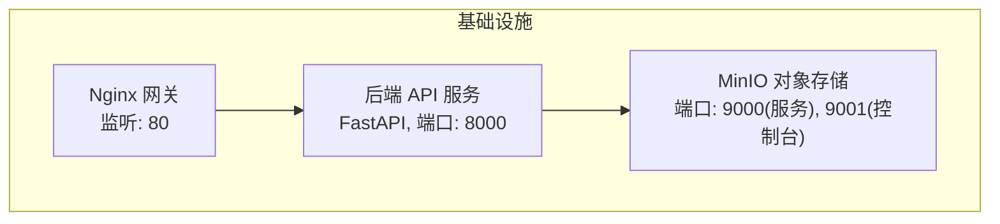
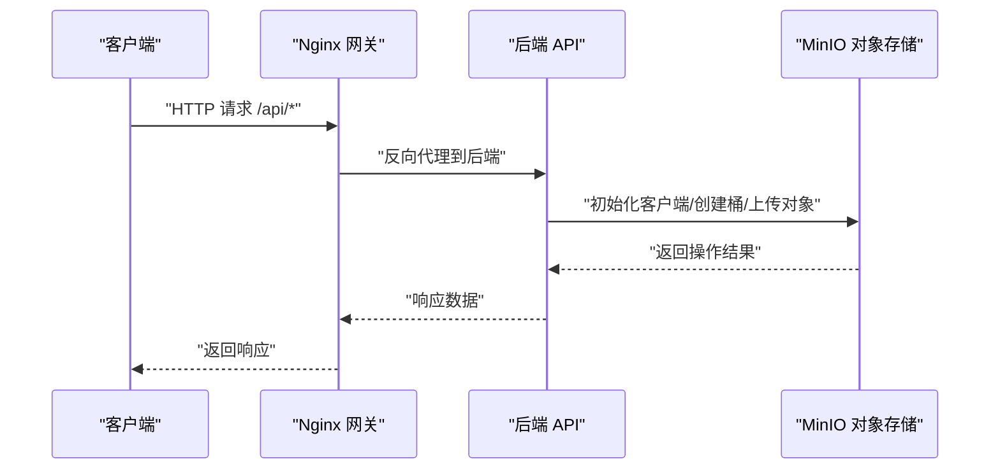
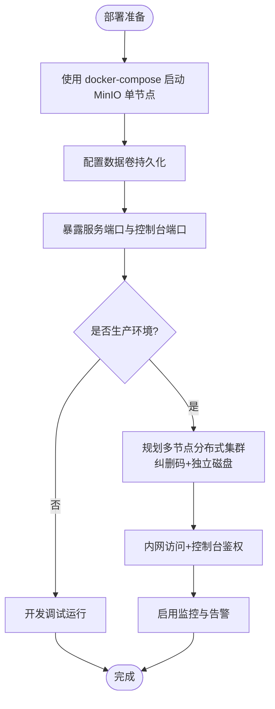
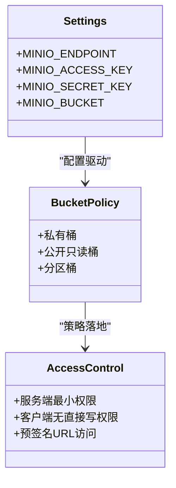
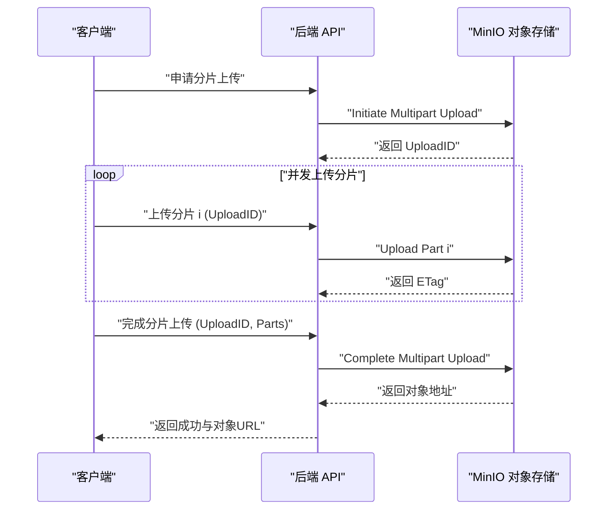
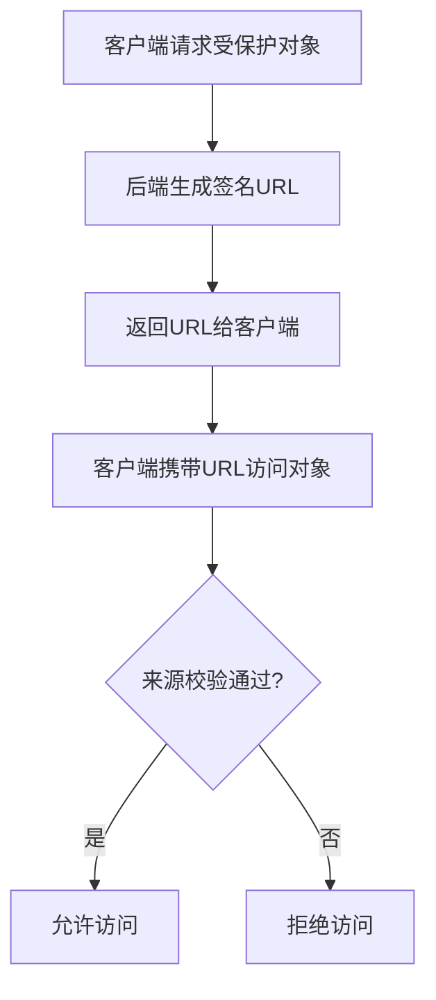
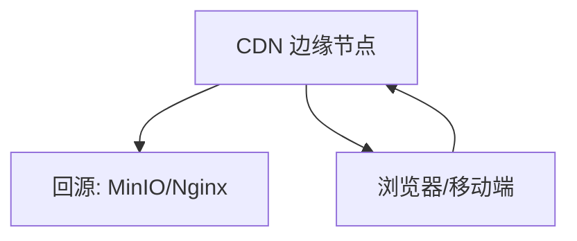
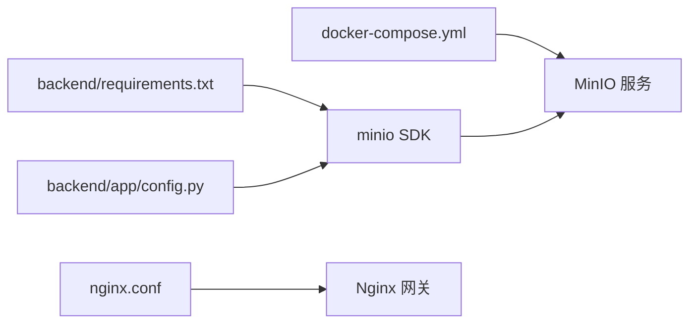

# 对象存储服务

<cite>
**本文引用的文件**
- [backend/app/config.py](file://backend/app/config.py)
- [docker-compose.yml](file://docker-compose.yml)
- [nginx.conf](file://nginx.conf)
- [backend/requirements.txt](file://backend/requirements.txt)
</cite>

## 目录
1. [引言](#引言)
2. [项目结构](#项目结构)
3. [核心组件](#核心组件)
4. [架构总览](#架构总览)
5. [详细组件分析](#详细组件分析)
6. [依赖分析](#依赖分析)
7. [性能考虑](#性能考虑)
8. [故障排查指南](#故障排查指南)
9. [结论](#结论)
10. [附录](#附录)

## 引言
本设计文档面向AIxingmu系统的对象存储服务，围绕MinIO对象存储的集群部署、桶策略与访问控制、上传下载流程（分片上传、断点续传、并发处理）、文件安全管理（签名URL、ACL、防盗链）、CDN加速集成、容量规划与生命周期管理、备份恢复方案以及API使用示例与最佳实践进行系统化说明。当前仓库已包含MinIO服务编排与后端配置入口，为后续实现提供基础支撑。

## 项目结构
- 后端配置中定义了MinIO连接参数（端点、密钥、桶名），用于在业务服务中初始化客户端并访问对象存储。
- docker-compose.yml中提供了MinIO单节点容器化部署，便于本地开发与测试；生产环境可基于该镜像扩展为多节点分布式集群。
- nginx.conf作为统一网关，预留了静态资源与API代理位置，未来可结合MinIO控制台或CDN域名进行反向代理与缓存策略配置。
- 依赖文件中引入了minio官方Python SDK，为后端调用对象存储能力提供基础。

**图表来源**
- [docker-compose.yml:39-50](file://docker-compose.yml#L39-L50)
- [nginx.conf:10-21](file://nginx.conf#L10-L21)
- [backend/app/config.py:36-40](file://backend/app/config.py#L36-L40)

**章节来源**
- [backend/app/config.py:36-40](file://backend/app/config.py#L36-L40)
- [docker-compose.yml:39-50](file://docker-compose.yml#L39-L50)
- [nginx.conf:10-21](file://nginx.conf#L10-L21)
- [backend/requirements.txt:23](file://backend/requirements.txt#L23)

## 核心组件
- 配置中心：集中管理MinIO端点、访问密钥、默认桶等关键参数，确保多环境一致性与安全隔离。
- 服务编排：通过容器编排定义MinIO运行环境与数据持久卷，支持快速部署与横向扩展。
- 网关层：Nginx负责请求转发、WebSocket升级与静态资源托管，为后续接入CDN与防盗链提供前置条件。
- 客户端SDK：后端引入minio Python SDK，用于执行桶管理、对象上传下载、预签名URL生成等操作。

**章节来源**
- [backend/app/config.py:36-40](file://backend/app/config.py#L36-L40)
- [docker-compose.yml:39-50](file://docker-compose.yml#L39-L50)
- [nginx.conf:10-21](file://nginx.conf#L10-L21)
- [backend/requirements.txt:23](file://backend/requirements.txt#L23)

## 架构总览
整体架构采用“前端/客户端 → Nginx网关 → 后端API → MinIO对象存储”的分层模式。后端通过配置加载MinIO客户端，按业务需求对桶与对象进行操作；Nginx可作为统一入口，承载API代理与静态资源分发，并为后续接入CDN与防盗链策略提供基础。

**图表来源**
- [nginx.conf:14-21](file://nginx.conf#L14-L21)
- [backend/app/config.py:36-40](file://backend/app/config.py#L36-L40)
- [docker-compose.yml:39-50](file://docker-compose.yml#L39-L50)

## 详细组件分析

### MinIO 集群部署与数据持久化
- 开发环境：使用docker-compose启动单节点MinIO，暴露服务端口与控制台端口，并通过命名卷持久化数据。
- 生产环境建议：
  - 多节点分布式部署：至少4个节点，每个节点挂载独立磁盘，以启用纠删码提升容错能力。
  - 网络与安全：将MinIO服务置于内网，仅后端API可访问；控制台端口限制IP白名单或通过反向代理加鉴权。
  - 监控告警：启用MinIO指标导出与日志收集，结合Prometheus/Grafana进行容量与性能监控。

**图表来源**
- [docker-compose.yml:39-50](file://docker-compose.yml#L39-L50)

**章节来源**
- [docker-compose.yml:39-50](file://docker-compose.yml#L39-L50)

### 桶策略配置与访问权限控制
- 默认桶：后端配置中指定默认桶名称，建议在初始化时检查并自动创建。
- 桶策略建议：
  - 私有桶：仅后端服务凭据可读写，客户端通过后端生成的预签名URL访问。
  - 公开只读桶：用于静态资源分发，配合CDN缓存与防盗链策略。
  - 分区桶：按业务域划分（如用户头像、商品图片、知识库附件），便于权限与生命周期管理。
- 访问控制：
  - 服务端最小权限原则：后端使用具备必要操作的IAM用户或AK/SK。
  - 客户端无直接写权限：所有写入均通过后端的预签名URL或直传到后端再落盘。

**图表来源**
- [backend/app/config.py:36-40](file://backend/app/config.py#L36-L40)

**章节来源**
- [backend/app/config.py:36-40](file://backend/app/config.py#L36-L40)

### 文件上传下载流程（分片上传、断点续传、并发）
- 上传流程：
  - 小文件：直接PUT上传至目标桶与对象路径。
  - 大文件：采用分片上传（multipart upload），先发起分片任务，随后并行上传各分片，最后合并完成。
- 断点续传：
  - 记录分片上传ID与已完成分片列表，失败重试时跳过已上传分片。
  - 使用Redis或数据库维护上传状态，避免重复上传与数据不一致。
- 并发处理：
  - 后端使用异步客户端与线程池/进程池并发上传分片，提高吞吐。
  - 设置合理的并发度与超时时间，避免过载与资源耗尽。

[本节为概念性流程说明，未直接映射具体源码文件]

### 文件安全管理（签名URL、ACL、防盗链）
- 签名URL：
  - 后端根据业务规则生成带过期时间的预签名URL，客户端直接使用URL访问对象。
  - 针对敏感对象，可附加IP白名单、Referer校验等约束（由MinIO或CDN侧实现）。
- ACL与权限：
  - 服务端严格管控AK/SK，禁止泄露到前端。
  - 桶级策略区分读写权限，对象级按需设置可见性。
- 防盗链：
  - 通过Nginx或CDN配置Referer白名单与Token校验，防止非法站点盗用资源。
  - 结合签名URL的时效性与来源校验，双重保障。

[本节为概念性流程说明，未直接映射具体源码文件]

### CDN 加速集成（静态资源分发、缓存策略、回源配置）
- 静态资源分发：
  - 将公开只读桶中的静态资源通过CDN域名对外暴露，减少后端压力。
- 缓存策略：
  - 针对不可变资源设置较长缓存时间，动态资源设置短缓存或禁用缓存。
  - 利用版本号或哈希文件名实现缓存失效与灰度发布。
- 回源配置：
  - CDN回源指向MinIO或Nginx反代，开启压缩与带宽优化。
  - 配置健康检查与故障转移，提升可用性。

[本节为概念性流程说明，未直接映射具体源码文件]

### 存储容量规划与生命周期管理
- 容量规划：
  - 评估峰值QPS与平均文件大小，估算带宽与存储增长曲线。
  - 冷热分层：热数据保留在高可用存储，冷数据归档到低成本存储。
- 生命周期管理：
  - 按对象前缀或标签设置过期策略，自动清理临时文件与过期附件。
  - 定期统计桶大小与对象数量，触发扩容或归档计划。
- 备份恢复：
  - 定期快照与异地复制，确保灾难恢复能力。
  - 制定RTO/RPO目标，演练恢复流程。

[本节为通用指导内容，不直接分析具体文件]

### 对象存储API使用示例与最佳实践
- 初始化客户端：从配置读取端点与密钥，建立连接。
- 桶管理：检查并创建默认桶，设置桶策略与版本化。
- 对象操作：上传、下载、删除、列出对象，使用分片上传处理大文件。
- 预签名URL：生成带过期时间与访问限制的URL供前端直连访问。
- 错误处理：捕获网络异常与服务端错误，实施重试与降级策略。
- 性能优化：合理设置并发度、超时与缓冲大小，监控慢请求与失败率。

[本节为通用指导内容，不直接分析具体文件]

## 依赖分析
- 运行时依赖：minio Python SDK用于后端与MinIO交互。
- 配置依赖：后端Settings集中管理MinIO相关参数，便于多环境切换。
- 编排依赖：docker-compose定义MinIO服务与数据卷，保证数据持久化。
- 网关依赖：Nginx作为统一入口，为后续接入CDN与防盗链提供基础。

**图表来源**
- [backend/requirements.txt:23](file://backend/requirements.txt#L23)
- [backend/app/config.py:36-40](file://backend/app/config.py#L36-L40)
- [docker-compose.yml:39-50](file://docker-compose.yml#L39-L50)
- [nginx.conf:10-21](file://nginx.conf#L10-L21)

**章节来源**
- [backend/requirements.txt:23](file://backend/requirements.txt#L23)
- [backend/app/config.py:36-40](file://backend/app/config.py#L36-L40)
- [docker-compose.yml:39-50](file://docker-compose.yml#L39-L50)
- [nginx.conf:10-21](file://nginx.conf#L10-L21)

## 性能考虑
- 并发与吞吐：
  - 分片上传并发度需根据服务器CPU与网络带宽调优，避免过度竞争。
  - 使用连接池与异步I/O提升并发处理能力。
- 缓存与压缩：
  - 在Nginx或CDN层启用Gzip/Brotli压缩，减少传输体积。
  - 对热点对象设置缓存命中策略，降低后端与MinIO压力。
- 监控与限流：
  - 采集上传/下载耗时、失败率与带宽占用，设置阈值告警。
  - 对异常流量进行限流与熔断，保护系统稳定性。

[本节为通用指导内容，不直接分析具体文件]

## 故障排查指南
- 连接问题：
  - 检查后端配置的MinIO端点、AK/SK是否正确，确认网络可达。
  - 查看MinIO服务状态与控制台日志，定位认证与权限错误。
- 上传失败：
  - 核对分片大小与并发数，检查磁盘空间与配额。
  - 查看对象是否存在冲突或命名不规范导致上传失败。
- 访问受限：
  - 验证桶策略与对象ACL，确认签名URL有效期与来源校验。
  - 检查Nginx或CDN的防盗链配置是否误拦截合法请求。

**章节来源**
- [backend/app/config.py:36-40](file://backend/app/config.py#L36-L40)
- [docker-compose.yml:39-50](file://docker-compose.yml#L39-L50)
- [nginx.conf:10-21](file://nginx.conf#L10-L21)

## 结论
本设计文档基于现有仓库提供的MinIO配置与编排信息，构建了完整的对象存储服务设计方案。通过合理的集群部署、桶策略与访问控制、安全的上传下载流程、完善的CDN集成与容量规划，AIxingmu系统可在高可用与高性能的前提下满足多样化的对象存储需求。后续可在后端服务中逐步实现具体的对象存储API封装与业务集成。

## 附录
- 术语表：
  - 预签名URL：带有临时访问权限的对象访问链接。
  - 分片上传：将大文件拆分为多个分片并行上传，最后合并成完整对象。
  - 纠删码：分布式存储中的数据冗余与容错机制。
- 参考链接：
  - MinIO官方文档与SDK使用说明。
  - Nginx反向代理与静态资源缓存配置指南。
  - Docker Compose服务编排最佳实践。

[本节为补充信息，不直接分析具体文件]