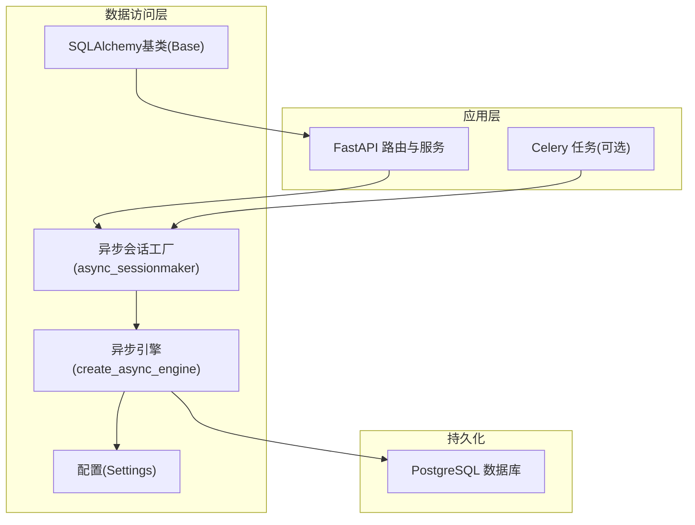
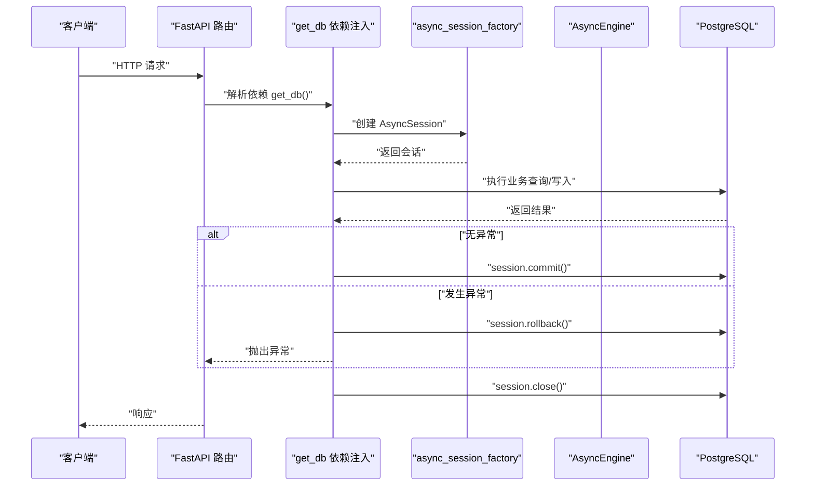
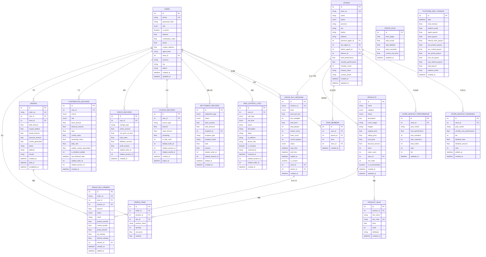
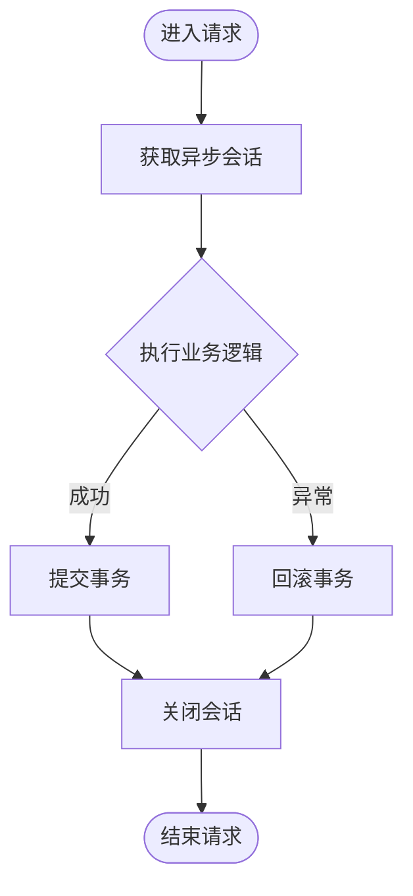
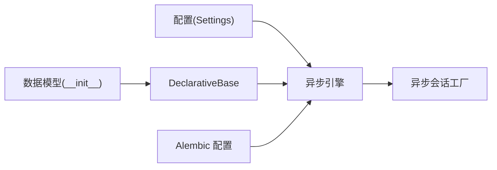

# 数据库架构设计

<cite>
**本文引用的文件**   
- [backend/app/database.py](file://backend/app/database.py)
- [backend/app/config.py](file://backend/app/config.py)
- [backend/alembic.ini](file://backend/alembic.ini)
- [backend/app/models/__init__.py](file://backend/app/models/__init__.py)
- [backend/app/models/user.py](file://backend/app/models/user.py)
- [backend/app/models/group_buy.py](file://backend/app/models/group_buy.py)
- [backend/app/models/store.py](file://backend/app/models/store.py)
- [backend/app/models/product.py](file://backend/app/models/product.py)
- [backend/app/models/contribution.py](file://backend/app/models/contribution.py)
- [backend/app/models/points.py](file://backend/app/models/points.py)
- [backend/app/models/settlement.py](file://backend/app/models/settlement.py)
- [backend/app/models/coupon.py](file://backend/app/models/coupon.py)
- [backend/app/models/risk_control.py](file://backend/app/models/risk_control.py)
</cite>

## 目录
1. [引言](#引言)
2. [项目结构](#项目结构)
3. [核心组件](#核心组件)
4. [架构总览](#架构总览)
5. [详细组件分析](#详细组件分析)
6. [依赖关系分析](#依赖关系分析)
7. [性能考虑](#性能考虑)
8. [故障排查指南](#故障排查指南)
9. [结论](#结论)
10. [附录](#附录)

## 引言
本文件面向AIxingmu系统的数据库架构设计与实现，聚焦PostgreSQL连接与异步会话、事务处理、数据模型与索引策略、迁移管理、性能优化与安全配置。文档以代码为依据，提供架构图、类图、时序图与流程图，帮助读者快速理解系统的数据层设计与最佳实践。

## 项目结构
后端采用FastAPI + SQLAlchemy异步驱动(asyncpg) + Alembic的架构：
- 数据库连接与会话由异步引擎和会话工厂统一管理，并通过依赖注入在请求生命周期内自动提交或回滚。
- 数据模型按业务域拆分（用户、拼团、门店、商品、贡献值、积分、结算、消费券、风控），并在统一包中导出。
- Alembic配置文件集中管理迁移脚本路径、命名模板与日志级别。

图表来源
- [backend/app/database.py:10-21](file://backend/app/database.py#L10-L21)
- [backend/app/config.py:16-19](file://backend/app/config.py#L16-L19)

章节来源
- [backend/app/database.py:1-40](file://backend/app/database.py#L1-L40)
- [backend/app/config.py:1-136](file://backend/app/config.py#L1-L136)
- [backend/alembic.ini:1-108](file://backend/alembic.ini#L1-L108)

## 核心组件
- 异步引擎与连接池
  - 使用create_async_engine创建异步引擎，通过配置项控制pool_size与max_overflow，并支持DEBUG开关输出SQL日志。
- 异步会话工厂与依赖注入
  - async_sessionmaker绑定引擎，expire_on_commit=False避免提交后失效；get_db为FastAPI提供依赖注入，自动commit/rollback/close。
- 配置中心
  - Settings集中管理DATABASE_URL、连接池参数、Redis/Celery/JWT等，便于环境隔离与多环境部署。
- 迁移工具
  - alembic.ini定义script_location、file_template、sqlalchemy.url与日志等级，规范迁移脚本生成与执行。

章节来源
- [backend/app/database.py:10-40](file://backend/app/database.py#L10-L40)
- [backend/app/config.py:16-19](file://backend/app/config.py#L16-L19)
- [backend/alembic.ini:3-108](file://backend/alembic.ini#L3-L108)

## 架构总览
下图展示从请求到数据库的关键调用链与事务边界。

图表来源
- [backend/app/database.py:29-40](file://backend/app/database.py#L29-L40)

## 详细组件分析

### 数据模型与关系设计
整体ER关系如下，覆盖用户、门店、拼团、商品、订单、贡献值、积分、消费券、分润与风控等核心实体。

图表来源
- [backend/app/models/user.py:26-71](file://backend/app/models/user.py#L26-L71)
- [backend/app/models/group_buy.py:42-131](file://backend/app/models/group_buy.py#L42-L131)
- [backend/app/models/store.py:22-103](file://backend/app/models/store.py#L22-L103)
- [backend/app/models/product.py:30-135](file://backend/app/models/product.py#L30-L135)
- [backend/app/models/contribution.py:32-115](file://backend/app/models/contribution.py#L32-L115)
- [backend/app/models/points.py:14-76](file://backend/app/models/points.py#L14-L76)
- [backend/app/models/settlement.py:30-123](file://backend/app/models/settlement.py#L30-L123)
- [backend/app/models/coupon.py:14-55](file://backend/app/models/coupon.py#L14-L55)
- [backend/app/models/risk_control.py:40-85](file://backend/app/models/risk_control.py#L40-L85)

#### 用户模块
- 角色体系：消费者、推荐人、门店、各级代理、管理员。
- 钱包资产：余额、贡献值、积分、消费券。
- 推荐关系与门店归属。
- 关键索引：手机号唯一、角色、推荐人、门店。

章节来源
- [backend/app/models/user.py:14-71](file://backend/app/models/user.py#L14-L71)

#### 拼团模块
- 场次：每小时一场，固定人数与胜负规则，支持门店自定义开团。
- 订单：记录参团金额、状态、权益与补贴明细。
- 每日统计：汇总场次、订单量、金额与补贴支出。
- 关键索引：场次编号、级别+状态、时间范围、用户+场次组合、订单状态。

章节来源
- [backend/app/models/group_buy.py:15-158](file://backend/app/models/group_buy.py#L15-L158)

#### 门店与团队
- 门店：四级区域、代理归属、推荐人、业绩统计。
- 团队成员：直推/间推层级与门店归属。
- 月度业绩：按月聚合指标与排名/阶梯。
- 关键索引：状态、省市区联合、parent+level、store_id+year_month。

章节来源
- [backend/app/models/store.py:14-103](file://backend/app/models/store.py#L14-L103)

#### 商品与订单
- 商品：四大品类、价格体系、库存与销量、门店关联。
- SKU：规格与编码。
- 订单与明细：支付金额、让利与贡献值生成、地址备注。
- 关键索引：品类、状态、门店、订单号、用户、SKU编码。

章节来源
- [backend/app/models/product.py:14-135](file://backend/app/models/product.py#L14-L135)

#### 贡献值与每周结算
- 贡献值：三大来源场景、六类角色分配、递减兑换与分红标记。
- 周结：有效贡献值×日利率×7生成消费券，平台收益池与全网贡献值统计。
- 关键索引：用户+来源、角色、用户+周起始。

章节来源
- [backend/app/models/contribution.py:15-115](file://backend/app/models/contribution.py#L15-L115)

#### 积分增值系统
- 总池：总量恒定、已发放/通缩/兑换累计、动态单价。
- 变动记录：earn/deflate/convert三类，记录当时单价与对应金额。
- 兑换记录：积分→消费券折算。
- 关键索引：用户+类型。

章节来源
- [backend/app/models/points.py:14-76](file://backend/app/models/points.py#L14-L76)

#### 分润结算
- 结算记录：多种结算类型、接收方信息、比例与金额、关联交易。
- 门店月度分红：按业绩阶梯计算分红比例与金额。
- 平台日财务：收入与支出明细，确保100%分配平衡校验。
- 关键索引：类型+状态、接收方、store_id+年月。

章节来源
- [backend/app/models/settlement.py:14-123](file://backend/app/models/settlement.py#L14-L123)

#### 消费券
- 券记录：来源类型、可用与已用金额、过期时间。
- 使用明细：每次抵扣记录。
- 关键索引：用户+来源。

章节来源
- [backend/app/models/coupon.py:14-55](file://backend/app/models/coupon.py#L14-L55)

#### 风控
- 风控日志：规则类型、风险等级、动作、详情、IP/设备、处理状态。
- 用户风险评分：评分、警告/拦截次数、黑名单、最近事件时间。
- 关键索引：用户+时间、风险等级。

章节来源
- [backend/app/models/risk_control.py:13-85](file://backend/app/models/risk_control.py#L13-L85)

### 事务与并发控制流程

图表来源
- [backend/app/database.py:29-40](file://backend/app/database.py#L29-L40)

## 依赖关系分析
- 模块耦合
  - database.py依赖config.py读取连接与池参数。
  - 所有模型均继承Base，并通过__init__.py统一导出，便于Alembic扫描。
- 外部依赖
  - PostgreSQL + asyncpg作为异步驱动。
  - Alembic用于版本化迁移。

图表来源
- [backend/app/database.py:10-21](file://backend/app/database.py#L10-L21)
- [backend/app/config.py:16-19](file://backend/app/config.py#L16-L19)
- [backend/app/models/__init__.py:1-37](file://backend/app/models/__init__.py#L1-L37)
- [backend/alembic.ini:3-108](file://backend/alembic.ini#L3-L108)

章节来源
- [backend/app/models/__init__.py:1-37](file://backend/app/models/__init__.py#L1-L37)
- [backend/alembic.ini:3-108](file://backend/alembic.ini#L3-L108)

## 性能考虑
- 连接池调优
  - pool_size与max_overflow根据并发QPS与CPU核数调整；生产建议开启连接复用与超时保护。
- 索引策略
  - 高频查询字段建立单列或多列复合索引，如用户角色、推荐人、门店区域、拼团级别+状态、时间范围、用户+会话组合等。
  - 对唯一约束字段（手机号、场次编号、订单号、SKU编码）利用唯一索引保证一致性与查询效率。
- 查询优化
  - 避免N+1查询，合理使用relationship加载策略；对大表分页查询使用基于主键或排序键的分页。
  - 将统计型查询下沉至物化视图或汇总表（如每日统计、平台日财务）。
- 事务粒度
  - 尽量缩小事务范围，减少长事务锁竞争；批量写入分批提交。
- 读写分离与缓存
  - 读多写少场景可引入只读副本；热点数据使用Redis缓存，注意一致性策略。

[本节为通用指导，不直接分析具体文件]

## 故障排查指南
- 连接失败
  - 检查DATABASE_URL、端口、用户名密码与网络连通性；确认pool_size未耗尽。
- 会话未提交/回滚
  - 确认依赖注入get_db是否正确捕获异常并执行rollback；查看SQL日志定位问题。
- 迁移失败
  - 核对alembic.ini中的sqlalchemy.url与目标库一致；检查版本头与依赖模型导入是否完整。
- 慢查询
  - 启用SQL日志(Debug模式)，结合EXPLAIN ANALYZE分析执行计划；补充缺失索引或改写查询。

章节来源
- [backend/app/database.py:10-40](file://backend/app/database.py#L10-L40)
- [backend/alembic.ini:55-108](file://backend/alembic.ini#L55-L108)

## 结论
本架构以异步引擎与依赖注入为核心，围绕拼团、贡献值、积分、分润等复杂业务构建了清晰的数据模型与索引策略。通过Alembic进行版本化迁移，配合合理的连接池与查询优化，可在高并发场景下保持稳定的性能与一致性。后续建议引入只读副本、缓存层与更完善的监控告警，进一步提升可用性。

[本节为总结，不直接分析具体文件]

## 附录

### 数据库安全配置建议
- 用户权限
  - 最小权限原则：应用账户仅授予必要表的DML权限；迁移操作使用独立管理员账户。
- 数据加密
  - 传输层启用TLS；敏感字段（如密码哈希、个人标识）在应用层加密存储。
- 备份恢复
  - 定期全量+增量备份；制定RPO/RTO目标，演练恢复流程。
- 审计与合规
  - 开启数据库审计日志；对高风险操作进行审批与留痕。

[本节为通用指导，不直接分析具体文件]

### Alembic迁移管理规范
- 命名与模板
  - 使用统一的file_template，包含日期、版本号与描述，便于追溯。
- 脚本编写
  - 每个变更一个迁移；明确up()与down()；DDL与DML分离，必要时拆分为多个步骤。
- 环境与幂等
  - 不同环境使用不同sqlalchemy.url；迁移脚本需具备幂等性，避免重复执行报错。
- 依赖与顺序
  - 显式声明依赖关系，避免循环依赖；先建表再建索引，先加列再改默认值。

章节来源
- [backend/alembic.ini:3-108](file://backend/alembic.ini#L3-L108)