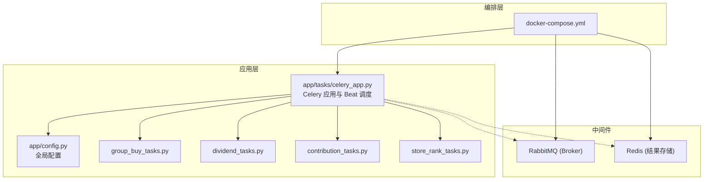
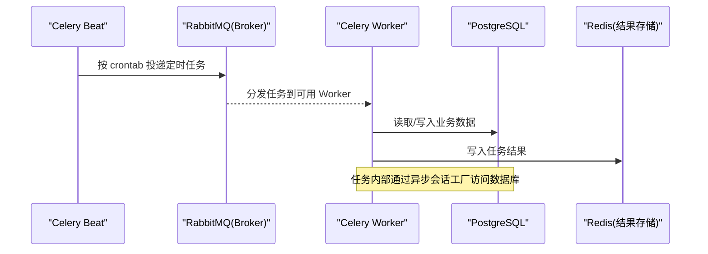
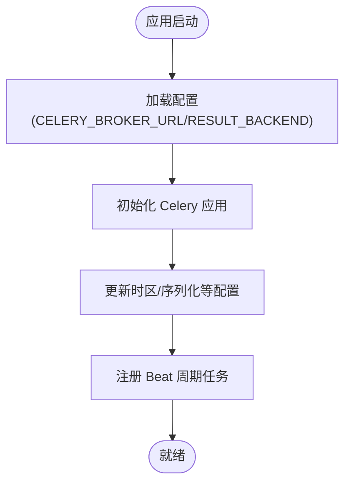
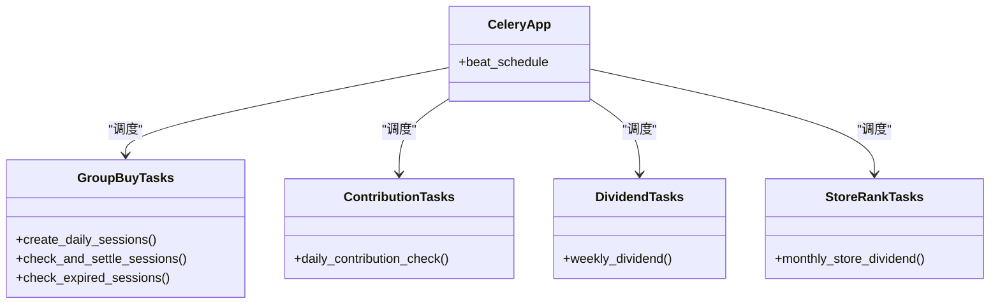
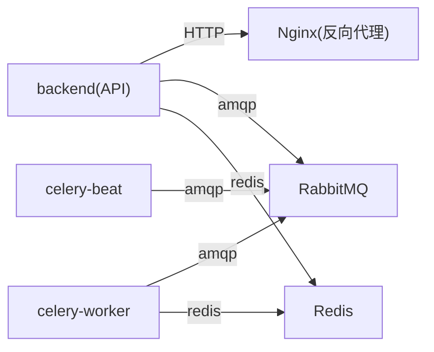
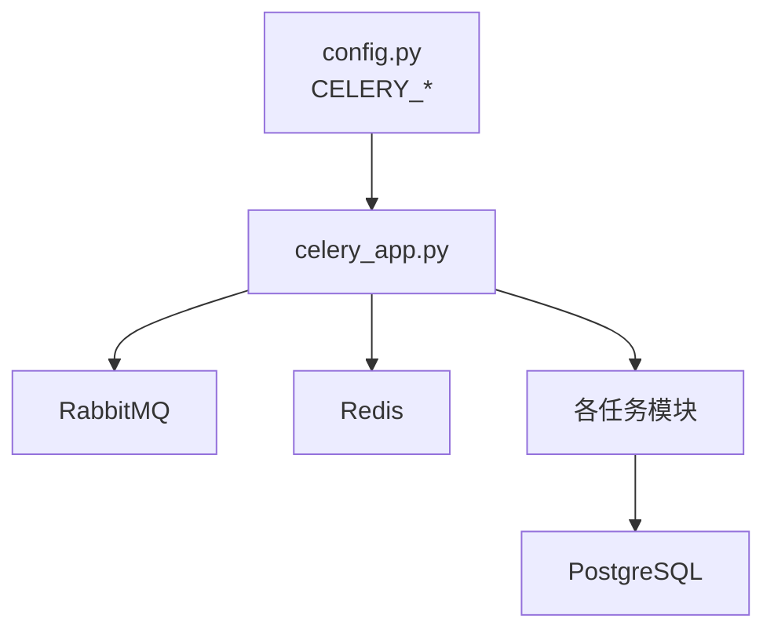

# 消息队列系统

<cite>
**本文引用的文件列表**
- [backend/app/tasks/celery_app.py](file://backend/app/tasks/celery_app.py)
- [backend/app/config.py](file://backend/app/config.py)
- [docker-compose.yml](file://docker-compose.yml)
- [backend/app/tasks/group_buy_tasks.py](file://backend/app/tasks/group_buy_tasks.py)
- [backend/app/tasks/dividend_tasks.py](file://backend/app/tasks/dividend_tasks.py)
- [backend/app/tasks/contribution_tasks.py](file://backend/app/tasks/contribution_tasks.py)
- [backend/app/tasks/store_rank_tasks.py](file://backend/app/tasks/store_rank_tasks.py)
</cite>

## 目录
1. [简介](#简介)
2. [项目结构](#项目结构)
3. [核心组件](#核心组件)
4. [架构总览](#架构总览)
5. [详细组件分析](#详细组件分析)
6. [依赖关系分析](#依赖关系分析)
7. [性能与扩展性](#性能与扩展性)
8. [可靠性与幂等设计](#可靠性与幂等设计)
9. [监控与日志](#监控与日志)
10. [安全配置](#安全配置)
11. [故障排查指南](#故障排查指南)
12. [结论](#结论)
13. [附录：任务开发指南](#附录任务开发指南)

## 简介
本文件为 AIxingmu 系统的消息队列系统设计文档，聚焦于 RabbitMQ 作为 Celery Broker 的架构、Celery Worker/Beat 的任务调度与执行、以及在生产环境下的可靠性、可观测性与安全性建议。当前仓库已提供 Celery 应用初始化、定时任务编排、Docker Compose 服务编排与全局配置；同时给出面向生产环境的增强建议（如集群、交换机与路由策略、死信队列、重试与幂等、监控告警与安全加固），以便在现有基础上平滑演进。

## 项目结构
与消息队列相关的代码主要位于后端 tasks 模块与配置、编排文件中：
- Celery 应用与 Beat 调度定义：backend/app/tasks/celery_app.py
- 业务定时任务实现：backend/app/tasks/group_buy_tasks.py、dividend_tasks.py、contribution_tasks.py、store_rank_tasks.py
- 全局配置（含 Broker/Backend URL）：backend/app/config.py
- 容器编排（RabbitMQ、Redis、Worker、Beat）：docker-compose.yml

图表来源
- [docker-compose.yml:29-96](file://docker-compose.yml#L29-L96)
- [backend/app/config.py:24-26](file://backend/app/config.py#L24-L26)
- [backend/app/tasks/celery_app.py:9-21](file://backend/app/tasks/celery_app.py#L9-L21)

章节来源
- [docker-compose.yml:29-96](file://docker-compose.yml#L29-L96)
- [backend/app/config.py:24-26](file://backend/app/config.py#L24-L26)
- [backend/app/tasks/celery_app.py:9-21](file://backend/app/tasks/celery_app.py#L9-L21)

## 核心组件
- Celery 应用与调度
  - 应用初始化：使用配置中的 Broker 与 Backend 建立连接，设置时区与序列化格式。
  - Beat 定时任务：集中声明多个周期性任务（每日创建场次、每小时结算检查、过期清理、周度分红、月度门店排名等）。
- 业务任务
  - 拼团相关：创建当日场次、检查并结算已满场次、检查过期场次。
  - 贡献值相关：每日递减核算，周一统一结算。
  - 分红与门店排名：周度全网贡献值分红、月度门店阶梯分红。
- 中间件
  - RabbitMQ：作为 Celery Broker，承载任务消息。
  - Redis：作为 Celery Result Backend，持久化任务结果。

章节来源
- [backend/app/tasks/celery_app.py:9-55](file://backend/app/tasks/celery_app.py#L9-L55)
- [backend/app/tasks/group_buy_tasks.py:17-53](file://backend/app/tasks/group_buy_tasks.py#L17-L53)
- [backend/app/tasks/dividend_tasks.py:15-25](file://backend/app/tasks/dividend_tasks.py#L15-L25)
- [backend/app/tasks/contribution_tasks.py:15-28](file://backend/app/tasks/contribution_tasks.py#L15-L28)
- [backend/app/tasks/store_rank_tasks.py:15-28](file://backend/app/tasks/store_rank_tasks.py#L15-L28)
- [backend/app/config.py:24-26](file://backend/app/config.py#L24-L26)
- [docker-compose.yml:29-96](file://docker-compose.yml#L29-L96)

## 架构总览
下图展示了当前仓库中消息队列与任务执行的端到端流程：API 或 Beat 触发任务 -> RabbitMQ 接收消息 -> Worker 消费并执行业务逻辑 -> 结果写入 Redis。

图表来源
- [backend/app/tasks/celery_app.py:24-55](file://backend/app/tasks/celery_app.py#L24-L55)
- [docker-compose.yml:72-96](file://docker-compose.yml#L72-L96)

## 详细组件分析

### Celery 应用与调度器
- 应用初始化
  - 从配置加载 Broker 与 Backend 地址，设置时区与 JSON 序列化。
- Beat 调度
  - 集中定义多个周期性任务，覆盖拼团生命周期、贡献值核算、分红与门店排名等业务节奏。

图表来源
- [backend/app/tasks/celery_app.py:9-21](file://backend/app/tasks/celery_app.py#L9-L21)
- [backend/app/tasks/celery_app.py:24-55](file://backend/app/tasks/celery_app.py#L24-L55)

章节来源
- [backend/app/tasks/celery_app.py:9-55](file://backend/app/tasks/celery_app.py#L9-L55)

### 任务模块与调用链
- 拼团任务
  - create_daily_sessions：每日创建场次
  - check_and_settle_sessions：每小时检查并结算已满场次
  - check_expired_sessions：每日检查过期场次
- 贡献值任务
  - daily_contribution_check：每日累计，周一结算
- 分红与门店任务
  - weekly_dividend：每周贡献值分红
  - monthly_store_dividend：每月门店排名与分红

图表来源
- [backend/app/tasks/celery_app.py:24-55](file://backend/app/tasks/celery_app.py#L24-L55)
- [backend/app/tasks/group_buy_tasks.py:17-53](file://backend/app/tasks/group_buy_tasks.py#L17-L53)
- [backend/app/tasks/contribution_tasks.py:15-28](file://backend/app/tasks/contribution_tasks.py#L15-L28)
- [backend/app/tasks/dividend_tasks.py:15-25](file://backend/app/tasks/dividend_tasks.py#L15-L25)
- [backend/app/tasks/store_rank_tasks.py:15-28](file://backend/app/tasks/store_rank_tasks.py#L15-L28)

章节来源
- [backend/app/tasks/group_buy_tasks.py:17-53](file://backend/app/tasks/group_buy_tasks.py#L17-L53)
- [backend/app/tasks/contribution_tasks.py:15-28](file://backend/app/tasks/contribution_tasks.py#L15-L28)
- [backend/app/tasks/dividend_tasks.py:15-25](file://backend/app/tasks/dividend_tasks.py#L15-L25)
- [backend/app/tasks/store_rank_tasks.py:15-28](file://backend/app/tasks/store_rank_tasks.py#L15-L28)

### 运行时编排与服务依赖
- Docker Compose 定义了 RabbitMQ、Redis、后端 API、Celery Worker、Celery Beat 等服务及其环境变量与依赖顺序。
- Worker 与 Beat 均通过环境变量注入 Broker/Backend 地址，确保多实例部署一致性。

图表来源
- [docker-compose.yml:29-96](file://docker-compose.yml#L29-L96)

章节来源
- [docker-compose.yml:29-96](file://docker-compose.yml#L29-L96)

## 依赖关系分析
- 配置依赖
  - Celery 应用依赖全局配置中的 CELERY_BROKER_URL 与 CELERY_RESULT_BACKEND。
- 运行时依赖
  - Worker/Beat 依赖 RabbitMQ 与 Redis 可用性。
  - 任务内部依赖数据库连接池与会话工厂。

图表来源
- [backend/app/config.py:24-26](file://backend/app/config.py#L24-L26)
- [backend/app/tasks/celery_app.py:9-21](file://backend/app/tasks/celery_app.py#L9-L21)

章节来源
- [backend/app/config.py:24-26](file://backend/app/config.py#L24-L26)
- [backend/app/tasks/celery_app.py:9-21](file://backend/app/tasks/celery_app.py#L9-L21)

## 性能与扩展性
- 水平扩展
  - 通过增加 celery-worker 实例提升吞吐；Beat 可多副本部署但需保证唯一性（建议使用外部锁或单主模式）。
- 资源隔离
  - 将高负载任务（如月度分红、门店排名）放入独立队列与专用 Worker 组，避免阻塞其他任务。
- 批处理与分页
  - 对大数据量任务采用分批/游标处理，降低单次事务与内存占用。
- 连接池与超时
  - 合理设置数据库连接池大小与查询超时，避免 Worker 长时间阻塞。

[本节为通用指导，不直接分析具体文件]

## 可靠性与幂等设计
- 消息确认机制
  - 建议在 Broker 侧开启持久化与消费者手动确认，确保任务至少一次语义。
- 死信队列（DLQ）
  - 为关键任务队列绑定 DLQ，用于捕获不可重试或多次失败的消息，便于人工介入与补偿。
- 重复消费防护
  - 任务幂等设计：基于业务唯一键（如订单号、场次ID）去重；在入库前做存在性判断或使用幂等表记录。
- 重试与退避
  - 对瞬时错误（网络抖动、临时锁冲突）启用指数退避重试；对业务异常直接失败并进入 DLQ。
- 结果与状态追踪
  - 利用 Redis 保存任务结果与状态，结合外部监控系统进行可视化。

[本节为通用指导，不直接分析具体文件]

## 监控与日志
- 任务状态跟踪
  - 通过 Celery Flower 或自建仪表盘展示任务队列长度、成功率、耗时分布。
- 性能监控
  - 采集 Worker CPU/内存、任务执行时长分位、数据库慢查询指标。
- 错误告警
  - 对失败率突增、DLQ 堆积、任务超时等阈值触发告警（邮件/IM/短信）。
- 日志规范
  - 结构化日志（JSON），包含 task_id、task_name、trace_id、耗时、关键参数摘要。

[本节为通用指导，不直接分析具体文件]

## 安全配置
- 认证授权
  - 为 RabbitMQ 创建专用用户与虚拟主机，最小权限原则；禁用默认 guest 账户暴露。
- 网络隔离
  - 将 RabbitMQ/Redis 置于内网，仅允许后端与 Worker 访问；对外仅开放 Nginx/API 端口。
- 传输加密
  - 启用 AMQP TLS 与 Redis TLS（若支持），并在客户端强制校验证书。
- 密钥管理
  - 敏感信息（密码、Token）通过环境变量或密钥管理服务注入，避免硬编码。

[本节为通用指导，不直接分析具体文件]

## 故障排查指南
- 常见问题定位
  - 无法连接 Broker/Backend：检查环境变量与网络连通性。
  - 任务未执行：确认 Beat 是否运行、队列是否存在、Worker 是否订阅对应队列。
  - 任务重复执行：检查幂等设计与去重键。
  - 任务失败无重试：确认是否抛出可重试异常或配置了重试策略。
- 快速自检清单
  - 查看 Worker 日志级别与输出；确认 Redis 结果可写；核对数据库连接池与事务提交。
  - 使用 RabbitMQ 管理界面观察队列积压与消费者数量。

[本节为通用指导，不直接分析具体文件]

## 结论
当前仓库已具备 Celery + RabbitMQ + Redis 的基础能力，并通过 Beat 实现了稳定的定时任务编排。面向生产环境，建议在此基础上完善消息可靠性（持久化、确认、DLQ）、幂等与重试策略、可观测性与安全加固，以支撑更高吞吐与更强稳定性。

[本节为总结性内容，不直接分析具体文件]

## 附录：任务开发指南
- 新建任务步骤
  - 在对应任务文件中定义函数并使用装饰器注册任务名。
  - 在 Beat 调度中新增条目，指定任务名与 cron 表达式。
  - 在 Worker 中自动发现并执行。
- 最佳实践
  - 保持任务幂等；对 I/O 操作设置超时；避免长事务；记录必要上下文日志。
  - 对可能失败的 I/O 调用封装重试与降级逻辑。
  - 对批量数据处理采用分页/流式处理，控制内存峰值。

章节来源
- [backend/app/tasks/celery_app.py:24-55](file://backend/app/tasks/celery_app.py#L24-L55)
- [backend/app/tasks/group_buy_tasks.py:17-53](file://backend/app/tasks/group_buy_tasks.py#L17-L53)
- [backend/app/tasks/dividend_tasks.py:15-25](file://backend/app/tasks/dividend_tasks.py#L15-L25)
- [backend/app/tasks/contribution_tasks.py:15-28](file://backend/app/tasks/contribution_tasks.py#L15-L28)
- [backend/app/tasks/store_rank_tasks.py:15-28](file://backend/app/tasks/store_rank_tasks.py#L15-L28)