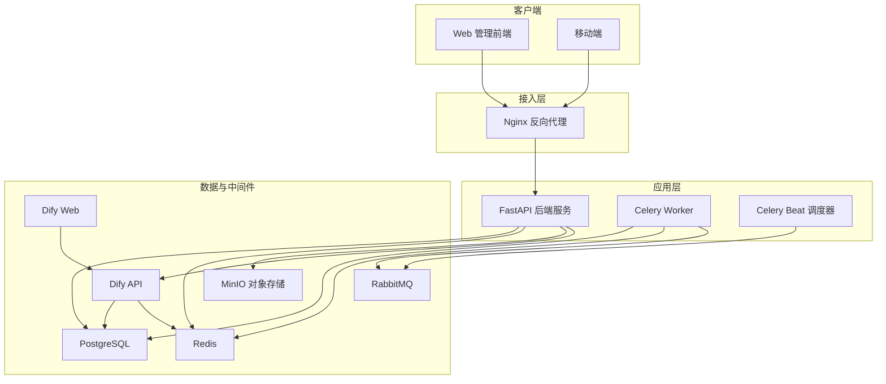
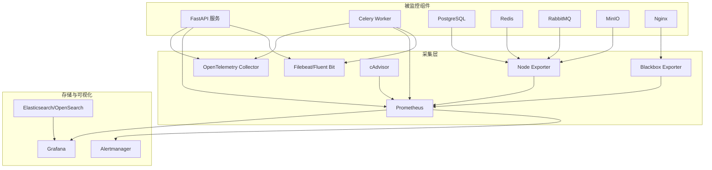
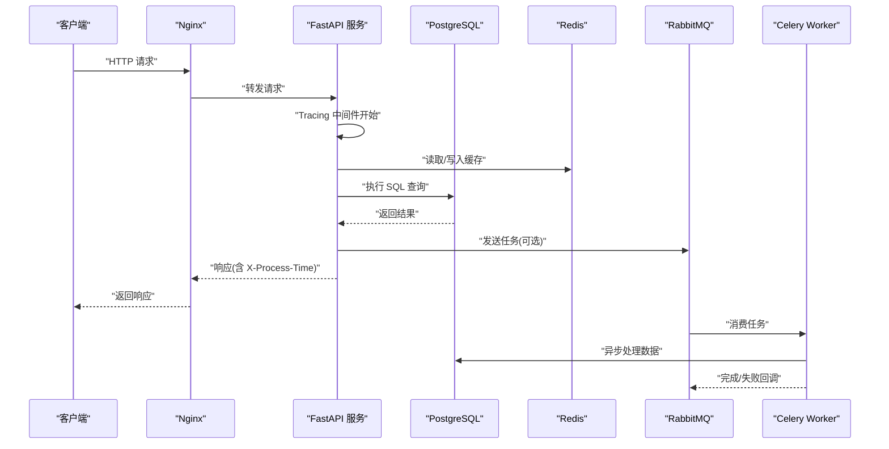
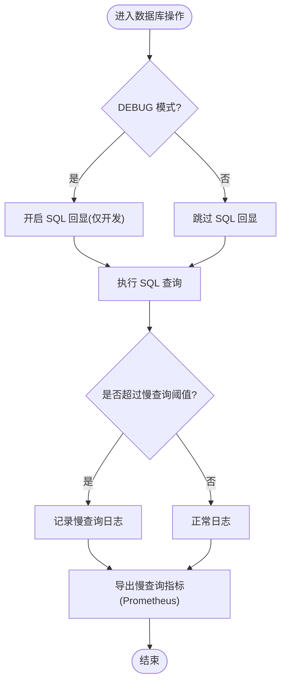
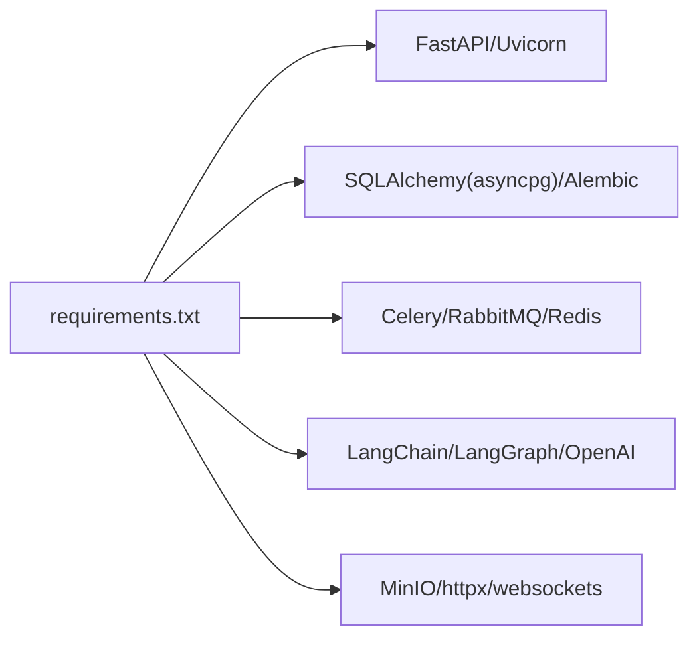
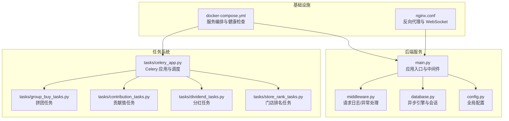

# 监控系统设计

<cite>
**本文引用的文件列表**
- [backend/app/main.py](file://backend/app/main.py)
- [backend/app/middleware.py](file://backend/app/middleware.py)
- [backend/app/config.py](file://backend/app/config.py)
- [backend/app/database.py](file://backend/app/database.py)
- [backend/requirements.txt](file://backend/requirements.txt)
- [docker-compose.yml](file://docker-compose.yml)
- [nginx.conf](file://nginx.conf)
- [backend/app/tasks/celery_app.py](file://backend/app/tasks/celery_app.py)
- [backend/app/tasks/group_buy_tasks.py](file://backend/app/tasks/group_buy_tasks.py)
- [backend/app/tasks/contribution_tasks.py](file://backend/app/tasks/contribution_tasks.py)
- [backend/app/tasks/dividend_tasks.py](file://backend/app/tasks/dividend_tasks.py)
- [backend/app/tasks/store_rank_tasks.py](file://backend/app/tasks/store_rank_tasks.py)
</cite>

## 目录
1. [引言](#引言)
2. [项目结构](#项目结构)
3. [核心组件](#核心组件)
4. [架构总览](#架构总览)
5. [详细组件分析](#详细组件分析)
6. [依赖关系分析](#依赖关系分析)
7. [性能考虑](#性能考虑)
8. [故障排查指南](#故障排查指南)
9. [结论](#结论)
10. [附录](#附录)

## 引言
本设计文档面向 AIxingmu 系统，目标是构建一套覆盖应用性能监控（APM）、请求链路追踪、慢查询分析、业务指标采集与可视化、告警规则配置、日志收集与分析以及基础设施监控的完整监控体系。结合现有后端 FastAPI 服务、Celery 异步任务、PostgreSQL、Redis、RabbitMQ、MinIO 与 Nginx 反向代理等组件，提供可落地的架构图、集成方案与示例配置路径，帮助团队在生产环境实现稳定、可观测、可告警的运行保障。

## 项目结构
当前仓库采用前后端分离与多容器编排：
- 后端 API：FastAPI + SQLAlchemy(asyncpg) + Celery + Redis/RabbitMQ
- 前端管理：Web 管理后台与移动端
- 基础设施：PostgreSQL、Redis、RabbitMQ、MinIO、Nginx、Dify RAG 平台
- 编排：docker-compose 统一启动与管理

图表来源
- [docker-compose.yml:1-149](file://docker-compose.yml#L1-L149)
- [nginx.conf:1-39](file://nginx.conf#L1-L39)
- [backend/app/main.py:1-78](file://backend/app/main.py#L1-L78)

章节来源
- [docker-compose.yml:1-149](file://docker-compose.yml#L1-L149)
- [nginx.conf:1-39](file://nginx.conf#L1-L39)
- [backend/app/main.py:1-78](file://backend/app/main.py#L1-L78)

## 核心组件
- 应用入口与生命周期：FastAPI 应用初始化、路由注册、健康检查、中间件挂载
- 全局中间件：请求日志记录、异常处理、CORS
- 数据库连接与会话：异步引擎、会话工厂、依赖注入
- 定时任务与异步任务：Celery 应用、Beat 调度、业务任务（拼团、贡献值、分红、门店排名）
- 外部依赖：PostgreSQL、Redis、RabbitMQ、MinIO、Dify RAG

章节来源
- [backend/app/main.py:1-78](file://backend/app/main.py#L1-L78)
- [backend/app/middleware.py:1-121](file://backend/app/middleware.py#L1-L121)
- [backend/app/database.py:1-40](file://backend/app/database.py#L1-L40)
- [backend/app/tasks/celery_app.py:1-44](file://backend/app/tasks/celery_app.py#L1-L44)
- [backend/app/tasks/group_buy_tasks.py:1-53](file://backend/app/tasks/group_buy_tasks.py#L1-L53)
- [backend/app/tasks/contribution_tasks.py:1-28](file://backend/app/tasks/contribution_tasks.py#L1-L28)
- [backend/app/tasks/dividend_tasks.py:1-25](file://backend/app/tasks/dividend_tasks.py#L1-L25)
- [backend/app/tasks/store_rank_tasks.py:1-28](file://backend/app/tasks/store_rank_tasks.py#L1-L28)

## 架构总览
下图展示监控体系在系统中的集成点与数据流向：
- APM 与链路追踪：在 FastAPI 中间件与数据库层埋点，向 OpenTelemetry Collector 上报
- 指标采集：Prometheus 抓取 Python 进程指标与应用自定义指标
- 日志聚合：结构化日志经 Filebeat/Fluent Bit 采集到 Elasticsearch/OpenSearch
- 可视化与告警：Grafana 仪表盘与 Alertmanager 告警
- 基础设施监控：Node Exporter、cAdvisor、Blackbox Exporter 采集主机、容器与网络探针

[此图为概念性架构图，不直接映射具体源码文件]

## 详细组件分析

### 应用性能监控（APM）与请求链路追踪
- 目标
  - 以 OpenTelemetry 为统一标准，对 HTTP 请求、数据库访问、缓存、消息队列进行全链路追踪
  - 通过 Trace ID 串联跨服务调用，定位瓶颈与错误
- 集成要点
  - 在 FastAPI 应用启动时启用 Tracing 中间件，自动捕获入站请求、响应状态码、耗时、URL、方法、客户端 IP 等
  - 在数据库层启用 SQL 语句追踪，输出慢查询与执行计划
  - 在 Celery 任务中传播 Trace Context，确保异步链路完整
- 关键埋点位置建议
  - 应用入口与中间件：参考 [backend/app/main.py:1-78](file://backend/app/main.py#L1-L78)、[backend/app/middleware.py:1-121](file://backend/app/middleware.py#L1-L121)
  - 数据库会话与引擎：参考 [backend/app/database.py:1-40](file://backend/app/database.py#L1-L40)
  - Celery 任务：参考 [backend/app/tasks/celery_app.py:1-44](file://backend/app/tasks/celery_app.py#L1-L44) 及各任务文件

图表来源
- [backend/app/main.py:1-78](file://backend/app/main.py#L1-L78)
- [backend/app/middleware.py:1-121](file://backend/app/middleware.py#L1-L121)
- [backend/app/database.py:1-40](file://backend/app/database.py#L1-L40)
- [backend/app/tasks/celery_app.py:1-44](file://backend/app/tasks/celery_app.py#L1-L44)

章节来源
- [backend/app/main.py:1-78](file://backend/app/main.py#L1-L78)
- [backend/app/middleware.py:1-121](file://backend/app/middleware.py#L1-L121)
- [backend/app/database.py:1-40](file://backend/app/database.py#L1-L40)
- [backend/app/tasks/celery_app.py:1-44](file://backend/app/tasks/celery_app.py#L1-L44)

### 慢查询分析与数据库性能优化
- 现状
  - 使用 asyncpg + SQLAlchemy，支持连接池与溢出配置
  - DEBUG 模式下开启 SQL 回显，便于开发期观察
- 建议
  - 生产环境关闭 SQL 回显，避免额外开销
  - 启用数据库慢查询日志（PostgreSQL log_min_duration_statement），并配合 Prometheus 导出器采集
  - 对热点表建立合适索引，关注 JOIN 与子查询复杂度
  - 将慢查询样本纳入 APM 追踪，关联 Trace ID 进行根因分析

图表来源
- [backend/app/database.py:1-40](file://backend/app/database.py#L1-L40)
- [backend/app/config.py:1-145](file://backend/app/config.py#L1-145)

章节来源
- [backend/app/database.py:1-40](file://backend/app/database.py#L1-L40)
- [backend/app/config.py:1-145](file://backend/app/config.py#L1-145)

### 业务指标采集与可视化
- 关键业务 KPI 建议
  - 订单相关：新增订单数、支付成功率、退款率、平均处理时长
  - 拼团业务：场次创建数、参与人数、中奖率、过期场次清理数
  - 贡献值与积分：每日累计量、周结算次数、发放成功率
  - 门店业绩：月度业绩、排名变化、阶梯分红触发次数
- 自定义指标定义
  - 计数器（Counter）：如“订单创建总数”、“任务成功/失败计数”
  - 直方图（Histogram）：如“接口耗时分布”、“SQL 执行时间分布”
  - 摘要（Summary）：如“P95/P99 延迟分位”
  - 标签维度：按模块、接口、用户类型、地区、门店等级等
- 数据可视化
  - Grafana 仪表盘：汇总各业务域 KPI、趋势、对比、TopN
  - 看板分层：概览层（整体健康）、业务层（KPI 详情）、诊断层（Trace/日志联动）

章节来源
- [backend/app/tasks/group_buy_tasks.py:1-53](file://backend/app/tasks/group_buy_tasks.py#L1-L53)
- [backend/app/tasks/contribution_tasks.py:1-28](file://backend/app/tasks/contribution_tasks.py#L1-L28)
- [backend/app/tasks/dividend_tasks.py:1-25](file://backend/app/tasks/dividend_tasks.py#L1-L25)
- [backend/app/tasks/store_rank_tasks.py:1-28](file://backend/app/tasks/store_rank_tasks.py#L1-L28)

### 告警规则配置
- 阈值设置原则
  - 基于历史基线与 SLO 设定动态阈值，避免误报与漏报
  - 区分紧急、重要、提示三级告警级别
- 告警级别定义
  - P0（紧急）：核心功能不可用、数据不一致、资金风险
  - P1（重要）：性能退化、错误率升高、资源紧张
  - P2（提示）：容量预警、非关键任务失败
- 通知渠道配置
  - 邮件、企业微信、钉钉、短信、电话
  - 告警收敛与去重，避免风暴
- 示例告警规则（概念性）
  - 接口错误率 > 5% 持续 5 分钟 → P1
  - 平均响应时间 > 2s（P95 > 5s）持续 10 分钟 → P1
  - 数据库连接池耗尽或慢查询占比 > 10% → P1
  - Celery 任务积压 > 阈值且持续增长 → P1
  - 节点 CPU/内存/磁盘使用率超阈值 → P2

[本节为通用指导，不直接分析具体文件]

### 日志收集与分析
- 结构化日志格式
  - 字段包括：时间戳、级别、模块名、Trace ID、请求 ID、方法、URL、状态码、耗时、客户端 IP、错误堆栈
  - 统一 JSON 格式，便于解析与检索
- 日志聚合存储
  - 使用 Filebeat/Fluent Bit 采集容器 stdout 与本地日志文件，推送至 Elasticsearch/OpenSearch
  - 保留策略与索引分片规划，控制成本与查询性能
- 检索查询优化
  - 常用过滤条件：时间范围、模块、级别、Trace ID、URL、状态码
  - 建立合适的索引与别名，避免全表扫描
  - 将关键错误与慢请求单独索引，提升排障效率

章节来源
- [backend/app/middleware.py:1-121](file://backend/app/middleware.py#L1-L121)
- [backend/app/main.py:1-78](file://backend/app/main.py#L1-L78)

### 基础设施监控
- 服务器资源监控
  - Node Exporter 采集 CPU、内存、磁盘、网络、文件系统
  - 容器化部署下结合 cAdvisor 采集容器资源
- 容器健康检查
  - docker-compose 中已为 PostgreSQL 配置 healthcheck；其他服务可按需补充
- 网络性能监控
  - Blackbox Exporter 对外部接口进行可用性探测（HTTP/TCP/ICMP）
  - Nginx 暴露 stub_status 指标，监控连接数、请求速率、状态码分布

章节来源
- [docker-compose.yml:1-149](file://docker-compose.yml#L1-L149)
- [nginx.conf:1-39](file://nginx.conf#L1-L39)

## 依赖关系分析
- 运行时依赖
  - FastAPI、Uvicorn、SQLAlchemy(asyncpg)、Alembic、Pydantic、pydantic-settings
  - Celery、RabbitMQ、Redis、MinIO、LangChain/LangGraph、OpenAI、httpx、websockets
- 监控相关依赖现状
  - 当前 requirements.txt 未包含 Prometheus、OpenTelemetry、Sentry、Loguru、Structlog 等监控库
  - 建议在后续版本按需引入，并在配置中心统一管理开关与参数

图表来源
- [backend/requirements.txt:1-35](file://backend/requirements.txt#L1-L35)

章节来源
- [backend/requirements.txt:1-35](file://backend/requirements.txt#L1-L35)

## 性能考虑
- 连接池与溢出
  - 合理设置 DATABASE_POOL_SIZE 与 DATABASE_MAX_OVERFLOW，避免连接耗尽与频繁创建销毁
- 慢查询治理
  - 定期审查慢查询日志，优化索引与 SQL 写法，减少锁竞争
- 缓存策略
  - 热点数据优先走 Redis，注意缓存穿透、击穿、雪崩防护
- 任务削峰
  - Celery Worker 水平扩展，结合队列优先级与限流策略
- 资源隔离
  - 不同业务域拆分队列与实例，避免相互影响
- 可观测性开销
  - 采样策略与采样率控制，避免高负载下监控自身成为瓶颈

[本节为通用指导，不直接分析具体文件]

## 故障排查指南
- 常见问题定位
  - 接口超时：查看中间件记录的耗时与状态码，结合 Trace ID 定位下游依赖
  - 数据库错误：检查连接池、慢查询、锁等待与事务回滚情况
  - 任务失败：查看 Celery Worker 日志与任务结果后端，确认重试与死信队列
  - 资源不足：监控 CPU/内存/磁盘/网络，识别热点服务与扩容需求
- 快速步骤
  - 从 Grafana 仪表盘发现异常指标
  - 通过 Trace ID 跳转到对应日志与慢查询
  - 结合 Nginx 与后端日志交叉验证
  - 必要时重启或扩容相应服务

章节来源
- [backend/app/middleware.py:1-121](file://backend/app/middleware.py#L1-L121)
- [backend/app/database.py:1-40](file://backend/app/database.py#L1-L40)
- [backend/app/tasks/celery_app.py:1-44](file://backend/app/tasks/celery_app.py#L1-L44)

## 结论
通过在 FastAPI 与 Celery 生态中引入 OpenTelemetry、Prometheus、Elasticsearch/OpenSearch 与 Grafana，AIxingmu 可实现端到端的可观测性与告警能力。结合结构化日志、慢查询治理与基础设施监控，能够显著提升问题定位效率与系统稳定性。建议分阶段落地：先补齐基础指标与日志聚合，再完善链路追踪与业务 KPI 可视化，最后建立完善的告警与演练机制。

## 附录

### 监控架构图（代码级映射）

图表来源
- [backend/app/main.py:1-78](file://backend/app/main.py#L1-L78)
- [backend/app/middleware.py:1-121](file://backend/app/middleware.py#L1-L121)
- [backend/app/database.py:1-40](file://backend/app/database.py#L1-L40)
- [backend/app/config.py:1-145](file://backend/app/config.py#L1-145)
- [backend/app/tasks/celery_app.py:1-44](file://backend/app/tasks/celery_app.py#L1-L44)
- [backend/app/tasks/group_buy_tasks.py:1-53](file://backend/app/tasks/group_buy_tasks.py#L1-L53)
- [backend/app/tasks/contribution_tasks.py:1-28](file://backend/app/tasks/contribution_tasks.py#L1-L28)
- [backend/app/tasks/dividend_tasks.py:1-25](file://backend/app/tasks/dividend_tasks.py#L1-L25)
- [backend/app/tasks/store_rank_tasks.py:1-28](file://backend/app/tasks/store_rank_tasks.py#L1-L28)
- [docker-compose.yml:1-149](file://docker-compose.yml#L1-L149)
- [nginx.conf:1-39](file://nginx.conf#L1-L39)

### 告警配置示例（概念性）
- 指标源
  - Prometheus 抓取 Python 进程指标与应用自定义指标
  - Blackbox Exporter 对外部接口进行可用性探测
- 规则示例（描述性）
  - 接口错误率 > 5% 持续 5 分钟 → 级别 P1，通知渠道：企业微信+邮件
  - 平均响应时间 > 2s（P95 > 5s）持续 10 分钟 → 级别 P1，通知渠道：企业微信+短信
  - 数据库慢查询占比 > 10% 持续 15 分钟 → 级别 P1，通知渠道：企业微信+邮件
  - Celery 任务积压 > 阈值且持续增长 → 级别 P1，通知渠道：企业微信+电话
  - 节点 CPU/内存/磁盘使用率超阈值 → 级别 P2，通知渠道：企业微信

[本节为通用指导，不直接分析具体文件]