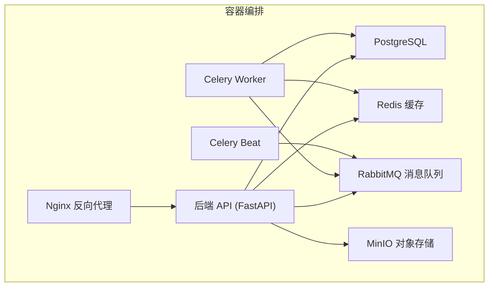
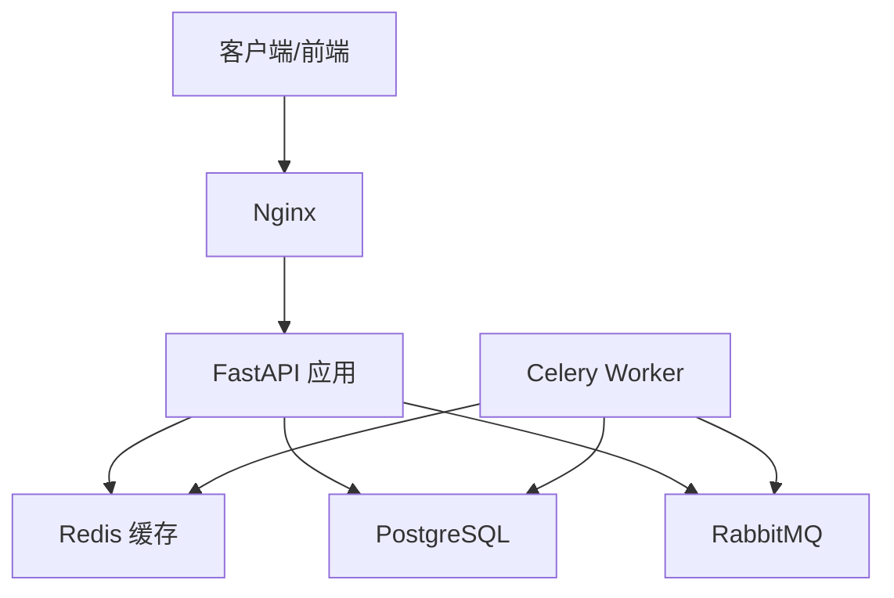
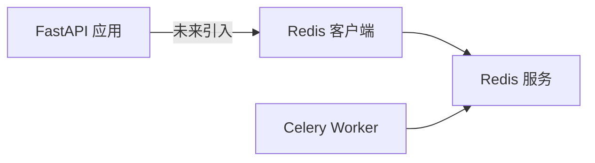
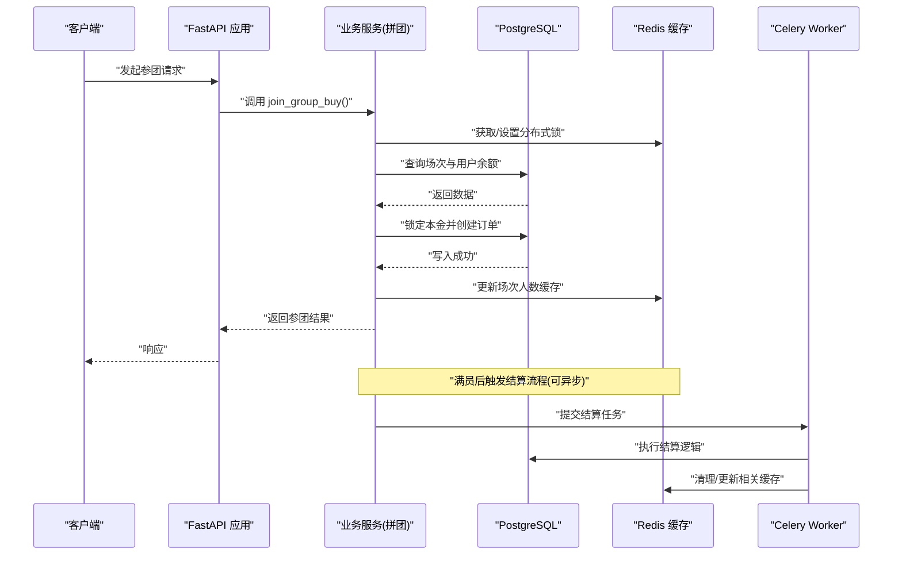

# 缓存系统设计

<cite>
**本文引用的文件**   
- [backend/app/config.py](file://backend/app/config.py)
- [docker-compose.yml](file://docker-compose.yml)
- [backend/requirements.txt](file://backend/requirements.txt)
- [backend/app/main.py](file://backend/app/main.py)
- [backend/app/database.py](file://backend/app/database.py)
- [backend/app/api/v1/auth.py](file://backend/app/api/v1/auth.py)
- [backend/app/services/group_buy_service.py](file://backend/app/services/group_buy_service.py)
</cite>

## 目录
1. [引言](#引言)
2. [项目结构](#项目结构)
3. [核心组件](#核心组件)
4. [架构总览](#架构总览)
5. [详细组件分析](#详细组件分析)
6. [依赖分析](#依赖分析)
7. [性能考虑](#性能考虑)
8. [故障排查指南](#故障排查指南)
9. [结论](#结论)
10. [附录](#附录)

## 引言
本设计文档面向AIxingmu系统的Redis缓存体系，目标是在现有FastAPI后端与异步任务（Celery）基础上，构建高可用、可扩展、可观测的缓存层。文档覆盖连接配置、集群部署、数据持久化策略；定义热点数据缓存、会话存储、分布式锁等使用模式；给出一致性保证方案（更新策略、失效机制、同步方案）、性能优化建议（键值规范、内存管理、监控指标）、安全配置（访问控制、加密、防攻击），并提供架构图与示例代码路径。

## 项目结构
当前仓库已包含Redis服务与Python客户端依赖，但尚未在应用代码中集成Redis客户端。后续将在配置中心统一注入Redis连接，并在关键业务路径引入缓存读写与锁能力。

**图表来源** 
- [docker-compose.yml:21-28](file://docker-compose.yml#L21-L28)
- [docker-compose.yml:52-96](file://docker-compose.yml#L52-L96)

**章节来源**
- [docker-compose.yml:1-111](file://docker-compose.yml#L1-L111)
- [backend/app/main.py:1-75](file://backend/app/main.py#L1-L75)

## 核心组件
- 配置中心：集中管理数据库、Redis、Celery、CORS、对象存储等环境变量，便于多环境切换与灰度发布。
- 应用入口：注册路由、中间件、生命周期钩子，为后续接入缓存提供扩展点。
- 数据库层：基于SQLAlchemy异步引擎与会话工厂，负责持久化读写。
- 业务服务：以拼团为核心场景，涉及并发参与、满员判定、结算分润等强一致与高性能要求。
- 外部依赖：Redis用于缓存与分布式锁；RabbitMQ作为任务队列；MinIO用于对象存储。

**章节来源**
- [backend/app/config.py:8-41](file://backend/app/config.py#L8-L41)
- [backend/app/main.py:35-75](file://backend/app/main.py#L35-L75)
- [backend/app/database.py:10-21](file://backend/app/database.py#L10-L21)
- [backend/app/services/group_buy_service.py:17-182](file://backend/app/services/group_buy_service.py#L17-L182)

## 架构总览
下图展示缓存层在系统中的位置与交互关系，包括读多写少热点数据、会话存储、分布式锁以及任务结果缓存。

**图表来源** 
- [docker-compose.yml:52-96](file://docker-compose.yml#L52-L96)
- [docker-compose.yml:21-28](file://docker-compose.yml#L21-L28)

## 详细组件分析

### 连接配置与环境变量
- 配置项
  - REDIS_URL：主库连接地址（默认本地6379/0）
  - CELERY_RESULT_BACKEND：任务结果存放（默认本地6379/1）
- 容器环境
  - docker-compose中为后端与Worker注入REDIS_URL与CELERY_RESULT_BACKEND
- 依赖包
  - redis、aioredis用于同步/异步客户端

建议
- 生产环境将REDIS_URL指向独立Redis实例或集群端点
- 通过环境变量区分dev/staging/prod，避免硬编码

**章节来源**
- [backend/app/config.py:21-26](file://backend/app/config.py#L21-L26)
- [docker-compose.yml:57-61](file://docker-compose.yml#L57-L61)
- [docker-compose.yml:76-80](file://docker-compose.yml#L76-L80)
- [backend/requirements.txt:19-22](file://backend/requirements.txt#L19-L22)

### 集群部署方案
- 单机开发：单节点Redis，端口映射到宿主机，数据卷持久化
- 生产推荐
  - Redis Cluster：至少6节点（3主3从），客户端启用cluster模式
  - Sentinel：若暂不升级Cluster，可使用Sentinel实现主从高可用
- 网络与安全
  - 仅内网互通，关闭对外暴露
  - 启用requirepass并限制来源IP白名单
  - 使用TLS加密传输（生产）

说明
- 当前仓库未包含集群配置，建议在部署脚本中增加cluster/sentinel参数与启动命令

**章节来源**
- [docker-compose.yml:21-28](file://docker-compose.yml#L21-L28)

### 数据持久化策略
- RDB快照：适合冷备与快速恢复，注意触发频率与内存占用
- AOF追加日志：更可靠的数据恢复，可选everysec策略平衡性能与安全性
- 混合持久化：Redis 4+支持，兼顾恢复速度与体积
- 容量规划：根据键数量、平均大小、TTL分布估算内存峰值，预留扩容空间

**章节来源**
- [docker-compose.yml:21-28](file://docker-compose.yml#L21-L28)

### 缓存使用模式

#### 热点数据缓存
- 适用场景
  - 商品详情、门店信息、活动规则、配置常量
- 策略
  - Cache-Aside：先读缓存，未命中再读DB并回填；写时更新缓存
  - TTL：按业务时效设置过期时间，避免脏读
  - 穿透防护：空值缓存短TTL或布隆过滤器
  - 击穿防护：互斥锁或逻辑过期
  - 雪崩防护：随机抖动TTL、热点Key预热

示例代码路径
- 商品详情读取与写入：[backend/app/api/v1/product.py](file://backend/app/api/v1/product.py)
- 配置常量读取：[backend/app/config.py](file://backend/app/config.py)

#### 会话存储
- 适用场景
  - 用户登录态、短期令牌、验证码、限流计数
- 策略
  - Key命名：session:{user_id}，TTL=会话有效期
  - 原子操作：incr/decr用于计数器
  - 幂等校验：结合请求ID去重

示例代码路径
- 认证接口（可在此处引入会话缓存）：[backend/app/api/v1/auth.py](file://backend/app/api/v1/auth.py)

#### 分布式锁
- 适用场景
  - 场次满员判定、结算互斥、库存扣减、重复提交防护
- 策略
  - 使用SETNX/SET NX EX实现带超时的分布式锁
  - 锁粒度尽量小，避免长事务
  - 失败重试与退避，防止风暴
  - 锁续期：看门狗或定时任务续约（谨慎使用）

示例代码路径
- 参团流程（需加锁保护并发）：[backend/app/services/group_buy_service.py:93-182](file://backend/app/services/group_buy_service.py#L93-L182)
- 结算流程（需互斥）：[backend/app/services/group_buy_service.py:183-321](file://backend/app/services/group_buy_service.py#L183-L321)

#### 任务结果缓存
- 适用场景
  - Celery任务执行结果、状态查询
- 策略
  - 使用CELERY_RESULT_BACKEND指向Redis
  - 合理设置结果过期时间，避免堆积

示例代码路径
- 任务结果后端配置：[backend/app/config.py:25-26](file://backend/app/config.py#L25-L26)
- 容器环境注入：[docker-compose.yml:76-80](file://docker-compose.yml#L76-L80)

### 缓存一致性保证

#### 更新策略
- 首选Cache-Aside：写DB后删除缓存，由下次读重建
- 延迟双删：写DB→删缓存→延时再删一次，降低竞态窗口
- 订阅变更：基于Binlog/Outbox事件驱动更新/失效缓存（高阶）

#### 失效机制
- TTL：按业务语义设置过期时间
- 主动失效：业务变更时显式删除相关Key
- 批量失效：按前缀扫描删除（谨慎使用，可能阻塞）

#### 数据同步方案
- 最终一致性：允许短暂不一致，通过补偿任务修复
- 幂等性：所有写操作具备幂等键，避免重复处理
- 版本控制：对热点实体引入版本号，配合乐观锁

**章节来源**
- [backend/app/services/group_buy_service.py:93-182](file://backend/app/services/group_buy_service.py#L93-L182)
- [backend/app/services/group_buy_service.py:183-321](file://backend/app/services/group_buy_service.py#L183-L321)

### 性能优化

#### 键值设计规范
- 命名约定：模块:资源:标识[:维度]，如 groupbuy:session:{id}、user:profile:{uid}
- 长度控制：避免过长Key与Value
- 序列化：JSON或MessagePack，统一编码与版本字段

#### 内存管理
- 淘汰策略：volatile-ttl/lru/allkeys-lru按需选择
- 大Key拆分：将大集合拆分为多个小Key
- 压缩：开启zlib压缩（针对大文本）

#### 监控指标
- 命中率、命中率下降告警
- 内存使用率、碎片率
- 延迟P95/P99、错误率
- 慢查询、大Key统计

#### 读写分离与连接池
- 只读副本：读多写少场景分流
- 连接池：复用连接，减少握手开销

**章节来源**
- [backend/requirements.txt:19-22](file://backend/requirements.txt#L19-L22)

### 安全配置

#### 访问控制
- requirepass：强制密码认证
- ACL：最小权限原则，按业务划分用户与命令集
- 网络隔离：仅内网访问，禁用公网暴露

#### 数据加密
- TLS：传输加密
- 敏感字段：入库前加密，缓存中避免明文存储敏感信息

#### 防攻击策略
- 限流：基于IP/用户维度的滑动窗口计数
- 防重放：请求签名与时间戳
- 输入校验：严格校验Key/Value格式与长度

**章节来源**
- [docker-compose.yml:21-28](file://docker-compose.yml#L21-L28)

## 依赖分析
- Python客户端依赖：redis、aioredis
- 运行时依赖：Redis服务由docker-compose提供
- 应用耦合：当前应用未直接导入Redis客户端，需在服务层与API层按需引入

**图表来源** 
- [backend/requirements.txt:19-22](file://backend/requirements.txt#L19-L22)
- [docker-compose.yml:21-28](file://docker-compose.yml#L21-L28)

**章节来源**
- [backend/requirements.txt:19-22](file://backend/requirements.txt#L19-L22)
- [docker-compose.yml:21-28](file://docker-compose.yml#L21-L28)

## 性能考虑
- 热点Key预热：系统启动或定时任务预加载高频数据
- 批量操作：使用pipeline/mget/mset减少RTT
- 超时与熔断：客户端设置合理的超时与重试策略
- 压测与容量规划：模拟峰值流量，评估内存与带宽瓶颈

## 故障排查指南
- 连接问题
  - 检查REDIS_URL是否正确、端口是否开放、密码是否匹配
  - 查看容器健康检查与日志
- 性能问题
  - 定位大Key与慢查询
  - 观察命中率与内存使用趋势
- 一致性异常
  - 核对写路径是否删除缓存
  - 检查分布式锁是否被正确释放
- 任务结果丢失
  - 确认CELERY_RESULT_BACKEND可达且未过期

**章节来源**
- [backend/app/config.py:21-26](file://backend/app/config.py#L21-L26)
- [docker-compose.yml:21-28](file://docker-compose.yml#L21-L28)

## 结论
通过在配置中心统一管理Redis连接、在生产环境采用集群或哨兵高可用、结合严格的键值规范与监控告警，AIxingmu可在热点数据、会话存储与分布式锁等场景中显著提升性能与稳定性。同时，借助一致性策略与安全防护，确保系统在复杂并发与外部威胁下的可靠性。

## 附录

### 架构图（代码级映射）

**图表来源** 
- [backend/app/services/group_buy_service.py:93-182](file://backend/app/services/group_buy_service.py#L93-L182)
- [backend/app/services/group_buy_service.py:183-321](file://backend/app/services/group_buy_service.py#L183-L321)
- [docker-compose.yml:72-96](file://docker-compose.yml#L72-L96)

### 使用示例代码路径
- 认证接口（可引入会话缓存）：[backend/app/api/v1/auth.py](file://backend/app/api/v1/auth.py)
- 拼团服务（热点与锁）：[backend/app/services/group_buy_service.py](file://backend/app/services/group_buy_service.py)
- 配置中心（Redis URL）：[backend/app/config.py](file://backend/app/config.py)
- 应用入口（中间件与路由）：[backend/app/main.py](file://backend/app/main.py)
- 数据库层（参考异步模式）：[backend/app/database.py](file://backend/app/database.py)
- 依赖清单（Redis客户端）：[backend/requirements.txt](file://backend/requirements.txt)
- 容器编排（Redis服务与环境）：[docker-compose.yml](file://docker-compose.yml)