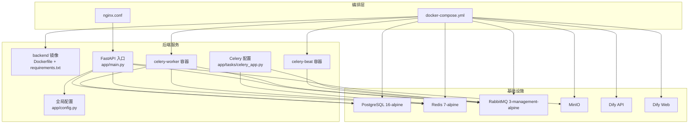
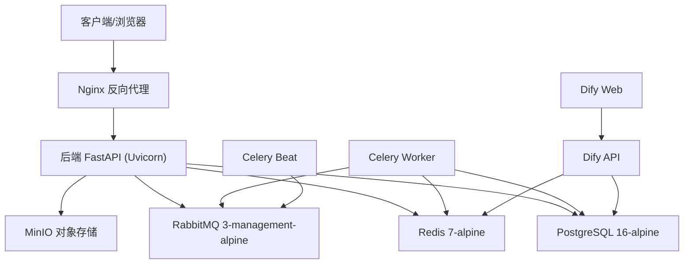
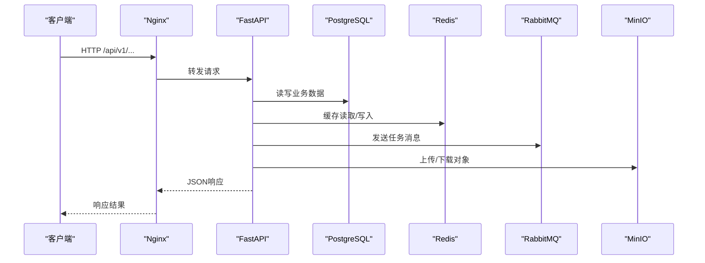
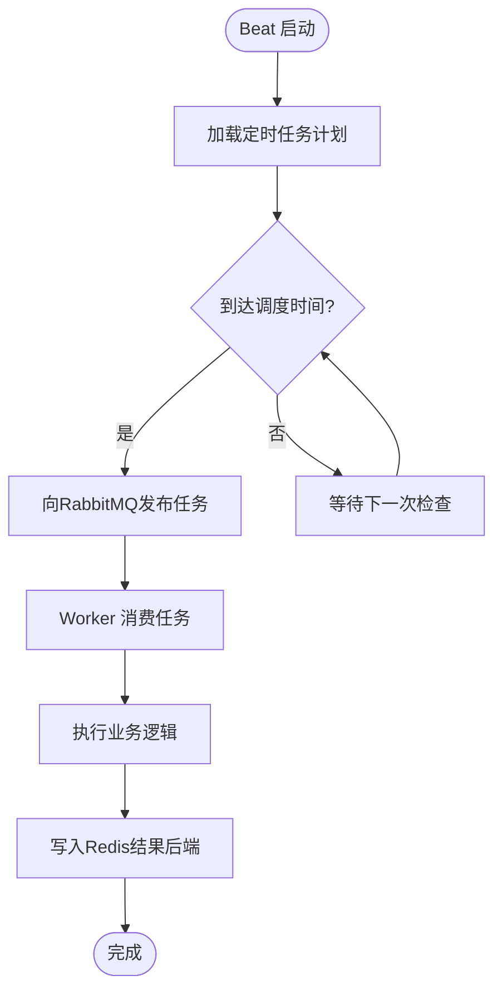
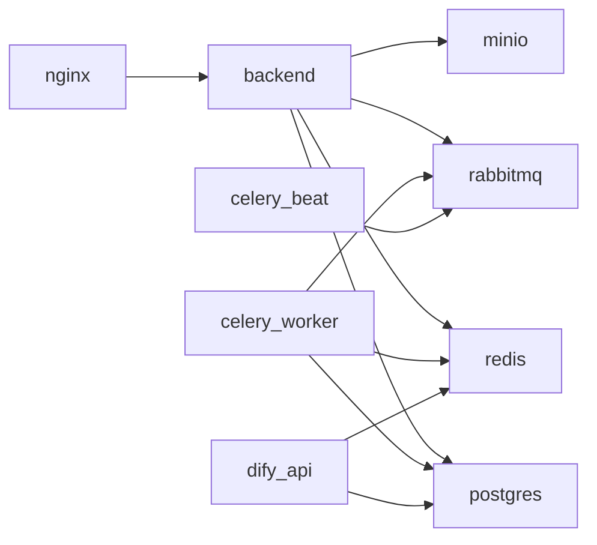

# Docker容器化配置

<cite>
**本文引用的文件**   
- [backend/Dockerfile](file://backend/Dockerfile)
- [docker-compose.yml](file://docker-compose.yml)
- [nginx.conf](file://nginx.conf)
- [backend/requirements.txt](file://backend/requirements.txt)
- [backend/app/config.py](file://backend/app/config.py)
- [backend/app/main.py](file://backend/app/main.py)
- [backend/app/tasks/celery_app.py](file://backend/app/tasks/celery_app.py)
</cite>

## 目录
1. [简介](#简介)
2. [项目结构](#项目结构)
3. [核心组件](#核心组件)
4. [架构总览](#架构总览)
5. [详细组件分析](#详细组件分析)
6. [依赖关系分析](#依赖关系分析)
7. [性能与镜像优化建议](#性能与镜像优化建议)
8. [故障排查指南](#故障排查指南)
9. [结论](#结论)
10. [附录：启动命令与环境变量](#附录启动命令与环境变量)

## 简介
本文件面向AIxingmu系统的容器化部署，聚焦后端Python应用的Docker镜像构建、多阶段构建优化策略、依赖管理与镜像分层；并详细说明基于Docker Compose的服务编排，包括PostgreSQL数据库、Redis缓存、RabbitMQ消息队列、MinIO对象存储的容器化部署。文档还涵盖服务间依赖关系、网络通信、数据卷持久化、环境变量管理、健康检查、日志收集等DevOps最佳实践，并提供完整的容器启动命令与常见问题排查指引。

## 项目结构
仓库根目录包含后端应用、前端资源、Nginx反向代理配置以及Docker编排文件。后端采用FastAPI+Uvicorn运行，Celery Worker与Beat用于异步任务与定时调度；基础设施通过Compose编排Postgres、Redis、RabbitMQ、MinIO与Dify RAG平台。

图表来源
- [docker-compose.yml:1-149](file://docker-compose.yml#L1-L149)
- [nginx.conf:1-39](file://nginx.conf#L1-L39)
- [backend/Dockerfile:1-13](file://backend/Dockerfile#L1-L13)
- [backend/requirements.txt:1-35](file://backend/requirements.txt#L1-L35)
- [backend/app/main.py:1-78](file://backend/app/main.py#L1-L78)
- [backend/app/tasks/celery_app.py:1-56](file://backend/app/tasks/celery_app.py#L1-L56)
- [backend/app/config.py:1-145](file://backend/app/config.py#L1-L145)

章节来源
- [docker-compose.yml:1-149](file://docker-compose.yml#L1-L149)
- [nginx.conf:1-39](file://nginx.conf#L1-L39)
- [backend/Dockerfile:1-13](file://backend/Dockerfile#L1-L13)
- [backend/requirements.txt:1-35](file://backend/requirements.txt#L1-L35)
- [backend/app/main.py:1-78](file://backend/app/main.py#L1-L78)
- [backend/app/tasks/celery_app.py:1-56](file://backend/app/tasks/celery_app.py#L1-L56)
- [backend/app/config.py:1-145](file://backend/app/config.py#L1-L145)

## 核心组件
- 后端镜像构建
  - 基础镜像：python:3.11-slim
  - 工作目录：/app
  - 依赖安装：使用requirements.txt并通过国内源加速
  - 暴露端口：8000
  - 启动命令：uvicorn app.main:app --host 0.0.0.0 --port 8000 --reload
- 服务编排（Compose）
  - PostgreSQL：数据持久化到pgdata卷，提供健康检查
  - Redis：数据持久化到redisdata卷
  - RabbitMQ：启用管理界面，默认用户guest/guest
  - MinIO：控制台端口9001，数据持久化到miniodata卷
  - Backend：挂载源码目录以便开发热重载，依赖Postgres/Redis/RabbitMQ
  - Celery Worker/Beat：连接RabbitMQ与Redis，执行异步与定时任务
  - Nginx：反向代理至后端，预留WebSocket与静态资源路径
  - Dify RAG平台：API与Web服务，共享Postgres与Redis
- 配置与环境变量
  - 应用通过pydantic-settings加载配置，支持.env与环境变量覆盖
  - 关键配置项包括数据库URL、Redis URL、Celery Broker/Backend、MinIO端点与凭据、CORS、JWT密钥等

章节来源
- [backend/Dockerfile:1-13](file://backend/Dockerfile#L1-L13)
- [docker-compose.yml:1-149](file://docker-compose.yml#L1-L149)
- [backend/app/config.py:1-145](file://backend/app/config.py#L1-L145)

## 架构总览
下图展示了容器化后的整体架构与数据流向。Nginx作为统一入口，将/api请求转发至后端FastAPI服务；后端通过asyncpg访问PostgreSQL，通过aioredis访问Redis，通过RabbitMQ进行任务分发，通过MinIO客户端进行对象存取。Celery Worker消费任务，Beat负责定时调度。Dify平台与后端共享同一Postgres与Redis实例。

图表来源
- [docker-compose.yml:1-149](file://docker-compose.yml#L1-L149)
- [nginx.conf:1-39](file://nginx.conf#L1-L39)
- [backend/app/main.py:1-78](file://backend/app/main.py#L1-L78)
- [backend/app/tasks/celery_app.py:1-56](file://backend/app/tasks/celery_app.py#L1-L56)
- [backend/app/config.py:1-145](file://backend/app/config.py#L1-L145)

## 详细组件分析

### 后端镜像构建与分层策略
- 当前构建流程
  - 复制requirements.txt并安装依赖，随后复制全部源码，最后设置启动命令
  - 优点：简单直观，适合本地开发
  - 缺点：每次代码变更都会导致依赖层失效，重建时间较长
- 推荐的多阶段构建优化思路
  - 第一阶段（构建器）：使用包含编译工具链的基础镜像，预编译C扩展或生成wheel包
  - 第二阶段（运行器）：仅拷贝已构建产物与最小运行时依赖，显著减小镜像体积
  - 依赖缓存优化：先复制requirements.txt并安装依赖，再复制源码，确保依赖层可被Docker缓存
  - 非root用户运行：提升安全性
  - 生产环境移除--reload参数，改用gunicorn/uwsgi或多进程模式
- 镜像分层策略要点
  - 将“依赖安装”与“源码复制”分步进行，最大化利用Docker层缓存
  - 使用.dockerignore排除不必要的文件（如测试、日志、临时文件）
  - 固定依赖版本，避免不可重复构建

章节来源
- [backend/Dockerfile:1-13](file://backend/Dockerfile#L1-L13)
- [backend/requirements.txt:1-35](file://backend/requirements.txt#L1-L35)

### 服务编排与健康检查
- 服务依赖关系
  - backend依赖postgres（健康检查）、redis、rabbitmq
  - celery-worker依赖backend、rabbitmq、redis
  - celery-beat依赖backend、rabbitmq
  - nginx依赖backend
  - dify-api依赖postgres（健康检查）、redis
- 健康检查
  - Postgres使用pg_isready进行就绪性检测
  - 后端提供/health接口返回状态
- 数据卷持久化
  - pgdata、redisdata、miniodata、dify-storage分别持久化对应服务数据
- 网络通信
  - 所有服务在Compose默认网络中通过服务名互相访问
  - Nginx将/api/代理至backend:8000，并预留/ws/用于WebSocket

图表来源
- [docker-compose.yml:1-149](file://docker-compose.yml#L1-L149)
- [nginx.conf:1-39](file://nginx.conf#L1-L39)
- [backend/app/main.py:1-78](file://backend/app/main.py#L1-L78)

章节来源
- [docker-compose.yml:1-149](file://docker-compose.yml#L1-L149)
- [nginx.conf:1-39](file://nginx.conf#L1-L39)
- [backend/app/main.py:1-78](file://backend/app/main.py#L1-L78)

### 异步任务与定时调度
- Celery Worker
  - 从RabbitMQ拉取任务，使用Redis作为结果后端
  - 需要数据库连接以执行业务逻辑
- Celery Beat
  - 根据crontab表达式触发定时任务（如每日创建拼团场次、结算、分红等）
- 任务定义位置
  - 调度配置位于tasks/celery_app.py，包含多个定时任务计划

图表来源
- [backend/app/tasks/celery_app.py:1-56](file://backend/app/tasks/celery_app.py#L1-L56)
- [docker-compose.yml:72-96](file://docker-compose.yml#L72-L96)

章节来源
- [backend/app/tasks/celery_app.py:1-56](file://backend/app/tasks/celery_app.py#L1-L56)
- [docker-compose.yml:72-96](file://docker-compose.yml#L72-L96)

### 配置与环境变量管理
- 配置加载机制
  - 使用pydantic-settings的BaseSettings，支持从.env与环境变量注入
  - 关键配置项包括数据库URL、Redis URL、Celery Broker/Backend、MinIO端点与凭据、CORS、JWT密钥、Dify集成等
- 环境变量覆盖
  - docker-compose.yml中为各服务显式设置DATABASE_URL、REDIS_URL、CELERY_*等
  - 生产环境建议通过外部密钥管理服务或环境变量文件集中管理敏感信息
- 安全建议
  - 修改默认密码与密钥（如Postgres、RabbitMQ、MinIO、SECRET_KEY）
  - 限制CORS来源，避免在生产环境使用通配符

章节来源
- [backend/app/config.py:1-145](file://backend/app/config.py#L1-L145)
- [docker-compose.yml:57-96](file://docker-compose.yml#L57-L96)

## 依赖关系分析
- 直接依赖
  - backend -> postgres, redis, rabbitmq, minio
  - celery-worker -> rabbitmq, redis, postgres
  - celery-beat -> rabbitmq
  - nginx -> backend
  - dify-api -> postgres, redis
- 间接依赖
  - 前端与Dify Web通过HTTP访问各自API
- 潜在风险
  - 单点故障：若未启用副本，任一服务宕机将影响整体可用性
  - 资源竞争：高并发场景下需评估数据库连接池与Redis内存上限
  - 网络延迟：跨主机部署时需关注网络拓扑与DNS解析

图表来源
- [docker-compose.yml:1-149](file://docker-compose.yml#L1-L149)

章节来源
- [docker-compose.yml:1-149](file://docker-compose.yml#L1-L149)

## 性能与镜像优化建议
- 镜像体积优化
  - 采用多阶段构建，分离构建期与运行期依赖
  - 使用更小的基础镜像（如python:3.11-slim-bookworm），并清理pip缓存
  - 使用.dockerignore排除无关文件
- 构建速度优化
  - 依赖层前置，充分利用Docker层缓存
  - 固定依赖版本，避免频繁重建
- 运行时性能
  - 生产环境禁用--reload，使用gunicorn/uwsgi多进程
  - 调整数据库连接池大小与超时参数
  - 合理设置Redis内存上限与淘汰策略
  - 对MinIO启用磁盘I/O优化与合适的桶策略
- 可观测性与运维
  - 统一日志格式，输出到stdout/stderr，由宿主机或日志系统收集
  - 增加健康检查与就绪探针，配合编排系统进行自动重启与流量切换
  - 监控关键指标：QPS、错误率、P99延迟、数据库连接数、Redis命中率、RabbitMQ队列长度

[本节为通用指导，不直接分析具体文件]

## 故障排查指南
- 后端无法启动
  - 检查环境变量是否覆盖正确（DATABASE_URL、REDIS_URL、CELERY_BROKER_URL、CELERY_RESULT_BACKEND）
  - 确认依赖服务已启动且网络可达（服务名解析正常）
  - 查看容器日志定位异常堆栈
- 数据库连接失败
  - 验证Postgres健康检查是否通过
  - 检查用户名、密码、数据库名是否与compose配置一致
  - 确认防火墙与安全组放行5432端口
- Redis连接失败
  - 检查Redis端口与认证配置（如有）
  - 确认结果后端Broker地址一致
- RabbitMQ连接失败
  - 检查默认用户与密码是否正确
  - 确认5672与15672端口开放
- MinIO访问失败
  - 检查MINIO_ROOT_USER/MINIO_ROOT_PASSWORD与后端配置一致
  - 确认9000/9001端口开放
- Nginx代理问题
  - 检查upstream指向backend:8000
  - 确认/api/路由转发规则生效
  - 如需WebSocket，检查升级头配置
- 健康检查
  - 调用/health接口确认后端存活
  - 使用docker inspect或docker logs查看容器状态

章节来源
- [docker-compose.yml:1-149](file://docker-compose.yml#L1-L149)
- [backend/app/main.py:75-78](file://backend/app/main.py#L75-L78)
- [nginx.conf:1-39](file://nginx.conf#L1-L39)

## 结论
本文档围绕AIxingmu后端的Docker容器化提供了从镜像构建、依赖管理、镜像分层到Compose服务编排的全链路说明。通过合理的依赖与服务编排、健康检查与数据持久化，结合日志与监控的最佳实践，可在开发与生产环境中获得稳定高效的部署体验。建议在后续迭代中引入多阶段构建、密钥管理与可观测性增强，进一步提升安全性与可维护性。

[本节为总结性内容，不直接分析具体文件]

## 附录：启动命令与环境变量
- 常用命令
  - 构建并启动所有服务：docker compose up --build -d
  - 查看服务状态：docker compose ps
  - 查看后端日志：docker compose logs -f backend
  - 查看Celery Worker日志：docker compose logs -f celery-worker
  - 查看Celery Beat日志：docker compose logs -f celery-beat
  - 进入后端容器：docker compose exec backend bash
  - 停止并清理：docker compose down -v
- 关键环境变量（示例）
  - DATABASE_URL: 数据库连接字符串（含用户名、密码、主机、端口、库名）
  - REDIS_URL: Redis连接字符串
  - CELERY_BROKER_URL: RabbitMQ连接字符串
  - CELERY_RESULT_BACKEND: Redis结果后端连接字符串
  - MINIO_ENDPOINT、MINIO_ACCESS_KEY、MINIO_SECRET_KEY、MINIO_BUCKET: MinIO客户端配置
  - SECRET_KEY、ALGORITHM、ACCESS_TOKEN_EXPIRE_MINUTES: JWT相关配置
  - CORS_ORIGINS: 允许的跨域来源
  - DIFY_API_URL、DIFY_API_KEY、DIFY_DEFAULT_MODEL: Dify集成配置

章节来源
- [docker-compose.yml:57-96](file://docker-compose.yml#L57-L96)
- [backend/app/config.py:1-145](file://backend/app/config.py#L1-L145)