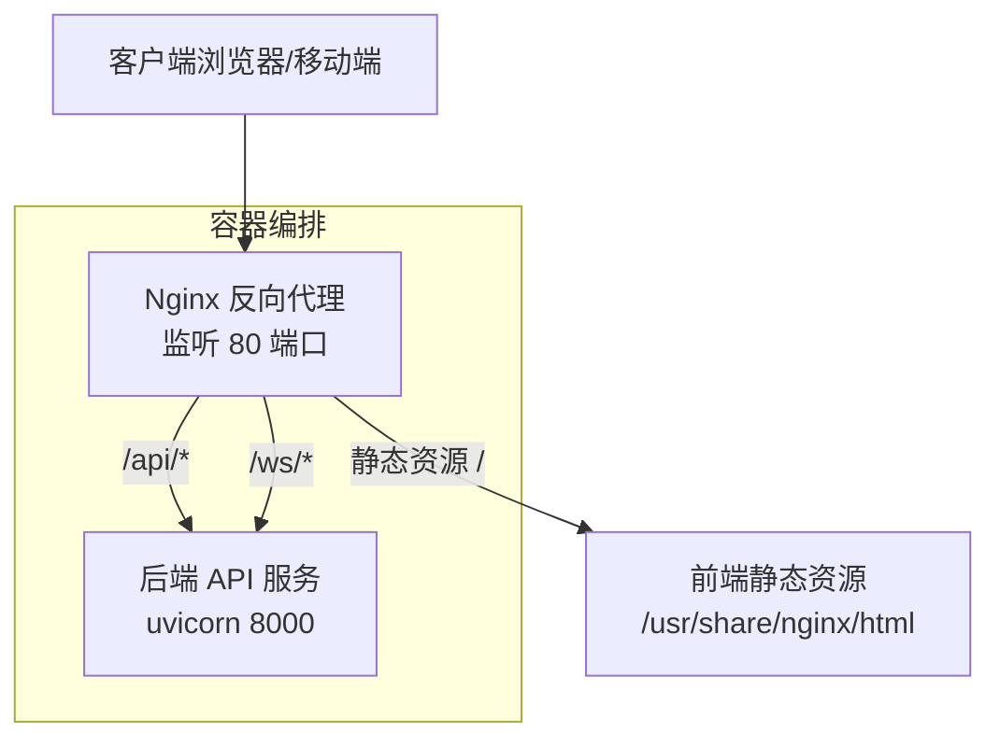
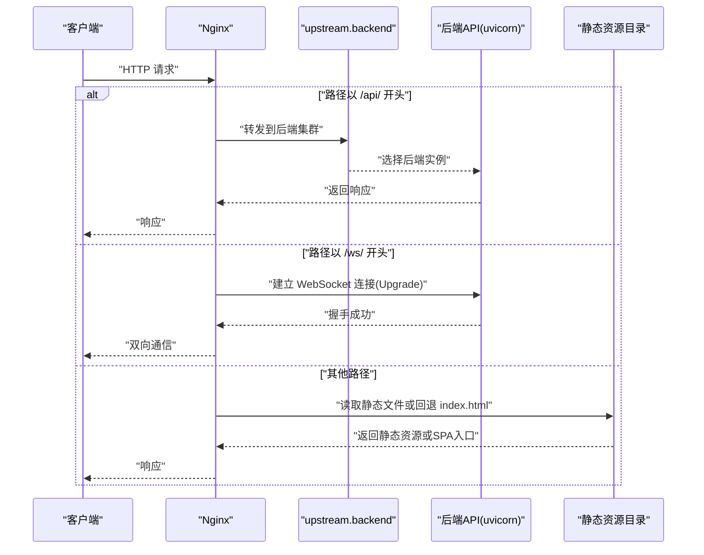
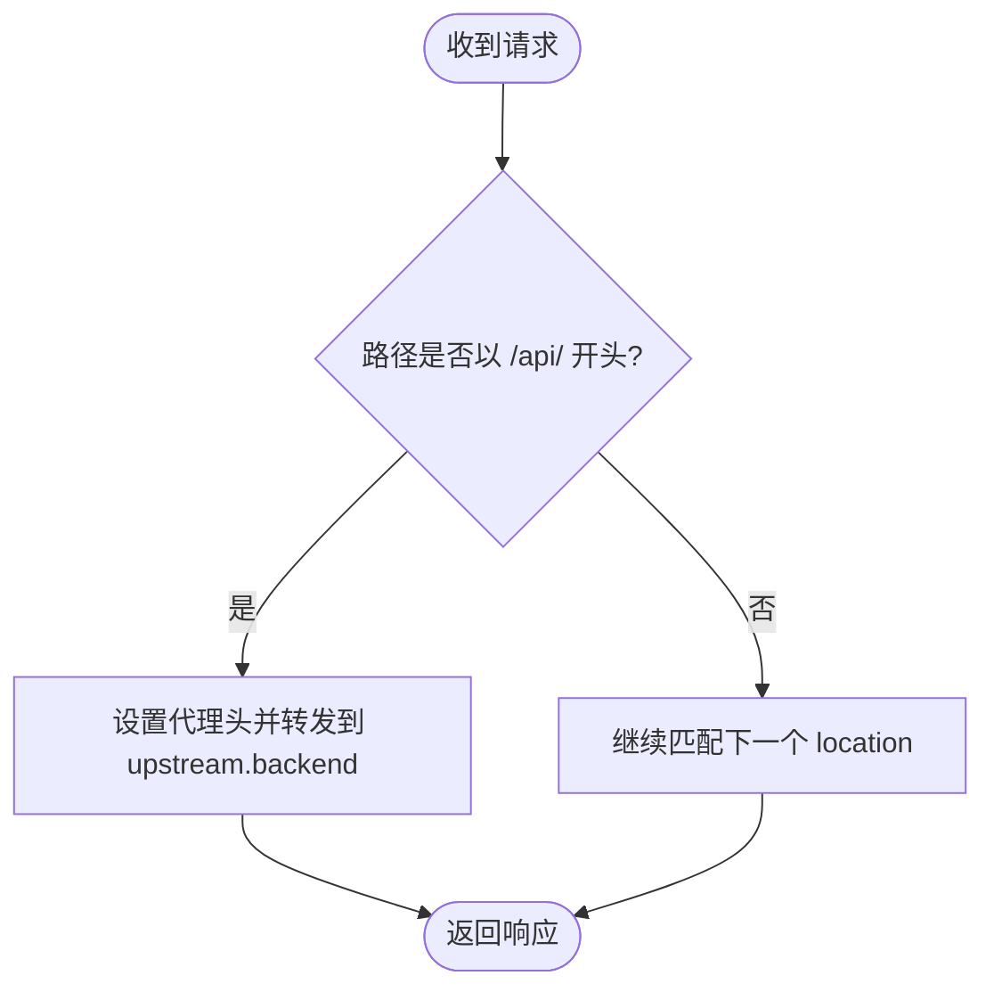
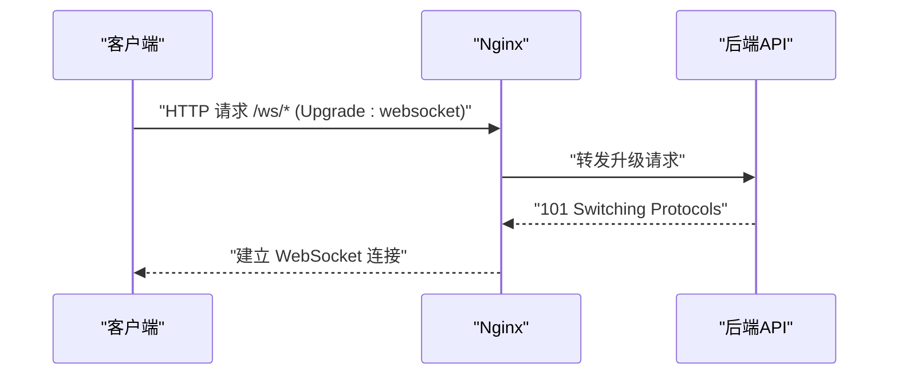
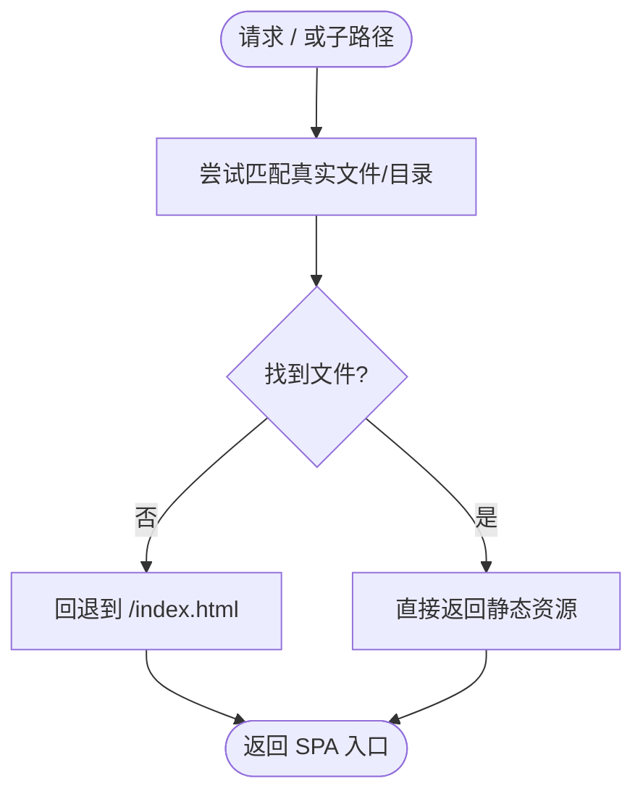
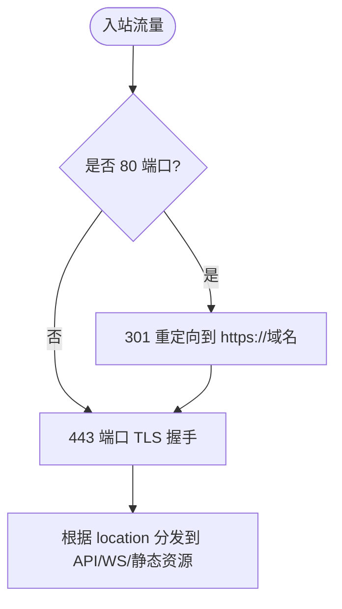
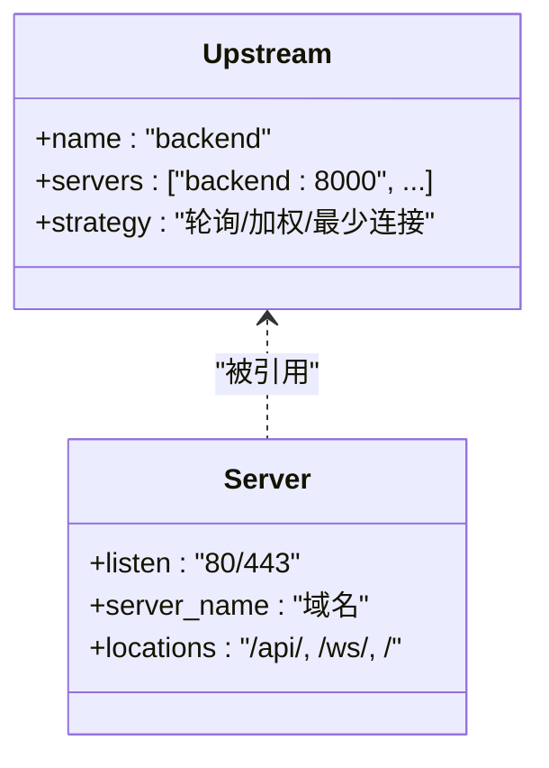
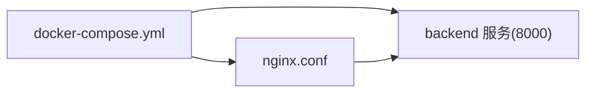

# Nginx反向代理配置

<cite>
**本文引用的文件**   
- [nginx.conf](file://nginx.conf)
- [docker-compose.yml](file://docker-compose.yml)
- [Dockerfile](file://backend/Dockerfile)
</cite>

## 目录
1. [简介](#简介)
2. [项目结构](#项目结构)
3. [核心组件](#核心组件)
4. [架构总览](#架构总览)
5. [详细组件分析](#详细组件分析)
6. [依赖关系分析](#依赖关系分析)
7. [性能考虑](#性能考虑)
8. [故障排查指南](#故障排查指南)
9. [结论](#结论)
10. [附录](#附录)

## 简介
本文件为 AIxingmu 系统的 Nginx 反向代理配置文档，围绕现有仓库中的 nginx.conf 与 docker-compose.yml 进行说明，并给出在生产环境可用的增强建议。内容涵盖：
- API 路由转发、WebSocket 代理、静态资源服务
- SSL 证书配置（含部署步骤）
- 负载均衡策略、请求限流、缓存配置
- 前端应用的路由重写、跨域处理、安全头设置
- 性能优化参数调优、Gzip 压缩、HTTP/2 支持
- 完整部署指南与监控方案

## 项目结构
当前仓库中与 Nginx 相关的核心文件如下：
- nginx.conf：Nginx 主配置文件，定义了事件模型、上游后端、监听端口、API 代理、WebSocket 代理与静态资源路径
- docker-compose.yml：编排了 Nginx、后端 API、数据库、缓存、消息队列等容器，并将 nginx.conf 挂载到容器内
- backend/Dockerfile：后端服务镜像构建与启动命令，暴露 8000 端口供 Nginx 反向代理

图示来源
- [nginx.conf:1-38](file://nginx.conf#L1-L38)
- [docker-compose.yml:97-106](file://docker-compose.yml#L97-L106)
- [Dockerfile:10-12](file://backend/Dockerfile#L10-L12)

章节来源
- [nginx.conf:1-38](file://nginx.conf#L1-L38)
- [docker-compose.yml:97-106](file://docker-compose.yml#L97-L106)
- [Dockerfile:10-12](file://backend/Dockerfile#L10-L12)

## 核心组件
- 事件与进程模型
  - events.worker_connections：控制每个 worker 的最大并发连接数
- HTTP 层
  - upstream.backend：定义后端 API 集群（当前单节点）
  - server：监听 80 端口，server_name 为 localhost
- 路由与代理
  - location /api/：将 API 请求转发至后端
  - location /ws/：预留 WebSocket 代理，启用升级头
  - location /：静态资源根目录与 SPA 路由回退
- 容器编排
  - docker-compose 中通过 volumes 将 nginx.conf 映射到容器内只读挂载
  - 后端服务使用 uvicorn 启动，暴露 8000 端口

章节来源
- [nginx.conf:1-38](file://nginx.conf#L1-L38)
- [docker-compose.yml:97-106](file://docker-compose.yml#L97-L106)
- [Dockerfile:10-12](file://backend/Dockerfile#L10-L12)

## 架构总览
下图展示了从客户端到后端的请求链路以及各组件职责。

图示来源
- [nginx.conf:14-36](file://nginx.conf#L14-L36)
- [docker-compose.yml:97-106](file://docker-compose.yml#L97-L106)
- [Dockerfile:10-12](file://backend/Dockerfile#L10-L12)

## 详细组件分析

### API 路由转发
- 匹配规则：location /api/ 前缀匹配
- 转发目标：http://backend（即 upstream.backend）
- 关键头部：
  - Host、X-Real-IP、X-Forwarded-For、X-Forwarded-Proto 用于透传客户端信息
- 适用场景：所有 REST API 统一经 Nginx 进入后端

图示来源
- [nginx.conf:14-21](file://nginx.conf#L14-L21)

章节来源
- [nginx.conf:14-21](file://nginx.conf#L14-L21)

### WebSocket 代理（预留）
- 匹配规则：location /ws/
- 协议升级：设置 proxy_http_version 1.1 与 Upgrade/Connection 头
- 用途：为未来实时功能提供通道

图示来源
- [nginx.conf:23-29](file://nginx.conf#L23-L29)

章节来源
- [nginx.conf:23-29](file://nginx.conf#L23-L29)

### 静态资源与前端路由重写
- 静态根目录：root /usr/share/nginx/html
- 默认首页：index index.html
- SPA 路由回退：try_files $uri $uri/ /index.html
- 注意：当前未挂载前端构建产物到该目录，需按部署指南准备

图示来源
- [nginx.conf:31-36](file://nginx.conf#L31-L36)

章节来源
- [nginx.conf:31-36](file://nginx.conf#L31-L36)

### SSL 证书配置（生产必备）
- 新增 HTTPS 服务器块，监听 443 端口
- 指定证书与私钥路径
- 强制 HTTP 重定向到 HTTPS
- 推荐启用 HSTS、OCSP Stapling、安全套件与会话复用

部署要点
- 在主机或容器中放置证书与私钥文件，并在 server 块中引用
- 开启 ssl_protocols、ssl_ciphers、ssl_prefer_server_ciphers
- 可选：ssl_session_cache、ssl_session_timeout、ssl_stapling on

章节来源
- [nginx.conf:10-12](file://nginx.conf#L10-L12)

### 负载均衡策略
- 当前 upstream.backend 仅包含一个后端实例
- 扩展建议：
  - 添加多个 server 条目实现轮询
  - 可结合健康检查与权重分配
  - 针对长连接（如 WS）合理设置 keepalive

图示来源
- [nginx.conf:5-8](file://nginx.conf#L5-L8)

章节来源
- [nginx.conf:5-8](file://nginx.conf#L5-L8)

### 请求限流
- 建议在 http 或 server 级别定义 limit_req_zone
- 在对应 location 中使用 limit_req 限制速率
- 适用于登录、注册、支付等敏感接口

章节来源
- [nginx.conf:5-8](file://nginx.conf#L5-L8)

### 缓存配置
- 静态资源缓存：对图片、JS、CSS 设置 long-lived Cache-Control
- 动态 API 缓存：谨慎使用，通常基于 ETag/Last-Modified 或 Redis 缓存
- 建议：
  - 为静态资源开启 expires 或 add_header Cache-Control
  - 对频繁访问的热点数据在后端或 CDN 层缓存

章节来源
- [nginx.conf:31-36](file://nginx.conf#L31-L36)

### 前端应用的路由重写与跨域处理
- 路由重写：已配置 try_files 回退到 index.html，适合 SPA
- 跨域处理：
  - 若前后端同源部署，无需额外 CORS
  - 若跨域，可在 Nginx 中添加 Access-Control-Allow-* 头，或在后端统一处理

章节来源
- [nginx.conf:31-36](file://nginx.conf#L31-L36)

### 安全头设置
- 建议添加 X-Frame-Options、X-Content-Type-Options、X-XSS-Protection、Referrer-Policy、Permissions-Policy 等
- 配合 HTTPS 启用 HSTS

章节来源
- [nginx.conf:10-12](file://nginx.conf#L10-L12)

### 性能优化参数调优
- 全局优化：
  - worker_processes auto
  - worker_connections 提升并发上限
  - multi_accept on
  - sendfile on, tcp_nopush on, tcp_nodelay on
- Gzip 压缩：
  - gzip on
  - 设置压缩级别与 MIME 类型
- HTTP/2 支持：
  - 在 443 server 块启用 http2 on
  - 确保使用现代 TLS 套件与证书

章节来源
- [nginx.conf:1-3](file://nginx.conf#L1-L3)
- [nginx.conf:5-8](file://nginx.conf#L5-L8)

### 监控与日志
- 访问日志与错误日志：
  - access_log 与 error_log 路径与级别
- 指标采集：
  - 启用 stub_status 或第三方模块导出 Prometheus 指标
- 告警：
  - 基于日志关键字或状态码阈值触发告警

章节来源
- [nginx.conf:10-12](file://nginx.conf#L10-L12)

## 依赖关系分析
- Nginx 依赖后端 API 服务（upstream.backend），并通过 Docker 网络解析 host 名
- docker-compose 将 nginx.conf 以只读方式挂载到容器
- 后端服务通过 uvicorn 启动，监听 8000 端口

图示来源
- [docker-compose.yml:97-106](file://docker-compose.yml#L97-L106)
- [nginx.conf:5-8](file://nginx.conf#L5-L8)
- [Dockerfile:10-12](file://backend/Dockerfile#L10-L12)

章节来源
- [docker-compose.yml:97-106](file://docker-compose.yml#L97-L106)
- [nginx.conf:5-8](file://nginx.conf#L5-L8)
- [Dockerfile:10-12](file://backend/Dockerfile#L10-L12)

## 性能考虑
- 连接与线程
  - 调整 worker_processes 与 worker_connections 以适应 CPU 核数与内存
- 传输优化
  - sendfile、tcp_nopush、tcp_nodelay
- 压缩与带宽
  - 启用 Gzip，选择合适的压缩级别与最小长度
- 缓存
  - 静态资源强缓存；动态接口谨慎缓存
- 连接复用
  - upstream keepalive 减少握手开销
- HTTP/2
  - 在 HTTPS 上启用，提升多路复用能力

[本节为通用指导，不直接分析具体文件]

## 故障排查指南
- 无法访问 API
  - 检查 upstream.backend 是否可达，确认后端服务已启动且监听 8000
  - 查看 Nginx 错误日志定位 502/504 原因
- WebSocket 连接失败
  - 确认 Upgrade 与 Connection 头是否正确传递
  - 检查后端是否支持 /ws/ 路径
- 静态资源 404
  - 确认 /usr/share/nginx/html 下存在构建产物
  - 检查 try_files 回退逻辑是否生效
- 跨域问题
  - 若跨域，检查后端或 Nginx 的 CORS 头配置
- 证书错误
  - 校验证书与私钥路径、权限与格式
  - 检查浏览器提示的具体错误码

章节来源
- [nginx.conf:14-36](file://nginx.conf#L14-L36)
- [docker-compose.yml:97-106](file://docker-compose.yml#L97-L106)

## 结论
当前 nginx.conf 提供了基础的 API 转发、WebSocket 预留与静态资源服务。生产环境应补充 HTTPS、限流、缓存、安全头、性能优化与监控等能力，并结合 docker-compose 完成一键部署与运维。

[本节为总结性内容，不直接分析具体文件]

## 附录

### 部署清单
- 前置条件
  - 安装 Docker 与 docker-compose
  - 准备前端构建产物（dist）
- 步骤
  - 将前端构建产物复制到宿主机目录，并在 docker-compose 中挂载到 /usr/share/nginx/html
  - 如需 HTTPS，准备证书与私钥，并在 Nginx 配置中引用
  - 启动服务：docker-compose up -d
  - 验证：访问 http(s)://域名/api/health 与前端页面

章节来源
- [docker-compose.yml:97-106](file://docker-compose.yml#L97-L106)
- [nginx.conf:31-36](file://nginx.conf#L31-L36)

### 常用优化项速查
- 全局
  - worker_processes auto
  - worker_connections 提升并发
  - sendfile on; tcp_nopush on; tcp_nodelay on
- Gzip
  - gzip on; gzip_types 文本/脚本/样式等
- HTTP/2
  - listen 443 ssl http2;
- 安全头
  - X-Frame-Options、X-Content-Type-Options、HSTS 等
- 限流
  - limit_req_zone 与 limit_req
- 缓存
  - expires 与 Cache-Control

[本节为通用参考，不直接分析具体文件]