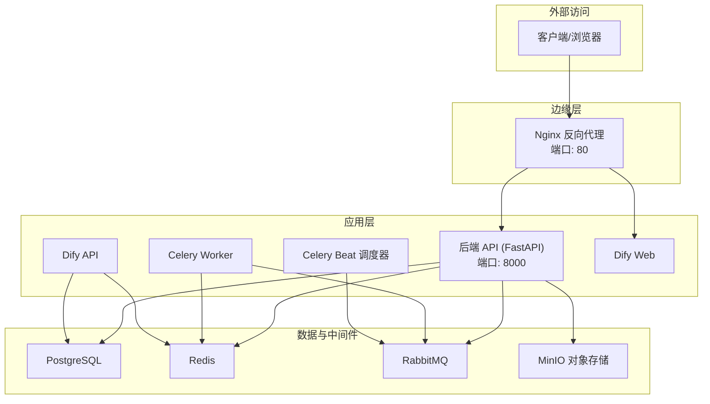
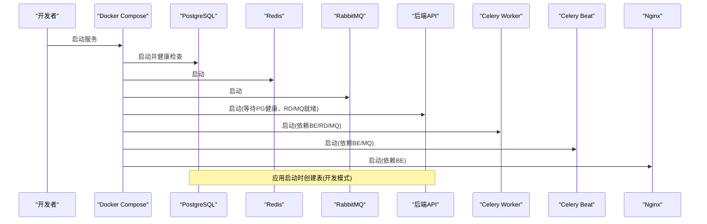
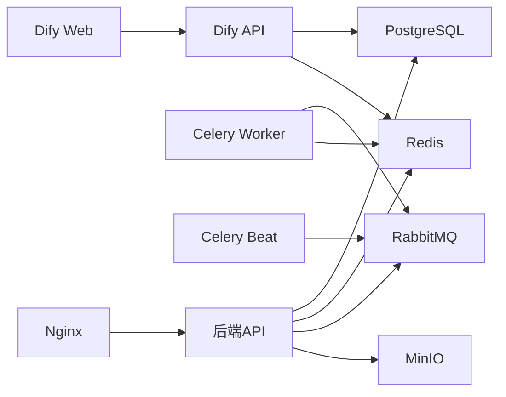

# 容器化部署策略

<cite>
**本文引用的文件**   
- [docker-compose.yml](file://docker-compose.yml)
- [backend/Dockerfile](file://backend/Dockerfile)
- [nginx.conf](file://nginx.conf)
- [backend/requirements.txt](file://backend/requirements.txt)
- [backend/app/main.py](file://backend/app/main.py)
- [backend/app/config.py](file://backend/app/config.py)
- [backend/app/database.py](file://backend/app/database.py)
- [backend/app/tasks/celery_app.py](file://backend/app/tasks/celery_app.py)
- [frontend/web-admin/package.json](file://frontend/web-admin/package.json)
</cite>

## 目录
1. [简介](#简介)
2. [项目结构](#项目结构)
3. [核心组件](#核心组件)
4. [架构总览](#架构总览)
5. [详细组件分析](#详细组件分析)
6. [依赖关系分析](#依赖关系分析)
7. [性能与容量规划](#性能与容量规划)
8. [故障排查指南](#故障排查指南)
9. [结论](#结论)
10. [附录](#附录)

## 简介
本文件面向AIxingmu系统的容器化部署，提供从镜像构建优化、Docker Compose编排到Kubernetes集群部署的完整策略。内容涵盖：
- Docker镜像分层与多阶段构建建议
- Compose服务依赖、网络与数据卷挂载
- Kubernetes Pod资源、Service暴露、HPA弹性伸缩、持久化存储
- 环境隔离、配置注入与密钥管理最佳实践
- CI/CD流水线集成、自动化测试、蓝绿与金丝雀发布
- 运维操作指南与常见问题定位

## 项目结构
仓库采用前后端分离与微服务化思路组织：
- 后端：FastAPI + SQLAlchemy异步 + Celery任务 + Redis/RabbitMQ + PostgreSQL + MinIO对象存储
- 前端：Web管理后台（Vite+Vue），移动端（uni-app）
- 编排：Docker Compose一键拉起全部依赖与服务
- 反向代理：Nginx统一入口，转发API与WebSocket

图表来源
- [docker-compose.yml:1-149](file://docker-compose.yml#L1-L149)
- [nginx.conf:1-39](file://nginx.conf#L1-L39)

章节来源
- [docker-compose.yml:1-149](file://docker-compose.yml#L1-L149)
- [nginx.conf:1-39](file://nginx.conf#L1-L39)

## 核心组件
- 后端API服务：基于FastAPI，提供REST接口与文档，注册路由与中间件，暴露健康检查端点
- 数据库连接：使用SQLAlchemy异步引擎与会话工厂，支持连接池参数
- 任务系统：Celery Worker执行异步任务，Beat负责定时任务调度
- 配置中心：通过pydantic-settings集中读取环境变量，覆盖默认值
- 反向代理：Nginx将/api/与/ws/转发至后端，预留静态资源路径
- 依赖服务：PostgreSQL、Redis、RabbitMQ、MinIO、Dify RAG平台

章节来源
- [backend/app/main.py:1-76](file://backend/app/main.py#L1-L76)
- [backend/app/database.py:1-40](file://backend/app/database.py#L1-L40)
- [backend/app/tasks/celery_app.py:1-56](file://backend/app/tasks/celery_app.py#L1-L56)
- [backend/app/config.py:1-145](file://backend/app/config.py#L1-L145)
- [nginx.conf:1-39](file://nginx.conf#L1-L39)

## 架构总览
下图展示Compose环境下各服务的启动顺序、依赖与健康检查关系，以及对外暴露的端口。

图表来源
- [docker-compose.yml:1-149]

章节来源
- [docker-compose.yml:1-149]

## 详细组件分析

### 镜像构建与分层优化
现状与建议：
- 当前后端镜像基于python:3.11-slim，直接COPY源码并安装依赖，适合开发；生产建议采用多阶段构建，将构建期依赖与运行期镜像分离，减小镜像体积并提升安全性
- 建议的分层策略：
  - 基础镜像：仅包含运行时所需库
  - 依赖层：先复制requirements.txt并安装依赖，利用Docker缓存加速重复构建
  - 应用层：最后复制应用代码，避免每次代码变更导致依赖层失效
  - 安全加固：以非root用户运行，最小权限原则
- 前端静态资源构建产物应单独打包并通过Nginx或对象存储分发，不放入后端镜像

章节来源
- [backend/Dockerfile:1-13](file://backend/Dockerfile#L1-L13)
- [backend/requirements.txt:1-35](file://backend/requirements.txt#L1-L35)

### Docker Compose编排
- 服务清单：PostgreSQL、Redis、RabbitMQ、MinIO、后端API、Celery Worker、Celery Beat、Nginx、Dify API/Web
- 依赖管理：
  - 使用depends_on与healthcheck确保启动顺序与可用性
  - 后端依赖PG健康、RD/MQ就绪
  - Worker/Beat依赖后端与消息队列
- 网络配置：
  - 同一Compose网络内服务通过服务名互通（如postgres、redis、rabbitmq）
  - 对外暴露端口：80(Nginx)、5432(Postgres)、6379(Redis)、5672/15672(RabbitMQ)、9000/9001(MinIO)、8000(后端)、3800(Dify Web)
- 数据卷挂载：
  - pgdata、redisdata、miniodata、dify-storage用于持久化
  - 开发模式下将后端源码目录挂载至容器便于热重载

章节来源
- [docker-compose.yml:1-149]

### Nginx反向代理
- 将/api/请求转发至后端上游backend:8000，设置必要代理头
- 预留/ws/路径用于WebSocket升级
- 预留静态资源根路径，便于后续接入前端构建产物

章节来源
- [nginx.conf:1-39]

### 后端应用与配置
- 应用入口：
  - 注册CORS、全局异常处理、请求日志中间件
  - 按模块注册路由，提供/api/docs与/api/redoc文档
  - 暴露/health健康检查端点
- 生命周期：
  - 启动时创建数据库表（开发模式），关闭时释放引擎
- 配置加载：
  - 通过pydantic-settings集中读取环境变量，支持.env文件
  - 关键配置项包括数据库URL、Redis/Celery连接、JWT密钥、CORS、MinIO、Dify等

章节来源
- [backend/app/main.py:1-76](file://backend/app/main.py#L1-L76)
- [backend/app/config.py:1-145](file://backend/app/config.py#L1-L145)

### 数据库连接与会话
- 使用异步引擎创建连接池，支持pool_size与max_overflow
- 提供FastAPI依赖注入的会话获取函数，自动提交/回滚与关闭

章节来源
- [backend/app/database.py:1-40](file://backend/app/database.py#L1-L40)

### 任务系统与定时调度
- Celery应用配置：
  - 指定broker与result backend
  - 时区设置为Asia/Shanghai
- 定时任务：
  - 每日创建拼团场次、每小时结算已满场次、每日检查过期场次
  - 每周一贡献值分红、每日贡献值递减核算、每月门店排名与分红

章节来源
- [backend/app/tasks/celery_app.py:1-56](file://backend/app/tasks/celery_app.py#L1-L56)

### 前端构建产物与分发
- 管理后台基于Vite+Vue，构建脚本为vue-tsc && vite build，输出dist目录
- 建议将构建产物交由CI生成并推送到对象存储或Nginx静态目录，由Nginx统一分发

章节来源
- [frontend/web-admin/package.json:1-28](file://frontend/web-admin/package.json#L1-L28)

## 依赖关系分析

图表来源
- [docker-compose.yml:1-149]

章节来源
- [docker-compose.yml:1-149]

## 性能与容量规划
- 连接池与并发：
  - 根据CPU核数与内存调整DATABASE_POOL_SIZE与max_overflow
  - Uvicorn工作进程数建议为CPU核数的2倍+1（生产）
- 任务吞吐：
  - Worker实例数量依据任务类型与耗时水平扩展
  - RabbitMQ与Redis需独立部署并监控队列积压与内存占用
- 存储与I/O：
  - MinIO建议使用高性能磁盘或云盘，合理设置桶与分片策略
  - PostgreSQL启用pgvector索引（ivfflat/hnsw）并根据向量维度调优
- 缓存策略：
  - Redis作为结果后端与热点缓存，注意键空间与淘汰策略
- 反向代理：
  - Nginx worker_connections与keepalive参数根据并发量调整

[本节为通用指导，无需特定文件引用]

## 故障排查指南
- 启动失败
  - 检查服务健康状态与端口占用
  - 确认环境变量与网络连通性（服务名解析）
- 数据库连接错误
  - 校验DATABASE_URL、用户名密码与权限
  - 查看PostgreSQL日志与连接数限制
- 任务未执行
  - 确认Worker与Beat已启动且订阅正确队列
  - 检查Broker与Backend可达性与认证
- 静态资源404
  - 确认Nginx静态目录挂载与try_files规则
- 鉴权与跨域
  - 核对SECRET_KEY、CORS_ORIGINS与前端域名

章节来源
- [backend/app/main.py:1-76](file://backend/app/main.py#L1-L76)
- [backend/app/config.py:1-145](file://backend/app/config.py#L1-L145)
- [docker-compose.yml:1-149](file://docker-compose.yml#L1-L149)

## 结论
本策略在现有Compose基础上提供了可落地的镜像优化、编排规范与Kubernetes迁移路径，结合环境隔离、密钥管理与弹性伸缩，满足生产级高可用与可观测性要求。建议在CI中固化构建与测试流程，逐步引入蓝绿与金丝雀发布，实现平滑演进。

[本节为总结，无需特定文件引用]

## 附录

### 一、Docker镜像构建优化与多阶段构建建议
- 推荐的多阶段构建目标：
  - 构建阶段：安装Python与编译依赖，执行前端构建（如有）
  - 运行阶段：仅拷贝运行时依赖与应用代码，最小化镜像
- 分层优化要点：
  - 优先复制requirements.txt并安装依赖，最大化利用缓存
  - 使用--no-cache-dir减少镜像体积
  - 以非root用户运行，禁用不必要的系统包
- 参考路径
  - 后端镜像定义：[backend/Dockerfile:1-13](file://backend/Dockerfile#L1-L13)
  - 依赖清单：[backend/requirements.txt:1-35](file://backend/requirements.txt#L1-35)

章节来源
- [backend/Dockerfile:1-13](file://backend/Dockerfile#L1-L13)
- [backend/requirements.txt:1-35](file://backend/requirements.txt#L1-35)

### 二、Docker Compose编排配置详解
- 服务依赖与健康检查
  - 使用depends_on与condition控制启动顺序
  - 对数据库类服务增加healthcheck，避免竞态
- 网络与端口
  - 内部服务通过服务名通信，对外仅暴露必要端口
- 数据卷
  - 所有有状态服务均使用命名卷持久化
- 参考路径
  - 编排定义：[docker-compose.yml:1-149](file://docker-compose.yml#L1-149)

章节来源
- [docker-compose.yml:1-149](file://docker-compose.yml#L1-149)

### 三、Kubernetes集群部署
- 资源对象
  - Deployment：后端API、Worker、Beat、Nginx、Dify API/Web
  - Service：ClusterIP暴露后端与Dify API，NodePort/Ingress暴露对外入口
  - ConfigMap：应用配置与环境变量
  - Secret：敏感信息（数据库密码、JWT密钥、MinIO凭据、Dify密钥）
  - PersistentVolumeClaim：数据库与对象存储持久化
  - HorizontalPodAutoscaler：基于CPU/内存或自定义指标进行弹性伸缩
- 示例映射（概念性）
  - 后端API → Deployment + Service + HPA
  - Celery Worker → Deployment（副本数可调）
  - Celery Beat → Deployment（单副本）
  - Nginx → Deployment + Ingress
  - PostgreSQL/Redis/RabbitMQ/MinIO → StatefulSet/PVC或托管服务
- 配置注入与密钥管理
  - 使用ConfigMap注入非敏感配置，Secret注入敏感配置
  - 通过环境变量或挂载文件方式注入到容器
- 滚动更新与回滚
  - 使用RollingUpdate策略，配合探针与 readiness/liveness
- 参考路径
  - 应用配置键名与默认值：[backend/app/config.py:1-145](file://backend/app/config.py#L1-145)
  - 健康检查端点：[backend/app/main.py:73-76](file://backend/app/main.py#L73-76)

[本节为概念性说明，无需特定文件引用]

### 四、环境隔离、配置注入与密钥管理
- 环境隔离
  - 开发/测试/预发/生产使用不同命名空间与配置集
  - 通过环境变量区分数据库地址、缓存地址、第三方服务URL
- 配置注入
  - 使用ConfigMap管理非敏感配置，Secret管理敏感配置
  - 应用侧通过pydantic-settings读取环境变量
- 密钥管理
  - 使用Kubernetes Secret或外部密钥管理服务（如Vault）
  - 定期轮换密钥，最小权限原则
- 参考路径
  - 配置模型与默认值：[backend/app/config.py:1-145](file://backend/app/config.py#L1-145)

章节来源
- [backend/app/config.py:1-145](file://backend/app/config.py#L1-145)

### 五、CI/CD流水线集成
- 构建阶段
  - 拉取代码、缓存依赖、构建前端静态资源
  - 构建后端镜像（多阶段）、推送至镜像仓库
- 测试阶段
  - 单元测试、集成测试、API契约测试
  - 使用临时Compose环境验证依赖连通性
- 部署阶段
  - 灰度/蓝绿：通过Ingress权重切换或双版本Deployment并行
  - 金丝雀：小流量切到新版本，观察指标后全量
- 参考路径
  - 前端构建脚本：[frontend/web-admin/package.json:1-28](file://frontend/web-admin/package.json#L1-28)

章节来源
- [frontend/web-admin/package.json:1-28](file://frontend/web-admin/package.json#L1-28)

### 六、弹性伸缩、资源配额与存储持久化
- 弹性伸缩
  - HPA基于CPU/内存或自定义指标（如队列长度）自动扩缩容
  - 针对Worker与API分别设置合理的上下限
- 资源配额
  - 为Namespace设置ResourceQuota与LimitRange，防止资源争用
- 存储持久化
  - 数据库与对象存储使用PVC或云托管服务
  - 定期备份与恢复演练
- 参考路径
  - 数据卷定义：[docker-compose.yml:144-149](file://docker-compose.yml#L144-149)

章节来源
- [docker-compose.yml:144-149](file://docker-compose.yml#L144-L149)

### 七、部署拓扑图与运维操作指南
- 部署拓扑
  - 入口：Nginx/Ingress
  - 应用：后端API、Worker、Beat、Dify API/Web
  - 数据：PostgreSQL、Redis、RabbitMQ、MinIO
- 常用运维命令（概念性）
  - 本地启动：docker compose up -d
  - 查看日志：docker compose logs -f <service>
  - 重启服务：docker compose restart <service>
  - 进入容器：docker exec -it <container> sh
- 健康检查
  - /api/health返回服务状态
  - 数据库、缓存、消息队列健康检查已在编排中定义
- 参考路径
  - 健康检查端点：[backend/app/main.py:73-76](file://backend/app/main.py#L73-76)
  - 健康检查定义：[docker-compose.yml:15-19](file://docker-compose.yml#L15-19)

章节来源
- [backend/app/main.py:73-76](file://backend/app/main.py#L73-L76)
- [docker-compose.yml:15-19](file://docker-compose.yml#L15-L19)