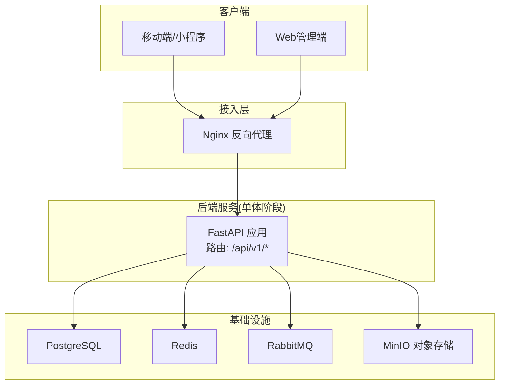
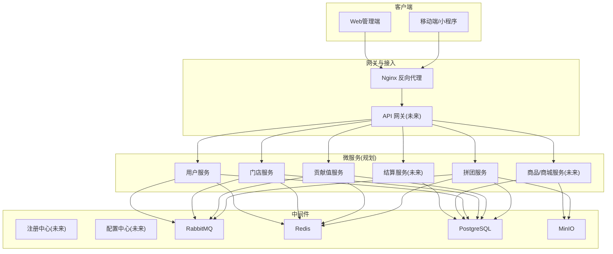
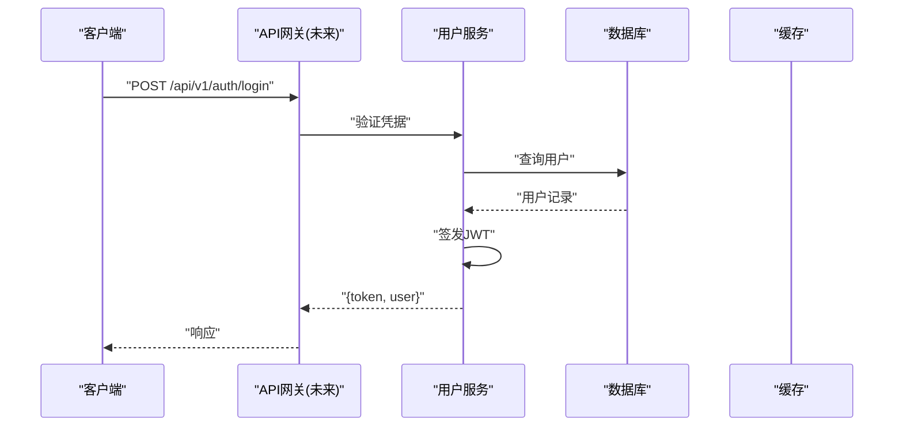
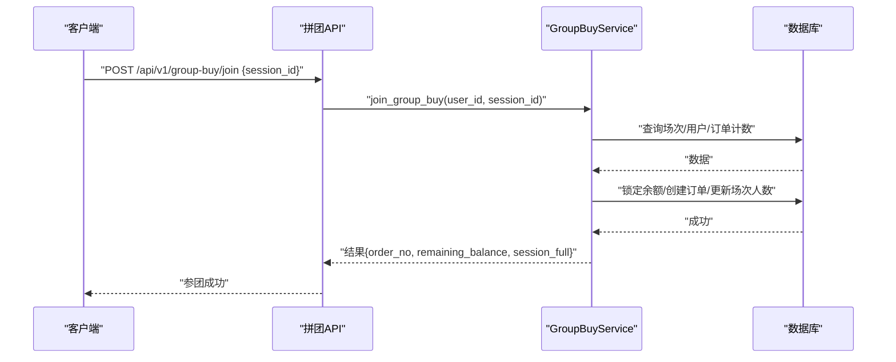
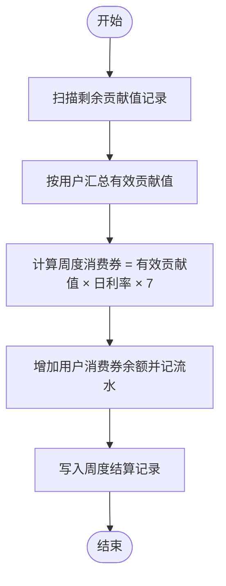
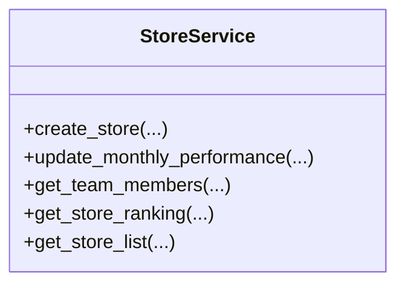
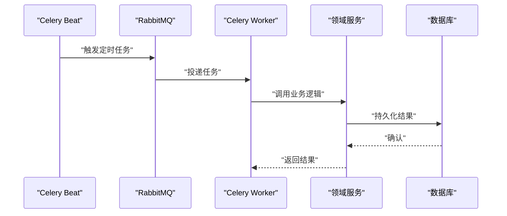
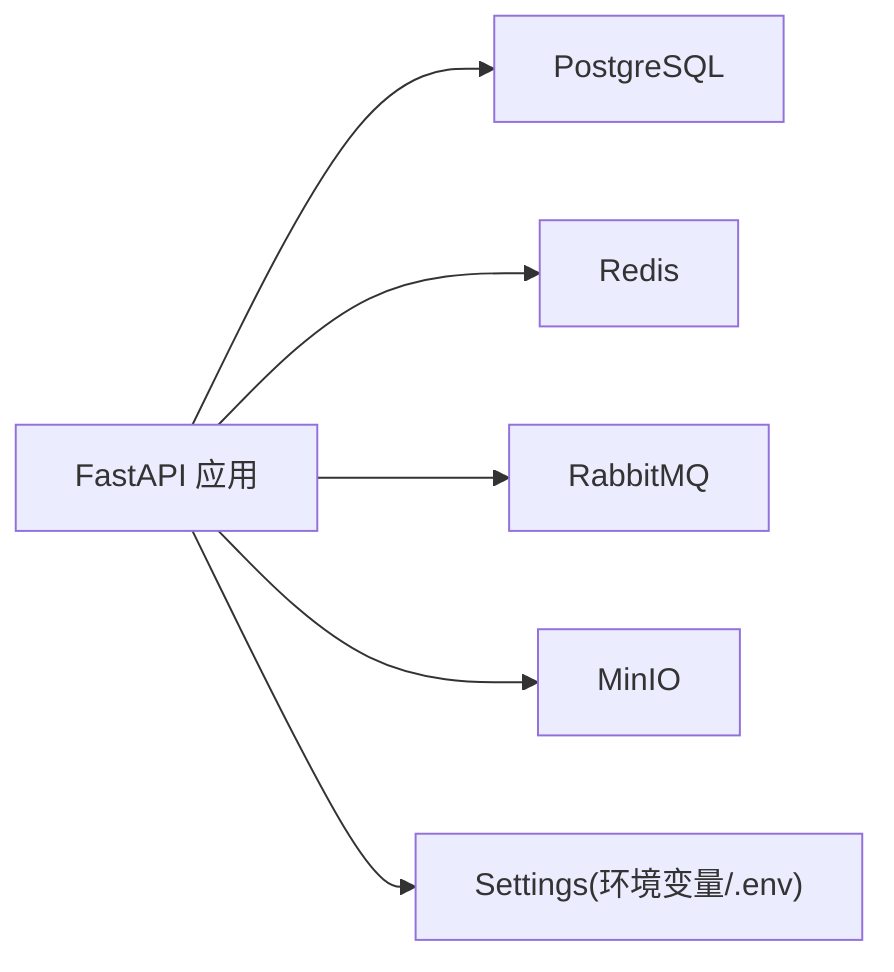
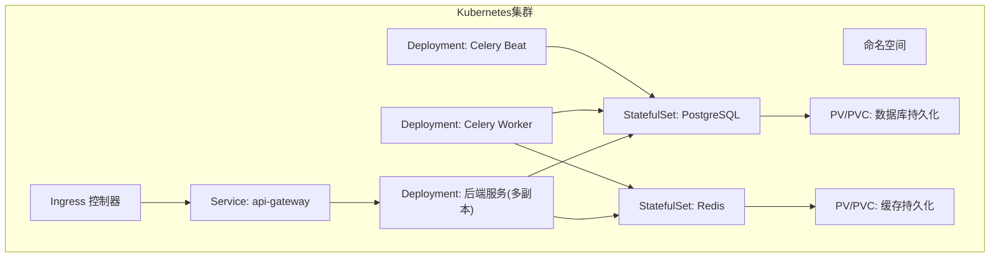

# 微服务架构设计

<cite>
**本文引用的文件**   
- [backend/app/main.py](file://backend/app/main.py)
- [backend/app/config.py](file://backend/app/config.py)
- [docker-compose.yml](file://docker-compose.yml)
- [backend/Dockerfile](file://backend/Dockerfile)
- [nginx.conf](file://nginx.conf)
- [backend/app/services/group_buy_service.py](file://backend/app/services/group_buy_service.py)
- [backend/app/services/contribution_service.py](file://backend/app/services/contribution_service.py)
- [backend/app/services/store_service.py](file://backend/app/services/store_service.py)
- [backend/app/tasks/celery_app.py](file://backend/app/tasks/celery_app.py)
- [backend/app/api/v1/group_buy.py](file://backend/app/api/v1/group_buy.py)
- [backend/app/api/v1/contribution.py](file://backend/app/api/v1/contribution.py)
- [backend/app/api/v1/store.py](file://backend/app/api/v1/store.py)
- [backend/requirements.txt](file://backend/requirements.txt)
</cite>

## 目录
1. [引言](#引言)
2. [项目结构](#项目结构)
3. [核心组件](#核心组件)
4. [架构总览](#架构总览)
5. [详细组件分析](#详细组件分析)
6. [依赖关系分析](#依赖关系分析)
7. [性能与扩展性](#性能与扩展性)
8. [故障排查指南](#故障排查指南)
9. [结论](#结论)
10. [附录](#附录)

## 引言
本设计文档面向AIxingmu系统的微服务化演进，目标是在现有单体应用基础上，明确服务划分策略与服务边界，定义用户、拼团、贡献值、门店等核心业务模块的独立部署方案；同时给出服务间通信机制（RESTful API、消息队列异步、事件驱动）、服务发现与注册、配置中心管理、监控与日志收集策略，以及容错治理（熔断降级、限流）和容器化编排（Docker/Kubernetes）与弹性伸缩方案。

## 项目结构
当前仓库为单体FastAPI应用，包含API路由、领域服务、任务调度、数据模型与基础设施配置。为支撑微服务拆分，建议按“业务能力+数据域”进行解耦，形成如下服务边界：
- 用户服务：用户认证、账户资产（余额、积分、消费券）基础能力
- 拼团服务：场次创建、参团、结算、订单查询
- 贡献值服务：贡献值计算、周度兑换、全网统计
- 门店服务：门店信息、团队层级、月度业绩与排名
- 商品/商城服务：商品、SKU、分类、下单（可后续拆分）
- 支付/结算服务：资金流转、分润结算（可后续拆分）
- 风控服务：风险评分、规则引擎（可后续拆分）
- 任务调度服务：Celery Worker/Beat作为共享基础设施或独立部署
- 网关与反向代理：Nginx统一入口、鉴权转发、静态资源托管

图表来源
- [backend/app/main.py:1-59](file://backend/app/main.py#L1-L59)
- [nginx.conf:1-39](file://nginx.conf#L1-L39)
- [docker-compose.yml:1-111](file://docker-compose.yml#L1-L111)

章节来源
- [backend/app/main.py:1-59](file://backend/app/main.py#L1-L59)
- [docker-compose.yml:1-111](file://docker-compose.yml#L1-L111)
- [backend/Dockerfile:1-13](file://backend/Dockerfile#L1-L13)
- [nginx.conf:1-39](file://nginx.conf#L1-L39)

## 核心组件
- 应用入口与生命周期
  - FastAPI应用初始化、CORS、路由挂载、健康检查
  - 启动时建表（开发期），关闭释放数据库连接
- 全局配置
  - 通过pydantic-settings集中管理数据库、缓存、消息队列、JWT、业务参数等
- 领域服务
  - 拼团服务：场次创建、参团校验、结算分配
  - 贡献值服务：统一公式计算、周度兑换、全网统计
  - 门店服务：门店CRUD、团队层级、月度业绩与排名
- 定时任务
  - Celery Beat调度：每日开团、满员结算、过期清理、周度分红、日度贡献值核算、月度门店分红
- 外部依赖
  - PostgreSQL、Redis、RabbitMQ、MinIO

章节来源
- [backend/app/main.py:1-59](file://backend/app/main.py#L1-L59)
- [backend/app/config.py:1-136](file://backend/app/config.py#L1-L136)
- [backend/app/services/group_buy_service.py:1-348](file://backend/app/services/group_buy_service.py#L1-L348)
- [backend/app/services/contribution_service.py:1-261](file://backend/app/services/contribution_service.py#L1-L261)
- [backend/app/services/store_service.py:1-161](file://backend/app/services/store_service.py#L1-L161)
- [backend/app/tasks/celery_app.py:1-56](file://backend/app/tasks/celery_app.py#L1-L56)

## 架构总览
从单体到微服务的演进路径建议：
- 第一阶段：保持单体，但按模块分层清晰，预留服务边界
- 第二阶段：将高并发/强一致域拆分为独立服务（如拼团、贡献值、门店）
- 第三阶段：引入API网关、服务注册发现、配置中心、链路追踪与指标采集
- 第四阶段：全面容器化编排与弹性伸缩

[此图为概念性架构图，不直接映射具体源码文件]

## 详细组件分析

### 用户服务（规划）
- 职责边界
  - 用户注册登录、JWT签发与校验、角色权限
  - 账户资产：余额、积分、消费券、贡献值（读多写少场景可考虑读写分离）
- 对外接口（示例）
  - POST /api/v1/auth/login
  - GET /api/v1/user/profile
- 关键流程
  - 登录鉴权：生成JWT并返回给客户端，后续请求携带Token
  - 资产变更：在事务中更新余额/积分/消费券，并写入流水日志

[此图为概念性序列图，不直接映射具体源码文件]

### 拼团服务
- 职责边界
  - 场次管理：固定场次/自定义场次
  - 参团流程：校验人数上限、参与次数、余额锁定
  - 结算流程：随机抽中、权益发放（商品券、贡献值、积分）
- 对外接口（示例）
  - GET /api/v1/group-buy/sessions
  - POST /api/v1/group-buy/join
  - GET /api/v1/group-buy/orders
  - GET /api/v1/group-buy/sessions/{session_id}
- 关键流程（参团）
  - 校验场次状态与容量
  - 校验单ID单组参与次数
  - 校验余额并锁定本金
  - 创建订单并更新场次人数
  - 若满员则标记FULL，等待定时任务结算

图表来源
- [backend/app/api/v1/group_buy.py:1-65](file://backend/app/api/v1/group_buy.py#L1-L65)
- [backend/app/services/group_buy_service.py:92-181](file://backend/app/services/group_buy_service.py#L92-L181)

章节来源
- [backend/app/api/v1/group_buy.py:1-65](file://backend/app/api/v1/group_buy.py#L1-L65)
- [backend/app/services/group_buy_service.py:1-348](file://backend/app/services/group_buy_service.py#L1-L348)

### 贡献值服务
- 职责边界
  - 统一贡献值计算公式：让利金额×分配比例×乘数
  - 六大角色分配：消费者、合作商家、推荐商家、推荐消费者、代理、平台
  - 周度递减兑换：有效贡献值×日利率×7生成消费券
  - 全网贡献值统计
- 对外接口（示例）
  - GET /api/v1/contribution/my
  - GET /api/v1/contribution/total
- 关键流程（周度兑换）
  - 扫描有剩余贡献值的记录
  - 按用户汇总有效贡献值
  - 计算当周消费券并发放至用户账户
  - 记录周度结算与明细

图表来源
- [backend/app/services/contribution_service.py:162-240](file://backend/app/services/contribution_service.py#L162-L240)

章节来源
- [backend/app/services/contribution_service.py:1-261](file://backend/app/services/contribution_service.py#L1-L261)
- [backend/app/api/v1/contribution.py:1-27](file://backend/app/api/v1/contribution.py#L1-L27)

### 门店服务
- 职责边界
  - 门店信息管理（省市区、联系人、推荐人）
  - 团队成员管理（直推/间推层级）
  - 月度业绩累计与排名
- 对外接口（示例）
  - GET /api/v1/store/list
  - GET /api/v1/store/ranking
  - GET /api/v1/store/team
- 关键流程（月度业绩）
  - 新增当月业绩增量
  - 同步更新门店总业绩与月度业绩
  - 支持按年月维度排名

图表来源
- [backend/app/services/store_service.py:1-161](file://backend/app/services/store_service.py#L1-L161)

章节来源
- [backend/app/services/store_service.py:1-161](file://backend/app/services/store_service.py#L1-L161)
- [backend/app/api/v1/store.py:1-48](file://backend/app/api/v1/store.py#L1-L48)

### 任务调度与异步处理
- 职责边界
  - 使用Celery执行耗时任务与定时任务
  - 通过RabbitMQ作为Broker，Redis作为结果后端
- 关键调度项
  - 每日9:50创建当日拼团场次
  - 每小时第5分钟检查并结算已满场次
  - 每日23:00检查过期场次
  - 每周一凌晨2:00执行贡献值分红
  - 每日凌晨3:00执行贡献值递减兑换核算
  - 每月1日凌晨1:00执行门店月度排名与分红

图表来源
- [backend/app/tasks/celery_app.py:1-56](file://backend/app/tasks/celery_app.py#L1-L56)

章节来源
- [backend/app/tasks/celery_app.py:1-56](file://backend/app/tasks/celery_app.py#L1-L56)

## 依赖关系分析
- 运行时依赖
  - FastAPI、Uvicorn、SQLAlchemy(async)、asyncpg、Alembic
  - Pydantic v2、Pydantic Settings
  - Celery、RabbitMQ、Redis、MinIO
  - HTTP客户端httpx（用于未来服务间HTTP调用）
- 配置项
  - 数据库连接池大小、溢出数量
  - Redis地址、Celery Broker/Backend
  - JWT密钥、算法、过期时间
  - CORS允许源
  - MinIO端点、桶名
  - 业务参数：拼团倍数、场次人数、贡献值比例、积分总量、门店阶梯分红等

图表来源
- [backend/app/config.py:1-136](file://backend/app/config.py#L1-L136)
- [backend/requirements.txt:1-34](file://backend/requirements.txt#L1-L34)

章节来源
- [backend/requirements.txt:1-34](file://backend/requirements.txt#L1-L34)
- [backend/app/config.py:1-136](file://backend/app/config.py#L1-L136)

## 性能与扩展性
- 数据库
  - 连接池大小与溢出参数可调，避免高并发下连接耗尽
  - 热点读（如场次列表、门店排名）可加Redis缓存
- 缓存
  - 使用Redis做会话、令牌、热点数据缓存
- 异步与批处理
  - 利用Celery将结算、分红、统计类任务异步化，降低主链路延迟
- 水平扩展
  - 无状态服务实例可横向扩容，配合负载均衡器分发请求
- 弹性伸缩
  - 基于CPU/内存/QPS指标自动扩缩容（Kubernetes HPA）

[本节为通用指导，不直接分析具体文件]

## 故障排查指南
- 健康检查
  - 提供/health端点，便于探针探测服务存活
- 常见错误
  - 参团失败：场次不存在/已截止/已满员/单ID单组超限/余额不足
  - 结算异常：场次状态非FULL/订单数量不匹配
- 定位手段
  - 查看Celery Worker日志与任务结果
  - 检查数据库事务与锁竞争
  - 观察Redis/MQ连通性与队列堆积

章节来源
- [backend/app/main.py:56-59](file://backend/app/main.py#L56-L59)
- [backend/app/services/group_buy_service.py:92-181](file://backend/app/services/group_buy_service.py#L92-L181)
- [backend/app/services/group_buy_service.py:183-321](file://backend/app/services/group_buy_service.py#L183-L321)

## 结论
当前系统以单体形式实现完整业务闭环，具备清晰的领域服务分层与任务调度能力。下一步应优先完成以下微服务化步骤：
- 拆分拼团、贡献值、门店为用户/拼团/贡献值/门店四个独立服务
- 引入API网关与服务注册发现，统一鉴权与路由
- 建立配置中心与统一日志/指标体系
- 完善容错治理（熔断、降级、限流）与可观测性
- 基于Docker与Kubernetes实现容器化编排与弹性伸缩

[本节为总结性内容，不直接分析具体文件]

## 附录

### 服务间通信机制
- RESTful API
  - 统一前缀/api/v1，按业务域划分路由
  - 使用HTTP状态码与结构化响应体
- 消息队列异步通信
  - 通过RabbitMQ解耦耗时操作（如结算、分红、通知）
- 事件驱动架构
  - 以领域事件驱动跨服务协作（例如：参团成功→触发贡献值计算→更新门店业绩）

[本节为概念性说明，不直接分析具体文件]

### 服务发现与注册、配置中心
- 服务发现与注册
  - 建议使用Consul/Nacos/Eureka等注册中心，服务启动后注册自身实例与健康检查
- 配置中心
  - 使用Nacos/Apollo/Vault统一管理环境差异配置，支持热更新

[本节为概念性说明，不直接分析具体文件]

### 服务监控与日志收集
- 指标采集
  - 暴露Prometheus指标（QPS、延迟、错误率、JVM/进程指标）
- 日志收集
  - 结构化JSON日志，统一输出到ELK/EFK或云原生日志平台
- 链路追踪
  - 集成OpenTelemetry/Jaeger，跨服务追踪请求链路

[本节为概念性说明，不直接分析具体文件]

### 容错治理（熔断、降级、限流）
- 熔断
  - 对下游依赖（数据库、缓存、第三方API）设置熔断阈值，快速失败
- 降级
  - 非核心功能降级（如排行榜延迟刷新、推荐位空占位）
- 限流
  - 网关层或服务层限流，保护热点接口（如参团接口）

[本节为概念性说明，不直接分析具体文件]

### 容器化与编排
- Docker镜像
  - 基于python:3.11-slim构建，安装依赖，暴露8000端口
- docker-compose
  - 一键拉起PostgreSQL、Redis、RabbitMQ、MinIO、后端、Worker、Beat、Nginx
- Kubernetes编排
  - Deployment/StatefulSet/Service/Ingress/HPA/ConfigMap/Secret/PV/PVC
  - 健康检查探针、资源限制、滚动更新、回滚策略

[此图为概念性部署拓扑图，不直接映射具体源码文件]

章节来源
- [backend/Dockerfile:1-13](file://backend/Dockerfile#L1-L13)
- [docker-compose.yml:1-111](file://docker-compose.yml#L1-L111)
- [nginx.conf:1-39](file://nginx.conf#L1-L39)