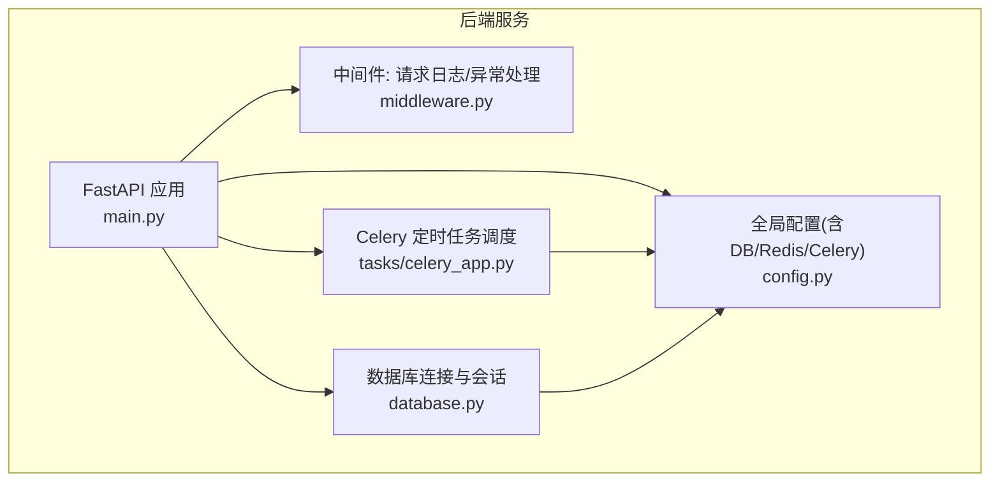
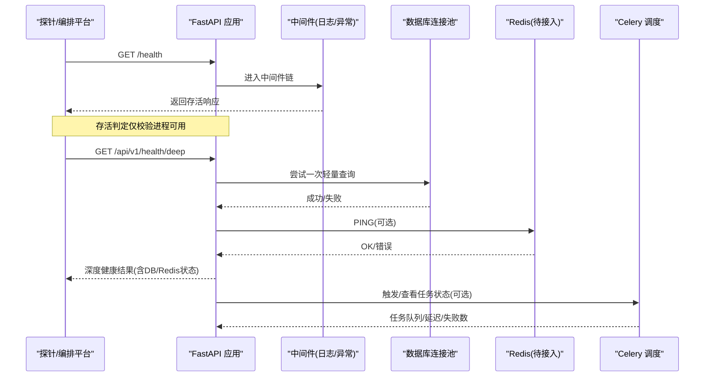
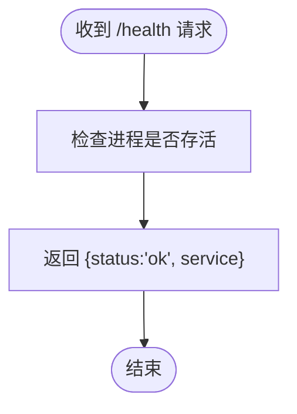
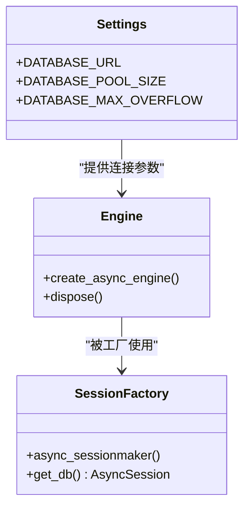
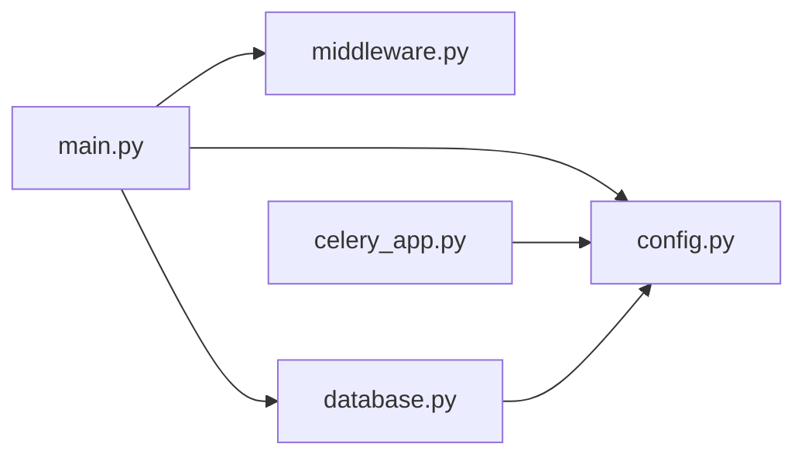

# 健康检查与监控

<cite>
**本文引用的文件**   
- [backend/app/main.py](file://backend/app/main.py)
- [backend/app/config.py](file://backend/app/config.py)
- [backend/app/database.py](file://backend/app/database.py)
- [backend/app/middleware.py](file://backend/app/middleware.py)
- [backend/app/tasks/celery_app.py](file://backend/app/tasks/celery_app.py)
</cite>

## 目录
1. [简介](#简介)
2. [项目结构](#项目结构)
3. [核心组件](#核心组件)
4. [架构总览](#架构总览)
5. [详细组件分析](#详细组件分析)
6. [依赖关系分析](#依赖关系分析)
7. [性能考量](#性能考量)
8. [故障排查指南](#故障排查指南)
9. [结论](#结论)
10. [附录](#附录)

## 简介
本文件面向AIxingmu系统的健康检查与监控，覆盖服务健康检查端点设计、数据库连接状态监控、Redis缓存可用性检测、心跳检测机制、服务存活判断、资源使用率监控、性能指标采集、错误日志收集、慢查询分析、监控告警规则配置、阈值设置、通知机制以及监控面板搭建指南与关键指标定义。目标是确保系统稳定运行、可观测性强、问题可快速定位与恢复。

## 项目结构
后端采用FastAPI应用，提供基础健康检查端点；通过中间件实现请求日志与全局异常处理；数据库使用异步SQLAlchemy引擎；定时任务基于Celery调度。当前仓库中未包含Redis客户端初始化代码，但配置项已预留Redis地址，便于后续接入缓存与健康探测。

图表来源
- [backend/app/main.py:36-78](file://backend/app/main.py#L36-L78)
- [backend/app/middleware.py:16-121](file://backend/app/middleware.py#L16-L121)
- [backend/app/database.py:10-40](file://backend/app/database.py#L10-L40)
- [backend/app/tasks/celery_app.py:9-56](file://backend/app/tasks/celery_app.py#L9-L56)
- [backend/app/config.py:16-26](file://backend/app/config.py#L16-L26)

章节来源
- [backend/app/main.py:36-78](file://backend/app/main.py#L36-L78)
- [backend/app/config.py:16-26](file://backend/app/config.py#L16-L26)
- [backend/app/database.py:10-40](file://backend/app/database.py#L10-L40)
- [backend/app/middleware.py:16-121](file://backend/app/middleware.py#L16-L121)
- [backend/app/tasks/celery_app.py:9-56](file://backend/app/tasks/celery_app.py#L9-L56)

## 核心组件
- 健康检查端点：提供轻量级存活探针，用于负载均衡器或编排平台进行存活判定。
- 请求与异常中间件：统一记录请求耗时、状态码与异常堆栈，为慢请求与错误分析提供数据源。
- 数据库连接管理：异步引擎与会话工厂，支持连接池参数配置，便于监控连接池使用率与慢查询。
- Celery 定时任务：集中调度业务周期任务，可作为后台作业健康度与延迟的观测面。
- 全局配置：集中管理数据库、Redis、Celery等外部依赖的连接信息，便于扩展健康检查能力。

章节来源
- [backend/app/main.py:74-78](file://backend/app/main.py#L74-L78)
- [backend/app/middleware.py:16-121](file://backend/app/middleware.py#L16-L121)
- [backend/app/database.py:10-40](file://backend/app/database.py#L10-L40)
- [backend/app/tasks/celery_app.py:9-56](file://backend/app/tasks/celery_app.py#L9-L56)
- [backend/app/config.py:16-26](file://backend/app/config.py#L16-L26)

## 架构总览
下图展示了健康检查与监控在系统中的位置与交互：外部探针调用健康端点，中间件记录请求与异常，数据库连接池暴露连接与执行统计，Celery任务作为后台作业健康面，配置中心统一管理外部依赖。

图表来源
- [backend/app/main.py:74-78](file://backend/app/main.py#L74-L78)
- [backend/app/middleware.py:82-121](file://backend/app/middleware.py#L82-L121)
- [backend/app/database.py:10-40](file://backend/app/database.py#L10-L40)
- [backend/app/config.py:21-26](file://backend/app/config.py#L21-26)
- [backend/app/tasks/celery_app.py:9-56](file://backend/app/tasks/celery_app.py#L9-L56)

## 详细组件分析

### 健康检查端点设计
- 存活探针（浅健康）：GET /health，返回服务名称与状态，适合Kubernetes Liveness/Readiness或负载均衡器探测。
- 深度健康（建议新增）：GET /api/v1/health/deep，依次检查数据库连接与Redis连通性，并汇总任务队列延迟与失败计数，返回结构化健康报告。

图表来源
- [backend/app/main.py:74-78](file://backend/app/main.py#L74-L78)

章节来源
- [backend/app/main.py:74-78](file://backend/app/main.py#L74-L78)

### 数据库连接状态监控
- 连接池参数：通过配置项控制连接池大小与溢出上限，便于评估并发与容量规划。
- 会话生命周期：异步会话工厂负责创建、提交、回滚与关闭，异常路径需保证资源释放。
- 监控要点：连接池活跃/空闲连接数、等待队列长度、慢查询数量、事务回滚率。

图表来源
- [backend/app/config.py:16-19](file://backend/app/config.py#L16-19)
- [backend/app/database.py:10-40](file://backend/app/database.py#L10-L40)

章节来源
- [backend/app/config.py:16-19](file://backend/app/config.py#L16-19)
- [backend/app/database.py:10-40](file://backend/app/database.py#L10-L40)

### Redis缓存可用性检测
- 配置项：REDIS_URL与CELERY_RESULT_BACKEND分别指向不同库，便于隔离缓存与任务结果存储。
- 健康检测建议：在深度健康端点中增加Redis PING操作，记录连通性与延迟，失败时标记不健康。
- 注意：当前仓库未包含Redis客户端初始化代码，需在应用中引入并复用配置项。

章节来源
- [backend/app/config.py:21-26](file://backend/app/config.py#L21-26)

### 心跳检测机制与服务存活判断
- 心跳策略：
  - 进程级心跳：由健康端点承载，探针周期性访问以确认进程存活。
  - 业务级心跳：可在深度健康端点中聚合DB/Redis/任务队列状态，反映业务可用性。
- 存活判定：
  - Liveness：只要进程能响应健康端点即视为存活。
  - Readiness：当DB或Redis不可用时，应拒绝新请求或返回不健康，避免流量进入不可用实例。

章节来源
- [backend/app/main.py:74-78](file://backend/app/main.py#L74-L78)
- [backend/app/config.py:21-26](file://backend/app/config.py#L21-26)

### 资源使用率监控
- 建议采集指标：CPU使用率、内存占用、GC次数、文件描述符、网络吞吐、磁盘I/O。
- 集成方式：通过操作系统或容器运行时导出指标，配合Prometheus抓取与Grafana展示。
- 与应用的结合：在中间件或框架层输出X-Process-Time，辅助识别热点接口与瓶颈。

章节来源
- [backend/app/middleware.py:19-26](file://backend/app/middleware.py#L19-26)

### 性能指标采集
- 请求级指标：QPS、P50/P90/P99延迟、错误率、状态码分布。
- 数据库指标：连接池使用率、慢查询数量、事务回滚率、锁等待。
- 任务队列指标：入队/出队速率、积压量、失败重试次数、平均延迟。
- 采集建议：在中间件与数据库驱动层埋点，将指标暴露给监控系统。

章节来源
- [backend/app/middleware.py:82-121](file://backend/app/middleware.py#L82-L121)
- [backend/app/database.py:10-40](file://backend/app/database.py#L10-L40)
- [backend/app/tasks/celery_app.py:9-56](file://backend/app/tasks/celery_app.py#L9-L56)

### 错误日志收集
- 统一异常处理：捕获验证错误、数据库错误、权限错误与未处理异常，返回标准化错误体并记录日志。
- 请求日志：记录方法、URL、客户端IP、状态码与耗时，便于追踪与审计。
- 建议：将日志输出到集中式日志系统（如ELK），并按模块与级别分级。

章节来源
- [backend/app/middleware.py:16-80](file://backend/app/middleware.py#L16-80)
- [backend/app/middleware.py:82-121](file://backend/app/middleware.py#L82-L121)

### 慢查询分析
- 识别方式：
  - 应用层：基于中间件记录的耗时，设定阈值筛选慢请求。
  - 数据库层：开启慢查询日志或使用SQLAlchemy echo（开发环境）观察执行计划。
- 优化建议：索引优化、分页与批量操作、连接池扩容、读写分离与缓存命中提升。

章节来源
- [backend/app/middleware.py:82-121](file://backend/app/middleware.py#L82-L121)
- [backend/app/database.py:10-15](file://backend/app/database.py#L10-L15)

### 监控告警规则配置、阈值设置与通知机制
- 建议告警规则：
  - 健康端点连续失败N次（如3次，间隔1分钟）。
  - 错误率超过阈值（如5分钟内P99错误率>1%）。
  - 慢请求比例过高（如P99>2s占比>5%）。
  - 数据库连接池使用率>80%持续5分钟。
  - Redis连通失败或延迟>100ms。
  - Celery任务积压>阈值或失败率>阈值。
- 通知渠道：邮件、企业微信/钉钉机器人、短信、电话。
- 治理流程：告警分级（P0-P3）、升级策略、值班轮转与复盘闭环。

[本节为通用实践说明，无需源码引用]

### 监控面板搭建指南与关键指标定义
- 数据采集：
  - 应用指标：通过中间件与数据库驱动暴露自定义指标。
  - 系统指标：主机/容器运行时指标。
  - 日志与链路：集中化日志与分布式追踪。
- 可视化：
  - Grafana面板：概览页（存活、QPS、错误率、延迟）、数据库页（连接池、慢查询）、任务队列页（积压、失败）、Redis页（连通性、延迟）。
- 关键指标定义：
  - 存活：健康端点成功率=100%。
  - 可用性：错误率<1%，P99延迟<2s。
  - 稳定性：连接池使用率<80%，任务积压<阈值。
  - 可观测性：日志完整、指标无缺失、告警及时。

[本节为通用实践说明，无需源码引用]

## 依赖关系分析
- 应用入口依赖中间件、数据库、路由与配置。
- 中间件依赖日志与HTTP框架异常类型。
- 数据库模块依赖配置中的连接参数。
- Celery任务依赖配置中的Broker与Backend。

图表来源
- [backend/app/main.py:36-78](file://backend/app/main.py#L36-L78)
- [backend/app/middleware.py:16-121](file://backend/app/middleware.py#L16-L121)
- [backend/app/database.py:10-40](file://backend/app/database.py#L10-L40)
- [backend/app/tasks/celery_app.py:9-56](file://backend/app/tasks/celery_app.py#L9-L56)
- [backend/app/config.py:16-26](file://backend/app/config.py#L16-26)

章节来源
- [backend/app/main.py:36-78](file://backend/app/main.py#L36-L78)
- [backend/app/middleware.py:16-121](file://backend/app/middleware.py#L16-L121)
- [backend/app/database.py:10-40](file://backend/app/database.py#L10-L40)
- [backend/app/tasks/celery_app.py:9-56](file://backend/app/tasks/celery_app.py#L9-L56)
- [backend/app/config.py:16-26](file://backend/app/config.py#L16-26)

## 性能考量
- 健康端点应保持极简，避免引入IO阻塞。
- 深度健康检查应设置超时与降级策略，防止影响主流程。
- 数据库连接池需根据并发与负载调优，避免连接耗尽。
- 日志写入建议异步化与采样，降低对主流程的影响。
- 监控指标采集应避免高开销计算，必要时使用增量与近似算法。

[本节为通用实践说明，无需源码引用]

## 故障排查指南
- 健康端点不可达：检查进程是否启动、端口是否监听、防火墙与安全组。
- 深度健康失败：逐一验证数据库连接与Redis连通性，查看异常日志与堆栈。
- 慢请求定位：从中间件日志中筛选高耗时请求，结合数据库慢查询与索引分析。
- 任务积压与失败：查看Celery队列状态与任务日志，定位失败原因与重试策略。
- 资源瓶颈：观察CPU、内存、磁盘与网络指标，结合连接池使用率与GC情况综合判断。

章节来源
- [backend/app/middleware.py:16-80](file://backend/app/middleware.py#L16-80)
- [backend/app/middleware.py:82-121](file://backend/app/middleware.py#L82-L121)
- [backend/app/database.py:10-40](file://backend/app/database.py#L10-L40)
- [backend/app/tasks/celery_app.py:9-56](file://backend/app/tasks/celery_app.py#L9-L56)

## 结论
当前系统已具备基础的健康检查端点与完善的请求日志、异常处理机制，数据库连接池与Celery任务提供了可扩展的监控面。建议在现有基础上补充深度健康检查（DB/Redis连通性）、统一指标采集与告警规则，并搭建可视化面板，形成“可观测—可诊断—可恢复”的闭环，保障系统长期稳定运行。

[本节为总结性内容，无需源码引用]

## 附录
- 健康端点清单：
  - GET /health：存活探针
  - GET /api/v1/health/deep：深度健康（建议新增）
- 关键配置项：
  - DATABASE_URL、DATABASE_POOL_SIZE、DATABASE_MAX_OVERFLOW
  - REDIS_URL、CELERY_BROKER_URL、CELERY_RESULT_BACKEND

章节来源
- [backend/app/main.py:74-78](file://backend/app/main.py#L74-L78)
- [backend/app/config.py:16-26](file://backend/app/config.py#L16-26)