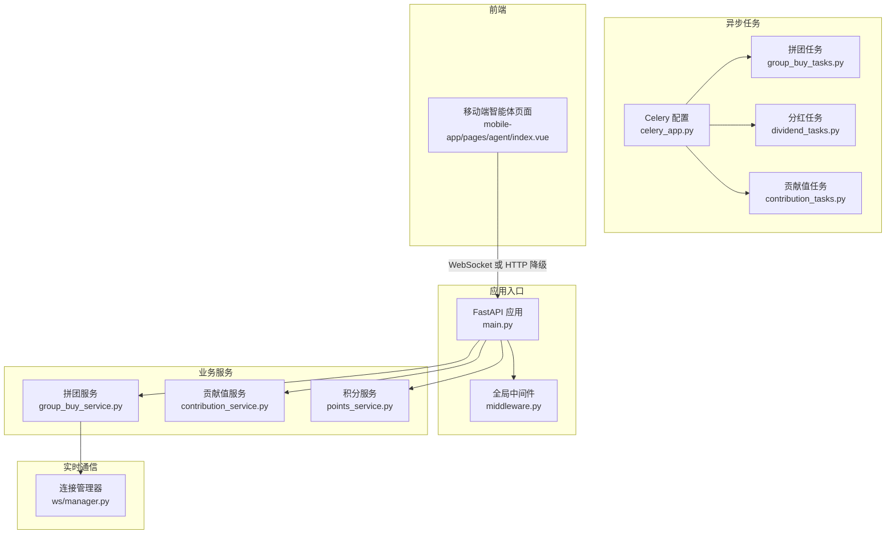
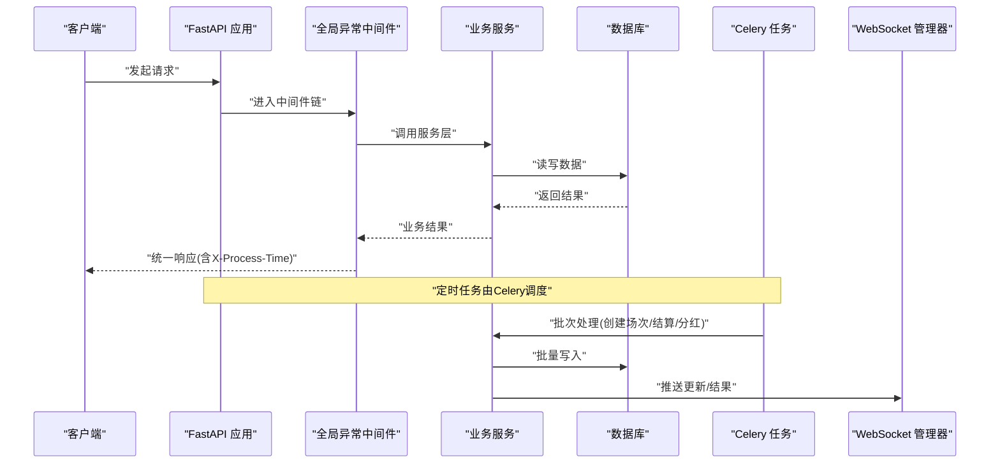
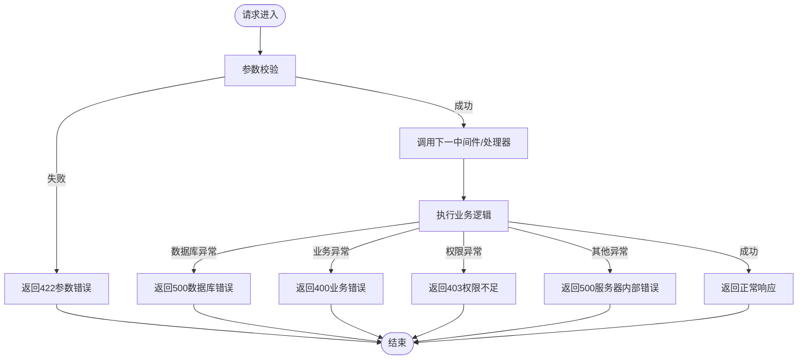
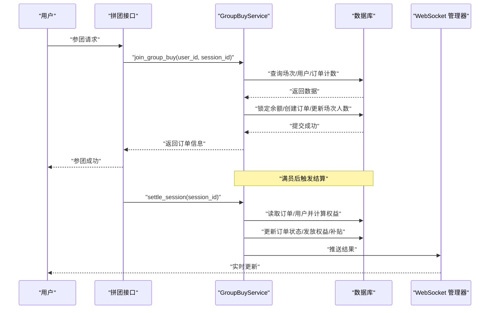
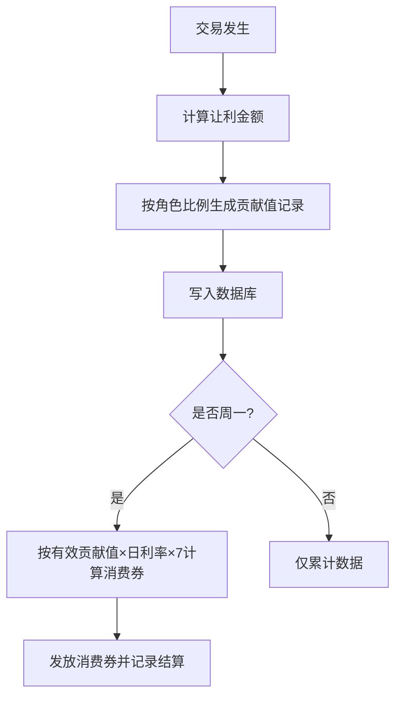
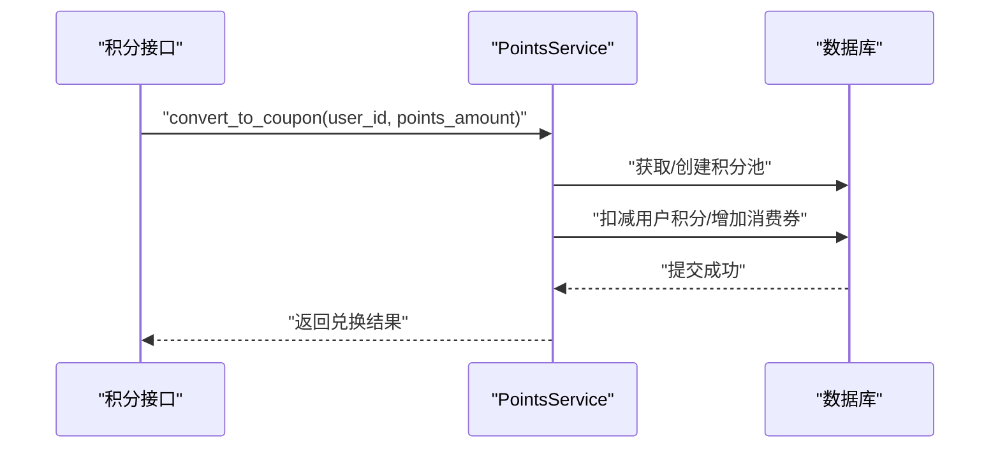
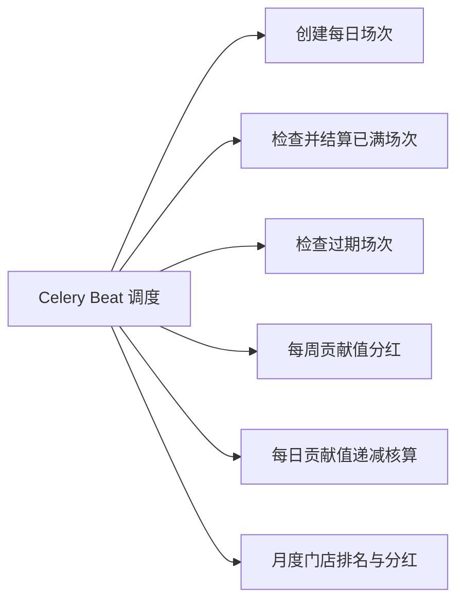
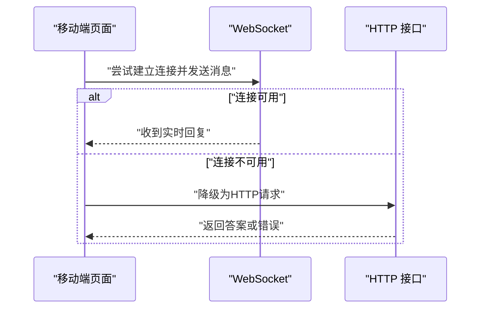
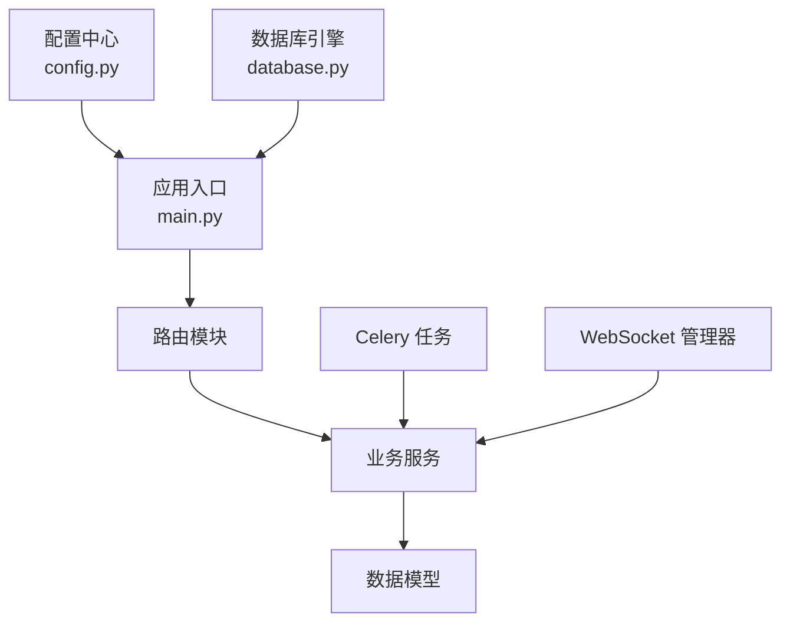

# 容错与降级处理

<cite>
**本文引用的文件**   
- [backend/app/main.py](file://backend/app/main.py)
- [backend/app/middleware.py](file://backend/app/middleware.py)
- [backend/app/config.py](file://backend/app/config.py)
- [backend/app/database.py](file://backend/app/database.py)
- [backend/app/services/group_buy_service.py](file://backend/app/services/group_buy_service.py)
- [backend/app/services/contribution_service.py](file://backend/app/services/contribution_service.py)
- [backend/app/services/points_service.py](file://backend/app/services/points_service.py)
- [backend/app/api/v1/points.py](file://backend/app/api/v1/points.py)
- [backend/app/tasks/celery_app.py](file://backend/app/tasks/celery_app.py)
- [backend/app/tasks/group_buy_tasks.py](file://backend/app/tasks/group_buy_tasks.py)
- [backend/app/tasks/dividend_tasks.py](file://backend/app/tasks/dividend_tasks.py)
- [backend/app/tasks/contribution_tasks.py](file://backend/app/tasks/contribution_tasks.py)
- [backend/app/ws/manager.py](file://backend/app/ws/manager.py)
- [frontend/mobile-app/pages/agent/index.vue](file://frontend/mobile-app/pages/agent/index.vue)
</cite>

## 目录
1. [简介](#简介)
2. [项目结构](#项目结构)
3. [核心组件](#核心组件)
4. [架构总览](#架构总览)
5. [详细组件分析](#详细组件分析)
6. [依赖关系分析](#依赖关系分析)
7. [性能考量](#性能考量)
8. [故障排查指南](#故障排查指南)
9. [结论](#结论)
10. [附录](#附录)

## 简介
本文件面向AIxingmu系统的容错与降级能力，覆盖限流熔断、重试策略、超时处理、服务降级与备用方案切换、数据一致性保障、分布式锁与幂等性、事务补偿机制、异常捕获与错误恢复、服务自愈能力，并提供配置示例与故障模拟测试方法。文档基于仓库现有实现进行梳理，并给出可落地的增强建议与图示说明。

## 项目结构
后端采用FastAPI作为Web框架，结合Celery执行定时任务；业务层以Service为主，Agent编排用于复杂流程协调；WebSocket用于实时推送；前端移动端在智能体对话场景实现了WebSocket到HTTP的降级路径。

图表来源
- [backend/app/main.py:1-77](file://backend/app/main.py#L1-L77)
- [backend/app/middleware.py:1-120](file://backend/app/middleware.py#L1-L120)
- [backend/app/services/group_buy_service.py:1-348](file://backend/app/services/group_buy_service.py#L1-L348)
- [backend/app/services/contribution_service.py:1-261](file://backend/app/services/contribution_service.py#L1-L261)
- [backend/app/services/points_service.py:1-42](file://backend/app/services/points_service.py#L1-L42)
- [backend/app/tasks/celery_app.py:1-56](file://backend/app/tasks/celery_app.py#L1-L56)
- [backend/app/tasks/group_buy_tasks.py:1-42](file://backend/app/tasks/group_buy_tasks.py#L1-L42)
- [backend/app/tasks/dividend_tasks.py:1-25](file://backend/app/tasks/dividend_tasks.py#L1-L25)
- [backend/app/tasks/contribution_tasks.py:1-28](file://backend/app/tasks/contribution_tasks.py#L1-L28)
- [backend/app/ws/manager.py:98-127](file://backend/app/ws/manager.py#L98-L127)
- [frontend/mobile-app/pages/agent/index.vue:216-268](file://frontend/mobile-app/pages/agent/index.vue#L216-L268)

章节来源
- [backend/app/main.py:1-77](file://backend/app/main.py#L1-L77)
- [backend/app/config.py:1-145](file://backend/app/config.py#L1-L145)

## 核心组件
- 全局异常与请求日志中间件：统一捕获参数校验、数据库、权限及未处理异常，返回标准化JSON响应，并记录耗时与关键上下文。
- 健康检查端点：提供基础存活探针。
- 定时任务调度：通过Celery Beat按周期触发场次创建、结算、过期清理、贡献值周度结算与递减核算、门店月度排名与分红等。
- 拼团服务：包含开团、参团、满员判定、结果结算与权益发放，涉及余额锁定/解锁、订单状态机、补贴计算与记录。
- 贡献值服务：统一公式生成多角色贡献值记录，支持周度结算并发放消费券。
- 积分服务：维护积分池、通缩与动态单价逻辑，支持兑换消费券。
- WebSocket连接管理：向频道推送拼团人数更新与结果。
- 前端降级：智能体对话优先使用WebSocket，失败时自动降级为HTTP请求。

章节来源
- [backend/app/middleware.py:16-79](file://backend/app/middleware.py#L16-L79)
- [backend/app/main.py:75-77](file://backend/app/main.py#L75-L77)
- [backend/app/tasks/celery_app.py:24-55](file://backend/app/tasks/celery_app.py#L24-L55)
- [backend/app/services/group_buy_service.py:93-181](file://backend/app/services/group_buy_service.py#L93-L181)
- [backend/app/services/group_buy_service.py:184-321](file://backend/app/services/group_buy_service.py#L184-L321)
- [backend/app/services/contribution_service.py:39-143](file://backend/app/services/contribution_service.py#L39-L143)
- [backend/app/services/contribution_service.py:163-240](file://backend/app/services/contribution_service.py#L163-L240)
- [backend/app/services/points_service.py:15-42](file://backend/app/services/points_service.py#L15-L42)
- [backend/app/ws/manager.py:103-123](file://backend/app/ws/manager.py#L103-L123)
- [frontend/mobile-app/pages/agent/index.vue:216-268](file://frontend/mobile-app/pages/agent/index.vue#L216-L268)

## 架构总览
下图展示从请求进入、中间件处理、路由分发、服务层执行业务、异步任务驱动以及WebSocket推送的整体链路，并标注了当前已实现的容错点（如全局异常捕获、前端降级）。

图表来源
- [backend/app/main.py:45-77](file://backend/app/main.py#L45-L77)
- [backend/app/middleware.py:16-79](file://backend/app/middleware.py#L16-L79)
- [backend/app/tasks/celery_app.py:24-55](file://backend/app/tasks/celery_app.py#L24-L55)
- [backend/app/services/group_buy_service.py:184-321](file://backend/app/services/group_buy_service.py#L184-L321)
- [backend/app/ws/manager.py:103-123](file://backend/app/ws/manager.py#L103-L123)

## 详细组件分析

### 全局异常与错误恢复
- 统一捕获参数验证、数据库、权限与未处理异常，返回标准JSON格式，附带错误码与消息，便于上层重试与降级判断。
- 请求日志中间件记录请求开始/结束、状态码与耗时，辅助定位慢请求与异常热点。
- 健康检查端点可用于负载均衡与健康探针。

图表来源
- [backend/app/middleware.py:16-79](file://backend/app/middleware.py#L16-L79)
- [backend/app/main.py:75-77](file://backend/app/main.py#L75-L77)

章节来源
- [backend/app/middleware.py:16-79](file://backend/app/middleware.py#L16-L79)
- [backend/app/main.py:45-77](file://backend/app/main.py#L45-L77)

### 拼团业务流程与一致性保障
- 参团流程包括场次校验、用户参与次数限制、余额校验、本金锁定、订单创建、场次人数更新与满员判定。
- 结算流程对满员场次随机抽取1人拼中，其余30人退回本金并计算广告补贴与推荐人补贴，同时发放商品权益、贡献值与积分。
- 所有资金变动均伴随钱包流水记录，保证可追溯性与审计性。

图表来源
- [backend/app/services/group_buy_service.py:93-181](file://backend/app/services/group_buy_service.py#L93-L181)
- [backend/app/services/group_buy_service.py:184-321](file://backend/app/services/group_buy_service.py#L184-L321)
- [backend/app/ws/manager.py:103-123](file://backend/app/ws/manager.py#L103-L123)

章节来源
- [backend/app/services/group_buy_service.py:93-181](file://backend/app/services/group_buy_service.py#L93-L181)
- [backend/app/services/group_buy_service.py:184-321](file://backend/app/services/group_buy_service.py#L184-L321)

### 贡献值与周度结算
- 贡献值按统一公式计算，按角色分别生成记录，支持平台、商家、代理等多角色分配。
- 每周一进行周度结算，根据有效贡献值与日利率计算当周消费券并发放，同时记录结算明细。

图表来源
- [backend/app/services/contribution_service.py:39-143](file://backend/app/services/contribution_service.py#L39-L143)
- [backend/app/services/contribution_service.py:163-240](file://backend/app/services/contribution_service.py#L163-L240)

章节来源
- [backend/app/services/contribution_service.py:39-143](file://backend/app/services/contribution_service.py#L39-L143)
- [backend/app/services/contribution_service.py:163-240](file://backend/app/services/contribution_service.py#L163-L240)

### 积分系统与兑换
- 积分池全局单例，消费获得积分并执行通缩处理，动态单价随累计总金额与通缩数量变化。
- 提供兑换接口将积分转换为消费券，并在API层抛出业务异常以便中间件统一处理。

图表来源
- [backend/app/services/points_service.py:15-42](file://backend/app/services/points_service.py#L15-L42)
- [backend/app/api/v1/points.py:19-30](file://backend/app/api/v1/points.py#L19-L30)

章节来源
- [backend/app/services/points_service.py:15-42](file://backend/app/services/points_service.py#L15-L42)
- [backend/app/api/v1/points.py:19-30](file://backend/app/api/v1/points.py#L19-L30)

### 定时任务与作业编排
- Celery Beat定义多个周期性任务：每日创建场次、每小时检查结算、过期场次清理、每周贡献值分红、每日贡献值递减核算、每月门店排名与分红。
- 任务内封装异步执行器，确保在同步任务中运行异步代码，并通过数据库会话完成事务提交。

图表来源
- [backend/app/tasks/celery_app.py:24-55](file://backend/app/tasks/celery_app.py#L24-L55)
- [backend/app/tasks/group_buy_tasks.py:17-40](file://backend/app/tasks/group_buy_tasks.py#L17-L40)
- [backend/app/tasks/dividend_tasks.py:15-25](file://backend/app/tasks/dividend_tasks.py#L15-L25)
- [backend/app/tasks/contribution_tasks.py:15-28](file://backend/app/tasks/contribution_tasks.py#L15-L28)

章节来源
- [backend/app/tasks/celery_app.py:24-55](file://backend/app/tasks/celery_app.py#L24-L55)
- [backend/app/tasks/group_buy_tasks.py:17-40](file://backend/app/tasks/group_buy_tasks.py#L17-L40)
- [backend/app/tasks/dividend_tasks.py:15-25](file://backend/app/tasks/dividend_tasks.py#L15-L25)
- [backend/app/tasks/contribution_tasks.py:15-28](file://backend/app/tasks/contribution_tasks.py#L15-L28)

### 前端降级与备用通道
- 智能体对话优先使用WebSocket发送消息；若不可用则自动降级为HTTP请求，保证基本可用性。
- 前端在HTTP降级路径中包含错误提示与加载状态管理。

图表来源
- [frontend/mobile-app/pages/agent/index.vue:216-268](file://frontend/mobile-app/pages/agent/index.vue#L216-L268)

章节来源
- [frontend/mobile-app/pages/agent/index.vue:216-268](file://frontend/mobile-app/pages/agent/index.vue#L216-L268)

## 依赖关系分析
- 应用入口依赖配置、数据库引擎、路由与中间件。
- 业务服务依赖配置常量与模型，负责核心一致性逻辑。
- 定时任务依赖Celery配置与业务服务，形成批处理闭环。
- WebSocket管理器与业务服务协作，实现实时通知。

图表来源
- [backend/app/config.py:1-145](file://backend/app/config.py#L1-L145)
- [backend/app/main.py:1-77](file://backend/app/main.py#L1-L77)
- [backend/app/database.py](file://backend/app/database.py)
- [backend/app/services/group_buy_service.py:1-348](file://backend/app/services/group_buy_service.py#L1-L348)
- [backend/app/tasks/celery_app.py:1-56](file://backend/app/tasks/celery_app.py#L1-L56)
- [backend/app/ws/manager.py:98-127](file://backend/app/ws/manager.py#L98-L127)

章节来源
- [backend/app/config.py:1-145](file://backend/app/config.py#L1-L145)
- [backend/app/main.py:1-77](file://backend/app/main.py#L1-L77)
- [backend/app/database.py](file://backend/app/database.py)
- [backend/app/services/group_buy_service.py:1-348](file://backend/app/services/group_buy_service.py#L1-L348)
- [backend/app/tasks/celery_app.py:1-56](file://backend/app/tasks/celery_app.py#L1-L56)
- [backend/app/ws/manager.py:98-127](file://backend/app/ws/manager.py#L98-L127)

## 性能考量
- 数据库连接池与溢出参数已在配置中声明，需在生产环境合理调优以避免连接耗尽。
- 全局中间件添加耗时统计头，有助于识别慢请求与瓶颈。
- 定时任务采用分时段执行，避免集中高峰造成资源争用。
- 建议在高频写操作处引入缓存与批量写入，降低数据库压力。

[本节为通用指导，不直接分析具体文件]

## 故障排查指南
- 查看全局异常中间件的日志输出，定位参数校验失败、数据库错误、权限不足与未处理异常。
- 关注健康检查端点返回状态，确认服务存活。
- 针对拼团结算与贡献值周度结算，核对数据库流水记录与订单状态，确保一致性。
- 对于WebSocket不可用的情况，确认前端降级逻辑是否生效，并检查HTTP接口可用性。

章节来源
- [backend/app/middleware.py:16-79](file://backend/app/middleware.py#L16-L79)
- [backend/app/main.py:75-77](file://backend/app/main.py#L75-L77)
- [backend/app/services/group_buy_service.py:184-321](file://backend/app/services/group_buy_service.py#L184-L321)
- [backend/app/services/contribution_service.py:163-240](file://backend/app/services/contribution_service.py#L163-L240)
- [frontend/mobile-app/pages/agent/index.vue:216-268](file://frontend/mobile-app/pages/agent/index.vue#L216-L268)

## 结论
当前系统已具备基础的容错与降级能力：全局异常捕获与日志记录、健康检查、前端WebSocket到HTTP的降级路径、定时任务的批处理与周度结算。为保障高可用与强一致性，建议进一步引入限流熔断、重试与超时控制、分布式锁与幂等设计、事务补偿机制，并结合监控告警完善自愈能力。

[本节为总结性内容，不直接分析具体文件]

## 附录

### 限流与熔断（建议）
- 限流策略
  - 基于IP与用户维度的令牌桶或滑动窗口限流，防止恶意刷单与资源滥用。
  - 对敏感接口（参团、结算）设置更严格的阈值。
- 熔断策略
  - 对下游依赖（数据库、外部LLM/Dify）设置熔断器，失败率或延迟超过阈值时快速失败，避免雪崩。
  - 熔断恢复采用半开探测，逐步放行流量验证稳定性。

[本节为通用建议，不直接分析具体文件]

### 重试策略（建议）
- 幂等接口（如参团、兑换）支持指数退避重试，最大重试次数与抖动时间可配置。
- 非幂等接口不建议自动重试，改为人工复核或补偿任务。
- 重试失败进入死信队列，供后续人工干预与审计。

[本节为通用建议，不直接分析具体文件]

### 超时处理（建议）
- 对外部依赖（LLM/Dify、对象存储）设置合理的请求超时与连接超时。
- 长耗时任务（结算、分红）拆分为子任务，配合进度回调与断点续跑。

[本节为通用建议，不直接分析具体文件]

### 服务降级与备用方案（已实现与扩展）
- 已实现：智能体对话WebSocket不可用时降级为HTTP请求。
- 可扩展：当主库不可用时切换到只读副本；当外部AI不可用时返回缓存答案或默认模板。

章节来源
- [frontend/mobile-app/pages/agent/index.vue:216-268](file://frontend/mobile-app/pages/agent/index.vue#L216-L268)

### 数据一致性保障（已实现与扩展）
- 已实现：资金变动伴随钱包流水记录；拼团结算一次性更新订单与用户资产；贡献值周度结算记录明细。
- 可扩展：引入分布式事务或Saga模式，跨服务操作采用补偿事件保证最终一致。

章节来源
- [backend/app/services/group_buy_service.py:184-321](file://backend/app/services/group_buy_service.py#L184-L321)
- [backend/app/services/contribution_service.py:163-240](file://backend/app/services/contribution_service.py#L163-L240)

### 分布式锁与幂等性（建议）
- 分布式锁：在并发热点（如场次创建、结算）使用Redis分布式锁，避免重复执行。
- 幂等性：为关键接口生成唯一请求ID，服务端去重表或Redis键保证幂等。

[本节为通用建议，不直接分析具体文件]

### 事务补偿机制（建议）
- 对长事务或跨服务操作，采用补偿事件与回滚脚本，确保异常时可恢复到一致状态。
- 定期巡检不一致数据，自动修复或告警人工处理。

[本节为通用建议，不直接分析具体文件]

### 容错配置示例（参考）
- 数据库连接池与溢出参数
  - 连接池大小、最大溢出数在配置中声明，生产环境需根据负载调整。
- Celery调度计划
  - 各定时任务在Beat中定义，可按需调整执行频率与时区。
- CORS与跨域
  - 生产环境应限定允许的源与方法，避免开放全部。

章节来源
- [backend/app/config.py:16-26](file://backend/app/config.py#L16-L26)
- [backend/app/tasks/celery_app.py:24-55](file://backend/app/tasks/celery_app.py#L24-L55)
- [backend/app/main.py:51-57](file://backend/app/main.py#L51-L57)

### 故障模拟测试方法
- 数据库故障
  - 断开数据库连接，观察全局异常中间件返回500与日志记录；验证健康检查失败。
- 外部依赖超时
  - 模拟LLM/Dify超时，验证熔断与降级逻辑（建议实现），前端HTTP降级仍可用。
- 并发参团
  - 使用压测工具对参团接口进行并发测试，验证锁与幂等是否生效，订单与余额一致性。
- 定时任务失败
  - 停止Celery Worker，观察任务堆积与重试；恢复后验证补跑与数据一致性。

[本节为通用建议，不直接分析具体文件]