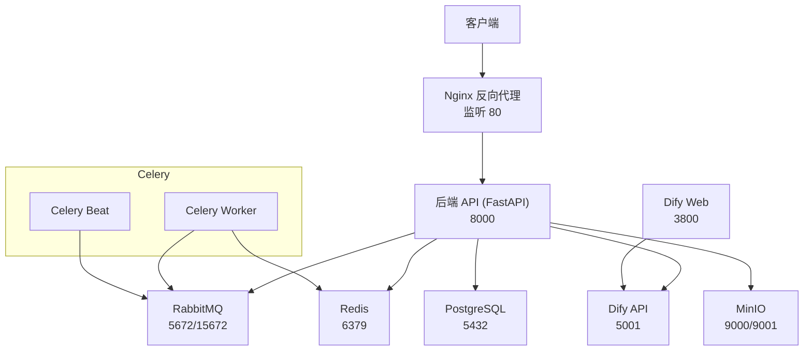
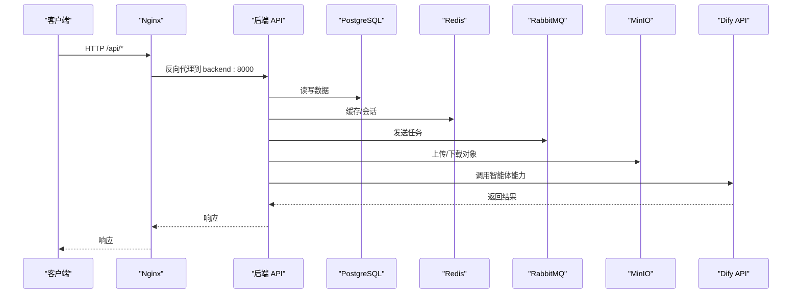
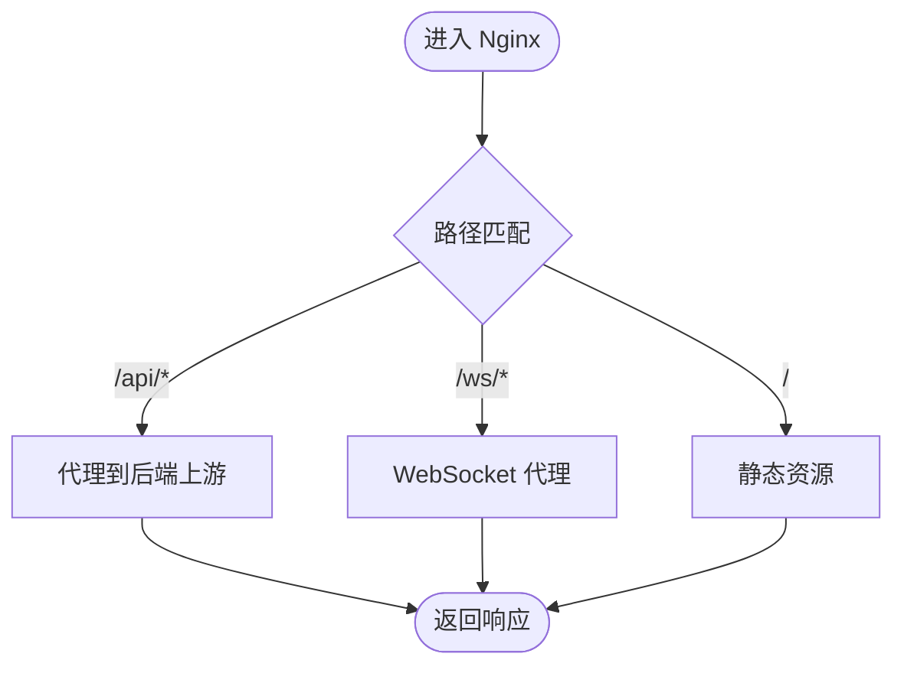
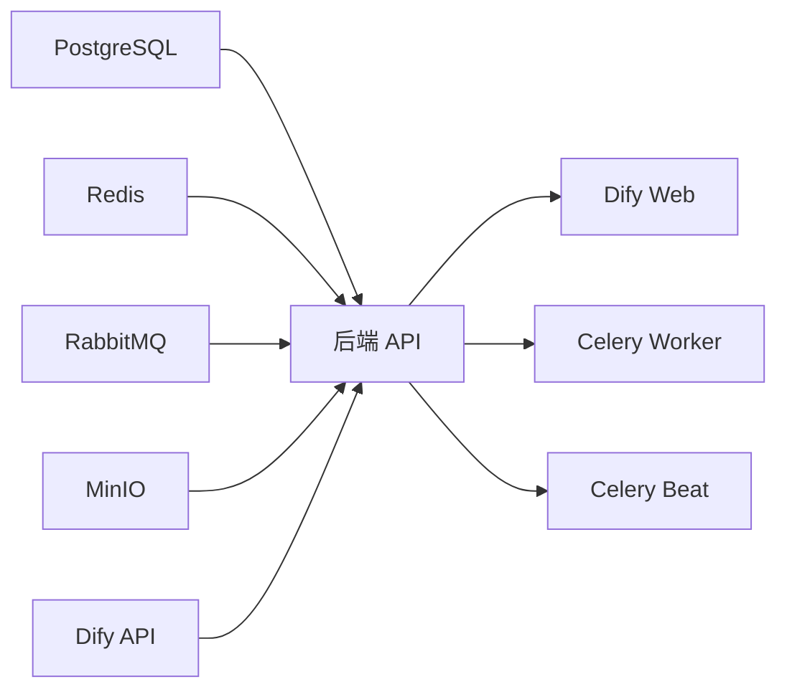
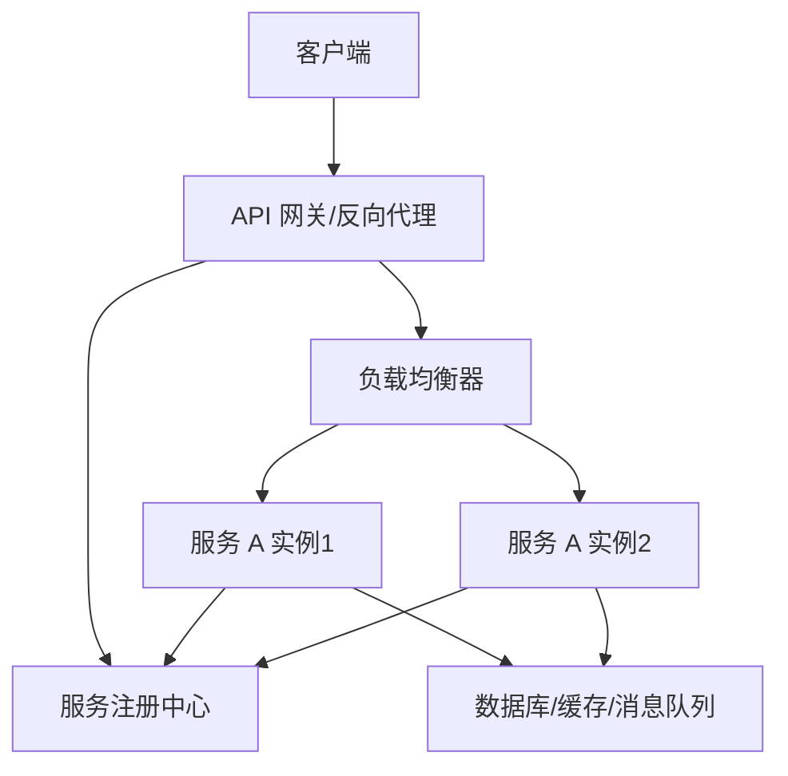

# 服务发现与注册

<cite>
**本文引用的文件**   
- [docker-compose.yml](file://docker-compose.yml)
- [nginx.conf](file://nginx.conf)
- [backend/Dockerfile](file://backend/Dockerfile)
- [backend/app/config.py](file://backend/app/config.py)
- [backend/app/main.py](file://backend/app/main.py)
</cite>

## 目录
1. [简介](#简介)
2. [项目结构](#项目结构)
3. [核心组件](#核心组件)
4. [架构总览](#架构总览)
5. [详细组件分析](#详细组件分析)
6. [依赖关系分析](#依赖关系分析)
7. [性能考量](#性能考量)
8. [故障排查指南](#故障排查指南)
9. [结论](#结论)
10. [附录](#附录)

## 简介
本文件面向 AIxingmu 系统，聚焦于基于 Docker Compose 的服务编排与服务间通信机制，说明容器网络、端口映射、环境变量传递、健康检查、自动重启策略与依赖管理。同时给出当前实现中的负载均衡与请求路由方式，并讨论在微服务架构中如何实现动态服务发现与调用（含扩展建议）。

## 项目结构
AIxingmu 采用多容器编排：
- 后端 API（FastAPI）通过 Uvicorn 启动，暴露 8000 端口
- Nginx 作为反向代理，将 /api/ 转发至后端
- 数据库 PostgreSQL、缓存 Redis、消息队列 RabbitMQ、对象存储 MinIO、Dify RAG 平台等基础设施
- Celery Worker/Beat 用于异步任务与定时任务

图表来源
- [docker-compose.yml:1-149](file://docker-compose.yml#L1-L149)
- [nginx.conf:1-39](file://nginx.conf#L1-L39)
- [backend/Dockerfile:1-13](file://backend/Dockerfile#L1-L13)

章节来源
- [docker-compose.yml:1-149](file://docker-compose.yml#L1-L149)
- [nginx.conf:1-39](file://nginx.conf#L1-L39)
- [backend/Dockerfile:1-13](file://backend/Dockerfile#L1-L13)

## 核心组件
- 容器网络与服务发现
  - Docker Compose 默认创建同一网络，服务名即 DNS 名称，如 backend、postgres、redis、rabbitmq、minio、dify-api、dify-web。服务间通过“服务名:端口”互相访问，无需硬编码宿主机 IP。
- 端口映射
  - 对外暴露的端口包括 Nginx 80、后端 8000、数据库 5432、Redis 6379、RabbitMQ 5672/15672、MinIO 9000/9001、Dify API 5001、Dify Web 3800。
- 环境变量传递
  - 各服务通过 environment 注入连接串或地址，例如 DATABASE_URL、REDIS_URL、CELERY_BROKER_URL、CELERY_RESULT_BACKEND、DIFY_API_URL 等。
- 健康检查与依赖
  - 使用 healthcheck 检测关键服务可用性；depends_on 结合 condition 控制启动顺序。
- 负载均衡与路由
  - Nginx upstream 定义后端集群入口，按路径进行反向代理与 WebSocket 透传。
- 自动重启策略
  - 当前未显式配置 restart 策略，可通过 Compose 添加以增强健壮性。

章节来源
- [docker-compose.yml:1-149](file://docker-compose.yml#L1-L149)
- [nginx.conf:1-39](file://nginx.conf#L1-L39)
- [backend/app/config.py:1-145](file://backend/app/config.py#L1-L145)

## 架构总览
下图展示从外部到内部服务的请求路径、负载均衡与依赖关系。

图表来源
- [docker-compose.yml:1-149](file://docker-compose.yml#L1-L149)
- [nginx.conf:1-39](file://nginx.conf#L1-L39)
- [backend/app/main.py:1-78](file://backend/app/main.py#L1-L78)

## 详细组件分析

### 容器网络与服务发现
- 同 Compose 网络内，服务名解析为对应容器的 IP，形成天然的服务发现能力。
- 示例：后端通过 redis、postgres、rabbitmq、minio、dify-api 等服务名访问相应服务。
- 注意：若跨网络部署，需显式声明 networks 并在服务间互通。

章节来源
- [docker-compose.yml:1-149](file://docker-compose.yml#L1-L149)

### 端口映射与对外访问
- Nginx 监听 80，统一入口；后端 8000 仅对内暴露。
- 其他基础设施端口按需暴露，便于本地调试或运维工具接入。

章节来源
- [docker-compose.yml:1-149](file://docker-compose.yml#L1-L149)
- [nginx.conf:1-39](file://nginx.conf#L1-L39)

### 环境变量与配置注入
- 后端通过 pydantic-settings 加载配置，支持从环境变量覆盖默认值。
- 关键变量包括数据库连接串、Redis、Celery、MinIO、Dify 等。
- 建议在 .env 或 CI/CD 中集中管理敏感信息。

章节来源
- [backend/app/config.py:1-145](file://backend/app/config.py#L1-L145)
- [docker-compose.yml:1-149](file://docker-compose.yml#L1-L149)

### 健康检查与启动依赖
- 数据库提供健康检查命令，确保后端在其就绪后再启动。
- 其他服务通过 depends_on 指定启动顺序，避免竞态。

章节来源
- [docker-compose.yml:1-149](file://docker-compose.yml#L1-L149)

### 自动重启策略
- 当前未设置 restart 策略。生产环境建议为关键服务配置自动重启，提升自愈能力。

章节来源
- [docker-compose.yml:1-149](file://docker-compose.yml#L1-L149)

### 负载均衡与请求路由
- Nginx upstream 指向后端服务，可按需扩展多个后端实例以实现水平扩展与负载均衡。
- 路由规则：
  - /api/ 转发至后端 API
  - /ws/ 透传 WebSocket 升级头
  - / 静态资源（预留）

图表来源
- [nginx.conf:1-39](file://nginx.conf#L1-L39)

章节来源
- [nginx.conf:1-39](file://nginx.conf#L1-L39)

### 服务间通信与调用
- 同步 HTTP：后端直接通过 http://dify-api:5001 访问 Dify API。
- 异步任务：后端通过 Celery 向 RabbitMQ 投递任务，Worker 消费执行。
- 缓存与会话：通过 Redis 共享状态。
- 对象存储：通过 MinIO 存取文件。

章节来源
- [docker-compose.yml:1-149](file://docker-compose.yml#L1-L149)
- [backend/app/config.py:1-145](file://backend/app/config.py#L1-L145)

### 应用生命周期与健康端点
- FastAPI 应用启动时初始化数据库表，关闭时释放引擎。
- 提供 /health 健康端点，可用于探针或监控。

章节来源
- [backend/app/main.py:1-78](file://backend/app/main.py#L1-L78)

### 构建与运行
- 后端镜像基于 Python 3.11，安装依赖后以 Uvicorn 启动，监听 0.0.0.0:8000。

章节来源
- [backend/Dockerfile:1-13](file://backend/Dockerfile#L1-L13)

## 依赖关系分析
- 启动顺序
  - postgres 健康检查通过后，再启动依赖它的服务（如 backend、dify-api）。
  - redis、rabbitmq 先启动，再启动需要它们的后端与 Celery。
- 运行时依赖
  - 后端强依赖数据库、缓存、消息队列、对象存储与 Dify API。
  - Celery Worker/Beat 依赖消息队列与缓存。

图表来源
- [docker-compose.yml:1-149](file://docker-compose.yml#L1-L149)

章节来源
- [docker-compose.yml:1-149](file://docker-compose.yml#L1-L149)

## 性能考量
- 单副本 vs 多副本
  - 当前后端为单副本；如需更高吞吐，可复制多个 backend 实例并通过 Nginx 轮询。
- 连接池与超时
  - 数据库连接池参数已在配置中体现，可根据负载调整。
- 缓存命中
  - 合理设计缓存键与过期策略，降低数据库压力。
- 异步化
  - 将耗时操作放入 Celery，提高接口响应速度。
- 静态资源与 CDN
  - 前端静态资源可考虑独立部署并上 CDN，减轻 Nginx 压力。

[本节为通用指导，不直接分析具体文件]

## 故障排查指南
- 服务无法启动
  - 检查 depends_on 与 healthcheck 是否满足条件。
  - 确认环境变量是否正确注入，尤其是连接串与密钥。
- 端口冲突
  - 宿主机端口被占用会导致容器启动失败，需更换映射端口。
- 网络不可达
  - 确认服务在同一 Compose 网络，且服务名与端口正确。
- 健康检查失败
  - 查看容器日志与 healthcheck 命令返回值。
- 反向代理异常
  - 检查 Nginx 配置的路由与 upstream 指向。
- 应用健康端点
  - 访问 /health 验证后端是否就绪。

章节来源
- [docker-compose.yml:1-149](file://docker-compose.yml#L1-L149)
- [nginx.conf:1-39](file://nginx.conf#L1-L39)
- [backend/app/main.py:1-78](file://backend/app/main.py#L1-L78)

## 结论
当前 AIxingmu 基于 Docker Compose 实现了稳定的服务编排与通信：
- 服务发现：通过 Compose 内置 DNS 以服务名互访
- 负载均衡：Nginx 单上游，可扩展为多后端
- 路由：按路径区分 API、WebSocket 与静态资源
- 健康检查与依赖：保障启动顺序与可用性
- 环境变量：集中注入，便于管理与安全

对于更复杂的动态服务发现与故障转移，可在现有基础上引入专用服务注册中心（如 Consul/Etcd/Nacos），并结合 Sidecar 或网关插件实现自动注册、健康探测与流量治理。

[本节为总结，不直接分析具体文件]

## 附录

### 服务发现架构图（概念）

[此图为概念示意，不直接映射到具体源码文件]

### 配置示例清单（路径引用）
- 服务编排与依赖
  - [docker-compose.yml:1-149](file://docker-compose.yml#L1-L149)
- 反向代理与路由
  - [nginx.conf:1-39](file://nginx.conf#L1-L39)
- 后端构建与启动
  - [backend/Dockerfile:1-13](file://backend/Dockerfile#L1-L13)
- 应用配置与环境变量
  - [backend/app/config.py:1-145](file://backend/app/config.py#L1-L145)
- 应用生命周期与健康端点
  - [backend/app/main.py:1-78](file://backend/app/main.py#L1-L78)