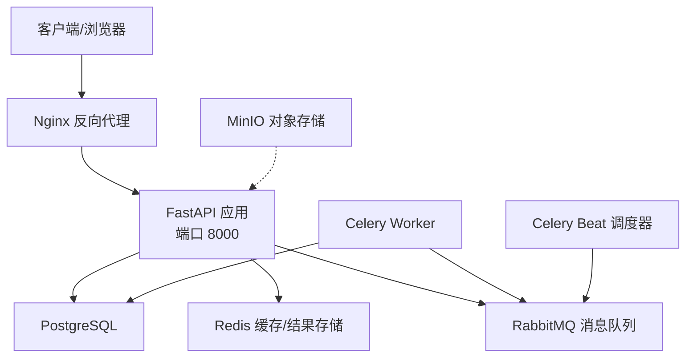
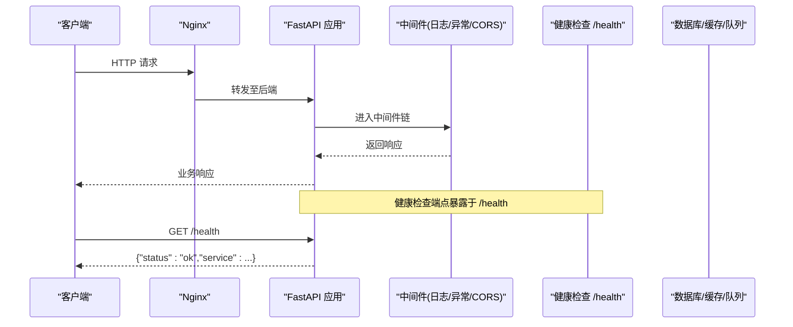
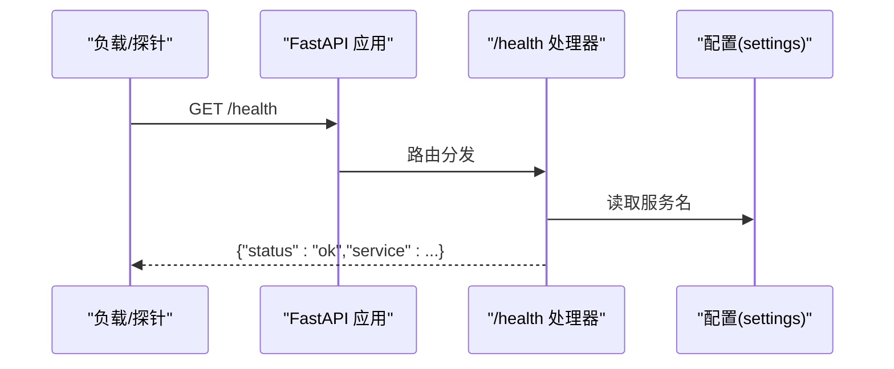
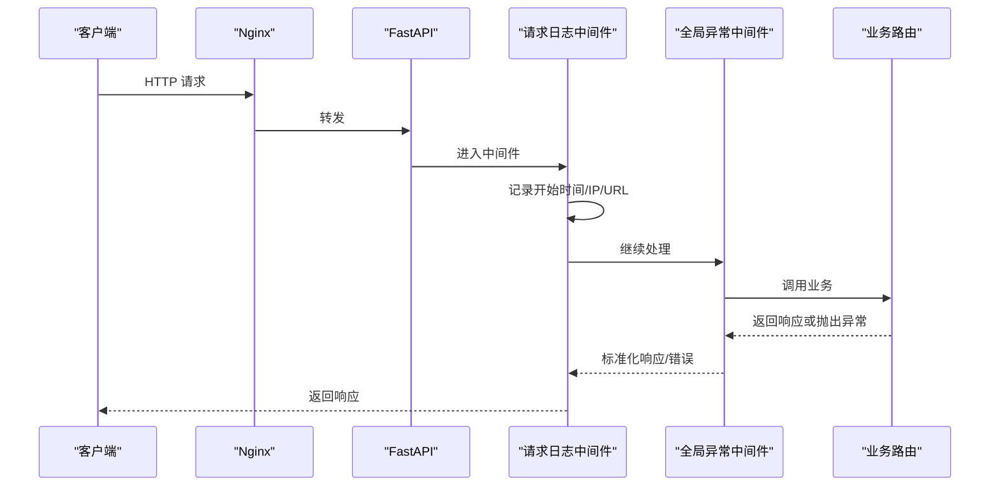
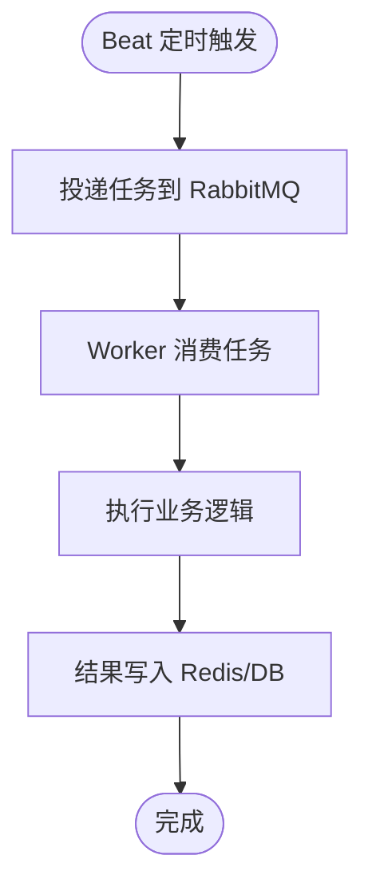
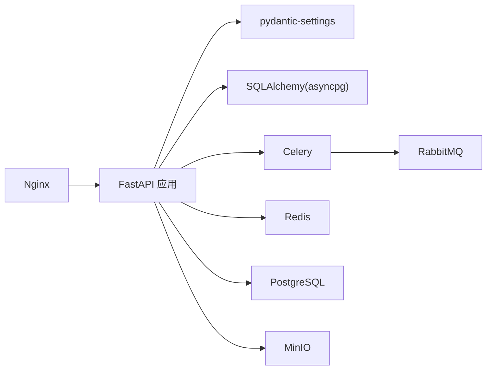
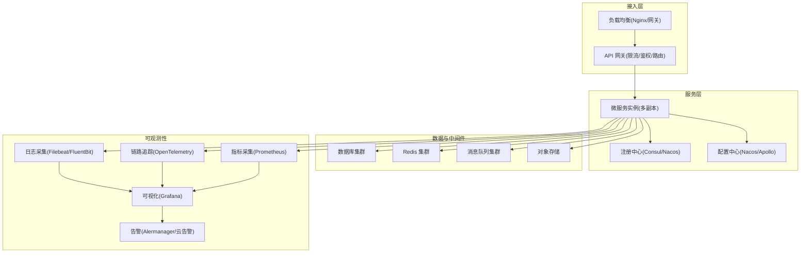

# 服务治理与监控

<cite>
**本文引用的文件**   
- [backend/app/main.py](file://backend/app/main.py)
- [backend/app/config.py](file://backend/app/config.py)
- [backend/app/database.py](file://backend/app/database.py)
- [backend/app/middleware.py](file://backend/app/middleware.py)
- [backend/app/tasks/celery_app.py](file://backend/app/tasks/celery_app.py)
- [docker-compose.yml](file://docker-compose.yml)
- [nginx.conf](file://nginx.conf)
- [backend/Dockerfile](file://backend/Dockerfile)
- [backend/requirements.txt](file://backend/requirements.txt)
</cite>

## 目录
1. [引言](#引言)
2. [项目结构](#项目结构)
3. [核心组件](#核心组件)
4. [架构总览](#架构总览)
5. [详细组件分析](#详细组件分析)
6. [依赖关系分析](#依赖关系分析)
7. [性能考量](#性能考量)
8. [故障排查指南](#故障排查指南)
9. [结论](#结论)
10. [附录](#附录)

## 引言
本文件面向AIxingmu系统的服务治理与监控，围绕以下目标展开：
- 服务注册发现机制、配置中心管理、动态配置更新策略
- 健康检查、心跳检测、自动故障转移实现
- 限流熔断、降级处理、负载均衡等容错机制
- 分布式日志收集、链路追踪、性能监控方案
- 告警规则、指标采集、可视化监控面板
- 版本管理、灰度发布、滚动更新策略
- 提供架构图与监控指标体系

说明：当前仓库为单体FastAPI应用+Docker Compose编排的本地开发环境。部分高级治理能力（如注册发现、集中式配置中心、全链路追踪）尚未内置，文档在“现状”基础上给出“演进建议”，以便后续平滑升级。

## 项目结构
后端采用FastAPI作为Web框架，使用SQLAlchemy异步访问PostgreSQL，Celery+RabbitMQ执行异步任务，Redis用于缓存与结果存储，Nginx作为反向代理，MinIO用于对象存储。前端包含移动端与管理后台。

图示来源
- [docker-compose.yml:52-96](file://docker-compose.yml#L52-L96)
- [nginx.conf:5-21](file://nginx.conf#L5-L21)
- [backend/app/main.py:35-74](file://backend/app/main.py#L35-L74)

章节来源
- [docker-compose.yml:1-111](file://docker-compose.yml#L1-L111)
- [nginx.conf:1-39](file://nginx.conf#L1-L39)
- [backend/app/main.py:1-75](file://backend/app/main.py#L1-L75)

## 核心组件
- Web入口与生命周期
  - FastAPI应用初始化、中间件注册、路由挂载、健康检查端点
- 配置管理
  - 基于pydantic-settings的环境配置加载
- 数据库连接与会话
  - 异步引擎、会话工厂、依赖注入获取会话
- 中间件
  - 全局异常处理、请求日志记录、CORS
- 异步任务
  - Celery应用、定时任务调度
- 容器化与部署
  - Docker镜像构建、Compose编排、Nginx反向代理

章节来源
- [backend/app/main.py:24-74](file://backend/app/main.py#L24-L74)
- [backend/app/config.py:8-136](file://backend/app/config.py#L8-L136)
- [backend/app/database.py:10-40](file://backend/app/database.py#L10-L40)
- [backend/app/middleware.py:16-121](file://backend/app/middleware.py#L16-L121)
- [backend/app/tasks/celery_app.py:9-55](file://backend/app/tasks/celery_app.py#L9-L55)
- [backend/Dockerfile:1-13](file://backend/Dockerfile#L1-L13)
- [docker-compose.yml:52-96](file://docker-compose.yml#L52-L96)
- [nginx.conf:5-21](file://nginx.conf#L5-L21)

## 架构总览
下图展示从客户端到后端各组件的交互路径，以及健康检查端点的位置。

图示来源
- [nginx.conf:14-21](file://nginx.conf#L14-L21)
- [backend/app/main.py:44-74](file://backend/app/main.py#L44-L74)

## 详细组件分析

### 服务注册与发现（现状与建议）
- 现状
  - 当前无内置服务注册与发现组件；通过Nginx upstream指向单一后端实例，适合单副本或配合外部LB进行手工切换。
- 建议
  - 引入轻量注册中心（如Consul/Etcd/Nacos），服务启动时注册，停止时注销；Nginx或网关层基于注册中心动态刷新上游。
  - 结合Kubernetes Service/Ingress或Service Mesh（Istio/Linkerd）实现更完善的发现与流量治理。

章节来源
- [nginx.conf:5-8](file://nginx.conf#L5-L8)
- [docker-compose.yml:97-106](file://docker-compose.yml#L97-L106)

### 配置中心管理与动态更新（现状与建议）
- 现状
  - 使用pydantic-settings从环境变量/.env加载配置，应用启动时生效。
- 建议
  - 引入集中式配置中心（如Nacos/Apollo/Consul Config），支持热更新；应用侧监听配置变更事件并刷新内存配置。
  - 对敏感配置（密钥、令牌）使用加密存储与动态注入。

章节来源
- [backend/app/config.py:8-136](file://backend/app/config.py#L8-L136)

### 健康检查与心跳检测（现状与建议）
- 现状
  - 提供/health端点返回服务状态；Docker Compose中PostgreSQL定义了healthcheck。
- 建议
  - 扩展健康检查：数据库连通性、Redis可用性、RabbitMQ连通性、磁盘/内存阈值等。
  - 心跳上报：将服务实例的心跳写入注册中心或KV存储，供外部系统探测。

章节来源
- [backend/app/main.py:72-74](file://backend/app/main.py#L72-L74)
- [docker-compose.yml:15-19](file://docker-compose.yml#L15-L19)

### 自动故障转移与高可用（现状与建议）
- 现状
  - Nginx upstream仅指向一个后端实例；未启用多副本与故障剔除。
- 建议
  - 多副本部署+Nginx健康检查与故障剔除；或使用Kubernetes探针与HPA自动扩缩容。
  - 关键依赖（DB/Cache/MQ）采用主从/集群模式，避免单点故障。

章节来源
- [nginx.conf:5-8](file://nginx.conf#L5-L8)
- [docker-compose.yml:52-71](file://docker-compose.yml#L52-L71)

### 限流、熔断、降级与负载均衡（现状与建议）
- 现状
  - 未内置限流/熔断/降级逻辑；Nginx具备基础反向代理能力。
- 建议
  - 限流：Nginx rate-limit或网关层（APISIX/Kong）限流；应用层按接口维度限流。
  - 熔断/降级：引入Resilience4j/Sentinel等理念，在调用外部依赖（LLM、对象存储）时增加熔断与降级策略。
  - 负载均衡：Nginx轮询/加权；生产环境建议使用Kubernetes Ingress或Service Mesh。

章节来源
- [nginx.conf:5-21](file://nginx.conf#L5-L21)

### 分布式日志收集、链路追踪与性能监控（现状与建议）
- 现状
  - 应用内使用Python logging输出结构化日志；中间件记录请求开始/结束与耗时；未集成集中式日志与链路追踪。
- 建议
  - 日志：统一JSON格式，接入Filebeat/FluentBit→Elasticsearch/ClickHouse；或通过OpenTelemetry导出。
  - 链路追踪：集成OpenTelemetry，生成TraceID贯穿请求链路；在中间件注入trace_id并透传到下游。
  - 性能监控：Prometheus抓取JVM/Python运行时指标与应用自定义指标；Grafana可视化。

章节来源
- [backend/app/middleware.py:82-109](file://backend/app/middleware.py#L82-L109)
- [backend/app/main.py:16-21](file://backend/app/main.py#L16-L21)

### 服务告警规则、指标采集与可视化面板（现状与建议）
- 现状
  - 未内置告警与指标采集；可通过日志关键字触发告警。
- 建议
  - 指标：HTTP请求量、错误率、P95/P99延迟、数据库连接池使用率、队列堆积、任务成功率等。
  - 告警：Prometheus Alertmanager或云厂商告警；定义SLO/SLI阈值与通知渠道。
  - 可视化：Grafana仪表盘聚合系统与应用指标。

章节来源
- [backend/app/middleware.py:82-109](file://backend/app/middleware.py#L82-L109)

### 服务版本管理、灰度发布与滚动更新（现状与建议）
- 现状
  - 应用版本信息在FastAPI元数据中声明；部署为单副本。
- 建议
  - 版本管理：语义化版本号，API前缀或Header控制兼容；向后兼容优先。
  - 灰度发布：基于权重路由（Nginx/upstream权重或网关层）逐步放量；结合蓝绿/金丝雀策略。
  - 滚动更新：Kubernetes RollingUpdate或编排平台滚动重启，确保零停机。

章节来源
- [backend/app/main.py:35-42](file://backend/app/main.py#L35-L42)
- [backend/Dockerfile:10-12](file://backend/Dockerfile#L10-L12)

### 健康检查流程（代码级时序）

图示来源
- [backend/app/main.py:72-74](file://backend/app/main.py#L72-L74)
- [backend/app/config.py:12-14](file://backend/app/config.py#L12-L14)

### 请求处理与中间件流程（代码级时序）

图示来源
- [backend/app/main.py:44-56](file://backend/app/main.py#L44-L56)
- [backend/app/middleware.py:82-109](file://backend/app/middleware.py#L82-L109)
- [backend/app/middleware.py:16-79](file://backend/app/middleware.py#L16-L79)

### 任务调度流程（Celery）

图示来源
- [backend/app/tasks/celery_app.py:24-55](file://backend/app/tasks/celery_app.py#L24-L55)
- [docker-compose.yml:72-96](file://docker-compose.yml#L72-L96)

## 依赖关系分析
- 应用依赖
  - FastAPI、Uvicorn、SQLAlchemy(asyncpg)、Pydantic Settings、Celery、RabbitMQ、Redis、MinIO、LangChain/OpenAI等
- 运行期依赖
  - PostgreSQL、Redis、RabbitMQ、Nginx、MinIO

图示来源
- [backend/requirements.txt:1-35](file://backend/requirements.txt#L1-L35)
- [docker-compose.yml:4-51](file://docker-compose.yml#L4-L51)

章节来源
- [backend/requirements.txt:1-35](file://backend/requirements.txt#L1-L35)
- [docker-compose.yml:1-111](file://docker-compose.yml#L1-L111)

## 性能考量
- 数据库连接池
  - 合理设置pool_size与max_overflow，避免连接耗尽；监控活跃连接与等待队列。
- 异步任务
  - Worker并发度与队列分区；任务幂等与重试策略；失败死信队列。
- 缓存与热点
  - 热点Key防穿透/击穿/雪崩；TTL与随机过期抖动。
- 反向代理
  - Nginx worker_connections与keepalive优化；超时与缓冲参数调优。
- 资源隔离
  - 容器CPU/内存限制；关键依赖独立部署与扩容。

[本节为通用指导，不直接分析具体文件]

## 故障排查指南
- 常见问题定位
  - 健康检查失败：确认/health可达、依赖服务连通性（DB/Redis/RabbitMQ）。
  - 请求慢：查看中间件记录的耗时与状态码分布；关注数据库慢查询与锁竞争。
  - 任务积压：检查RabbitMQ队列长度、Worker日志、任务失败重试次数。
  - 权限/认证错误：检查JWT配置与Token有效期。
- 日志与诊断
  - 使用RequestLoggingMiddleware输出的请求开始/结束日志快速定位问题。
  - 全局异常中间件统一错误码与消息，便于前端与监控联动。
- 恢复策略
  - 快速回滚：保留上一稳定版本镜像；灰度切流回退。
  - 依赖降级：外部服务不可用时返回友好提示或缓存兜底。

章节来源
- [backend/app/middleware.py:82-109](file://backend/app/middleware.py#L82-L109)
- [backend/app/middleware.py:16-79](file://backend/app/middleware.py#L16-L79)
- [backend/app/main.py:72-74](file://backend/app/main.py#L72-L74)

## 结论
当前系统以单体FastAPI为核心，具备基础的健康检查、请求日志与异常处理，并通过Docker Compose完成本地编排。为实现企业级服务治理与可观测性，建议分阶段引入注册发现、配置中心、限流熔断、链路追踪与统一监控告警，并结合容器编排实现灰度与滚动发布，持续提升稳定性与可运维性。

[本节为总结性内容，不直接分析具体文件]

## 附录

### 监控指标体系（建议）
- 系统级
  - CPU/内存/磁盘/网络使用率、进程存活、容器重启次数
- 应用级
  - HTTP QPS、错误率、P95/P99延迟、请求体大小、连接数
- 数据层
  - 数据库连接池使用率、慢查询数、事务提交/回滚比率
- 消息队列
  - 入队/出队速率、堆积量、消费者滞后、重试/死信数量
- 任务与调度
  - 任务成功率、平均耗时、失败原因分布、Beat健康状态
- 外部依赖
  - LLM调用成功率/延迟、对象存储读写成功率/延迟

[本节为通用指标建议，不直接分析具体文件]

### 服务治理架构图（建议）

[此图为概念性架构示意，不映射具体源码文件]