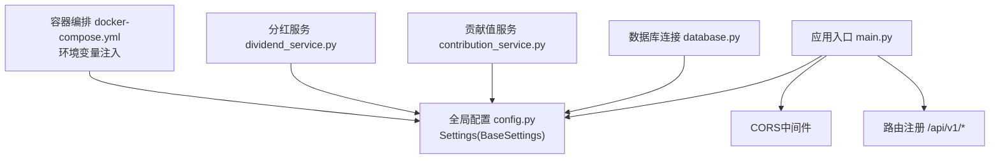
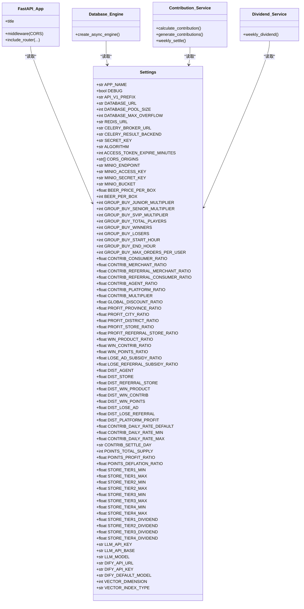
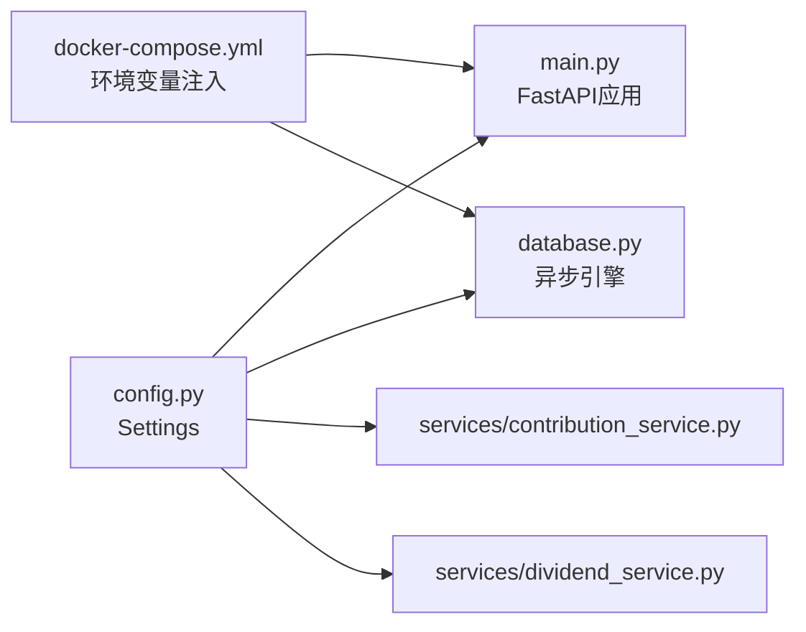

# 配置中心管理

<cite>
**本文引用的文件列表**
- [backend/app/config.py](file://backend/app/config.py)
- [backend/app/main.py](file://backend/app/main.py)
- [backend/app/database.py](file://backend/app/database.py)
- [backend/app/services/contribution_service.py](file://backend/app/services/contribution_service.py)
- [backend/app/services/dividend_service.py](file://backend/app/services/dividend_service.py)
- [docker-compose.yml](file://docker-compose.yml)
</cite>

## 目录
1. [简介](#简介)
2. [项目结构](#项目结构)
3. [核心组件](#核心组件)
4. [架构总览](#架构总览)
5. [详细组件分析](#详细组件分析)
6. [依赖关系分析](#依赖关系分析)
7. [性能与扩展性](#性能与扩展性)
8. [故障排查指南](#故障排查指南)
9. [结论](#结论)
10. [附录](#附录)

## 简介
本文件面向AIxingmu系统的“配置中心管理”，聚焦于基于Pydantic Settings的配置管理机制，涵盖：
- 环境配置、默认值设置、类型验证
- 配置文件组织结构与环境变量优先级
- 业务参数配置（拼团规则、贡献值比例、门店分红等）的管理方式
- 配置安全策略、敏感信息加密建议、配置版本控制
- 配置热更新策略与最佳实践
- 常见问题与解决方案

## 项目结构
后端采用FastAPI应用，全局配置通过单一Settings类集中管理，并在应用启动时注入到数据库连接、中间件、路由注册等模块中。关键文件如下：
- 配置定义与加载：backend/app/config.py
- 应用入口与中间件：backend/app/main.py
- 数据库连接与会话：backend/app/database.py
- 业务服务对配置的引用：backend/app/services/contribution_service.py、backend/app/services/dividend_service.py
- 容器化环境变量注入示例：docker-compose.yml

图示来源
- [backend/app/main.py:36-72](file://backend/app/main.py#L36-L72)
- [backend/app/config.py:8-144](file://backend/app/config.py#L8-L144)
- [backend/app/database.py:10-15](file://backend/app/database.py#L10-L15)
- [backend/app/services/contribution_service.py:19-36](file://backend/app/services/contribution_service.py#L19-L36)
- [backend/app/services/dividend_service.py:19-36](file://backend/app/services/dividend_service.py#L19-L36)
- [docker-compose.yml:53-68](file://docker-compose.yml#L53-L68)

章节来源
- [backend/app/main.py:1-78](file://backend/app/main.py#L1-L78)
- [backend/app/config.py:1-145](file://backend/app/config.py#L1-L145)
- [backend/app/database.py:1-40](file://backend/app/database.py#L1-L40)
- [docker-compose.yml:1-102](file://docker-compose.yml#L1-L102)

## 核心组件
- 全局配置类 Settings：继承自BaseSettings，集中声明所有系统级与业务级参数，提供默认值与类型约束，并指定.env文件路径与大小写敏感。
- 应用入口 main.py：在创建FastAPI实例、注册中间件和路由时使用settings中的配置项。
- 数据库连接 database.py：使用settings中的DATABASE_URL、池大小、溢出数量以及DEBUG开关初始化异步引擎。
- 业务服务：贡献值与分红服务广泛读取配置中的比例、乘数、结算周期等参数，驱动计算逻辑。

章节来源
- [backend/app/config.py:8-144](file://backend/app/config.py#L8-L144)
- [backend/app/main.py:36-72](file://backend/app/main.py#L36-L72)
- [backend/app/database.py:10-15](file://backend/app/database.py#L10-L15)
- [backend/app/services/contribution_service.py:19-36](file://backend/app/services/contribution_service.py#L19-L36)
- [backend/app/services/dividend_service.py:19-36](file://backend/app/services/dividend_service.py#L19-L36)

## 架构总览
配置中心以Settings为唯一权威源，遵循“代码即配置”的强类型模型。运行时由环境变量或.env覆盖默认值；生产环境推荐通过容器编排或平台配置中心注入环境变量，避免将密钥写入代码仓库。

图示来源
- [backend/app/config.py:8-144](file://backend/app/config.py#L8-L144)
- [backend/app/main.py:36-72](file://backend/app/main.py#L36-L72)
- [backend/app/database.py:10-15](file://backend/app/database.py#L10-L15)
- [backend/app/services/contribution_service.py:19-36](file://backend/app/services/contribution_service.py#L19-L36)
- [backend/app/services/dividend_service.py:19-36](file://backend/app/services/dividend_service.py#L19-L36)

## 详细组件分析

### 配置类 Settings 设计
- 组织方式：按领域分组注释块，包括应用基础、数据库/缓存/消息队列、认证、对象存储、拼团业务、贡献值分配、线下分润、用户权益、平台收支、贡献值递减兑换、积分增值、门店阶梯分红、AI Agent与RAG、向量库等。
- 默认值与类型：每个字段均给出合理默认值与明确类型，便于本地开发快速运行，同时保证生产环境可通过环境变量覆盖。
- 加载机制：通过BaseSettings自动从环境变量与.env文件加载，且开启大小写敏感。

章节来源
- [backend/app/config.py:8-144](file://backend/app/config.py#L8-L144)

### 环境变量优先级与加载顺序
- 优先级（从高到低）：进程环境变量 > .env文件 > 字段默认值。
- 大小写敏感：启用后，环境变量名必须与字段名完全一致。
- 典型覆盖场景：数据库URL、Redis URL、Celery Broker/Backend、JWT密钥、MinIO凭据、LLM/Dify凭据等均可通过环境变量覆盖。

章节来源
- [backend/app/config.py:139-141](file://backend/app/config.py#L139-L141)
- [docker-compose.yml:53-68](file://docker-compose.yml#L53-L68)

### 配置在系统中的使用点
- 应用标题与文档：main.py中使用APP_NAME作为标题。
- CORS白名单：main.py中使用CORS_ORIGINS。
- 数据库连接：database.py中使用DATABASE_URL、池大小、溢出数量与DEBUG开关。
- 业务计算：contribution_service.py与dividend_service.py使用贡献值比例、让利比例、日利率、结算周期等。

章节来源
- [backend/app/main.py:36-57](file://backend/app/main.py#L36-L57)
- [backend/app/database.py:10-15](file://backend/app/database.py#L10-L15)
- [backend/app/services/contribution_service.py:19-36](file://backend/app/services/contribution_service.py#L19-L36)
- [backend/app/services/dividend_service.py:19-36](file://backend/app/services/dividend_service.py#L19-L36)

### 业务参数配置管理

#### 拼团规则
- 定价与规格：单箱价格、每箱瓶数。
- 板块倍数：初级/高级/SVIP对应倍数。
- 场次规模：每场人数、中奖人数、失败人数、开始/结束时间、单ID单组最大订单数。
- 影响范围：拼团任务调度、下单校验、结果判定等。

章节来源
- [backend/app/config.py:42-58](file://backend/app/config.py#L42-L58)

#### 贡献值比例与计算
- 角色比例：消费者、合作商家、推荐商家、推荐消费者、代理合计、平台留存。
- 整体让利比例与贡献值乘数。
- 计算公式：让利金额=消费金额×让利比例；贡献值=让利金额×角色比例×乘数。
- 周度结算：基于剩余贡献值×日利率×7生成消费券。

章节来源
- [backend/app/config.py:60-70](file://backend/app/config.py#L60-L70)
- [backend/app/services/contribution_service.py:19-36](file://backend/app/services/contribution_service.py#L19-L36)
- [backend/app/services/contribution_service.py:162-240](file://backend/app/services/contribution_service.py#L162-L240)

#### 门店阶梯分红
- 阶梯阈值与对应分红比例。
- 用于线下门店收益分配与报表统计。

章节来源
- [backend/app/config.py:112-123](file://backend/app/config.py#L112-L123)

#### 平台收支分配
- 各渠道支出占比与平台利润留存，确保总和为100%。
- 用于财务核算与审计追踪。

章节来源
- [backend/app/config.py:90-99](file://backend/app/config.py#L90-L99)

#### AI Agent与RAG配置
- LLM API Key/Base/Model、Dify平台URL/Key/默认模型、向量维度与索引类型。
- 建议在容器中通过环境变量注入，避免明文落盘。

章节来源
- [backend/app/config.py:125-137](file://backend/app/config.py#L125-L137)

### 配置热更新策略
当前实现为进程内静态配置，未内置热更新能力。若需在线调整业务参数，可考虑以下方案：
- 进程内缓存+定时刷新：在内存中维护一份可热更新的配置快照，后台任务定期从外部配置中心拉取并替换。
- 事件驱动：监听配置变更事件（如Kafka/RabbitMQ），收到变更后重建相关服务上下文。
- 灰度发布：结合蓝绿/金丝雀发布，逐步切换新配置生效。

注意：上述为通用策略建议，非当前代码已实现功能。

[本节为概念性说明，不直接分析具体文件]

### 配置安全策略与敏感信息管理
- 最小权限原则：仅向必要进程注入所需环境变量。
- 密钥隔离：SECRET_KEY、MINIO_SECRET_KEY、LLM_API_KEY、DIFY_API_KEY等应通过容器编排或平台密钥管理服务注入，禁止硬编码或提交至仓库。
- 传输与存储：对外部服务的访问走HTTPS/TLS；日志脱敏，避免打印敏感字段。
- 审计与轮换：建立密钥轮换流程与审计记录。

章节来源
- [backend/app/config.py:28-40](file://backend/app/config.py#L28-L40)
- [backend/app/config.py:125-133](file://backend/app/config.py#L125-L133)
- [docker-compose.yml:53-68](file://docker-compose.yml#L53-L68)

### 配置版本控制
- 代码仓库：保留带默认值的Settings定义，作为“基线配置”。
- 环境差异：通过不同环境的.env或容器环境变量进行差异化覆盖，不在仓库中提交真实密钥。
- 变更记录：对重要业务参数的变更，应在变更评审中记录原因、影响面与回滚方案。

[本节为通用实践建议，不直接分析具体文件]

## 依赖关系分析

图示来源
- [backend/app/config.py:8-144](file://backend/app/config.py#L8-L144)
- [backend/app/main.py:36-72](file://backend/app/main.py#L36-L72)
- [backend/app/database.py:10-15](file://backend/app/database.py#L10-L15)
- [backend/app/services/contribution_service.py:19-36](file://backend/app/services/contribution_service.py#L19-L36)
- [backend/app/services/dividend_service.py:19-36](file://backend/app/services/dividend_service.py#L19-L36)
- [docker-compose.yml:53-68](file://docker-compose.yml#L53-L68)

章节来源
- [backend/app/config.py:8-144](file://backend/app/config.py#L8-L144)
- [backend/app/main.py:36-72](file://backend/app/main.py#L36-L72)
- [backend/app/database.py:10-15](file://backend/app/database.py#L10-L15)
- [backend/app/services/contribution_service.py:19-36](file://backend/app/services/contribution_service.py#L19-L36)
- [backend/app/services/dividend_service.py:19-36](file://backend/app/services/dividend_service.py#L19-L36)
- [docker-compose.yml:53-68](file://docker-compose.yml#L53-L68)

## 性能与扩展性
- 配置加载开销极低，仅在进程启动时解析一次。
- 若引入热更新，需注意：
  - 原子替换：使用不可变对象或读写锁保护共享状态。
  - 幂等更新：避免重复计算导致数据不一致。
  - 降级策略：当配置中心不可用时，回退到上一份已知可用配置。
- 对于高并发场景，建议将热点配置（如比例、乘数）缓存到内存，减少频繁I/O。

[本节为通用指导，不直接分析具体文件]

## 故障排查指南
- 环境变量未生效
  - 检查容器编排是否注入正确键名与值，确认大小写敏感要求。
  - 确认进程环境变量优先级高于.env文件。
- 数据库连接失败
  - 核对DATABASE_URL格式与网络可达性，检查池大小与溢出配置是否合理。
- JWT签名异常
  - 确认SECRET_KEY在不同环境保持一致，避免误用测试密钥。
- MinIO/AI服务鉴权失败
  - 核查MINIO_SECRET_KEY、LLM_API_KEY、DIFY_API_KEY是否正确注入。
- 业务计算偏差
  - 核对贡献值比例、让利比例、乘数、日利率等配置是否与预期一致。

章节来源
- [backend/app/config.py:139-141](file://backend/app/config.py#L139-L141)
- [backend/app/database.py:10-15](file://backend/app/database.py#L10-L15)
- [docker-compose.yml:53-68](file://docker-compose.yml#L53-L68)

## 结论
本项目采用基于Pydantic Settings的统一配置中心模式，具备强类型、默认值完备、环境变量覆盖清晰等优势。当前实现为进程内静态配置，适合大多数部署场景。如需在线动态调整，可按建议引入热更新机制，并结合安全与版本控制最佳实践，保障稳定与可追溯。

[本节为总结性内容，不直接分析具体文件]

## 附录

### 常用配置项速查（节选）
- 应用与接口：APP_NAME、DEBUG、API_V1_PREFIX、CORS_ORIGINS
- 数据与缓存：DATABASE_URL、DATABASE_POOL_SIZE、DATABASE_MAX_OVERFLOW、REDIS_URL
- 消息队列：CELERY_BROKER_URL、CELERY_RESULT_BACKEND
- 认证：SECRET_KEY、ALGORITHM、ACCESS_TOKEN_EXPIRE_MINUTES
- 对象存储：MINIO_ENDPOINT、MINIO_ACCESS_KEY、MINIO_SECRET_KEY、MINIO_BUCKET
- 拼团：BEER_PRICE_PER_BOX、BEER_PER_BOX、GROUP_BUY_* 系列
- 贡献值：CONTRIB_* 系列、GLOBAL_DISCOUNT_RATIO、CONTRIB_MULTIPLIER、CONTRIB_DAILY_RATE_*、CONTRIB_SETTLE_DAY
- 平台收支：DIST_* 系列
- 门店分红：STORE_TIER*_MIN/MAX、STORE_TIER*_DIVIDEND
- AI与RAG：LLM_API_KEY、LLM_API_BASE、LLM_MODEL、DIFY_API_URL、DIFY_API_KEY、DIFY_DEFAULT_MODEL、VECTOR_DIMENSION、VECTOR_INDEX_TYPE

章节来源
- [backend/app/config.py:11-137](file://backend/app/config.py#L11-L137)