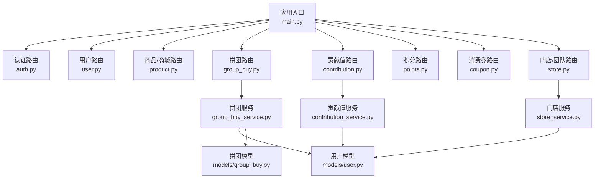
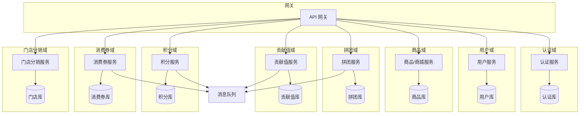
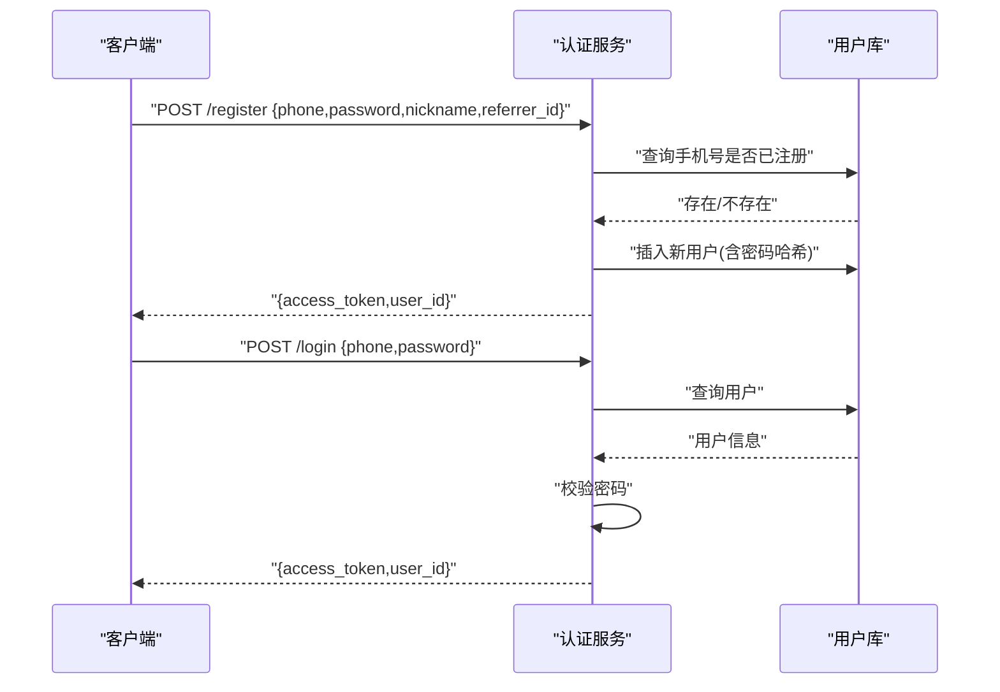
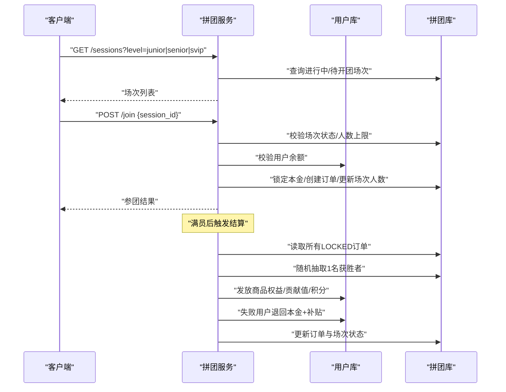
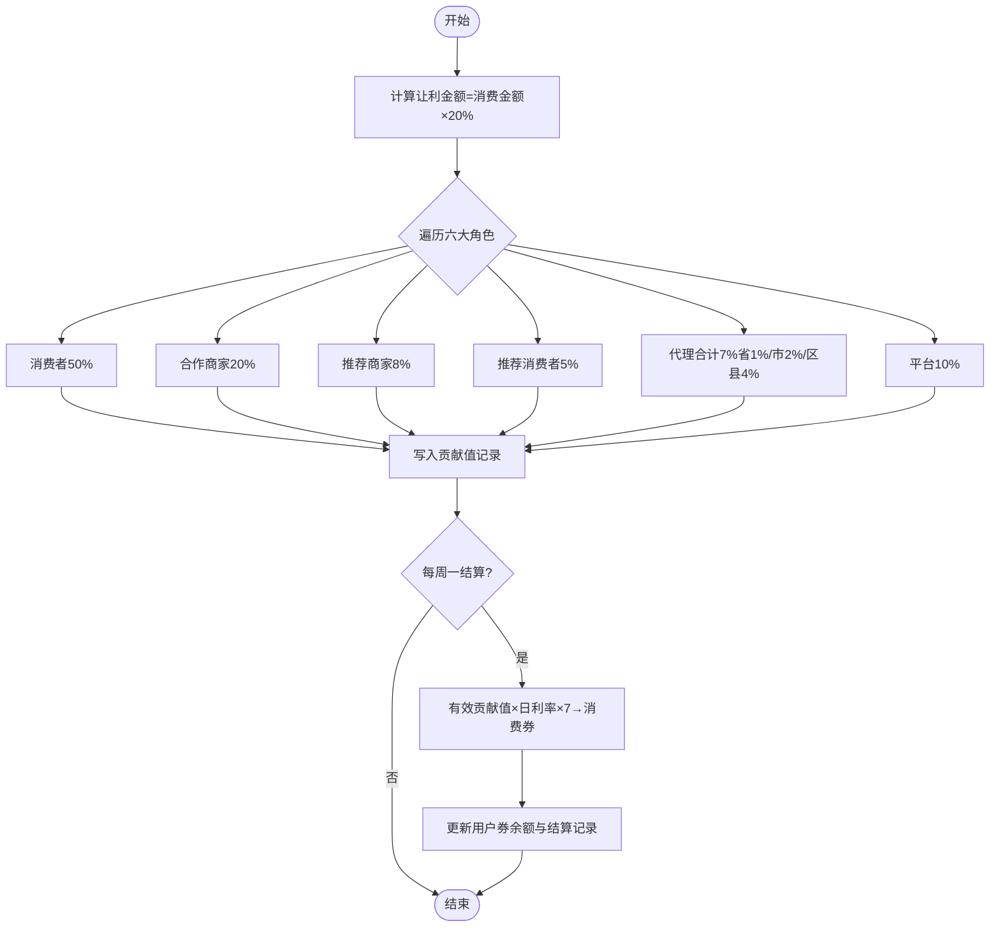
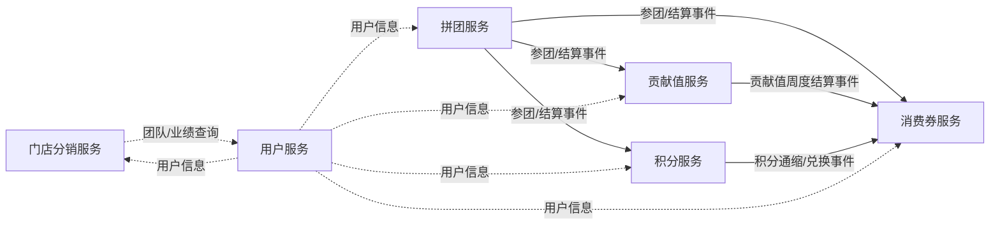
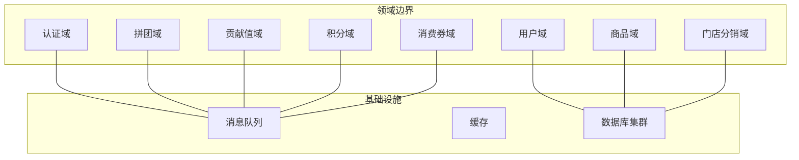

# 服务边界划分

<cite>
**本文引用的文件**   
- [backend/app/main.py](file://backend/app/main.py)
- [backend/app/config.py](file://backend/app/config.py)
- [backend/app/api/v1/auth.py](file://backend/app/api/v1/auth.py)
- [backend/app/api/v1/user.py](file://backend/app/api/v1/user.py)
- [backend/app/api/v1/product.py](file://backend/app/api/v1/product.py)
- [backend/app/api/v1/group_buy.py](file://backend/app/api/v1/group_buy.py)
- [backend/app/api/v1/contribution.py](file://backend/app/api/v1/contribution.py)
- [backend/app/api/v1/points.py](file://backend/app/api/v1/points.py)
- [backend/app/api/v1/coupon.py](file://backend/app/api/v1/coupon.py)
- [backend/app/api/v1/store.py](file://backend/app/api/v1/store.py)
- [backend/app/services/group_buy_service.py](file://backend/app/services/group_buy_service.py)
- [backend/app/services/contribution_service.py](file://backend/app/services/contribution_service.py)
- [backend/app/services/store_service.py](file://backend/app/services/store_service.py)
- [backend/app/models/user.py](file://backend/app/models/user.py)
- [backend/app/models/group_buy.py](file://backend/app/models/group_buy.py)
</cite>

## 目录
1. [引言](#引言)
2. [项目结构](#项目结构)
3. [核心组件](#核心组件)
4. [架构总览](#架构总览)
5. [详细组件分析](#详细组件分析)
6. [依赖关系分析](#依赖关系分析)
7. [性能与扩展性考虑](#性能与扩展性考虑)
8. [故障排查指南](#故障排查指南)
9. [结论](#结论)
10. [附录：拆分原则与DDD实践](#附录拆分原则与ddd实践)

## 引言
本文件面向AIxingmu系统，给出基于业务领域的微服务边界划分方案。当前代码为单体FastAPI应用，按领域划分为认证、用户、商品商城、拼团电商、贡献值经济、积分、消费券、门店分销等模块。本文在保持现有实现可演进的前提下，明确各服务的职责范围、数据所有权、API边界、服务间依赖与数据流向，并给出避免循环依赖与服务耦合的策略，以及DDD与粒度控制建议。

## 项目结构
当前后端采用“路由层-服务层-模型层”的清晰分层，入口注册各业务路由，配置集中管理，领域服务封装核心规则，模型定义数据实体与关系。

图示来源
- [backend/app/main.py:58-69](file://backend/app/main.py#L58-L69)
- [backend/app/api/v1/group_buy.py:1-65](file://backend/app/api/v1/group_buy.py#L1-L65)
- [backend/app/api/v1/contribution.py:1-27](file://backend/app/api/v1/contribution.py#L1-L27)
- [backend/app/api/v1/store.py:1-48](file://backend/app/api/v1/store.py#L1-L48)
- [backend/app/services/group_buy_service.py:1-348](file://backend/app/services/group_buy_service.py#L1-L348)
- [backend/app/services/contribution_service.py:1-261](file://backend/app/services/contribution_service.py#L1-L261)
- [backend/app/services/store_service.py:1-161](file://backend/app/services/store_service.py#L1-L161)
- [backend/app/models/user.py:1-93](file://backend/app/models/user.py#L1-L93)
- [backend/app/models/group_buy.py:1-158](file://backend/app/models/group_buy.py#L1-L158)

章节来源
- [backend/app/main.py:1-75](file://backend/app/main.py#L1-L75)
- [backend/app/config.py:1-136](file://backend/app/config.py#L1-L136)

## 核心组件
- 认证服务（Auth）
  - 职责：注册、登录、签发访问令牌；校验手机号唯一性；密码哈希与验证。
  - 数据所有权：用户主键、手机号、密码哈希、推荐人ID。
  - API边界：/api/v1/auth/register, /api/v1/auth/login。
  - 依赖：用户模型、JWT工具。
- 用户服务（User）
  - 职责：查询当前用户信息、钱包概览（余额、贡献值、积分、消费券）。
  - 数据所有权：用户基本信息、钱包字段、代理/门店关联。
  - API边界：/api/v1/user/me, /api/v1/user/wallet。
  - 依赖：用户模型。
- 商品/商城服务（Product/Mall）
  - 职责：商品列表、详情、分类筛选、分页。
  - 数据所有权：商品、分类、状态。
  - API边界：/api/v1/product/list, /api/v1/product/{id}。
  - 依赖：商品模型。
- 拼团电商服务（GroupBuy）
  - 职责：场次创建/查询、参团、订单查询、结算（随机抽中、权益发放、失败补贴）。
  - 数据所有权：场次、订单、每日统计。
  - API边界：/api/v1/group-buy/sessions, /join, /orders, /sessions/{id}。
  - 依赖：拼团模型、用户模型、全局配置（价格与比例）、贡献值与积分服务（通过事件或后续跨服务调用）。
- 贡献值经济服务（Contribution）
  - 职责：统一贡献值核算公式、多角色分配、周度递减兑换、全网贡献值汇总。
  - 数据所有权：贡献值记录、周度结算、全局统计。
  - API边界：/api/v1/contribution/my, /total。
  - 依赖：用户模型、贡献值模型、全局配置。
- 积分服务（Points）
  - 职责：积分池状态、积分兑换消费券（通缩与利润池逻辑由服务层处理）。
  - 数据所有权：积分记录、池状态。
  - API边界：/api/v1/points/pool, /convert。
  - 依赖：用户模型、积分模型、全局配置。
- 消费券服务（Coupon）
  - 职责：用户消费券持有与使用（当前提供查询）。
  - 数据所有权：消费券记录、用户券余额。
  - API边界：/api/v1/coupon/my。
  - 依赖：用户模型、消费券模型。
- 门店分销服务（Store）
  - 职责：门店管理、团队层级成员、月度业绩与排名、四级分润基础数据。
  - 数据所有权：门店、团队成员、月度业绩。
  - API边界：/api/v1/store/list, /ranking, /team。
  - 依赖：门店模型、用户模型、全局配置。

章节来源
- [backend/app/api/v1/auth.py:1-43](file://backend/app/api/v1/auth.py#L1-L43)
- [backend/app/api/v1/user.py:1-37](file://backend/app/api/v1/user.py#L1-L37)
- [backend/app/api/v1/product.py:1-41](file://backend/app/api/v1/product.py#L1-L41)
- [backend/app/api/v1/group_buy.py:1-65](file://backend/app/api/v1/group_buy.py#L1-L65)
- [backend/app/api/v1/contribution.py:1-27](file://backend/app/api/v1/contribution.py#L1-L27)
- [backend/app/api/v1/points.py:1-31](file://backend/app/api/v1/points.py#L1-L31)
- [backend/app/api/v1/coupon.py:1-20](file://backend/app/api/v1/coupon.py#L1-L20)
- [backend/app/api/v1/store.py:1-48](file://backend/app/api/v1/store.py#L1-L48)
- [backend/app/services/group_buy_service.py:1-348](file://backend/app/services/group_buy_service.py#L1-L348)
- [backend/app/services/contribution_service.py:1-261](file://backend/app/services/contribution_service.py#L1-L261)
- [backend/app/services/store_service.py:1-161](file://backend/app/services/store_service.py#L1-L161)
- [backend/app/models/user.py:1-93](file://backend/app/models/user.py#L1-L93)
- [backend/app/models/group_buy.py:1-158](file://backend/app/models/group_buy.py#L1-L158)

## 架构总览
从单体到微服务的演进路径：以领域为边界拆分为独立服务，每个服务拥有专属数据库与API，服务间通过消息队列或HTTP/gRPC进行异步/同步通信，避免直接共享数据库。

图示来源
- [backend/app/main.py:58-69](file://backend/app/main.py#L58-L69)
- [backend/app/services/group_buy_service.py:1-348](file://backend/app/services/group_buy_service.py#L1-L348)
- [backend/app/services/contribution_service.py:1-261](file://backend/app/services/contribution_service.py#L1-L261)
- [backend/app/services/store_service.py:1-161](file://backend/app/services/store_service.py#L1-L161)

## 详细组件分析

### 认证服务（Auth）
- 职责边界
  - 账号生命周期：注册、登录、鉴权。
  - 安全：密码哈希、令牌签发与校验。
- 数据所有权
  - 用户主键、手机号、密码哈希、推荐人ID。
- API边界
  - POST /api/v1/auth/register
  - POST /api/v1/auth/login
- 关键流程（序列图）

图示来源
- [backend/app/api/v1/auth.py:14-42](file://backend/app/api/v1/auth.py#L14-L42)
- [backend/app/models/user.py:26-71](file://backend/app/models/user.py#L26-L71)

章节来源
- [backend/app/api/v1/auth.py:1-43](file://backend/app/api/v1/auth.py#L1-L43)
- [backend/app/models/user.py:1-93](file://backend/app/models/user.py#L1-L93)

### 用户服务（User）
- 职责边界
  - 用户信息查询、钱包概览聚合。
- 数据所有权
  - 用户基本信息、钱包四大资产字段、代理/门店关联。
- API边界
  - GET /api/v1/user/me
  - GET /api/v1/user/wallet
- 依赖
  - 仅依赖用户模型，不直接读写其他领域数据。

章节来源
- [backend/app/api/v1/user.py:1-37](file://backend/app/api/v1/user.py#L1-L37)
- [backend/app/models/user.py:1-93](file://backend/app/models/user.py#L1-L93)

### 商品/商城服务（Product/Mall）
- 职责边界
  - 商品目录浏览、详情查询、分类筛选与分页。
- 数据所有权
  - 商品、分类、状态、排序等。
- API边界
  - GET /api/v1/product/list
  - GET /api/v1/product/{id}
- 依赖
  - 仅依赖商品模型。

章节来源
- [backend/app/api/v1/product.py:1-41](file://backend/app/api/v1/product.py#L1-L41)

### 拼团电商服务（GroupBuy）
- 职责边界
  - 场次管理（固定/自定义开团）、参团校验、订单管理、满员判定与结算、权益发放（商品权益、贡献值、积分）、失败补贴（广告补贴、推荐人补贴）。
- 数据所有权
  - 场次、订单、每日统计。
- API边界
  - GET /api/v1/group-buy/sessions
  - POST /api/v1/group-buy/join
  - GET /api/v1/group-buy/orders
  - GET /api/v1/group-buy/sessions/{session_id}
- 关键流程（序列图）

图示来源
- [backend/app/api/v1/group_buy.py:15-64](file://backend/app/api/v1/group_buy.py#L15-L64)
- [backend/app/services/group_buy_service.py:92-321](file://backend/app/services/group_buy_service.py#L92-L321)
- [backend/app/models/group_buy.py:42-131](file://backend/app/models/group_buy.py#L42-L131)
- [backend/app/models/user.py:26-93](file://backend/app/models/user.py#L26-L93)

章节来源
- [backend/app/api/v1/group_buy.py:1-65](file://backend/app/api/v1/group_buy.py#L1-L65)
- [backend/app/services/group_buy_service.py:1-348](file://backend/app/services/group_buy_service.py#L1-L348)
- [backend/app/models/group_buy.py:1-158](file://backend/app/models/group_buy.py#L1-L158)

### 贡献值经济服务（Contribution）
- 职责边界
  - 统一贡献值核算公式、多角色分配（消费者、商家、推荐商家、推荐消费者、代理、平台）、周度递减兑换、全网贡献值汇总。
- 数据所有权
  - 贡献值记录、周度结算、全局统计。
- API边界
  - GET /api/v1/contribution/my
  - GET /api/v1/contribution/total
- 关键流程（流程图）

图示来源
- [backend/app/services/contribution_service.py:29-143](file://backend/app/services/contribution_service.py#L29-L143)
- [backend/app/services/contribution_service.py:162-240](file://backend/app/services/contribution_service.py#L162-L240)
- [backend/app/config.py:60-105](file://backend/app/config.py#L60-L105)

章节来源
- [backend/app/api/v1/contribution.py:1-27](file://backend/app/api/v1/contribution.py#L1-L27)
- [backend/app/services/contribution_service.py:1-261](file://backend/app/services/contribution_service.py#L1-L261)
- [backend/app/config.py:60-105](file://backend/app/config.py#L60-L105)

### 积分服务（Points）
- 职责边界
  - 积分池状态查询、积分兑换消费券（通缩与利润池逻辑在服务层处理）。
- 数据所有权
  - 积分记录、池状态。
- API边界
  - GET /api/v1/points/pool
  - POST /api/v1/points/convert
- 依赖
  - 用户模型、积分模型、全局配置。

章节来源
- [backend/app/api/v1/points.py:1-31](file://backend/app/api/v1/points.py#L1-L31)

### 消费券服务（Coupon）
- 职责边界
  - 用户消费券持有与使用（当前提供查询）。
- 数据所有权
  - 消费券记录、用户券余额。
- API边界
  - GET /api/v1/coupon/my
- 依赖
  - 用户模型、消费券模型。

章节来源
- [backend/app/api/v1/coupon.py:1-20](file://backend/app/api/v1/coupon.py#L1-L20)

### 门店分销服务（Store）
- 职责边界
  - 门店管理、团队层级成员、月度业绩与排名、四级分润基础数据。
- 数据所有权
  - 门店、团队成员、月度业绩。
- API边界
  - GET /api/v1/store/list
  - GET /api/v1/store/ranking
  - GET /api/v1/store/team
- 依赖
  - 门店模型、用户模型、全局配置。

章节来源
- [backend/app/api/v1/store.py:1-48](file://backend/app/api/v1/store.py#L1-L48)
- [backend/app/services/store_service.py:1-161](file://backend/app/services/store_service.py#L1-L161)

## 依赖关系分析
- 当前单体内的依赖方向
  - 路由层 → 服务层 → 模型层
  - 拼团服务依赖用户与拼团模型；贡献值服务依赖用户与贡献值模型；门店服务依赖用户与门店模型。
- 微服务化后的依赖方向（建议）
  - 服务间通过消息队列或HTTP/gRPC交互，禁止跨服务直连数据库。
  - 拼团服务作为事件生产者，向贡献值、积分、消费券服务发送领域事件；这些服务订阅事件并更新各自数据。
- 潜在循环依赖规避
  - 将“贡献值生成”和“积分发放”从拼团服务中解耦为事件驱动，避免拼团服务直接依赖贡献值/积分服务内部实现。
  - 使用领域事件总线（如Celery/RabbitMQ）承载跨服务调用。

图示来源
- [backend/app/services/group_buy_service.py:183-321](file://backend/app/services/group_buy_service.py#L183-L321)
- [backend/app/services/contribution_service.py:162-240](file://backend/app/services/contribution_service.py#L162-L240)
- [backend/app/services/store_service.py:101-133](file://backend/app/services/store_service.py#L101-L133)

章节来源
- [backend/app/services/group_buy_service.py:1-348](file://backend/app/services/group_buy_service.py#L1-L348)
- [backend/app/services/contribution_service.py:1-261](file://backend/app/services/contribution_service.py#L1-L261)
- [backend/app/services/store_service.py:1-161](file://backend/app/services/store_service.py#L1-L161)

## 性能与扩展性考虑
- 并发与锁
  - 参团需对场次人数与用户参与次数加行级锁或分布式锁，防止超卖与重复参团。
- 幂等与重试
  - 参团与结算接口需支持幂等键（如订单号），结合消息队列重试机制保证最终一致性。
- 读写分离与缓存
  - 商品列表、场次列表等读多写少场景引入Redis缓存；热点场次与排行榜使用缓存加速。
- 批处理与异步
  - 贡献值周度结算、积分通缩、门店排名等重计算任务通过定时任务与异步队列执行。
- 水平扩展
  - 各服务无状态部署，按QPS与CPU指标弹性扩缩容；数据库按领域分库分表。

[本节为通用指导，无需源码引用]

## 故障排查指南
- 常见问题定位
  - 参团失败：检查场次状态、人数上限、用户余额、单组参与次数限制。
  - 结算异常：核对订单数量与场次人数匹配、随机抽中逻辑、权益发放流水。
  - 贡献值周度结算：确认周起始时间、日利率配置、用户贡献值剩余值聚合。
  - 积分兑换：检查积分池状态、通缩比例、兑换阈值。
- 日志与追踪
  - 请求链路日志、钱包流水明细、事件总线投递与消费日志。
- 回滚与补偿
  - 事务内先落库再发事件；若下游消费失败，通过死信队列与人工干预补偿。

章节来源
- [backend/app/services/group_buy_service.py:92-321](file://backend/app/services/group_buy_service.py#L92-L321)
- [backend/app/services/contribution_service.py:162-240](file://backend/app/services/contribution_service.py#L162-L240)
- [backend/app/api/v1/points.py:19-31](file://backend/app/api/v1/points.py#L19-L31)

## 结论
通过将认证、用户、商品、拼团、贡献值、积分、消费券、门店分销等按领域拆分为独立服务，可实现清晰的职责边界与数据所有权，降低耦合度，提升可扩展性与可维护性。配合事件驱动与异步任务，可有效避免循环依赖，保障最终一致性与高可用。

[本节为总结，无需源码引用]

## 附录：拆分原则与DDD实践
- 拆分原则
  - 单一职责：每个服务只负责一个业务能力闭环。
  - 数据自治：每个服务独占其数据库，禁止跨服务直连数据库。
  - 契约优先：对外暴露稳定API与领域事件契约。
  - 渐进式拆分：先从读多写少的模块入手，逐步迁移复杂交易链路。
- DDD应用
  - 聚合根：用户、场次、订单、贡献值记录、积分记录、门店等。
  - 领域服务：拼团结算、贡献值核算、积分通缩、门店分红等。
  - 领域事件：参团成功、结算完成、贡献值生成、积分兑换等。
- 粒度控制
  - 粗粒度：按业务域划分（如拼团域、贡献值域）。
  - 细粒度：在超大域内再拆分子域（如拼团域中的场次调度子域、结算子域）。
- 服务架构图（概念）

[此图为概念性示意，无需源码引用]