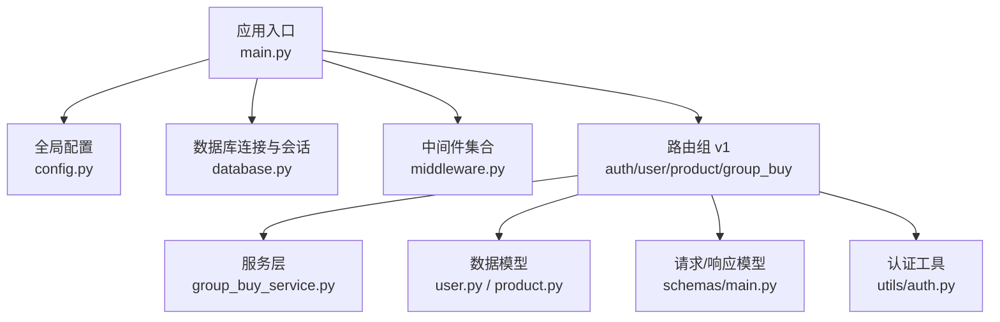
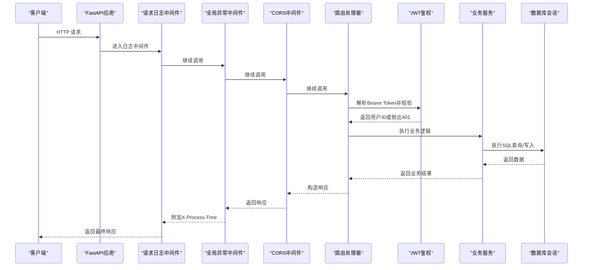
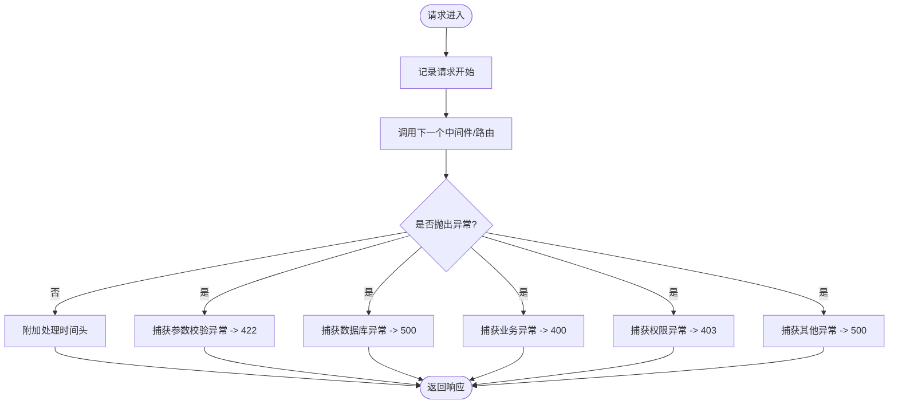
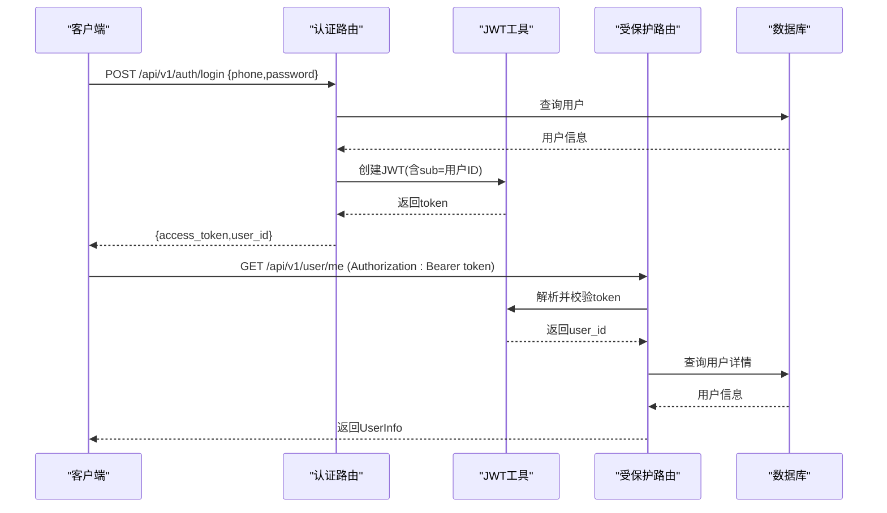
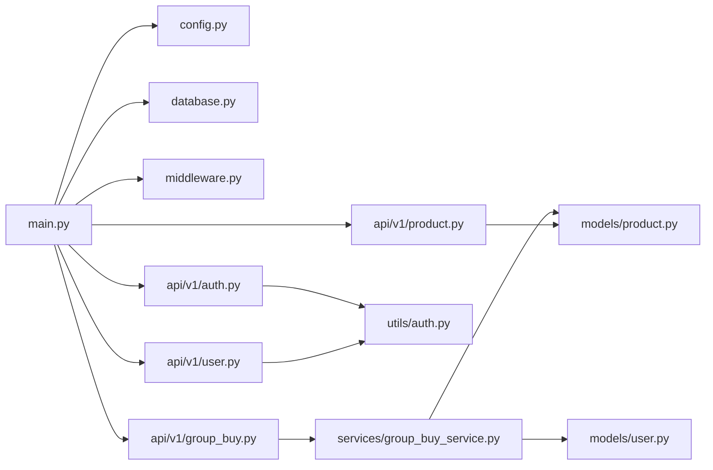

# RESTful API同步通信

<cite>
**本文引用的文件**   
- [backend/app/main.py](file://backend/app/main.py)
- [backend/app/config.py](file://backend/app/config.py)
- [backend/app/database.py](file://backend/app/database.py)
- [backend/app/middleware.py](file://backend/app/middleware.py)
- [backend/app/utils/auth.py](file://backend/app/utils/auth.py)
- [backend/app/schemas/main.py](file://backend/app/schemas/main.py)
- [backend/app/api/v1/auth.py](file://backend/app/api/v1/auth.py)
- [backend/app/api/v1/user.py](file://backend/app/api/v1/user.py)
- [backend/app/api/v1/product.py](file://backend/app/api/v1/product.py)
- [backend/app/api/v1/group_buy.py](file://backend/app/api/v1/group_buy.py)
- [backend/app/services/group_buy_service.py](file://backend/app/services/group_buy_service.py)
- [backend/app/models/user.py](file://backend/app/models/user.py)
- [backend/app/models/product.py](file://backend/app/models/product.py)
</cite>

## 目录
1. [简介](#简介)
2. [项目结构](#项目结构)
3. [核心组件](#核心组件)
4. [架构总览](#架构总览)
5. [详细组件分析](#详细组件分析)
6. [依赖关系分析](#依赖关系分析)
7. [性能考量](#性能考量)
8. [故障排查指南](#故障排查指南)
9. [结论](#结论)
10. [附录](#附录)

## 简介
本文件面向AIxingmu系统的RESTful API同步通信机制，聚焦于FastAPI框架的HTTP请求响应处理流程，包括路由注册、中间件处理、请求验证与响应格式化；统一错误处理机制、状态码规范、API版本管理策略；CORS跨域配置、请求头处理、参数验证规则；JWT认证在API层的实现、权限控制中间件、请求限流机制（现状与建议）；并提供典型API调用示例、错误处理最佳实践与性能优化建议。

## 项目结构
后端采用分层组织：入口应用装配、配置、数据库会话、中间件、API路由、服务层、数据模型与Pydantic Schema。API以“/api/v1”为前缀进行版本化管理，各业务模块独立路由文件，通过主应用集中注册。

图示来源
- [backend/app/main.py:36-73](file://backend/app/main.py#L36-L73)
- [backend/app/config.py:8-40](file://backend/app/config.py#L8-L40)
- [backend/app/database.py:10-21](file://backend/app/database.py#L10-L21)
- [backend/app/middleware.py:16-121](file://backend/app/middleware.py#L16-L121)
- [backend/app/api/v1/auth.py:15-70](file://backend/app/api/v1/auth.py#L15-L70)
- [backend/app/api/v1/user.py:11-37](file://backend/app/api/v1/user.py#L11-L37)
- [backend/app/api/v1/product.py:12-41](file://backend/app/api/v1/product.py#L12-L41)
- [backend/app/api/v1/group_buy.py:12-65](file://backend/app/api/v1/group_buy.py#L12-L65)
- [backend/app/services/group_buy_service.py:17-348](file://backend/app/services/group_buy_service.py#L17-L348)
- [backend/app/models/user.py:26-72](file://backend/app/models/user.py#L26-L72)
- [backend/app/models/product.py:30-73](file://backend/app/models/product.py#L30-L73)
- [backend/app/schemas/main.py:10-46](file://backend/app/schemas/main.py#L10-L46)

章节来源
- [backend/app/main.py:36-73](file://backend/app/main.py#L36-L73)
- [backend/app/config.py:8-40](file://backend/app/config.py#L8-L40)

## 核心组件
- 应用装配与生命周期
  - FastAPI实例化、文档端点、lifespan启动时建表与关闭释放资源。
  - 中间件注册顺序：请求日志→全局异常→CORS。
  - 路由按“/api/v1”前缀分组注册，包含认证、用户、商品、拼团等。
- 配置中心
  - 使用pydantic-settings集中管理环境变量与默认值，涵盖数据库、Redis、Celery、JWT、CORS、MinIO及业务常量。
- 数据库会话
  - 异步引擎与会话工厂，提供FastAPI依赖注入get_db，自动提交/回滚与关闭。
- 中间件
  - 全局异常处理：将不同异常映射到统一JSON结构与HTTP状态码。
  - 请求日志：记录方法、URL、客户端IP、状态码与耗时。
  - CORS：生产建议使用内置CORSMiddleware，已启用并允许指定来源与凭据。
- 认证与鉴权
  - JWT生成/解码、密码哈希/校验、从Bearer Token提取当前用户ID。
- 请求/响应模型
  - Pydantic定义输入校验与输出序列化，含认证、用户、商品、拼团等。
- 路由与控制器
  - 认证：注册、登录返回Token。
  - 用户：获取个人信息与钱包信息（需鉴权）。
  - 商品：列表分页查询、详情查询。
  - 拼团：场次列表、参团、我的订单、场次详情。
- 服务层
  - 拼团核心流程：开团、参团、满员判定、结果结算、权益发放。

章节来源
- [backend/app/main.py:25-73](file://backend/app/main.py#L25-L73)
- [backend/app/config.py:8-40](file://backend/app/config.py#L8-L40)
- [backend/app/database.py:10-40](file://backend/app/database.py#L10-L40)
- [backend/app/middleware.py:16-121](file://backend/app/middleware.py#L16-L121)
- [backend/app/utils/auth.py:12-50](file://backend/app/utils/auth.py#L12-L50)
- [backend/app/schemas/main.py:10-46](file://backend/app/schemas/main.py#L10-L46)
- [backend/app/api/v1/auth.py:29-70](file://backend/app/api/v1/auth.py#L29-L70)
- [backend/app/api/v1/user.py:14-37](file://backend/app/api/v1/user.py#L14-L37)
- [backend/app/api/v1/product.py:15-41](file://backend/app/api/v1/product.py#L15-L41)
- [backend/app/api/v1/group_buy.py:15-65](file://backend/app/api/v1/group_buy.py#L15-L65)
- [backend/app/services/group_buy_service.py:92-181](file://backend/app/services/group_buy_service.py#L92-L181)

## 架构总览
下图展示一次受保护的API请求在系统中的完整流转路径，包括中间件、认证、路由、服务与数据库交互。

图示来源
- [backend/app/main.py:45-73](file://backend/app/main.py#L45-L73)
- [backend/app/middleware.py:16-121](file://backend/app/middleware.py#L16-L121)
- [backend/app/utils/auth.py:39-50](file://backend/app/utils/auth.py#L39-L50)
- [backend/app/api/v1/user.py:14-37](file://backend/app/api/v1/user.py#L14-L37)
- [backend/app/database.py:29-40](file://backend/app/database.py#L29-L40)

## 详细组件分析

### 路由注册与版本管理
- 版本前缀：所有业务API统一挂载在“/api/v1”，便于后续演进至v2。
- 路由分组：认证、用户、商品、拼团、贡献值、积分、消费券、门店、管理后台、智能体等分别注册。
- 健康检查：提供“/health”用于存活探针。

章节来源
- [backend/app/main.py:59-78](file://backend/app/main.py#L59-L78)

### 中间件处理链
- 执行顺序（添加顺序相反）：
  1) 请求日志中间件（最先执行）
  2) 全局异常处理中间件
  3) CORS中间件
- 功能要点：
  - 请求日志：记录方法、URL、客户端IP、状态码与耗时。
  - 全局异常：将参数校验失败、数据库错误、业务错误、权限错误、未处理异常统一转换为JSON响应，并设置对应HTTP状态码。
  - CORS：允许指定来源、携带凭据、方法与头部。

图示来源
- [backend/app/middleware.py:16-80](file://backend/app/middleware.py#L16-L80)
- [backend/app/middleware.py:82-121](file://backend/app/middleware.py#L82-L121)

章节来源
- [backend/app/main.py:45-57](file://backend/app/main.py#L45-L57)
- [backend/app/middleware.py:16-121](file://backend/app/middleware.py#L16-L121)

### 请求验证与响应格式化
- 请求验证：基于Pydantic模型对入参进行强类型校验与约束（如必填、长度、范围）。
- 响应格式化：
  - 成功响应：部分接口返回标准结构{code, message, data}，部分直接返回对象或字典。
  - 错误响应：由全局异常中间件统一包装为{code, message, detail?}。
- 建议：统一所有接口的响应结构为标准格式，便于前端一致化处理。

章节来源
- [backend/app/schemas/main.py:10-46](file://backend/app/schemas/main.py#L10-L46)
- [backend/app/middleware.py:28-79](file://backend/app/middleware.py#L28-L79)
- [backend/app/api/v1/group_buy.py:26-37](file://backend/app/api/v1/group_buy.py#L26-L37)

### CORS跨域配置与请求头处理
- 配置项：来源白名单、是否允许凭据、方法与头部通配策略。
- 行为：在响应中附加CORS相关响应头，支持预检请求。
- 建议：生产环境严格限制allow_origins，避免使用“*”。

章节来源
- [backend/app/config.py:33-34](file://backend/app/config.py#L33-L34)
- [backend/app/main.py:51-57](file://backend/app/main.py#L51-L57)

### JWT认证与权限控制
- 认证流程：
  - 登录/注册成功后签发JWT，包含用户标识与过期时间。
  - 受保护接口通过Depends注入get_current_user_id，从Authorization: Bearer <token>解析用户ID。
- 鉴权策略：
  - 当前实现基于用户ID判断上下文，未实现细粒度角色/权限控制。
  - 建议在中间件或依赖中引入角色校验与资源访问控制。
- 安全建议：
  - 使用HTTPS传输。
  - 合理设置令牌有效期与刷新机制。
  - 敏感操作增加二次确认或风控校验。

图示来源
- [backend/app/api/v1/auth.py:61-70](file://backend/app/api/v1/auth.py#L61-L70)
- [backend/app/utils/auth.py:24-50](file://backend/app/utils/auth.py#L24-L50)
- [backend/app/api/v1/user.py:14-22](file://backend/app/api/v1/user.py#L14-L22)

章节来源
- [backend/app/utils/auth.py:12-50](file://backend/app/utils/auth.py#L12-L50)
- [backend/app/api/v1/auth.py:29-70](file://backend/app/api/v1/auth.py#L29-L70)
- [backend/app/api/v1/user.py:14-37](file://backend/app/api/v1/user.py#L14-L37)

### 参数验证规则
- 认证请求：手机号、密码（最小长度）、可选昵称与推荐人ID。
- 商品列表：分页参数page≥1，size∈[1,100]。
- 拼团参团：session_id必填。
- 建议：为所有输入字段补充描述与约束，提升可维护性与文档质量。

章节来源
- [backend/app/schemas/main.py:10-24](file://backend/app/schemas/main.py#L10-L24)
- [backend/app/api/v1/product.py:15-31](file://backend/app/api/v1/product.py#L15-L31)
- [backend/app/api/v1/group_buy.py:26-37](file://backend/app/api/v1/group_buy.py#L26-L37)

### 统一错误处理与状态码规范
- 参数校验失败：422，detail包含具体错误明细。
- 业务逻辑错误：400，message为人类可读提示。
- 权限不足：403。
- 数据库错误：500，detail包含原始错误。
- 未处理异常：500，detail包含堆栈信息。
- 建议：对外暴露的错误消息应脱敏，避免泄露内部细节。

章节来源
- [backend/app/middleware.py:28-79](file://backend/app/middleware.py#L28-L79)

### API版本管理策略
- 当前策略：通过路由前缀“/api/v1”实现版本隔离。
- 建议：
  - 重大变更升级至“/api/v2”，保持向后兼容。
  - 在响应头或文档中标注版本信息。
  - 废弃接口保留过渡期并给出迁移指引。

章节来源
- [backend/app/main.py:59-73](file://backend/app/main.py#L59-L73)

### 请求限流机制（现状与建议）
- 现状：代码库中未发现请求限流实现。
- 建议：
  - 在网关层（Nginx/反向代理）实施IP级限流。
  - 在应用层引入速率限制中间件（如基于Redis的滑动窗口）。
  - 针对敏感接口（登录、参团）设置更严格的阈值与验证码。

章节来源
- [backend/app/main.py:45-57](file://backend/app/main.py#L45-L57)

### 典型API调用示例
- 注册
  - 方法：POST
  - 路径：/api/v1/auth/register
  - 请求体：手机号、密码、可选昵称与推荐人ID
  - 响应：access_token、token_type、user_id
- 登录
  - 方法：POST
  - 路径：/api/v1/auth/login
  - 请求体：手机号、密码
  - 响应：access_token、token_type、user_id
- 获取当前用户信息（需鉴权）
  - 方法：GET
  - 路径：/api/v1/user/me
  - 请求头：Authorization: Bearer <token>
  - 响应：用户基本信息
- 获取钱包信息（需鉴权）
  - 方法：GET
  - 路径：/api/v1/user/wallet
  - 请求头：Authorization: Bearer <token>
  - 响应：余额、贡献值、积分、消费券余额
- 商品列表（分页）
  - 方法：GET
  - 路径：/api/v1/product/list?page=1&size=20&category=drink
  - 响应：total、page、size、items
- 参与拼团（需鉴权）
  - 方法：POST
  - 路径：/api/v1/group-buy/join
  - 请求体：session_id
  - 响应：参团结果（订单号、金额、剩余余额、是否满员）

章节来源
- [backend/app/api/v1/auth.py:29-70](file://backend/app/api/v1/auth.py#L29-L70)
- [backend/app/api/v1/user.py:14-37](file://backend/app/api/v1/user.py#L14-L37)
- [backend/app/api/v1/product.py:15-41](file://backend/app/api/v1/product.py#L15-L41)
- [backend/app/api/v1/group_buy.py:26-37](file://backend/app/api/v1/group_buy.py#L26-L37)

### 错误处理最佳实践
- 明确区分系统错误与业务错误，避免向客户端暴露内部堆栈。
- 为关键路径添加结构化日志，便于追踪问题。
- 对幂等接口增加去重键与重试保护。
- 对高并发热点接口增加缓存与降级策略。

章节来源
- [backend/app/middleware.py:16-80](file://backend/app/middleware.py#L16-L80)

## 依赖关系分析
- 应用入口依赖配置、数据库、中间件与各路由模块。
- 路由依赖服务层与数据模型，服务层依赖配置与模型。
- 认证工具被多个路由复用。
- 无循环依赖迹象，耦合度适中。

图示来源
- [backend/app/main.py:36-73](file://backend/app/main.py#L36-L73)
- [backend/app/api/v1/auth.py:15-70](file://backend/app/api/v1/auth.py#L15-L70)
- [backend/app/api/v1/user.py:11-37](file://backend/app/api/v1/user.py#L11-L37)
- [backend/app/api/v1/product.py:12-41](file://backend/app/api/v1/product.py#L12-L41)
- [backend/app/api/v1/group_buy.py:12-65](file://backend/app/api/v1/group_buy.py#L12-L65)
- [backend/app/services/group_buy_service.py:17-348](file://backend/app/services/group_buy_service.py#L17-L348)
- [backend/app/models/user.py:26-72](file://backend/app/models/user.py#L26-L72)
- [backend/app/models/product.py:30-73](file://backend/app/models/product.py#L30-L73)

章节来源
- [backend/app/main.py:36-73](file://backend/app/main.py#L36-L73)

## 性能考量
- 数据库连接池：通过pool_size与max_overflow控制并发能力，建议根据负载调优。
- 异步I/O：全链路使用异步会话与查询，减少阻塞。
- 索引优化：对用户角色、推荐关系、门店关联等建立索引，提升查询效率。
- 分页与过滤：商品列表与订单查询使用分页与条件过滤，降低单次负载。
- 缓存建议：热点数据（如活跃场次、商品列表）引入Redis缓存，注意一致性。
- 限流与熔断：在高并发场景下增加限流与熔断保护，防止雪崩。

章节来源
- [backend/app/config.py:16-20](file://backend/app/config.py#L16-L20)
- [backend/app/database.py:10-21](file://backend/app/database.py#L10-L21)
- [backend/app/models/user.py:67-71](file://backend/app/models/user.py#L67-L71)
- [backend/app/models/product.py:68-72](file://backend/app/models/product.py#L68-L72)
- [backend/app/api/v1/product.py:15-31](file://backend/app/api/v1/product.py#L15-L31)
- [backend/app/api/v1/group_buy.py:15-23](file://backend/app/api/v1/group_buy.py#L15-L23)

## 故障排查指南
- 常见问题定位：
  - 参数校验失败：查看422响应中的detail字段，核对字段约束。
  - 认证失败：检查Authorization头是否正确携带Bearer Token，确认Token未过期。
  - 数据库错误：关注500响应中的detail，结合日志定位SQL或连接问题。
  - 权限不足：确认当前用户角色是否具备访问权限。
- 日志与监控：
  - 利用请求日志中间件输出的方法、URL、状态码与耗时进行性能分析。
  - 在全局异常中间件中记录异常堆栈，便于快速定位。
- 建议：
  - 接入APM与分布式追踪，完善指标采集。
  - 对关键路径增加告警阈值。

章节来源
- [backend/app/middleware.py:82-121](file://backend/app/middleware.py#L82-L121)
- [backend/app/middleware.py:28-79](file://backend/app/middleware.py#L28-L79)

## 结论
AIxingmu后端基于FastAPI构建了清晰的RESTful API同步通信体系：通过统一的路由版本前缀、中间件链、Pydantic参数校验与全局异常处理，实现了稳定可靠的HTTP请求响应流程。JWT认证在API层落地，配合依赖注入完成用户上下文解析。当前尚未实现请求限流与细粒度权限控制，建议在生产环境中补齐这些能力以提升安全性与稳定性。同时，结合数据库连接池、索引优化与缓存策略，可有效提升整体性能与可扩展性。

## 附录
- 健康检查
  - 方法：GET
  - 路径：/health
  - 响应：服务名称与状态
- 文档端点
  - Swagger UI：/api/docs
  - ReDoc：/api/redoc

章节来源
- [backend/app/main.py:75-78](file://backend/app/main.py#L75-L78)
- [backend/app/main.py:36-43](file://backend/app/main.py#L36-L43)