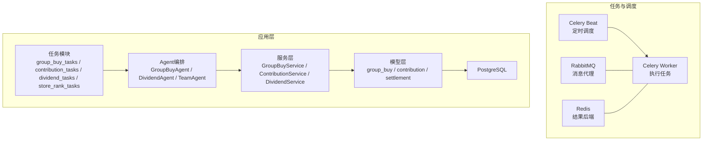
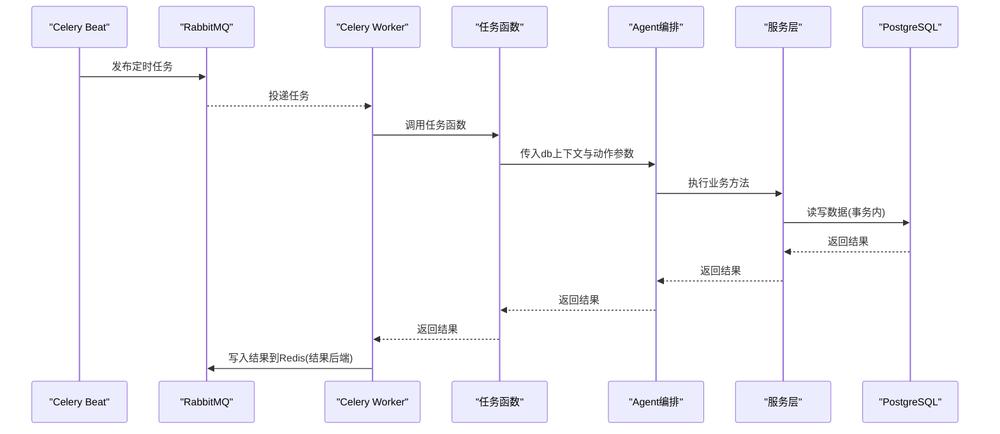
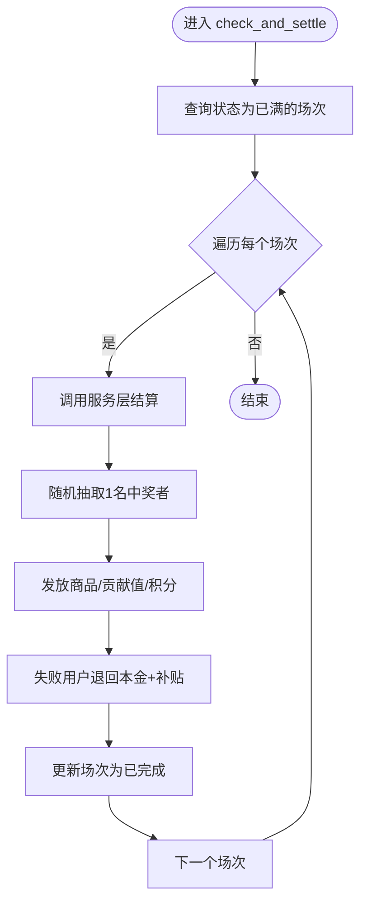
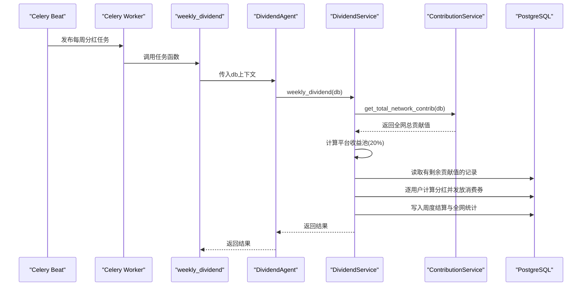
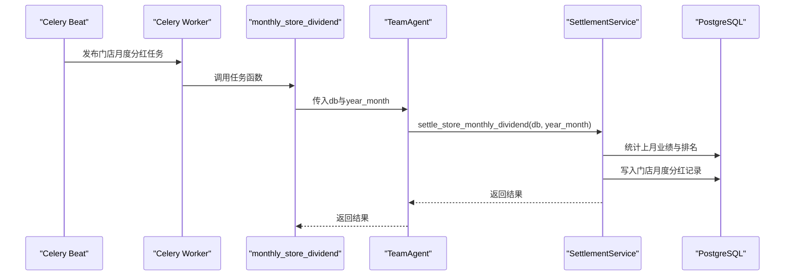
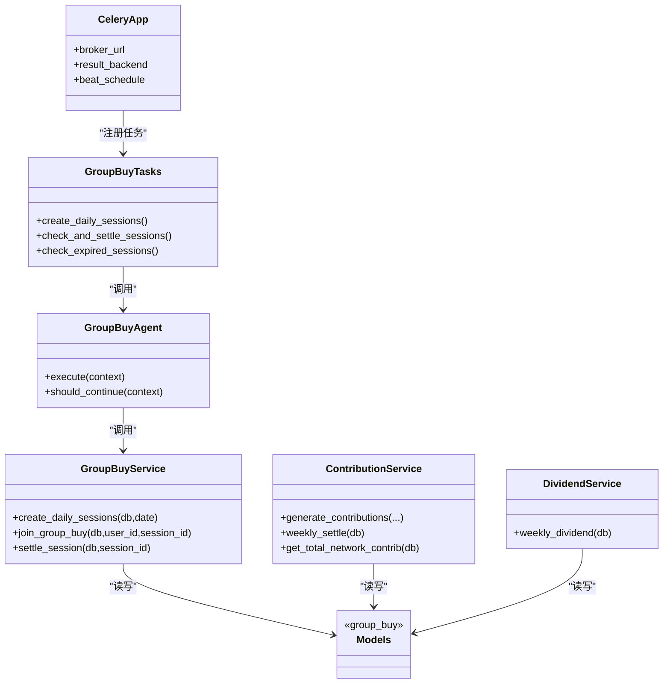

# 异步消息通信

<cite>
**本文引用的文件**   
- [celery_app.py](file://backend/app/tasks/celery_app.py)
- [group_buy_tasks.py](file://backend/app/tasks/group_buy_tasks.py)
- [contribution_tasks.py](file://backend/app/tasks/contribution_tasks.py)
- [dividend_tasks.py](file://backend/app/tasks/dividend_tasks.py)
- [store_rank_tasks.py](file://backend/app/tasks/store_rank_tasks.py)
- [group_buy_agent.py](file://backend/app/agents/group_buy_agent.py)
- [all_agents.py](file://backend/app/agents/all_agents.py)
- [group_buy_service.py](file://backend/app/services/group_buy_service.py)
- [contribution_service.py](file://backend/app/services/contribution_service.py)
- [dividend_service.py](file://backend/app/services/dividend_service.py)
- [group_buy.py](file://backend/app/models/group_buy.py)
- [contribution.py](file://backend/app/models/contribution.py)
- [settlement.py](file://backend/app/models/settlement.py)
- [config.py](file://backend/app/config.py)
- [database.py](file://backend/app/database.py)
- [docker-compose.yml](file://docker-compose.yml)
</cite>

## 目录
1. [引言](#引言)
2. [项目结构](#项目结构)
3. [核心组件](#核心组件)
4. [架构总览](#架构总览)
5. [详细组件分析](#详细组件分析)
6. [依赖关系分析](#依赖关系分析)
7. [性能与扩展性](#性能与扩展性)
8. [故障处理与可观测性](#故障处理与可观测性)
9. [幂等性与一致性保障](#幂等性与一致性保障)
10. [开发规范与最佳实践](#开发规范与最佳实践)
11. [结论](#结论)

## 引言
本文件面向AIxingmu系统的异步消息通信机制，围绕基于Celery与RabbitMQ的异步任务队列体系，系统阐述任务定义、调度执行、结果存储、事件驱动模式在拼团结算与贡献值分红等场景的应用，并给出优先级管理、重试与失败处理策略、分布式监控与日志追踪方案、幂等性与数据一致性保证以及故障恢复机制。同时提供异步任务开发与运维的最佳实践指南，帮助团队高效构建稳定可靠的后台任务系统。

## 项目结构
后端采用“任务层（Celery）—Agent编排层—服务层—模型层”的分层设计：
- 任务层：负责将业务逻辑封装为Celery任务，并通过Beat进行定时调度；通过run_async桥接同步任务与异步数据库会话。
- Agent编排层：以Agent为中心组织复杂流程，如拼团场次创建、满员结算、过期清理、贡献值周度兑换与全网分红、门店月度排名与分红等。
- 服务层：实现具体业务算法与事务边界，如拼团开团/参团/结算、贡献值核算与周度结算、分红计算等。
- 模型层：定义拼团、贡献值、分润结算等持久化实体及索引。
- 配置与基础设施：统一配置项、数据库连接与会话工厂、Docker Compose编排RabbitMQ、Redis、PostgreSQL、Worker与Beat。

图表来源
- [celery_app.py:1-56](file://backend/app/tasks/celery_app.py#L1-L56)
- [docker-compose.yml:72-96](file://docker-compose.yml#L72-L96)

章节来源
- [celery_app.py:1-56](file://backend/app/tasks/celery_app.py#L1-L56)
- [docker-compose.yml:1-149](file://docker-compose.yml#L1-L149)

## 核心组件
- Celery应用与调度
  - 应用初始化、序列化与时区设置
  - Beat定时任务清单：每日创建场次、每小时检查结算、每日检查过期、每周一贡献值分红、每日贡献值递减核算、每月门店分红
- 任务模块
  - 拼团任务：创建每日场次、检查并结算已满场次、检查过期场次
  - 贡献值任务：每日凌晨递减核算（周一发放消费券）
  - 分红任务：每周一全网贡献值分红
  - 门店任务：每月1日门店排名与阶梯分红
- Agent编排
  - GroupBuyAgent：开团、满员结算、过期清理
  - DividendAgent：全网分红
  - TeamAgent：门店月度排名与分红
- 服务层
  - GroupBuyService：场次创建、参团校验与锁定、满员随机抽中与权益发放、补贴发放
  - ContributionService：贡献值生成、周度递减兑换结算、全网贡献汇总
  - DividendService：按个人贡献占比分配平台收益池并发放消费券
- 模型层
  - 拼团：场次、订单、统计
  - 贡献值：记录、周度结算、全网统计
  - 分润结算：分润记录、门店月度分红、平台财务汇总
- 配置与数据库
  - 全局配置：拼团参数、贡献值比例、分红规则、积分通缩、门店阶梯分红等
  - 数据库：异步引擎与会话工厂，FastAPI依赖注入

章节来源
- [celery_app.py:1-56](file://backend/app/tasks/celery_app.py#L1-L56)
- [group_buy_tasks.py:1-54](file://backend/app/tasks/group_buy_tasks.py#L1-L54)
- [contribution_tasks.py:1-29](file://backend/app/tasks/contribution_tasks.py#L1-L29)
- [dividend_tasks.py:1-26](file://backend/app/tasks/dividend_tasks.py#L1-L26)
- [store_rank_tasks.py:1-29](file://backend/app/tasks/store_rank_tasks.py#L1-L29)
- [group_buy_agent.py:1-67](file://backend/app/agents/group_buy_agent.py#L1-L67)
- [all_agents.py:1-114](file://backend/app/agents/all_agents.py#L1-L114)
- [group_buy_service.py:1-348](file://backend/app/services/group_buy_service.py#L1-L348)
- [contribution_service.py:1-261](file://backend/app/services/contribution_service.py#L1-L261)
- [dividend_service.py:1-136](file://backend/app/services/dividend_service.py#L1-L136)
- [group_buy.py:1-158](file://backend/app/models/group_buy.py#L1-L158)
- [contribution.py:1-115](file://backend/app/models/contribution.py#L1-L115)
- [settlement.py:1-123](file://backend/app/models/settlement.py#L1-L123)
- [config.py:1-145](file://backend/app/config.py#L1-L145)
- [database.py:1-40](file://backend/app/database.py#L1-L40)

## 架构总览
下图展示从Beat触发到Worker执行、再到服务层落库的端到端流程，涵盖拼团与贡献值分红两大关键路径。

图表来源
- [celery_app.py:1-56](file://backend/app/tasks/celery_app.py#L1-L56)
- [group_buy_tasks.py:1-54](file://backend/app/tasks/group_buy_tasks.py#L1-L54)
- [group_buy_agent.py:1-67](file://backend/app/agents/group_buy_agent.py#L1-L67)
- [group_buy_service.py:1-348](file://backend/app/services/group_buy_service.py#L1-L348)
- [database.py:1-40](file://backend/app/database.py#L1-L40)

## 详细组件分析

### 拼团任务与结算流程
- 任务入口
  - 每日9:50创建当日场次
  - 每小时第5分钟检查已满场次并结算
  - 每日23:00检查过期场次
- Agent编排
  - GroupBuyAgent根据action分发至create_sessions、check_and_settle、check_expired
- 服务实现
  - create_daily_sessions：按小时与级别批量创建场次
  - join_group_buy：校验参与次数、余额、锁定本金、创建订单、更新状态
  - settle_session：满员后随机抽中1人，发放商品权益/贡献值/积分，失败用户退回本金并发放广告与推荐补贴
- 数据模型
  - GroupBuySession、GroupBuyOrder、GroupBuyDailyStats

图表来源
- [group_buy_tasks.py:30-40](file://backend/app/tasks/group_buy_tasks.py#L30-L40)
- [group_buy_agent.py:31-46](file://backend/app/agents/group_buy_agent.py#L31-L46)
- [group_buy_service.py:184-321](file://backend/app/services/group_buy_service.py#L184-L321)
- [group_buy.py:42-131](file://backend/app/models/group_buy.py#L42-L131)

章节来源
- [group_buy_tasks.py:1-54](file://backend/app/tasks/group_buy_tasks.py#L1-L54)
- [group_buy_agent.py:1-67](file://backend/app/agents/group_buy_agent.py#L1-L67)
- [group_buy_service.py:1-348](file://backend/app/services/group_buy_service.py#L1-L348)
- [group_buy.py:1-158](file://backend/app/models/group_buy.py#L1-L158)

### 贡献值周度递减兑换与全网分红
- 任务入口
  - 每日凌晨3:00执行贡献值递减核算（仅周一发放消费券）
  - 每周一凌晨2:00执行全网贡献值分红
- 服务实现
  - ContributionService.weekly_settle：按有效贡献值×日利率×7计算当周消费券并发放
  - DividendService.weekly_dividend：按个人贡献占比×平台20%收益池计算分红并发放
- 数据模型
  - ContributionRecord、ContribWeeklySettlement、GlobalContribStats

图表来源
- [dividend_tasks.py:15-25](file://backend/app/tasks/dividend_tasks.py#L15-L25)
- [all_agents.py:52-62](file://backend/app/agents/all_agents.py#L52-L62)
- [dividend_service.py:20-123](file://backend/app/services/dividend_service.py#L20-L123)
- [contribution_service.py:253-261](file://backend/app/services/contribution_service.py#L253-L261)
- [contribution.py:72-115](file://backend/app/models/contribution.py#L72-L115)

章节来源
- [contribution_tasks.py:1-29](file://backend/app/tasks/contribution_tasks.py#L1-L29)
- [dividend_tasks.py:1-26](file://backend/app/tasks/dividend_tasks.py#L1-L26)
- [contribution_service.py:1-261](file://backend/app/services/contribution_service.py#L1-L261)
- [dividend_service.py:1-136](file://backend/app/services/dividend_service.py#L1-L136)
- [contribution.py:1-115](file://backend/app/models/contribution.py#L1-L115)

### 门店月度排名与阶梯分红
- 任务入口
  - 每月1日凌晨1:00执行门店月度排名与分红
- Agent与服务
  - TeamAgent调用SettlementService.settle_store_monthly_dividend
- 数据模型
  - StoreMonthlyDividend

图表来源
- [store_rank_tasks.py:15-28](file://backend/app/tasks/store_rank_tasks.py#L15-L28)
- [all_agents.py:83-94](file://backend/app/agents/all_agents.py#L83-L94)
- [settlement.py:66-93](file://backend/app/models/settlement.py#L66-L93)

章节来源
- [store_rank_tasks.py:1-29](file://backend/app/tasks/store_rank_tasks.py#L1-L29)
- [all_agents.py:79-94](file://backend/app/agents/all_agents.py#L79-L94)
- [settlement.py:66-93](file://backend/app/models/settlement.py#L66-L93)

## 依赖关系分析
- 任务与Agent
  - 任务函数通过run_async桥接异步数据库会话，调用对应Agent的execute方法
  - Agent内部组合多个Service完成复杂流程
- 服务与模型
  - Service直接操作SQLAlchemy模型，使用AsyncSession进行事务性读写
- 配置与环境
  - Celery Broker与Result Backend分别指向RabbitMQ与Redis
  - Docker Compose编排各组件，确保依赖启动顺序与健康检查

图表来源
- [celery_app.py:1-56](file://backend/app/tasks/celery_app.py#L1-L56)
- [group_buy_tasks.py:1-54](file://backend/app/tasks/group_buy_tasks.py#L1-L54)
- [group_buy_agent.py:1-67](file://backend/app/agents/group_buy_agent.py#L1-L67)
- [group_buy_service.py:1-348](file://backend/app/services/group_buy_service.py#L1-L348)
- [contribution_service.py:1-261](file://backend/app/services/contribution_service.py#L1-L261)
- [dividend_service.py:1-136](file://backend/app/services/dividend_service.py#L1-L136)
- [group_buy.py:1-158](file://backend/app/models/group_buy.py#L1-L158)
- [contribution.py:1-115](file://backend/app/models/contribution.py#L1-L115)
- [settlement.py:1-123](file://backend/app/models/settlement.py#L1-L123)

章节来源
- [celery_app.py:1-56](file://backend/app/tasks/celery_app.py#L1-L56)
- [docker-compose.yml:1-149](file://docker-compose.yml#L1-L149)

## 性能与扩展性
- 并发与吞吐
  - Worker数量可按CPU核数与I/O负载水平扩展；RabbitMQ支持集群与镜像队列提升可用性
  - Redis作为结果后端需关注内存与持久化策略
- 数据库优化
  - 利用现有索引（如场次级别/状态、时间范围、用户/会话关联）减少扫描
  - 批量插入与flush减少往返开销
- 任务拆分与批处理
  - 对大数据量结算建议拆分为子任务分批处理，避免长事务与锁竞争
- 资源隔离
  - 不同业务域任务可分配到独立队列与Worker组，避免相互影响

[本节为通用指导，不直接分析具体文件]

## 故障处理与可观测性
- 重试与失败处理
  - 建议在任务装饰器中配置自动重试策略（指数退避、最大重试次数），并对不可重试错误快速失败
  - 对结算类任务增加幂等键与去重表，防止重复执行导致重复入账
- 监控与告警
  - 使用RabbitMQ Management查看队列积压、消费者健康
  - 结合Prometheus/Grafana采集Celery指标（任务耗时、成功率、重试率）
- 日志收集
  - 集中式日志（ELK/Loki）聚合Worker与Beat日志，按任务名与trace_id检索
- 链路追踪
  - 引入OpenTelemetry或类似工具，为任务执行添加span，串联HTTP请求→任务→DB调用

章节来源
- [celery_app.py:1-56](file://backend/app/tasks/celery_app.py#L1-L56)
- [docker-compose.yml:29-38](file://docker-compose.yml#L29-L38)

## 幂等性与一致性保障
- 幂等性
  - 为任务输入构造唯一幂等键（如session_no、order_no、week_start），在写入前检查是否已处理
  - 对分红与兑换等写多读少场景，优先使用“先写流水、再落账户”的两阶段策略
- 事务边界
  - 所有涉及资金与权益变更的操作应在同一AsyncSession事务内提交，异常时回滚
- 补偿与修复
  - 建立对账任务定期比对账户余额与流水差额，发现不一致自动触发补偿任务
- 最终一致性
  - 对于跨服务或外部依赖，采用可靠消息与出队即确认策略，配合死信队列与人工干预通道

章节来源
- [group_buy_service.py:184-321](file://backend/app/services/group_buy_service.py#L184-L321)
- [contribution_service.py:163-240](file://backend/app/services/contribution_service.py#L163-L240)
- [dividend_service.py:20-123](file://backend/app/services/dividend_service.py#L20-L123)
- [database.py:29-40](file://backend/app/database.py#L29-L40)

## 开发规范与最佳实践
- 任务定义
  - 明确任务职责单一，避免在任务中做重型计算；复杂流程交由Agent编排
  - 使用JSON序列化，统一时区与编码，避免跨语言兼容问题
- 异步桥接
  - 在同步任务中使用run_async包装协程，确保事件循环正确创建与关闭
- 配置管理
  - 所有业务常量集中于配置模块，便于灰度与A/B测试
- 错误处理
  - 区分可重试与不可重试异常；记录上下文信息（用户ID、会话ID、金额）
- 可观测性
  - 为关键任务添加结构化日志与指标埋点；为分页与批处理任务输出进度
- 安全与合规
  - 敏感配置通过环境变量注入；生产环境禁用DEBUG与SQL回显

章节来源
- [group_buy_tasks.py:8-14](file://backend/app/tasks/group_buy_tasks.py#L8-L14)
- [contribution_tasks.py:7-12](file://backend/app/tasks/contribution_tasks.py#L7-L12)
- [dividend_tasks.py:7-12](file://backend/app/tasks/dividend_tasks.py#L7-L12)
- [store_rank_tasks.py:7-12](file://backend/app/tasks/store_rank_tasks.py#L7-L12)
- [config.py:1-145](file://backend/app/config.py#L1-L145)

## 结论
AIxingmu的异步消息通信机制以Celery与RabbitMQ为核心，结合Agent编排与服务分层，实现了高内聚、低耦合的任务执行体系。通过统一的配置与模型抽象，系统在拼团结算、贡献值分红、门店阶梯分红等复杂场景中具备良好可扩展性与可维护性。在生产环境中，应强化幂等性、事务一致性与可观测性建设，配合合理的重试与补偿策略，确保金融级业务的稳定性与可靠性。