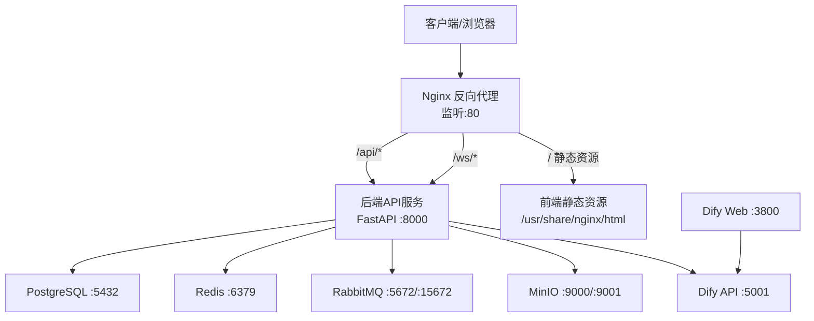
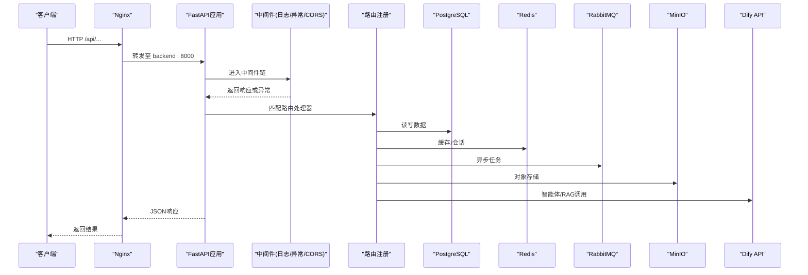
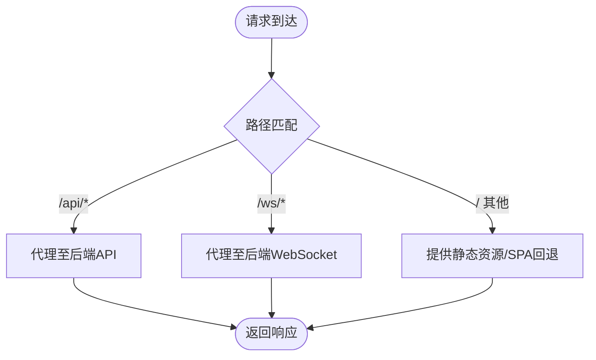
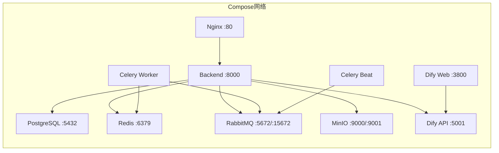
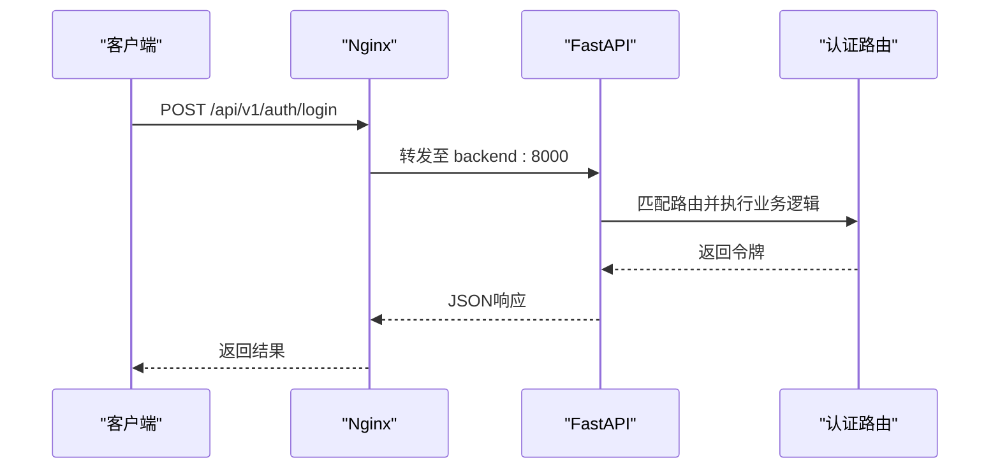
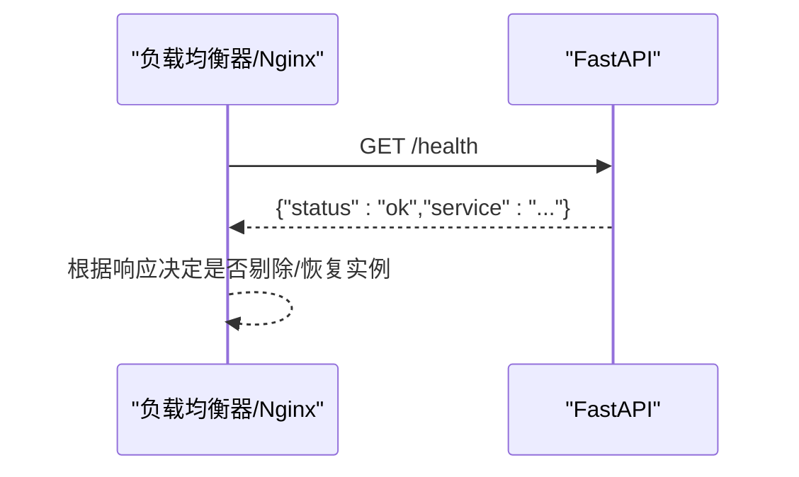
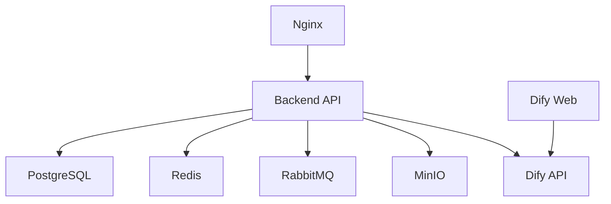

# 服务发现与路由

<cite>
**本文引用的文件列表**
- [docker-compose.yml](file://docker-compose.yml)
- [nginx.conf](file://nginx.conf)
- [backend/app/main.py](file://backend/app/main.py)
- [backend/app/config.py](file://backend/app/config.py)
- [backend/app/middleware.py](file://backend/app/middleware.py)
- [backend/app/api/v1/auth.py](file://backend/app/api/v1/auth.py)
</cite>

## 目录
1. [简介](#简介)
2. [项目结构](#项目结构)
3. [核心组件](#核心组件)
4. [架构总览](#架构总览)
5. [详细组件分析](#详细组件分析)
6. [依赖关系分析](#依赖关系分析)
7. [性能考虑](#性能考虑)
8. [故障排查指南](#故障排查指南)
9. [结论](#结论)
10. [附录](#附录)

## 简介
本文件面向AIxingmu系统的“服务发现与路由”主题，围绕以下目标展开：
- Nginx反向代理配置：负载均衡策略、静态资源服务、SSL证书配置
- Docker Compose编排：服务间网络通信、端口映射、环境变量传递
- API网关层：路由规则、请求转发、流量控制
- 健康检查机制、服务熔断与降级处理策略
- 域名解析、HTTPS配置、CDN集成方案
- 服务扩展时的路由配置指南与故障排查方法

## 项目结构
系统采用容器化部署，通过Docker Compose编排多服务，Nginx作为统一入口进行反向代理与静态资源托管。后端基于FastAPI提供REST与WebSocket接口，并暴露健康检查端点。

图表来源
- [docker-compose.yml:1-149](file://docker-compose.yml#L1-L149)
- [nginx.conf:1-39](file://nginx.conf#L1-L39)
- [backend/app/main.py:36-77](file://backend/app/main.py#L36-L77)

章节来源
- [docker-compose.yml:1-149](file://docker-compose.yml#L1-L149)
- [nginx.conf:1-39](file://nginx.conf#L1-L39)
- [backend/app/main.py:36-77](file://backend/app/main.py#L36-L77)

## 核心组件
- Nginx反向代理
  - 负责将外部请求按路径分发到后端API、WebSocket与静态资源
  - 当前upstream仅指向单一后端实例，未启用多实例负载均衡
- FastAPI应用
  - 定义API路由前缀、中间件（日志、异常、CORS）与健康检查端点
  - 通过环境变量加载数据库、缓存、消息队列等配置
- Docker Compose编排
  - 统一管理数据库、缓存、消息队列、对象存储、后端、Celery任务、Dify平台与Nginx
  - 使用depends_on与healthcheck确保启动顺序与服务可用性

章节来源
- [nginx.conf:1-39](file://nginx.conf#L1-L39)
- [backend/app/main.py:36-77](file://backend/app/main.py#L36-L77)
- [backend/app/config.py:1-145](file://backend/app/config.py#L1-145)
- [docker-compose.yml:1-149](file://docker-compose.yml#L1-L149)

## 架构总览
下图展示了从客户端到各服务的完整调用链，包括Nginx的路由转发、后端中间件处理、以及下游依赖的访问路径。

图表来源
- [nginx.conf:10-36](file://nginx.conf#L10-L36)
- [backend/app/main.py:45-77](file://backend/app/main.py#L45-L77)
- [docker-compose.yml:52-106](file://docker-compose.yml#L52-L106)

## 详细组件分析

### Nginx反向代理与路由
- 监听端口与server_name
  - 当前监听80端口，server_name为localhost
- upstream与负载均衡
  - 当前upstream仅包含一个后端实例，未配置多节点与权重；如需水平扩展，可在upstream中增加多个server并选择轮询/最少连接/一致性哈希等策略
- 路由规则
  - /api/ 转发至后端API服务
  - /ws/ 支持WebSocket升级
  - / 提供前端静态资源（默认根目录与SPA回退）
- 请求头透传
  - 设置Host、X-Real-IP、X-Forwarded-For、X-Forwarded-Proto以保留客户端信息
- SSL与HTTPS
  - 当前未配置SSL证书与443监听；生产环境需添加listen 443 ssl、ssl_certificate与ssl_certificate_key，并可配置HTTP→HTTPS重定向
- 静态资源与CDN
  - 当前静态资源位于容器内固定目录；可结合CDN替换为外部地址或开启Nginx缓存以提升性能

图表来源
- [nginx.conf:10-36](file://nginx.conf#L10-L36)

章节来源
- [nginx.conf:1-39](file://nginx.conf#L1-39)

### Docker Compose服务编排与网络通信
- 服务清单与端口映射
  - PostgreSQL: 5432
  - Redis: 6379
  - RabbitMQ: 5672, 15672
  - MinIO: 9000, 9001
  - 后端API: 8000
  - Celery Worker/Beat: 无对外端口
  - Nginx: 80
  - Dify API: 5001
  - Dify Web: 3800
- 服务间网络通信
  - 同一Compose网络下，服务可通过服务名互相访问（如backend访问postgres、redis、rabbitmq、minio、dify-api）
- 环境变量传递
  - 后端通过DATABASE_URL、REDIS_URL、CELERY_BROKER_URL、CELERY_RESULT_BACKEND等连接下游服务
  - Dify相关服务通过DB_*、REDIS_*、STORAGE_*等变量配置
- 启动顺序与健康检查
  - 使用depends_on与condition确保依赖就绪
  - PostgreSQL提供pg_isready健康检查

图表来源
- [docker-compose.yml:1-149](file://docker-compose.yml#L1-L149)

章节来源
- [docker-compose.yml:1-149](file://docker-compose.yml#L1-L149)

### API网关层（Nginx + FastAPI）
- 路由规则
  - Nginx将/api/路径转发至后端；FastAPI在应用内定义/api/v1前缀，形成最终路径/api/v1/xxx
  - WebSocket路径/ws/已预留，需在FastAPI侧实现对应路由
- 请求转发
  - Nginx透传关键请求头，便于后端获取真实客户端IP与协议
- 流量控制
  - 当前未配置限流、重试、超时等策略；可在Nginx层增加limit_req_zone、proxy_read_timeout等参数，或在FastAPI侧引入限流中间件

图表来源
- [nginx.conf:14-21](file://nginx.conf#L14-L21)
- [backend/app/main.py:59-72](file://backend/app/main.py#L59-L72)
- [backend/app/api/v1/auth.py:61-69](file://backend/app/api/v1/auth.py#L61-L69)

章节来源
- [nginx.conf:1-39](file://nginx.conf#L1-39)
- [backend/app/main.py:59-72](file://backend/app/main.py#L59-L72)
- [backend/app/api/v1/auth.py:61-69](file://backend/app/api/v1/auth.py#L61-L69)

### 健康检查机制
- 后端健康检查端点
  - 提供/health GET接口，返回服务状态与名称
- 容器健康检查
  - PostgreSQL通过pg_isready进行健康检查
- 建议
  - 在Nginx层对/health进行主动探测，结合上游失败剔除策略
  - 在Kubernetes或编排系统中可使用该端点进行存活探针

图表来源
- [backend/app/main.py:75-77](file://backend/app/main.py#L75-L77)
- [docker-compose.yml:15-19](file://docker-compose.yml#L15-L19)

章节来源
- [backend/app/main.py:75-77](file://backend/app/main.py#L75-L77)
- [docker-compose.yml:15-19](file://docker-compose.yml#L15-L19)

### 服务熔断与降级处理策略
- 现状
  - 当前未实现显式的熔断与降级逻辑
- 建议方案
  - 在Nginx层：
    - 使用max_fails与fail_timeout对上游进行健康判定
    - 配置backup server用于降级流量
    - 设置proxy_next_upstream实现自动重试与故障转移
  - 在后端FastAPI层：
    - 针对第三方依赖（如Dify API、向量检索、对象存储）增加超时与重试封装
    - 对非核心功能提供降级返回（例如缓存命中或默认值）
  - 在编排层：
    - 结合健康检查与滚动更新，避免单点故障

章节来源
- [nginx.conf:6-8](file://nginx.conf#L6-L8)
- [backend/app/main.py:107-133](file://backend/app/config.py#L107-L133)

### 域名解析、HTTPS配置与CDN集成
- 域名解析
  - 将域名A记录指向Nginx所在主机IP；若使用云厂商DNS，可配合弹性公网IP或负载均衡器
- HTTPS配置
  - 在Nginx中添加443监听，配置ssl_certificate与ssl_certificate_key
  - 建议启用HTTP→HTTPS重定向，并开启HSTS与安全头
- CDN集成
  - 将静态资源（图片、JS、CSS）迁移至对象存储（MinIO或外部S3兼容），并通过CDN加速
  - 在Nginx中对静态资源开启缓存与压缩，减少源站压力

章节来源
- [nginx.conf:10-36](file://nginx.conf#L10-L36)
- [docker-compose.yml:39-50](file://docker-compose.yml#L39-L50)

### 服务扩展时的路由配置指南
- 水平扩展后端实例
  - 在Nginx upstream中增加多个server，并选择合适的负载均衡算法（轮询、最少连接、一致性哈希）
  - 保持会话一致性时，可使用ip_hash或粘性会话
- 新增业务域路由
  - 在Nginx中新增location块，按路径或子域名区分不同服务
  - 在FastAPI中按模块拆分路由，统一前缀管理
- 动态服务发现
  - 当前为静态upstream；在生产环境中可引入Consul、Etcd或Kubernetes Service进行动态发现与更新

章节来源
- [nginx.conf:6-8](file://nginx.conf#L6-L8)
- [backend/app/main.py:59-72](file://backend/app/main.py#L59-L72)

## 依赖关系分析
- 直接依赖
  - Nginx → 后端API（/api/）、WebSocket（/ws/）、静态资源（/）
  - 后端API → PostgreSQL、Redis、RabbitMQ、MinIO、Dify API
- 间接依赖
  - Celery Worker/Beat → RabbitMQ、Redis
  - Dify Web → Dify API
- 潜在风险
  - 单点故障：当前upstream仅一个后端实例，需增加冗余
  - 外部依赖不可用：需增加熔断与降级策略

图表来源
- [docker-compose.yml:1-149](file://docker-compose.yml#L1-L149)
- [nginx.conf:1-39](file://nginx.conf#L1-39)

章节来源
- [docker-compose.yml:1-149](file://docker-compose.yml#L1-L149)
- [nginx.conf:1-39](file://nginx.conf#L1-39)

## 性能考虑
- Nginx层
  - 合理设置worker_connections与keepalive
  - 启用gzip压缩与静态资源缓存
  - 配置合理的proxy_read_timeout与proxy_send_timeout
- 后端层
  - 调整数据库连接池大小与最大溢出数
  - 使用Redis缓存热点数据，降低数据库压力
  - 对耗时操作使用Celery异步处理
- 存储层
  - 对象存储与CDN结合，提升静态资源访问速度
  - 数据库索引优化与慢查询监控

[本节为通用指导，不直接分析具体文件]

## 故障排查指南
- 常见问题定位
  - 无法访问API：检查Nginx日志与后端日志，确认upstream可达
  - 静态资源404：确认Nginx静态目录挂载与try_files配置
  - WebSocket连接失败：检查Upgrade与Connection头是否正确透传
  - 数据库连接失败：核对DATABASE_URL与服务健康状态
- 日志与指标
  - 后端中间件记录请求开始与完成时间、状态码与耗时
  - 全局异常中间件捕获并返回标准化错误响应
- 健康检查
  - 定期调用/health验证服务可用性
  - 结合编排工具的健康检查与重启策略

章节来源
- [backend/app/middleware.py:16-79](file://backend/app/middleware.py#L16-L79)
- [backend/app/middleware.py:82-109](file://backend/app/middleware.py#L82-L109)
- [backend/app/main.py:75-77](file://backend/app/main.py#L75-L77)

## 结论
当前系统通过Docker Compose实现了多服务编排，Nginx作为统一入口进行基础路由与静态资源服务。后端FastAPI提供了清晰的路由结构与健康检查端点。为满足生产级高可用与高性能需求，建议在Nginx层完善负载均衡、SSL与流量控制，在后端层引入熔断与降级策略，并结合CDN与对象存储优化静态资源交付。

[本节为总结性内容，不直接分析具体文件]

## 附录
- 关键环境变量参考
  - DATABASE_URL、REDIS_URL、CELERY_BROKER_URL、CELERY_RESULT_BACKEND
  - MINIO_ENDPOINT、MINIO_ACCESS_KEY、MINIO_SECRET_KEY、MINIO_BUCKET
  - DIFY_API_URL、DIFY_API_KEY、DIFY_DEFAULT_MODEL
- 常用命令
  - 查看服务状态：docker compose ps
  - 查看服务日志：docker compose logs -f <service>
  - 重启服务：docker compose restart <service>

章节来源
- [backend/app/config.py:16-41](file://backend/app/config.py#L16-L41)
- [backend/app/config.py:125-138](file://backend/app/config.py#L125-L138)
- [docker-compose.yml:52-106](file://docker-compose.yml#L52-L106)