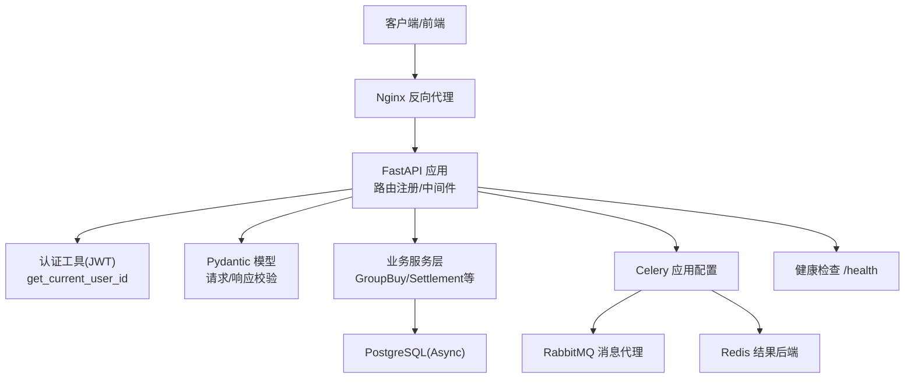
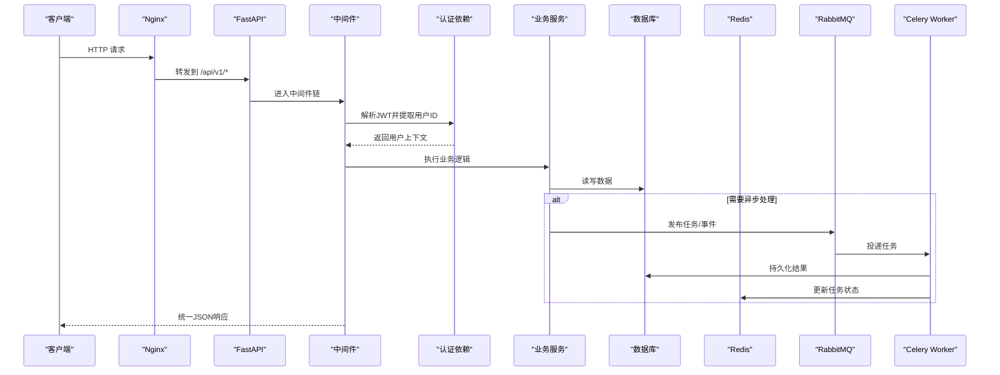
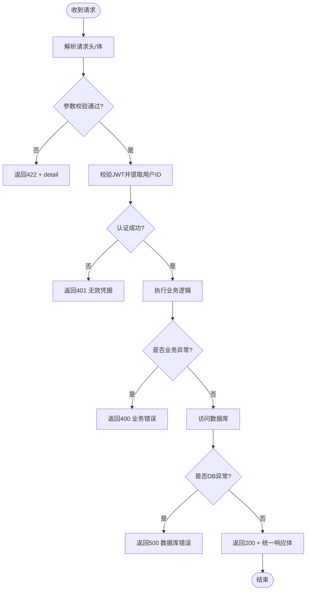
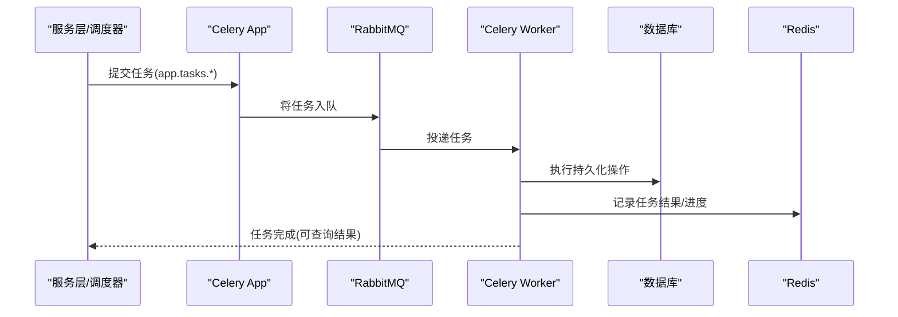
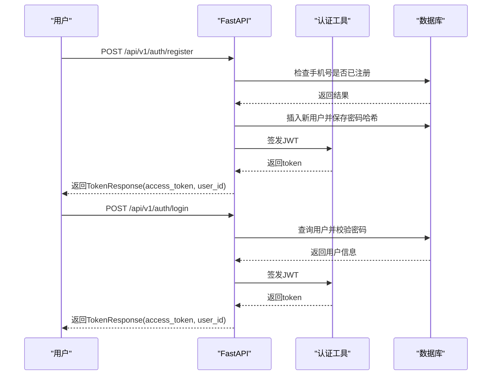
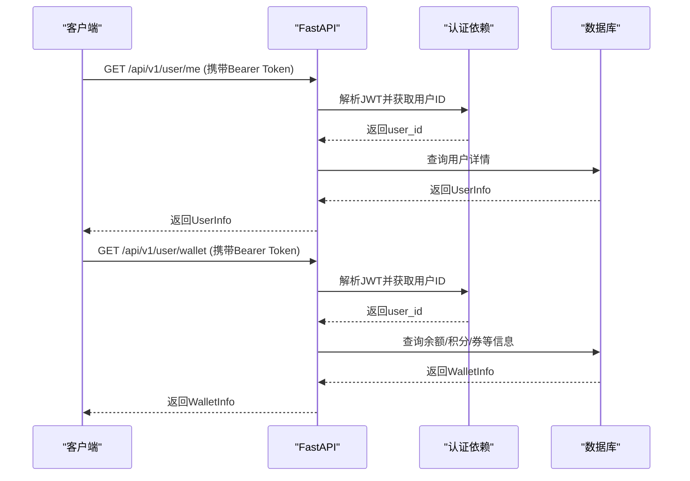
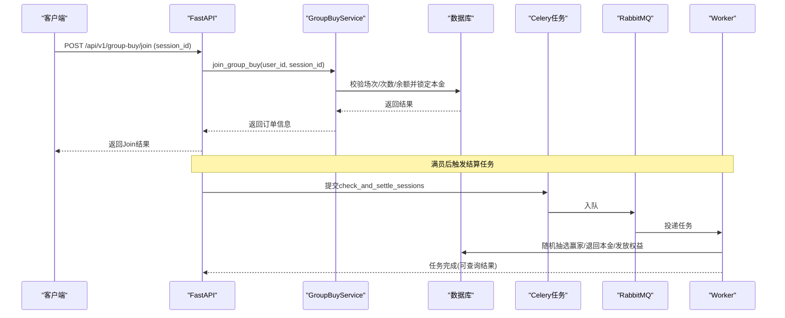
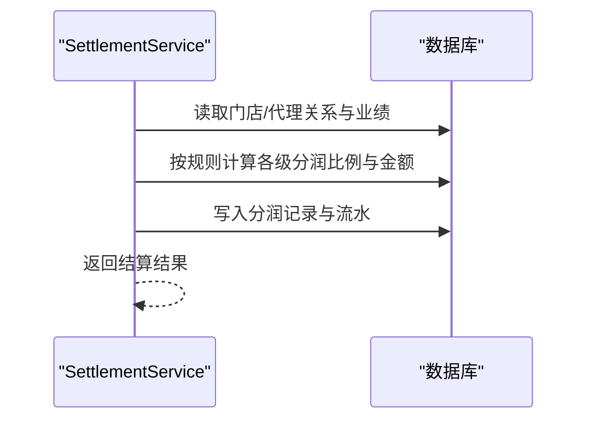
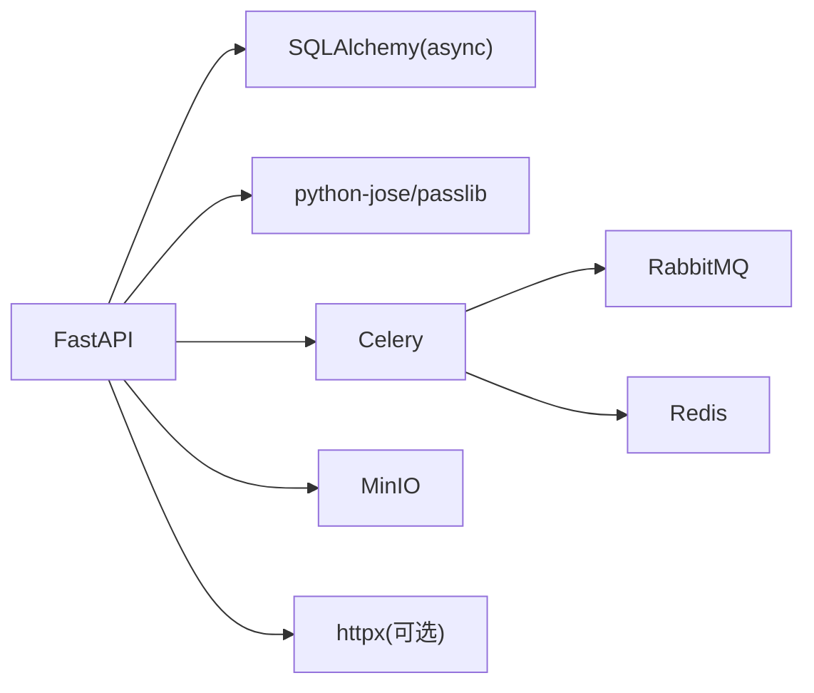

# 服务间通信机制

<cite>
**本文引用的文件**   
- [backend/app/main.py](file://backend/app/main.py)
- [backend/app/config.py](file://backend/app/config.py)
- [backend/app/middleware.py](file://backend/app/middleware.py)
- [backend/app/utils/auth.py](file://backend/app/utils/auth.py)
- [backend/app/api/v1/auth.py](file://backend/app/api/v1/auth.py)
- [backend/app/api/v1/user.py](file://backend/app/api/v1/user.py)
- [backend/app/schemas/main.py](file://backend/app/schemas/main.py)
- [backend/app/tasks/celery_app.py](file://backend/app/tasks/celery_app.py)
- [backend/app/tasks/group_buy_tasks.py](file://backend/app/tasks/group_buy_tasks.py)
- [backend/app/services/group_buy_service.py](file://backend/app/services/group_buy_service.py)
- [backend/app/services/settlement_service.py](file://backend/app/services/settlement_service.py)
- [docker-compose.yml](file://docker-compose.yml)
- [backend/requirements.txt](file://backend/requirements.txt)
</cite>

## 目录
1. [引言](#引言)
2. [项目结构](#项目结构)
3. [核心组件](#核心组件)
4. [架构总览](#架构总览)
5. [详细组件分析](#详细组件分析)
6. [依赖分析](#依赖分析)
7. [性能考虑](#性能考虑)
8. [故障排查指南](#故障排查指南)
9. [结论](#结论)
10. [附录](#附录)

## 引言
本文件面向AIxingmu系统的“服务间通信机制”，聚焦以下目标：
- RESTful API同步通信模式：HTTP请求/响应、状态码处理、统一错误格式。
- 异步消息通信机制：基于Celery与RabbitMQ的事件驱动架构，结合定时任务调度。
- 服务调用链追踪、请求ID传递、分布式事务处理方案（建议与实践）。
- API版本管理、向后兼容性保证、接口契约定义。
- 通信安全机制：身份验证传递、数据加密传输。
- 提供通信流程图与典型交互场景示例。

## 项目结构
后端采用FastAPI作为Web框架，通过中间件实现全局异常处理与请求日志；认证使用JWT；异步任务由Celery执行，消息代理为RabbitMQ，结果存储于Redis；配置集中管理；Docker Compose编排数据库、缓存、消息队列、对象存储与Nginx反向代理。

图示来源
- [backend/app/main.py:35-75](file://backend/app/main.py#L35-L75)
- [backend/app/middleware.py:16-121](file://backend/app/middleware.py#L16-L121)
- [backend/app/utils/auth.py:39-50](file://backend/app/utils/auth.py#L39-L50)
- [backend/app/schemas/main.py:172-176](file://backend/app/schemas/main.py#L172-L176)
- [backend/app/tasks/celery_app.py:9-21](file://backend/app/tasks/celery_app.py#L9-L21)
- [docker-compose.yml:29-38](file://docker-compose.yml#L29-L38)

章节来源
- [backend/app/main.py:35-75](file://backend/app/main.py#L35-L75)
- [backend/app/config.py:24-26](file://backend/app/config.py#L24-L26)
- [docker-compose.yml:52-96](file://docker-compose.yml#L52-L96)

## 核心组件
- 应用入口与路由注册：统一前缀/api/v1，按领域划分路由模块，暴露健康检查端点。
- 全局中间件：统一异常处理、请求耗时头、CORS策略。
- 认证与安全：基于HTTP Bearer的JWT鉴权，密码哈希与令牌签发/校验。
- 异步任务：Celery Worker与Beat，RabbitMQ作为Broker，Redis作为结果后端。
- 业务服务：拼团流程、分润结算等核心逻辑封装在Service层。
- 数据模型与Schema：Pydantic定义统一的请求/响应契约。

章节来源
- [backend/app/main.py:58-75](file://backend/app/main.py#L58-L75)
- [backend/app/middleware.py:16-80](file://backend/app/middleware.py#L16-L80)
- [backend/app/utils/auth.py:16-50](file://backend/app/utils/auth.py#L16-L50)
- [backend/app/tasks/celery_app.py:9-21](file://backend/app/tasks/celery_app.py#L9-L21)
- [backend/app/schemas/main.py:172-176](file://backend/app/schemas/main.py#L172-L176)

## 架构总览
系统对外以RESTful API提供服务，内部通过Celery+RabbitMQ进行异步解耦与定时任务调度。关键路径包括：
- 同步路径：客户端→Nginx→FastAPI→中间件→路由→服务层→数据库。
- 异步路径：服务层触发Celery任务→RabbitMQ分发→Worker执行→写入数据库/Redis。

图示来源
- [backend/app/main.py:44-69](file://backend/app/main.py#L44-L69)
- [backend/app/middleware.py:16-80](file://backend/app/middleware.py#L16-L80)
- [backend/app/utils/auth.py:39-50](file://backend/app/utils/auth.py#L39-L50)
- [backend/app/tasks/celery_app.py:9-21](file://backend/app/tasks/celery_app.py#L9-L21)
- [docker-compose.yml:72-96](file://docker-compose.yml#L72-L96)

## 详细组件分析

### RESTful API 同步通信
- 路由组织与版本化
  - 所有外部API统一以/api/v1为前缀，便于后续演进至v2并保持兼容。
  - 健康检查端点用于负载均衡与健康探测。
- 请求/响应契约
  - 使用Pydantic模型对入参与出参进行强类型校验，减少非法输入导致的异常。
  - 通用响应体包含code、message、data字段，便于前端统一处理。
- 状态码与错误格式
  - 参数校验失败返回422，携带detail数组。
  - 业务错误抛出ValueError映射为400。
  - 权限不足返回403。
  - 数据库或未知异常返回500，并附带detail信息。
  - 成功响应附加X-Process-Time头，便于性能观测。
- 认证与授权
  - 使用HTTP Bearer Token，服务端解码JWT获取用户标识，并在受保护接口中注入当前用户ID。
  - 登录/注册成功后返回access_token与user_id。

图示来源
- [backend/app/middleware.py:28-79](file://backend/app/middleware.py#L28-L79)
- [backend/app/utils/auth.py:39-50](file://backend/app/utils/auth.py#L39-L50)
- [backend/app/schemas/main.py:172-176](file://backend/app/schemas/main.py#L172-L176)

章节来源
- [backend/app/main.py:58-75](file://backend/app/main.py#L58-L75)
- [backend/app/middleware.py:16-80](file://backend/app/middleware.py#L16-L80)
- [backend/app/utils/auth.py:16-50](file://backend/app/utils/auth.py#L16-L50)
- [backend/app/api/v1/auth.py:14-43](file://backend/app/api/v1/auth.py#L14-L43)
- [backend/app/api/v1/user.py:14-37](file://backend/app/api/v1/user.py#L14-L37)
- [backend/app/schemas/main.py:10-46](file://backend/app/schemas/main.py#L10-L46)

### 异步消息通信（Celery + RabbitMQ）
- 任务与应用配置
  - Celery应用通过配置设置时区、序列化方式、接受内容类型。
  - Broker使用RabbitMQ，结果后端使用Redis。
- 定时任务调度
  - Beat根据crontab表达式调度每日创建场次、每小时结算、过期检查、贡献值分红、门店月度排名等任务。
- 任务执行流程
  - 服务层或调度器触发任务，Worker从队列拉取任务，执行异步逻辑（如并发写库、批量计算），并将结果落盘或回写Redis。

图示来源
- [backend/app/tasks/celery_app.py:9-21](file://backend/app/tasks/celery_app.py#L9-L21)
- [backend/app/tasks/celery_app.py:24-55](file://backend/app/tasks/celery_app.py#L24-L55)
- [backend/app/tasks/group_buy_tasks.py:17-54](file://backend/app/tasks/group_buy_tasks.py#L17-L54)
- [docker-compose.yml:72-96](file://docker-compose.yml#L72-L96)

章节来源
- [backend/app/tasks/celery_app.py:9-55](file://backend/app/tasks/celery_app.py#L9-L55)
- [backend/app/tasks/group_buy_tasks.py:17-54](file://backend/app/tasks/group_buy_tasks.py#L17-L54)
- [docker-compose.yml:29-38](file://docker-compose.yml#L29-L38)

### 服务调用链追踪与请求ID传递（建议方案）
- 请求ID生成与透传
  - 建议在请求入口处生成唯一请求ID，并通过响应头返回给客户端，同时在日志中贯穿全链路。
  - 跨服务调用时，将请求ID放入HTTP头（如X-Request-ID）进行透传。
- 日志关联
  - 在中间件中记录请求开始/结束时间、方法、URL、IP、状态码与耗时，结合请求ID形成完整链路日志。
- 分布式事务（建议）
  - 跨服务一致性优先采用最终一致：本地事务+可靠消息（至少一次投递）+幂等消费。
  - 关键资金/权益变更需引入补偿与重试机制，确保可重放与可追溯。

[本节为通用实践建议，不直接分析具体代码文件]

### API 版本管理与向后兼容（建议方案）
- 版本前缀
  - 使用/api/v1作为当前版本前缀，未来新增功能可迁移至/api/v2，旧版本保留一段时间并提供迁移指南。
- 兼容性原则
  - 只增不改：新增字段、新增端点；删除字段需废弃并给出替代方案。
  - 严格校验：通过Pydantic模型强制约束，避免隐式行为变化。
- 契约管理
  - 使用OpenAPI文档自动生成与可视化，配合测试用例保障契约稳定。

[本节为通用实践建议，不直接分析具体代码文件]

### 通信安全与身份验证传递
- 传输安全
  - 生产环境应启用HTTPS，由Nginx终止TLS，后端仅处理明文HTTP。
- 身份验证
  - 客户端在请求头携带Authorization: Bearer <token>，服务端通过HTTPBearer依赖解析并校验JWT。
- 敏感数据传输
  - 除HTTPS外，对特别敏感字段可在应用层二次签名或加密，降低泄露风险。

章节来源
- [backend/app/utils/auth.py:39-50](file://backend/app/utils/auth.py#L39-L50)
- [backend/app/api/v1/auth.py:14-43](file://backend/app/api/v1/auth.py#L14-L43)
- [docker-compose.yml:97-106](file://docker-compose.yml#L97-L106)

### 典型交互场景示例

#### 场景一：用户注册与登录（同步）

图示来源
- [backend/app/api/v1/auth.py:14-43](file://backend/app/api/v1/auth.py#L14-L43)
- [backend/app/utils/auth.py:24-36](file://backend/app/utils/auth.py#L24-L36)

章节来源
- [backend/app/api/v1/auth.py:14-43](file://backend/app/api/v1/auth.py#L14-L43)
- [backend/app/schemas/main.py:10-24](file://backend/app/schemas/main.py#L10-L24)

#### 场景二：获取当前用户信息与钱包（同步）

图示来源
- [backend/app/api/v1/user.py:14-37](file://backend/app/api/v1/user.py#L14-L37)
- [backend/app/utils/auth.py:39-50](file://backend/app/utils/auth.py#L39-L50)
- [backend/app/schemas/main.py:26-46](file://backend/app/schemas/main.py#L26-L46)

章节来源
- [backend/app/api/v1/user.py:14-37](file://backend/app/api/v1/user.py#L14-L37)
- [backend/app/schemas/main.py:26-46](file://backend/app/schemas/main.py#L26-L46)

#### 场景三：拼团参与与结算（同步+异步）

图示来源
- [backend/app/services/group_buy_service.py:93-181](file://backend/app/services/group_buy_service.py#L93-L181)
- [backend/app/services/group_buy_service.py:184-321](file://backend/app/services/group_buy_service.py#L184-L321)
- [backend/app/tasks/group_buy_tasks.py:30-40](file://backend/app/tasks/group_buy_tasks.py#L30-L40)
- [backend/app/tasks/celery_app.py:24-34](file://backend/app/tasks/celery_app.py#L24-L34)

章节来源
- [backend/app/services/group_buy_service.py:93-321](file://backend/app/services/group_buy_service.py#L93-L321)
- [backend/app/tasks/group_buy_tasks.py:17-54](file://backend/app/tasks/group_buy_tasks.py#L17-L54)

#### 场景四：分润结算（同步）

图示来源
- [backend/app/services/settlement_service.py:21-85](file://backend/app/services/settlement_service.py#L21-L85)
- [backend/app/services/settlement_service.py:88-133](file://backend/app/services/settlement_service.py#L88-L133)

章节来源
- [backend/app/services/settlement_service.py:21-166](file://backend/app/services/settlement_service.py#L21-L166)

## 依赖分析
- 运行时依赖
  - Web框架：FastAPI/Uvicorn
  - 数据库：SQLAlchemy(async)+asyncpg+PostgreSQL
  - 认证：python-jose(passlib)
  - 异步任务：Celery+RabbitMQ
  - 缓存：Redis(aioredis)
  - 对象存储：MinIO
  - HTTP客户端：httpx（可用于服务间调用）
- 容器编排
  - docker-compose定义各服务端口、环境变量与依赖顺序，确保启动顺序与健康检查。

图示来源
- [backend/requirements.txt:1-35](file://backend/requirements.txt#L1-L35)
- [docker-compose.yml:4-51](file://docker-compose.yml#L4-L51)

章节来源
- [backend/requirements.txt:1-35](file://backend/requirements.txt#L1-L35)
- [docker-compose.yml:4-51](file://docker-compose.yml#L4-L51)

## 性能考虑
- 连接池与超时
  - 合理配置数据库连接池大小与最大溢出，避免连接耗尽。
  - 对外部服务调用设置合理的超时与重试策略。
- 异步与批处理
  - 将耗时操作下沉到Celery任务，避免阻塞HTTP请求。
  - 批量写入与索引优化提升数据库吞吐。
- 监控与观测
  - 利用X-Process-Time与中间件日志评估端到端耗时。
  - 结合请求ID进行链路追踪与问题定位。

[本节为通用指导，不直接分析具体代码文件]

## 故障排查指南
- 常见错误分类与处理
  - 参数校验失败：422，查看detail数组定位字段错误。
  - 业务逻辑错误：400，根据message快速定位业务断言失败位置。
  - 权限不足：403，检查JWT有效性及权限控制逻辑。
  - 数据库错误：500，检查连接池、SQL语句与索引。
  - 未处理异常：500，查看日志堆栈定位根因。
- 日志与追踪
  - 中间件记录请求开始/结束、状态码与耗时，结合请求ID串联日志。
- 任务失败排查
  - 检查RabbitMQ队列堆积情况与Worker日志。
  - 确认Redis结果后端可用性与键空间清理策略。

章节来源
- [backend/app/middleware.py:28-79](file://backend/app/middleware.py#L28-L79)
- [backend/app/tasks/celery_app.py:9-21](file://backend/app/tasks/celery_app.py#L9-L21)

## 结论
AIxingmu系统通过FastAPI提供RESTful API，结合Celery与RabbitMQ构建异步事件驱动能力，满足高并发与长耗时任务的解耦需求。统一错误格式、JWT认证与中间件日志为服务间通信提供了稳定的基础。建议在生产环境中完善请求ID透传、HTTPS加密、幂等与补偿机制，以确保跨服务的一致性与可观测性。

## 附录

### 统一响应体与常用状态码
- 统一响应体字段
  - code：业务状态码
  - message：人类可读消息
  - data：业务数据
- 常用状态码
  - 200：成功
  - 400：业务错误
  - 401：认证失败
  - 403：权限不足
  - 422：参数校验失败
  - 500：服务器内部错误

章节来源
- [backend/app/schemas/main.py:172-176](file://backend/app/schemas/main.py#L172-L176)
- [backend/app/middleware.py:28-79](file://backend/app/middleware.py#L28-L79)