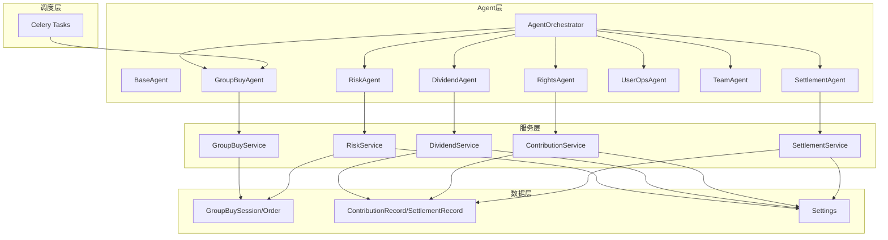
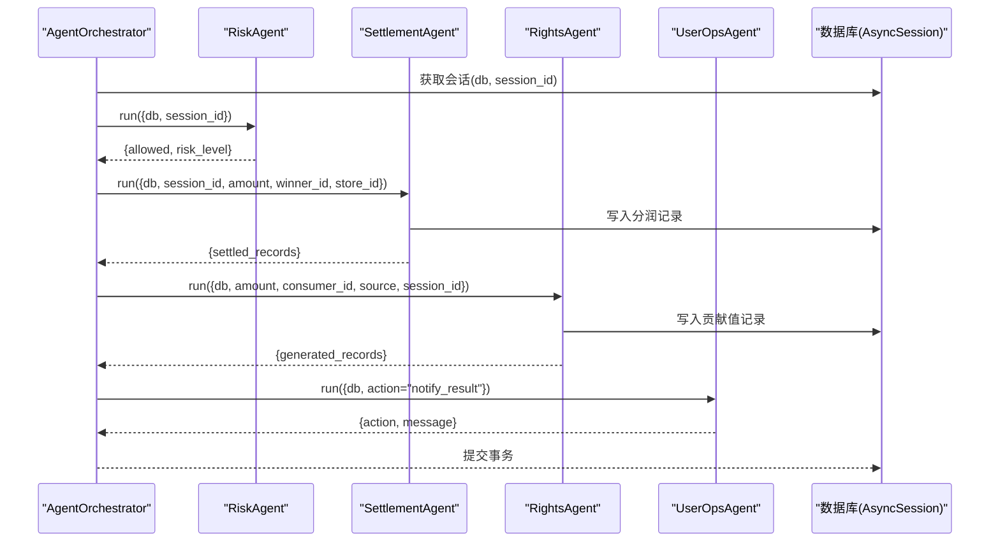
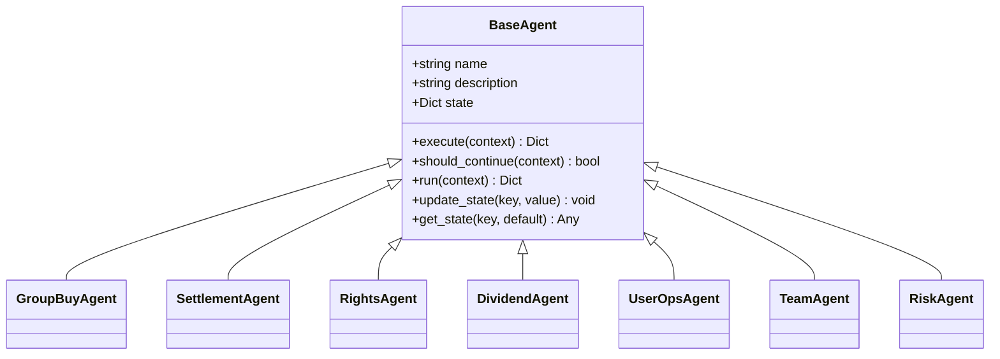
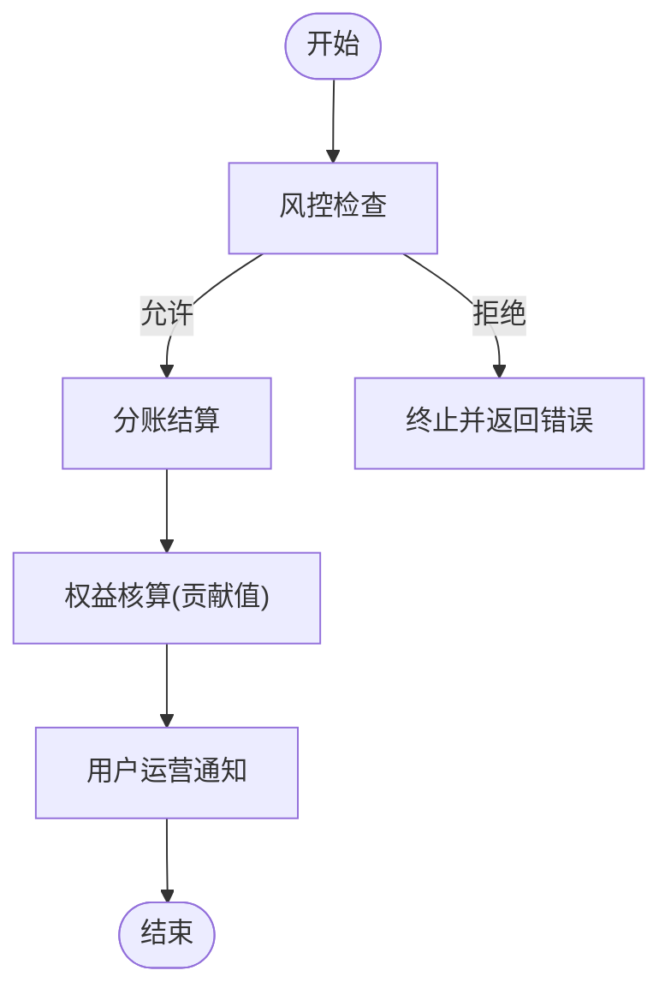
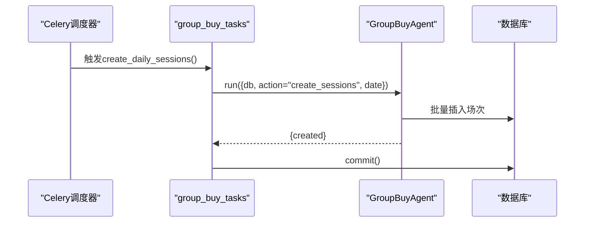
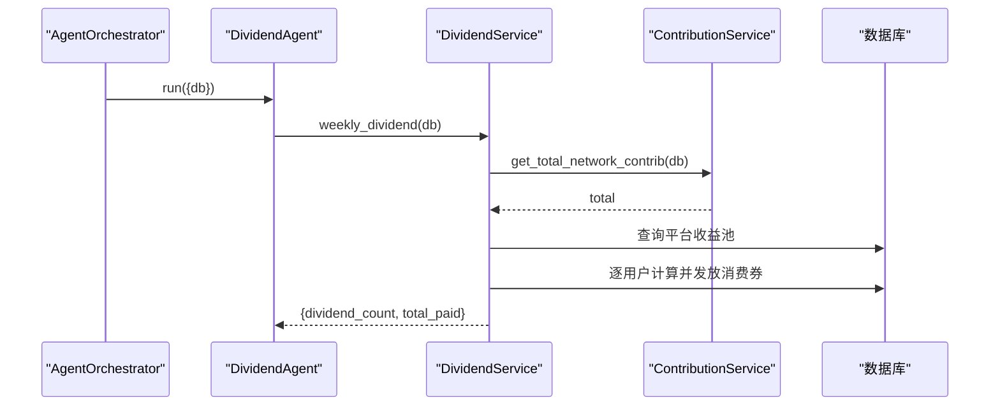
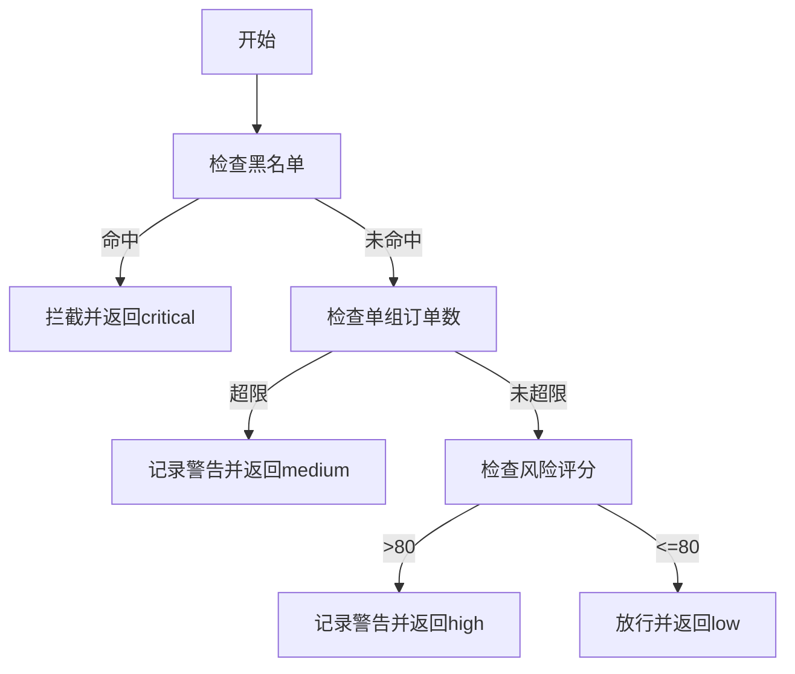
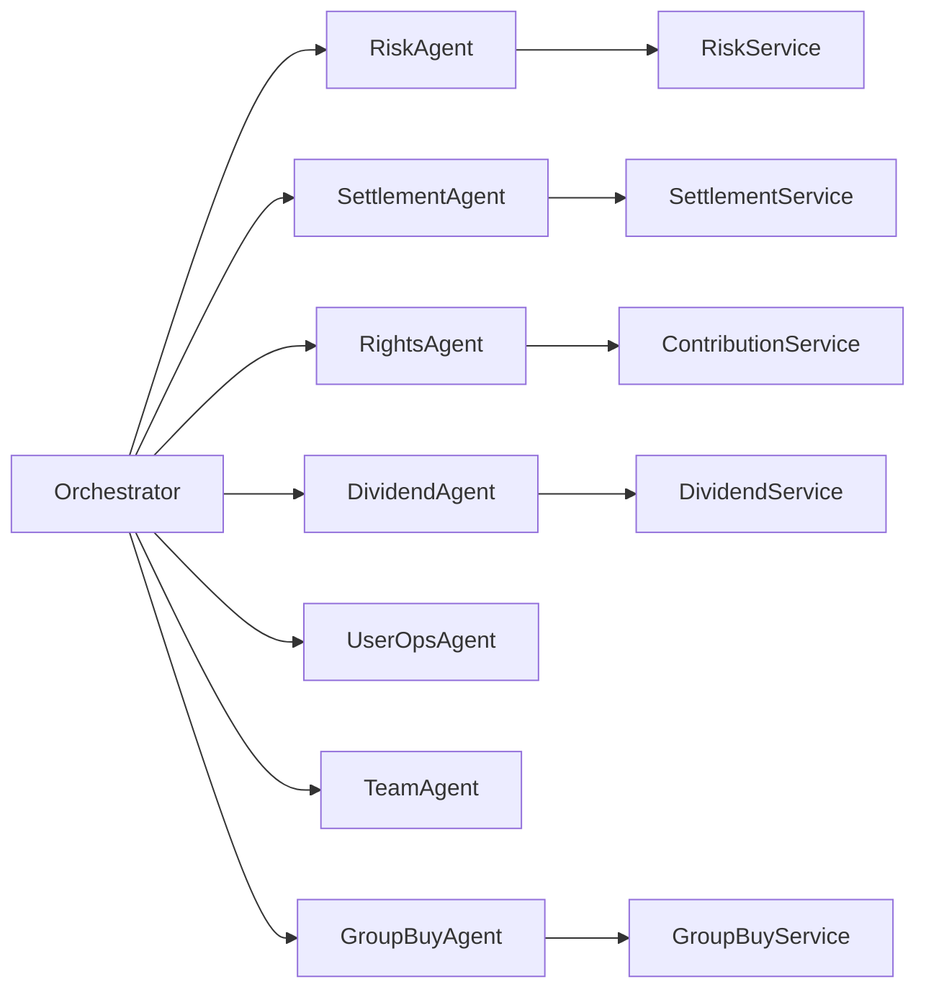

# Agent数据协作

<cite>
**本文引用的文件列表**
- [base_agent.py](file://backend/app/agents/base_agent.py)
- [agent_orchestrator.py](file://backend/app/agents/agent_orchestrator.py)
- [all_agents.py](file://backend/app/agents/all_agents.py)
- [group_buy_agent.py](file://backend/app/agents/group_buy_agent.py)
- [settlement_service.py](file://backend/app/services/settlement_service.py)
- [contribution_service.py](file://backend/app/services/contribution_service.py)
- [dividend_service.py](file://backend/app/services/dividend_service.py)
- [risk_service.py](file://backend/app/services/risk_service.py)
- [group_buy.py](file://backend/app/models/group_buy.py)
- [contribution.py](file://backend/app/models/contribution.py)
- [config.py](file://backend/app/config.py)
- [group_buy_tasks.py](file://backend/app/tasks/group_buy_tasks.py)
</cite>

## 目录
1. [引言](#引言)
2. [项目结构](#项目结构)
3. [核心组件](#核心组件)
4. [架构总览](#架构总览)
5. [详细组件分析](#详细组件分析)
6. [依赖关系与数据契约](#依赖关系与数据契约)
7. [性能与并发特性](#性能与并发特性)
8. [故障排查指南](#故障排查指南)
9. [结论](#结论)
10. [附录：扩展开发与调试方法](#附录扩展开发与调试方法)

## 引言
本文件面向AIxingmu系统的Agent数据协作，聚焦以下目标：
- 描述7大专业Agent间的数据传递机制（状态同步、消息总线、事件驱动通信）
- 解释Agent编排器的数据流转控制（执行顺序管理、条件分支、并行处理）
- 说明Agent状态管理与持久化策略（状态快照、恢复机制、版本控制）
- 提供Agent间依赖关系图、数据契约定义、错误传播机制
- 给出Agent扩展开发指南和调试方法

系统采用“轻量Agent + 服务层 + 数据库”的架构。Agent负责业务编排与流程控制，具体计算与I/O下沉到Service层；数据通过数据库事务进行强一致持久化，并通过定时任务触发流水线。

## 项目结构
后端关键目录与职责：
- agents：Agent基类与各专业Agent实现，以及编排器
- services：领域服务，封装分账、贡献值、分红、风控等复杂计算
- models：SQLAlchemy模型，定义拼团、贡献值、结算等数据结构
- tasks：Celery定时任务，驱动Agent周期性运行
- config：全局配置参数（比例、阈值、时间窗口等）



图表来源
- [agent_orchestrator.py:18-94](file://backend/app/agents/agent_orchestrator.py#L18-L94)
- [group_buy_agent.py:15-67](file://backend/app/agents/group_buy_agent.py#L15-L67)
- [all_agents.py:7-114](file://backend/app/agents/all_agents.py#L7-L114)
- [settlement_service.py:17-166](file://backend/app/services/settlement_service.py#L17-L166)
- [contribution_service.py:16-261](file://backend/app/services/contribution_service.py#L16-L261)
- [dividend_service.py:16-136](file://backend/app/services/dividend_service.py#L16-L136)
- [risk_service.py:14-135](file://backend/app/services/risk_service.py#L14-L135)
- [group_buy.py:42-131](file://backend/app/models/group_buy.py#L42-L131)
- [contribution.py:32-115](file://backend/app/models/contribution.py#L32-L115)
- [config.py:8-145](file://backend/app/config.py#L8-L145)

章节来源
- [agent_orchestrator.py:18-94](file://backend/app/agents/agent_orchestrator.py#L18-L94)
- [group_buy_agent.py:15-67](file://backend/app/agents/group_buy_agent.py#L15-L67)
- [all_agents.py:7-114](file://backend/app/agents/all_agents.py#L7-L114)

## 核心组件
- BaseAgent：统一生命周期run、execute、should_continue、状态存取接口
- GroupBuyAgent：场次创建、过期处理、满员结算触发
- SettlementAgent：按固定比例记录各方分润
- RightsAgent：基于让利金额生成多角色贡献值
- DividendAgent：每周一全网贡献值分红
- UserOpsAgent：用户运营通知与交互（占位实现）
- TeamAgent：门店月度阶梯分红
- RiskAgent：参团前风控校验
- AgentOrchestrator：编排7大Agent的执行顺序与上下文传递

章节来源
- [base_agent.py:12-47](file://backend/app/agents/base_agent.py#L12-L47)
- [group_buy_agent.py:15-67](file://backend/app/agents/group_buy_agent.py#L15-L67)
- [all_agents.py:7-114](file://backend/app/agents/all_agents.py#L7-L114)
- [agent_orchestrator.py:18-94](file://backend/app/agents/agent_orchestrator.py#L18-L94)

## 架构总览
下图展示一次“拼团成功后的完整流水线”在编排器中的调用序列，体现顺序控制与上下文传递。



图表来源
- [agent_orchestrator.py:32-52](file://backend/app/agents/agent_orchestrator.py#L32-L52)
- [all_agents.py:7-114](file://backend/app/agents/all_agents.py#L7-L114)
- [settlement_service.py:21-85](file://backend/app/services/settlement_service.py#L21-L85)
- [contribution_service.py:39-143](file://backend/app/services/contribution_service.py#L39-L143)

## 详细组件分析

### 1) 基础Agent与状态机
- BaseAgent提供统一的run包装，内部捕获异常并返回标准结果结构；execute为抽象方法由子类实现；should_continue用于判断是否继续后续节点；state字典作为Agent本地状态载体。
- 当前各Agent的should_continue均返回False，表示单次执行即结束。



图表来源
- [base_agent.py:12-47](file://backend/app/agents/base_agent.py#L12-L47)
- [group_buy_agent.py:15-67](file://backend/app/agents/group_buy_agent.py#L15-L67)
- [all_agents.py:7-114](file://backend/app/agents/all_agents.py#L7-L114)

章节来源
- [base_agent.py:12-47](file://backend/app/agents/base_agent.py#L12-L47)

### 2) 编排器与流水线控制
- AgentOrchestrator集中注册7个Agent实例，并提供多种流水线入口：
  - run_group_buy_pipeline：风控→结算→权益→通知
  - run_daily_routine：创建场次→检查过期→结算已满场次
  - run_weekly_settlement：每周一分红
  - run_monthly_store_dividend：门店月度阶梯分红
- 当前流水线为串行执行，未实现条件分支与并行处理；可通过扩展should_continue与编排器逻辑引入分支与并发。



图表来源
- [agent_orchestrator.py:32-52](file://backend/app/agents/agent_orchestrator.py#L32-L52)
- [all_agents.py:97-114](file://backend/app/agents/all_agents.py#L97-L114)

章节来源
- [agent_orchestrator.py:18-94](file://backend/app/agents/agent_orchestrator.py#L18-L94)

### 3) 分组与定时任务
- Celery任务驱动GroupBuyAgent执行三类动作：每日创建场次、每小时检查并结算已满场次、每日检查过期场次。
- 任务中通过async_session_factory创建异步会话，并在完成后commit。



图表来源
- [group_buy_tasks.py:17-27](file://backend/app/tasks/group_buy_tasks.py#L17-L27)
- [group_buy_agent.py:21-29](file://backend/app/agents/group_buy_agent.py#L21-L29)

章节来源
- [group_buy_tasks.py:1-54](file://backend/app/tasks/group_buy_tasks.py#L1-54)
- [group_buy_agent.py:15-67](file://backend/app/agents/group_buy_agent.py#L15-L67)

### 4) 分账与贡献值计算
- SettlementService按固定比例记录代理、门店、推荐门店的分润，并写入结算记录表。
- ContributionService按六大角色分配让利金额，生成贡献值记录，支持周度递减兑换与分红标记。

```mermaid
flowchart TD
A["交易金额"] --> B["计算让利=金额×GLOBAL_DISCOUNT_RATIO"]
B --> C{"角色分配?"}
C --> |消费者| D["消费者贡献值"]
C --> |商家| E["商家贡献值"]
C --> |推荐商家| F["推荐商家贡献值"]
C --> |推荐消费者| G["推荐消费者贡献值"]
C --> |代理(省/市/区县)| H["代理贡献值(按比例拆分)"]
C --> |平台| I["平台贡献值"]
D --> J["写入贡献值记录"]
E --> J
F --> J
G --> J
H --> J
I --> J
```

图表来源
- [contribution_service.py:29-143](file://backend/app/services/contribution_service.py#L29-L143)
- [config.py:60-70](file://backend/app/config.py#L60-L70)

章节来源
- [settlement_service.py:17-166](file://backend/app/services/settlement_service.py#L17-L166)
- [contribution_service.py:16-261](file://backend/app/services/contribution_service.py#L16-L261)

### 5) 分红与门店阶梯分红
- DividendService每周一计算全网贡献值与平台收益池，按个人贡献占比发放消费券，并记录统计。
- TeamAgent调用SettlementService完成门店月度阶梯分红，依据业绩区间确定等级与比例。



图表来源
- [agent_orchestrator.py:72-80](file://backend/app/agents/agent_orchestrator.py#L72-L80)
- [all_agents.py:48-62](file://backend/app/agents/all_agents.py#L48-L62)
- [dividend_service.py:19-123](file://backend/app/services/dividend_service.py#L19-L123)
- [contribution_service.py:252-261](file://backend/app/services/contribution_service.py#L252-L261)

章节来源
- [dividend_service.py:16-136](file://backend/app/services/dividend_service.py#L16-L136)
- [all_agents.py:79-95](file://backend/app/agents/all_agents.py#L79-L95)
- [settlement_service.py:87-133](file://backend/app/services/settlement_service.py#L87-L133)

### 6) 风控校验
- RiskAgent调用RiskService.check_join_risk，规则包括黑名单、单组参与次数上限、风险评分阈值，并记录风控日志。



图表来源
- [risk_service.py:17-74](file://backend/app/services/risk_service.py#L17-L74)
- [all_agents.py:97-114](file://backend/app/agents/all_agents.py#L97-L114)

章节来源
- [risk_service.py:14-135](file://backend/app/services/risk_service.py#L14-L135)

## 依赖关系与数据契约

### 1) Agent间依赖关系图
- 编排器依赖所有Agent；Agent之间不直接耦合，通过共享数据库与上下文传递数据。
- 典型依赖链：GroupBuyAgent → GroupBuyService → GroupBuySession/Order；SettlementAgent → SettlementService → SettlementRecord；RightsAgent → ContributionService → ContributionRecord；DividendAgent → DividendService → GlobalContribStats；RiskAgent → RiskService → RiskControlLog/UserRiskScore。



图表来源
- [agent_orchestrator.py:18-30](file://backend/app/agents/agent_orchestrator.py#L18-L30)
- [all_agents.py:7-114](file://backend/app/agents/all_agents.py#L7-L114)

### 2) 数据契约定义
- 上下文对象（context）字段约定：
  - db: AsyncSession（必需）
  - session_id: int（可选，流水相关）
  - user_id: int（可选，风控相关）
  - amount: float（可选，分账/权益相关）
  - winner_id: int（可选，分账相关）
  - store_id: int（可选，分账相关）
  - consumer_id: int（可选，权益相关）
  - source: enum（可选，默认GROUP_BUY_WIN）
  - action: string（可选，如create_sessions/check_and_settle/check_expired/notify_result）
  - year_month: string（可选，团队月度分红）
- 返回结果结构约定：
  - agent: string（Agent名称）
  - status: "success" | "error"
  - result: dict（各Agent自定义结果）
  - error: string（失败时携带错误信息）

章节来源
- [base_agent.py:31-47](file://backend/app/agents/base_agent.py#L31-L47)
- [agent_orchestrator.py:32-85](file://backend/app/agents/agent_orchestrator.py#L32-L85)
- [all_agents.py:11-114](file://backend/app/agents/all_agents.py#L11-L114)

### 3) 错误传播机制
- BaseAgent.run捕获异常，将错误信息以{"status":"error","error":...}形式返回给上层。
- 编排器目前未对单个Agent的错误进行短路或重试，可在编排器中增加条件分支与补偿逻辑。

章节来源
- [base_agent.py:31-47](file://backend/app/agents/base_agent.py#L31-L47)
- [agent_orchestrator.py:32-52](file://backend/app/agents/agent_orchestrator.py#L32-L52)

## 性能与并发特性
- 异步数据库访问：使用AsyncSession与异步ORM操作，提升吞吐。
- 批处理：场次创建、过期处理、结算均为批量操作，减少往返次数。
- 事务边界：每个Celery任务内开启独立会话并在结束时commit，保证一致性。
- 可扩展点：
  - 并行处理：在编排器中对无依赖的Agent使用异步并发（如分账与权益可并行）。
  - 条件分支：根据风控结果决定是否进入后续步骤。
  - 幂等性：对重复触发的任务增加去重键（如session_id+action）。

[本节为通用指导，无需特定文件引用]

## 故障排查指南
- 常见错误定位：
  - 风控拦截：查看RiskControlLog与UserRiskScore，确认是否命中黑名单或超过参与上限。
  - 分账失败：检查SettlementRecord状态与比例配置，确认Store关联是否正确。
  - 贡献值异常：核对GLOBAL_DISCOUNT_RATIO与角色比例之和，确保计算正确。
  - 分红未发放：确认GlobalContribStats与平台收益池数据是否更新。
- 日志与监控：
  - 使用BaseAgent.logger输出执行轨迹，结合Celery任务日志定位问题。
  - 对关键Service方法增加耗时与异常埋点。

章节来源
- [risk_service.py:110-135](file://backend/app/services/risk_service.py#L110-L135)
- [settlement_service.py:148-166](file://backend/app/services/settlement_service.py#L148-L166)
- [contribution_service.py:162-240](file://backend/app/services/contribution_service.py#L162-L240)
- [dividend_service.py:125-136](file://backend/app/services/dividend_service.py#L125-L136)

## 结论
AIxingmu的Agent体系以BaseAgent为统一抽象，通过AgentOrchestrator串联风控、分账、权益、运营、团队、分红等能力，形成清晰的数据流与职责边界。当前实现为串行流水线，具备良好扩展性，可通过引入条件分支与并行处理进一步提升效率与鲁棒性。

[本节为总结，无需特定文件引用]

## 附录：扩展开发与调试方法

### 1) 新增Agent步骤
- 继承BaseAgent，实现execute与should_continue；在all_agents.py中注册新Agent类。
- 在AgentOrchestrator中注入新Agent，并在对应流水线中加入调用。
- 如需定时触发，参考group_buy_tasks.py添加Celery任务。

章节来源
- [base_agent.py:12-47](file://backend/app/agents/base_agent.py#L12-L47)
- [all_agents.py:7-114](file://backend/app/agents/all_agents.py#L7-L114)
- [agent_orchestrator.py:18-30](file://backend/app/agents/agent_orchestrator.py#L18-L30)
- [group_buy_tasks.py:17-27](file://backend/app/tasks/group_buy_tasks.py#L17-L27)

### 2) 状态管理与持久化策略
- 状态快照：BaseAgent.state可作为内存快照，但建议将关键状态落库（如SessionStatus、SettlementStatus），以便恢复。
- 恢复机制：利用数据库状态枚举与索引快速定位未完成的事务，结合Celery任务重试策略实现补偿。
- 版本控制：对计算规则（比例、阈值）集中在config.py管理，便于灰度与回滚。

章节来源
- [group_buy.py:22-40](file://backend/app/models/group_buy.py#L22-L40)
- [config.py:42-124](file://backend/app/config.py#L42-L124)

### 3) 调试方法
- 启用DEBUG模式，观察BaseAgent日志输出。
- 针对高风险路径（风控、分账、分红）增加断点与中间结果打印。
- 使用Celery Flower监控任务执行情况与失败重试。

章节来源
- [base_agent.py:31-47](file://backend/app/agents/base_agent.py#L31-L47)
- [group_buy_tasks.py:1-54](file://backend/app/tasks/group_buy_tasks.py#L1-54)