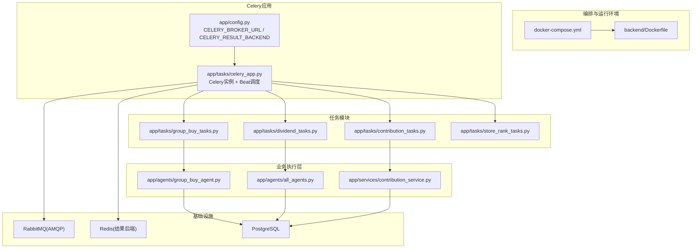
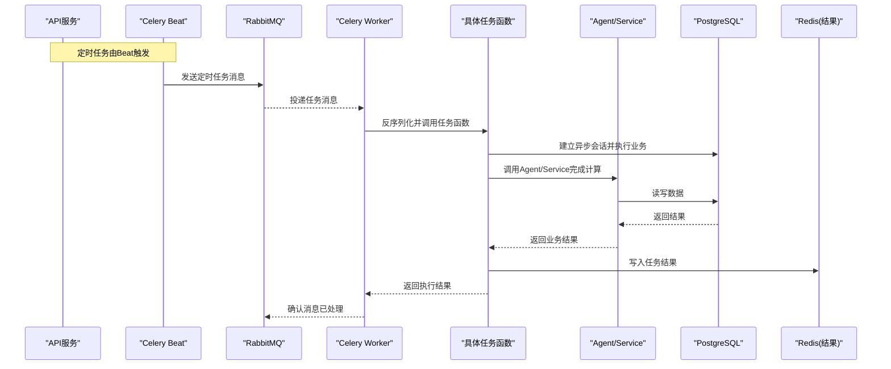
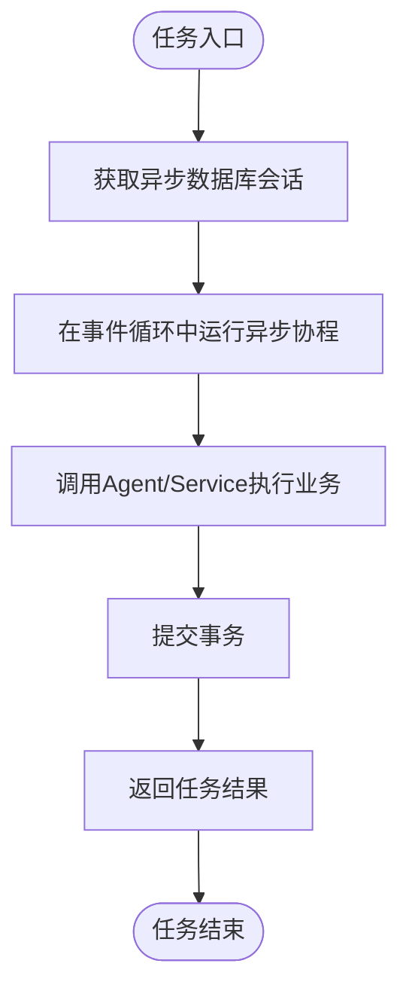
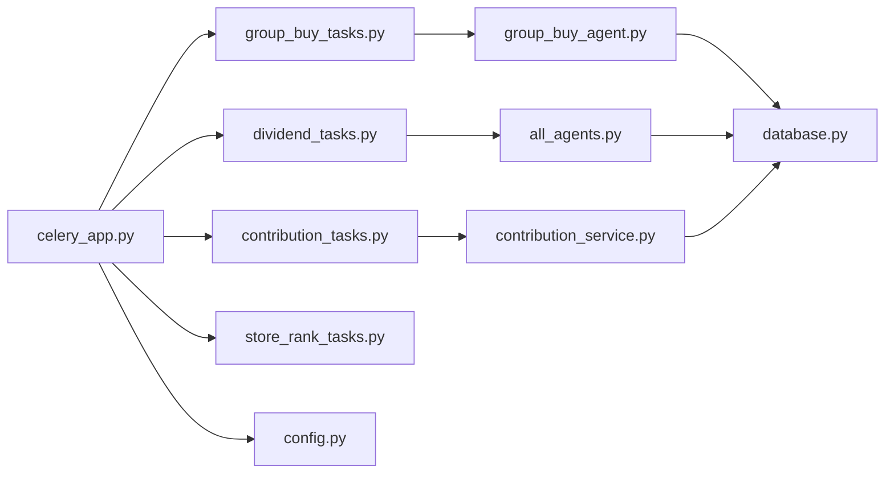

# 异步任务处理

<cite>
**本文引用的文件**
- [backend/app/tasks/celery_app.py](file://backend/app/tasks/celery_app.py)
- [backend/app/tasks/group_buy_tasks.py](file://backend/app/tasks/group_buy_tasks.py)
- [backend/app/tasks/contribution_tasks.py](file://backend/app/tasks/contribution_tasks.py)
- [backend/app/tasks/dividend_tasks.py](file://backend/app/tasks/dividend_tasks.py)
- [backend/app/tasks/store_rank_tasks.py](file://backend/app/tasks/store_rank_tasks.py)
- [backend/app/config.py](file://backend/app/config.py)
- [backend/app/database.py](file://backend/app/database.py)
- [backend/app/agents/group_buy_agent.py](file://backend/app/agents/group_buy_agent.py)
- [backend/app/agents/all_agents.py](file://backend/app/agents/all_agents.py)
- [backend/app/services/contribution_service.py](file://backend/app/services/contribution_service.py)
- [docker-compose.yml](file://docker-compose.yml)
- [backend/Dockerfile](file://backend/Dockerfile)
- [backend/requirements.txt](file://backend/requirements.txt)
</cite>

## 目录
1. [简介](#简介)
2. [项目结构](#项目结构)
3. [核心组件](#核心组件)
4. [架构总览](#架构总览)
5. [详细组件分析](#详细组件分析)
6. [依赖关系分析](#依赖关系分析)
7. [性能考虑](#性能考虑)
8. [故障排查指南](#故障排查指南)
9. [结论](#结论)
10. [附录](#附录)

## 简介
本文件面向AIxingmu系统的异步任务处理子系统，围绕Celery任务队列的消息传递机制、任务状态与结果存储、调度策略（定时/延迟/优先级）、监控与日志、以及故障恢复进行系统化说明。系统采用RabbitMQ作为消息代理、Redis作为结果后端，结合Celery Beat实现定时任务调度；业务逻辑通过Agent与服务层解耦，在Worker中以同步包装器执行异步代码，确保与数据库会话的正确生命周期管理。

## 项目结构
异步任务相关代码集中在 backend/app/tasks 目录下，按业务域拆分任务模块；Celery应用初始化与Beat调度配置位于 celery_app.py；Docker编排中定义了API服务、Worker与Beat容器，分别负责发布任务、消费任务与调度任务。

图表来源
- [docker-compose.yml:72-95](file://docker-compose.yml#L72-L95)
- [backend/Dockerfile:10-12](file://backend/Dockerfile#L10-L12)
- [backend/app/config.py:24-26](file://backend/app/config.py#L24-L26)
- [backend/app/tasks/celery_app.py:9-21](file://backend/app/tasks/celery_app.py#L9-L21)
- [backend/app/tasks/group_buy_tasks.py:17-27](file://backend/app/tasks/group_buy_tasks.py#L17-L27)
- [backend/app/tasks/contribution_tasks.py:15-28](file://backend/app/tasks/contribution_tasks.py#L15-L28)
- [backend/app/tasks/dividend_tasks.py:15-25](file://backend/app/tasks/dividend_tasks.py#L15-L25)
- [backend/app/tasks/store_rank_tasks.py:15-28](file://backend/app/tasks/store_rank_tasks.py#L15-L28)
- [backend/app/agents/group_buy_agent.py:15-66](file://backend/app/agents/group_buy_agent.py#L15-L66)
- [backend/app/agents/all_agents.py:52-62](file://backend/app/agents/all_agents.py#L52-L62)
- [backend/app/services/contribution_service.py:163-240](file://backend/app/services/contribution_service.py#L163-L240)

章节来源
- [backend/app/tasks/celery_app.py:1-56](file://backend/app/tasks/celery_app.py#L1-L56)
- [backend/app/config.py:24-26](file://backend/app/config.py#L24-L26)
- [docker-compose.yml:72-95](file://docker-compose.yml#L72-L95)

## 核心组件
- Celery应用与配置：定义Broker与Result Backend、序列化格式与时区等全局参数。
- 定时任务调度（Beat）：集中声明周期性任务及其crontab表达式。
- 任务模块：按业务域组织任务函数，封装异步执行上下文与数据库会话。
- Agent与服务层：将复杂业务逻辑抽象为可复用的Agent或服务方法，供任务调用。
- 运行时编排：通过Docker Compose启动API、Worker与Beat，统一环境变量注入。

章节来源
- [backend/app/tasks/celery_app.py:9-21](file://backend/app/tasks/celery_app.py#L9-L21)
- [backend/app/tasks/celery_app.py:24-55](file://backend/app/tasks/celery_app.py#L24-L55)
- [backend/app/tasks/group_buy_tasks.py:17-53](file://backend/app/tasks/group_buy_tasks.py#L17-L53)
- [backend/app/tasks/contribution_tasks.py:15-28](file://backend/app/tasks/contribution_tasks.py#L15-L28)
- [backend/app/tasks/dividend_tasks.py:15-25](file://backend/app/tasks/dividend_tasks.py#L15-L25)
- [backend/app/tasks/store_rank_tasks.py:15-28](file://backend/app/tasks/store_rank_tasks.py#L15-L28)
- [backend/app/agents/group_buy_agent.py:15-66](file://backend/app/agents/group_buy_agent.py#L15-L66)
- [backend/app/agents/all_agents.py:52-62](file://backend/app/agents/all_agents.py#L52-L62)
- [backend/app/services/contribution_service.py:163-240](file://backend/app/services/contribution_service.py#L163-L240)
- [docker-compose.yml:72-95](file://docker-compose.yml#L72-L95)

## 架构总览
下图展示从任务发布到Worker消费的端到端流程，包括消息路由、结果存储与数据库交互。

图表来源
- [backend/app/tasks/celery_app.py:24-55](file://backend/app/tasks/celery_app.py#L24-L55)
- [backend/app/tasks/group_buy_tasks.py:17-53](file://backend/app/tasks/group_buy_tasks.py#L17-L53)
- [backend/app/tasks/contribution_tasks.py:15-28](file://backend/app/tasks/contribution_tasks.py#L15-L28)
- [backend/app/tasks/dividend_tasks.py:15-25](file://backend/app/tasks/dividend_tasks.py#L15-L25)
- [backend/app/tasks/store_rank_tasks.py:15-28](file://backend/app/tasks/store_rank_tasks.py#L15-L28)
- [backend/app/agents/group_buy_agent.py:15-66](file://backend/app/agents/group_buy_agent.py#L15-L66)
- [backend/app/agents/all_agents.py:52-62](file://backend/app/agents/all_agents.py#L52-L62)
- [backend/app/services/contribution_service.py:163-240](file://backend/app/services/contribution_service.py#L163-L240)
- [backend/app/database.py:17-21](file://backend/app/database.py#L17-L21)
- [backend/app/config.py:24-26](file://backend/app/config.py#L24-L26)

## 详细组件分析

### Celery应用与配置
- 应用初始化：创建Celery实例，设置名称、Broker与Result Backend。
- 全局配置：时区、序列化格式、接受内容类型等。
- Beat调度：集中声明多个周期性任务的crontab规则，覆盖拼团场次创建、结算、过期检查、贡献值周度结算、门店月度分红等。

章节来源
- [backend/app/tasks/celery_app.py:9-21](file://backend/app/tasks/celery_app.py#L9-L21)
- [backend/app/tasks/celery_app.py:24-55](file://backend/app/tasks/celery_app.py#L24-L55)
- [backend/app/config.py:24-26](file://backend/app/config.py#L24-L26)

### 任务模块与异步执行模式
- 通用模式：每个任务函数内部使用事件循环包装器在同步上下文中运行异步代码，获取异步数据库会话，执行业务后提交事务并返回结果。
- 典型任务：
  - 拼团任务：每日创建场次、每小时检查并结算已满场次、每日检查过期场次。
  - 贡献值任务：每日凌晨累计，周一发放消费券。
  - 分红任务：每周一全网贡献值分红。
  - 门店排名任务：每月1日统计上月业绩并阶梯分红。

图表来源
- [backend/app/tasks/group_buy_tasks.py:8-27](file://backend/app/tasks/group_buy_tasks.py#L8-L27)
- [backend/app/tasks/contribution_tasks.py:7-28](file://backend/app/tasks/contribution_tasks.py#L7-L28)
- [backend/app/tasks/dividend_tasks.py:7-25](file://backend/app/tasks/dividend_tasks.py#L7-L25)
- [backend/app/tasks/store_rank_tasks.py:7-28](file://backend/app/tasks/store_rank_tasks.py#L7-L28)
- [backend/app/database.py:17-21](file://backend/app/database.py#L17-L21)

章节来源
- [backend/app/tasks/group_buy_tasks.py:17-53](file://backend/app/tasks/group_buy_tasks.py#L17-L53)
- [backend/app/tasks/contribution_tasks.py:15-28](file://backend/app/tasks/contribution_tasks.py#L15-L28)
- [backend/app/tasks/dividend_tasks.py:15-25](file://backend/app/tasks/dividend_tasks.py#L15-L25)
- [backend/app/tasks/store_rank_tasks.py:15-28](file://backend/app/tasks/store_rank_tasks.py#L15-L28)

### 任务状态跟踪与结果存储
- 结果后端：使用Redis作为结果存储，任务完成后将结果写入Redis，便于查询。
- 状态查询：可通过任务ID查询任务状态与结果（成功/失败/进行中）。
- 失败重试与超时：当前代码未显式配置重试与超时策略，可在Celery配置中补充以增强健壮性。

章节来源
- [backend/app/config.py:24-26](file://backend/app/config.py#L24-L26)
- [backend/app/tasks/celery_app.py:9-21](file://backend/app/tasks/celery_app.py#L9-L21)

### 调度策略（定时/延迟/优先级）
- 定时任务：通过Beat的crontab表达式实现，如每日9:50创建场次、每小时第5分钟结算、每日23:00检查过期、每周一凌晨2:00分红、每日凌晨3:00贡献值核算、每月1日凌晨1:00门店分红。
- 延迟任务：当前仓库未包含延迟任务示例，可按需扩展。
- 优先级任务：当前仓库未配置队列与优先级策略，可按需引入多队列或优先级队列。

章节来源
- [backend/app/tasks/celery_app.py:24-55](file://backend/app/tasks/celery_app.py#L24-L55)

### 任务监控与日志记录
- 日志级别：Worker与Beat均以info级别输出日志，便于观察任务执行情况。
- 监控建议：结合RabbitMQ管理界面与Redis键空间观察任务积压与结果缓存；对关键任务增加结构化日志与指标上报。

章节来源
- [docker-compose.yml:75-89](file://docker-compose.yml#L75-L89)

### 故障恢复机制
- 事务一致性：任务内使用异步会话并在业务完成后提交事务，异常路径应回滚以避免数据不一致。
- 幂等性：建议在任务入口处加入幂等校验（如基于订单/场次ID的去重），避免重复消费导致副作用。
- 重试与补偿：建议为易失败的外部依赖或网络调用配置重试策略，并对长时间运行的任务设置超时保护。

章节来源
- [backend/app/database.py:17-21](file://backend/app/database.py#L17-L21)
- [backend/app/tasks/group_buy_tasks.py:30-40](file://backend/app/tasks/group_buy_tasks.py#L30-L40)

## 依赖关系分析
- 外部依赖：RabbitMQ用于消息路由，Redis用于结果存储，PostgreSQL用于持久化数据。
- 内部依赖：任务模块依赖Agent与服务层；Agent与服务层依赖数据库模型与配置。
- 部署依赖：Docker Compose统一编排各组件，保证依赖顺序与健康检查。

图表来源
- [backend/app/tasks/celery_app.py:9-21](file://backend/app/tasks/celery_app.py#L9-L21)
- [backend/app/tasks/group_buy_tasks.py:17-53](file://backend/app/tasks/group_buy_tasks.py#L17-L53)
- [backend/app/tasks/contribution_tasks.py:15-28](file://backend/app/tasks/contribution_tasks.py#L15-L28)
- [backend/app/tasks/dividend_tasks.py:15-25](file://backend/app/tasks/dividend_tasks.py#L15-L25)
- [backend/app/tasks/store_rank_tasks.py:15-28](file://backend/app/tasks/store_rank_tasks.py#L15-L28)
- [backend/app/agents/group_buy_agent.py:15-66](file://backend/app/agents/group_buy_agent.py#L15-L66)
- [backend/app/agents/all_agents.py:52-62](file://backend/app/agents/all_agents.py#L52-L62)
- [backend/app/services/contribution_service.py:163-240](file://backend/app/services/contribution_service.py#L163-L240)
- [backend/app/database.py:17-21](file://backend/app/database.py#L17-L21)
- [backend/app/config.py:24-26](file://backend/app/config.py#L24-L26)

章节来源
- [backend/requirements.txt:15-18](file://backend/requirements.txt#L15-L18)
- [docker-compose.yml:72-95](file://docker-compose.yml#L72-L95)

## 性能考虑
- 并发与资源隔离：根据任务类型划分队列（如高优先级的结算任务与低优先级的报表任务），配合不同数量的Worker实例提升吞吐。
- 数据库连接池：合理设置连接池大小与溢出上限，避免在高并发下出现连接耗尽。
- 结果存储优化：对大结果集采用压缩或分片存储，减少Redis内存压力。
- 批处理与去重：对批量任务采用分批处理与去重策略，降低数据库写放大。
- 监控与告警：对任务耗时、失败率、队列长度设置阈值告警，及时发现瓶颈。

[本节为通用指导，不直接分析具体文件]

## 故障排查指南
- 常见问题定位：
  - 任务未执行：检查Beat是否正常运行、RabbitMQ连接是否正常、任务名是否正确注册。
  - 结果无法查询：确认Redis连通性与键空间是否被清理。
  - 数据库异常：查看任务日志中的SQL错误与事务提交情况。
- 日志与调试：
  - 提高日志级别至debug，捕获更详细的执行轨迹。
  - 在Agent与服务层的关键分支添加结构化日志，便于追踪。
- 恢复策略：
  - 对失败任务启用重试与退避策略。
  - 对长耗时任务设置超时，防止阻塞Worker。
  - 引入幂等键与补偿任务，保障最终一致性。

章节来源
- [docker-compose.yml:75-89](file://docker-compose.yml#L75-L89)
- [backend/app/database.py:17-21](file://backend/app/database.py#L17-L21)

## 结论
AIxingmu的异步任务处理以Celery为核心，结合RabbitMQ与Redis构建稳定可靠的任务管道。通过Beat实现精细化定时调度，任务模块与Agent/Service层解耦清晰，便于扩展与维护。当前版本聚焦于定时任务与基础结果存储，后续可引入延迟任务、优先级队列、重试与超时策略，并完善监控与告警体系，以提升整体可靠性与可观测性。

[本节为总结性内容，不直接分析具体文件]

## 附录
- 关键任务清单与调度时间：
  - 每日9:50创建当日拼团场次
  - 每小时第5分钟检查并结算已满场次
  - 每日23:00检查过期场次
  - 每周一凌晨2:00执行全网贡献值分红
  - 每日凌晨3:00执行贡献值递减兑换核算
  - 每月1日凌晨1:00执行门店月度排名与分红

章节来源
- [backend/app/tasks/celery_app.py:24-55](file://backend/app/tasks/celery_app.py#L24-L55)